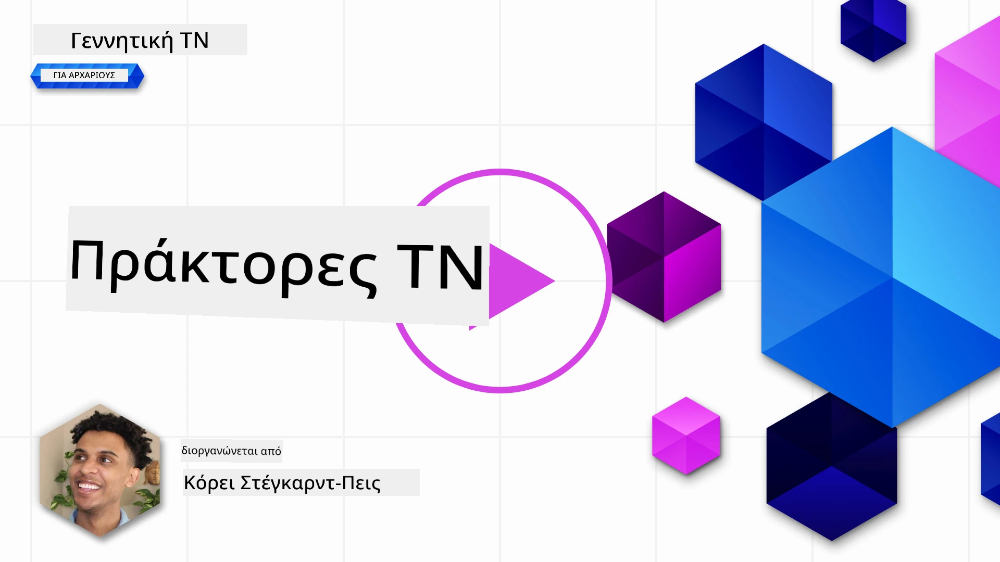
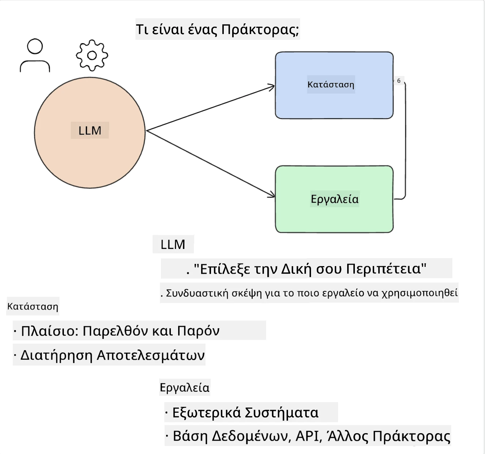
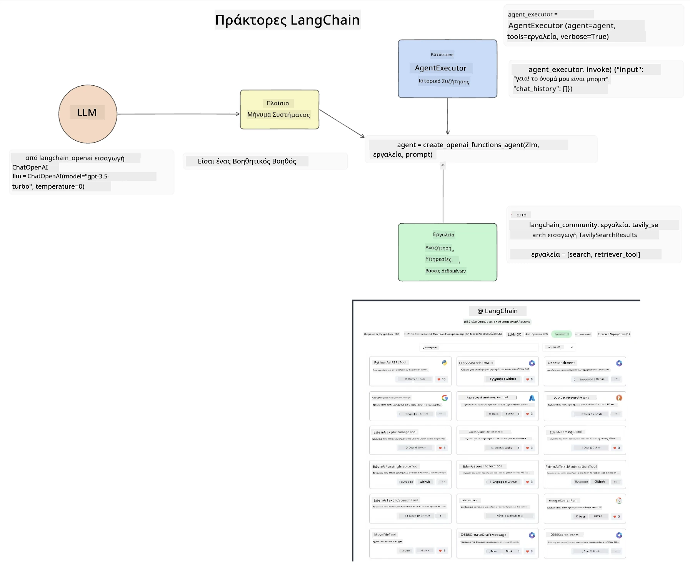
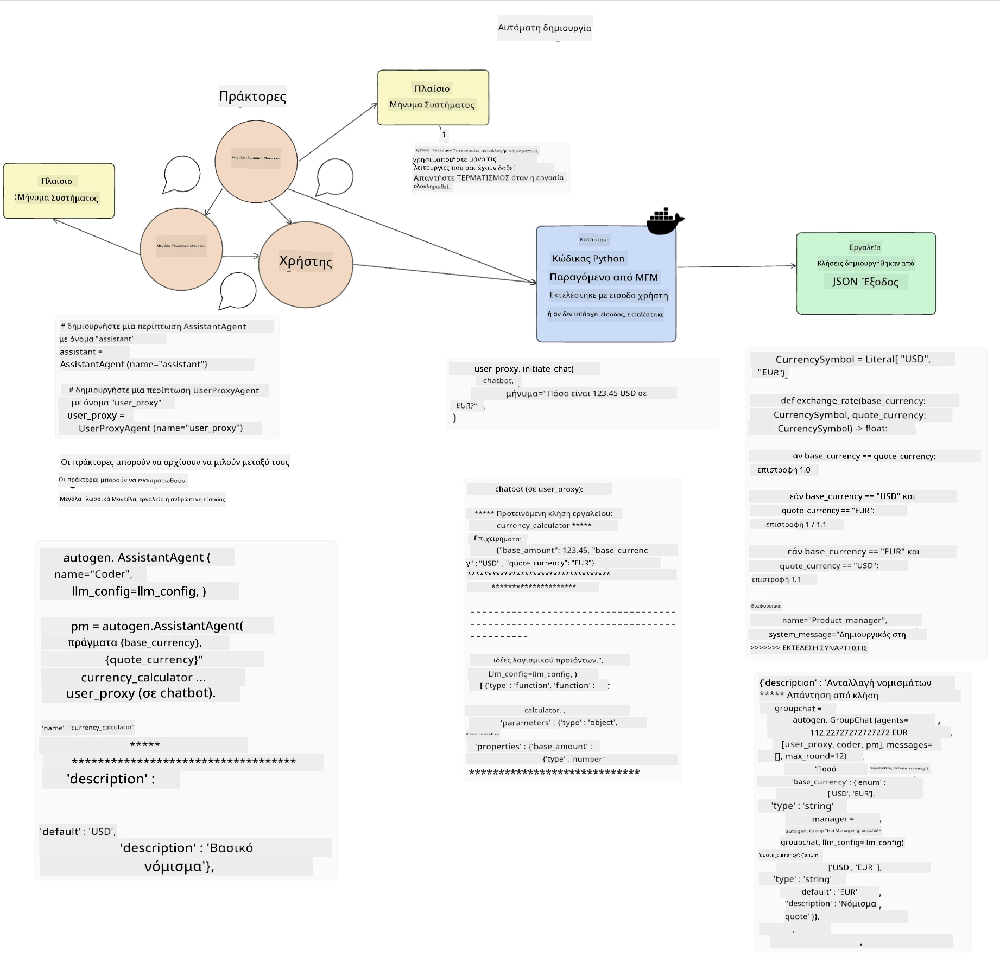
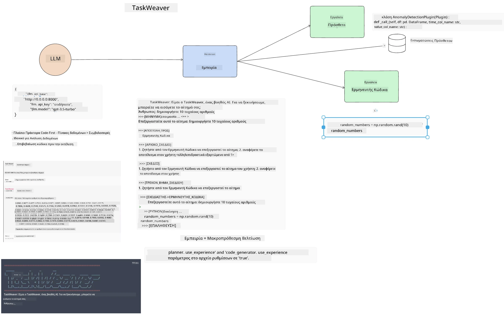
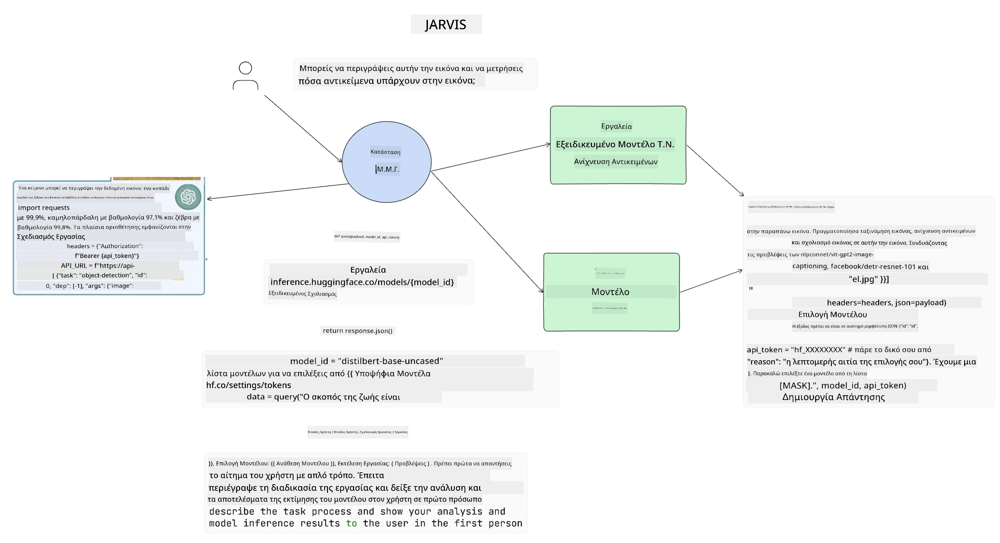

[](https://youtu.be/yAXVW-lUINc?si=bOtW9nL6jc3XJgOM)

## Εισαγωγή

Οι Πράκτορες Τεχνητής Νοημοσύνης αποτελούν μια συναρπαστική εξέλιξη στην Γενετική Τεχνητή Νοημοσύνη, επιτρέποντας στα Μεγάλα Γλωσσικά Μοντέλα (LLMs) να εξελιχθούν από βοηθούς σε πράκτορες ικανούς να αναλαμβάνουν δράσεις. Τα πλαίσια Πρακτόρων Τεχνητής Νοημοσύνης δίνουν τη δυνατότητα στους προγραμματιστές να δημιουργήσουν εφαρμογές που παρέχουν στα LLMs πρόσβαση σε εργαλεία και διαχείριση κατάστασης. Αυτά τα πλαίσια επίσης βελτιώνουν την ορατότητα, επιτρέποντας στους χρήστες και τους προγραμματιστές να παρακολουθούν τις ενέργειες που σχεδιάζονται από τα LLMs, βελτιώνοντας έτσι τη διαχείριση της εμπειρίας.

Το μάθημα θα καλύψει τους ακόλουθους τομείς:

- Κατανόηση του τι είναι ένας Πράκτορας Τεχνητής Νοημοσύνης - Τι ακριβώς είναι ένας Πράκτορας Τεχνητής Νοημοσύνης;
- Εξερεύνηση τεσσάρων διαφορετικών Πλαισίων Πρακτόρων Τεχνητής Νοημοσύνης - Τι τα καθιστά μοναδικά;
- Εφαρμογή αυτών των Πρακτόρων σε διαφορετικές περιπτώσεις χρήσης - Πότε πρέπει να χρησιμοποιούμε Πράκτορες Τεχνητής Νοημοσύνης;

## Στόχοι μάθησης

Μετά την ολοκλήρωση αυτού του μαθήματος, θα μπορείτε να:

- Εξηγήσετε τι είναι οι Πράκτορες Τεχνητής Νοημοσύνης και πώς μπορούν να χρησιμοποιηθούν.
- Έχετε μια κατανόηση των διαφορών μεταξύ ορισμένων από τα δημοφιλή Πλαίσια Πρακτόρων Τεχνητής Νοημοσύνης και πώς διαφέρουν.
- Καταλάβετε πώς λειτουργούν οι Πράκτορες Τεχνητής Νοημοσύνης προκειμένου να δημιουργήσετε εφαρμογές με αυτούς.

## Τι είναι οι Πράκτορες Τεχνητής Νοημοσύνης;

Οι Πράκτορες Τεχνητής Νοημοσύνης είναι ένας πολύ συναρπαστικός τομέας στον κόσμο της Γενετικής Τεχνητής Νοημοσύνης. Μαζί με αυτόν τον ενθουσιασμό υπάρχει και σημεία σύγχυσης όσον αφορά τους όρους και την εφαρμογή τους. Για να κρατήσουμε τα πράγματα απλά και να συμπεριλάβουμε τα περισσότερα από τα εργαλεία που αναφέρονται ως Πράκτορες Τεχνητής Νοημοσύνης, θα χρησιμοποιήσουμε τον εξής ορισμό:

Οι Πράκτορες Τεχνητής Νοημοσύνης επιτρέπουν στα Μεγάλα Γλωσσικά Μοντέλα (LLMs) να εκτελούν εργασίες δίνοντάς τους πρόσβαση σε μια **κατάσταση** και **εργαλεία**.



Ας ορίσουμε αυτούς τους όρους:

**Μεγάλα Γλωσσικά Μοντέλα** - Αυτά είναι τα μοντέλα που αναφέρονται σε όλο το μάθημα όπως GPT-3.5, GPT-4, Llama-2, κλπ.

**Κατάσταση** - Αναφέρεται στο πλαίσιο μέσα στο οποίο λειτουργεί το LLM. Το LLM χρησιμοποιεί το πλαίσιο των προηγούμενων ενεργειών του και το τρέχον πλαίσιο, καθοδηγώντας τη λήψη αποφάσεών του για τις επόμενες ενέργειες. Τα Πλαίσια Πρακτόρων Τεχνητής Νοημοσύνης επιτρέπουν στους προγραμματιστές να διατηρούν αυτό το πλαίσιο πιο εύκολα.

**Εργαλεία** - Για να ολοκληρώσει την εργασία που ζήτησε ο χρήστης και που σχεδίασε το LLM, το LLM χρειάζεται πρόσβαση σε εργαλεία. Παραδείγματα εργαλείων μπορεί να είναι μια βάση δεδομένων, ένα API, μια εξωτερική εφαρμογή ή ακόμη και άλλο LLM!

Αυτοί οι ορισμοί ελπίζουμε να σας δώσουν μια καλή βάση καθώς εξετάζουμε πώς υλοποιούνται. Ας εξερευνήσουμε μερικά διαφορετικά πλαίσια Πρακτόρων Τεχνητής Νοημοσύνης:

## Πράκτορες LangChain

Οι [Πράκτορες LangChain](https://python.langchain.com/docs/how_to/#agents?WT.mc_id=academic-105485-koreyst) αποτελούν μια υλοποίηση των ορισμών που δώσαμε παραπάνω.

Για να διαχειριστεί την **κατάσταση**, χρησιμοποιεί μια ενσωματωμένη λειτουργία που ονομάζεται `AgentExecutor`. Αυτή δέχεται τον ορισμένο `agent` και τα `εργαλεία` που είναι διαθέσιμα σ’ αυτόν.

Ο `AgentExecutor` επίσης αποθηκεύει το ιστορικό συνομιλίας ώστε να παρέχει το πλαίσιο της συνομιλίας.



Το LangChain προσφέρει έναν [κατάλογο εργαλείων](https://integrations.langchain.com/tools?WT.mc_id=academic-105485-koreyst) που μπορούν να εισαχθούν στην εφαρμογή σας και στα οποία το LLM μπορεί να αποκτήσει πρόσβαση. Αυτά δημιουργούνται από την κοινότητα και από την ομάδα του LangChain.

Στη συνέχεια μπορείτε να ορίσετε αυτά τα εργαλεία και να τα περάσετε στον `AgentExecutor`.

Η ορατότητα είναι μια άλλη σημαντική πτυχή όταν μιλάμε για Πράκτορες Τεχνητής Νοημοσύνης. Είναι σημαντικό για τους προγραμματιστές εφαρμογών να κατανοήσουν ποιο εργαλείο χρησιμοποιεί το LLM και γιατί. Γι’ αυτό, η ομάδα του LangChain ανέπτυξε το LangSmith.

## AutoGen

Το επόμενο πλαίσιο Πρακτόρων Τεχνητής Νοημοσύνης που θα συζητήσουμε είναι το [AutoGen](https://microsoft.github.io/autogen/?WT.mc_id=academic-105485-koreyst). Ο κύριος στόχος του AutoGen είναι οι συνομιλίες. Οι πράκτορες είναι τόσο **ικανoί συνομιλητές** όσο και **προσαρμόσιμοι**.

**Ικανοί συνομιλητές -** Τα LLMs μπορούν να ξεκινήσουν και να συνεχίσουν μια συνομιλία με άλλο LLM για να ολοκληρώσουν μια εργασία. Αυτό επιτυγχάνεται δημιουργώντας `AssistantAgents` και δίνοντάς τους ένα συγκεκριμένο μήνυμα συστήματος.

```python

autogen.AssistantAgent( name="Coder", llm_config=llm_config, ) pm = autogen.AssistantAgent( name="Product_manager", system_message="Creative in software product ideas.", llm_config=llm_config, )

```

**Προσαρμόσιμοι** - Οι πράκτορες μπορούν να οριστούν όχι μόνο ως LLMs αλλά και ως χρήστης ή εργαλείο. Ως προγραμματιστής, μπορείτε να ορίσετε έναν `UserProxyAgent` ο οποίος είναι υπεύθυνος για την αλληλεπίδραση με τον χρήστη για ανατροφοδότηση στην ολοκλήρωση μιας εργασίας. Αυτή η ανατροφοδότηση μπορεί είτε να συνεχίσει την εκτέλεση της εργασίας είτε να τη σταματήσει.

```python
user_proxy = UserProxyAgent(name="user_proxy")
```

### Κατάσταση και Εργαλεία

Για να αλλάξει και να διαχειριστεί την κατάσταση, ένας βοηθητικός Πράκτορας δημιουργεί κώδικα Python για να ολοκληρώσει την εργασία.

Ακολουθεί ένα παράδειγμα της διαδικασίας:



#### LLM ορισμένο με μήνυμα συστήματος

```python
system_message="For weather related tasks, only use the functions you have been provided with. Reply TERMINATE when the task is done."
```

Αυτό το μήνυμα συστήματος καθοδηγεί το συγκεκριμένο LLM σχετικά με το ποιες λειτουργίες είναι σχετικές για την εργασία του. Θυμηθείτε, με το AutoGen μπορείτε να έχετε πολλαπλούς ορισμένους AssistantAgents με διαφορετικά μηνύματα συστήματος.

#### Η συνομιλία ξεκινά από τον χρήστη

```python
user_proxy.initiate_chat( chatbot, message="I am planning a trip to NYC next week, can you help me pick out what to wear? ", )

```

Αυτό το μήνυμα από το user_proxy (Άνθρωπος) είναι που θα ξεκινήσει τη διαδικασία του Πράκτορα για να εξερευνήσει τις πιθανές λειτουργίες που πρέπει να εκτελέσει.

#### Εκτέλεση λειτουργίας

```bash
chatbot (to user_proxy):

***** Suggested tool Call: get_weather ***** Arguments: {"location":"New York City, NY","time_periond:"7","temperature_unit":"Celsius"} ******************************************************** --------------------------------------------------------------------------------

>>>>>>>> EXECUTING FUNCTION get_weather... user_proxy (to chatbot): ***** Response from calling function "get_weather" ***** 112.22727272727272 EUR ****************************************************************

```

Μόλις επεξεργαστεί η αρχική συνομιλία, ο Πράκτορας θα στείλει την προτεινόμενη λειτουργία για κλήση. Στην περίπτωση αυτή, είναι μια λειτουργία που ονομάζεται `get_weather`. Ανάλογα με τη ρύθμισή σας, αυτή η λειτουργία μπορεί να εκτελεστεί αυτόματα και να διαβαστεί από τον Πράκτορα ή μπορεί να εκτελεστεί με βάση την είσοδο του χρήστη.

Μπορείτε να βρείτε μια λίστα με [δείγματα κώδικα AutoGen](https://microsoft.github.io/autogen/docs/Examples/?WT.mc_id=academic-105485-koreyst) για να εξερευνήσετε περαιτέρω πώς να ξεκινήσετε την κατασκευή.

## Taskweaver

Το επόμενο πλαίσιο πρακτόρων που θα εξερευνήσουμε είναι το [Taskweaver](https://microsoft.github.io/TaskWeaver/?WT.mc_id=academic-105485-koreyst). Είναι γνωστό ως ένας πράκτορας "code-first" γιατί αντί να εργάζεται αυστηρά με `strings`, μπορεί να δουλέψει με DataFrames σε Python. Αυτό είναι εξαιρετικά χρήσιμο για εργασίες ανάλυσης δεδομένων και δημιουργίας. Αυτές μπορεί να είναι πράγματα όπως η δημιουργία γραφημάτων και διαγραμμάτων ή η παραγωγή τυχαίων αριθμών.

### Κατάσταση και Εργαλεία

Για να διαχειριστεί την κατάσταση της συνομιλίας, το TaskWeaver χρησιμοποιεί το concept του `Planner`. Ο `Planner` είναι ένα LLM που λαμβάνει το αίτημα από τους χρήστες και σχεδιάζει τις εργασίες που πρέπει να ολοκληρωθούν για να ικανοποιηθεί αυτό το αίτημα.

Για να ολοκληρώσει τις εργασίες, ο `Planner` έχει πρόσβαση στη συλλογή εργαλείων που ονομάζονται `Plugins`. Αυτά μπορεί να είναι κλάσεις Python ή ένας γενικός διερμηνέας κώδικα. Αυτά τα plugins αποθηκεύονται ως embeddings έτσι ώστε το LLM να μπορεί καλύτερα να βρει το σωστό plugin.



Ακολουθεί ένα παράδειγμα plugin για τον χειρισμό ανίχνευσης ανωμαλιών:

```python
class AnomalyDetectionPlugin(Plugin): def __call__(self, df: pd.DataFrame, time_col_name: str, value_col_name: str):
```

Ο κώδικας ελέγχεται πριν εκτελεστεί. Μια άλλη λειτουργία για τη διαχείριση του πλαισίου στο Taskweaver είναι η `experience`. Η εμπειρία επιτρέπει το πλαίσιο μιας συνομιλίας να αποθηκεύεται μακροπρόθεσμα σε ένα αρχείο YAML. Αυτό μπορεί να ρυθμιστεί ώστε το LLM να βελτιώνεται με το χρόνο σε ορισμένες εργασίες, δεδομένου ότι εκτίθεται σε προηγούμενες συνομιλίες.

## JARVIS

Το τελευταίο πλαίσιο πρακτόρων που θα εξερευνήσουμε είναι το [JARVIS](https://github.com/microsoft/JARVIS?tab=readme-ov-file&WT.mc_id=academic-105485-koreyst). Το στοιχείο που καθιστά μοναδικό το JARVIS είναι ότι χρησιμοποιεί ένα LLM για να διαχειρίζεται την `κατάσταση` της συνομιλίας και τα `εργαλεία` είναι άλλα μοντέλα τεχνητής νοημοσύνης. Κάθε μοντέλο AI είναι εξειδικευμένο σε συγκεκριμένες εργασίες όπως ανίχνευση αντικειμένων, μεταγραφή ή σχολιασμό εικόνων.



Το LLM, ως γενικού σκοπού μοντέλο, λαμβάνει το αίτημα από τον χρήστη και εντοπίζει την συγκεκριμένη εργασία και οποιαδήποτε δεδομένα/παράμετροι απαιτούνται για να ολοκληρωθεί η εργασία.

```python
[{"task": "object-detection", "id": 0, "dep": [-1], "args": {"image": "e1.jpg" }}]
```

Το LLM στη συνέχεια μορφοποιεί το αίτημα με τέτοιο τρόπο που το εξειδικευμένο μοντέλο AI να μπορεί να το ερμηνεύσει, όπως σε JSON. Μόλις το AI μοντέλο επιστρέψει την πρόβλεψή του βασισμένο στην εργασία, το LLM λαμβάνει την απόκριση.

Αν απαιτούνται πολλαπλά μοντέλα για την ολοκλήρωση της εργασίας, το LLM θα ερμηνεύσει επίσης τις απαντήσεις από αυτά τα μοντέλα πριν τις ενώσει και παραγάγει την απόκριση προς τον χρήστη.

Το παρακάτω παράδειγμα δείχνει πώς θα λειτουργούσε όταν ένας χρήστης ζητά περιγραφή και καταμέτρηση των αντικειμένων σε μια εικόνα:

## Ανάθεση

Για να συνεχίσετε την εκμάθησή σας για τους Πράκτορες Τεχνητής Νοημοσύνης μπορείτε να δημιουργήσετε με το AutoGen:

- Μια εφαρμογή που προσομοιώνει μια επαγγελματική συνάντηση με διαφορετικά τμήματα μιας εταιρείας εκπαίδευσης startup.
- Δημιουργήστε μηνύματα συστήματος που καθοδηγούν τα LLMs στην κατανόηση διαφορετικών προσώπων και προτεραιοτήτων και επιτρέπουν στον χρήστη να προτείνει μια νέα ιδέα προϊόντος.
- Το LLM θα πρέπει στη συνέχεια να δημιουργήσει επακόλουθες ερωτήσεις από κάθε τμήμα για να βελτιώσει και να βελτιώσει την πρόταση και την ιδέα του προϊόντος.

## Η μάθηση δεν σταματά εδώ, συνεχίστε το ταξίδι

Μετά την ολοκλήρωση αυτού του μαθήματος, δείτε τη [συλλογή εκμάθησης Γενετικής Τεχνητής Νοημοσύνης](https://aka.ms/genai-collection?WT.mc_id=academic-105485-koreyst) για να συνεχίσετε να αναβαθμίζετε τις γνώσεις σας στην Γενετική Τεχνητή Νοημοσύνη!

---

<!-- CO-OP TRANSLATOR DISCLAIMER START -->
**Αποποίηση ευθυνών**:  
Αυτό το έγγραφο έχει μεταφραστεί χρησιμοποιώντας την υπηρεσία αυτόματης μετάφρασης AI [Co-op Translator](https://github.com/Azure/co-op-translator). Παρόλο που προσπαθούμε για ακρίβεια, παρακαλούμε να έχετε υπόψη ότι οι αυτοματοποιημένες μεταφράσεις ενδέχεται να περιέχουν σφάλματα ή ανακρίβειες. Το πρωτότυπο έγγραφο στη μητρική του γλώσσα πρέπει να θεωρείται η αυθεντική πηγή. Για κρίσιμες πληροφορίες, συνιστάται η επαγγελματική ανθρώπινη μετάφραση. Δεν ευθυνόμαστε για τυχόν παρεξηγήσεις ή λανθασμένες ερμηνείες που προκύπτουν από τη χρήση αυτής της μετάφρασης.
<!-- CO-OP TRANSLATOR DISCLAIMER END -->