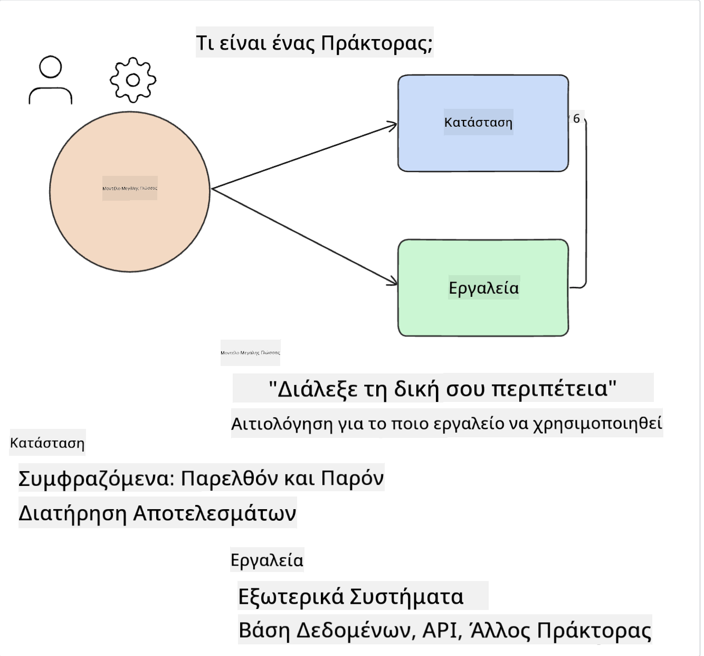
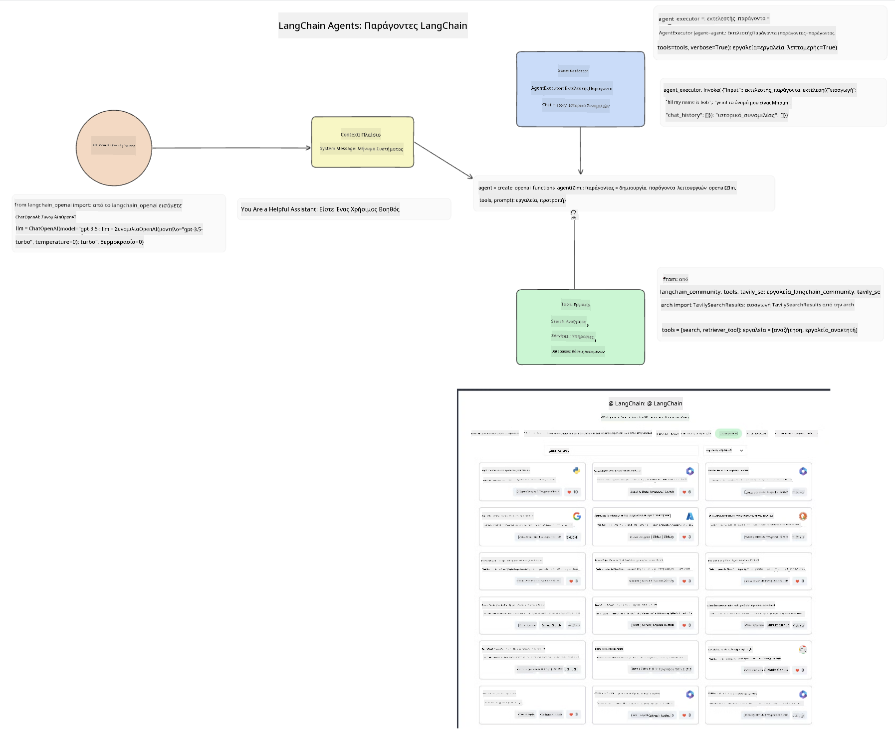
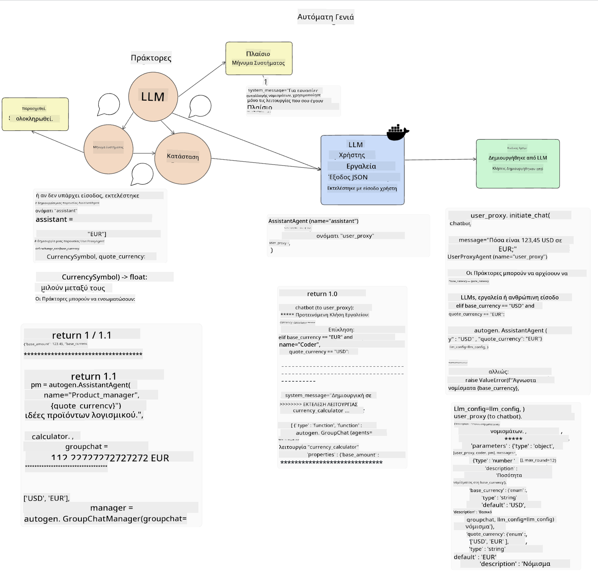
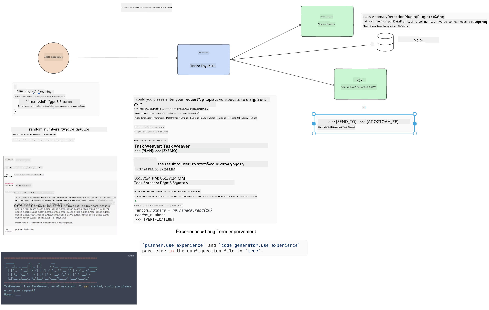
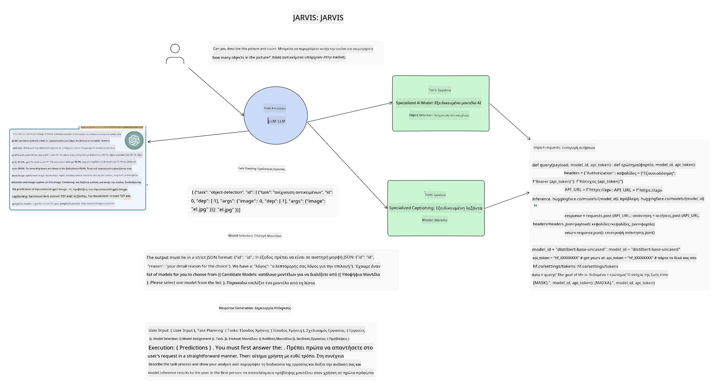

<!--
CO_OP_TRANSLATOR_METADATA:
{
  "original_hash": "11f03c81f190d9cbafd0f977dcbede6c",
  "translation_date": "2025-06-26T00:17:56+00:00",
  "source_file": "17-ai-agents/README.md",
  "language_code": "el"
}
-->
[](https://aka.ms/gen-ai-lesson17-gh?WT.mc_id=academic-105485-koreyst)

## Εισαγωγή

Οι Πράκτορες Τεχνητής Νοημοσύνης (AI Agents) αποτελούν μια συναρπαστική εξέλιξη στη Γενετική Τεχνητή Νοημοσύνη, επιτρέποντας στα Μεγάλα Γλωσσικά Μοντέλα (LLMs) να εξελίσσονται από βοηθούς σε πράκτορες ικανούς να αναλαμβάνουν δράσεις. Τα πλαίσια AI Agent επιτρέπουν στους προγραμματιστές να δημιουργούν εφαρμογές που δίνουν στα LLMs πρόσβαση σε εργαλεία και διαχείριση κατάστασης. Αυτά τα πλαίσια βελτιώνουν επίσης την ορατότητα, επιτρέποντας στους χρήστες και στους προγραμματιστές να παρακολουθούν τις δράσεις που σχεδιάζουν τα LLMs, βελτιώνοντας έτσι τη διαχείριση της εμπειρίας.

Το μάθημα θα καλύψει τα παρακάτω θέματα:

- Κατανόηση του τι είναι ένας Πράκτορας Τεχνητής Νοημοσύνης - Τι ακριβώς είναι ένας Πράκτορας Τεχνητής Νοημοσύνης;
- Εξερεύνηση τεσσάρων διαφορετικών Πλαισίων Πρακτόρων Τεχνητής Νοημοσύνης - Τι τους καθιστά μοναδικούς;
- Εφαρμογή αυτών των Πρακτόρων Τεχνητής Νοημοσύνης σε διαφορετικές περιπτώσεις χρήσης - Πότε πρέπει να χρησιμοποιούμε Πράκτορες Τεχνητής Νοημοσύνης;

## Στόχοι μάθησης

Μετά την ολοκλήρωση αυτού του μαθήματος, θα μπορείτε να:

- Εξηγήσετε τι είναι οι Πράκτορες Τεχνητής Νοημοσύνης και πώς μπορούν να χρησιμοποιηθούν.
- Έχετε κατανόηση των διαφορών μεταξύ μερικών από τα δημοφιλή Πλαίσια Πρακτόρων Τεχνητής Νοημοσύνης και πώς διαφέρουν.
- Κατανοήσετε πώς λειτουργούν οι Πράκτορες Τεχνητής Νοημοσύνης για να δημιουργήσετε εφαρμογές με αυτούς.

## Τι είναι οι Πράκτορες Τεχνητής Νοημοσύνης;

Οι Πράκτορες Τεχνητής Νοημοσύνης είναι ένας πολύ συναρπαστικός τομέας στον κόσμο της Γενετικής Τεχνητής Νοημοσύνης. Με αυτόν τον ενθουσιασμό έρχεται μερικές φορές μια σύγχυση των όρων και της εφαρμογής τους. Για να κρατήσουμε τα πράγματα απλά και να συμπεριλάβουμε τα περισσότερα από τα εργαλεία που αναφέρονται σε Πράκτορες Τεχνητής Νοημοσύνης, θα χρησιμοποιήσουμε τον ακόλουθο ορισμό:

Οι Πράκτορες Τεχνητής Νοημοσύνης επιτρέπουν στα Μεγάλα Γλωσσικά Μοντέλα (LLMs) να εκτελούν εργασίες δίνοντάς τους πρόσβαση σε μια **κατάσταση** και **εργαλεία**.



Ας ορίσουμε αυτούς τους όρους:

**Μεγάλα Γλωσσικά Μοντέλα** - Αυτά είναι τα μοντέλα που αναφέρονται καθ' όλη τη διάρκεια αυτού του μαθήματος, όπως το GPT-3.5, το GPT-4, το Llama-2, κ.λπ.

**Κατάσταση** - Αυτό αναφέρεται στο πλαίσιο στο οποίο εργάζεται το LLM. Το LLM χρησιμοποιεί το πλαίσιο των προηγούμενων ενεργειών του και το τρέχον πλαίσιο, καθοδηγώντας τη λήψη αποφάσεων για τις επόμενες ενέργειες. Τα Πλαίσια Πρακτόρων Τεχνητής Νοημοσύνης επιτρέπουν στους προγραμματιστές να διατηρούν αυτό το πλαίσιο πιο εύκολα.

**Εργαλεία** - Για να ολοκληρώσει την εργασία που έχει ζητήσει ο χρήστης και που το LLM έχει σχεδιάσει, το LLM χρειάζεται πρόσβαση σε εργαλεία. Μερικά παραδείγματα εργαλείων μπορεί να είναι μια βάση δεδομένων, ένα API, μια εξωτερική εφαρμογή ή ακόμα και ένα άλλο LLM!

Αυτοί οι ορισμοί ελπίζουμε να σας δώσουν μια καλή βάση για να προχωρήσουμε καθώς εξετάζουμε πώς υλοποιούνται. Ας εξερευνήσουμε μερικά διαφορετικά πλαίσια Πρακτόρων Τεχνητής Νοημοσύνης:

## LangChain Agents

[LangChain Agents](https://python.langchain.com/docs/how_to/#agents?WT.mc_id=academic-105485-koreyst) είναι μια υλοποίηση των ορισμών που παρέχονται παραπάνω.

Για να διαχειριστεί την **κατάσταση**, χρησιμοποιεί μια ενσωματωμένη συνάρτηση που ονομάζεται `AgentExecutor`. Αυτή δέχεται τις καθορισμένες `agent` και τα `tools` που είναι διαθέσιμα σε αυτήν.

Η `Agent Executor` αποθηκεύει επίσης το ιστορικό συνομιλιών για να παρέχει το πλαίσιο της συνομιλίας.



Το LangChain προσφέρει έναν [κατάλογο εργαλείων](https://integrations.langchain.com/tools?WT.mc_id=academic-105485-koreyst) που μπορούν να εισαχθούν στην εφαρμογή σας στην οποία το LLM μπορεί να έχει πρόσβαση. Αυτά δημιουργούνται από την κοινότητα και την ομάδα του LangChain.

Μπορείτε στη συνέχεια να ορίσετε αυτά τα εργαλεία και να τα περάσετε στην `Agent Executor`.

Η ορατότητα είναι μια άλλη σημαντική πτυχή όταν μιλάμε για Πράκτορες Τεχνητής Νοημοσύνης. Είναι σημαντικό για τους προγραμματιστές εφαρμογών να κατανοούν ποιο εργαλείο χρησιμοποιεί το LLM και γιατί. Για αυτό, η ομάδα του LangChain έχει αναπτύξει το LangSmith.

## AutoGen

Το επόμενο πλαίσιο Πρακτόρων Τεχνητής Νοημοσύνης που θα συζητήσουμε είναι το [AutoGen](https://microsoft.github.io/autogen/?WT.mc_id=academic-105485-koreyst). Η κύρια εστίαση του AutoGen είναι οι συνομιλίες. Οι Πράκτορες είναι τόσο **συνομιλητικοί** όσο και **προσαρμόσιμοι**.

**Συνομιλητικοί -** Τα LLMs μπορούν να ξεκινήσουν και να συνεχίσουν μια συνομιλία με ένα άλλο LLM για να ολοκληρώσουν μια εργασία. Αυτό γίνεται δημιουργώντας `AssistantAgents` και δίνοντάς τους ένα συγκεκριμένο μήνυμα συστήματος.

```python

autogen.AssistantAgent( name="Coder", llm_config=llm_config, ) pm = autogen.AssistantAgent( name="Product_manager", system_message="Creative in software product ideas.", llm_config=llm_config, )

```

**Προσαρμόσιμοι** - Οι Πράκτορες μπορούν να οριστούν όχι μόνο ως LLMs αλλά και ως χρήστης ή εργαλείο. Ως προγραμματιστής, μπορείτε να ορίσετε έναν `UserProxyAgent` που είναι υπεύθυνος για την αλληλεπίδραση με τον χρήστη για ανατροφοδότηση στην ολοκλήρωση μιας εργασίας. Αυτή η ανατροφοδότηση μπορεί είτε να συνεχίσει την εκτέλεση της εργασίας είτε να την σταματήσει.

```python
user_proxy = UserProxyAgent(name="user_proxy")
```

### Κατάσταση και Εργαλεία

Για να αλλάξει και να διαχειριστεί την κατάσταση, ένας βοηθός Πράκτορας δημιουργεί κώδικα Python για να ολοκληρώσει την εργασία.

Εδώ είναι ένα παράδειγμα της διαδικασίας:



#### LLM Ορισμένο με Μήνυμα Συστήματος

```python
system_message="For weather related tasks, only use the functions you have been provided with. Reply TERMINATE when the task is done."
```

Αυτό το μήνυμα συστήματος καθοδηγεί το συγκεκριμένο LLM για το ποιες λειτουργίες είναι σχετικές για την εργασία του. Θυμηθείτε, με το AutoGen μπορείτε να έχετε πολλαπλούς ορισμένους AssistantAgents με διαφορετικά μηνύματα συστήματος.

#### Η Συνομιλία Ξεκινά από τον Χρήστη

```python
user_proxy.initiate_chat( chatbot, message="I am planning a trip to NYC next week, can you help me pick out what to wear? ", )

```

Αυτό το μήνυμα από το user_proxy (Άνθρωπος) είναι αυτό που θα ξεκινήσει τη διαδικασία του Πράκτορα να εξερευνήσει τις πιθανές λειτουργίες που πρέπει να εκτελέσει.

#### Η Λειτουργία Εκτελείται

```bash
chatbot (to user_proxy):

***** Suggested tool Call: get_weather ***** Arguments: {"location":"New York City, NY","time_periond:"7","temperature_unit":"Celsius"} ******************************************************** --------------------------------------------------------------------------------

>>>>>>>> EXECUTING FUNCTION get_weather... user_proxy (to chatbot): ***** Response from calling function "get_weather" ***** 112.22727272727272 EUR ****************************************************************

```

Μόλις επεξεργαστεί η αρχική συνομιλία, ο Πράκτορας θα στείλει το προτεινόμενο εργαλείο για κλήση. Σε αυτή την περίπτωση, είναι μια λειτουργία που ονομάζεται `get_weather`. Depending on your configuration, this function can be automatically executed and read by the Agent or can be executed based on user input.

You can find a list of [AutoGen code samples](https://microsoft.github.io/autogen/docs/Examples/?WT.mc_id=academic-105485-koreyst) to further explore how to get started building.

## Taskweaver

The next agent framework we will explore is [Taskweaver](https://microsoft.github.io/TaskWeaver/?WT.mc_id=academic-105485-koreyst). It is known as a "code-first" agent because instead of working strictly with `strings` , it can work with DataFrames in Python. This becomes extremely useful for data analysis and generation tasks. This can be things like creating graphs and charts or generating random numbers.

### State and Tools

To manage the state of the conversation, TaskWeaver uses the concept of a `Planner`. The `Planner` is a LLM that takes the request from the users and maps out the tasks that need to be completed to fulfill this request.

To complete the tasks the `Planner` is exposed to the collection of tools called `Plugins`. Αυτά μπορεί να είναι κλάσεις Python ή ένας γενικός ερμηνευτής κώδικα. Αυτά τα plugins αποθηκεύονται ως ενσωματώσεις έτσι ώστε το LLM να μπορεί να αναζητήσει καλύτερα το σωστό plugin.



Εδώ είναι ένα παράδειγμα ενός plugin για τη διαχείριση ανίχνευσης ανωμαλιών:

```python
class AnomalyDetectionPlugin(Plugin): def __call__(self, df: pd.DataFrame, time_col_name: str, value_col_name: str):
```

Ο κώδικας επαληθεύεται πριν από την εκτέλεση. Μια άλλη δυνατότητα για τη διαχείριση του πλαισίου στο Taskweaver είναι η `experience`. Experience allows for the context of a conversation to be stored over to the long term in a YAML file. This can be configured so that the LLM improves over time on certain tasks given that it is exposed to prior conversations.

## JARVIS

The last agent framework we will explore is [JARVIS](https://github.com/microsoft/JARVIS?tab=readme-ov-file?WT.mc_id=academic-105485-koreyst). What makes JARVIS unique is that it uses an LLM to manage the `state` της συνομιλίας και τα `tools`είναι άλλα μοντέλα AI. Καθένα από τα μοντέλα AI είναι εξειδικευμένα μοντέλα που εκτελούν συγκεκριμένες εργασίες όπως ανίχνευση αντικειμένων, μεταγραφή ή λεζάντα εικόνας.



Το LLM, ως μοντέλο γενικής χρήσης, λαμβάνει το αίτημα από τον χρήστη και αναγνωρίζει την συγκεκριμένη εργασία και οποιαδήποτε επιχειρήματα/δεδομένα που χρειάζονται για την ολοκλήρωση της εργασίας.

```python
[{"task": "object-detection", "id": 0, "dep": [-1], "args": {"image": "e1.jpg" }}]
```

Το LLM στη συνέχεια μορφοποιεί το αίτημα με τρόπο που το εξειδικευμένο μοντέλο AI μπορεί να ερμηνεύσει, όπως JSON. Μόλις το μοντέλο AI επιστρέψει την πρόβλεψή του βάσει της εργασίας, το LLM λαμβάνει την απάντηση.

Εάν απαιτούνται πολλαπλά μοντέλα για την ολοκλήρωση της εργασίας, θα ερμηνεύσει επίσης την απάντηση από αυτά τα μοντέλα πριν τα συνδυάσει για να δημιουργήσει την απάντηση στον χρήστη.

Το παρακάτω παράδειγμα δείχνει πώς θα λειτουργούσε αυτό όταν ένας χρήστης ζητά μια περιγραφή και μέτρηση των αντικειμένων σε μια εικόνα:

## Ανάθεση

Για να συνεχίσετε τη μάθησή σας για τους Πράκτορες Τεχνητής Νοημοσύνης μπορείτε να δημιουργήσετε με το AutoGen:

- Μια εφαρμογή που προσομοιώνει μια επιχειρηματική συνάντηση με διάφορα τμήματα μιας startup εκπαίδευσης.
- Δημιουργήστε μηνύματα συστήματος που καθοδηγούν τα LLMs στην κατανόηση διαφορετικών προσώπων και προτεραιοτήτων, και επιτρέπουν στον χρήστη να παρουσιάσει μια νέα ιδέα προϊόντος.
- Το LLM θα πρέπει στη συνέχεια να δημιουργήσει επόμενες ερωτήσεις από κάθε τμήμα για να βελτιώσει και να αναβαθμίσει την παρουσίαση και την ιδέα του προϊόντος.

## Η μάθηση δεν σταματά εδώ, συνεχίστε το ταξίδι

Μετά την ολοκλήρωση αυτού του μαθήματος, ρίξτε μια ματιά στη [συλλογή μάθησης Γενετικής Τεχνητής Νοημοσύνης](https://aka.ms/genai-collection?WT.mc_id=academic-105485-koreyst) για να συνεχίσετε να αναβαθμίζετε τις γνώσεις σας στη Γενετική Τεχνητή Νοημοσύνη!

**Αποποίηση Ευθύνης**:  
Αυτό το έγγραφο έχει μεταφραστεί χρησιμοποιώντας την υπηρεσία AI μετάφρασης [Co-op Translator](https://github.com/Azure/co-op-translator). Ενώ προσπαθούμε για ακρίβεια, παρακαλούμε να γνωρίζετε ότι οι αυτοματοποιημένες μεταφράσεις μπορεί να περιέχουν λάθη ή ανακρίβειες. Το αρχικό έγγραφο στη μητρική του γλώσσα θα πρέπει να θεωρείται η αυθεντική πηγή. Για κρίσιμες πληροφορίες, συνιστάται επαγγελματική ανθρώπινη μετάφραση. Δεν είμαστε υπεύθυνοι για τυχόν παρανοήσεις ή παρερμηνείες που προκύπτουν από τη χρήση αυτής της μετάφρασης.