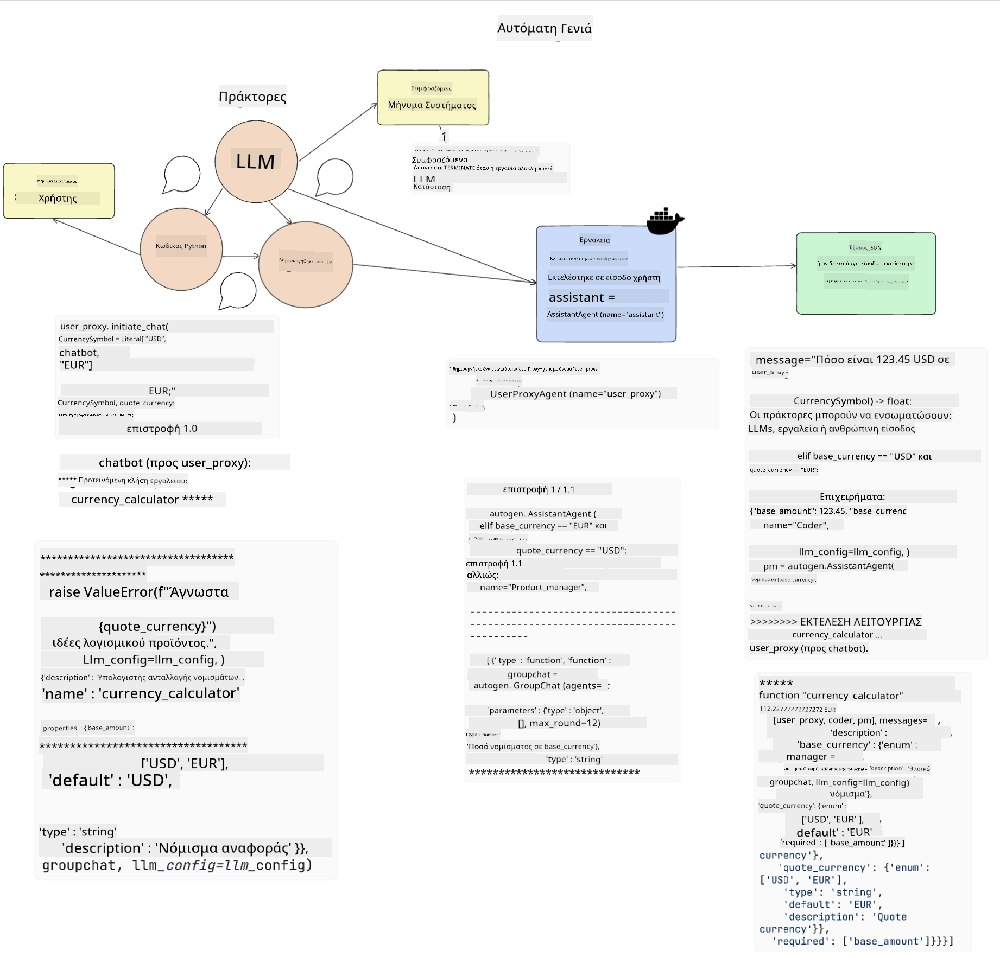
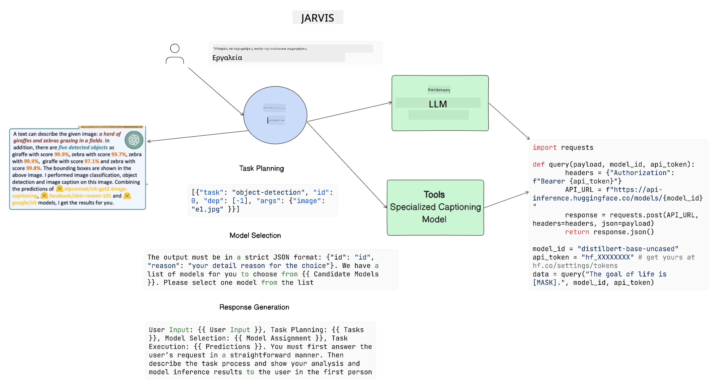

<!--
CO_OP_TRANSLATOR_METADATA:
{
  "original_hash": "8e8d1f6a63da606af7176a87ff8e92b6",
  "translation_date": "2025-10-17T18:30:44+00:00",
  "source_file": "17-ai-agents/README.md",
  "language_code": "el"
}
-->
[](https://youtu.be/yAXVW-lUINc?si=bOtW9nL6jc3XJgOM)

## Εισαγωγή

Οι Πράκτορες Τεχνητής Νοημοσύνης (AI Agents) αντιπροσωπεύουν μια συναρπαστική εξέλιξη στην Γενετική Τεχνητή Νοημοσύνη, επιτρέποντας στα Μεγάλα Γλωσσικά Μοντέλα (LLMs) να εξελιχθούν από βοηθοί σε πράκτορες που μπορούν να αναλαμβάνουν δράση. Τα πλαίσια Πρακτόρων Τεχνητής Νοημοσύνης επιτρέπουν στους προγραμματιστές να δημιουργούν εφαρμογές που παρέχουν στα LLMs πρόσβαση σε εργαλεία και διαχείριση κατάστασης. Αυτά τα πλαίσια βελτιώνουν επίσης την ορατότητα, επιτρέποντας στους χρήστες και στους προγραμματιστές να παρακολουθούν τις ενέργειες που σχεδιάζουν τα LLMs, βελτιώνοντας έτσι τη διαχείριση της εμπειρίας.

Το μάθημα θα καλύψει τα εξής:

- Κατανόηση του τι είναι ένας Πράκτορας Τεχνητής Νοημοσύνης - Τι ακριβώς είναι ένας Πράκτορας Τεχνητής Νοημοσύνης;
- Εξερεύνηση τεσσάρων διαφορετικών Πλαισίων Πρακτόρων Τεχνητής Νοημοσύνης - Τι τα κάνει μοναδικά;
- Εφαρμογή αυτών των Πρακτόρων Τεχνητής Νοημοσύνης σε διαφορετικές περιπτώσεις χρήσης - Πότε πρέπει να χρησιμοποιούμε Πράκτορες Τεχνητής Νοημοσύνης;

## Στόχοι μάθησης

Μετά την ολοκλήρωση αυτού του μαθήματος, θα μπορείτε:

- Να εξηγήσετε τι είναι οι Πράκτορες Τεχνητής Νοημοσύνης και πώς μπορούν να χρησιμοποιηθούν.
- Να κατανοήσετε τις διαφορές μεταξύ ορισμένων δημοφιλών Πλαισίων Πρακτόρων Τεχνητής Νοημοσύνης και πώς διαφέρουν.
- Να κατανοήσετε πώς λειτουργούν οι Πράκτορες Τεχνητής Νοημοσύνης για να δημιουργήσετε εφαρμογές με αυτούς.

## Τι είναι οι Πράκτορες Τεχνητής Νοημοσύνης;

Οι Πράκτορες Τεχνητής Νοημοσύνης είναι ένα πολύ συναρπαστικό πεδίο στον κόσμο της Γενετικής Τεχνητής Νοημοσύνης. Με αυτή τη συναρπαστική εξέλιξη έρχεται μερικές φορές και η σύγχυση των όρων και της εφαρμογής τους. Για να διατηρήσουμε τα πράγματα απλά και να συμπεριλάβουμε τα περισσότερα εργαλεία που αναφέρονται ως Πράκτορες Τεχνητής Νοημοσύνης, θα χρησιμοποιήσουμε τον εξής ορισμό:

Οι Πράκτορες Τεχνητής Νοημοσύνης επιτρέπουν στα Μεγάλα Γλωσσικά Μοντέλα (LLMs) να εκτελούν εργασίες παρέχοντάς τους πρόσβαση σε **κατάσταση** και **εργαλεία**.


Ας ορίσουμε αυτούς τους όρους:

**Μεγάλα Γλωσσικά Μοντέλα** - Αυτά είναι τα μοντέλα που αναφέρονται σε όλο το μάθημα, όπως GPT-3.5, GPT-4, Llama-2, κ.λπ.

**Κατάσταση** - Αυτό αναφέρεται στο πλαίσιο στο οποίο εργάζεται το LLM. Το LLM χρησιμοποιεί το πλαίσιο των προηγούμενων ενεργειών του και το τρέχον πλαίσιο, καθοδηγώντας τη λήψη αποφάσεων για επόμενες ενέργειες. Τα Πλαίσια Πρακτόρων Τεχνητής Νοημοσύνης επιτρέπουν στους προγραμματιστές να διατηρούν αυτό το πλαίσιο πιο εύκολα.

**Εργαλεία** - Για να ολοκληρώσει την εργασία που έχει ζητήσει ο χρήστης και που έχει σχεδιάσει το LLM, το LLM χρειάζεται πρόσβαση σε εργαλεία. Μερικά παραδείγματα εργαλείων μπορεί να είναι μια βάση δεδομένων, ένα API, μια εξωτερική εφαρμογή ή ακόμα και ένα άλλο LLM!

Αυτοί οι ορισμοί ελπίζουμε να σας δώσουν μια καλή βάση καθώς προχωράμε στην υλοποίησή τους. Ας εξερευνήσουμε μερικά διαφορετικά Πλαίσια Πρακτόρων Τεχνητής Νοημοσύνης:

## LangChain Agents

[LangChain Agents](https://python.langchain.com/docs/how_to/#agents?WT.mc_id=academic-105485-koreyst) είναι μια υλοποίηση των ορισμών που παρέχονται παραπάνω.

Για τη διαχείριση της **κατάστασης**, χρησιμοποιεί μια ενσωματωμένη λειτουργία που ονομάζεται `AgentExecutor`. Αυτή δέχεται τον καθορισμένο `agent` και τα `tools` που είναι διαθέσιμα σε αυτόν.

Ο `AgentExecutor` αποθηκεύει επίσης το ιστορικό συνομιλιών για να παρέχει το πλαίσιο της συνομιλίας.


Το LangChain προσφέρει έναν [κατάλογο εργαλείων](https://integrations.langchain.com/tools?WT.mc_id=academic-105485-koreyst) που μπορούν να εισαχθούν στην εφαρμογή σας, στα οποία το LLM μπορεί να αποκτήσει πρόσβαση. Αυτά δημιουργούνται από την κοινότητα και την ομάδα του LangChain.

Μπορείτε στη συνέχεια να ορίσετε αυτά τα εργαλεία και να τα περάσετε στον `AgentExecutor`.

Η ορατότητα είναι μια άλλη σημαντική πτυχή όταν μιλάμε για Πράκτορες Τεχνητής Νοημοσύνης. Είναι σημαντικό για τους προγραμματιστές εφαρμογών να κατανοούν ποιο εργαλείο χρησιμοποιεί το LLM και γιατί. Για αυτό, η ομάδα του LangChain έχει αναπτύξει το LangSmith.

## AutoGen

Το επόμενο Πλαίσιο Πρακτόρων Τεχνητής Νοημοσύνης που θα συζητήσουμε είναι το [AutoGen](https://microsoft.github.io/autogen/?WT.mc_id=academic-105485-koreyst). Η κύρια εστίαση του AutoGen είναι οι συνομιλίες. Οι Πράκτορες είναι τόσο **συνομιλητικοί** όσο και **προσαρμόσιμοι**.

**Συνομιλητικοί -** Τα LLMs μπορούν να ξεκινήσουν και να συνεχίσουν μια συνομιλία με ένα άλλο LLM για να ολοκληρώσουν μια εργασία. Αυτό γίνεται με τη δημιουργία `AssistantAgents` και την παροχή ενός συγκεκριμένου μηνύματος συστήματος.

```python

autogen.AssistantAgent( name="Coder", llm_config=llm_config, ) pm = autogen.AssistantAgent( name="Product_manager", system_message="Creative in software product ideas.", llm_config=llm_config, )

```

**Προσαρμόσιμοι** - Οι Πράκτορες μπορούν να οριστούν όχι μόνο ως LLMs αλλά και ως χρήστης ή εργαλείο. Ως προγραμματιστής, μπορείτε να ορίσετε έναν `UserProxyAgent` που είναι υπεύθυνος για την αλληλεπίδραση με τον χρήστη για ανατροφοδότηση κατά την ολοκλήρωση μιας εργασίας. Αυτή η ανατροφοδότηση μπορεί είτε να συνεχίσει την εκτέλεση της εργασίας είτε να την σταματήσει.

```python
user_proxy = UserProxyAgent(name="user_proxy")
```

### Κατάσταση και Εργαλεία

Για να αλλάξει και να διαχειριστεί την κατάσταση, ένας Assistant Agent δημιουργεί κώδικα Python για να ολοκληρώσει την εργασία.

Ακολουθεί ένα παράδειγμα της διαδικασίας:



#### LLM Ορισμένο με Μήνυμα Συστήματος

```python
system_message="For weather related tasks, only use the functions you have been provided with. Reply TERMINATE when the task is done."
```

Αυτό το μήνυμα συστήματος καθοδηγεί αυτό το συγκεκριμένο LLM στις λειτουργίες που είναι σχετικές για την εργασία του. Θυμηθείτε, με το AutoGen μπορείτε να έχετε πολλούς καθορισμένους AssistantAgents με διαφορετικά μηνύματα συστήματος.

#### Η Συνομιλία Ξεκινά από τον Χρήστη

```python
user_proxy.initiate_chat( chatbot, message="I am planning a trip to NYC next week, can you help me pick out what to wear? ", )

```

Αυτό το μήνυμα από τον user_proxy (Άνθρωπο) είναι αυτό που θα ξεκινήσει τη διαδικασία του Πράκτορα να εξερευνήσει τις πιθανές λειτουργίες που πρέπει να εκτελέσει.

#### Η Λειτουργία Εκτελείται

```bash
chatbot (to user_proxy):

***** Suggested tool Call: get_weather ***** Arguments: {"location":"New York City, NY","time_periond:"7","temperature_unit":"Celsius"} ******************************************************** --------------------------------------------------------------------------------

>>>>>>>> EXECUTING FUNCTION get_weather... user_proxy (to chatbot): ***** Response from calling function "get_weather" ***** 112.22727272727272 EUR ****************************************************************

```

Μόλις επεξεργαστεί η αρχική συνομιλία, ο Πράκτορας θα στείλει το προτεινόμενο εργαλείο για κλήση. Σε αυτή την περίπτωση, είναι μια λειτουργία που ονομάζεται `get_weather`. Ανάλογα με τη διαμόρφωσή σας, αυτή η λειτουργία μπορεί να εκτελεστεί αυτόματα και να διαβαστεί από τον Πράκτορα ή να εκτελεστεί βάσει εισόδου του χρήστη.

Μπορείτε να βρείτε μια λίστα με [δείγματα κώδικα AutoGen](https://microsoft.github.io/autogen/docs/Examples/?WT.mc_id=academic-105485-koreyst) για να εξερευνήσετε περαιτέρω πώς να ξεκινήσετε την κατασκευή.

## Taskweaver

Το επόμενο πλαίσιο πρακτόρων που θα εξερευνήσουμε είναι το [Taskweaver](https://microsoft.github.io/TaskWeaver/?WT.mc_id=academic-105485-koreyst). Είναι γνωστό ως πράκτορας "πρώτα ο κώδικας" επειδή αντί να εργάζεται αυστηρά με `strings`, μπορεί να εργάζεται με DataFrames σε Python. Αυτό γίνεται εξαιρετικά χρήσιμο για εργασίες ανάλυσης δεδομένων και δημιουργίας. Αυτές μπορεί να είναι πράγματα όπως η δημιουργία γραφημάτων και διαγραμμάτων ή η δημιουργία τυχαίων αριθμών.

### Κατάσταση και Εργαλεία

Για να διαχειριστεί την κατάσταση της συνομιλίας, το TaskWeaver χρησιμοποιεί την έννοια του `Planner`. Ο `Planner` είναι ένα LLM που λαμβάνει το αίτημα από τους χρήστες και χαρτογραφεί τις εργασίες που πρέπει να ολοκληρωθούν για να εκπληρωθεί αυτό το αίτημα.

Για να ολοκληρώσει τις εργασίες, ο `Planner` έχει πρόσβαση σε μια συλλογή εργαλείων που ονομάζονται `Plugins`. Αυτά μπορεί να είναι κλάσεις Python ή ένας γενικός διερμηνέας κώδικα. Αυτά τα plugins αποθηκεύονται ως embeddings ώστε το LLM να μπορεί να αναζητήσει καλύτερα το σωστό plugin.


Ακολουθεί ένα παράδειγμα plugin για την ανίχνευση ανωμαλιών:

```python
class AnomalyDetectionPlugin(Plugin): def __call__(self, df: pd.DataFrame, time_col_name: str, value_col_name: str):
```

Ο κώδικας επαληθεύεται πριν από την εκτέλεση. Ένα άλλο χαρακτηριστικό για τη διαχείριση του πλαισίου στο Taskweaver είναι η `εμπειρία`. Η εμπειρία επιτρέπει το πλαίσιο μιας συνομιλίας να αποθηκεύεται μακροπρόθεσμα σε ένα αρχείο YAML. Αυτό μπορεί να διαμορφωθεί ώστε το LLM να βελτιώνεται με την πάροδο του χρόνου σε συγκεκριμένες εργασίες δεδομένου ότι εκτίθεται σε προηγούμενες συνομιλίες.

## JARVIS

Το τελευταίο πλαίσιο πρακτόρων που θα εξερευνήσουμε είναι το [JARVIS](https://github.com/microsoft/JARVIS?tab=readme-ov-file?WT.mc_id=academic-105485-koreyst). Αυτό που κάνει το JARVIS μοναδικό είναι ότι χρησιμοποιεί ένα LLM για να διαχειριστεί την `κατάσταση` της συνομιλίας και τα `εργαλεία` είναι άλλα μοντέλα AI. Κάθε ένα από τα μοντέλα AI είναι εξειδικευμένα μοντέλα που εκτελούν συγκεκριμένες εργασίες όπως ανίχνευση αντικειμένων, μεταγραφή ή περιγραφή εικόνων.



Το LLM, ως γενικό μοντέλο, λαμβάνει το αίτημα από τον χρήστη και προσδιορίζει τη συγκεκριμένη εργασία και οποιαδήποτε επιχειρήματα/δεδομένα χρειάζονται για την ολοκλήρωση της εργασίας.

```python
[{"task": "object-detection", "id": 0, "dep": [-1], "args": {"image": "e1.jpg" }}]
```

Το LLM στη συνέχεια μορφοποιεί το αίτημα με τρόπο που το εξειδικευμένο μοντέλο AI μπορεί να ερμηνεύσει, όπως JSON. Μόλις το μοντέλο AI επιστρέψει την πρόβλεψή του βάσει της εργασίας, το LLM λαμβάνει την απάντηση.

Εάν απαιτούνται πολλαπλά μοντέλα για την ολοκλήρωση της εργασίας, θα ερμηνεύσει επίσης την απάντηση από αυτά τα μοντέλα πριν τα συνδυάσει για να δημιουργήσει την απάντηση προς τον χρήστη.

Το παρακάτω παράδειγμα δείχνει πώς θα λειτουργούσε αυτό όταν ένας χρήστης ζητά μια περιγραφή και τον αριθμό των αντικειμένων σε μια εικόνα:

## Εργασία

Για να συνεχίσετε τη μάθηση σας σχετικά με τους Πράκτορες Τεχνητής Νοημοσύνης, μπορείτε να δημιουργήσετε με το AutoGen:

- Μια εφαρμογή που προσομοιώνει μια επιχειρηματική συνάντηση με διαφορετικά τμήματα μιας startup εκπαίδευσης.
- Δημιουργήστε μηνύματα συστήματος που καθοδηγούν τα LLMs να κατανοήσουν διαφορετικές προσωπικότητες και προτεραιότητες, και επιτρέψτε στον χρήστη να παρουσιάσει μια νέα ιδέα προϊόντος.
- Το LLM θα πρέπει στη συνέχεια να δημιουργήσει ερωτήσεις παρακολούθησης από κάθε τμήμα για να βελτιώσει την παρουσίαση και την ιδέα του προϊόντος.

## Η μάθηση δεν σταματά εδώ, συνεχίστε το ταξίδι σας

Μετά την ολοκλήρωση αυτού του μαθήματος, δείτε τη [συλλογή μάθησης Γενετικής Τεχνητής Νοημοσύνης](https://aka.ms/genai-collection?WT.mc_id=academic-105485-koreyst) για να συνεχίσετε να αναβαθμίζετε τις γνώσεις σας στη Γενετική Τεχνητή Νοημοσύνη!

---

**Αποποίηση ευθύνης**:  
Αυτό το έγγραφο έχει μεταφραστεί χρησιμοποιώντας την υπηρεσία μετάφρασης AI [Co-op Translator](https://github.com/Azure/co-op-translator). Παρόλο που καταβάλλουμε προσπάθειες για ακρίβεια, παρακαλούμε να έχετε υπόψη ότι οι αυτοματοποιημένες μεταφράσεις ενδέχεται να περιέχουν λάθη ή ανακρίβειες. Το πρωτότυπο έγγραφο στη μητρική του γλώσσα θα πρέπει να θεωρείται η αυθεντική πηγή. Για κρίσιμες πληροφορίες, συνιστάται επαγγελματική ανθρώπινη μετάφραση. Δεν φέρουμε ευθύνη για τυχόν παρεξηγήσεις ή εσφαλμένες ερμηνείες που προκύπτουν από τη χρήση αυτής της μετάφρασης.