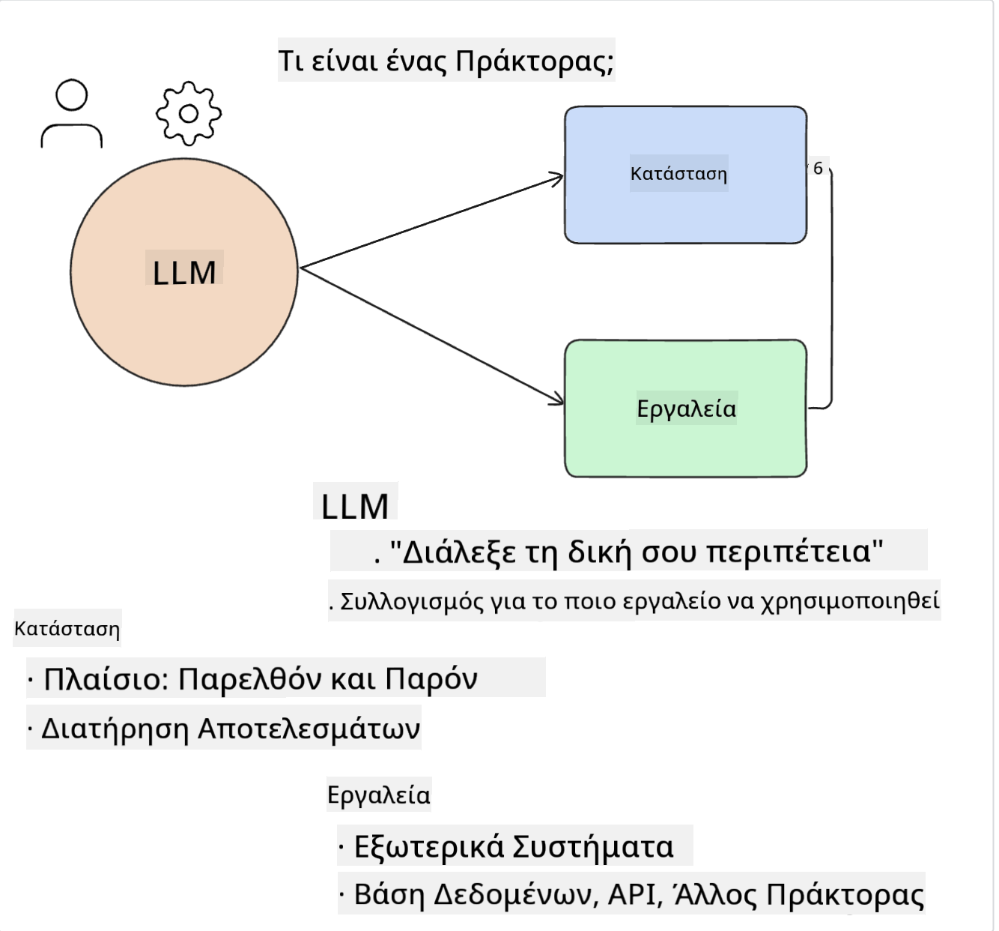
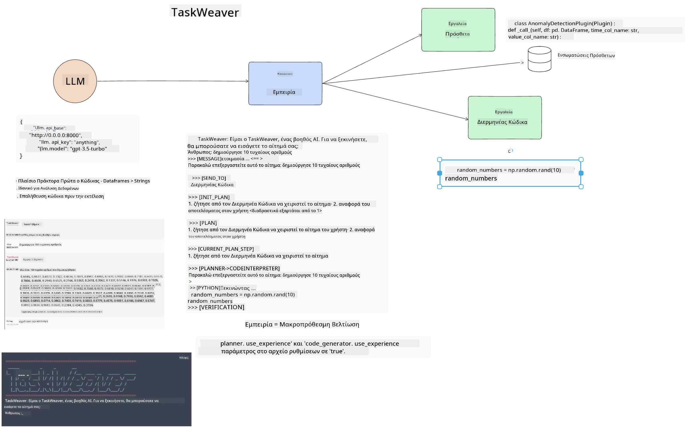

<!--
CO_OP_TRANSLATOR_METADATA:
{
  "original_hash": "11f03c81f190d9cbafd0f977dcbede6c",
  "translation_date": "2025-07-09T17:25:25+00:00",
  "source_file": "17-ai-agents/README.md",
  "language_code": "el"
}
-->
[](https://aka.ms/gen-ai-lesson17-gh?WT.mc_id=academic-105485-koreyst)

## Εισαγωγή

Οι AI Agents αποτελούν μια συναρπαστική εξέλιξη στην Γενετική Τεχνητή Νοημοσύνη, επιτρέποντας στα Μεγάλα Γλωσσικά Μοντέλα (LLMs) να εξελιχθούν από βοηθούς σε πράκτορες ικανούς να αναλαμβάνουν δράσεις. Τα πλαίσια εργασίας για AI Agents δίνουν τη δυνατότητα στους προγραμματιστές να δημιουργούν εφαρμογές που παρέχουν στα LLMs πρόσβαση σε εργαλεία και διαχείριση κατάστασης. Αυτά τα πλαίσια βελτιώνουν επίσης τη διαφάνεια, επιτρέποντας σε χρήστες και προγραμματιστές να παρακολουθούν τις ενέργειες που σχεδιάζουν τα LLMs, βελτιώνοντας έτσι τη διαχείριση της εμπειρίας.

Το μάθημα θα καλύψει τα εξής θέματα:

- Κατανόηση του τι είναι ένας AI Agent - Τι ακριβώς είναι ένας AI Agent;
- Εξερεύνηση τεσσάρων διαφορετικών πλαισίων AI Agent - Τι τα κάνει μοναδικά;
- Εφαρμογή αυτών των AI Agents σε διάφορες περιπτώσεις χρήσης - Πότε πρέπει να χρησιμοποιούμε AI Agents;

## Στόχοι μάθησης

Μετά την ολοκλήρωση αυτού του μαθήματος, θα μπορείτε να:

- Εξηγήσετε τι είναι οι AI Agents και πώς μπορούν να χρησιμοποιηθούν.
- Κατανοήσετε τις διαφορές μεταξύ μερικών από τα δημοφιλή πλαίσια AI Agent και πώς διαφέρουν.
- Κατανοήσετε πώς λειτουργούν οι AI Agents ώστε να δημιουργήσετε εφαρμογές με αυτά.

## Τι είναι οι AI Agents;

Οι AI Agents είναι ένας πολύ συναρπαστικός τομέας στον κόσμο της Γενετικής Τεχνητής Νοημοσύνης. Μαζί με αυτόν τον ενθουσιασμό, συχνά προκύπτει σύγχυση σχετικά με τους όρους και την εφαρμογή τους. Για να κρατήσουμε τα πράγματα απλά και να συμπεριλάβουμε τα περισσότερα εργαλεία που αναφέρονται ως AI Agents, θα χρησιμοποιήσουμε τον εξής ορισμό:

Οι AI Agents επιτρέπουν στα Μεγάλα Γλωσσικά Μοντέλα (LLMs) να εκτελούν εργασίες δίνοντάς τους πρόσβαση σε **κατάσταση** και **εργαλεία**.



Ας ορίσουμε αυτούς τους όρους:

**Μεγάλα Γλωσσικά Μοντέλα** - Αυτά είναι τα μοντέλα που αναφέρονται σε όλο το μάθημα, όπως τα GPT-3.5, GPT-4, Llama-2 κ.ά.

**Κατάσταση** - Αναφέρεται στο πλαίσιο μέσα στο οποίο εργάζεται το LLM. Το LLM χρησιμοποιεί το πλαίσιο των προηγούμενων ενεργειών του και το τρέχον πλαίσιο, καθοδηγώντας τη λήψη αποφάσεων για τις επόμενες ενέργειες. Τα πλαίσια AI Agent διευκολύνουν τους προγραμματιστές να διατηρούν αυτό το πλαίσιο.

**Εργαλεία** - Για να ολοκληρώσει την εργασία που ζήτησε ο χρήστης και που έχει σχεδιάσει το LLM, το LLM χρειάζεται πρόσβαση σε εργαλεία. Παραδείγματα εργαλείων μπορεί να είναι μια βάση δεδομένων, ένα API, μια εξωτερική εφαρμογή ή ακόμα και ένα άλλο LLM!

Αυτοί οι ορισμοί ελπίζουμε να σας δώσουν μια καλή βάση καθώς προχωράμε στην υλοποίηση τους. Ας εξερευνήσουμε μερικά διαφορετικά πλαίσια AI Agent:

## LangChain Agents

Το [LangChain Agents](https://python.langchain.com/docs/how_to/#agents?WT.mc_id=academic-105485-koreyst) είναι μια υλοποίηση των ορισμών που δώσαμε παραπάνω.

Για τη διαχείριση της **κατάστασης**, χρησιμοποιεί μια ενσωματωμένη λειτουργία που ονομάζεται `AgentExecutor`. Αυτή δέχεται τον ορισμένο `agent` και τα `tools` που είναι διαθέσιμα.

Ο `AgentExecutor` αποθηκεύει επίσης το ιστορικό συνομιλίας για να παρέχει το πλαίσιο της συνομιλίας.


Το LangChain προσφέρει έναν [κατάλογο εργαλείων](https://integrations.langchain.com/tools?WT.mc_id=academic-105485-koreyst) που μπορούν να εισαχθούν στην εφαρμογή σας και στα οποία το LLM μπορεί να έχει πρόσβαση. Αυτά δημιουργούνται από την κοινότητα και την ομάδα του LangChain.

Στη συνέχεια, μπορείτε να ορίσετε αυτά τα εργαλεία και να τα περάσετε στον `AgentExecutor`.

Η διαφάνεια είναι ένα ακόμα σημαντικό στοιχείο όταν μιλάμε για AI Agents. Είναι σημαντικό για τους προγραμματιστές εφαρμογών να κατανοούν ποιο εργαλείο χρησιμοποιεί το LLM και γιατί. Για αυτό, η ομάδα του LangChain ανέπτυξε το LangSmith.

## AutoGen

Το επόμενο πλαίσιο AI Agent που θα συζητήσουμε είναι το [AutoGen](https://microsoft.github.io/autogen/?WT.mc_id=academic-105485-koreyst). Η κύρια εστίαση του AutoGen είναι οι συνομιλίες. Οι Agents είναι τόσο **συνομιλητικοί** όσο και **προσαρμόσιμοι**.

**Συνομιλητικοί -** Τα LLMs μπορούν να ξεκινήσουν και να συνεχίσουν μια συνομιλία με άλλο LLM για να ολοκληρώσουν μια εργασία. Αυτό γίνεται δημιουργώντας `AssistantAgents` και δίνοντάς τους ένα συγκεκριμένο μήνυμα συστήματος.

```python

autogen.AssistantAgent( name="Coder", llm_config=llm_config, ) pm = autogen.AssistantAgent( name="Product_manager", system_message="Creative in software product ideas.", llm_config=llm_config, )

```

**Προσαρμόσιμοι** - Οι Agents μπορούν να οριστούν όχι μόνο ως LLMs αλλά και ως χρήστης ή εργαλείο. Ως προγραμματιστής, μπορείτε να ορίσετε έναν `UserProxyAgent` που είναι υπεύθυνος για την αλληλεπίδραση με τον χρήστη για ανατροφοδότηση στην ολοκλήρωση μιας εργασίας. Αυτή η ανατροφοδότηση μπορεί είτε να συνεχίσει την εκτέλεση της εργασίας είτε να τη σταματήσει.

```python
user_proxy = UserProxyAgent(name="user_proxy")
```

### Κατάσταση και Εργαλεία

Για να αλλάξει και να διαχειριστεί την κατάσταση, ένας βοηθητικός Agent δημιουργεί κώδικα Python για να ολοκληρώσει την εργασία.

Ακολουθεί ένα παράδειγμα της διαδικασίας:


#### LLM ορισμένο με μήνυμα συστήματος

```python
system_message="For weather related tasks, only use the functions you have been provided with. Reply TERMINATE when the task is done."
```

Αυτό το μήνυμα συστήματος καθοδηγεί το συγκεκριμένο LLM σχετικά με τις λειτουργίες που είναι σχετικές για την εργασία του. Θυμηθείτε, με το AutoGen μπορείτε να έχετε πολλούς ορισμένους AssistantAgents με διαφορετικά μηνύματα συστήματος.

#### Η συνομιλία ξεκινά από τον χρήστη

```python
user_proxy.initiate_chat( chatbot, message="I am planning a trip to NYC next week, can you help me pick out what to wear? ", )

```

Αυτό το μήνυμα από τον user_proxy (Άνθρωπο) είναι που θα ξεκινήσει τη διαδικασία του Agent να εξερευνήσει τις πιθανές λειτουργίες που πρέπει να εκτελέσει.

#### Η λειτουργία εκτελείται

```bash
chatbot (to user_proxy):

***** Suggested tool Call: get_weather ***** Arguments: {"location":"New York City, NY","time_periond:"7","temperature_unit":"Celsius"} ******************************************************** --------------------------------------------------------------------------------

>>>>>>>> EXECUTING FUNCTION get_weather... user_proxy (to chatbot): ***** Response from calling function "get_weather" ***** 112.22727272727272 EUR ****************************************************************

```

Μόλις επεξεργαστεί η αρχική συνομιλία, ο Agent θα στείλει το προτεινόμενο εργαλείο για κλήση. Σε αυτή την περίπτωση, είναι μια λειτουργία που ονομάζεται `get_weather`. Ανάλογα με τη ρύθμισή σας, αυτή η λειτουργία μπορεί να εκτελεστεί αυτόματα και να διαβαστεί από τον Agent ή να εκτελεστεί βάσει εισόδου χρήστη.

Μπορείτε να βρείτε μια λίστα με [παραδείγματα κώδικα AutoGen](https://microsoft.github.io/autogen/docs/Examples/?WT.mc_id=academic-105485-koreyst) για να εξερευνήσετε περαιτέρω πώς να ξεκινήσετε την κατασκευή.

## Taskweaver

Το επόμενο πλαίσιο agent που θα εξερευνήσουμε είναι το [Taskweaver](https://microsoft.github.io/TaskWeaver/?WT.mc_id=academic-105485-koreyst). Είναι γνωστό ως "code-first" agent γιατί αντί να δουλεύει αυστηρά με `strings`, μπορεί να δουλέψει με DataFrames σε Python. Αυτό γίνεται εξαιρετικά χρήσιμο για εργασίες ανάλυσης και δημιουργίας δεδομένων. Μπορεί να είναι πράγματα όπως η δημιουργία γραφημάτων και διαγραμμάτων ή η παραγωγή τυχαίων αριθμών.

### Κατάσταση και Εργαλεία

Για να διαχειριστεί την κατάσταση της συνομιλίας, το TaskWeaver χρησιμοποιεί την έννοια του `Planner`. Ο `Planner` είναι ένα LLM που λαμβάνει το αίτημα από τους χρήστες και χαρτογραφεί τις εργασίες που πρέπει να ολοκληρωθούν για να ικανοποιηθεί το αίτημα.

Για να ολοκληρώσει τις εργασίες, ο `Planner` έχει πρόσβαση στη συλλογή εργαλείων που ονομάζονται `Plugins`. Αυτά μπορεί να είναι κλάσεις Python ή ένας γενικός διερμηνέας κώδικα. Αυτά τα plugins αποθηκεύονται ως embeddings ώστε το LLM να μπορεί να αναζητά καλύτερα το σωστό plugin.



Ακολουθεί ένα παράδειγμα plugin για ανίχνευση ανωμαλιών:

```python
class AnomalyDetectionPlugin(Plugin): def __call__(self, df: pd.DataFrame, time_col_name: str, value_col_name: str):
```

Ο κώδικας ελέγχεται πριν εκτελεστεί. Μια ακόμα λειτουργία για τη διαχείριση του πλαισίου στο Taskweaver είναι η `experience`. Η εμπειρία επιτρέπει την αποθήκευση του πλαισίου μιας συνομιλίας μακροπρόθεσμα σε ένα αρχείο YAML. Αυτό μπορεί να ρυθμιστεί ώστε το LLM να βελτιώνεται με τον χρόνο σε συγκεκριμένες εργασίες, δεδομένου ότι εκτίθεται σε προηγούμενες συνομιλίες.

## JARVIS

Το τελευταίο πλαίσιο agent που θα εξερευνήσουμε είναι το [JARVIS](https://github.com/microsoft/JARVIS?tab=readme-ov-file?WT.mc_id=academic-105485-koreyst). Αυτό που κάνει το JARVIS μοναδικό είναι ότι χρησιμοποιεί ένα LLM για να διαχειριστεί την `κατάσταση` της συνομιλίας και τα `εργαλεία` είναι άλλα μοντέλα AI. Κάθε ένα από αυτά τα μοντέλα AI είναι εξειδικευμένο σε συγκεκριμένες εργασίες όπως ανίχνευση αντικειμένων, μεταγραφή ή περιγραφή εικόνας.


Το LLM, ως γενικού σκοπού μοντέλο, λαμβάνει το αίτημα από τον χρήστη και εντοπίζει την συγκεκριμένη εργασία και τυχόν επιχειρήματα/δεδομένα που χρειάζονται για να ολοκληρωθεί η εργασία.

```python
[{"task": "object-detection", "id": 0, "dep": [-1], "args": {"image": "e1.jpg" }}]
```

Στη συνέχεια, το LLM μορφοποιεί το αίτημα με τρόπο που το εξειδικευμένο μοντέλο AI μπορεί να ερμηνεύσει, όπως σε JSON. Μόλις το μοντέλο AI επιστρέψει την πρόβλεψή του βάσει της εργασίας, το LLM λαμβάνει την απάντηση.

Αν απαιτούνται πολλαπλά μοντέλα για να ολοκληρωθεί η εργασία, το LLM θα ερμηνεύσει επίσης τις απαντήσεις από αυτά τα μοντέλα πριν τις συνδυάσει για να δημιουργήσει την απάντηση προς τον χρήστη.

Το παρακάτω παράδειγμα δείχνει πώς λειτουργεί αυτό όταν ένας χρήστης ζητά περιγραφή και καταμέτρηση των αντικειμένων σε μια εικόνα:

## Εργασία

Για να συνεχίσετε την εκμάθησή σας για τους AI Agents, μπορείτε να δημιουργήσετε με το AutoGen:

- Μια εφαρμογή που προσομοιώνει μια επιχειρηματική συνάντηση με διαφορετικά τμήματα μιας εκπαιδευτικής startup.
- Δημιουργήστε μηνύματα συστήματος που καθοδηγούν τα LLMs στην κατανόηση διαφορετικών προσωπικοτήτων και προτεραιοτήτων, και επιτρέπουν στον χρήστη να παρουσιάσει μια νέα ιδέα προϊόντος.
- Το LLM θα πρέπει στη συνέχεια να δημιουργήσει ερωτήσεις παρακολούθησης από κάθε τμήμα για να βελτιώσει και να τελειοποιήσει την παρουσίαση και την ιδέα του προϊόντος.

## Η μάθηση δεν σταματά εδώ, συνεχίστε το ταξίδι

Μετά την ολοκλήρωση αυτού του μαθήματος, ρίξτε μια ματιά στη [συλλογή μάθησης για Γενετική Τεχνητή Νοημοσύνη](https://aka.ms/genai-collection?WT.mc_id=academic-105485-koreyst) για να συνεχίσετε να αναβαθμίζετε τις γνώσεις σας στην Γενετική Τεχνητή Νοημοσύνη!

**Αποποίηση ευθυνών**:  
Αυτό το έγγραφο έχει μεταφραστεί χρησιμοποιώντας την υπηρεσία αυτόματης μετάφρασης AI [Co-op Translator](https://github.com/Azure/co-op-translator). Παρόλο που επιδιώκουμε την ακρίβεια, παρακαλούμε να γνωρίζετε ότι οι αυτόματες μεταφράσεις ενδέχεται να περιέχουν λάθη ή ανακρίβειες. Το πρωτότυπο έγγραφο στη γλώσσα του θεωρείται η αυθεντική πηγή. Για κρίσιμες πληροφορίες, συνιστάται επαγγελματική ανθρώπινη μετάφραση. Δεν φέρουμε ευθύνη για τυχόν παρεξηγήσεις ή λανθασμένες ερμηνείες που προκύπτουν από τη χρήση αυτής της μετάφρασης.