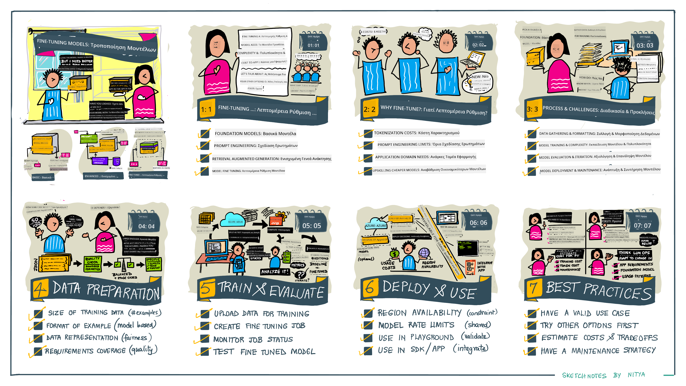

<!--
CO_OP_TRANSLATOR_METADATA:
{
  "original_hash": "68664f7e754a892ae1d8d5e2b7bd2081",
  "translation_date": "2025-05-20T07:48:10+00:00",
  "source_file": "18-fine-tuning/README.md",
  "language_code": "el"
}
-->

# Προσαρμογή του LLM σας

Η χρήση μεγάλων γλωσσικών μοντέλων για την ανάπτυξη εφαρμογών γεννητικής AI συνοδεύεται από νέες προκλήσεις. Ένα βασικό ζήτημα είναι η εξασφάλιση της ποιότητας των απαντήσεων (ακρίβεια και συνάφεια) στο περιεχόμενο που δημιουργείται από το μοντέλο για ένα συγκεκριμένο αίτημα χρήστη. Στα προηγούμενα μαθήματα, συζητήσαμε τεχνικές όπως η προσαρμογή των ερωτημάτων και η δημιουργία με ενίσχυση ανάκτησης που προσπαθούν να λύσουν το πρόβλημα _τροποποιώντας την είσοδο του ερωτήματος_ στο υπάρχον μοντέλο.

Στο σημερινό μάθημα, συζητάμε μια τρίτη τεχνική, την **προσαρμογή**, η οποία προσπαθεί να αντιμετωπίσει την πρόκληση _εκπαιδεύοντας εκ νέου το ίδιο το μοντέλο_ με επιπλέον δεδομένα. Ας εξετάσουμε τις λεπτομέρειες.

## Στόχοι Μάθησης

Αυτό το μάθημα εισάγει την έννοια της προσαρμογής για προεκπαιδευμένα γλωσσικά μοντέλα, εξερευνά τα οφέλη και τις προκλήσεις αυτής της προσέγγισης και παρέχει καθοδήγηση σχετικά με το πότε και πώς να χρησιμοποιήσετε την προσαρμογή για να βελτιώσετε την απόδοση των γεννητικών μοντέλων AI σας.

Στο τέλος αυτού του μαθήματος, θα πρέπει να μπορείτε να απαντήσετε στις ακόλουθες ερωτήσεις:

- Τι είναι η προσαρμογή για γλωσσικά μοντέλα;
- Πότε και γιατί είναι χρήσιμη η προσαρμογή;
- Πώς μπορώ να προσαρμόσω ένα προεκπαιδευμένο μοντέλο;
- Ποιες είναι οι περιορισμοί της προσαρμογής;

Έτοιμοι; Ας ξεκινήσουμε.

## Εικονογραφημένος Οδηγός

Θέλετε να έχετε μια συνολική εικόνα του τι θα καλύψουμε πριν εμβαθύνετε; Δείτε αυτόν τον εικονογραφημένο οδηγό που περιγράφει το ταξίδι μάθησης για αυτό το μάθημα - από την εκμάθηση των βασικών εννοιών και της κίνησης για την προσαρμογή, έως την κατανόηση της διαδικασίας και των βέλτιστων πρακτικών για την εκτέλεση του καθήκοντος προσαρμογής. Πρόκειται για ένα συναρπαστικό θέμα για εξερεύνηση, οπότε μην ξεχάσετε να ελέγξετε τη σελίδα [Resources](./RESOURCES.md?WT.mc_id=academic-105485-koreyst) για επιπλέον συνδέσμους που θα υποστηρίξουν το αυτοκατευθυνόμενο ταξίδι μάθησης σας!

## Τι είναι η προσαρμογή για γλωσσικά μοντέλα;

Κατά ορισμό, τα μεγάλα γλωσσικά μοντέλα είναι _προεκπαιδευμένα_ σε μεγάλες ποσότητες κειμένου που προέρχονται από διάφορες πηγές, συμπεριλαμβανομένου του διαδικτύου. Όπως έχουμε μάθει στα προηγούμενα μαθήματα, χρειαζόμαστε τεχνικές όπως η _προσαρμογή των ερωτημάτων_ και η _δημιουργία με ενίσχυση ανάκτησης_ για να βελτιώσουμε την ποιότητα των απαντήσεων του μοντέλου στις ερωτήσεις του χρήστη ("ερωτήματα").

Μια δημοφιλής τεχνική προσαρμογής των ερωτημάτων περιλαμβάνει την παροχή περισσότερης καθοδήγησης στο μοντέλο σχετικά με το τι αναμένεται στην απάντηση είτε παρέχοντας _οδηγίες_ (ρητή καθοδήγηση) είτε _δίνοντάς του μερικά παραδείγματα_ (άδηλη καθοδήγηση). Αυτό αναφέρεται ως _εκμάθηση με λίγα παραδείγματα_, αλλά έχει δύο περιορισμούς:

- Τα όρια των tokens του μοντέλου μπορούν να περιορίσουν τον αριθμό των παραδειγμάτων που μπορείτε να δώσετε και να περιορίσουν την αποτελεσματικότητα.
- Το κόστος των tokens του μοντέλου μπορεί να κάνει ακριβή την προσθήκη παραδειγμάτων σε κάθε ερώτημα και να περιορίσει την ευελιξία.

Η προσαρμογή είναι μια κοινή πρακτική στα συστήματα μηχανικής μάθησης όπου παίρνουμε ένα προεκπαιδευμένο μοντέλο και το εκπαιδεύουμε εκ νέου με νέα δεδομένα για να βελτιώσουμε την απόδοσή του σε μια συγκεκριμένη εργασία. Στο πλαίσιο των γλωσσικών μοντέλων, μπορούμε να προσαρμόσουμε το προεκπαιδευμένο μοντέλο _με ένα επιμελημένο σύνολο παραδειγμάτων για μια δεδομένη εργασία ή τομέα εφαρμογής_ για να δημιουργήσουμε ένα **προσαρμοσμένο μοντέλο** που μπορεί να είναι πιο ακριβές και σχετικό για εκείνη τη συγκεκριμένη εργασία ή τομέα. Ένα επιπλέον όφελος της προσαρμογής είναι ότι μπορεί επίσης να μειώσει τον αριθμό των παραδειγμάτων που χρειάζονται για την εκμάθηση με λίγα παραδείγματα - μειώνοντας τη χρήση των tokens και τα συναφή κόστη.

## Πότε και γιατί πρέπει να προσαρμόσουμε τα μοντέλα;

Σε _αυτό_ το πλαίσιο, όταν μιλάμε για προσαρμογή, αναφερόμαστε στην **εποπτευόμενη** προσαρμογή όπου η εκπαίδευση εκ νέου γίνεται με **προσθήκη νέων δεδομένων** που δεν ήταν μέρος του αρχικού συνόλου εκπαίδευσης. Αυτό διαφέρει από μια προσέγγιση μη εποπτευόμενης προσαρμογής όπου το μοντέλο εκπαιδεύεται εκ νέου στα αρχικά δεδομένα, αλλά με διαφορετικές υπερπαραμέτρους.

Το βασικό πράγμα που πρέπει να θυμάστε είναι ότι η προσαρμογή είναι μια προηγμένη τεχνική που απαιτεί ένα ορισμένο επίπεδο εξειδίκευσης για να επιτύχετε τα επιθυμητά αποτελέσματα. Αν γίνει λανθασμένα, μπορεί να μην παρέχει τις αναμενόμενες βελτιώσεις και μπορεί ακόμη και να υποβαθμίσει την απόδοση του μοντέλου για τον στόχο σας.

Έτσι, πριν μάθετε "πώς" να προσαρμόσετε γλωσσικά μοντέλα, πρέπει να γνωρίζετε "γιατί" πρέπει να ακολουθήσετε αυτήν τη διαδρομή και "πότε" να ξεκινήσετε τη διαδικασία της προσαρμογής. Ξεκινήστε θέτοντας στον εαυτό σας αυτές τις ερωτήσεις:

- **Χρήση**: Ποια είναι η _χρήση_ σας για την προσαρμογή; Ποια πτυχή του τρέχοντος προεκπαιδευμένου μοντέλου θέλετε να βελτιώσετε;
- **Εναλλακτικές**: Έχετε δοκιμάσει _άλλες τεχνικές_ για να επιτύχετε τα επιθυμητά αποτελέσματα; Χρησιμοποιήστε τις για να δημιουργήσετε ένα σημείο αναφοράς για σύγκριση.
  - Προσαρμογή ερωτημάτων: Δοκιμάστε τεχνικές όπως η εκμάθηση με λίγα παραδείγματα με παραδείγματα σχετικών απαντήσεων ερωτημάτων. Αξιολογήστε την ποιότητα των απαντήσεων.
  - Δημιουργία με ενίσχυση ανάκτησης: Δοκιμάστε να ενισχύσετε τα ερωτήματα με αποτελέσματα αναζήτησης που ανακτήθηκαν αναζητώντας τα δεδομένα σας. Αξιολογήστε την ποιότητα των απαντήσεων.
- **Κόστη**: Έχετε εντοπίσει τα κόστη για την προσαρμογή;
  - Προσαρμοστικότητα - είναι το προεκπαιδευμένο μοντέλο διαθέσιμο για προσαρμογή;
  - Προσπάθεια - για την προετοιμασία δεδομένων εκπαίδευσης, την αξιολόγηση και τη βελτίωση του μοντέλου.
  - Υπολογισμός - για την εκτέλεση εργασιών προσαρμογής και την ανάπτυξη του προσαρμοσμένου μοντέλου
  - Δεδομένα - πρόσβαση σε επαρκή παραδείγματα ποιότητας για την επίδραση της προσαρμογής
- **Οφέλη**: Έχετε επιβεβαιώσει τα οφέλη της προσαρμογής;
  - Ποιότητα - το προσαρμοσμένο μοντέλο ξεπέρασε το σημείο αναφοράς;
  - Κόστος - μειώνει τη χρήση των tokens απλοποιώντας τα ερωτήματα;
  - Επεκτασιμότητα - μπορείτε να επαναχρησιμοποιήσετε το βασικό μοντέλο για νέους τομείς;

Απαντώντας σε αυτές τις ερωτήσεις, θα πρέπει να μπορείτε να αποφασίσετε αν η προσαρμογή είναι η σωστή προσέγγιση για τη χρήση σας. Ιδανικά, η προσέγγιση είναι έγκυρη μόνο αν τα οφέλη υπερτερούν των κόστους. Μόλις αποφασίσετε να προχωρήσετε, είναι καιρός να σκεφτείτε _πώς_ μπορείτε να προσαρμόσετε το προεκπαιδευμένο μοντέλο.

Θέλετε να αποκτήσετε περισσότερες πληροφορίες για τη διαδικασία λήψης αποφάσεων; Δείτε το [To fine-tune or not to fine-tune](https://www.youtube.com/watch?v=0Jo-z-MFxJs)

## Πώς μπορούμε να προσαρμόσουμε ένα προεκπαιδευμένο μοντέλο;

Για να προσαρμόσετε ένα προεκπαιδευμένο μοντέλο, χρειάζεστε:

- ένα προεκπαιδευμένο μοντέλο για προσαρμογή
- ένα σύνολο δεδομένων για χρήση στην προσαρμογή
- ένα περιβάλλον εκπαίδευσης για την εκτέλεση της εργασίας προσαρμογής
- ένα περιβάλλον φιλοξενίας για την ανάπτυξη του προσαρμοσμένου μοντέλου

## Προσαρμογή στην Πράξη

Οι ακόλουθοι πόροι παρέχουν εκπαιδευτικά βήμα προς βήμα για να σας οδηγήσουν μέσα από ένα πραγματικό παράδειγμα χρησιμοποιώντας ένα επιλεγμένο μοντέλο με ένα επιμελημένο σύνολο δεδομένων. Για να εργαστείτε μέσω αυτών των εκπαιδευτικών, χρειάζεστε έναν λογαριασμό στον συγκεκριμένο πάροχο, μαζί με πρόσβαση στο σχετικό μοντέλο και σύνολα δεδομένων.

| Πάροχος      | Εκπαιδευτικό                                                                                                                                                                       | Περιγραφή                                                                                                                                                                                                                                                                                                                                                                                                                        |
| ------------ | ------------------------------------------------------------------------------------------------------------------------------------------------------------------------------ | ---------------------------------------------------------------------------------------------------------------------------------------------------------------------------------------------------------------------------------------------------------------------------------------------------------------------------------------------------------------------------------------------------------------------------------- |
| OpenAI       | [Πώς να προσαρμόσετε μοντέλα συνομιλίας](https://github.com/openai/openai-cookbook/blob/main/examples/How_to_finetune_chat_models.ipynb?WT.mc_id=academic-105485-koreyst)                | Μάθετε να προσαρμόζετε ένα `gpt-35-turbo` για έναν συγκεκριμένο τομέα ("βοηθός συνταγών") προετοιμάζοντας δεδομένα εκπαίδευσης, εκτελώντας την εργασία προσαρμογής και χρησιμοποιώντας το προσαρμοσμένο μοντέλο για επαγωγή.                                                                                                                                                                                                                                              |
| Azure OpenAI | [Εκπαιδευτικό προσαρμογής GPT 3.5 Turbo](https://learn.microsoft.com/azure/ai-services/openai/tutorials/fine-tune?tabs=python-new%2Ccommand-line?WT.mc_id=academic-105485-koreyst) | Μάθετε να προσαρμόζετε ένα `gpt-35-turbo-0613` μοντέλο **στο Azure** λαμβάνοντας βήματα για τη δημιουργία και τη μεταφόρτωση δεδομένων εκπαίδευσης, την εκτέλεση της εργασίας προσαρμογής. Αναπτύξτε και χρησιμοποιήστε το νέο μοντέλο.                                                                                                                                                                                                                                                                 |
| Hugging Face | [Προσαρμογή LLMs με το Hugging Face](https://www.philschmid.de/fine-tune-llms-in-2024-with-trl?WT.mc_id=academic-105485-koreyst)                                               | Αυτή η ανάρτηση ιστολογίου σας οδηγεί στην προσαρμογή ενός _ανοιχτού LLM_ (π.χ. `CodeLlama 7B`) χρησιμοποιώντας τη βιβλιοθήκη [transformers](https://huggingface.co/docs/transformers/index?WT.mc_id=academic-105485-koreyst) & [Transformer Reinforcement Learning (TRL)](https://huggingface.co/docs/trl/index?WT.mc_id=academic-105485-koreyst]) με ανοιχτά [σύνολα δεδομένων](https://huggingface.co/docs/datasets/index?WT.mc_id=academic-105485-koreyst) στο Hugging Face. |
|              |                                                                                                                                                                                |                                                                                                                                                                                                                                                                                                                                                                                                                                    |
| 🤗 AutoTrain | [Προσαρμογή LLMs με το AutoTrain](https://github.com/huggingface/autotrain-advanced/?WT.mc_id=academic-105485-koreyst)                                                         | Το AutoTrain (ή AutoTrain Advanced) είναι μια βιβλιοθήκη python που αναπτύχθηκε από το Hugging Face και επιτρέπει την προσαρμογή για πολλές διαφορετικές εργασίες, συμπεριλαμβανομένης της προσαρμογής LLM. Το AutoTrain είναι μια λύση χωρίς κώδικα και η προσαρμογή μπορεί να γίνει στο δικό σας cloud, στο Hugging Face Spaces ή τοπικά. Υποστηρίζει τόσο μια διαδικτυακή διεπαφή χρήστη, CLI όσο και εκπαίδευση μέσω αρχείων διαμόρφωσης yaml.                                                                               |
|              |                                                                                                                                                                                |                                                                                                                                                                                                                                                                                                                                                                                                                                    |

## Εργασία

Επιλέξτε ένα από τα παραπάνω εκπαιδευτικά και περπατήστε μέσα από αυτά. _Μπορεί να αναπαράγουμε μια έκδοση αυτών των εκπαιδευτικών σε Jupyter Notebooks σε αυτό το αποθετήριο μόνο για αναφορά. Παρακαλώ χρησιμοποιήστε τις αρχικές πηγές απευθείας για να λάβετε τις τελευταίες εκδόσεις_.

## Εξαιρετική Δουλειά! Συνεχίστε τη Μάθησή σας.

Μετά την ολοκλήρωση αυτού του μαθήματος, ελέγξτε τη [Συλλογή Μάθησης Γεννητικής AI](https://aka.ms/genai-collection?WT.mc_id=academic-105485-koreyst) για να συνεχίσετε να αναβαθμίζετε τις γνώσεις σας στη Γεννητική AI!

Συγχαρητήρια!! Έχετε ολοκληρώσει το τελευταίο μάθημα από τη σειρά v2 για αυτό το μάθημα! Μην σταματήσετε να μαθαίνετε και να δημιουργείτε. **Ελέγξτε τη σελίδα [RESOURCES](RESOURCES.md?WT.mc_id=academic-105485-koreyst) για μια λίστα με επιπλέον προτάσεις για αυτό το θέμα.

Η σειρά μαθημάτων v1 έχει επίσης ενημερωθεί με περισσότερες εργασίες και έννοιες. Οπότε πάρτε ένα λεπτό για να ανανεώσετε τις γνώσεις σας - και παρακαλώ [μοιραστείτε τις ερωτήσεις και τα σχόλιά σας](https://github.com/microsoft/generative-ai-for-beginners/issues?WT.mc_id=academic-105485-koreyst) για να μας βοηθήσετε να βελτιώσουμε αυτά τα μαθήματα για την κοινότητα.

**Αποποίηση ευθύνης**:  
Αυτό το έγγραφο έχει μεταφραστεί χρησιμοποιώντας την υπηρεσία μετάφρασης AI [Co-op Translator](https://github.com/Azure/co-op-translator). Ενώ επιδιώκουμε την ακρίβεια, παρακαλούμε να γνωρίζετε ότι οι αυτοματοποιημένες μεταφράσεις ενδέχεται να περιέχουν λάθη ή ανακρίβειες. Το πρωτότυπο έγγραφο στη μητρική του γλώσσα θα πρέπει να θεωρείται η αυθεντική πηγή. Για κρίσιμες πληροφορίες, συνιστάται επαγγελματική ανθρώπινη μετάφραση. Δεν φέρουμε ευθύνη για τυχόν παρεξηγήσεις ή παρανοήσεις που προκύπτουν από τη χρήση αυτής της μετάφρασης.