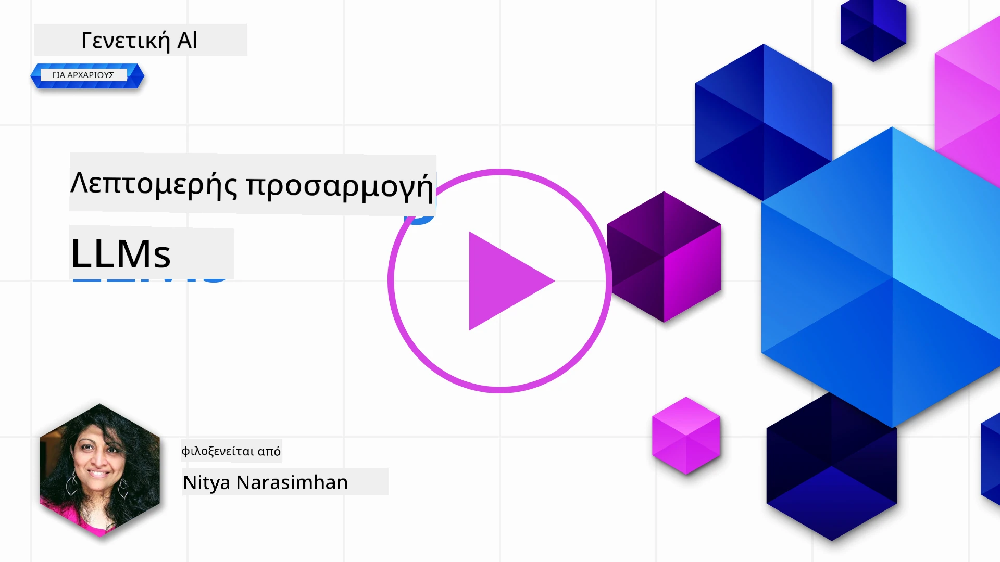

# Βελτιστοποίηση του LLM σας

Η χρήση μεγάλων γλωσσικών μοντέλων για την κατασκευή γενετικών εφαρμογών AI συνοδεύεται από νέες προκλήσεις. Ένα βασικό ζήτημα είναι η εξασφάλιση της ποιότητας της απόκρισης (ακρίβεια και συνάφεια) στο περιεχόμενο που παράγεται από το μοντέλο για ένα δεδομένο αίτημα χρήστη. Σε προηγούμενα μαθήματα, συζητήσαμε τεχνικές όπως η μηχανική προτροπής και η αύξηση παραγόμενου περιεχομένου μέσω ανάκτησης που προσπαθούν να λύσουν το πρόβλημα με το _τροποποίηση της εισόδου της προτροπής_ στο υπάρχον μοντέλο.

Στο σημερινό μάθημα, συζητάμε μια τρίτη τεχνική, τη **βελτιστοποίηση**, που προσπαθεί να αντιμετωπίσει την πρόκληση με το _επανεκπαίδευση του ίδιου του μοντέλου_ με επιπλέον δεδομένα. Ας εμβαθύνουμε στις λεπτομέρειες.

## Μαθησιακοί Στόχοι

Αυτό το μάθημα εισάγει την έννοια της βελτιστοποίησης για προεκπαιδευμένα γλωσσικά μοντέλα, εξερευνά τα οφέλη και τις προκλήσεις αυτής της προσέγγισης, και παρέχει οδηγίες για το πότε και πώς να χρησιμοποιήσετε τη βελτιστοποίηση για να βελτιώσετε την απόδοση των γενετικών μοντέλων AI σας.

Στο τέλος αυτού του μαθήματος θα πρέπει να μπορείτε να απαντήσετε στα ακόλουθα ερωτήματα:

- Τι είναι η βελτιστοποίηση για γλωσσικά μοντέλα;
- Πότε και γιατί είναι χρήσιμη η βελτιστοποίηση;
- Πώς μπορώ να βελτιστοποιήσω ένα προεκπαιδευμένο μοντέλο;
- Ποιοι είναι οι περιορισμοί της βελτιστοποίησης;

Έτοιμοι; Ας ξεκινήσουμε.

## Εικονογραφημένος Οδηγός

Θέλετε να πάρετε μια συνολική εικόνα αυτού που θα καλύψουμε πριν εμβαθύνουμε; Δείτε αυτόν τον εικονογραφημένο οδηγό που περιγράφει την μαθησιακή διαδρομή για αυτό το μάθημα - από την εκμάθηση των βασικών εννοιών και το κίνητρο για βελτιστοποίηση, μέχρι την κατανόηση της διαδικασίας και των βέλτιστων πρακτικών για την εκτέλεση της εργασίας βελτιστοποίησης. Αυτό είναι ένα συναρπαστικό θέμα για εξερεύνηση, οπότε μην ξεχάσετε να ελέγξετε τη σελίδα [Πόροι](./RESOURCES.md?WT.mc_id=academic-105485-koreyst) για πρόσθετους συνδέσμους που υποστηρίζουν την αυτοκαθοδηγούμενη μαθησιακή σας διαδρομή!

## Τι είναι η βελτιστοποίηση για γλωσσικά μοντέλα;

Κατά τον ορισμό, τα μεγάλα γλωσσικά μοντέλα είναι _προεκπαιδευμένα_ σε μεγάλες ποσότητες κειμένου που προέρχονται από διάφορες πηγές συμπεριλαμβανομένου του διαδικτύου. Όπως μάθαμε σε προηγούμενα μαθήματα, χρειαζόμαστε τεχνικές όπως η _μηχανική προτροπής_ και η _αύξηση παραγόμενου περιεχομένου μέσω ανάκτησης_ για να βελτιώσουμε την ποιότητα των απαντήσεων του μοντέλου στις ερωτήσεις του χρήστη ("προτροπές").

Μια δημοφιλής τεχνική μηχανικής προτροπής περιλαμβάνει το να δίνουμε στο μοντέλο περισσότερη καθοδήγηση για το τι αναμένεται στην απόκριση είτε παρέχοντας _οδηγίες_ (ρητή καθοδήγηση) είτε _δίνοντάς του μερικά παραδείγματα_ (άτυπη καθοδήγηση). Αυτό αναφέρεται ως _μάθηση με λίγα παραδείγματα_ αλλά έχει δύο περιορισμούς:

- Τα όρια των token του μοντέλου μπορούν να περιορίσουν τον αριθμό των παραδειγμάτων που μπορείτε να δώσετε και να μειώσουν την αποτελεσματικότητα.
- Το κόστος token μπορεί να κάνει ακριβή την προσθήκη παραδειγμάτων σε κάθε προτροπή και να περιορίσει την ευελιξία.

Η βελτιστοποίηση είναι μια κοινή πρακτική στα συστήματα μηχανικής μάθησης όπου παίρνουμε ένα προεκπαιδευμένο μοντέλο και το επανεκπαιδεύουμε με νέα δεδομένα για να βελτιώσουμε την απόδοσή του σε ένα συγκεκριμένο έργο. Στο πλαίσιο των γλωσσικών μοντέλων, μπορούμε να βελτιστοποιήσουμε το προεκπαιδευμένο μοντέλο _με ένα επιμελημένο σύνολο παραδειγμάτων για ένα συγκεκριμένο έργο ή τομέα εφαρμογής_ για να δημιουργήσουμε ένα **προσαρμοσμένο μοντέλο** που μπορεί να είναι πιο ακριβές και σχετικό για εκείνο το συγκεκριμένο έργο ή τομέα. Ένα προαιρετικό όφελος της βελτιστοποίησης είναι ότι μπορεί επίσης να μειώσει τον αριθμό των παραδειγμάτων που απαιτούνται για την μάθηση με λίγα παραδείγματα - μειώνοντας τη χρήση token και τα σχετιζόμενα κόστη.

## Πότε και γιατί πρέπει να βελτιστοποιούμε τα μοντέλα;

Σε _αυτό_ το πλαίσιο, όταν μιλάμε για βελτιστοποίηση, αναφερόμαστε σε **εποπτευόμενη** βελτιστοποίηση όπου η επανεκπαίδευση γίνεται μέσω **προσθήκης νέων δεδομένων** που δεν ήταν μέρος του αρχικού συνόλου εκπαίδευσης. Αυτό διαφέρει από την μη εποπτευόμενη βελτιστοποίηση όπου το μοντέλο επανεκπαιδεύεται στα αρχικά δεδομένα, αλλά με διαφορετικές υπερπαραμέτρους.

Το βασικό πράγμα που πρέπει να θυμάστε είναι ότι η βελτιστοποίηση είναι μια προηγμένη τεχνική που απαιτεί ένα ορισμένο επίπεδο εξειδίκευσης για να επιτύχετε τα επιθυμητά αποτελέσματα. Αν γίνει λανθασμένα, μπορεί να μη δώσει τις αναμενόμενες βελτιώσεις και ίσως ακόμα να υποβαθμίσει την απόδοση του μοντέλου για τον στοχευόμενο τομέα σας.

Έτσι, προτού μάθετε το "πώς" να βελτιστοποιείτε γλωσσικά μοντέλα, πρέπει να ξέρετε το "γιατί" πρέπει να ακολουθήσετε αυτήν την πορεία και το "πότε" να ξεκινήσετε τη διαδικασία βελτιστοποίησης. Ξεκινήστε ρωτώντας τον εαυτό σας αυτές τις ερωτήσεις:

- **Περίπτωση Χρήσης**: Ποια είναι η _περίπτωσή_ σας για τη βελτιστοποίηση; Ποια πλευρά του τρέχοντος προεκπαιδευμένου μοντέλου θέλετε να βελτιώσετε;
- **Εναλλακτικές**: Έχετε δοκιμάσει _άλλες τεχνικές_ για να πετύχετε τα επιθυμητά αποτελέσματα; Χρησιμοποιήστε τις για να δημιουργήσετε μια βάση σύγκρισης.
  - Μηχανική προτροπής: Δοκιμάστε μεθόδους όπως προτροπή με λίγα παραδείγματα σχετικές με τις απαντήσεις της προτροπής. Αξιολογείστε την ποιότητα των απαντήσεων.
  - Αύξηση Παραγόμενου Περιεχομένου μέσω Ανάκτησης: Δοκιμάστε να εμπλουτίσετε τις προτροπές με αποτελέσματα αναζήτησης που αντλήθηκαν από τα δεδομένα σας. Αξιολογείστε την ποιότητα των απαντήσεων.
- **Κόστη**: Έχετε εντοπίσει τα κόστη για τη βελτιστοποίηση;
  - Δυνατότητα βελτιστοποίησης - είναι το προεκπαιδευμένο μοντέλο διαθέσιμο για βελτιστοποίηση;
  - Προσπάθεια - για την προετοιμασία δεδομένων εκπαίδευσης, την αξιολόγηση και τη βελτίωση του μοντέλου.
  - Υπολογιστική ισχύς - για τη διεξαγωγή εργασιών βελτιστοποίησης και την ανάπτυξη του βελτιστοποιημένου μοντέλου
  - Δεδομένα - πρόσβαση σε επαρκή ποιοτικά παραδείγματα για την αποτελεσματικότητα της βελτιστοποίησης
- **Οφέλη**: Έχετε επιβεβαιώσει τα οφέλη της βελτιστοποίησης;
  - Ποιότητα - το βελτιστοποιημένο μοντέλο ξεπέρασε τη βασική γραμμή;
  - Κόστος - μειώνει τη χρήση token απλουστεύοντας τις προτροπές;
  - Επεκτασιμότητα - μπορείτε να επαναχρησιμοποιήσετε το βασικό μοντέλο για νέους τομείς;

Απαντώντας σε αυτές τις ερωτήσεις, θα πρέπει να μπορείτε να αποφασίσετε αν η βελτιστοποίηση είναι η κατάλληλη προσέγγιση για την περίπτωσή σας. Ιδανικά, η προσέγγιση ισχύει μόνο αν τα οφέλη υπερτερούν των κόστους. Μόλις αποφασίσετε να προχωρήσετε, είναι ώρα να σκεφτείτε το _πώς_ μπορείτε να βελτιστοποιήσετε το προεκπαιδευμένο μοντέλο.

Θέλετε να πάρετε περισσότερες πληροφορίες για τη διαδικασία λήψης αποφάσεων; Παρακολουθήστε το [To fine-tune or not to fine-tune](https://www.youtube.com/watch?v=0Jo-z-MFxJs)

## Πώς μπορούμε να βελτιστοποιήσουμε ένα προεκπαιδευμένο μοντέλο;

Για να βελτιστοποιήσετε ένα προεκπαιδευμένο μοντέλο, πρέπει να έχετε:

- ένα προεκπαιδευμένο μοντέλο για βελτιστοποίηση
- ένα σύνολο δεδομένων για να χρησιμοποιήσετε στη βελτιστοποίηση
- ένα περιβάλλον εκπαίδευσης για να τρέξετε την εργασία βελτιστοποίησης
- ένα περιβάλλον φιλοξενίας για να αναπτύξετε το βελτιστοποιημένο μοντέλο

## Βελτιστοποίηση σε Δράση

Οι παρακάτω πόροι παρέχουν αναλυτικά σεμινάρια για να σας καθοδηγήσουν σε ένα πραγματικό παράδειγμα χρησιμοποιώντας επιλεγμένο μοντέλο με επιμελημένο σύνολο δεδομένων. Για να δουλέψετε αυτά τα σεμινάρια, χρειάζεστε λογαριασμό στον συγκεκριμένο πάροχο, μαζί με πρόσβαση στο σχετικό μοντέλο και σύνολα δεδομένων.

| Πάροχος     | Σεμινάριο                                                                                                                                                                       | Περιγραφή                                                                                                                                                                                                                                                                                                                                                                                                                        |
| ------------ | ------------------------------------------------------------------------------------------------------------------------------------------------------------------------------ | ---------------------------------------------------------------------------------------------------------------------------------------------------------------------------------------------------------------------------------------------------------------------------------------------------------------------------------------------------------------------------------------------------------------------------------- |
| OpenAI       | [Πώς να βελτιστοποιήσετε μοντέλα chat](https://github.com/openai/openai-cookbook/blob/main/examples/How_to_finetune_chat_models.ipynb?WT.mc_id=academic-105485-koreyst)          | Μάθετε να βελτιστοποιείτε ένα `gpt-35-turbo` για έναν συγκεκριμένο τομέα ("βοηθός συνταγών") προετοιμάζοντας τα δεδομένα εκπαίδευσης, τρέχοντας την εργασία βελτιστοποίησης, και χρησιμοποιώντας το βελτιστοποιημένο μοντέλο για συμπερασματολογία.                                                                                                                                                                              |
| Azure OpenAI | [Σεμινάριο βελτιστοποίησης GPT 3.5 Turbo](https://learn.microsoft.com/azure/ai-services/openai/tutorials/fine-tune?tabs=python-new%2Ccommand-line?WT.mc_id=academic-105485-koreyst) | Μάθετε να βελτιστοποιείτε ένα μοντέλο `gpt-35-turbo-0613` **στο Azure** λαμβάνοντας βήματα για τη δημιουργία & ανέβασμα δεδομένων εκπαίδευσης, εκτέλεση της εργασίας βελτιστοποίησης, ανάπτυξη & χρήση του νέου μοντέλου.                                                                                                                                                                                                         |
| Hugging Face | [Βελτιστοποίηση LLMs με Hugging Face](https://www.philschmid.de/fine-tune-llms-in-2024-with-trl?WT.mc_id=academic-105485-koreyst)                                               | Αυτό το άρθρο ιστολογίου σας καθοδηγεί στη βελτιστοποίηση ενός _ανοικτού LLM_ (π.χ. `CodeLlama 7B`) χρησιμοποιώντας τη βιβλιοθήκη [transformers](https://huggingface.co/docs/transformers/index?WT.mc_id=academic-105485-koreyst) & το [Transformer Reinforcement Learning (TRL)](https://huggingface.co/docs/trl/index?WT.mc_id=academic-105485-koreyst]) με ανοικτά [συνόλα δεδομένων](https://huggingface.co/docs/datasets/index?WT.mc_id=academic-105485-koreyst) στο Hugging Face. |
|              |                                                                                                                                                                                |                                                                                                                                                                                                                                                                                                                                                                                                                                    |
| 🤗 AutoTrain | [Βελτιστοποίηση LLMs με AutoTrain](https://github.com/huggingface/autotrain-advanced/?WT.mc_id=academic-105485-koreyst)                                                         | Το AutoTrain (ή AutoTrain Advanced) είναι μια βιβλιοθήκη python που αναπτύχθηκε από το Hugging Face και επιτρέπει τη βελτιστοποίηση για πολλές διαφορετικές εργασίες, συμπεριλαμβανομένης της βελτιστοποίησης LLM. Το AutoTrain είναι μια λύση χωρίς κώδικα και η βελτιστοποίηση μπορεί να γίνει στο δικό σας cloud, στα Hugging Face Spaces ή τοπικά. Υποστηρίζει τόσο GUI βασισμένο σε web, CLI όσο και εκπαίδευση μέσω αρχείων ρυθμίσεων yaml.                                               |
|              |                                                                                                                                                                                |                                                                                                                                                                                                                                                                                                                                                                                                                                    |
| 🦥 Unsloth | [Βελτιστοποίηση LLMs με Unsloth](https://github.com/unslothai/unsloth)                                                         | Το Unsloth είναι ένα ανοικτό πλαίσιο που υποστηρίζει τη βελτιστοποίηση LLM και την ενισχυτική μάθηση (RL). Το Unsloth απλοποιεί την τοπική εκπαίδευση, αξιολόγηση και ανάπτυξη με έτοιμα προς χρήση [notebooks](https://github.com/unslothai/notebooks). Υποστηρίζει επίσης text-to-speech (TTS), BERT και πολυτροπικά μοντέλα. Για να ξεκινήσετε, διαβάστε τον βήμα προς βήμα [Οδηγό Βελτιστοποίησης LLMs](https://docs.unsloth.ai/get-started/fine-tuning-llms-guide).                                                                          |
|              |                                                                                                                                                                                |                                                                                                                                                                                                                                                                                                                                                                                                                                    |
## Εργασία

Επιλέξτε ένα από τα παραπάνω σεμινάρια και ακολουθήστε τα. _Μπορεί να αναπαράγουμε μια έκδοση αυτών των σεμιναρίων σε Jupyter Notebooks σε αυτό το αποθετήριο μόνο για αναφορά. Παρακαλούμε χρησιμοποιήστε τις πρωτότυπες πηγές απευθείας για να αποκτήσετε τις πιο ενημερωμένες εκδόσεις_.

## Εξαιρετική δουλειά! Συνεχίστε τη Μάθησή σας.

Μετά την ολοκλήρωση αυτού του μαθήματος, ελέγξτε τη συλλογή μας [Generative AI Learning collection](https://aka.ms/genai-collection?WT.mc_id=academic-105485-koreyst) για να συνεχίσετε να ανεβάζετε το επίπεδο των γνώσεων σας στην Γενετική Τεχνητή Νοημοσύνη!

Συγχαρητήρια!! Έχετε ολοκληρώσει το τελικό μάθημα από τη σειρά v2 για αυτό το μάθημα! Μην σταματήσετε να μαθαίνετε και να δημιουργείτε. \*\*Δείτε τη σελίδα [Πόροι](RESOURCES.md?WT.mc_id=academic-105485-koreyst) για μια λίστα επιπλέον προτάσεων μόνο για αυτό το θέμα.

Η σειρά μαθημάτων v1 έχει επίσης ενημερωθεί με περισσότερες εργασίες και έννοιες. Πάρτε ένα λεπτό για να ανανεώσετε τις γνώσεις σας - και παρακαλούμε [μοιραστείτε τις ερωτήσεις και τα σχόλιά σας](https://github.com/microsoft/generative-ai-for-beginners/issues?WT.mc_id=academic-105485-koreyst) για να μας βοηθήσετε να βελτιώσουμε αυτά τα μαθήματα για την κοινότητα.

---

<!-- CO-OP TRANSLATOR DISCLAIMER START -->
**Αποποίηση ευθυνών**:  
Αυτό το έγγραφο έχει μεταφραστεί χρησιμοποιώντας την υπηρεσία αυτόματης μετάφρασης AI [Co-op Translator](https://github.com/Azure/co-op-translator). Παρόλο που καταβάλλουμε προσπάθειες για ακρίβεια, παρακαλούμε να λάβετε υπόψη ότι οι αυτόματες μεταφράσεις μπορεί να περιέχουν σφάλματα ή ανακρίβειες. Το πρωτότυπο έγγραφο στη γλώσσα του αποτελεί την επίσημη πηγή. Για κρίσιμες πληροφορίες, συνιστάται επαγγελματική μετάφραση από ανθρώπους. Δεν φέρουμε ευθύνη για τυχόν παρεξηγήσεις ή λανθασμένες ερμηνείες που προκύπτουν από τη χρήση αυτής της μετάφρασης.
<!-- CO-OP TRANSLATOR DISCLAIMER END -->