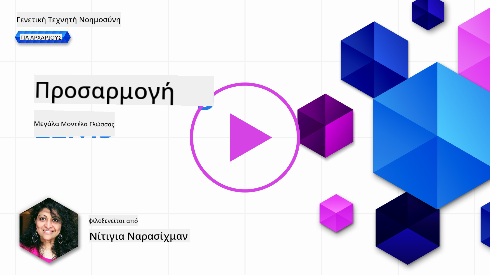
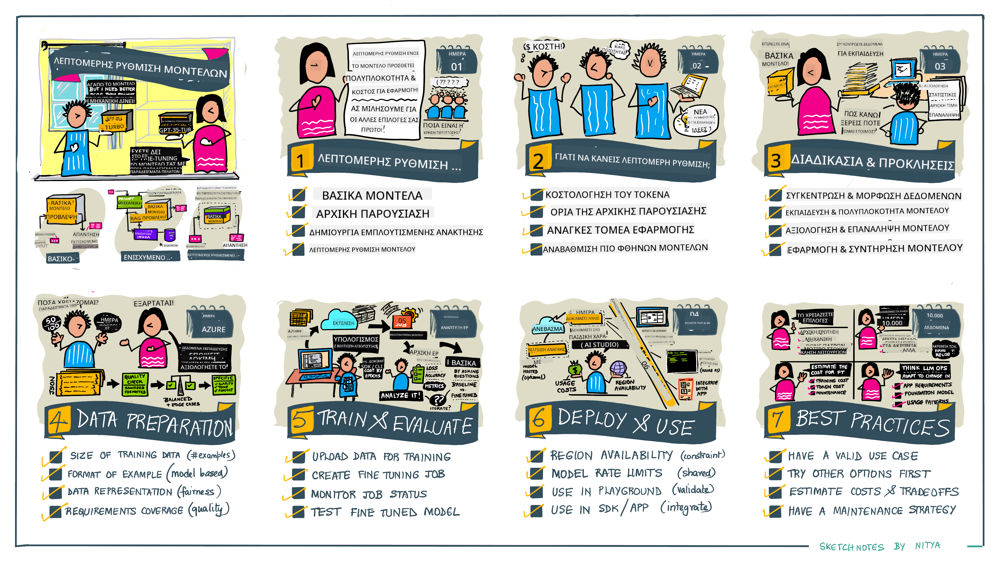

<!--
CO_OP_TRANSLATOR_METADATA:
{
  "original_hash": "68664f7e754a892ae1d8d5e2b7bd2081",
  "translation_date": "2025-07-09T17:43:07+00:00",
  "source_file": "18-fine-tuning/README.md",
  "language_code": "el"
}
-->

# Βελτιστοποίηση του LLM σας

Η χρήση μεγάλων γλωσσικών μοντέλων για την ανάπτυξη εφαρμογών γεννητικής τεχνητής νοημοσύνης φέρνει νέες προκλήσεις. Ένα βασικό ζήτημα είναι η διασφάλιση της ποιότητας των απαντήσεων (ακρίβεια και σχετικότητα) στο περιεχόμενο που παράγεται από το μοντέλο για ένα συγκεκριμένο αίτημα χρήστη. Σε προηγούμενα μαθήματα, συζητήσαμε τεχνικές όπως το prompt engineering και τη δημιουργία με ανάκτηση (retrieval-augmented generation) που προσπαθούν να λύσουν το πρόβλημα με το _να τροποποιούν την είσοδο του prompt_ στο υπάρχον μοντέλο.

Στο σημερινό μάθημα, θα εξετάσουμε μια τρίτη τεχνική, την **βελτιστοποίηση (fine-tuning)**, που προσπαθεί να αντιμετωπίσει την πρόκληση με το _να εκπαιδεύει ξανά το ίδιο το μοντέλο_ με επιπλέον δεδομένα. Ας δούμε τις λεπτομέρειες.

## Στόχοι Μάθησης

Αυτό το μάθημα εισάγει την έννοια της βελτιστοποίησης για προεκπαιδευμένα γλωσσικά μοντέλα, εξερευνά τα οφέλη και τις προκλήσεις αυτής της προσέγγισης και παρέχει οδηγίες για το πότε και πώς να χρησιμοποιήσετε τη βελτιστοποίηση για να βελτιώσετε την απόδοση των μοντέλων γεννητικής τεχνητής νοημοσύνης σας.

Στο τέλος αυτού του μαθήματος, θα πρέπει να μπορείτε να απαντήσετε στις εξής ερωτήσεις:

- Τι είναι η βελτιστοποίηση για γλωσσικά μοντέλα;
- Πότε και γιατί είναι χρήσιμη η βελτιστοποίηση;
- Πώς μπορώ να βελτιστοποιήσω ένα προεκπαιδευμένο μοντέλο;
- Ποιες είναι οι περιορισμοί της βελτιστοποίησης;

Έτοιμοι; Ας ξεκινήσουμε.

## Εικονογραφημένος Οδηγός

Θέλετε να πάρετε μια συνολική εικόνα για το τι θα καλύψουμε πριν εμβαθύνουμε; Δείτε αυτόν τον εικονογραφημένο οδηγό που περιγράφει το ταξίδι μάθησης για αυτό το μάθημα - από την εκμάθηση των βασικών εννοιών και του κίνητρου για βελτιστοποίηση, μέχρι την κατανόηση της διαδικασίας και των βέλτιστων πρακτικών για την εκτέλεση της εργασίας βελτιστοποίησης. Πρόκειται για ένα συναρπαστικό θέμα για εξερεύνηση, οπότε μην ξεχάσετε να επισκεφτείτε τη σελίδα [Resources](./RESOURCES.md?WT.mc_id=academic-105485-koreyst) για επιπλέον συνδέσμους που θα υποστηρίξουν το αυτοκαθοδηγούμενο ταξίδι μάθησής σας!

## Τι είναι η βελτιστοποίηση για γλωσσικά μοντέλα;

Κατά τον ορισμό, τα μεγάλα γλωσσικά μοντέλα είναι _προεκπαιδευμένα_ σε μεγάλες ποσότητες κειμένου που προέρχονται από διάφορες πηγές, συμπεριλαμβανομένου του διαδικτύου. Όπως μάθαμε σε προηγούμενα μαθήματα, χρειαζόμαστε τεχνικές όπως το _prompt engineering_ και τη _δημιουργία με ανάκτηση_ για να βελτιώσουμε την ποιότητα των απαντήσεων του μοντέλου στις ερωτήσεις ("prompts") του χρήστη.

Μια δημοφιλής τεχνική prompt engineering περιλαμβάνει το να δίνουμε στο μοντέλο περισσότερη καθοδήγηση για το τι αναμένεται στην απάντηση, είτε παρέχοντας _οδηγίες_ (ρητή καθοδήγηση) είτε _δίνοντάς του μερικά παραδείγματα_ (έμμεση καθοδήγηση). Αυτό αναφέρεται ως _few-shot learning_, αλλά έχει δύο περιορισμούς:

- Τα όρια των tokens του μοντέλου μπορούν να περιορίσουν τον αριθμό των παραδειγμάτων που μπορείτε να δώσετε και να μειώσουν την αποτελεσματικότητα.
- Το κόστος των tokens μπορεί να κάνει ακριβό το να προσθέτετε παραδείγματα σε κάθε prompt και να περιορίσει την ευελιξία.

Η βελτιστοποίηση είναι μια κοινή πρακτική στα συστήματα μηχανικής μάθησης όπου παίρνουμε ένα προεκπαιδευμένο μοντέλο και το εκπαιδεύουμε ξανά με νέα δεδομένα για να βελτιώσουμε την απόδοσή του σε μια συγκεκριμένη εργασία. Στο πλαίσιο των γλωσσικών μοντέλων, μπορούμε να βελτιστοποιήσουμε το προεκπαιδευμένο μοντέλο _με ένα επιλεγμένο σύνολο παραδειγμάτων για μια συγκεκριμένη εργασία ή τομέα εφαρμογής_ για να δημιουργήσουμε ένα **προσαρμοσμένο μοντέλο** που μπορεί να είναι πιο ακριβές και σχετικό για αυτήν την εργασία ή τομέα. Ένα επιπλέον όφελος της βελτιστοποίησης είναι ότι μπορεί επίσης να μειώσει τον αριθμό των παραδειγμάτων που χρειάζονται για το few-shot learning - μειώνοντας τη χρήση tokens και τα σχετικά κόστη.

## Πότε και γιατί πρέπει να βελτιστοποιούμε μοντέλα;

Σε _αυτό_ το πλαίσιο, όταν μιλάμε για βελτιστοποίηση, αναφερόμαστε σε **εποπτευόμενη** βελτιστοποίηση όπου η επανεκπαίδευση γίνεται με **προσθήκη νέων δεδομένων** που δεν ήταν μέρος του αρχικού συνόλου εκπαίδευσης. Αυτό διαφέρει από μια μη εποπτευόμενη προσέγγιση βελτιστοποίησης όπου το μοντέλο εκπαιδεύεται ξανά στα αρχικά δεδομένα, αλλά με διαφορετικές υπερπαραμέτρους.

Το βασικό που πρέπει να θυμάστε είναι ότι η βελτιστοποίηση είναι μια προχωρημένη τεχνική που απαιτεί ένα επίπεδο εξειδίκευσης για να επιτευχθούν τα επιθυμητά αποτελέσματα. Αν γίνει λανθασμένα, μπορεί να μην προσφέρει τις αναμενόμενες βελτιώσεις και μπορεί ακόμη και να υποβαθμίσει την απόδοση του μοντέλου για τον στοχευμένο τομέα σας.

Έτσι, πριν μάθετε "πώς" να βελτιστοποιείτε γλωσσικά μοντέλα, πρέπει να ξέρετε "γιατί" να ακολουθήσετε αυτήν την οδό και "πότε" να ξεκινήσετε τη διαδικασία βελτιστοποίησης. Ξεκινήστε ρωτώντας τον εαυτό σας τα εξής:

- **Περίπτωση Χρήσης**: Ποια είναι η _περίπτωση χρήσης_ σας για βελτιστοποίηση; Ποια πτυχή του τρέχοντος προεκπαιδευμένου μοντέλου θέλετε να βελτιώσετε;
- **Εναλλακτικές**: Έχετε δοκιμάσει _άλλες τεχνικές_ για να πετύχετε τα επιθυμητά αποτελέσματα; Χρησιμοποιήστε τις για να δημιουργήσετε μια βάση σύγκρισης.
  - Prompt engineering: Δοκιμάστε τεχνικές όπως few-shot prompting με παραδείγματα σχετικών απαντήσεων. Αξιολογήστε την ποιότητα των απαντήσεων.
  - Retrieval Augmented Generation: Δοκιμάστε να ενισχύσετε τα prompts με αποτελέσματα αναζήτησης στα δεδομένα σας. Αξιολογήστε την ποιότητα των απαντήσεων.
- **Κόστη**: Έχετε εντοπίσει τα κόστη για τη βελτιστοποίηση;
  - Δυνατότητα βελτιστοποίησης - είναι διαθέσιμο το προεκπαιδευμένο μοντέλο για βελτιστοποίηση;
  - Προσπάθεια - για την προετοιμασία των δεδομένων εκπαίδευσης, την αξιολόγηση και τη βελτίωση του μοντέλου.
  - Υπολογιστική ισχύς - για την εκτέλεση των εργασιών βελτιστοποίησης και την ανάπτυξη του βελτιστοποιημένου μοντέλου.
  - Δεδομένα - πρόσβαση σε επαρκή και ποιοτικά παραδείγματα για να έχει αποτέλεσμα η βελτιστοποίηση.
- **Οφέλη**: Έχετε επιβεβαιώσει τα οφέλη της βελτιστοποίησης;
  - Ποιότητα - το βελτιστοποιημένο μοντέλο ξεπέρασε τη βάση αναφοράς;
  - Κόστος - μειώνει τη χρήση tokens απλοποιώντας τα prompts;
  - Επεκτασιμότητα - μπορείτε να επαναχρησιμοποιήσετε το βασικό μοντέλο για νέους τομείς;

Απαντώντας σε αυτές τις ερωτήσεις, θα πρέπει να μπορείτε να αποφασίσετε αν η βελτιστοποίηση είναι η σωστή προσέγγιση για την περίπτωσή σας. Ιδανικά, η προσέγγιση είναι έγκυρη μόνο αν τα οφέλη υπερτερούν των κόστους. Μόλις αποφασίσετε να προχωρήσετε, είναι ώρα να σκεφτείτε _πώς_ μπορείτε να βελτιστοποιήσετε το προεκπαιδευμένο μοντέλο.

Θέλετε περισσότερες πληροφορίες για τη διαδικασία λήψης αποφάσεων; Δείτε το [To fine-tune or not to fine-tune](https://www.youtube.com/watch?v=0Jo-z-MFxJs)

## Πώς μπορούμε να βελτιστοποιήσουμε ένα προεκπαιδευμένο μοντέλο;

Για να βελτιστοποιήσετε ένα προεκπαιδευμένο μοντέλο, χρειάζεστε:

- ένα προεκπαιδευμένο μοντέλο για βελτιστοποίηση
- ένα σύνολο δεδομένων για χρήση στη βελτιστοποίηση
- ένα περιβάλλον εκπαίδευσης για να τρέξετε την εργασία βελτιστοποίησης
- ένα περιβάλλον φιλοξενίας για να αναπτύξετε το βελτιστοποιημένο μοντέλο

## Βελτιστοποίηση στην Πράξη

Οι παρακάτω πηγές παρέχουν βήμα-βήμα οδηγούς για να σας καθοδηγήσουν σε ένα πραγματικό παράδειγμα χρησιμοποιώντας ένα επιλεγμένο μοντέλο με ένα επιμελημένο σύνολο δεδομένων. Για να δουλέψετε με αυτούς τους οδηγούς, χρειάζεστε λογαριασμό στον αντίστοιχο πάροχο, καθώς και πρόσβαση στο σχετικό μοντέλο και τα σύνολα δεδομένων.

| Πάροχος     | Οδηγός                                                                                                                                                                       | Περιγραφή                                                                                                                                                                                                                                                                                                                                                                                                                        |
| ------------ | ------------------------------------------------------------------------------------------------------------------------------------------------------------------------------ | ---------------------------------------------------------------------------------------------------------------------------------------------------------------------------------------------------------------------------------------------------------------------------------------------------------------------------------------------------------------------------------------------------------------------------------- |
| OpenAI       | [How to fine-tune chat models](https://github.com/openai/openai-cookbook/blob/main/examples/How_to_finetune_chat_models.ipynb?WT.mc_id=academic-105485-koreyst)                | Μάθετε πώς να βελτιστοποιήσετε ένα `gpt-35-turbo` για έναν συγκεκριμένο τομέα ("βοηθός συνταγών") προετοιμάζοντας δεδομένα εκπαίδευσης, τρέχοντας την εργασία βελτιστοποίησης και χρησιμοποιώντας το βελτιστοποιημένο μοντέλο για συμπερασματολογία.                                                                                                                                                                              |
| Azure OpenAI | [GPT 3.5 Turbo fine-tuning tutorial](https://learn.microsoft.com/azure/ai-services/openai/tutorials/fine-tune?tabs=python-new%2Ccommand-line?WT.mc_id=academic-105485-koreyst) | Μάθετε πώς να βελτιστοποιήσετε ένα μοντέλο `gpt-35-turbo-0613` **στο Azure** ακολουθώντας βήματα για τη δημιουργία και μεταφόρτωση δεδομένων εκπαίδευσης, την εκτέλεση της εργασίας βελτιστοποίησης, την ανάπτυξη και χρήση του νέου μοντέλου.                                                                                                                                                                                                 |
| Hugging Face | [Fine-tuning LLMs with Hugging Face](https://www.philschmid.de/fine-tune-llms-in-2024-with-trl?WT.mc_id=academic-105485-koreyst)                                               | Αυτό το άρθρο σας καθοδηγεί στη βελτιστοποίηση ενός _ανοιχτού LLM_ (π.χ. `CodeLlama 7B`) χρησιμοποιώντας τη βιβλιοθήκη [transformers](https://huggingface.co/docs/transformers/index?WT.mc_id=academic-105485-koreyst) και το [Transformer Reinforcement Learning (TRL)](https://huggingface.co/docs/trl/index?WT.mc_id=academic-105485-koreyst) με ανοιχτά [datasets](https://huggingface.co/docs/datasets/index?WT.mc_id=academic-105485-koreyst) στο Hugging Face. |
|              |                                                                                                                                                                                |                                                                                                                                                                                                                                                                                                                                                                                                                                    |
| 🤗 AutoTrain | [Fine-tuning LLMs with AutoTrain](https://github.com/huggingface/autotrain-advanced/?WT.mc_id=academic-105485-koreyst)                                                         | Το AutoTrain (ή AutoTrain Advanced) είναι μια βιβλιοθήκη Python που αναπτύχθηκε από το Hugging Face και επιτρέπει τη βελτιστοποίηση για πολλές διαφορετικές εργασίες, συμπεριλαμβανομένης της βελτιστοποίησης LLM. Το AutoTrain είναι μια λύση χωρίς κώδικα και η βελτιστοποίηση μπορεί να γίνει στο δικό σας cloud, στα Hugging Face Spaces ή τοπικά. Υποστηρίζει τόσο web-based GUI, CLI όσο και εκπαίδευση μέσω αρχείων ρυθμίσεων yaml.                                                                               |
|              |                                                                                                                                                                                |                                                                                                                                                                                                                                                                                                                                                                                                                                    |

## Άσκηση

Επιλέξτε έναν από τους παραπάνω οδηγούς και ακολουθήστε τον βήμα-βήμα. _Ενδέχεται να αναπαράγουμε μια έκδοση αυτών των οδηγών σε Jupyter Notebooks σε αυτό το αποθετήριο μόνο για αναφορά. Παρακαλούμε χρησιμοποιήστε τις πρωτότυπες πηγές απευθείας για να έχετε τις πιο πρόσφατες εκδόσεις_.

## Μπράβο! Συνεχίστε τη Μάθησή σας.

Μετά την ολοκλήρωση αυτού του μαθήματος, επισκεφτείτε τη συλλογή μας [Generative AI Learning collection](https://aka.ms/genai-collection?WT.mc_id=academic-105485-koreyst) για να συνεχίσετε να αναβαθμίζετε τις γνώσεις σας στην Γεννητική Τεχνητή Νοημοσύνη!

Συγχαρητήρια!! Ολοκληρώσατε το τελευταίο μάθημα της σειράς v2 για αυτό το μάθημα! Μην σταματήσετε να μαθαίνετε και να δημιουργείτε. \*\*Δείτε τη σελίδα [RESOURCES](RESOURCES.md?WT.mc_id=academic-105485-koreyst) για μια λίστα με επιπλέον προτάσεις μόνο για αυτό το θέμα.

Η σειρά μαθημάτων v1 έχει επίσης ενημερωθεί με περισσότερες ασκήσεις και έννοιες. Πάρτε ένα λεπτό να ανανεώσετε τις γνώσεις σας - και παρακαλούμε [μοιραστείτε τις ερωτήσεις και τα σχόλιά σας](https://github.com/microsoft/generative-ai-for-beginners/issues?WT.mc_id=academic-105485-koreyst) για να μας βοηθήσετε να βελτιώσουμε αυτά τα μαθήματα για την κοινότητα.

**Αποποίηση ευθυνών**:  
Αυτό το έγγραφο έχει μεταφραστεί χρησιμοποιώντας την υπηρεσία αυτόματης μετάφρασης AI [Co-op Translator](https://github.com/Azure/co-op-translator). Παρόλο που επιδιώκουμε την ακρίβεια, παρακαλούμε να έχετε υπόψη ότι οι αυτόματες μεταφράσεις ενδέχεται να περιέχουν λάθη ή ανακρίβειες. Το πρωτότυπο έγγραφο στη γλώσσα του θεωρείται η αυθεντική πηγή. Για κρίσιμες πληροφορίες, συνιστάται επαγγελματική ανθρώπινη μετάφραση. Δεν φέρουμε ευθύνη για τυχόν παρεξηγήσεις ή λανθασμένες ερμηνείες που προκύπτουν από τη χρήση αυτής της μετάφρασης.