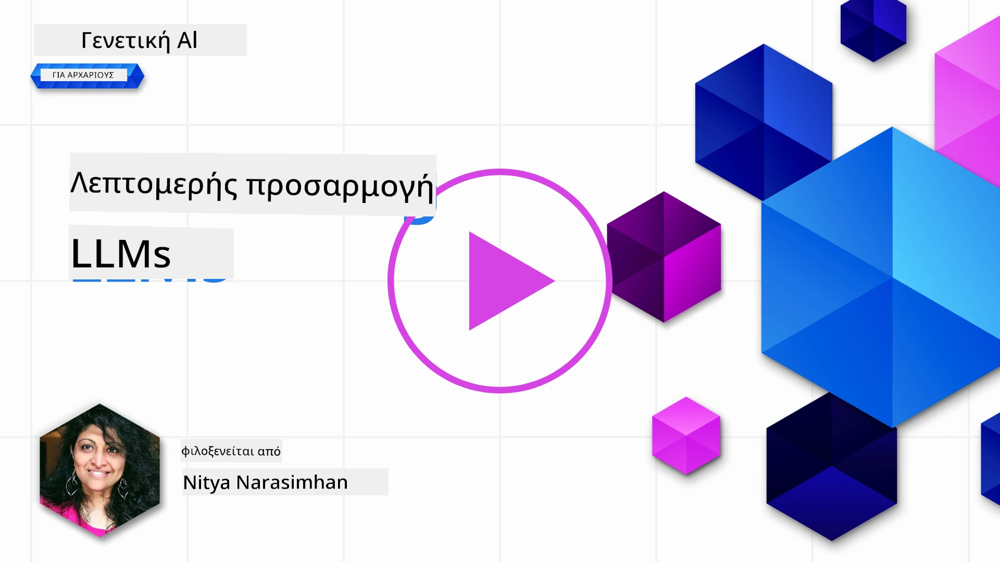
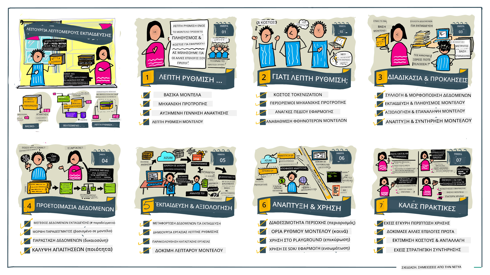

# Ρύθμιση Λεπτομέρειας του LLM σας

Η χρήση μεγάλων γλωσσικών μοντέλων για την κατασκευή εφαρμογών γεννητικής τεχνητής νοημοσύνης συνοδεύεται από νέες προκλήσεις. Ένα βασικό ζήτημα είναι η εξασφάλιση της ποιότητας των απαντήσεων (ακρίβεια και σχετικότητα) στο περιεχόμενο που παράγει το μοντέλο για ένα συγκεκριμένο αίτημα χρήστη. Σε προηγούμενα μαθήματα, συζητήσαμε τεχνικές όπως η μηχανική προτροπής και η ανάκτηση-ενισχυμένης δημιουργίας που προσπαθούν να λύσουν το πρόβλημα με το _να τροποποιούν την είσοδο προτροπής_ στο υπάρχον μοντέλο.

Στο σημερινό μάθημα, συζητάμε μια τρίτη τεχνική, τη **ρύθμιση λεπτομέρειας (fine-tuning)**, που προσπαθεί να αντιμετωπίσει την πρόκληση _με την εκ νέου εκπαίδευση του ίδιου του μοντέλου_ με επιπλέον δεδομένα. Ας εξερευνήσουμε τις λεπτομέρειες.

## Στόχοι Μάθησης

Αυτό το μάθημα εισάγει την έννοια της ρύθμισης λεπτομέρειας για προεκπαιδευμένα γλωσσικά μοντέλα, εξετάζει τα οφέλη και τις προκλήσεις αυτής της προσέγγισης και παρέχει οδηγίες για το πότε και πώς να χρησιμοποιήσετε τη ρύθμιση λεπτομέρειας για να βελτιώσετε την απόδοση των μοντέλων γεννητικής τεχνητής νοημοσύνης σας.

Με το τέλος αυτού του μαθήματος, θα πρέπει να μπορείτε να απαντήσετε στις ακόλουθες ερωτήσεις:

- Τι είναι η ρύθμιση λεπτομέρειας για γλωσσικά μοντέλα;
- Πότε και γιατί είναι χρήσιμη η ρύθμιση λεπτομέρειας;
- Πώς μπορώ να ρυθμίσω λεπτομερώς ένα προεκπαιδευμένο μοντέλο;
- Ποιοι είναι οι περιορισμοί της ρύθμισης λεπτομέρειας;

Έτοιμοι; Ας ξεκινήσουμε.

## Οδηγός με Εικονογράφηση

Θέλετε να πάρετε μια συνολική εικόνα για το τι θα καλύψουμε πριν βουτήξουμε; Δείτε αυτόν τον εικονογραφημένο οδηγό που περιγράφει το ταξίδι μάθησης για το μάθημα - από την εκμάθηση των βασικών εννοιών και της κινητήριας δύναμης για τη ρύθμιση λεπτομέρειας, μέχρι την κατανόηση της διαδικασίας και των βέλτιστων πρακτικών για την εκτέλεση της εργασίας ρύθμισης λεπτομέρειας. Πρόκειται για ένα συναρπαστικό θέμα για εξερεύνηση, οπότε μην ξεχάσετε να επισκεφθείτε τη σελίδα [Πόροι](./RESOURCES.md?WT.mc_id=academic-105485-koreyst) για επιπλέον συνδέσμους που θα υποστηρίξουν το αυτοκαθοδηγούμενο ταξίδι μάθησής σας!

## Τι είναι η ρύθμιση λεπτομέρειας για γλωσσικά μοντέλα;

Κατά τον ορισμό, τα μεγάλα γλωσσικά μοντέλα είναι _προεκπαιδευμένα_ σε μεγάλα ποσά κειμένου που προέρχονται από διάφορες πηγές, συμπεριλαμβανομένου του διαδικτύου. Όπως έχουμε μάθει σε προηγούμενα μαθήματα, χρειάζονται τεχνικές όπως η _μηχανική προτροπής_ και η _ανάκτηση-ενισχυμένη δημιουργία_ για να βελτιώσουμε την ποιότητα των απαντήσεων του μοντέλου στις ερωτήσεις των χρηστών ("προτροπές").

Μια δημοφιλής τεχνική μηχανικής προτροπής αφορά στο να δώσουμε στο μοντέλο περισσότερη καθοδήγηση σχετικά με το τι αναμένεται στην απάντηση είτε παρέχοντας _οδηγίες_ (ρητή καθοδήγηση) είτε _δίνοντάς του μερικά παραδείγματα_ (άτυπη καθοδήγηση). Αυτό αναφέρεται ως _μάθηση με λίγα παραδείγματα (few-shot learning)_ αλλά έχει δύο περιορισμούς:

- Τα όρια των tokens του μοντέλου μπορούν να περιορίσουν τον αριθμό των παραδειγμάτων που μπορείτε να δώσετε και να μειώσουν την αποτελεσματικότητα.
- Το κόστος των tokens του μοντέλου μπορεί να καταστήσει ακριβό το να προσθέτετε παραδείγματα σε κάθε προτροπή και να περιορίζει την ευελιξία.

Η ρύθμιση λεπτομέρειας είναι μια κοινή πρακτική στα συστήματα μηχανικής μάθησης όπου παίρνουμε ένα προεκπαιδευμένο μοντέλο και το εκπαιδεύουμε εκ νέου με νέα δεδομένα για να βελτιώσουμε την απόδοσή του σε μια συγκεκριμένη εργασία. Στο πλαίσιο των γλωσσικών μοντέλων, μπορούμε να ρυθμίσουμε λεπτομερώς το προεκπαιδευμένο μοντέλο _με έναν επιμελημένο σύνολο παραδειγμάτων για μια συγκεκριμένη εργασία ή τομέα εφαρμογής_ για να δημιουργήσουμε ένα **προσαρμοσμένο μοντέλο** που μπορεί να είναι πιο ακριβές και σχετικό για αυτή τη συγκεκριμένη εργασία ή τομέα. Ένα πρόσθετο όφελος της ρύθμισης λεπτομέρειας είναι ότι μπορεί επίσης να μειώσει τον αριθμό των παραδειγμάτων που χρειάζονται για τη μάθηση με λίγα παραδείγματα - μειώνοντας τη χρήση των tokens και τα συναφή κόστη.

## Πότε και γιατί πρέπει να ρυθμίζουμε λεπτομερώς τα μοντέλα;

Σε _αυτό_ το πλαίσιο, όταν μιλάμε για ρύθμιση λεπτομέρειας, αναφερόμαστε στη **εποπτευόμενη** ρύθμιση λεπτομέρειας όπου η εκ νέου εκπαίδευση γίνεται με **προσθήκη νέων δεδομένων** που δεν ήταν μέρος του αρχικού συνόλου εκπαίδευσης. Αυτό διαφέρει από μια μη εποπτευόμενη προσέγγιση ρύθμισης λεπτομέρειας όπου το μοντέλο εκπαιδεύεται εκ νέου στα αρχικά δεδομένα, αλλά με διαφορετικές υπερπαραμέτρους.

Το βασικό που πρέπει να θυμάστε είναι ότι η ρύθμιση λεπτομέρειας είναι μια προηγμένη τεχνική που απαιτεί ορισμένο επίπεδο εξειδίκευσης για να επιτύχετε τα επιθυμητά αποτελέσματα. Αν γίνει λανθασμένα, μπορεί να μην παρέχει τις αναμενόμενες βελτιώσεις και μπορεί ακόμη και να επιδεινώσει την απόδοση του μοντέλου για τον στοχευόμενο τομέα σας.

Έτσι, πριν μάθετε "πώς" να ρυθμίζετε λεπτομερώς γλωσσικά μοντέλα, πρέπει να γνωρίζετε "γιατί" θα πρέπει να ακολουθήσετε αυτήν την πορεία, και "πότε" να ξεκινήσετε τη διαδικασία της ρύθμισης λεπτομέρειας. Ξεκινήστε ρωτώντας τον εαυτό σας αυτές τις ερωτήσεις:

- **Περίπτωση Χρήσης**: Ποια είναι η _περίπτωση χρήσης_ σας για τη ρύθμιση λεπτομέρειας; Ποια πτυχή του τρέχοντος προεκπαιδευμένου μοντέλου θέλετε να βελτιώσετε;
- **Εναλλακτικές**: Έχετε δοκιμάσει _άλλες τεχνικές_ για να επιτύχετε τα επιθυμητά αποτελέσματα; Χρησιμοποιήστε αυτές για να δημιουργήσετε μια βάση σύγκρισης.
  - Μηχανική προτροπής: Δοκιμάστε τεχνικές όπως η μάθηση με λίγα παραδείγματα με παραδείγματα σχετικών απαντήσεων. Αξιολογήστε την ποιότητα των απαντήσεων.
  - Ανάκτηση-Ενισχυμένη Δημιουργία: Δοκιμάστε να ενισχύσετε τις προτροπές με αποτελέσματα αναζήτησης που λαμβάνονται αναζητώντας τα δεδομένα σας. Αξιολογήστε την ποιότητα των απαντήσεων.
- **Κόστη**: Έχετε προσδιορίσει τα κόστη για τη ρύθμιση λεπτομέρειας;
  - Ρυθμισιμότητα - είναι διαθέσιμο το προεκπαιδευμένο μοντέλο για ρύθμιση λεπτομέρειας;
  - Προσπάθεια - για την προετοιμασία δεδομένων εκπαίδευσης, αξιολόγηση & βελτίωση μοντέλου.
  - Υπολογιστική ισχύς - για την εκτέλεση εργασιών ρύθμισης και την ανάπτυξη του ρυθμισμένου μοντέλου.
  - Δεδομένα - πρόσβαση σε επαρκή και ποιοτικά παραδείγματα για την επίδραση της ρύθμισης.
- **Οφέλη**: Έχετε επιβεβαιώσει τα οφέλη της ρύθμισης λεπτομέρειας;
  - Ποιότητα - το ρυθμισμένο μοντέλο ξεπέρασε τη βασική έκδοση;
  - Κόστος - μειώνει τη χρήση tokens απλοποιώντας τις προτροπές;
  - Επεκτασιμότητα - μπορείτε να επαναχρησιμοποιήσετε το βασικό μοντέλο για νέους τομείς;

Απαντώντας σε αυτές τις ερωτήσεις, θα πρέπει να μπορείτε να αποφασίσετε αν η ρύθμιση λεπτομέρειας είναι η σωστή προσέγγιση για την περίπτωσή σας. Ιδανικά, η προσέγγιση είναι έγκυρη μόνο αν τα οφέλη υπερτερούν των κόστους. Μόλις αποφασίσετε να προχωρήσετε, είναι ώρα να σκεφτείτε _πώς_ μπορείτε να ρυθμίσετε λεπτομερώς το προεκπαιδευμένο μοντέλο.

Θέλετε περισσότερες πληροφορίες για τη διαδικασία λήψης αποφάσεων; Δείτε [To fine-tune or not to fine-tune](https://www.youtube.com/watch?v=0Jo-z-MFxJs)

## Πώς μπορούμε να ρυθμίσουμε λεπτομερώς ένα προεκπαιδευμένο μοντέλο;

Για να ρυθμίσετε λεπτομερώς ένα προεκπαιδευμένο μοντέλο, χρειάζεστε:

- ένα προεκπαιδευμένο μοντέλο για ρύθμιση
- ένα σύνολο δεδομένων για χρήση στη ρύθμιση
- ένα περιβάλλον εκπαίδευσης για να τρέξετε την εργασία ρύθμισης
- ένα περιβάλλον φιλοξενίας για ανάπτυξη του ρυθμισμένου μοντέλου

## Ρύθμιση Λεπτομέρειας στην Πράξη

Οι παρακάτω πόροι παρέχουν οδηγίες βήμα προς βήμα για να σας καθοδηγήσουν σε ένα πραγματικό παράδειγμα χρησιμοποιώντας ένα επιλεγμένο μοντέλο με ένα επιμελημένο σύνολο δεδομένων. Για να δουλέψετε με αυτά τα tutorials, χρειάζεστε λογαριασμό στον συγκεκριμένο πάροχο, μαζί με πρόσβαση στο σχετικό μοντέλο και στα σύνολα δεδομένων.

| Πάροχος      | Tutorial                                                                                                                                                                    | Περιγραφή                                                                                                                                                                                                                                                                                                                                                                                                                          |
| ------------ | --------------------------------------------------------------------------------------------------------------------------------------------------------------------------- | --------------------------------------------------------------------------------------------------------------------------------------------------------------------------------------------------------------------------------------------------------------------------------------------------------------------------------------------------------------------------------------------------------------------------------- |
| OpenAI       | [Πώς να ρυθμίσετε λεπτομερώς μοντέλα συνομιλίας](https://github.com/openai/openai-cookbook/blob/main/examples/How_to_finetune_chat_models.ipynb?WT.mc_id=academic-105485-koreyst)                | Μάθετε πώς να ρυθμίσετε λεπτομερώς ένα `gpt-35-turbo` για έναν συγκεκριμένο τομέα ("βοηθός συνταγών") προετοιμάζοντας δεδομένα εκπαίδευσης, τρέχοντας την εργασία ρύθμισης λεπτομέρειας, και χρησιμοποιώντας το ρυθμισμένο μοντέλο για συμπερασματολογία.                                                                                                                                                                            |
| Azure OpenAI | [Σεμινάριο ρύθμισης λεπτομέρειας GPT 3.5 Turbo](https://learn.microsoft.com/azure/ai-services/openai/tutorials/fine-tune?tabs=python-new%2Ccommand-line&WT.mc_id=academic-105485-koreyst) | Μάθετε πώς να ρυθμίσετε λεπτομερώς ένα μοντέλο `gpt-35-turbo-0613` **στο Azure** μέσω δημιουργίας και μεταφόρτωσης δεδομένων εκπαίδευσης, εκτέλεσης εργασίας ρύθμισης λεπτομέρειας. Αναπτύξτε και χρησιμοποιήστε το νέο μοντέλο.                                                                                                                                                                                                           |
| Hugging Face | [Ρύθμιση λεπτομέρειας LLMs με Hugging Face](https://www.philschmid.de/fine-tune-llms-in-2024-with-trl?WT.mc_id=academic-105485-koreyst)                                         | Αυτό το blog post σας καθοδηγεί στη ρύθμιση λεπτομέρειας ενός _ανοιχτού LLM_ (π.χ. `CodeLlama 7B`) χρησιμοποιώντας τη βιβλιοθήκη [transformers](https://huggingface.co/docs/transformers/index?WT.mc_id=academic-105485-koreyst) και το [Transformer Reinforcement Learning (TRL)](https://huggingface.co/docs/trl/index?WT.mc_id=academic-105485-koreyst) με ανοιχτά [datasets](https://huggingface.co/docs/datasets/index?WT.mc_id=academic-105485-koreyst) στο Hugging Face. |
|              |                                                                                                                                                                             |                                                                                                                                                                                                                                                                                                                                                                                                                                   |
| 🤗 AutoTrain | [Ρύθμιση λεπτομέρειας LLMs με AutoTrain](https://github.com/huggingface/autotrain-advanced/?WT.mc_id=academic-105485-koreyst)                                                     | Το AutoTrain (ή AutoTrain Advanced) είναι μια βιβλιοθήκη python που έχει αναπτύξει το Hugging Face και επιτρέπει ρύθμιση λεπτομέρειας για πολλές διαφορετικές εργασίες, συμπεριλαμβανομένης της ρύθμισης LLM. Το AutoTrain είναι μια λύση χωρίς κώδικα και η ρύθμιση λεπτομέρειας μπορεί να γίνει στο δικό σας σύννεφο, στο Hugging Face Spaces ή τοπικά. Υποστηρίζει τόσο περιβάλλον ιστού, CLI και εκπαίδευση μέσω αρχείων ρύθμισης yaml.                               |
|              |                                                                                                                                                                             |                                                                                                                                                                                                                                                                                                                                                                                                                                   |
| 🦥 Unsloth   | [Ρύθμιση λεπτομέρειας LLMs με Unsloth](https://github.com/unslothai/unsloth)                                                                                                 | Το Unsloth είναι ένα ανοιχτού κώδικα πλαίσιο που υποστηρίζει τη ρύθμιση λεπτομέρειας LLM και τη μάθηση μέσω ενίσχυσης (RL). Το Unsloth διευκολύνει την τοπική εκπαίδευση, αξιολόγηση και ανάπτυξη με έτοιμα προς χρήση [notebooks](https://github.com/unslothai/notebooks). Υποστηρίζει επίσης text-to-speech (TTS), BERT και πολυτροπικά μοντέλα. Για να ξεκινήσετε, διαβάστε τον βήμα προς βήμα [Οδηγό Ρύθμισης LLMs](https://docs.unsloth.ai/get-started/fine-tuning-llms-guide). |
|              |                                                                                                                                                                             |                                                                                                                                                                                                                                                                                                                                                                                                                                   |
## Ανάθεση Εργασίας

Επιλέξτε ένα από τα παραπάνω tutorials και ακολουθήστε το βήμα προς βήμα. _Μπορεί να αναπαράγουμε μια εκδοχή αυτών των tutorials σε Jupyter Notebooks σε αυτό το αποθετήριο μόνο για αναφορά. Παρακαλώ χρησιμοποιήστε τις πρωτότυπες πηγές απευθείας για να έχετε τις πιο πρόσφατες εκδόσεις_.

## Μπράβο! Συνεχίστε τη Μάθησή σας.

Αφού ολοκληρώσετε αυτό το μάθημα, επισκεφθείτε τη συλλογή μας [Generative AI Learning](https://aka.ms/genai-collection?WT.mc_id=academic-105485-koreyst) για να συνεχίσετε να ανεβάζετε το επίπεδο στη γνώση της Γεννητικής Τεχνητής Νοημοσύνης!

Συγχαρητήρια!! Ολοκληρώσατε το τελικό μάθημα της σειράς v2 αυτού του μαθήματος! Μην σταματάτε να μαθαίνετε και να χτίζετε. \*\*Δείτε τη σελίδα [ΠΟΡΟΙ](RESOURCES.md?WT.mc_id=academic-105485-koreyst) για μια λίστα με επιπλέον προτάσεις ακριβώς για αυτό το θέμα.

Η σειρά μαθημάτων v1 έχει επίσης ενημερωθεί με περισσότερες αναθέσεις και έννοιες. Οπότε αφιερώστε ένα λεπτό για να φρεσκάρετε τις γνώσεις σας - και παρακαλούμε [μοιραστείτε τις ερωτήσεις και τα σχόλιά σας](https://github.com/microsoft/generative-ai-for-beginners/issues?WT.mc_id=academic-105485-koreyst) για να μας βοηθήσετε να βελτιώσουμε αυτά τα μαθήματα για την κοινότητα.

---

<!-- CO-OP TRANSLATOR DISCLAIMER START -->
**Αποποίηση ευθυνών**:  
Αυτό το έγγραφο έχει μεταφραστεί χρησιμοποιώντας την υπηρεσία αυτόματης μετάφρασης AI [Co-op Translator](https://github.com/Azure/co-op-translator). Παρόλο που προσπαθούμε για ακρίβεια, παρακαλούμε να έχετε υπόψη ότι οι αυτοματοποιημένες μεταφράσεις μπορεί να περιέχουν λάθη ή ανακρίβειες. Το πρωτότυπο έγγραφο στη μητρική του γλώσσα πρέπει να θεωρείται η αυθεντική πηγή. Για κρίσιμες πληροφορίες συνιστάται επαγγελματική ανθρώπινη μετάφραση. Δεν φέρουμε ευθύνη για οποιεσδήποτε παρεξηγήσεις ή λανθασμένες ερμηνείες που προκύπτουν από τη χρήση αυτής της μετάφρασης.
<!-- CO-OP TRANSLATOR DISCLAIMER END -->