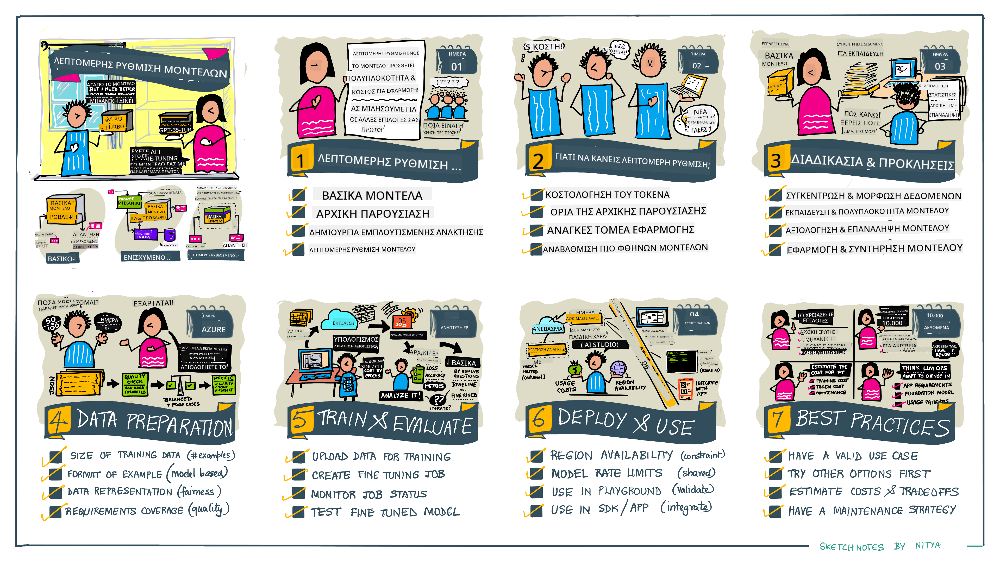

<!--
CO_OP_TRANSLATOR_METADATA:
{
  "original_hash": "68664f7e754a892ae1d8d5e2b7bd2081",
  "translation_date": "2025-06-26T00:42:07+00:00",
  "source_file": "18-fine-tuning/README.md",
  "language_code": "el"
}
-->

# Βελτιστοποίηση του LLM σας

Η χρήση μεγάλων γλωσσικών μοντέλων για την κατασκευή εφαρμογών γεννητικής τεχνητής νοημοσύνης έρχεται με νέες προκλήσεις. Ένα βασικό ζήτημα είναι η διασφάλιση της ποιότητας των απαντήσεων (ακρίβεια και συνάφεια) στο περιεχόμενο που παράγεται από το μοντέλο για μια δεδομένη αίτηση χρήστη. Σε προηγούμενα μαθήματα, συζητήσαμε τεχνικές όπως η διαμόρφωση προτροπών και η δημιουργία με ενίσχυση ανάκτησης που προσπαθούν να λύσουν το πρόβλημα _τροποποιώντας την είσοδο της προτροπής_ στο υπάρχον μοντέλο.

Στο σημερινό μάθημα, συζητάμε μια τρίτη τεχνική, τη **βελτιστοποίηση**, η οποία προσπαθεί να αντιμετωπίσει την πρόκληση _επανεκπαιδεύοντας το ίδιο το μοντέλο_ με πρόσθετα δεδομένα. Ας δούμε τις λεπτομέρειες.

## Στόχοι μάθησης

Αυτό το μάθημα εισάγει την έννοια της βελτιστοποίησης για προεκπαιδευμένα γλωσσικά μοντέλα, εξερευνά τα οφέλη και τις προκλήσεις αυτής της προσέγγισης και παρέχει καθοδήγηση σχετικά με το πότε και πώς να χρησιμοποιήσετε τη βελτιστοποίηση για να βελτιώσετε την απόδοση των γεννητικών μοντέλων τεχνητής νοημοσύνης σας.

Μέχρι το τέλος αυτού του μαθήματος, θα πρέπει να μπορείτε να απαντήσετε στις ακόλουθες ερωτήσεις:

- Τι είναι η βελτιστοποίηση για τα γλωσσικά μοντέλα;
- Πότε και γιατί είναι χρήσιμη η βελτιστοποίηση;
- Πώς μπορώ να βελτιστοποιήσω ένα προεκπαιδευμένο μοντέλο;
- Ποιες είναι οι περιορισμοί της βελτιστοποίησης;

Έτοιμοι; Ας ξεκινήσουμε.

## Εικονογραφημένος Οδηγός

Θέλετε να έχετε μια συνολική εικόνα για το τι θα καλύψουμε πριν βουτήξουμε μέσα; Δείτε αυτόν τον εικονογραφημένο οδηγό που περιγράφει το μαθησιακό ταξίδι για αυτό το μάθημα - από την εκμάθηση των βασικών εννοιών και του κινήτρου για τη βελτιστοποίηση, έως την κατανόηση της διαδικασίας και των βέλτιστων πρακτικών για την εκτέλεση του έργου βελτιστοποίησης. Αυτό είναι ένα συναρπαστικό θέμα για εξερεύνηση, οπότε μην ξεχάσετε να επισκεφθείτε τη σελίδα [Πόροι](./RESOURCES.md?WT.mc_id=academic-105485-koreyst) για επιπλέον συνδέσμους που θα υποστηρίξουν το αυτοκατευθυνόμενο μαθησιακό σας ταξίδι!

## Τι είναι η βελτιστοποίηση για τα γλωσσικά μοντέλα;

Κατά ορισμό, τα μεγάλα γλωσσικά μοντέλα είναι _προεκπαιδευμένα_ σε μεγάλες ποσότητες κειμένου από διάφορες πηγές, συμπεριλαμβανομένου του διαδικτύου. Όπως μάθαμε σε προηγούμενα μαθήματα, χρειαζόμαστε τεχνικές όπως η _διαμόρφωση προτροπών_ και η _δημιουργία με ενίσχυση ανάκτησης_ για να βελτιώσουμε την ποιότητα των απαντήσεων του μοντέλου στις ερωτήσεις του χρήστη ("προτροπές").

Μια δημοφιλής τεχνική διαμόρφωσης προτροπών περιλαμβάνει την παροχή περισσότερης καθοδήγησης στο μοντέλο σχετικά με το τι αναμένεται στην απάντηση είτε παρέχοντας _οδηγίες_ (ρητή καθοδήγηση) είτε _δίνοντάς του μερικά παραδείγματα_ (υπονοούμενη καθοδήγηση). Αυτό αναφέρεται ως _εκμάθηση με λίγα παραδείγματα_ αλλά έχει δύο περιορισμούς:

- Τα όρια των tokens του μοντέλου μπορούν να περιορίσουν τον αριθμό των παραδειγμάτων που μπορείτε να δώσετε και να περιορίσουν την αποτελεσματικότητα.
- Το κόστος των tokens του μοντέλου μπορεί να το κάνει ακριβό να προσθέσετε παραδείγματα σε κάθε προτροπή και να περιορίσει την ευελιξία.

Η βελτιστοποίηση είναι μια κοινή πρακτική στα συστήματα μηχανικής μάθησης όπου παίρνουμε ένα προεκπαιδευμένο μοντέλο και το επανεκπαιδεύουμε με νέα δεδομένα για να βελτιώσουμε την απόδοσή του σε μια συγκεκριμένη εργασία. Στο πλαίσιο των γλωσσικών μοντέλων, μπορούμε να βελτιστοποιήσουμε το προεκπαιδευμένο μοντέλο _με ένα επιλεγμένο σύνολο παραδειγμάτων για μια δεδομένη εργασία ή τομέα εφαρμογής_ για να δημιουργήσουμε ένα **προσαρμοσμένο μοντέλο** που μπορεί να είναι πιο ακριβές και σχετικό για αυτήν τη συγκεκριμένη εργασία ή τομέα. Ένα παράπλευρο όφελος της βελτιστοποίησης είναι ότι μπορεί επίσης να μειώσει τον αριθμό των παραδειγμάτων που χρειάζονται για την εκμάθηση με λίγα παραδείγματα - μειώνοντας τη χρήση των tokens και τα σχετικά κόστη.

## Πότε και γιατί πρέπει να βελτιστοποιούμε τα μοντέλα;

Σε _αυτό_ το πλαίσιο, όταν μιλάμε για βελτιστοποίηση, αναφερόμαστε στη **επιβλεπόμενη** βελτιστοποίηση όπου η επανεκπαίδευση γίνεται με **προσθήκη νέων δεδομένων** που δεν ήταν μέρος του αρχικού συνόλου εκπαίδευσης. Αυτό είναι διαφορετικό από μια μη επιβλεπόμενη προσέγγιση βελτιστοποίησης όπου το μοντέλο επανεκπαιδεύεται στα αρχικά δεδομένα, αλλά με διαφορετικές υπερπαραμέτρους.

Το βασικό πράγμα που πρέπει να θυμάστε είναι ότι η βελτιστοποίηση είναι μια προηγμένη τεχνική που απαιτεί ένα ορισμένο επίπεδο εξειδίκευσης για να επιτευχθούν τα επιθυμητά αποτελέσματα. Εάν γίνει λανθασμένα, μπορεί να μην παρέχει τις αναμενόμενες βελτιώσεις και μπορεί ακόμη και να υποβαθμίσει την απόδοση του μοντέλου για τον στοχευμένο τομέα σας.

Έτσι, πριν μάθετε "πώς" να βελτιστοποιείτε γλωσσικά μοντέλα, πρέπει να γνωρίζετε "γιατί" πρέπει να ακολουθήσετε αυτήν τη διαδρομή και "πότε" να ξεκινήσετε τη διαδικασία βελτιστοποίησης. Ξεκινήστε κάνοντας στον εαυτό σας αυτές τις ερωτήσεις:

- **Περίπτωση Χρήσης**: Ποια είναι η _περίπτωση χρήσης_ σας για τη βελτιστοποίηση; Ποια πτυχή του τρέχοντος προεκπαιδευμένου μοντέλου θέλετε να βελτιώσετε;
- **Εναλλακτικές**: Έχετε δοκιμάσει _άλλες τεχνικές_ για να επιτύχετε τα επιθυμητά αποτελέσματα; Χρησιμοποιήστε τις για να δημιουργήσετε μια βάση σύγκρισης.
  - Διαμόρφωση προτροπών: Δοκιμάστε τεχνικές όπως η προτροπή με λίγα παραδείγματα με παραδείγματα σχετικών απαντήσεων προτροπών. Αξιολογήστε την ποιότητα των απαντήσεων.
  - Δημιουργία με ενίσχυση ανάκτησης: Δοκιμάστε να ενισχύσετε τις προτροπές με αποτελέσματα αναζητήσεων που ανακτήθηκαν αναζητώντας τα δεδομένα σας. Αξιολογήστε την ποιότητα των απαντήσεων.
- **Κόστη**: Έχετε προσδιορίσει τα κόστη για τη βελτιστοποίηση;
  - Ευελιξία - είναι το προεκπαιδευμένο μοντέλο διαθέσιμο για βελτιστοποίηση;
  - Προσπάθεια - για την προετοιμασία δεδομένων εκπαίδευσης, την αξιολόγηση και τη βελτίωση του μοντέλου.
  - Υπολογιστική Ισχύς - για την εκτέλεση εργασιών βελτιστοποίησης και την ανάπτυξη του βελτιστοποιημένου μοντέλου
  - Δεδομένα - πρόσβαση σε επαρκή ποιοτικά παραδείγματα για επίδραση στη βελτιστοποίηση
- **Οφέλη**: Έχετε επιβεβαιώσει τα οφέλη της βελτιστοποίησης;
  - Ποιότητα - το βελτιστοποιημένο μοντέλο υπερέβη την απόδοση της βάσης;
  - Κόστος - μειώνει τη χρήση των tokens απλοποιώντας τις προτροπές;
  - Επεκτασιμότητα - μπορείτε να επαναχρησιμοποιήσετε το βασικό μοντέλο για νέους τομείς;

Απαντώντας σε αυτές τις ερωτήσεις, θα πρέπει να μπορείτε να αποφασίσετε αν η βελτιστοποίηση είναι η σωστή προσέγγιση για την περίπτωση χρήσης σας. Ιδανικά, η προσέγγιση είναι έγκυρη μόνο εάν τα οφέλη υπερβαίνουν τα κόστη. Μόλις αποφασίσετε να προχωρήσετε, είναι καιρός να σκεφτείτε _πώς_ μπορείτε να βελτιστοποιήσετε το προεκπαιδευμένο μοντέλο.

Θέλετε να αποκτήσετε περισσότερες γνώσεις για τη διαδικασία λήψης αποφάσεων; Παρακολουθήστε το [Να βελτιστοποιήσετε ή να μην βελτιστοποιήσετε](https://www.youtube.com/watch?v=0Jo-z-MFxJs)

## Πώς μπορούμε να βελτιστοποιήσουμε ένα προεκπαιδευμένο μοντέλο;

Για να βελτιστοποιήσετε ένα προεκπαιδευμένο μοντέλο, χρειάζεστε:

- ένα προεκπαιδευμένο μοντέλο για βελτιστοποίηση
- ένα σύνολο δεδομένων για χρήση στη βελτιστοποίηση
- ένα περιβάλλον εκπαίδευσης για την εκτέλεση της εργασίας βελτιστοποίησης
- ένα περιβάλλον φιλοξενίας για την ανάπτυξη του βελτιστοποιημένου μοντέλου

## Βελτιστοποίηση στην Πράξη

Οι παρακάτω πόροι παρέχουν αναλυτικά σεμινάρια για να σας καθοδηγήσουν μέσα από ένα πραγματικό παράδειγμα χρησιμοποιώντας ένα επιλεγμένο μοντέλο με ένα επιλεγμένο σύνολο δεδομένων. Για να εργαστείτε μέσα από αυτά τα σεμινάρια, χρειάζεστε έναν λογαριασμό στον συγκεκριμένο πάροχο, μαζί με πρόσβαση στο σχετικό μοντέλο και σύνολα δεδομένων.

| Πάροχος      | Σεμινάριο                                                                                                                                                                        | Περιγραφή                                                                                                                                                                                                                                                                                                                                                                                                                        |
| ------------ | -------------------------------------------------------------------------------------------------------------------------------------------------------------------------------- | ---------------------------------------------------------------------------------------------------------------------------------------------------------------------------------------------------------------------------------------------------------------------------------------------------------------------------------------------------------------------------------------------------------------------------------- |
| OpenAI       | [Πώς να βελτιστοποιήσετε μοντέλα συνομιλίας](https://github.com/openai/openai-cookbook/blob/main/examples/How_to_finetune_chat_models.ipynb?WT.mc_id=academic-105485-koreyst)     | Μάθετε να βελτιστοποιείτε ένα `gpt-35-turbo` για έναν συγκεκριμένο τομέα ("βοηθός συνταγών") προετοιμάζοντας δεδομένα εκπαίδευσης, εκτελώντας την εργασία βελτιστοποίησης και χρησιμοποιώντας το βελτιστοποιημένο μοντέλο για συμπεράσματα.                                                                                                                                                                                                                                              |
| Azure OpenAI | [Σεμινάριο βελτιστοποίησης GPT 3.5 Turbo](https://learn.microsoft.com/azure/ai-services/openai/tutorials/fine-tune?tabs=python-new%2Ccommand-line?WT.mc_id=academic-105485-koreyst) | Μάθετε να βελτιστοποιείτε ένα `gpt-35-turbo-0613` μοντέλο **στο Azure** κάνοντας βήματα για τη δημιουργία και τη μεταφόρτωση δεδομένων εκπαίδευσης, εκτελώντας την εργασία βελτιστοποίησης. Αναπτύξτε και χρησιμοποιήστε το νέο μοντέλο.                                                                                                                                                                                                                                                                 |
| Hugging Face | [Βελτιστοποίηση LLMs με Hugging Face](https://www.philschmid.de/fine-tune-llms-in-2024-with-trl?WT.mc_id=academic-105485-koreyst)                                               | Αυτή η ανάρτηση στο ιστολόγιο σας καθοδηγεί στη βελτιστοποίηση ενός _ανοιχτού LLM_ (π.χ. `CodeLlama 7B`) χρησιμοποιώντας τη βιβλιοθήκη [transformers](https://huggingface.co/docs/transformers/index?WT.mc_id=academic-105485-koreyst) και το [Transformer Reinforcement Learning (TRL)](https://huggingface.co/docs/trl/index?WT.mc_id=academic-105485-koreyst) με ανοιχτά [σύνολα δεδομένων](https://huggingface.co/docs/datasets/index?WT.mc_id=academic-105485-koreyst) στο Hugging Face. |
|              |                                                                                                                                                                                  |                                                                                                                                                                                                                                                                                                                                                                                                                                    |
| 🤗 AutoTrain | [Βελτιστοποίηση LLMs με AutoTrain](https://github.com/huggingface/autotrain-advanced/?WT.mc_id=academic-105485-koreyst)                                                         | Το AutoTrain (ή AutoTrain Advanced) είναι μια βιβλιοθήκη python που αναπτύχθηκε από το Hugging Face και επιτρέπει τη βελτιστοποίηση για πολλές διαφορετικές εργασίες, συμπεριλαμβανομένης της βελτιστοποίησης LLM. Το AutoTrain είναι μια λύση χωρίς κώδικα και η βελτιστοποίηση μπορεί να γίνει στο δικό σας cloud, στο Hugging Face Spaces ή τοπικά. Υποστηρίζει τόσο ένα web-based GUI, CLI και εκπαίδευση μέσω αρχείων ρύθμισης yaml.                                                                               |
|              |                                                                                                                                                                                  |                                                                                                                                                                                                                                                                                                                                                                                                                                    |

## Εργασία

Επιλέξτε ένα από τα παραπάνω σεμινάρια και περπατήστε μέσα από αυτά. _Μπορούμε να αναπαράγουμε μια έκδοση αυτών των σεμιναρίων σε Jupyter Notebooks σε αυτό το αποθετήριο μόνο για αναφορά. Παρακαλούμε χρησιμοποιήστε τις αρχικές πηγές απευθείας για να αποκτήσετε τις τελευταίες εκδόσεις_.

## Εξαιρετική δουλειά! Συνεχίστε τη μάθηση σας.

Αφού ολοκληρώσετε αυτό το μάθημα, δείτε τη [Συλλογή Μάθησης Γεννητικής Τεχνητής Νοημοσύνης](https://aka.ms/genai-collection?WT.mc_id=academic-105485-koreyst) για να συνεχίσετε να αναβαθμίζετε τις γνώσεις σας στη Γεννητική Τεχνητή Νοημοσύνη!

Συγχαρητήρια!! Έχετε ολοκληρώσει το τελευταίο μάθημα από τη σειρά v2 για αυτό το μάθημα! Μην σταματήσετε να μαθαίνετε και να δημιουργείτε. \*\*Δείτε τη σελίδα [ΠΟΡΟΙ](RESOURCES.md?WT.mc_id=academic-105485-koreyst) για μια λίστα με πρόσθετες προτάσεις για αυτό το θέμα.

Η σειρά μαθημάτων v1 έχει επίσης ενημερωθεί με περισσότερες εργασίες και έννοιες. Οπότε αφιερώστε ένα λεπτό για να ανανεώσετε τις γνώσεις σας - και παρακαλούμε [μοιραστείτε τις ερωτήσεις και τα σχόλιά σας](https://github.com/microsoft/generative-ai-for-beginners/issues?WT.mc_id=academic-105485-koreyst) για να μας βοηθήσετε να βελτιώσουμε αυτά τα μαθήματα για την κοινότητα.

**Αποποίηση ευθύνης**:  
Αυτό το έγγραφο έχει μεταφραστεί χρησιμοποιώντας την υπηρεσία AI μετάφρασης [Co-op Translator](https://github.com/Azure/co-op-translator). Παρόλο που επιδιώκουμε την ακρίβεια, παρακαλώ σημειώστε ότι οι αυτοματοποιημένες μεταφράσεις ενδέχεται να περιέχουν λάθη ή ανακρίβειες. Το πρωτότυπο έγγραφο στη μητρική του γλώσσα θα πρέπει να θεωρείται η αυθεντική πηγή. Για κρίσιμες πληροφορίες, συνιστάται επαγγελματική ανθρώπινη μετάφραση. Δεν φέρουμε ευθύνη για τυχόν παρανοήσεις ή ερμηνείες που προκύπτουν από τη χρήση αυτής της μετάφρασης.