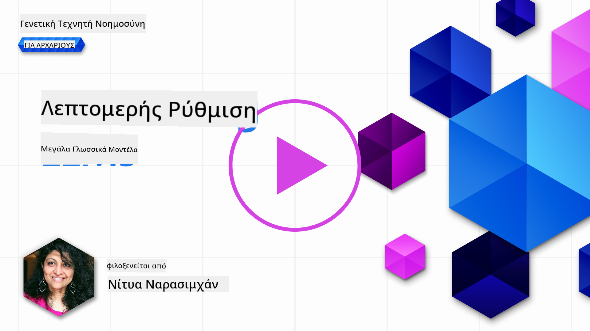
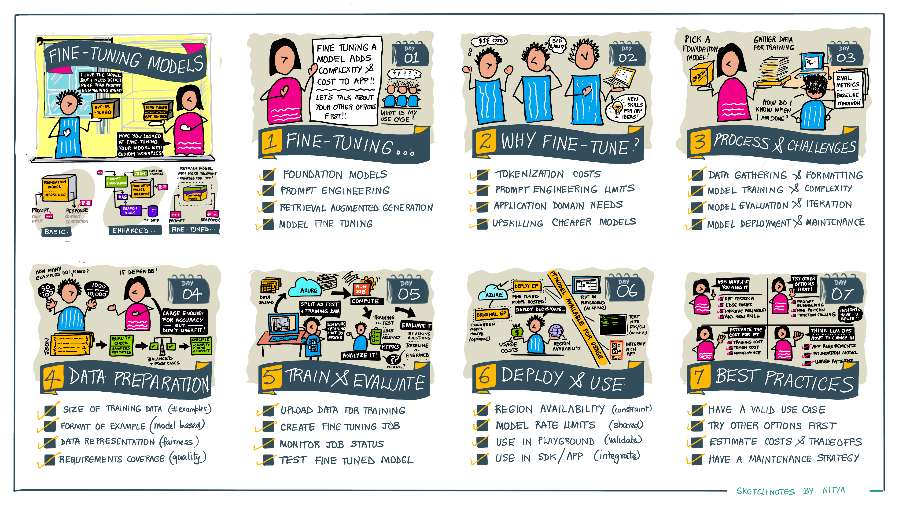

<!--
CO_OP_TRANSLATOR_METADATA:
{
  "original_hash": "807f0d9fc1747e796433534e1be6a98a",
  "translation_date": "2025-10-17T18:25:03+00:00",
  "source_file": "18-fine-tuning/README.md",
  "language_code": "el"
}
-->

# Προσαρμογή του LLM σας

Η χρήση μεγάλων γλωσσικών μοντέλων για την ανάπτυξη εφαρμογών γεννητικής τεχνητής νοημοσύνης συνοδεύεται από νέες προκλήσεις. Ένα βασικό ζήτημα είναι η διασφάλιση της ποιότητας των απαντήσεων (ακρίβεια και συνάφεια) στο περιεχόμενο που δημιουργείται από το μοντέλο για ένα συγκεκριμένο αίτημα χρήστη. Στα προηγούμενα μαθήματα, συζητήσαμε τεχνικές όπως η διαμόρφωση προτροπών και η δημιουργία με ενισχυμένη ανάκτηση, που προσπαθούν να λύσουν το πρόβλημα _τροποποιώντας την είσοδο της προτροπής_ στο υπάρχον μοντέλο.

Στο σημερινό μάθημα, συζητάμε μια τρίτη τεχνική, την **προσαρμογή**, η οποία προσπαθεί να αντιμετωπίσει την πρόκληση _εκπαιδεύοντας εκ νέου το ίδιο το μοντέλο_ με πρόσθετα δεδομένα. Ας δούμε τις λεπτομέρειες.

## Στόχοι Μάθησης

Αυτό το μάθημα εισάγει την έννοια της προσαρμογής για προεκπαιδευμένα γλωσσικά μοντέλα, εξετάζει τα οφέλη και τις προκλήσεις αυτής της προσέγγισης και παρέχει καθοδήγηση για το πότε και πώς να χρησιμοποιήσετε την προσαρμογή για να βελτιώσετε την απόδοση των γεννητικών μοντέλων τεχνητής νοημοσύνης σας.

Μέχρι το τέλος αυτού του μαθήματος, θα πρέπει να μπορείτε να απαντήσετε στις παρακάτω ερωτήσεις:

- Τι είναι η προσαρμογή για γλωσσικά μοντέλα;
- Πότε και γιατί είναι χρήσιμη η προσαρμογή;
- Πώς μπορώ να προσαρμόσω ένα προεκπαιδευμένο μοντέλο;
- Ποιες είναι οι περιορισμοί της προσαρμογής;

Έτοιμοι; Ας ξεκινήσουμε.

## Εικονογραφημένος Οδηγός

Θέλετε να αποκτήσετε μια γενική εικόνα για το τι θα καλύψουμε πριν εμβαθύνετε; Δείτε αυτόν τον εικονογραφημένο οδηγό που περιγράφει τη μαθησιακή πορεία αυτού του μαθήματος - από την εκμάθηση των βασικών εννοιών και της κινητοποίησης για την προσαρμογή, μέχρι την κατανόηση της διαδικασίας και των βέλτιστων πρακτικών για την εκτέλεση της εργασίας προσαρμογής. Είναι ένα συναρπαστικό θέμα για εξερεύνηση, οπότε μην ξεχάσετε να δείτε τη σελίδα [Πόροι](./RESOURCES.md?WT.mc_id=academic-105485-koreyst) για πρόσθετους συνδέσμους που θα υποστηρίξουν την αυτοκατευθυνόμενη μαθησιακή σας πορεία!

## Τι είναι η προσαρμογή για γλωσσικά μοντέλα;

Κατά τον ορισμό, τα μεγάλα γλωσσικά μοντέλα είναι _προεκπαιδευμένα_ σε μεγάλες ποσότητες κειμένου που προέρχονται από διάφορες πηγές, συμπεριλαμβανομένου του διαδικτύου. Όπως μάθαμε στα προηγούμενα μαθήματα, χρειαζόμαστε τεχνικές όπως η _διαμόρφωση προτροπών_ και η _δημιουργία με ενισχυμένη ανάκτηση_ για να βελτιώσουμε την ποιότητα των απαντήσεων του μοντέλου στις ερωτήσεις του χρήστη ("προτροπές").

Μια δημοφιλής τεχνική διαμόρφωσης προτροπών περιλαμβάνει την παροχή περισσότερης καθοδήγησης στο μοντέλο σχετικά με το τι αναμένεται στην απάντηση, είτε παρέχοντας _οδηγίες_ (ρητή καθοδήγηση) είτε _δίνοντάς του μερικά παραδείγματα_ (έμμεση καθοδήγηση). Αυτό αναφέρεται ως _εκμάθηση με λίγα παραδείγματα_, αλλά έχει δύο περιορισμούς:

- Τα όρια των tokens του μοντέλου μπορούν να περιορίσουν τον αριθμό των παραδειγμάτων που μπορείτε να δώσετε και να μειώσουν την αποτελεσματικότητα.
- Το κόστος των tokens του μοντέλου μπορεί να κάνει ακριβή την προσθήκη παραδειγμάτων σε κάθε προτροπή και να περιορίσει την ευελιξία.

Η προσαρμογή είναι μια κοινή πρακτική στα συστήματα μηχανικής μάθησης, όπου παίρνουμε ένα προεκπαιδευμένο μοντέλο και το εκπαιδεύουμε εκ νέου με νέα δεδομένα για να βελτιώσουμε την απόδοσή του σε μια συγκεκριμένη εργασία. Στο πλαίσιο των γλωσσικών μοντέλων, μπορούμε να προσαρμόσουμε το προεκπαιδευμένο μοντέλο _με ένα επιλεγμένο σύνολο παραδειγμάτων για μια συγκεκριμένη εργασία ή τομέα εφαρμογής_ για να δημιουργήσουμε ένα **προσαρμοσμένο μοντέλο** που μπορεί να είναι πιο ακριβές και σχετικό για αυτήν τη συγκεκριμένη εργασία ή τομέα. Ένα παράπλευρο όφελος της προσαρμογής είναι ότι μπορεί επίσης να μειώσει τον αριθμό των παραδειγμάτων που χρειάζονται για εκμάθηση με λίγα παραδείγματα - μειώνοντας τη χρήση tokens και τα σχετικά κόστη.

## Πότε και γιατί πρέπει να προσαρμόζουμε μοντέλα;

Σε _αυτό_ το πλαίσιο, όταν μιλάμε για προσαρμογή, αναφερόμαστε στην **εποπτευόμενη** προσαρμογή, όπου η εκπαίδευση εκ νέου γίνεται με **προσθήκη νέων δεδομένων** που δεν ήταν μέρος του αρχικού συνόλου δεδομένων εκπαίδευσης. Αυτό είναι διαφορετικό από την προσέγγιση μη εποπτευόμενης προσαρμογής, όπου το μοντέλο εκπαιδεύεται εκ νέου στα αρχικά δεδομένα, αλλά με διαφορετικές υπερπαραμέτρους.

Το βασικό που πρέπει να θυμάστε είναι ότι η προσαρμογή είναι μια προηγμένη τεχνική που απαιτεί ένα ορισμένο επίπεδο εξειδίκευσης για να επιτευχθούν τα επιθυμητά αποτελέσματα. Αν γίνει λανθασμένα, μπορεί να μην παρέχει τις αναμενόμενες βελτιώσεις και μπορεί ακόμη και να υποβαθμίσει την απόδοση του μοντέλου για τον στοχευμένο τομέα σας.

Πριν μάθετε "πώς" να προσαρμόσετε γλωσσικά μοντέλα, πρέπει να γνωρίζετε "γιατί" πρέπει να ακολουθήσετε αυτήν τη διαδρομή και "πότε" να ξεκινήσετε τη διαδικασία προσαρμογής. Ξεκινήστε κάνοντας στον εαυτό σας τις εξής ερωτήσεις:

- **Περίπτωση Χρήσης**: Ποια είναι η _περίπτωση χρήσης_ σας για την προσαρμογή; Ποια πτυχή του τρέχοντος προεκπαιδευμένου μοντέλου θέλετε να βελτιώσετε;
- **Εναλλακτικές**: Έχετε δοκιμάσει _άλλες τεχνικές_ για να επιτύχετε τα επιθυμητά αποτελέσματα; Χρησιμοποιήστε τις για να δημιουργήσετε μια βάση για σύγκριση.
  - Διαμόρφωση προτροπών: Δοκιμάστε τεχνικές όπως η προτροπή με λίγα παραδείγματα με παραδείγματα σχετικών απαντήσεων προτροπών. Αξιολογήστε την ποιότητα των απαντήσεων.
  - Δημιουργία με Ενισχυμένη Ανάκτηση: Δοκιμάστε να ενισχύσετε τις προτροπές με αποτελέσματα αναζήτησης που ανακτώνται από τα δεδομένα σας. Αξιολογήστε την ποιότητα των απαντήσεων.
- **Κόστη**: Έχετε εντοπίσει τα κόστη για την προσαρμογή;
  - Δυνατότητα προσαρμογής - είναι το προεκπαιδευμένο μοντέλο διαθέσιμο για προσαρμογή;
  - Προσπάθεια - για την προετοιμασία δεδομένων εκπαίδευσης, την αξιολόγηση και τη βελτίωση του μοντέλου.
  - Υπολογιστική ισχύς - για την εκτέλεση εργασιών προσαρμογής και την ανάπτυξη του προσαρμοσμένου μοντέλου.
  - Δεδομένα - πρόσβαση σε επαρκή ποιοτικά παραδείγματα για την επίδραση της προσαρμογής.
- **Οφέλη**: Έχετε επιβεβαιώσει τα οφέλη της προσαρμογής;
  - Ποιότητα - το προσαρμοσμένο μοντέλο υπερέχει της βάσης;
  - Κόστος - μειώνει τη χρήση tokens απλοποιώντας τις προτροπές;
  - Επεκτασιμότητα - μπορείτε να επαναχρησιμοποιήσετε το βασικό μοντέλο για νέους τομείς;

Απαντώντας σε αυτές τις ερωτήσεις, θα πρέπει να μπορείτε να αποφασίσετε αν η προσαρμογή είναι η σωστή προσέγγιση για την περίπτωση χρήσης σας. Ιδανικά, η προσέγγιση είναι έγκυρη μόνο αν τα οφέλη υπερβαίνουν τα κόστη. Μόλις αποφασίσετε να προχωρήσετε, είναι ώρα να σκεφτείτε _πώς_ μπορείτε να προσαρμόσετε το προεκπαιδευμένο μοντέλο.

Θέλετε περισσότερες πληροφορίες για τη διαδικασία λήψης αποφάσεων; Δείτε το [Να προσαρμόσω ή όχι](https://www.youtube.com/watch?v=0Jo-z-MFxJs)

## Πώς μπορούμε να προσαρμόσουμε ένα προεκπαιδευμένο μοντέλο;

Για να προσαρμόσετε ένα προεκπαιδευμένο μοντέλο, χρειάζεστε:

- ένα προεκπαιδευμένο μοντέλο για προσαρμογή
- ένα σύνολο δεδομένων για χρήση στην προσαρμογή
- ένα περιβάλλον εκπαίδευσης για την εκτέλεση της εργασίας προσαρμογής
- ένα περιβάλλον φιλοξενίας για την ανάπτυξη του προσαρμοσμένου μοντέλου

## Προσαρμογή στην Πράξη

Οι παρακάτω πόροι παρέχουν βήμα προς βήμα οδηγούς για να σας καθοδηγήσουν σε ένα πραγματικό παράδειγμα χρησιμοποιώντας ένα επιλεγμένο μοντέλο με ένα επιλεγμένο σύνολο δεδομένων. Για να εργαστείτε με αυτούς τους οδηγούς, χρειάζεστε έναν λογαριασμό στον συγκεκριμένο πάροχο, μαζί με πρόσβαση στο σχετικό μοντέλο και τα σύνολα δεδομένων.

| Πάροχος      | Οδηγός                                                                                                                                                                       | Περιγραφή                                                                                                                                                                                                                                                                                                                                                                                                                        |
| ------------ | ---------------------------------------------------------------------------------------------------------------------------------------------------------------------------- | ---------------------------------------------------------------------------------------------------------------------------------------------------------------------------------------------------------------------------------------------------------------------------------------------------------------------------------------------------------------------------------------------------------------------------------- |
| OpenAI       | [Πώς να προσαρμόσετε μοντέλα συνομιλίας](https://github.com/openai/openai-cookbook/blob/main/examples/How_to_finetune_chat_models.ipynb?WT.mc_id=academic-105485-koreyst)     | Μάθετε να προσαρμόζετε ένα `gpt-35-turbo` για έναν συγκεκριμένο τομέα ("βοηθός συνταγών") προετοιμάζοντας δεδομένα εκπαίδευσης, εκτελώντας την εργασία προσαρμογής και χρησιμοποιώντας το προσαρμοσμένο μοντέλο για συμπεράσματα.                                                                                                                                                                                                 |
| Azure OpenAI | [Οδηγός προσαρμογής GPT 3.5 Turbo](https://learn.microsoft.com/azure/ai-services/openai/tutorials/fine-tune?tabs=python-new%2Ccommand-line?WT.mc_id=academic-105485-koreyst) | Μάθετε να προσαρμόζετε ένα μοντέλο `gpt-35-turbo-0613` **στο Azure** ακολουθώντας βήματα για τη δημιουργία και τη μεταφόρτωση δεδομένων εκπαίδευσης, την εκτέλεση της εργασίας προσαρμογής. Αναπτύξτε και χρησιμοποιήστε το νέο μοντέλο.                                                                                                                                                                                                 |
| Hugging Face | [Προσαρμογή LLMs με Hugging Face](https://www.philschmid.de/fine-tune-llms-in-2024-with-trl?WT.mc_id=academic-105485-koreyst)                                                | Αυτή η ανάρτηση στο blog σας καθοδηγεί στην προσαρμογή ενός _ανοιχτού LLM_ (π.χ. `CodeLlama 7B`) χρησιμοποιώντας τη βιβλιοθήκη [transformers](https://huggingface.co/docs/transformers/index?WT.mc_id=academic-105485-koreyst) και το [Transformer Reinforcement Learning (TRL)](https://huggingface.co/docs/trl/index?WT.mc_id=academic-105485-koreyst]) με ανοιχτά [σύνολα δεδομένων](https://huggingface.co/docs/datasets/index?WT.mc_id=academic-105485-koreyst) στο Hugging Face. |
|              |                                                                                                                                                                              |                                                                                                                                                                                                                                                                                                                                                                                                                                    |
| 🤗 AutoTrain | [Προσαρμογή LLMs με AutoTrain](https://github.com/huggingface/autotrain-advanced/?WT.mc_id=academic-105485-koreyst)                                                          | Το AutoTrain (ή AutoTrain Advanced) είναι μια βιβλιοθήκη python που αναπτύχθηκε από το Hugging Face και επιτρέπει την προσαρμογή για πολλές διαφορετικές εργασίες, συμπεριλαμβανομένης της προσαρμογής LLM. Το AutoTrain είναι μια λύση χωρίς κώδικα και η προσαρμογή μπορεί να γίνει στο δικό σας cloud, στο Hugging Face Spaces ή τοπικά. Υποστηρίζει τόσο μια διαδικτυακή διεπαφή GUI, CLI όσο και εκπαίδευση μέσω αρχείων ρυθμίσεων yaml. |

## Εργασία

Επιλέξτε έναν από τους παραπάνω οδηγούς και ακολουθήστε τον. _Μπορεί να αναπαράγουμε μια έκδοση αυτών των οδηγών σε Jupyter Notebooks σε αυτό το αποθετήριο μόνο για αναφορά. Παρακαλούμε χρησιμοποιήστε τις αρχικές πηγές απευθείας για να αποκτήσετε τις πιο πρόσφατες εκδόσεις_.

## Καλή Δουλειά! Συνεχίστε τη Μάθηση.

Αφού ολοκληρώσετε αυτό το μάθημα, δείτε τη [Συλλογή Μάθησης Γεννητικής Τεχνητής Νοημοσύνης](https://aka.ms/genai-collection?WT.mc_id=academic-105485-koreyst) για να συνεχίσετε να αναβαθμίζετε τις γνώσεις σας στη Γεννητική Τεχνητή Νοημοσύνη!

Συγχαρητήρια!! Ολοκληρώσατε το τελευταίο μάθημα από τη σειρά v2 αυτού του μαθήματος! Μην σταματάτε να μαθαίνετε και να δημιουργείτε. \*\*Δείτε τη σελίδα [ΠΟΡΟΙ](RESOURCES.md?WT.mc_id=academic-105485-koreyst) για μια λίστα πρόσθετων προτάσεων για αυτό το θέμα.

Η σειρά μαθημάτων v1 έχει επίσης ενημερωθεί με περισσότερες εργασίες και έννοιες. Οπότε αφιερώστε λίγο χρόνο για να ανανεώσετε τις γνώσεις σας - και παρακαλούμε [μοιραστείτε τις ερωτήσεις και τα σχόλιά σας](https://github.com/microsoft/generative-ai-for-beginners/issues?WT.mc_id=academic-105485-koreyst) για να μας βοηθήσετε να βελτιώσουμε αυτά τα μαθήματα για την κοινότητα.

---

**Αποποίηση ευθύνης**:  
Αυτό το έγγραφο έχει μεταφραστεί χρησιμοποιώντας την υπηρεσία μετάφρασης AI [Co-op Translator](https://github.com/Azure/co-op-translator). Παρόλο που καταβάλλουμε προσπάθειες για ακρίβεια, παρακαλούμε να γνωρίζετε ότι οι αυτοματοποιημένες μεταφράσεις ενδέχεται να περιέχουν λάθη ή ανακρίβειες. Το πρωτότυπο έγγραφο στη μητρική του γλώσσα θα πρέπει να θεωρείται η αυθεντική πηγή. Για κρίσιμες πληροφορίες, συνιστάται επαγγελματική ανθρώπινη μετάφραση. Δεν φέρουμε ευθύνη για τυχόν παρεξηγήσεις ή εσφαλμένες ερμηνείες που προκύπτουν από τη χρήση αυτής της μετάφρασης.