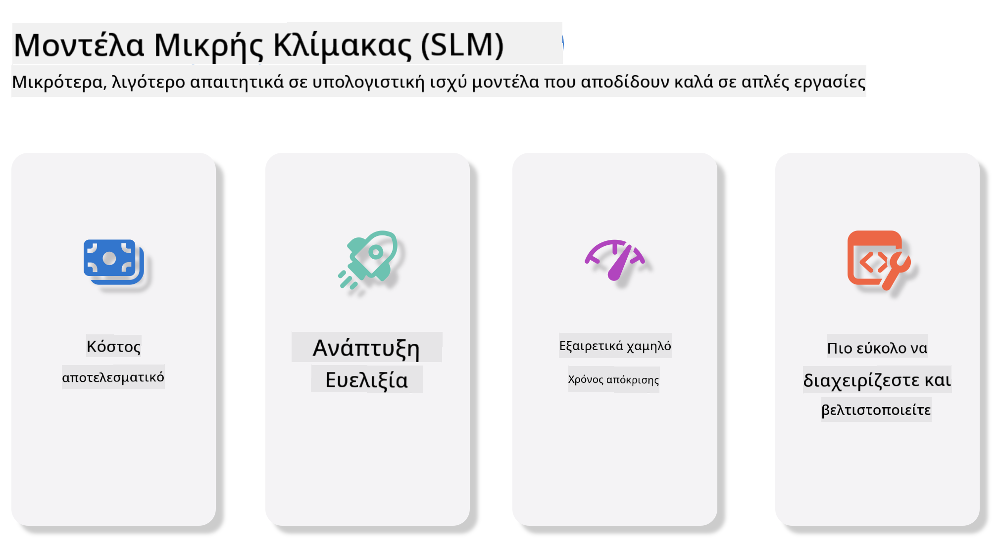

<!--
CO_OP_TRANSLATOR_METADATA:
{
  "original_hash": "124ad36cfe96f74038811b6e2bb93e9d",
  "translation_date": "2025-07-09T18:34:45+00:00",
  "source_file": "19-slm/README.md",
  "language_code": "el"
}
-->
# Εισαγωγή στα Μικρά Γλωσσικά Μοντέλα για Γενετική Τεχνητή Νοημοσύνη για Αρχάριους  
Η Γενετική Τεχνητή Νοημοσύνη είναι ένας συναρπαστικός τομέας της τεχνητής νοημοσύνης που εστιάζει στη δημιουργία συστημάτων ικανά να παράγουν νέο περιεχόμενο. Αυτό το περιεχόμενο μπορεί να περιλαμβάνει κείμενο, εικόνες, μουσική και ακόμη και ολόκληρα εικονικά περιβάλλοντα. Μία από τις πιο ενδιαφέρουσες εφαρμογές της γενετικής τεχνητής νοημοσύνης είναι στον τομέα των γλωσσικών μοντέλων.

## Τι Είναι τα Μικρά Γλωσσικά Μοντέλα;  

Ένα Μικρό Γλωσσικό Μοντέλο (SLM) αποτελεί μια μικρότερη εκδοχή ενός μεγάλου γλωσσικού μοντέλου (LLM), αξιοποιώντας πολλές από τις αρχιτεκτονικές αρχές και τεχνικές των LLM, ενώ παρουσιάζει σημαντικά μειωμένο υπολογιστικό αποτύπωμα.

Τα SLM είναι υποσύνολο γλωσσικών μοντέλων σχεδιασμένα να παράγουν κείμενο που μοιάζει ανθρώπινο. Σε αντίθεση με τα μεγαλύτερα μοντέλα, όπως το GPT-4, τα SLM είναι πιο συμπαγή και αποδοτικά, καθιστώντας τα ιδανικά για εφαρμογές όπου οι υπολογιστικοί πόροι είναι περιορισμένοι. Παρά το μικρότερο μέγεθός τους, μπορούν να εκτελέσουν ποικίλες εργασίες. Συνήθως, τα SLM κατασκευάζονται μέσω συμπίεσης ή απόσταξης των LLM, με στόχο να διατηρήσουν σημαντικό μέρος της λειτουργικότητας και των γλωσσικών ικανοτήτων του αρχικού μοντέλου. Αυτή η μείωση στο μέγεθος του μοντέλου μειώνει τη συνολική πολυπλοκότητα, καθιστώντας τα SLM πιο αποδοτικά τόσο σε χρήση μνήμης όσο και σε υπολογιστικές απαιτήσεις. Παρά αυτές τις βελτιστοποιήσεις, τα SLM μπορούν να εκτελέσουν ένα ευρύ φάσμα εργασιών επεξεργασίας φυσικής γλώσσας (NLP):

- Δημιουργία Κειμένου: Δημιουργία συνεκτικών και συμφραζόμενων προτάσεων ή παραγράφων.  
- Ολοκλήρωση Κειμένου: Πρόβλεψη και συμπλήρωση προτάσεων βάσει ενός δοσμένου ερεθίσματος.  
- Μετάφραση: Μετατροπή κειμένου από μια γλώσσα σε άλλη.  
- Περίληψη: Συνοπτική παρουσίαση μεγάλων κειμένων σε πιο σύντομες και εύπεπτες μορφές.

Αν και με κάποιες παραχωρήσεις στην απόδοση ή στο βάθος κατανόησης σε σύγκριση με τα μεγαλύτερα μοντέλα.

## Πώς Λειτουργούν τα Μικρά Γλωσσικά Μοντέλα;  
Τα SLM εκπαιδεύονται σε τεράστιες ποσότητες κειμένου. Κατά την εκπαίδευση, μαθαίνουν τα μοτίβα και τις δομές της γλώσσας, επιτρέποντάς τους να παράγουν κείμενο που είναι τόσο γραμματικά σωστό όσο και συμφραζόμενα κατάλληλο. Η διαδικασία εκπαίδευσης περιλαμβάνει:

- Συλλογή Δεδομένων: Συγκέντρωση μεγάλων συνόλων δεδομένων κειμένου από διάφορες πηγές.  
- Προεπεξεργασία: Καθαρισμός και οργάνωση των δεδομένων ώστε να είναι κατάλληλα για εκπαίδευση.  
- Εκπαίδευση: Χρήση αλγορίθμων μηχανικής μάθησης για να διδάξουν το μοντέλο πώς να κατανοεί και να παράγει κείμενο.  
- Λεπτομερής Ρύθμιση: Προσαρμογή του μοντέλου για βελτίωση της απόδοσής του σε συγκεκριμένες εργασίες.

Η ανάπτυξη των SLM ανταποκρίνεται στην αυξανόμενη ανάγκη για μοντέλα που μπορούν να αναπτυχθούν σε περιβάλλοντα με περιορισμένους πόρους, όπως κινητές συσκευές ή πλατφόρμες edge computing, όπου τα πλήρους κλίμακας LLM μπορεί να είναι μη πρακτικά λόγω των μεγάλων απαιτήσεων σε πόρους. Εστιάζοντας στην αποδοτικότητα, τα SLM ισορροπούν την απόδοση με την προσβασιμότητα, επιτρέποντας ευρύτερη εφαρμογή σε διάφορους τομείς.



## Μαθησιακοί Στόχοι  

Σε αυτό το μάθημα, ελπίζουμε να εισάγουμε τη γνώση των SLM και να τη συνδυάσουμε με το Microsoft Phi-3 για να μάθουμε διαφορετικά σενάρια σε κείμενο, όραση και MoE.

Στο τέλος αυτού του μαθήματος, θα πρέπει να μπορείτε να απαντήσετε στις ακόλουθες ερωτήσεις:

- Τι είναι το SLM  
- Ποια είναι η διαφορά μεταξύ SLM και LLM  
- Τι είναι η οικογένεια Microsoft Phi-3/3.5  
- Πώς να κάνετε inference με την οικογένεια Microsoft Phi-3/3.5  

Έτοιμοι; Ας ξεκινήσουμε.

## Οι Διαφορές μεταξύ Μεγάλων Γλωσσικών Μοντέλων (LLMs) και Μικρών Γλωσσικών Μοντέλων (SLMs)  

Τanto τα LLM όσο και τα SLM βασίζονται σε θεμελιώδεις αρχές πιθανοκρατικής μηχανικής μάθησης, ακολουθώντας παρόμοιες προσεγγίσεις στον αρχιτεκτονικό σχεδιασμό, τις μεθοδολογίες εκπαίδευσης, τις διαδικασίες δημιουργίας δεδομένων και τις τεχνικές αξιολόγησης μοντέλων. Ωστόσο, αρκετοί βασικοί παράγοντες διαφοροποιούν αυτούς τους δύο τύπους μοντέλων.

## Εφαρμογές των Μικρών Γλωσσικών Μοντέλων  

Τα SLM έχουν ευρύ φάσμα εφαρμογών, όπως:

- Chatbots: Παροχή υποστήριξης πελατών και αλληλεπίδραση με χρήστες με συνομιλιακό τρόπο.  
- Δημιουργία Περιεχομένου: Βοήθεια σε συγγραφείς με τη δημιουργία ιδεών ή ακόμα και τη σύνταξη ολόκληρων άρθρων.  
- Εκπαίδευση: Βοήθεια σε μαθητές με εργασίες γραφής ή εκμάθηση νέων γλωσσών.  
- Προσβασιμότητα: Δημιουργία εργαλείων για άτομα με αναπηρίες, όπως συστήματα μετατροπής κειμένου σε ομιλία.

**Μέγεθος**  

Μια βασική διαφορά μεταξύ LLM και SLM είναι η κλίμακα των μοντέλων. Τα LLM, όπως το ChatGPT (GPT-4), μπορεί να περιλαμβάνουν περίπου 1,76 τρισεκατομμύρια παραμέτρους, ενώ τα ανοιχτού κώδικα SLM όπως το Mistral 7B έχουν σχεδιαστεί με πολύ λιγότερες παραμέτρους — περίπου 7 δισεκατομμύρια. Αυτή η διαφορά οφείλεται κυρίως σε διαφορές στην αρχιτεκτονική και τις διαδικασίες εκπαίδευσης. Για παράδειγμα, το ChatGPT χρησιμοποιεί μηχανισμό self-attention μέσα σε πλαίσιο encoder-decoder, ενώ το Mistral 7B χρησιμοποιεί sliding window attention, που επιτρέπει πιο αποδοτική εκπαίδευση σε μοντέλο μόνο decoder. Αυτή η αρχιτεκτονική διαφορά έχει σημαντικές επιπτώσεις στην πολυπλοκότητα και την απόδοση των μοντέλων.

**Κατανόηση**  

Τα SLM συνήθως βελτιστοποιούνται για απόδοση σε συγκεκριμένους τομείς, καθιστώντας τα πολύ εξειδικευμένα αλλά ενδεχομένως περιορισμένα στην παροχή ευρείας κατανόησης συμφραζομένων σε πολλούς τομείς γνώσης. Αντίθετα, τα LLM στοχεύουν να προσομοιώσουν ανθρώπινη νοημοσύνη σε πιο ολοκληρωμένο επίπεδο. Εκπαιδευμένα σε τεράστια, ποικίλα σύνολα δεδομένων, τα LLM έχουν σχεδιαστεί να αποδίδουν καλά σε ποικίλους τομείς, προσφέροντας μεγαλύτερη ευελιξία και προσαρμοστικότητα. Συνεπώς, τα LLM είναι πιο κατάλληλα για ευρύτερο φάσμα εργασιών, όπως επεξεργασία φυσικής γλώσσας και προγραμματισμό.

**Υπολογιστική Ισχύς**  

Η εκπαίδευση και η ανάπτυξη των LLM απαιτούν σημαντικούς πόρους, συχνά μεγάλες υποδομές με clusters GPU. Για παράδειγμα, η εκπαίδευση ενός μοντέλου όπως το ChatGPT από το μηδέν μπορεί να απαιτήσει χιλιάδες GPUs για εκτεταμένες χρονικές περιόδους. Αντίθετα, τα SLM, με τον μικρότερο αριθμό παραμέτρων, είναι πιο προσιτά σε υπολογιστικούς πόρους. Μοντέλα όπως το Mistral 7B μπορούν να εκπαιδευτούν και να τρέξουν σε τοπικούς υπολογιστές με μέτριες GPU, αν και η εκπαίδευση εξακολουθεί να απαιτεί αρκετές ώρες σε πολλαπλές GPUs.

**Προκατάληψη**  

Η προκατάληψη είναι γνωστό ζήτημα στα LLM, κυρίως λόγω της φύσης των δεδομένων εκπαίδευσης. Αυτά τα μοντέλα συχνά βασίζονται σε ακατέργαστα, δημόσια διαθέσιμα δεδομένα από το διαδίκτυο, που μπορεί να υποεκπροσωπούν ή να παραμορφώνουν ορισμένες ομάδες, να εισάγουν λανθασμένη επισήμανση ή να αντανακλούν γλωσσικές προκαταλήψεις που επηρεάζονται από διάλεκτο, γεωγραφικές παραλλαγές και γραμματικούς κανόνες. Επιπλέον, η πολυπλοκότητα των αρχιτεκτονικών LLM μπορεί ακούσια να επιδεινώσει την προκατάληψη, η οποία μπορεί να παραμείνει αόρατη χωρίς προσεκτική λεπτομερή ρύθμιση. Αντίθετα, τα SLM, εκπαιδευμένα σε πιο περιορισμένα, τομεακά σύνολα δεδομένων, είναι εγγενώς λιγότερο επιρρεπή σε τέτοιες προκαταλήψεις, αν και δεν είναι αλώβητα.

**Inference**  

Το μειωμένο μέγεθος των SLM τους δίνει σημαντικό πλεονέκτημα στην ταχύτητα inference, επιτρέποντάς τους να παράγουν αποτελέσματα αποδοτικά σε τοπικό υλικό χωρίς την ανάγκη εκτεταμένης παράλληλης επεξεργασίας. Αντίθετα, τα LLM, λόγω του μεγέθους και της πολυπλοκότητάς τους, συχνά απαιτούν σημαντικούς παράλληλους υπολογιστικούς πόρους για να επιτύχουν αποδεκτούς χρόνους απόκρισης. Η παρουσία πολλών ταυτόχρονων χρηστών επιβραδύνει περαιτέρω τους χρόνους απόκρισης των LLM, ειδικά όταν αναπτύσσονται σε μεγάλη κλίμακα.

Συνοψίζοντας, ενώ και τα LLM και τα SLM βασίζονται στη μηχανική μάθηση, διαφέρουν σημαντικά ως προς το μέγεθος μοντέλου, τις απαιτήσεις πόρων, την κατανόηση συμφραζομένων, την ευαισθησία σε προκαταλήψεις και την ταχύτητα inference. Αυτές οι διαφορές αντικατοπτρίζουν την καταλληλότητά τους για διαφορετικές χρήσεις, με τα LLM να είναι πιο ευέλικτα αλλά απαιτητικά σε πόρους, και τα SLM να προσφέρουν αποδοτικότητα σε συγκεκριμένους τομείς με μειωμένες υπολογιστικές ανάγκες.

***Note：Σε αυτό το κεφάλαιο, θα παρουσιάσουμε τα SLM χρησιμοποιώντας ως παράδειγμα το Microsoft Phi-3 / 3.5.***

## Εισαγωγή στην Οικογένεια Phi-3 / Phi-3.5  

Η οικογένεια Phi-3 / 3.5 στοχεύει κυρίως σε σενάρια εφαρμογών κειμένου, όρασης και Agent (MoE):

### Phi-3 / 3.5 Instruct  

Κυρίως για δημιουργία κειμένου, ολοκλήρωση συνομιλίας και εξαγωγή πληροφοριών περιεχομένου, κ.ά.

**Phi-3-mini**  

Το γλωσσικό μοντέλο 3.8B είναι διαθέσιμο στο Microsoft Azure AI Studio, Hugging Face και Ollama. Τα μοντέλα Phi-3 υπερέχουν σημαντικά σε βασικά benchmarks σε σχέση με γλωσσικά μοντέλα ίδιου ή μεγαλύτερου μεγέθους (βλέπε αριθμούς benchmark παρακάτω, όπου οι υψηλότεροι αριθμοί είναι καλύτεροι). Το Phi-3-mini ξεπερνά μοντέλα διπλάσιου μεγέθους, ενώ τα Phi-3-small και Phi-3-medium υπερέχουν σε μεγαλύτερα μοντέλα, συμπεριλαμβανομένου του GPT-3.5.

**Phi-3-small & medium**  

Με μόλις 7B παραμέτρους, το Phi-3-small ξεπερνά το GPT-3.5T σε διάφορα benchmarks γλώσσας, λογικής, κωδικοποίησης και μαθηματικών.

Το Phi-3-medium με 14B παραμέτρους συνεχίζει αυτή την τάση και υπερέχει του Gemini 1.0 Pro.

**Phi-3.5-mini**  

Μπορούμε να το θεωρήσουμε ως αναβάθμιση του Phi-3-mini. Παρά το ότι οι παράμετροι παραμένουν αμετάβλητες, βελτιώνει την υποστήριξη πολλαπλών γλωσσών (υποστηρίζει πάνω από 20 γλώσσες: Αραβικά, Κινέζικα, Τσέχικα, Δανέζικα, Ολλανδικά, Αγγλικά, Φινλανδικά, Γαλλικά, Γερμανικά, Εβραϊκά, Ουγγρικά, Ιταλικά, Ιαπωνικά, Κορεατικά, Νορβηγικά, Πολωνικά, Πορτογαλικά, Ρωσικά, Ισπανικά, Σουηδικά, Ταϊλανδέζικα, Τουρκικά, Ουκρανικά) και προσθέτει ισχυρότερη υποστήριξη για μεγάλα συμφραζόμενα.

Το Phi-3.5-mini με 3.8B παραμέτρους υπερέχει σε γλωσσικά μοντέλα ίδιου μεγέθους και είναι ισάξιο με μοντέλα διπλάσιου μεγέθους.

### Phi-3 / 3.5 Vision  

Μπορούμε να θεωρήσουμε το Instruct μοντέλο του Phi-3/3.5 ως την ικανότητα του Phi να κατανοεί, ενώ το Vision είναι αυτό που δίνει στο Phi «μάτια» για να κατανοεί τον κόσμο.

**Phi-3-Vision**  

Το Phi-3-vision, με μόλις 4.2B παραμέτρους, συνεχίζει αυτή την τάση και υπερέχει μεγαλύτερων μοντέλων όπως Claude-3 Haiku και Gemini 1.0 Pro V σε γενικές εργασίες οπτικής λογικής, OCR και κατανόησης πινάκων και διαγραμμάτων.

**Phi-3.5-Vision**  

Το Phi-3.5-Vision είναι επίσης αναβάθμιση του Phi-3-Vision, προσθέτοντας υποστήριξη για πολλαπλές εικόνες. Μπορείτε να το θεωρήσετε ως βελτίωση στην όραση, όπου δεν βλέπετε μόνο εικόνες αλλά και βίντεο.

Το Phi-3.5-vision υπερέχει μεγαλύτερων μοντέλων όπως Claude-3.5 Sonnet και Gemini 1.5 Flash σε εργασίες OCR, κατανόησης πινάκων και γραφημάτων και είναι ισάξιο σε γενικές εργασίες οπτικής γνώσης και λογικής. Υποστηρίζει είσοδο πολλαπλών καρέ, δηλαδή εκτέλεση λογικής σε πολλές εισερχόμενες εικόνες.

### Phi-3.5-MoE  

***Mixture of Experts (MoE)*** επιτρέπει στα μοντέλα να προεκπαιδεύονται με πολύ λιγότερους υπολογιστικούς πόρους, που σημαίνει ότι μπορείτε να αυξήσετε δραματικά το μέγεθος του μοντέλου ή του συνόλου δεδομένων με τον ίδιο προϋπολογισμό υπολογιστικής ισχύος όπως ένα πυκνό μοντέλο. Συγκεκριμένα, ένα μοντέλο MoE θα πρέπει να επιτυγχάνει την ίδια ποιότητα με το πυκνό αντίστοιχό του πολύ πιο γρήγορα κατά την προεκπαίδευση.

Το Phi-3.5-MoE αποτελείται από 16x3.8B expert modules. Το Phi-3.5-MoE με μόλις 6.6B ενεργές παρα
- **Ασφάλεια και Έλεγχος:** Οι οργανισμοί μπορούν να διατηρούν τον έλεγχο των δεδομένων και των εφαρμογών τους φιλοξενώντας οι ίδιοι τις μικροϋπηρεσίες NIM στην δική τους διαχειριζόμενη υποδομή.
- **Τυπικά APIs:** Το NIM παρέχει APIs βιομηχανικού επιπέδου, καθιστώντας εύκολη την κατασκευή και ενσωμάτωση εφαρμογών AI όπως chatbots, βοηθούς AI και άλλα.

Το NIM αποτελεί μέρος του NVIDIA AI Enterprise, που στοχεύει στην απλοποίηση της ανάπτυξης και λειτουργίας μοντέλων AI, εξασφαλίζοντας την αποδοτική τους εκτέλεση σε NVIDIA GPUs.

- Demo: Χρήση του Nividia NIM για κλήση του Phi-3.5-Vision-API  [[Κάντε κλικ εδώ](../../../19-slm/python/Phi-3-Vision-Nividia-NIM.ipynb)]


### Εκτέλεση inference Phi-3/3.5 σε τοπικό περιβάλλον
Η εκτέλεση inference σε σχέση με το Phi-3, ή οποιοδήποτε γλωσσικό μοντέλο όπως το GPT-3, αναφέρεται στη διαδικασία παραγωγής απαντήσεων ή προβλέψεων βάσει των εισόδων που λαμβάνει. Όταν δίνετε ένα prompt ή ερώτημα στο Phi-3, χρησιμοποιεί το εκπαιδευμένο νευρωνικό του δίκτυο για να συμπεράνει την πιο πιθανή και σχετική απάντηση, αναλύοντας πρότυπα και σχέσεις στα δεδομένα με τα οποία έχει εκπαιδευτεί.

**Hugging Face Transformer**  
Το Hugging Face Transformers είναι μια ισχυρή βιβλιοθήκη σχεδιασμένη για επεξεργασία φυσικής γλώσσας (NLP) και άλλες εργασίες μηχανικής μάθησης. Ακολουθούν μερικά βασικά σημεία:

1. **Προεκπαιδευμένα Μοντέλα:** Παρέχει χιλιάδες προεκπαιδευμένα μοντέλα που μπορούν να χρησιμοποιηθούν για διάφορες εργασίες όπως ταξινόμηση κειμένου, αναγνώριση οντοτήτων, απάντηση σε ερωτήσεις, περίληψη, μετάφραση και παραγωγή κειμένου.

2. **Διαλειτουργικότητα Πλαισίων:** Η βιβλιοθήκη υποστηρίζει πολλαπλά πλαίσια βαθιάς μάθησης, όπως PyTorch, TensorFlow και JAX. Αυτό επιτρέπει την εκπαίδευση μοντέλου σε ένα πλαίσιο και τη χρήση του σε άλλο.

3. **Πολυτροπικές Δυνατότητες:** Εκτός από το NLP, το Hugging Face Transformers υποστηρίζει εργασίες στην υπολογιστική όραση (π.χ. ταξινόμηση εικόνων, ανίχνευση αντικειμένων) και στην επεξεργασία ήχου (π.χ. αναγνώριση ομιλίας, ταξινόμηση ήχου).

4. **Ευκολία Χρήσης:** Η βιβλιοθήκη προσφέρει APIs και εργαλεία για εύκολη λήψη και προσαρμογή μοντέλων, καθιστώντας την προσβάσιμη τόσο για αρχάριους όσο και για ειδικούς.

5. **Κοινότητα και Πόροι:** Το Hugging Face διαθέτει μια ζωντανή κοινότητα και εκτενή τεκμηρίωση, tutorials και οδηγούς για να βοηθήσει τους χρήστες να ξεκινήσουν και να αξιοποιήσουν στο έπακρο τη βιβλιοθήκη.  
[επίσημη τεκμηρίωση](https://huggingface.co/docs/transformers/index?WT.mc_id=academic-105485-koreyst) ή το [GitHub αποθετήριο](https://github.com/huggingface/transformers?WT.mc_id=academic-105485-koreyst).

Αυτή είναι η πιο συχνά χρησιμοποιούμενη μέθοδος, αλλά απαιτεί επιτάχυνση GPU. Άλλωστε, σενάρια όπως Vision και MoE απαιτούν πολλούς υπολογισμούς, που θα είναι πολύ περιορισμένοι στην CPU αν δεν γίνουν ποσοτικοποιήσεις.


- Demo: Χρήση Transformer για κλήση Phi-3.5-Instuct [Κάντε κλικ εδώ](../../../19-slm/python/phi35-instruct-demo.ipynb)

- Demo: Χρήση Transformer για κλήση Phi-3.5-Vision [Κάντε κλικ εδώ](../../../19-slm/python/phi35-vision-demo.ipynb)

- Demo: Χρήση Transformer για κλήση Phi-3.5-MoE [Κάντε κλικ εδώ](../../../19-slm/python/phi35_moe_demo.ipynb)

**Ollama**  
[Ollama](https://ollama.com/?WT.mc_id=academic-105485-koreyst) είναι μια πλατφόρμα σχεδιασμένη να διευκολύνει την εκτέλεση μεγάλων γλωσσικών μοντέλων (LLMs) τοπικά στον υπολογιστή σας. Υποστηρίζει διάφορα μοντέλα όπως Llama 3.1, Phi 3, Mistral και Gemma 2, μεταξύ άλλων. Η πλατφόρμα απλοποιεί τη διαδικασία συνδυάζοντας τα βάρη του μοντέλου, τη διαμόρφωση και τα δεδομένα σε ένα πακέτο, καθιστώντας την πιο προσιτή για τους χρήστες να προσαρμόσουν και να δημιουργήσουν τα δικά τους μοντέλα. Το Ollama είναι διαθέσιμο για macOS, Linux και Windows. Είναι ένα εξαιρετικό εργαλείο αν θέλετε να πειραματιστείτε ή να αναπτύξετε LLMs χωρίς να βασίζεστε σε υπηρεσίες cloud. Το Ollama είναι ο πιο άμεσος τρόπος, απλά πρέπει να εκτελέσετε την παρακάτω εντολή.


```bash

ollama run phi3.5

```


**ONNX Runtime για GenAI**

[ONNX Runtime](https://github.com/microsoft/onnxruntime-genai?WT.mc_id=academic-105485-koreyst) είναι ένας πολυπλατφορμικός επιταχυντής εκτέλεσης inference και εκπαίδευσης μηχανικής μάθησης. Το ONNX Runtime για Generative AI (GENAI) είναι ένα ισχυρό εργαλείο που σας βοηθά να εκτελείτε μοντέλα γεννητικής AI αποδοτικά σε διάφορες πλατφόρμες.

## Τι είναι το ONNX Runtime;  
Το ONNX Runtime είναι ένα έργο ανοιχτού κώδικα που επιτρέπει την υψηλής απόδοσης εκτέλεση inference μοντέλων μηχανικής μάθησης. Υποστηρίζει μοντέλα σε μορφή Open Neural Network Exchange (ONNX), που είναι ένα πρότυπο για την αναπαράσταση μοντέλων μηχανικής μάθησης. Η εκτέλεση inference με ONNX Runtime μπορεί να επιταχύνει την εμπειρία των πελατών και να μειώσει το κόστος, υποστηρίζοντας μοντέλα από πλαίσια βαθιάς μάθησης όπως PyTorch και TensorFlow/Keras, καθώς και κλασικές βιβλιοθήκες μηχανικής μάθησης όπως scikit-learn, LightGBM, XGBoost κ.ά. Το ONNX Runtime είναι συμβατό με διαφορετικό υλικό, drivers και λειτουργικά συστήματα, και παρέχει βέλτιστη απόδοση αξιοποιώντας επιταχυντές υλικού όπου είναι δυνατό, σε συνδυασμό με βελτιστοποιήσεις και μετασχηματισμούς γραφημάτων.

## Τι είναι η Γεννητική AI;  
Η Γεννητική AI αναφέρεται σε συστήματα AI που μπορούν να δημιουργήσουν νέο περιεχόμενο, όπως κείμενο, εικόνες ή μουσική, βασισμένα στα δεδομένα με τα οποία έχουν εκπαιδευτεί. Παραδείγματα είναι γλωσσικά μοντέλα όπως το GPT-3 και μοντέλα παραγωγής εικόνων όπως το Stable Diffusion. Η βιβλιοθήκη ONNX Runtime για GenAI παρέχει τον κύκλο γεννητικής AI για μοντέλα ONNX, συμπεριλαμβανομένης της εκτέλεσης inference με ONNX Runtime, επεξεργασίας logits, αναζήτησης και δειγματοληψίας, καθώς και διαχείρισης cache KV.

## ONNX Runtime για GENAI  
Το ONNX Runtime για GENAI επεκτείνει τις δυνατότητες του ONNX Runtime ώστε να υποστηρίζει μοντέλα γεννητικής AI. Μερικά βασικά χαρακτηριστικά:

- **Ευρεία Υποστήριξη Πλατφορμών:** Λειτουργεί σε διάφορες πλατφόρμες, όπως Windows, Linux, macOS, Android και iOS.  
- **Υποστήριξη Μοντέλων:** Υποστηρίζει πολλά δημοφιλή μοντέλα γεννητικής AI, όπως LLaMA, GPT-Neo, BLOOM και άλλα.  
- **Βελτιστοποίηση Απόδοσης:** Περιλαμβάνει βελτιστοποιήσεις για διάφορους επιταχυντές υλικού όπως NVIDIA GPUs, AMD GPUs κ.ά.  
- **Ευκολία Χρήσης:** Παρέχει APIs για εύκολη ενσωμάτωση σε εφαρμογές, επιτρέποντάς σας να δημιουργείτε κείμενο, εικόνες και άλλο περιεχόμενο με ελάχιστο κώδικα.  
- Οι χρήστες μπορούν να καλέσουν τη μέθοδο generate() υψηλού επιπέδου ή να εκτελέσουν κάθε επανάληψη του μοντέλου σε βρόχο, παράγοντας ένα token τη φορά και προαιρετικά ενημερώνοντας παραμέτρους μέσα στον βρόχο.  
- Το ONNX Runtime υποστηρίζει επίσης greedy/beam search και δειγματοληψία TopP, TopK για παραγωγή ακολουθιών token, καθώς και ενσωματωμένη επεξεργασία logits όπως ποινές επανάληψης. Μπορείτε επίσης εύκολα να προσθέσετε προσαρμοσμένη βαθμολόγηση.

## Ξεκινώντας  
Για να ξεκινήσετε με το ONNX Runtime για GENAI, ακολουθήστε τα παρακάτω βήματα:

### Εγκατάσταση ONNX Runtime:  
```Python
pip install onnxruntime
```  
### Εγκατάσταση των Επεκτάσεων Γεννητικής AI:  
```Python
pip install onnxruntime-genai
```

### Εκτέλεση Μοντέλου: Απλό παράδειγμα σε Python:  
```Python
import onnxruntime_genai as og

model = og.Model('path_to_your_model.onnx')

tokenizer = og.Tokenizer(model)

input_text = "Hello, how are you?"

input_tokens = tokenizer.encode(input_text)

output_tokens = model.generate(input_tokens)

output_text = tokenizer.decode(output_tokens)

print(output_text) 
```  
### Demo: Χρήση ONNX Runtime GenAI για κλήση Phi-3.5-Vision


```python

import onnxruntime_genai as og

model_path = './Your Phi-3.5-vision-instruct ONNX Path'

img_path = './Your Image Path'

model = og.Model(model_path)

processor = model.create_multimodal_processor()

tokenizer_stream = processor.create_stream()

text = "Your Prompt"

prompt = "<|user|>\n"

prompt += "<|image_1|>\n"

prompt += f"{text}<|end|>\n"

prompt += "<|assistant|>\n"

image = og.Images.open(img_path)

inputs = processor(prompt, images=image)

params = og.GeneratorParams(model)

params.set_inputs(inputs)

params.set_search_options(max_length=3072)

generator = og.Generator(model, params)

while not generator.is_done():

    generator.compute_logits()
    
    generator.generate_next_token()

    new_token = generator.get_next_tokens()[0]
    
    code += tokenizer_stream.decode(new_token)
    
    print(tokenizer_stream.decode(new_token), end='', flush=True)

```


**Άλλα**

Εκτός από τις μεθόδους αναφοράς ONNX Runtime και Ollama, μπορούμε επίσης να ολοκληρώσουμε την αναφορά ποσοτικών μοντέλων βασισμένων σε μεθόδους αναφοράς μοντέλων που παρέχονται από διάφορους κατασκευαστές. Όπως το Apple MLX framework με Apple Metal, Qualcomm QNN με NPU, Intel OpenVINO με CPU/GPU κ.ά. Μπορείτε επίσης να βρείτε περισσότερο υλικό στο [Phi-3 Cookbook](https://github.com/microsoft/phi-3cookbook?WT.mc_id=academic-105485-koreyst)


## Περισσότερα

Έχουμε μάθει τα βασικά της οικογένειας Phi-3/3.5, αλλά για να μάθουμε περισσότερα για το SLM χρειαζόμαστε περισσότερες γνώσεις. Μπορείτε να βρείτε τις απαντήσεις στο Phi-3 Cookbook. Αν θέλετε να μάθετε περισσότερα, επισκεφθείτε το [Phi-3 Cookbook](https://github.com/microsoft/phi-3cookbook?WT.mc_id=academic-105485-koreyst).

**Αποποίηση ευθυνών**:  
Αυτό το έγγραφο έχει μεταφραστεί χρησιμοποιώντας την υπηρεσία αυτόματης μετάφρασης AI [Co-op Translator](https://github.com/Azure/co-op-translator). Παρόλο που επιδιώκουμε την ακρίβεια, παρακαλούμε να έχετε υπόψη ότι οι αυτόματες μεταφράσεις ενδέχεται να περιέχουν λάθη ή ανακρίβειες. Το πρωτότυπο έγγραφο στη γλώσσα του θεωρείται η επίσημη πηγή. Για κρίσιμες πληροφορίες, συνιστάται επαγγελματική ανθρώπινη μετάφραση. Δεν φέρουμε ευθύνη για τυχόν παρεξηγήσεις ή λανθασμένες ερμηνείες που προκύπτουν από τη χρήση αυτής της μετάφρασης.