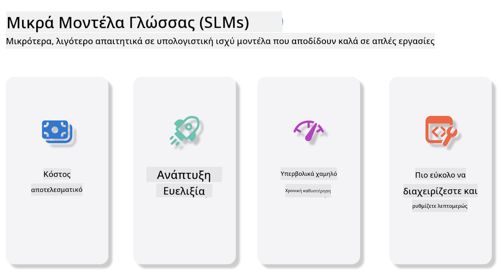
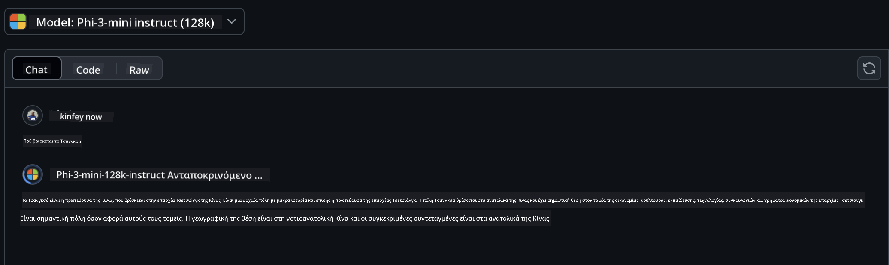
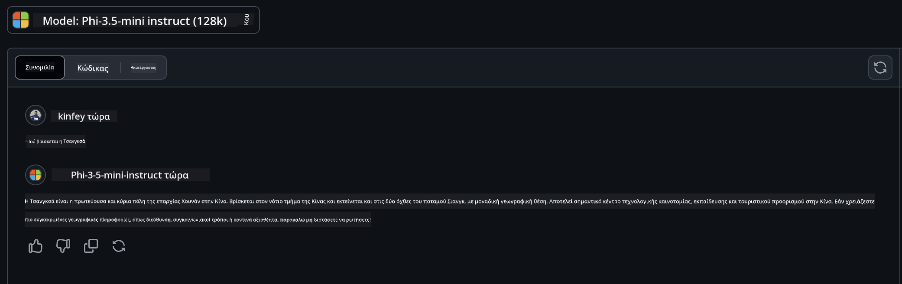

<!--
CO_OP_TRANSLATOR_METADATA:
{
  "original_hash": "124ad36cfe96f74038811b6e2bb93e9d",
  "translation_date": "2025-05-20T09:52:43+00:00",
  "source_file": "19-slm/README.md",
  "language_code": "el"
}
-->
# Εισαγωγή στα Μικρά Γλωσσικά Μοντέλα για Γενετική AI για Αρχάριους Η γενετική AI είναι ένα συναρπαστικό πεδίο της τεχνητής νοημοσύνης που επικεντρώνεται στη δημιουργία συστημάτων ικανών να παράγουν νέο περιεχόμενο. Αυτό το περιεχόμενο μπορεί να κυμαίνεται από κείμενο και εικόνες μέχρι μουσική και ακόμη και ολόκληρα εικονικά περιβάλλοντα. Μία από τις πιο συναρπαστικές εφαρμογές της γενετικής AI είναι στον τομέα των γλωσσικών μοντέλων. ## Τι Είναι τα Μικρά Γλωσσικά Μοντέλα; Ένα Μικρό Γλωσσικό Μοντέλο (SLM) αντιπροσωπεύει μια εκδοχή μικρής κλίμακας ενός μεγάλου γλωσσικού μοντέλου (LLM), αξιοποιώντας πολλές από τις αρχιτεκτονικές αρχές και τεχνικές των LLMs, ενώ παρουσιάζει σημαντικά μειωμένο υπολογιστικό αποτύπωμα. Τα SLMs είναι ένα υποσύνολο γλωσσικών μοντέλων σχεδιασμένων να παράγουν κείμενο που μοιάζει με ανθρώπινο. Σε αντίθεση με τους μεγαλύτερους ομολόγους τους, όπως το GPT-4, τα SLMs είναι πιο συμπαγή και αποδοτικά, καθιστώντας τα ιδανικά για εφαρμογές όπου οι υπολογιστικοί πόροι είναι περιορισμένοι. Παρά το μικρότερο μέγεθός τους, μπορούν ακόμα να εκτελέσουν μια ποικιλία εργασιών. Συνήθως, τα SLMs κατασκευάζονται με τη συμπίεση ή την αποστακτική των LLMs, με στόχο να διατηρήσουν ένα σημαντικό μέρος της λειτουργικότητας και των γλωσσικών δυνατοτήτων του αρχικού μοντέλου. Αυτή η μείωση στο μέγεθος του μοντέλου μειώνει τη συνολική πολυπλοκότητα, καθιστώντας τα SLMs πιο αποδοτικά όσον αφορά τόσο τη χρήση μνήμης όσο και τις υπολογιστικές απαιτήσεις. Παρά αυτές τις βελτιστοποιήσεις, τα SLMs μπορούν ακόμα να εκτελέσουν ένα ευρύ φάσμα εργασιών επεξεργασίας φυσικής γλώσσας (NLP): - Δημιουργία Κειμένου: Δημιουργία συνεκτικών και σχετικών με το περιεχόμενο προτάσεων ή παραγράφων. - Ολοκλήρωση Κειμένου: Πρόβλεψη και ολοκλήρωση προτάσεων με βάση μια δεδομένη προτροπή. - Μετάφραση: Μετατροπή κειμένου από μία γλώσσα σε άλλη. - Περίληψη: Συμπύκνωση μεγάλων κομματιών κειμένου σε συντομότερες, πιο εύπεπτες περιλήψεις. Παρόλο που υπάρχουν ορισμένες εκπτώσεις στην απόδοση ή το βάθος κατανόησης σε σύγκριση με τους μεγαλύτερους ομολόγους τους. ## Πώς Λειτουργούν τα Μικρά Γλωσσικά Μοντέλα; Τα SLMs εκπαιδεύονται σε τεράστιες ποσότητες δεδομένων κειμένου. Κατά τη διάρκεια της εκπαίδευσης, μαθαίνουν τα μοτίβα και τις δομές της γλώσσας, επιτρέποντάς τους να παράγουν κείμενο που είναι τόσο γραμματικά σωστό όσο και κατάλληλο για το περιεχόμενο. Η διαδικασία εκπαίδευσης περιλαμβάνει: - Συλλογή Δεδομένων: Συγκέντρωση μεγάλων συνόλων δεδομένων κειμένου από διάφορες πηγές. - Προεπεξεργασία: Καθαρισμός και οργάνωση των δεδομένων για να καταστούν κατάλληλα για εκπαίδευση. - Εκπαίδευση: Χρήση αλγορίθμων μηχανικής μάθησης για να διδάξουν το μοντέλο πώς να κατανοεί και να παράγει κείμενο. - Βελτίωση: Ρύθμιση του μοντέλου για να βελτιώσει την απόδοσή του σε συγκεκριμένες εργασίες. Η ανάπτυξη των SLMs συνδέεται με την αυξανόμενη ανάγκη για μοντέλα που μπορούν να αναπτυχθούν σε περιβάλλοντα με περιορισμένους πόρους, όπως κινητές συσκευές ή πλατφόρμες υπολογισμού άκρων, όπου τα πλήρους κλίμακας LLMs μπορεί να είναι ανέφικτα λόγω των υψηλών απαιτήσεων σε πόρους. Εστιάζοντας στην αποδοτικότητα, τα SLMs ισορροπούν την απόδοση με την προσβασιμότητα, επιτρέποντας ευρύτερη εφαρμογή σε διάφορους τομείς.  ## Στόχοι Μάθησης Σε αυτό το μάθημα, ελπίζουμε να εισάγουμε τη γνώση των SLM και να τη συνδυάσουμε με το Microsoft Phi-3 για να μάθουμε διαφορετικά σενάρια στο περιεχόμενο κειμένου, την όραση και το MoE. Μέχρι το τέλος αυτού του μαθήματος, θα πρέπει να μπορείτε να απαντήσετε στις ακόλουθες ερωτήσεις: - Τι είναι το SLM - Ποια είναι η διαφορά μεταξύ SLM και LLM - Τι είναι η Οικογένεια Microsoft Phi-3/3.5 - Πώς να κάνετε συμπεράσματα με την Οικογένεια Microsoft Phi-3/3.5 Έτοιμοι; Ας ξεκινήσουμε. ## Οι Διαφορές μεταξύ Μεγάλων Γλωσσικών Μοντέλων (LLMs) και Μικρών Γλωσσικών Μοντέλων (SLMs) Και τα LLMs και τα SLMs βασίζονται σε θεμελιώδεις αρχές της πιθανολογικής μηχανικής μάθησης, ακολουθώντας παρόμοιες προσεγγίσεις στην αρχιτεκτονική τους σχεδίαση, τις μεθοδολογίες εκπαίδευσης, τις διαδικασίες παραγωγής δεδομένων και τις τεχνικές αξιολόγησης μοντέλων. Ωστόσο, υπάρχουν αρκετοί βασικοί παράγοντες που διαφοροποιούν αυτούς τους δύο τύπους μοντέλων. ## Εφαρμογές των Μικρών Γλωσσικών Μοντέλων Τα SLMs έχουν ένα ευρύ φάσμα εφαρμογών, συμπεριλαμβανομένων: - Chatbots: Παροχή υποστήριξης πελατών και αλληλεπίδραση με χρήστες με συνομιλητικό τρόπο. - Δημιουργία Περιεχομένου: Βοήθεια σε συγγραφείς με τη δημιουργία ιδεών ή ακόμη και τη σύνταξη ολόκληρων άρθρων. - Εκπαίδευση: Βοήθεια σε μαθητές με εργασίες γραφής ή εκμάθηση νέων γλωσσών. - Προσβασιμότητα: Δημιουργία εργαλείων για άτομα με αναπηρίες, όπως συστήματα μετατροπής κειμένου σε ομιλία. **Μέγεθος** Μια κύρια διαφορά μεταξύ των LLMs και των SLMs βρίσκεται στην κλίμακα των μοντέλων. Τα LLMs, όπως το ChatGPT (GPT-4), μπορεί να περιλαμβάνουν περίπου 1.76 τρισεκατομμύρια παραμέτρους, ενώ τα ανοιχτού κώδικα SLMs όπως το Mistral 7B είναι σχεδιασμένα με σημαντικά λιγότερες παραμέτρους—περίπου 7 δισεκατομμύρια. Αυτή η διαφορά οφείλεται κυρίως στις διαφορές στην αρχιτεκτονική του μοντέλου και στις διαδικασίες εκπαίδευσης. Για παράδειγμα, το ChatGPT χρησιμοποιεί έναν μηχανισμό αυτοπροσοχής μέσα σε ένα πλαίσιο κωδικοποιητή-αποκωδικοποιητή, ενώ το Mistral 7B χρησιμοποιεί προσοχή με ολισθαίνουσα παράθυρο, που επιτρέπει πιο αποδοτική εκπαίδευση μέσα σε ένα μοντέλο μόνο αποκωδικοποιητή. Αυτή η αρχιτεκτονική διαφορά έχει βαθιές επιπτώσεις στην πολυπλοκότητα και την απόδοση αυτών των μοντέλων. **Κατανόηση** Τα SLMs είναι συνήθως βελτιστοποιημένα για απόδοση μέσα σε συγκεκριμένους τομείς, καθιστώντας τα εξαιρετικά εξειδικευμένα αλλά πιθανώς περιορισμένα στην ικανότητά τους να παρέχουν ευρεία κατανόηση του περιεχομένου σε πολλούς τομείς γνώσης. Αντίθετα, τα LLMs στοχεύουν να προσομοιώσουν νοημοσύνη που μοιάζει με ανθρώπινη σε πιο ολοκληρωμένο επίπεδο. Εκπαιδευμένα σε τεράστια, ποικίλα σύνολα δεδομένων, τα LLMs είναι σχεδιασμένα να αποδίδουν καλά σε μια ποικιλία τομέων, προσφέροντας μεγαλύτερη ευελιξία και προσαρμοστικότητα. Κατά συνέπεια, τα LLMs είναι πιο κατάλληλα για ένα ευρύτερο φάσμα εργασιών downstream, όπως η επεξεργασία φυσικής γλώσσας και ο προγραμματισμός. **Υπολογισμός** Η εκπαίδευση και ανάπτυξη των LLMs είναι διαδικασίες που απαιτούν πολλούς πόρους, συχνά απαιτώντας σημαντική υπολογιστική υποδομή, συμπεριλαμβανομένων μεγάλων συστάδων GPU. Για παράδειγμα, η εκπαίδευση ενός μοντέλου όπως το ChatGPT από την αρχή μπορεί να απαιτεί χιλιάδες GPUs για παρατεταμένες περιόδους. Αντίθετα, τα SLMs, με τον μικρότερο αριθμό παραμέτρων τους, είναι πιο προσβάσιμα όσον αφορά τους υπολογιστικούς πόρους. Μοντέλα όπως το Mistral 7B μπορούν να εκπαιδευτούν και να λειτουργήσουν σε τοπικούς υπολογιστές εξοπλισμένους με μέτριες δυνατότητες GPU, αν και η εκπαίδευση εξακολουθεί να απαιτεί αρκετές ώρες σε πολλές GPUs. **Προκατάληψη** Η προκατάληψη είναι γνωστό πρόβλημα στα LLMs, κυρίως λόγω της φύσης των δεδομένων εκπαίδευσης. Αυτά τα μοντέλα συχνά βασίζονται σε ακατέργαστα, διαθέσιμα δεδομένα από το διαδίκτυο, τα οποία μπορεί να υποεκπροσωπούν ή να παραμορφώνουν ορισμένες ομάδες, να εισάγουν εσφαλμένη ετικέτα ή να αντικατοπτρίζουν γλωσσικές προκαταλήψεις που επηρεάζονται από διαλέκτους, γεωγραφικές παραλλαγές και γραμματικούς κανόνες. Επιπλέον, η πολυπλοκότητα των αρχιτεκτονικών LLM μπορεί να επιδεινώσει ακούσια την προκατάληψη, η οποία μπορεί να παραμείνει απαρατήρητη χωρίς προσεκτική βελτίωση. Από την άλλη πλευρά, τα SLMs, εκπαιδευμένα σε πιο περιορισμένα, εξειδικευμένα σύνολα δεδομένων, είναι εγγενώς λιγότερο επιρρεπή σε τέτοιες προκαταλήψεις, αν και δεν είναι απαλλαγμένα από αυτές. **Συμπεράσματα** Το μειωμένο μέγεθος των SLMs τους προσφέρει ένα σημαντικό πλεονέκτημα όσον αφορά την ταχύτητα συμπερασμάτων, επιτρέποντάς τους να παράγουν αποτελέσματα αποδοτικά σε τοπικό υλικό χωρίς την ανάγκη εκτεταμένης παράλληλης επεξεργασίας. Αντίθετα, τα LLMs, λόγω του μεγέθους και της πολυπλοκότητάς τους, συχνά απαιτούν σημαντικούς παράλληλους υπολογιστικούς πόρους για να επιτύχουν αποδεκτούς χρόνους συμπερασμάτων. Η παρουσία πολλαπλών ταυτόχρονων χρηστών επιβραδύνει περαιτέρω τους χρόνους απόκρισης των LLMs, ειδικά όταν αναπτύσσονται σε κλίμακα. Συνοπτικά, ενώ και τα LLMs και τα SLMs μοιράζονται μια θεμελιώδη βάση στη μηχανική μάθηση, διαφέρουν σημαντικά όσον αφορά το μέγεθος του μοντέλου, τις απαιτήσεις πόρων, την κατανόηση του περιεχομένου, την ευαισθησία στην προκατάληψη και την ταχύτητα συμπερασμάτων. Αυτές οι διαφορές αντικατοπτρίζουν την αντίστοιχη καταλληλότητά τους για διαφορετικές περιπτώσεις χρήσης, με τα LLMs να είναι πιο ευέλικτα αλλά απαιτητικά σε πόρους, και τα SLMs να προσφέρουν περισσότερη εξειδίκευση στον τομέα με μειωμένες υπολογιστικές απαιτήσεις. ***Σημείωση: Σε αυτό το κεφάλαιο, θα εισάγουμε τα SLM χρησιμοποιώντας το Microsoft Phi-3 / 3.5 ως παράδειγμα.*** ## Εισαγωγή στην Οικογένεια Phi-3 / Phi-3.5 Η Οικογένεια Phi-3 / 3.5 στοχεύει κυρίως σε σενάρια εφαρμογής κειμένου, όρασης και Πράκτορα (MoE): ### Phi-3 / 3.5 Instruct Κυρίως για δημιουργία κειμένου, ολοκλήρωση συνομιλίας και εξαγωγή πληροφοριών περιεχομένου, κ.λπ. **Phi-3-mini** Το μοντέλο γλώσσας 3.8B είναι διαθέσιμο στο Microsoft Azure AI Studio, Hugging Face και Ollama. Τα μοντέλα Phi-3 υπερβαίνουν σημαντικά τα γλωσσικά μοντέλα ίσου και μεγαλύτερου μεγέθους σε βασικά σημεία αναφοράς (βλέπε αριθμούς σημείων αναφοράς παρακάτω, οι μεγαλύτεροι αριθμοί είναι καλύτεροι). Το Phi-3-mini υπερβαίνει τα μοντέλα διπλάσιου μεγέθους, ενώ το Phi-3-small και το Phi-3-medium υπερβαίνουν μεγαλύτερα μοντέλα, συμπεριλαμβανομένου του GPT-3.5 **Phi-3-small & medium** Με μόλις 7B παραμέτρους, το Phi-3-small υπερβαίνει το GPT-3.5T σε μια ποικιλία σημείων αναφοράς γλώσσας, λογικής, κωδικοποίησης και μαθηματικών. Το Phi-3-medium με 14B παραμέτρους συνεχίζει αυτή την τάση και υπερβαίνει το Gemini 1.0 Pro. **Phi-3.5-mini** Μπορούμε να το θεωρήσουμε ως αναβάθμιση του Phi-3-mini. Ενώ οι παράμετροι παραμένουν αμετάβλητες, βελτιώνει την ικανότητα υποστήριξης πολλών γλωσσών (Υποστήριξη 20+ γλωσσών: Αραβικά, Κινέζικα, Τσεχικά, Δανικά, Ολλανδικά, Αγγλικά, Φινλανδικά, Γαλλικά, Γερμανικά, Εβραϊκά, Ουγγρικά, Ιταλικά, Ιαπωνικά, Κορεάτικα, Νορβηγικά, Πολωνικά, Πορτογαλικά, Ρωσικά, Ισπανικά, Σουηδικά, Ταϊλανδικά, Τουρκικά, Ουκρανικά) και προσθέτει ισχυρότερη υποστήριξη για μακροχρόνιο πλαίσιο. Το Phi-3.5-mini με 3.8B παραμέτρους υπερβαίνει τα γλωσσικά μοντέλα του ίδιου μεγέθους και είναι ισάξιο με μοντέλα διπλάσιου μεγέθους. ### Phi-3 / 3.5 Vision Μπορούμε να θεωρήσουμε το μοντέλο Instruct του Phi-3/3.5 ως την ικανότητα του Phi να κατανοεί, και το Vision είναι αυτό που δίνει στο Phi μάτια να κατανοήσει τον κόσμο. **Phi-3-Vision** Το Phi-3-vision, με μόλις 4.2B παραμέτρους, συνεχίζει αυτή την τάση και υπερβαίνει μεγαλύτερα μοντέλα όπως το Claude-3 Haiku και το Gemini 1.0 Pro V σε γενικές εργασίες οπτικής λογικής, OCR, και εργασίες κατανόησης πίνακα και διαγράμματος. **Phi-3.5-Vision** Το Phi-3.5-Vision είναι επίσης μια αναβάθμιση του Phi-3-Vision, προσθέτοντας υποστήριξη για πολλές εικόνες. Μπορείτε να το θεωρήσετε ως βελτίωση στην όραση, όχι μόνο μπορεί να βλέπει εικόνες, αλλά και βίντεο. Το Phi-3.5-vision υπερβαίνει μεγαλύτερα μοντέλα όπως το Claude-3.5 Sonnet και το Gemini 1.5 Flash σε εργασίες κατανόησης OCR, πίνακα και γραφήματος και είναι ισάξιο σε γενικές εργασίες λογικής οπτικής γνώσης. Υποστήριξη εισόδου πολλών πλαισίων, δηλαδή, εκτέλεση λογικής σε πολλές εικόνες εισόδου ### Phi-3.5-MoE ***Mixture of Experts
Τα μοντέλα είναι ο πιο άμεσος τρόπος. Μπορείτε να αποκτήσετε γρήγορη πρόσβαση στο μοντέλο Phi-3/3.5-Instruct μέσω του GitHub Models. Σε συνδυασμό με το Azure AI Inference SDK / OpenAI SDK, μπορείτε να αποκτήσετε πρόσβαση στο API μέσω κώδικα για να ολοκληρώσετε την κλήση Phi-3/3.5-Instruct. Μπορείτε επίσης να δοκιμάσετε διαφορετικά αποτελέσματα μέσω του Playground. - Demo: Σύγκριση των αποτελεσμάτων των Phi-3-mini και Phi-3.5-mini σε κινεζικά σενάρια   **Azure AI Studio** Ή αν θέλουμε να χρησιμοποιήσουμε τα μοντέλα vision και MoE, μπορείτε να χρησιμοποιήσετε το Azure AI Studio για να ολοκληρώσετε την κλήση. Αν σας ενδιαφέρει, μπορείτε να διαβάσετε το Phi-3 Cookbook για να μάθετε πώς να καλείτε το Phi-3/3.5 Instruct, Vision, MoE μέσω του Azure AI Studio [Κάντε κλικ σε αυτόν τον σύνδεσμο](https://github.com/microsoft/Phi-3CookBook/blob/main/md/02.QuickStart/AzureAIStudio_QuickStart.md?WT.mc_id=academic-105485-koreyst) **NVIDIA NIM** Εκτός από τις λύσεις καταλόγου μοντέλων που βασίζονται στο cloud που παρέχονται από το Azure και το GitHub, μπορείτε επίσης να χρησιμοποιήσετε το [Nivida NIM](https://developer.nvidia.com/nim?WT.mc_id=academic-105485-koreyst) για να ολοκληρώσετε σχετικές κλήσεις. Μπορείτε να επισκεφθείτε το NIVIDA NIM για να ολοκληρώσετε τις κλήσεις API της οικογένειας Phi-3/3.5. Το NVIDIA NIM (NVIDIA Inference Microservices) είναι ένα σύνολο επιταχυμένων μικροϋπηρεσιών επαγωγής που έχουν σχεδιαστεί για να βοηθούν τους προγραμματιστές να αναπτύσσουν μοντέλα AI αποτελεσματικά σε διάφορα περιβάλλοντα, συμπεριλαμβανομένων των cloud, των κέντρων δεδομένων και των σταθμών εργασίας. Εδώ είναι μερικά βασικά χαρακτηριστικά του NVIDIA NIM: - **Ευκολία Ανάπτυξης:** Το NIM επιτρέπει την ανάπτυξη μοντέλων AI με μία εντολή, καθιστώντας το απλό να ενσωματωθεί σε υπάρχοντες ροές εργασίας. - **Βελτιστοποιημένη Απόδοση:** Χρησιμοποιεί τις προ-βελτιστοποιημένες μηχανές επαγωγής της NVIDIA, όπως το TensorRT και το TensorRT-LLM, για να εξασφαλίσει χαμηλή καθυστέρηση και υψηλή απόδοση. - **Κλιμακωσιμότητα:** Το NIM υποστηρίζει αυτόματη κλιμάκωση στο Kubernetes, επιτρέποντάς του να διαχειρίζεται αποτελεσματικά μεταβαλλόμενα φορτία εργασίας. - **Ασφάλεια και Έλεγχος:** Οι οργανισμοί μπορούν να διατηρήσουν τον έλεγχο των δεδομένων και των εφαρμογών τους φιλοξενώντας μόνοι τους τις μικροϋπηρεσίες NIM στην δική τους διαχειριζόμενη υποδομή. - **Τυποποιημένα APIs:** Το NIM παρέχει τυποποιημένα APIs, καθιστώντας εύκολη την κατασκευή και την ενσωμάτωση εφαρμογών AI όπως chatbots, AI βοηθούς και άλλα. Το NIM είναι μέρος του NVIDIA AI Enterprise, το οποίο στοχεύει στην απλοποίηση της ανάπτυξης και της επιχειρησιακής χρήσης των μοντέλων AI, εξασφαλίζοντας ότι εκτελούνται αποτελεσματικά σε NVIDIA GPUs. - Demo: Χρήση του Nividia NIM για την κλήση του Phi-3.5-Vision-API [[Κάντε κλικ σε αυτόν τον σύνδεσμο](../../../19-slm/python/Phi-3-Vision-Nividia-NIM.ipynb)] ### Επαγωγή Phi-3/3.5 σε τοπικό περιβάλλον Η επαγωγή σε σχέση με το Phi-3, ή οποιοδήποτε γλωσσικό μοντέλο όπως το GPT-3, αναφέρεται στη διαδικασία παραγωγής απαντήσεων ή προβλέψεων με βάση την είσοδο που λαμβάνει. Όταν παρέχετε μια προτροπή ή ερώτηση στο Phi-3, χρησιμοποιεί το εκπαιδευμένο νευρωνικό δίκτυό του για να συνάγει την πιο πιθανή και σχετική απάντηση αναλύοντας μοτίβα και σχέσεις στα δεδομένα στα οποία έχει εκπαιδευτεί. **Hugging Face Transformer** Το Hugging Face Transformers είναι μια ισχυρή βιβλιοθήκη σχεδιασμένη για επεξεργασία φυσικής γλώσσας (NLP) και άλλες εργασίες μηχανικής μάθησης. Εδώ είναι μερικά βασικά σημεία για αυτήν: 1. **Προεκπαιδευμένα Μοντέλα**: Παρέχει χιλιάδες προεκπαιδευμένα μοντέλα που μπορούν να χρησιμοποιηθούν για διάφορες εργασίες όπως ταξινόμηση κειμένου, αναγνώριση οντοτήτων, απάντηση σε ερωτήσεις, περίληψη, μετάφραση και παραγωγή κειμένου. 2. **Διαλειτουργικότητα Πλαισίων**: Η βιβλιοθήκη υποστηρίζει πολλαπλά πλαίσια βαθιάς μάθησης, όπως PyTorch, TensorFlow και JAX. Αυτό σας επιτρέπει να εκπαιδεύσετε ένα μοντέλο σε ένα πλαίσιο και να το χρησιμοποιήσετε σε άλλο. 3. **Δυνατότητες Πολυτροπικότητας**: Εκτός από το NLP, το Hugging Face Transformers υποστηρίζει επίσης εργασίες στην υπολογιστική όραση (π.χ. ταξινόμηση εικόνων, ανίχνευση αντικειμένων) και επεξεργασία ήχου (π.χ. αναγνώριση ομιλίας, ταξινόμηση ήχου). 4. **Ευκολία Χρήσης**: Η βιβλιοθήκη προσφέρει APIs και εργαλεία για εύκολη λήψη και προσαρμογή μοντέλων, καθιστώντας την προσιτή τόσο για αρχάριους όσο και για ειδικούς. 5. **Κοινότητα και Πόροι**: Το Hugging Face διαθέτει μια ζωντανή κοινότητα και εκτενή τεκμηρίωση, σεμινάρια και οδηγούς για να βοηθήσει τους χρήστες να ξεκινήσουν και να αξιοποιήσουν στο έπακρο τη βιβλιοθήκη. [επίσημη τεκμηρίωση](https://huggingface.co/docs/transformers/index?WT.mc_id=academic-105485-koreyst) ή το [GitHub αποθετήριο](https://github.com/huggingface/transformers?WT.mc_id=academic-105485-koreyst). Αυτή είναι η πιο συχνά χρησιμοποιούμενη μέθοδος, αλλά απαιτεί επίσης επιτάχυνση GPU. Μετά από όλα, σκηνές όπως το Vision και το MoE απαιτούν πολλούς υπολογισμούς, οι οποίοι θα είναι πολύ περιορισμένοι στην CPU αν δεν είναι κβαντισμένοι. - Demo: Χρήση του Transformer για την κλήση του Phi-3.5-Instuct [Κάντε κλικ σε αυτόν τον σύνδεσμο](../../../19-slm/python/phi35-instruct-demo.ipynb) - Demo: Χρήση του Transformer για την κλήση του Phi-3.5-Vision[Κάντε κλικ σε αυτόν τον σύνδεσμο](../../../19-slm/python/phi35-vision-demo.ipynb) - Demo: Χρήση του Transformer για την κλήση του Phi-3.5-MoE[Κάντε κλικ σε αυτόν τον σύνδεσμο](../../../19-slm/python/phi35_moe_demo.ipynb) **Ollama** [Ollama](https://ollama.com/?WT.mc_id=academic-105485-koreyst) είναι μια πλατφόρμα σχεδιασμένη να διευκολύνει την εκτέλεση μεγάλων γλωσσικών μοντέλων (LLMs) τοπικά στον υπολογιστή σας. Υποστηρίζει διάφορα μοντέλα όπως Llama 3.1, Phi 3, Mistral και Gemma 2, μεταξύ άλλων. Η πλατφόρμα απλοποιεί τη διαδικασία συνδυάζοντας τα βάρη των μοντέλων, τη διαμόρφωση και τα δεδομένα σε ένα ενιαίο πακέτο, καθιστώντας τα πιο προσιτά για τους χρήστες να προσαρμόσουν και να δημιουργήσουν τα δικά τους μοντέλα. Το Ollama είναι διαθέσιμο για macOS, Linux και Windows. Είναι ένα εξαιρετικό εργαλείο αν θέλετε να πειραματιστείτε ή να αναπτύξετε LLMs χωρίς να βασίζεστε σε υπηρεσίες cloud. Το Ollama είναι ο πιο άμεσος τρόπος, απλά πρέπει να εκτελέσετε την ακόλουθη δήλωση. ```bash

ollama run phi3.5

``` **ONNX Runtime για GenAI** [ONNX Runtime](https://github.com/microsoft/onnxruntime-genai?WT.mc_id=academic-105485-koreyst) είναι ένας επιταχυντής μηχανικής μάθησης για επαγωγή και εκπαίδευση που λειτουργεί σε διάφορες πλατφόρμες. Το ONNX Runtime για Generative AI (GENAI) είναι ένα ισχυρό εργαλείο που σας βοηθά να εκτελείτε μοντέλα γεννητικής AI αποτελεσματικά σε διάφορες πλατφόρμες. ## Τι είναι το ONNX Runtime; Το ONNX Runtime είναι ένα έργο ανοιχτού κώδικα που επιτρέπει υψηλής απόδοσης επαγωγή μοντέλων μηχανικής μάθησης. Υποστηρίζει μοντέλα στη μορφή Open Neural Network Exchange (ONNX), η οποία είναι ένα πρότυπο για την αναπαράσταση μοντέλων μηχανικής μάθησης. Η επαγωγή με το ONNX Runtime μπορεί να επιτρέψει ταχύτερες εμπειρίες πελατών και χαμηλότερα κόστη, υποστηρίζοντας μοντέλα από πλαίσια βαθιάς μάθησης όπως PyTorch και TensorFlow/Keras καθώς και κλασικές βιβλιοθήκες μηχανικής μάθησης όπως scikit-learn, LightGBM, XGBoost, κ.λπ. Το ONNX Runtime είναι συμβατό με διαφορετικό υλικό, οδηγούς και λειτουργικά συστήματα, και παρέχει βέλτιστη απόδοση αξιοποιώντας επιταχυντές υλικού όπου είναι εφαρμόσιμο, παράλληλα με βελτιστοποιήσεις γραφήματος και μετασχηματισμούς. ## Τι είναι η Γεννητική AI; Η Γεννητική AI αναφέρεται σε συστήματα AI που μπορούν να δημιουργήσουν νέο περιεχόμενο, όπως κείμενο, εικόνες ή μουσική, με βάση τα δεδομένα στα οποία έχουν εκπαιδευτεί. Παραδείγματα περιλαμβάνουν γλωσσικά μοντέλα όπως το GPT-3 και μοντέλα δημιουργίας εικόνων όπως το Stable Diffusion. Η βιβλιοθήκη ONNX Runtime για GenAI παρέχει τον βρόχο γεννητικής AI για μοντέλα ONNX, συμπεριλαμβανομένης της επαγωγής με το ONNX Runtime, της επεξεργασίας λογαριθμικών, της αναζήτησης και δειγματοληψίας, και της διαχείρισης της κρυφής μνήμης KV. ## ONNX Runtime για GENAI Το ONNX Runtime για GENAI επεκτείνει τις δυνατότητες του ONNX Runtime για να υποστηρίζει γεννητικά μοντέλα AI. Εδώ είναι μερικά βασικά χαρακτηριστικά: - **Ευρεία Υποστήριξη Πλατφόρμας:** Λειτουργεί σε διάφορες πλατφόρμες, συμπεριλαμβανομένων των Windows, Linux, macOS, Android και iOS. - **Υποστήριξη Μοντέλων:** Υποστηρίζει πολλά δημοφιλή γεννητικά μοντέλα AI, όπως LLaMA, GPT-Neo, BLOOM, και άλλα. - **Βελτιστοποίηση Απόδοσης:** Περιλαμβάνει βελτιστοποιήσεις για διαφορετικούς επιταχυντές υλικού όπως NVIDIA GPUs, AMD GPUs, και άλλα. - **Ευκολία Χρήσης:** Παρέχει APIs για εύκολη ενσωμάτωση σε εφαρμογές, επιτρέποντάς σας να δημιουργείτε κείμενο, εικόνες, και άλλο περιεχόμενο με ελάχιστο κώδικα. - Οι χρήστες μπορούν να καλέσουν μια μέθοδο υψηλού επιπέδου generate(), ή να εκτελέσουν κάθε επανάληψη του μοντέλου σε έναν βρόχο, δημιουργώντας ένα σύμβολο τη φορά, και προαιρετικά να ενημερώσουν τις παραμέτρους γεννήτριας μέσα στον βρόχο. - Το ONNX runtime υποστηρίζει επίσης greedy/beam αναζήτηση και TopP, TopK δειγματοληψία για τη δημιουργία ακολουθιών συμβόλων και ενσωματωμένη επεξεργασία λογαριθμικών όπως ποινές επανάληψης. Μπορείτε επίσης να προσθέσετε εύκολα προσαρμοσμένη βαθμολόγηση. ## Ξεκινώντας Για να ξεκινήσετε με το ONNX Runtime για GENAI, μπορείτε να ακολουθήσετε αυτά τα βήματα: ### Εγκατάσταση ONNX Runtime: ```Python
pip install onnxruntime
``` ### Εγκατάσταση των Επεκτάσεων Γεννητικής AI: ```Python
pip install onnxruntime-genai
``` ### Εκτέλεση ενός Μοντέλου: Εδώ είναι ένα απλό παράδειγμα σε Python: ```Python
import onnxruntime_genai as og

model = og.Model('path_to_your_model.onnx')

tokenizer = og.Tokenizer(model)

input_text = "Hello, how are you?"

input_tokens = tokenizer.encode(input_text)

output_tokens = model.generate(input_tokens)

output_text = tokenizer.decode(output_tokens)

print(output_text) 
``` ### Demo: Χρήση του ONNX Runtime GenAI για την κλήση του Phi-3.5-Vision ```python

import onnxruntime_genai as og

model_path = './Your Phi-3.5-vision-instruct ONNX Path'

img_path = './Your Image Path'

model = og.Model(model_path)

processor = model.create_multimodal_processor()

tokenizer_stream = processor.create_stream()

text = "Your Prompt"

prompt = "<|user|>\n"

prompt += "<|image_1|>\n"

prompt += f"{text}<|end|>\n"

prompt += "<|assistant|>\n"

image = og.Images.open(img_path)

inputs = processor(prompt, images=image)

params = og.GeneratorParams(model)

params.set_inputs(inputs)

params.set_search_options(max_length=3072)

generator = og.Generator(model, params)

while not generator.is_done():

    generator.compute_logits()
    
    generator.generate_next_token()

    new_token = generator.get_next_tokens()[0]
    
    code += tokenizer_stream.decode(new_token)
    
    print(tokenizer_stream.decode(new_token), end='', flush=True)

``` **Άλλα** Εκτός από τις μεθόδους αναφοράς ONNX Runtime και Ollama, μπορούμε επίσης να ολοκληρώσουμε την αναφορά ποσοτικών μοντέλων με βάση τις μεθόδους αναφοράς μοντέλων που παρέχονται από διαφορετικούς κατασκευαστές. Όπως το πλαίσιο Apple MLX με το Apple Metal, το Qualcomm QNN με το NPU, το Intel OpenVINO με το CPU/GPU, κ.λπ. Μπορείτε επίσης να λάβετε περισσότερα περιεχόμενα από το [Phi-3 Cookbook](https://github.com/microsoft/phi-3cookbook?WT.mc_id=academic-105485-koreyst) ## Περισσότερα Έχουμε μάθει τα βασικά της οικογένειας Phi-3/3.5, αλλά για να μάθουμε περισσότερα για το SLM χρειαζόμαστε περισσότερες γνώσεις. Μπορείτε να βρείτε τις απαντήσεις στο Phi-3 Cookbook. Αν θέλετε να μάθετε περισσότερα, επισκεφθείτε το [Phi-3 Cookbook](https://github.com/microsoft/phi-3cookbook?WT.mc_id=academic-105485-koreyst).

**Αποποίηση ευθυνών**: 
Αυτό το έγγραφο έχει μεταφραστεί χρησιμοποιώντας την υπηρεσία AI μετάφρασης [Co-op Translator](https://github.com/Azure/co-op-translator). Ενώ προσπαθούμε για ακρίβεια, παρακαλώ λάβετε υπόψη ότι οι αυτοματοποιημένες μεταφράσεις μπορεί να περιέχουν λάθη ή ανακρίβειες. Το αρχικό έγγραφο στη μητρική του γλώσσα θα πρέπει να θεωρείται η αυθεντική πηγή. Για κρίσιμες πληροφορίες, συνιστάται επαγγελματική ανθρώπινη μετάφραση. Δεν είμαστε υπεύθυνοι για τυχόν παρεξηγήσεις ή παρανοήσεις που προκύπτουν από τη χρήση αυτής της μετάφρασης.