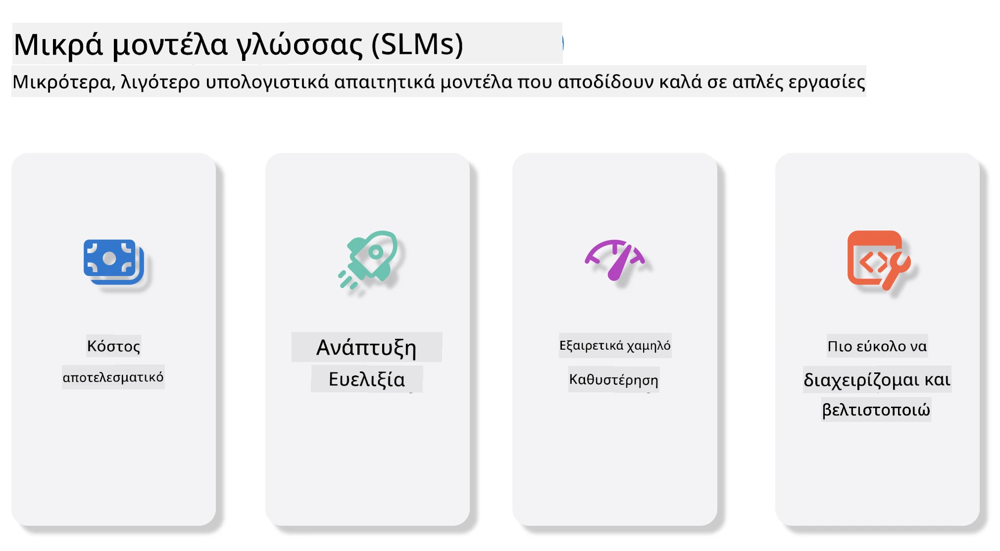
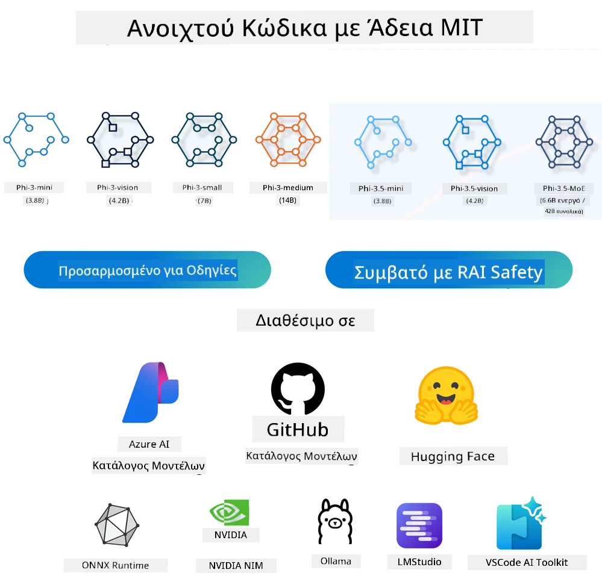
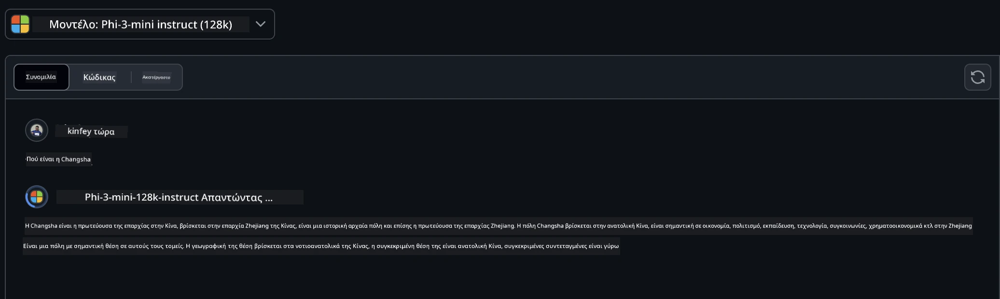
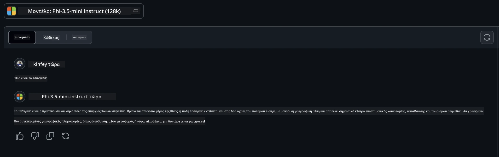

# Εισαγωγή στα Μικρά Γλωσσικά Μοντέλα για Δημιουργική Τεχνητή Νοημοσύνη για Αρχάριους  
Η Δημιουργική Τεχνητή Νοημοσύνη είναι ένας συναρπαστικός τομέας της τεχνητής νοημοσύνης που εστιάζει στη δημιουργία συστημάτων ικανών να παράγουν νέο περιεχόμενο. Αυτό το περιεχόμενο μπορεί να περιλαμβάνει κείμενο και εικόνες, μουσική και ακόμη ολόκληρα εικονικά περιβάλλοντα. Μία από τις πιο συναρπαστικές εφαρμογές της δημιουργικής τεχνητής νοημοσύνης είναι στον τομέα των γλωσσικών μοντέλων.

## Τι Είναι τα Μικρά Γλωσσικά Μοντέλα;

Ένα Μικρό Γλωσσικό Μοντέλο (SLM) αποτελεί μια εκδοχή με μειωμένη κλίμακα ενός μεγάλου γλωσσικού μοντέλου (LLM), αξιοποιώντας πολλούς από τους αρχιτεκτονικούς κανόνες και τεχνικές των LLM, ενώ παρουσιάζει σημαντικά χαμηλότερο υπολογιστικό αποτύπωμα.

Τα SLMs είναι υποσύνολο γλωσσικών μοντέλων σχεδιασμένα να παράγουν κείμενο που μοιάζει ανθρώπινο. Σε αντίθεση με τους μεγαλύτερους ομολόγους τους, όπως το GPT-4, τα SLMs είναι πιο συμπαγή και αποδοτικά, καθιστώντας τα ιδανικά για εφαρμογές όπου οι υπολογιστικοί πόροι είναι περιορισμένοι. Παρά το μικρότερο μέγεθός τους, μπορούν να εκτελέσουν ποικιλία εργασιών. Συνήθως, τα SLMs κατασκευάζονται συμπιέζοντας ή αποστάζοντας LLMs, με στόχο να διατηρήσουν ένα σημαντικό μέρος της λειτουργικότητας και των γλωσσικών ικανοτήτων του αρχικού μοντέλου. Αυτή η μείωση στο μέγεθος του μοντέλου μειώνει τη συνολική πολυπλοκότητα, καθιστώντας τα SLMs πιο αποδοτικά όσον αφορά τη χρήση μνήμης και τις υπολογιστικές απαιτήσεις. Παρά αυτές τις βελτιστοποιήσεις, τα SLMs μπορούν ακόμα να εκτελέσουν μεγάλο εύρος εργασιών φυσικής γλώσσας (NLP):

- Παραγωγή Κειμένου: Δημιουργία συνεκτικών και συμφραζόμενα συναφών προτάσεων ή παραγράφων.  
- Ολοκλήρωση Κειμένου: Πρόβλεψη και συμπλήρωση προτάσεων με βάση ένα δεδομένο ερέθισμα.  
- Μετάφραση: Μετατροπή κειμένου από μία γλώσσα σε άλλη.  
- Περίληψη: Συμπύκνωση μεγάλων κειμένων σε μικρότερες, πιο εύπεπτες περιλήψεις.

Παρόλο που υπάρχουν ορισμένες υποχωρήσεις στην απόδοση ή το βάθος της κατανόησης σε σχέση με τους μεγαλύτερους ομολόγους τους.

## Πώς Λειτουργούν τα Μικρά Γλωσσικά Μοντέλα;  
Τα SLM εκπαιδεύονται σε τεράστιες ποσότητες δεδομένων κειμένου. Κατά τη διάρκεια της εκπαίδευσης, μαθαίνουν τα μοτίβα και τις δομές της γλώσσας, επιτρέποντάς τους να παράγουν κείμενο που είναι τόσο γραμματικά σωστό όσο και συμφραζόμενα κατάλληλο. Η διαδικασία εκπαίδευσης περιλαμβάνει:

- Συλλογή Δεδομένων: Συγκέντρωση μεγάλων συνόλων δεδομένων κειμένου από διάφορες πηγές.  
- Προεπεξεργασία: Καθαρισμός και οργάνωση των δεδομένων για να καταστούν κατάλληλα για εκπαίδευση.  
- Εκπαίδευση: Χρήση αλγορίθμων μηχανικής μάθησης για τη διδασκαλία του μοντέλου να κατανοεί και να παράγει κείμενο.  
- Λεπτομερής Ρύθμιση: Προσαρμογή του μοντέλου για βελτίωση της απόδοσής του σε συγκεκριμένες εργασίες.

Η ανάπτυξη των SLM ευθυγραμμίζεται με την αυξανόμενη ανάγκη για μοντέλα που μπορούν να αναπτυχθούν σε περιβάλλοντα με περιορισμένους πόρους, όπως φορητές συσκευές ή πλατφόρμες edge computing, όπου τα πλήρους κλίμακας LLM μπορεί να είναι αντιπαραγωγικά λόγω των αυξημένων απαιτήσεων σε πόρους. Επικεντρώνοντας στην αποδοτικότητα, τα SLM ισορροπούν μεταξύ απόδοσης και προσβασιμότητας, επιτρέποντας ευρύτερη εφαρμογή σε διάφορους τομείς.



## Μαθησιακοί Στόχοι

Σε αυτό το μάθημα, ελπίζουμε να εισάγουμε τη γνώση των SLM και να τη συνδυάσουμε με το Microsoft Phi-3 για να μάθουμε διαφορετικά σενάρια σε κείμενο, όραση και MoE.

Μέχρι το τέλος αυτού του μαθήματος, θα πρέπει να μπορείτε να απαντήσετε στις ακόλουθες ερωτήσεις:

- Τι είναι το SLM;  
- Ποια είναι η διαφορά μεταξύ SLM και LLM;  
- Τι είναι η Οικογένεια Microsoft Phi-3/3.5;  
- Πώς να εκτελέσετε inference με την Οικογένεια Microsoft Phi-3/3.5;

Είστε έτοιμοι; Ας ξεκινήσουμε.

## Οι Διαφορές μεταξύ Μεγάλων Γλωσσικών Μοντέλων (LLMs) και Μικρών Γλωσσικών Μοντέλων (SLMs)

Τanto τα LLM όσο και τα SLM βασίζονται σε θεμελιώδεις αρχές πιθανοτικής μηχανικής μάθησης, ακολουθώντας παρόμοιες προσεγγίσεις στον αρχιτεκτονικό σχεδιασμό, τις μεθόδους εκπαίδευσης, τις διαδικασίες δημιουργίας δεδομένων και τις τεχνικές αξιολόγησης μοντέλων. Ωστόσο, αρκετοί βασικοί παράγοντες τα διαφοροποιούν.

## Εφαρμογές των Μικρών Γλωσσικών Μοντέλων

Τα SLM έχουν ευρύ φάσμα εφαρμογών, συμπεριλαμβανομένων:

- Chatbots: Παροχή υποστήριξης πελατών και αλληλεπίδραση με χρήστες μέσω συνομιλίας.  
- Δημιουργία Περιεχομένου: Βοήθεια σε συγγραφείς με τη δημιουργία ιδεών ή ακόμα και τη σύνταξη ολόκληρων άρθρων.  
- Εκπαίδευση: Βοήθεια σε μαθητές με εργασίες γραφής ή εκμάθηση νέων γλωσσών.  
- Προσβασιμότητα: Δημιουργία εργαλείων για άτομα με αναπηρίες, όπως συστήματα κειμένου σε ομιλία.

**Μέγεθος**  

Βασική διαφορά μεταξύ LLM και SLM είναι η κλίμακα των μοντέλων. Τα LLMs, όπως το ChatGPT (GPT-4), μπορούν να αποτελούνται από περίπου 1,76 τρισεκατομμύρια παραμέτρους, ενώ τα ανοιχτού κώδικα SLMs όπως το Mistral 7B σχεδιάζονται με σημαντικά λιγότερες παραμέτρους — περίπου 7 δισεκατομμύρια. Αυτή η διαφορά οφείλεται κυρίως σε διαφορές στην αρχιτεκτονική και τις διαδικασίες εκπαίδευσης. Για παράδειγμα, το ChatGPT χρησιμοποιεί μηχανισμό αυτοπροσοχής μέσα σε ένα πλαίσιο κωδικοποιητή-αποκωδικοποιητή, ενώ το Mistral 7B χρησιμοποιεί προσαρμοστική προσοχή ολίσθησης, που επιτρέπει πιο αποδοτική εκπαίδευση σε μοντέλο αποκωδικοποιητή μόνο. Αυτή η αρχιτεκτονική διαφορά έχει σημαντικές επιπτώσεις στην πολυπλοκότητα και την απόδοση των μοντέλων.

**Κατανόηση**  

Τα SLM συνήθως βελτιστοποιούνται για απόδοση σε συγκεκριμένους τομείς, καθιστώντας τα πολύ εξειδικευμένα, αλλά πιθανώς περιορισμένα στην παροχή ευρύτερης κατανόησης συμφραζομένων σε πολλαπλούς τομείς γνώσης. Αντίθετα, τα LLM στοχεύουν στην προσομοίωση της ανθρώπινης νοημοσύνης σε πιο ολοκληρωμένο επίπεδο. Εκπαιδευμένα σε τεράστια, ποικίλα σύνολα δεδομένων, τα LLM σχεδιάζονται να αποδίδουν καλά σε ποικίλους τομείς, προσφέροντας μεγαλύτερη ευελιξία και προσαρμοστικότητα. Κατά συνέπεια, τα LLM είναι πιο κατάλληλα για ευρύτερο φάσμα εργασιών, όπως η επεξεργασία φυσικής γλώσσας και ο προγραμματισμός.

**Υπολογιστικά**  

Η εκπαίδευση και η ανάπτυξη των LLM απαιτούν σημαντικούς πόρους, συχνά απαιτώντας υπερυπολογιστικές υποδομές με μεγάλες GPU συστοιχίες. Για παράδειγμα, η εκπαίδευση ενός μοντέλου όπως το ChatGPT από το μηδέν μπορεί να απαιτήσει χιλιάδες GPU για μεγάλα χρονικά διαστήματα. Σε αντίθεση, τα SLM, με λιγότερες παραμέτρους, είναι πιο προσιτά όσον αφορά τους υπολογιστικούς πόρους. Μοντέλα όπως το Mistral 7B μπορούν να εκπαιδευτούν και να τρέξουν σε τοπικές μηχανές εξοπλισμένες με μέτριες δυνατότητες GPU, αν και η εκπαίδευση εξακολουθεί να απαιτεί αρκετές ώρες σε πολλές GPU.

**Μεροληψία**  

Η μεροληψία αποτελεί γνωστό πρόβλημα στα LLM, κυρίως λόγω της φύσης των δεδομένων εκπαίδευσης. Αυτά τα μοντέλα βασίζονται συχνά σε ακατέργαστα, ανοιχτά διαθέσιμα δεδομένα από το διαδίκτυο, που ενδέχεται να υποεκπροσωπούν ή να παραπληροφορούν ορισμένες ομάδες, να εισάγουν λανθασμένη σήμανση ή να αντανακλούν γλωσσικές προκαταλήψεις που επηρεάζονται από διάλεκτο, γεωγραφικές διαφορές και γραμματικούς κανόνες. Επιπλέον, η πολυπλοκότητα της αρχιτεκτονικής των LLM μπορεί να επιδεινώσει την μεροληψία, που ίσως παραμένει απαρατήρητη χωρίς προσεκτική λεπτομερή ρύθμιση. Αντίθετα, τα SLM, που εκπαιδεύονται σε περισσότερο περιορισμένα και ειδικά δεδομένα, είναι εγγενώς λιγότερο επιρρεπή σε τέτοιες μεροληψίες, αν και δεν είναι αλώβητα.

**Inference**  

Το μειωμένο μέγεθος των SLM τους προσδίδει σημαντικό πλεονέκτημα όσον αφορά την ταχύτητα inference, επιτρέποντάς τους να παράγουν εξόδους αποδοτικά σε τοπικό υλικό χωρίς την ανάγκη εκτεταμένης παράλληλης επεξεργασίας. Αντιθέτως, τα LLM, λόγω του μεγέθους και της πολυπλοκότητάς τους, συχνά απαιτούν παραλληλούς υπολογιστικούς πόρους για να επιτύχουν αποδεκτούς χρόνους απόκρισης. Η ταυτόχρονη παρουσία πολλών χρηστών επιβραδύνει περαιτέρω τους χρόνους απόκρισης των LLM, ειδικά όταν αναπτύσσονται σε μεγάλη κλίμακα.

Συνοψίζοντας, ενώ τα LLM και τα SLM βασίζονται σε κοινές θεμελιώδεις αρχές μηχανικής μάθησης, διαφέρουν σημαντικά όσον αφορά το μέγεθος, τις απαιτήσεις σε πόρους, την κατανόηση συμφραζομένων, την ευαισθησία σε μεροληψία και την ταχύτητα inference. Αυτές οι διαφορές αντικατοπτρίζουν την καταλληλότητά τους για διαφορετικές χρήσεις, με τα LLM να είναι πιο ευέλικτα αλλά βαριά σε πόρους, και τα SLM να προσφέρουν αποδοτικότητα σε τομείς με μειωμένες υπολογιστικές απαιτήσεις.

***Σημείωση: Σε αυτό το μάθημα, θα παρουσιάσουμε το SLM χρησιμοποιώντας το Microsoft Phi-3 / 3.5 ως παράδειγμα.***

## Εισαγωγή στην Οικογένεια Phi-3 / Phi-3.5

Η Οικογένεια Phi-3 / 3.5 στοχεύει κυρίως σε εφαρμογές κειμένου, όρασης και Πράκτορα (MoE):

### Phi-3 / 3.5 Instruct

Κύρια για παραγωγή κειμένου, ολοκλήρωση συνομιλίας και εξαγωγή πληροφοριών περιεχομένου, κ.ά.

**Phi-3-mini**  

Το 3.8B γλωσσικό μοντέλο διατίθεται στο Microsoft Azure AI Studio, Hugging Face και Ollama. Τα μοντέλα Phi-3 υπερέχουν σημαντικά σε βασικά benchmarks σε σχέση με γλωσσικά μοντέλα ίδιου ή μεγαλύτερου μεγέθους (δείτε παρακάτω αριθμούς benchmark, μεγαλύτεροι αριθμοί είναι καλύτεροι). Το Phi-3-mini υπερέχει από μοντέλα διπλάσιου μεγέθους, ενώ τα Phi-3-small και Phi-3-medium υπερέχουν από μεγαλύτερα μοντέλα όπως το GPT-3.5.

**Phi-3-small & medium**  

Με μόλις 7B παραμέτρους, το Phi-3-small ξεπερνά το GPT-3.5T σε διάφορα benchmarks γλώσσας, λογικής, κωδικοποίησης και μαθηματικών.

Το Phi-3-medium με 14B παραμέτρους συνεχίζει αυτήν την τάση και ξεπερνά το Gemini 1.0 Pro.

**Phi-3.5-mini**  

Μπορούμε να το θεωρήσουμε ως αναβάθμιση του Phi-3-mini. Παρά το γεγονός ότι οι παράμετροι παραμένουν αμετάβλητοι, βελτιώνει την υποστήριξη πολλαπλών γλωσσών (υποστήριξη πάνω από 20 γλώσσες: Αραβικά, Κινέζικα, Τσέχικα, Δανέζικα, Ολλανδικά, Αγγλικά, Φινλανδικά, Γαλλικά, Γερμανικά, Εβραϊκά, Ουγγρικά, Ιταλικά, Ιαπωνικά, Κορεατικά, Νορβηγικά, Πολωνικά, Πορτογαλικά, Ρωσικά, Ισπανικά, Σουηδικά, Ταϊλανδέζικα, Τουρκικά, Ουκρανικά) και προσθέτει ισχυρότερη υποστήριξη για μεγάλο πλαίσιο συμφραζομένων.

Το Phi-3.5-mini με 3.8B παραμέτρους υπερέχει από γλωσσικά μοντέλα του ίδιου μεγέθους και ισοδυναμεί με μοντέλα διπλάσιου μεγέθους.

### Phi-3 / 3.5 Όραση

Μπορούμε να θεωρήσουμε το μοντέλο Instruct του Phi-3/3.5 ως την ικανότητα του Phi να κατανοεί, και η Όραση είναι αυτό που δίνει στο Phi "μάτια" για να καταλάβει τον κόσμο.

**Phi-3-Vision**  

Το Phi-3-vision, με μόνο 4.2B παραμέτρους, συνεχίζει αυτή την τάση και ξεπερνά μεγαλύτερα μοντέλα όπως το Claude-3 Haiku και το Gemini 1.0 Pro V σε γενικές εργασίες οπτικής λογικής, OCR και κατανόησης πινάκων και διαγραμμάτων.

**Phi-3.5-Vision**  

Το Phi-3.5-Vision αποτελεί επίσης αναβάθμιση του Phi-3-Vision, προσθέτοντας υποστήριξη για πολλαπλές εικόνες. Μπορείτε να το δείτε ως βελτίωση στην όραση: όχι μόνο βλέπει εικόνες, αλλά και βίντεο.

Το Phi-3.5-vision υπερέχει από μεγαλύτερα μοντέλα όπως το Claude-3.5 Sonnet και Gemini 1.5 Flash σε εργασίες OCR, κατανόησης πινάκων και διαγραμμάτων και ισοδυναμεί σε γενικές εργασίες οπτικής γνώσης και λογικής. Υποστηρίζει πολυπλαίσιο εισόδου, δηλαδή εκτέλεση λογικής πάνω σε πολλαπλές εισερχόμενες εικόνες.

### Phi-3.5-MoE

***Mixture of Experts (MoE)*** επιτρέπει στα μοντέλα να εκπαιδεύονται με πολύ λιγότερο υπολογιστικό κόστος, που σημαίνει ότι μπορείτε να αυξήσετε σημαντικά το μέγεθος του μοντέλου ή του συνόλου δεδομένων με τον ίδιο προϋπολογισμό υπολογισμών όπως σε ένα πυκνό μοντέλο. Ειδικά, ένα μοντέλο MoE πρέπει να επιτύχει την ίδια ποιότητα με το πυκνό ομόλογό του πολύ πιο γρήγορα κατά την προεκπαίδευση.

Το Phi-3.5-MoE περιλαμβάνει 16x3.8B ειδικούς (expert). Το Phi-3.5-MoE με μόλις 6.6B ενεργές παραμέτρους επιτυγχάνει παρόμοιο επίπεδο λογικής, κατανόησης γλώσσας και μαθηματικών με πολύ μεγαλύτερα μοντέλα.

Μπορούμε να χρησιμοποιήσουμε το μοντέλο της οικογένειας Phi-3/3.5 με βάση διαφορετικά σενάρια. Σε αντίθεση με τα LLM, μπορείτε να αναπτύξετε το Phi-3/3.5-mini ή το Phi-3/3.5-Vision σε συσκευές edge.

## Πώς να χρησιμοποιήσετε τα μοντέλα της οικογένειας Phi-3/3.5

Ελπίζουμε να χρησιμοποιήσουμε το Phi-3/3.5 σε διαφορετικά σενάρια. Στη συνέχεια, θα χρησιμοποιήσουμε το Phi-3/3.5 με βάση αυτά τα σενάρια.



### Inference μέσω Cloud APIs

**GitHub Models**

Το GitHub Models είναι ο πιο άμεσος τρόπος. Μπορείτε να αποκτήσετε γρήγορα πρόσβαση στο μοντέλο Phi-3/3.5-Instruct μέσω GitHub Models. Σε συνδυασμό με το Azure AI Inference SDK / OpenAI SDK, μπορείτε να κάνετε κλήσεις API μέσω κώδικα για να ολοκληρώσετε την κλήση Phi-3/3.5-Instruct. Επίσης, μπορείτε να δοκιμάσετε διαφορετικά αποτελέσματα μέσω του Playground.

- Demo: Σύγκριση των αποτελεσμάτων των Phi-3-mini και Phi-3.5-mini σε σενάρια Κινέζικης γλώσσας





**Azure AI Studio**

Εάν θέλετε να χρησιμοποιήσετε τα μοντέλα όρασης και MoE, μπορείτε να χρησιμοποιήσετε το Azure AI Studio για να ολοκληρώσετε την κλήση. Εάν ενδιαφέρεστε, μπορείτε να διαβάσετε το Phi-3 Cookbook για να μάθετε πώς να καλείτε τα Phi-3/3.5 Instruct, Vision, MoE μέσω Azure AI Studio [Κάντε κλικ εδώ](https://github.com/microsoft/Phi-3CookBook/blob/main/md/02.QuickStart/AzureAIStudio_QuickStart.md?WT.mc_id=academic-105485-koreyst)

**NVIDIA NIM**

Εκτός από τις λύσεις καταλόγου μοντέλων cloud που παρέχουν το Azure και το GitHub, μπορείτε επίσης να χρησιμοποιήσετε το [NVIDIA NIM](https://developer.nvidia.com/nim?WT.mc_id=academic-105485-koreyst) για να ολοκληρώσετε σχετικές κλήσεις. Μπορείτε να επισκεφθείτε το NVIDIA NIM για να ολοκληρώσετε τις κλήσεις API της οικογένειας Phi-3/3.5. Το NVIDIA NIM (NVIDIA Inference Microservices) είναι ένα σύνολο επιταχυνόμενων μικρουπηρεσιών inference σχεδιασμένων να βοηθούν τους προγραμματιστές να αναπτύσσουν AI μοντέλα αποδοτικά σε διάφορα περιβάλλοντα, συμπεριλαμβανομένων νεφών, κέντρων δεδομένων και σταθμών εργασίας.

Εδώ είναι ορισμένα βασικά χαρακτηριστικά του NVIDIA NIM:
- **Ευκολία Ανάπτυξης:** Το NIM επιτρέπει την ανάπτυξη μοντέλων τεχνητής νοημοσύνης με μία εντολή, καθιστώντας εύκολη την ενσωμάτωσή του σε υπάρχοντα ροή εργασίας.
- **Βελτιστοποιημένη Απόδοση:** Αξιοποιεί τις προ-βελτιστοποιημένες μηχανές συμπερασμάτων της NVIDIA, όπως οι TensorRT και TensorRT-LLM, για να εξασφαλίσει χαμηλή καθυστέρηση και υψηλό ρυθμό διαμέσου.
- **Κλιμάκωση:** Το NIM υποστηρίζει αυτόματη κλιμάκωση στο Kubernetes, επιτρέποντάς του να διαχειρίζεται αποτελεσματικά μεταβαλλόμενα φορτία εργασίας.
- **Ασφάλεια και Έλεγχος:** Οι οργανισμοί μπορούν να διατηρούν τον έλεγχο των δεδομένων και των εφαρμογών τους αυτοδιαχειριζόμενοι τις μικροϋπηρεσίες NIM στην δική τους διαχειριζόμενη υποδομή.
- **Τυπικά APIs:** Το NIM παρέχει APIs βιομηχανικού προτύπου, καθιστώντας εύκολο το χτίσιμο και την ολοκλήρωση εφαρμογών AI όπως chatbots, βοηθών AI και άλλα.

Το NIM αποτελεί μέρος του NVIDIA AI Enterprise, που στόχο έχει να απλοποιήσει την ανάπτυξη και λειτουργία μοντέλων AI, εξασφαλίζοντας ότι τρέχουν αποδοτικά σε GPU της NVIDIA.

- Demo: Χρήση NVIDIA NIM για κλήση Phi-3.5-Vision-API  [[Κάντε κλικ σε αυτόν τον σύνδεσμο](./python/Phi-3-Vision-Nividia-NIM.ipynb?WT.mc_id=academic-105485-koreyst)]


### Εκτέλεση Phi-3/3.5 Τοπικά
Η συμπερασματολογία σε σχέση με τον Phi-3, ή οποιοδήποτε γλωσσικό μοντέλο όπως το GPT-3, αναφέρεται στη διαδικασία παραγωγής απαντήσεων ή προβλέψεων με βάση τα εισερχόμενα δεδομένα. Όταν παρέχετε ένα προτροπή ή ερώτημα στον Phi-3, χρησιμοποιεί το εκπαιδευμένο νευρωνικό δίκτυό του για να συμπεράνει την πιο πιθανή και σχετική απάντηση αναλύοντας πρότυπα και σχέσεις στα δεδομένα που έχει εκπαιδευτεί.

**Hugging Face Transformer**
Οι Hugging Face Transformers είναι μια δυνατή βιβλιοθήκη σχεδιασμένη για επεξεργασία φυσικής γλώσσας (NLP) και άλλες εργασίες μηχανικής μάθησης. Ακολουθούν μερικά βασικά σημεία γι’ αυτήν:

1. **Προεκπαιδευμένα Μοντέλα**: Παρέχει χιλιάδες προεκπαιδευμένα μοντέλα που μπορούν να χρησιμοποιηθούν για διάφορες εργασίες όπως ταξινόμηση κειμένου, αναγνώριση οντοτήτων, απάντηση σε ερωτήσεις, περίληψη, μετάφραση και δημιουργία κειμένου.

2. **Διαλειτουργικότητα Πλαισίων**: Η βιβλιοθήκη υποστηρίζει πολλαπλά πλαίσια βαθιάς μάθησης, όπως PyTorch, TensorFlow και JAX. Αυτό σας επιτρέπει να εκπαιδεύσετε ένα μοντέλο σε ένα πλαίσιο και να το χρησιμοποιήσετε σε άλλο.

3. **Πολυμορφικές Δυνατότητες**: Εκτός από το NLP, οι Hugging Face Transformers υποστηρίζουν εργασίες στην υπολογιστική όραση (π.χ., ταξινόμηση εικόνας, ανίχνευση αντικειμένων) και στην επεξεργασία ήχου (π.χ., αναγνώριση ομιλίας, ταξινόμηση ήχου).

4. **Ευκολία Χρήσης**: Η βιβλιοθήκη προσφέρει APIs και εργαλεία για εύκολη λήψη και παραμετροποίηση μοντέλων, καθιστώντας την προσβάσιμη τόσο για αρχάριους όσο και για ειδικούς.

5. **Κοινότητα και Πόροι**: Το Hugging Face διαθέτει μια ζωντανή κοινότητα και εκτενή τεκμηρίωση, μαθήματα και οδηγούς για να βοηθήσει τους χρήστες να ξεκινήσουν και να αξιοποιήσουν πλήρως τη βιβλιοθήκη.
[επίσημη τεκμηρίωση](https://huggingface.co/docs/transformers/index?WT.mc_id=academic-105485-koreyst) ή το [GitHub αποθετήριο](https://github.com/huggingface/transformers?WT.mc_id=academic-105485-koreyst).

Αυτή είναι η πιο κοινά χρησιμοποιούμενη μέθοδος, αλλά απαιτεί επιτάχυνση με GPU. Άλλωστε, τα σενάρια όπως Vision και MoE απαιτούν πολλούς υπολογισμούς, που θα είναι πολύ αργοί σε CPU εάν δεν είναι κβαντισμένοι.


- Demo: Χρήση Transformer για κλήση Phi-3.5-Instruct [Κάντε κλικ σε αυτόν τον σύνδεσμο](./python/phi35-instruct-demo.ipynb?WT.mc_id=academic-105485-koreyst)

- Demo: Χρήση Transformer για κλήση Phi-3.5-Vision [Κάντε κλικ σε αυτόν τον σύνδεσμο](./python/phi35-vision-demo.ipynb?WT.mc_id=academic-105485-koreyst)

- Demo: Χρήση Transformer για κλήση Phi-3.5-MoE [Κάντε κλικ σε αυτόν τον σύνδεσμο](./python/phi35_moe_demo.ipynb?WT.mc_id=academic-105485-koreyst)

**Ollama**
[Ollama](https://ollama.com/?WT.mc_id=academic-105485-koreyst) είναι μια πλατφόρμα σχεδιασμένη να διευκολύνει την εκτέλεση μεγάλων γλωσσικών μοντέλων (LLMs) τοπικά στο μηχάνημά σας. Υποστηρίζει διάφορα μοντέλα όπως Llama 3.1, Phi 3, Mistral και Gemma 2, μεταξύ άλλων. Η πλατφόρμα απλοποιεί τη διαδικασία πακετάροντας τα βάρη, τη διαμόρφωση και τα δεδομένα του μοντέλου σε ένα ενιαίο πακέτο, καθιστώντας την περισσότερο προσβάσιμη για τους χρήστες να προσαρμόσουν και να δημιουργήσουν τα δικά τους μοντέλα. Το Ollama είναι διαθέσιμο για macOS, Linux και Windows. Είναι ένα καταπληκτικό εργαλείο αν θέλετε να πειραματιστείτε ή να αναπτύξετε LLMs χωρίς να βασίζεστε σε υπηρεσίες cloud. Το Ollama είναι ο πιο άμεσος τρόπος, απλώς χρειάζεται να εκτελέσετε την ακόλουθη εντολή.


```bash

ollama run phi3.5

```


**ONNX Runtime για GenAI**

[ONNX Runtime](https://github.com/microsoft/onnxruntime-genai?WT.mc_id=academic-105485-koreyst) είναι ένας επιταχυντής εκτέλεσης και εκπαίδευσης μηχανικής μάθησης πολλαπλών πλατφορμών. Το ONNX Runtime για Generative AI (GENAI) είναι ένα δυνατό εργαλείο που σας βοηθά να εκτελείτε μοντέλα γενετικής τεχνητής νοημοσύνης αποδοτικά σε διάφορες πλατφόρμες. 

## Τι είναι το ONNX Runtime;
Το ONNX Runtime είναι ένα έργο ανοικτού κώδικα που επιτρέπει την υψηλής απόδοσης εκτέλεση μοντέλων μηχανικής μάθησης. Υποστηρίζει μοντέλα στο πρότυπο Open Neural Network Exchange (ONNX), που αποτελεί ένα πρότυπο για την αναπαράσταση μοντέλων μηχανικής μάθησης. Η εκτέλεση μέσω ONNX Runtime μπορεί να επιταχύνει τις εμπειρίες πελατών και να μειώσει το κόστος, υποστηρίζοντας μοντέλα από πλαίσια βαθιάς μάθησης όπως PyTorch και TensorFlow/Keras καθώς και κλασικές βιβλιοθήκες μηχανικής μάθησης όπως scikit-learn, LightGBM, XGBoost κ.ά. Το ONNX Runtime είναι συμβατό με διαφορετικό υλικό, οδηγούς και λειτουργικά συστήματα, προσφέροντας βέλτιστη απόδοση αξιοποιώντας υλικό επιτάχυνσης όπου είναι εφικτό παράλληλα με βελτιστοποιήσεις και μετασχηματισμούς γραφημάτων.

## Τι είναι η Γενετική Τεχνητή Νοημοσύνη;
Η γενετική τεχνητή νοημοσύνη αναφέρεται σε συστήματα AI που μπορούν να δημιουργήσουν νέο περιεχόμενο, όπως κείμενο, εικόνες ή μουσική, βασισμένα στα δεδομένα στα οποία εκπαιδεύτηκαν. Παραδείγματα περιλαμβάνουν γλωσσικά μοντέλα όπως το GPT-3 και μοντέλα δημιουργίας εικόνων όπως το Stable Diffusion. Η βιβλιοθήκη ONNX Runtime για GenAI παρέχει τον κύκλο γενετικής AI για μοντέλα ONNX, συμπεριλαμβανομένης της εκτέλεσης με ONNX Runtime, της επεξεργασίας λογιστικών, της αναζήτησης και δειγματοληψίας και της διαχείρισης της μνήμης KV.

## ONNX Runtime για GENAI
Το ONNX Runtime για GENAI επεκτείνει τις δυνατότητες του ONNX Runtime ώστε να υποστηρίζει γενετικά AI μοντέλα. Εδώ μερικά βασικά χαρακτηριστικά:

- **Ευρεία Υποστήριξη Πλατφορμών:** Λειτουργεί σε διάφορες πλατφόρμες, όπως Windows, Linux, macOS, Android και iOS.
- **Υποστήριξη Μοντέλων:** Υποστηρίζει πολλά δημοφιλή μοντέλα γενετικής AI, όπως LLaMA, GPT-Neo, BLOOM και άλλα.
- **Βελτιστοποίηση Απόδοσης:** Περιλαμβάνει βελτιστοποιήσεις για διαφορετικούς επιταχυντές υλικού όπως NVIDIA GPUs, AMD GPUs και άλλα2.
- **Ευκολία Χρήσης:** Παρέχει APIs για εύκολη ενσωμάτωση σε εφαρμογές, επιτρέποντάς σας να παράγετε κείμενο, εικόνες και άλλο περιεχόμενο με ελάχιστο κώδικα.
- Οι χρήστες μπορούν να καλέσουν μια υψηλού επιπέδου μέθοδο generate(), ή να τρέχουν κάθε επανάληψη του μοντέλου σε βρόχο, παράγοντας ένα token τη φορά, και προαιρετικά ενημερώνοντας παραμέτρους δημιουργίας εντός του βρόχου.
- Το ONNX runtime επίσης υποστηρίζει greedy/beam search και TopP, TopK δειγματοληψία για την παραγωγή ακολουθιών token και ενσωματωμένη επεξεργασία λογιστικών όπως ποινές επανάληψης. Μπορείτε επίσης εύκολα να προσθέσετε προσαρμοσμένη βαθμολόγηση.

## Ξεκινώντας
Για να ξεκινήσετε με το ONNX Runtime για GENAI, μπορείτε να ακολουθήσετε τα εξής βήματα:

### Εγκαταστήστε το ONNX Runtime:
```Python
pip install onnxruntime
```
### Εγκαταστήστε τις Επεκτάσεις Γενετικής AI:
```Python
pip install onnxruntime-genai
```

### Εκτελέστε ένα Μοντέλο: Εδώ ένα απλό παράδειγμα σε Python:
```Python
import onnxruntime_genai as og

model = og.Model('path_to_your_model.onnx')

tokenizer = og.Tokenizer(model)

input_text = "Hello, how are you?"

input_tokens = tokenizer.encode(input_text)

output_tokens = model.generate(input_tokens)

output_text = tokenizer.decode(output_tokens)

print(output_text) 
```
### Demo:Χρήση ONNX Runtime GenAI για κλήση Phi-3.5-Vision


```python

import onnxruntime_genai as og

model_path = './Your Phi-3.5-vision-instruct ONNX Path'

img_path = './Your Image Path'

model = og.Model(model_path)

processor = model.create_multimodal_processor()

tokenizer_stream = processor.create_stream()

text = "Your Prompt"

prompt = "<|user|>\n"

prompt += "<|image_1|>\n"

prompt += f"{text}<|end|>\n"

prompt += "<|assistant|>\n"

image = og.Images.open(img_path)

inputs = processor(prompt, images=image)

params = og.GeneratorParams(model)

params.set_inputs(inputs)

params.set_search_options(max_length=3072)

generator = og.Generator(model, params)

while not generator.is_done():

    generator.compute_logits()
    
    generator.generate_next_token()

    new_token = generator.get_next_tokens()[0]
    
    output = tokenizer_stream.decode(new_token)
    
    print(tokenizer_stream.decode(new_token), end='', flush=True)

```


**Άλλα**

Εκτός από τις μεθόδους αναφοράς ONNX Runtime και Ollama, μπορούμε επίσης να ολοκληρώσουμε την αναφορά ποσοτικών μοντέλων βασισμένων στις μεθόδους αναφοράς μοντέλων που παρέχονται από διαφορετικούς κατασκευαστές. Όπως το πλαίσιο Apple MLX με Apple Metal, Qualcomm QNN με NPU, Intel OpenVINO με CPU/GPU κ.ά. Μπορείτε επίσης να βρείτε περισσότερο περιεχόμενο στο [Phi-3 Cookbook](https://github.com/microsoft/phi-3cookbook?WT.mc_id=academic-105485-koreyst)


## Περισσότερα

Έχουμε μάθει τα βασικά της οικογένειας Phi-3/3.5, αλλά για να μάθουμε περισσότερα για το SLM χρειαζόμαστε περισσότερες γνώσεις. Μπορείτε να βρείτε τις απαντήσεις στο Phi-3 Cookbook. Αν θέλετε να μάθετε περισσότερα, παρακαλούμε επισκεφθείτε το [Phi-3 Cookbook](https://github.com/microsoft/phi-3cookbook?WT.mc_id=academic-105485-koreyst).

---

<!-- CO-OP TRANSLATOR DISCLAIMER START -->
**Αποποίηση ευθύνης**:  
Αυτό το έγγραφο έχει μεταφραστεί χρησιμοποιώντας την υπηρεσία μετάφρασης AI [Co-op Translator](https://github.com/Azure/co-op-translator). Παρόλο που επιδιώκουμε ακρίβεια, παρακαλούμε να σημειώσετε ότι οι αυτοματοποιημένες μεταφράσεις ενδέχεται να περιέχουν σφάλματα ή ανακρίβειες. Το πρωτότυπο έγγραφο στη γλώσσα του θεωρείται η επίσημη πηγή. Για κρίσιμες πληροφορίες, συνιστάται επαγγελματική μετάφραση από ανθρώπινο μεταφραστή. Δεν φέρουμε ευθύνη για τυχόν παρεξηγήσεις ή λανθασμένες ερμηνείες που προκύπτουν από τη χρήση αυτής της μετάφρασης.
<!-- CO-OP TRANSLATOR DISCLAIMER END -->