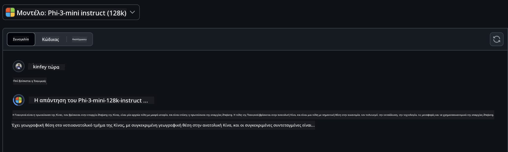
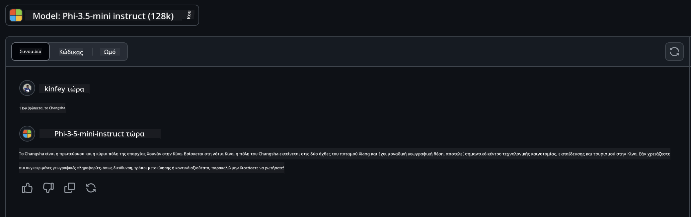

<!--
CO_OP_TRANSLATOR_METADATA:
{
  "original_hash": "124ad36cfe96f74038811b6e2bb93e9d",
  "translation_date": "2025-06-26T02:16:53+00:00",
  "source_file": "19-slm/README.md",
  "language_code": "el"
}
-->

Τα μοντέλα είναι ο πιο άμεσος τρόπος. Μπορείτε να έχετε γρήγορη πρόσβαση στο μοντέλο Phi-3/3.5-Instruct μέσω του GitHub Models. Σε συνδυασμό με το Azure AI Inference SDK / OpenAI SDK, μπορείτε να έχετε πρόσβαση στο API μέσω κώδικα για να ολοκληρώσετε την κλήση Phi-3/3.5-Instruct. Μπορείτε επίσης να δοκιμάσετε διαφορετικά εφέ μέσω του Playground. - Demo: Σύγκριση των εφέ των Phi-3-mini και Phi-3.5-mini σε κινεζικά σενάρια   **Azure AI Studio** Ή αν θέλουμε να χρησιμοποιήσουμε τα μοντέλα vision και MoE, μπορείτε να χρησιμοποιήσετε το Azure AI Studio για να ολοκληρώσετε την κλήση. Αν σας ενδιαφέρει, μπορείτε να διαβάσετε το Phi-3 Cookbook για να μάθετε πώς να καλείτε το Phi-3/3.5 Instruct, Vision, MoE μέσω του Azure AI Studio [Πατήστε αυτόν τον σύνδεσμο](https://github.com/microsoft/Phi-3CookBook/blob/main/md/02.QuickStart/AzureAIStudio_QuickStart.md?WT.mc_id=academic-105485-koreyst) **NVIDIA NIM** Εκτός από τις λύσεις Καταλόγου Μοντέλων που βασίζονται σε σύννεφο που παρέχονται από το Azure και το GitHub, μπορείτε επίσης να χρησιμοποιήσετε το [Nivida NIM](https://developer.nvidia.com/nim?WT.mc_id=academic-105485-koreyst) για να ολοκληρώσετε τις σχετικές κλήσεις. Μπορείτε να επισκεφθείτε το NIVIDA NIM για να ολοκληρώσετε τις κλήσεις API της οικογένειας Phi-3/3.5. Το NVIDIA NIM (NVIDIA Inference Microservices) είναι ένα σύνολο μικροϋπηρεσιών επιτάχυνσης πρόβλεψης που σχεδιάστηκε για να βοηθά τους προγραμματιστές να αναπτύσσουν μοντέλα AI αποδοτικά σε διάφορα περιβάλλοντα, συμπεριλαμβανομένων των σύννεφων, των κέντρων δεδομένων και των σταθμών εργασίας. Εδώ είναι μερικά βασικά χαρακτηριστικά του NVIDIA NIM: - **Ευκολία Ανάπτυξης:** Το NIM επιτρέπει την ανάπτυξη μοντέλων AI με μία μόνο εντολή, καθιστώντας εύκολη την ενσωμάτωση σε υπάρχουσες ροές εργασίας. - **Βελτιστοποιημένη Απόδοση:** Αξιοποιεί τις προ-βελτιστοποιημένες μηχανές πρόβλεψης της NVIDIA, όπως οι TensorRT και TensorRT-LLM, για να εξασφαλίσει χαμηλή καθυστέρηση και υψηλή απόδοση. - **Κλιμάκωση:** Το NIM υποστηρίζει αυτόματη κλιμάκωση στο Kubernetes, επιτρέποντάς του να διαχειρίζεται αποτελεσματικά διαφορετικά φορτία εργασίας. - **Ασφάλεια και Έλεγχος:** Οι οργανισμοί μπορούν να διατηρούν τον έλεγχο των δεδομένων και των εφαρμογών τους με την αυτο-φιλοξενία των μικροϋπηρεσιών NIM στην δική τους διαχειριζόμενη υποδομή. - **Πρότυπα APIs:** Το NIM παρέχει πρότυπα APIs, καθιστώντας εύκολη την κατασκευή και ενσωμάτωση εφαρμογών AI όπως chatbots, βοηθούς AI και άλλα. Το NIM είναι μέρος του NVIDIA AI Enterprise, που στοχεύει να απλοποιήσει την ανάπτυξη και την επιχειρησιακή χρήση των μοντέλων AI, εξασφαλίζοντας ότι λειτουργούν αποδοτικά στις GPU της NVIDIA. - Demo: Χρήση του Nividia NIM για την κλήση Phi-3.5-Vision-API [[Πατήστε αυτόν τον σύνδεσμο](../../../19-slm/python/Phi-3-Vision-Nividia-NIM.ipynb)] ### Πρόβλεψη Phi-3/3.5 σε τοπικό περιβάλλον Η πρόβλεψη σε σχέση με το Phi-3, ή οποιοδήποτε μοντέλο γλώσσας όπως το GPT-3, αναφέρεται στη διαδικασία δημιουργίας απαντήσεων ή προβλέψεων βάσει των εισόδων που λαμβάνει. Όταν παρέχετε ένα προτροπή ή ερώτηση στο Phi-3, χρησιμοποιεί το εκπαιδευμένο νευρωνικό του δίκτυο για να συμπεράνει την πιο πιθανή και σχετική απάντηση αναλύοντας μοτίβα και σχέσεις στα δεδομένα που εκπαιδεύτηκε. **Hugging Face Transformer** Το Hugging Face Transformers είναι μια ισχυρή βιβλιοθήκη σχεδιασμένη για επεξεργασία φυσικής γλώσσας (NLP) και άλλες εργασίες μηχανικής μάθησης. Εδώ είναι μερικά βασικά σημεία για αυτήν: 1. **Προεκπαιδευμένα Μοντέλα**: Παρέχει χιλιάδες προεκπαιδευμένα μοντέλα που μπορούν να χρησιμοποιηθούν για διάφορες εργασίες όπως ταξινόμηση κειμένου, αναγνώριση ονομασμένων οντοτήτων, απάντηση σε ερωτήσεις, περίληψη, μετάφραση και δημιουργία κειμένου. 2. **Διαλειτουργικότητα Πλαισίων**: Η βιβλιοθήκη υποστηρίζει πολλαπλά πλαίσια βαθιάς μάθησης, όπως PyTorch, TensorFlow και JAX. Αυτό σας επιτρέπει να εκπαιδεύσετε ένα μοντέλο σε ένα πλαίσιο και να το χρησιμοποιήσετε σε άλλο. 3. **Δυνατότητες Πολυμέσων**: Εκτός από το NLP, το Hugging Face Transformers υποστηρίζει επίσης εργασίες στην υπολογιστική όραση (π.χ., ταξινόμηση εικόνων, ανίχνευση αντικειμένων) και επεξεργασία ήχου (π.χ., αναγνώριση ομιλίας, ταξινόμηση ήχου). 4. **Ευκολία Χρήσης**: Η βιβλιοθήκη προσφέρει APIs και εργαλεία για εύκολη λήψη και προσαρμογή μοντέλων, καθιστώντας την προσβάσιμη τόσο για αρχάριους όσο και για ειδικούς. 5. **Κοινότητα και Πόροι**: Το Hugging Face έχει μια ζωντανή κοινότητα και εκτενή τεκμηρίωση, σεμινάρια και οδηγούς για να βοηθήσει τους χρήστες να ξεκινήσουν και να αξιοποιήσουν στο έπακρο τη βιβλιοθήκη. [επίσημη τεκμηρίωση](https://huggingface.co/docs/transformers/index?WT.mc_id=academic-105485-koreyst) ή το [αποθετήριο τους στο GitHub](https://github.com/huggingface/transformers?WT.mc_id=academic-105485-koreyst). Αυτή είναι η πιο συχνά χρησιμοποιούμενη μέθοδος, αλλά απαιτεί επίσης επιτάχυνση GPU. Μετά από όλα, σκηνές όπως το Vision και το MoE απαιτούν πολλούς υπολογισμούς, οι οποίοι θα είναι πολύ περιορισμένοι στη CPU αν δεν είναι κβαντισμένοι. - Demo: Χρήση Transformer για την κλήση Phi-3.5-Instuct [Πατήστε αυτόν τον σύνδεσμο](../../../19-slm/python/phi35-instruct-demo.ipynb) - Demo: Χρήση Transformer για την κλήση Phi-3.5-Vision [Πατήστε αυτόν τον σύνδεσμο](../../../19-slm/python/phi35-vision-demo.ipynb) - Demo: Χρήση Transformer για την κλήση Phi-3.5-MoE [Πατήστε αυτόν τον σύνδεσμο](../../../19-slm/python/phi35_moe_demo.ipynb) **Ollama** [Ollama](https://ollama.com/?WT.mc_id=academic-105485-koreyst) είναι μια πλατφόρμα σχεδιασμένη για να διευκολύνει τη λειτουργία μεγάλων μοντέλων γλώσσας (LLMs) τοπικά στον υπολογιστή σας. Υποστηρίζει διάφορα μοντέλα όπως το Llama 3.1, το Phi 3, το Mistral και το Gemma 2, μεταξύ άλλων. Η πλατφόρμα απλοποιεί τη διαδικασία συγκεντρώνοντας τα βάρη του μοντέλου, τη διαμόρφωση και τα δεδομένα σε ένα μόνο πακέτο, καθιστώντας την πιο προσβάσιμη για τους χρήστες να προσαρμόζουν και να δημιουργούν τα δικά τους μοντέλα. Το Ollama είναι διαθέσιμο για macOS, Linux και Windows. Είναι ένα εξαιρετικό εργαλείο αν θέλετε να πειραματιστείτε ή να αναπτύξετε LLMs χωρίς να βασίζεστε σε υπηρεσίες σύννεφου. Το Ollama είναι ο πιο άμεσος τρόπος, απλά πρέπει να εκτελέσετε την παρακάτω δήλωση. ```bash

ollama run phi3.5

``` **ONNX Runtime για GenAI** [ONNX Runtime](https://github.com/microsoft/onnxruntime-genai?WT.mc_id=academic-105485-koreyst) είναι ένας επιταχυντής μηχανικής μάθησης για πρόβλεψη και εκπαίδευση πολλαπλών πλατφορμών. Το ONNX Runtime για Generative AI (GENAI) είναι ένα ισχυρό εργαλείο που σας βοηθά να εκτελείτε μοντέλα γεννητικής AI αποδοτικά σε διάφορες πλατφόρμες. ## Τι είναι το ONNX Runtime; Το ONNX Runtime είναι ένα έργο ανοιχτού κώδικα που επιτρέπει την υψηλής απόδοσης πρόβλεψη μοντέλων μηχανικής μάθησης. Υποστηρίζει μοντέλα σε μορφή Open Neural Network Exchange (ONNX), η οποία είναι ένα πρότυπο για την αναπαράσταση μοντέλων μηχανικής μάθησης. Η πρόβλεψη με το ONNX Runtime μπορεί να επιτρέψει ταχύτερες εμπειρίες πελατών και χαμηλότερο κόστος, υποστηρίζοντας μοντέλα από πλαίσια βαθιάς μάθησης όπως PyTorch και TensorFlow/Keras, καθώς και κλασικές βιβλιοθήκες μηχανικής μάθησης όπως scikit-learn, LightGBM, XGBoost, κ.λπ. Το ONNX Runtime είναι συμβατό με διαφορετικό υλικό, οδηγούς και λειτουργικά συστήματα, και παρέχει βέλτιστη απόδοση αξιοποιώντας επιταχυντές υλικού όπου είναι εφαρμόσιμοι μαζί με βελτιστοποιήσεις γραφημάτων και μετασχηματισμούς ## Τι είναι η Γεννητική AI; Η Γεννητική AI αναφέρεται σε συστήματα AI που μπορούν να δημιουργήσουν νέο περιεχόμενο, όπως κείμενο, εικόνες ή μουσική, βάσει των δεδομένων που έχουν εκπαιδευτεί. Παραδείγματα περιλαμβάνουν μοντέλα γλώσσας όπως το GPT-3 και μοντέλα δημιουργίας εικόνων όπως το Stable Diffusion. Η βιβλιοθήκη ONNX Runtime για GenAI παρέχει τον γεννητικό βρόχο AI για μοντέλα ONNX, συμπεριλαμβανομένης της πρόβλεψης με το ONNX Runtime, της επεξεργασίας logits, της αναζήτησης και δειγματοληψίας, και της διαχείρισης προσωρινής μνήμης KV. ## ONNX Runtime για GENAI Το ONNX Runtime για GENAI επεκτείνει τις δυνατότητες του ONNX Runtime για να υποστηρίζει μοντέλα γεννητικής AI. Εδώ είναι μερικά βασικά χαρακτηριστικά: - **Ευρεία Υποστήριξη Πλατφόρμας:** Λειτουργεί σε διάφορες πλατφόρμες, συμπεριλαμβανομένων των Windows, Linux, macOS, Android και iOS. - **Υποστήριξη Μοντέλων:** Υποστηρίζει πολλά δημοφιλή μοντέλα γεννητικής AI, όπως LLaMA, GPT-Neo, BLOOM, και άλλα. - **Βελτιστοποίηση Απόδοσης:** Περιλαμβάνει βελτιστοποιήσεις για διαφορετικούς επιταχυντές υλικού όπως οι GPU της NVIDIA, οι GPU της AMD, και άλλα. - **Ευκολία Χρήσης:** Παρέχει APIs για εύκολη ενσωμάτωση σε εφαρμογές, επιτρέποντάς σας να δημιουργείτε κείμενο, εικόνες, και άλλο περιεχόμενο με ελάχιστο κώδικα - Οι χρήστες μπορούν να καλέσουν μια μέθοδο generate() υψηλού επιπέδου, ή να εκτελούν κάθε επανάληψη του μοντέλου σε έναν βρόχο, δημιουργώντας ένα token τη φορά, και προαιρετικά να ενημερώνουν τις παραμέτρους δημιουργίας μέσα στον βρόχο. - Το ONNX runtime υποστηρίζει επίσης αναζήτηση greedy/beam και δειγματοληψία TopP, TopK για να δημιουργήσει ακολουθίες token και ενσωματωμένη επεξεργασία logits όπως ποινές επανάληψης. Μπορείτε επίσης εύκολα να προσθέσετε προσαρμοσμένη βαθμολόγηση. ## Ξεκινώντας Για να ξεκινήσετε με το ONNX Runtime για GENAI, μπορείτε να ακολουθήσετε τα εξής βήματα: ### Εγκατάσταση του ONNX Runtime: ```Python
pip install onnxruntime
``` ### Εγκατάσταση των Επεκτάσεων Γεννητικής AI: ```Python
pip install onnxruntime-genai
``` ### Εκτέλεση ενός Μοντέλου: Εδώ είναι ένα απλό παράδειγμα σε Python: ```Python
import onnxruntime_genai as og

model = og.Model('path_to_your_model.onnx')

tokenizer = og.Tokenizer(model)

input_text = "Hello, how are you?"

input_tokens = tokenizer.encode(input_text)

output_tokens = model.generate(input_tokens)

output_text = tokenizer.decode(output_tokens)

print(output_text) 
``` ### Demo: Χρήση του ONNX Runtime GenAI για την κλήση Phi-3.5-Vision ```python

import onnxruntime_genai as og

model_path = './Your Phi-3.5-vision-instruct ONNX Path'

img_path = './Your Image Path'

model = og.Model(model_path)

processor = model.create_multimodal_processor()

tokenizer_stream = processor.create_stream()

text = "Your Prompt"

prompt = "<|user|>\n"

prompt += "<|image_1|>\n"

prompt += f"{text}<|end|>\n"

prompt += "<|assistant|>\n"

image = og.Images.open(img_path)

inputs = processor(prompt, images=image)

params = og.GeneratorParams(model)

params.set_inputs(inputs)

params.set_search_options(max_length=3072)

generator = og.Generator(model, params)

while not generator.is_done():

    generator.compute_logits()
    
    generator.generate_next_token()

    new_token = generator.get_next_tokens()[0]
    
    code += tokenizer_stream.decode(new_token)
    
    print(tokenizer_stream.decode(new_token), end='', flush=True)

``` **Άλλα** Εκτός από τις μεθόδους αναφοράς ONNX Runtime και Ollama, μπορούμε επίσης να ολοκληρώσουμε την αναφορά ποσοτικών μοντέλων βάσει των μεθόδων αναφοράς μοντέλων που παρέχονται από διαφορετικούς κατασκευαστές. Όπως το πλαίσιο Apple MLX με το Apple Metal, το Qualcomm QNN με το NPU, το Intel OpenVINO με CPU/GPU, κ.λπ. Μπορείτε επίσης να βρείτε περισσότερο περιεχόμενο από το [Phi-3 Cookbook](https://github.com/microsoft/phi-3cookbook?WT.mc_id=academic-105485-koreyst) ## Περισσότερα Έχουμε μάθει τα βασικά της οικογένειας Phi-3/3.5, αλλά για να μάθουμε περισσότερα για το SLM χρειαζόμαστε περισσότερη γνώση. Μπορείτε να βρείτε τις απαντήσεις στο Phi-3 Cookbook. Αν θέλετε να μάθετε περισσότερα, επισκεφθείτε το [Phi-3 Cookbook](https://github.com/microsoft/phi-3cookbook?WT.mc_id=academic-105485-koreyst).

**Αποποίηση ευθυνών**:  
Αυτό το έγγραφο έχει μεταφραστεί χρησιμοποιώντας την υπηρεσία AI μετάφρασης [Co-op Translator](https://github.com/Azure/co-op-translator). Ενώ επιδιώκουμε την ακρίβεια, παρακαλούμε να γνωρίζετε ότι οι αυτοματοποιημένες μεταφράσεις μπορεί να περιέχουν σφάλματα ή ανακρίβειες. Το πρωτότυπο έγγραφο στη μητρική του γλώσσα πρέπει να θεωρείται η αυθεντική πηγή. Για κρίσιμες πληροφορίες, συνιστάται επαγγελματική ανθρώπινη μετάφραση. Δεν είμαστε υπεύθυνοι για τυχόν παρεξηγήσεις ή παρερμηνείες που προκύπτουν από τη χρήση αυτής της μετάφρασης.