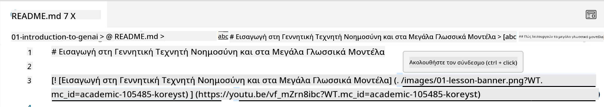
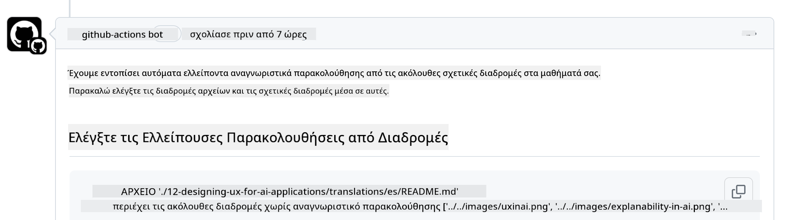
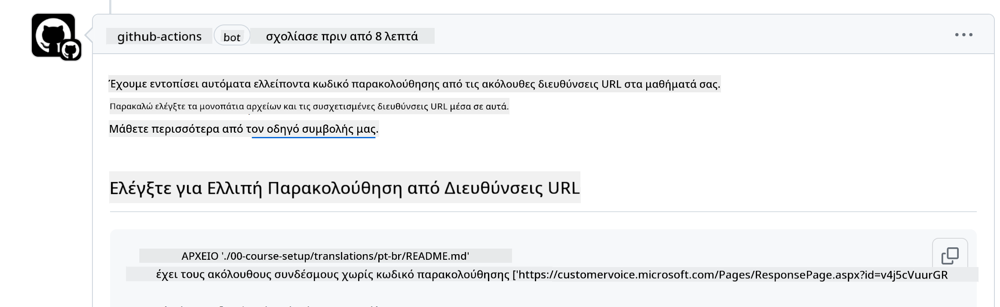
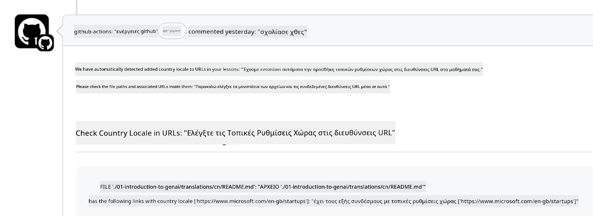

<!--
CO_OP_TRANSLATOR_METADATA:
{
  "original_hash": "57c41f2af71001a2cff9d8eb797cb843",
  "translation_date": "2025-05-19T11:16:07+00:00",
  "source_file": "CONTRIBUTING.md",
  "language_code": "el"
}
-->
# Συμβολή

Αυτό το έργο καλωσορίζει συνεισφορές και προτάσεις. Οι περισσότερες συνεισφορές απαιτούν να συμφωνήσετε με μια Συμφωνία Άδειας Χρήσης Συνεισφέροντος (CLA) δηλώνοντας ότι έχετε το δικαίωμα να μας παραχωρήσετε τα δικαιώματα χρήσης της συνεισφοράς σας. Για λεπτομέρειες, επισκεφθείτε το <https://cla.microsoft.com>.

> Σημαντικό: όταν μεταφράζετε κείμενο σε αυτό το αποθετήριο, παρακαλούμε βεβαιωθείτε ότι δεν χρησιμοποιείτε μηχανική μετάφραση. Θα επαληθεύσουμε τις μεταφράσεις μέσω της κοινότητας, οπότε παρακαλούμε να εθελονθείτε μόνο για μεταφράσεις σε γλώσσες στις οποίες είστε άπταιστοι.

Όταν υποβάλετε ένα αίτημα pull, ένα CLA-bot θα καθορίσει αυτόματα εάν χρειάζεται να παρέχετε ένα CLA και θα διακοσμήσει το PR κατάλληλα (π.χ., ετικέτα, σχόλιο). Απλώς ακολουθήστε τις οδηγίες που παρέχονται από το bot. Θα χρειαστεί να το κάνετε αυτό μόνο μία φορά σε όλα τα αποθετήρια που χρησιμοποιούν το CLA μας.

## Κώδικας Συμπεριφοράς

Αυτό το έργο έχει υιοθετήσει τον [Κώδικα Συμπεριφοράς Ανοιχτού Κώδικα της Microsoft](https://opensource.microsoft.com/codeofconduct/?WT.mc_id=academic-105485-koreyst). Για περισσότερες πληροφορίες, διαβάστε τις [Συχνές Ερωτήσεις για τον Κώδικα Συμπεριφοράς](https://opensource.microsoft.com/codeofconduct/faq/?WT.mc_id=academic-105485-koreyst) ή επικοινωνήστε με το [opencode@microsoft.com](mailto:opencode@microsoft.com) για οποιεσδήποτε επιπλέον ερωτήσεις ή σχόλια.

## Ερώτηση ή Πρόβλημα;

Παρακαλούμε μην ανοίγετε ζητήματα στο GitHub για γενικές ερωτήσεις υποστήριξης, καθώς η λίστα του GitHub θα πρέπει να χρησιμοποιείται για αιτήματα λειτουργιών και αναφορές σφαλμάτων. Με αυτόν τον τρόπο μπορούμε να παρακολουθούμε πιο εύκολα τα πραγματικά ζητήματα ή σφάλματα από τον κώδικα και να διατηρούμε τη γενική συζήτηση ξεχωριστή από τον πραγματικό κώδικα.

## Λάθη, Ζητήματα, Σφάλματα και συνεισφορές

Όποτε υποβάλλετε οποιεσδήποτε αλλαγές στο αποθετήριο Generative AI for Beginners, παρακαλούμε ακολουθήστε αυτές τις συστάσεις.

* Πάντα να κάνετε fork το αποθετήριο στον δικό σας λογαριασμό πριν κάνετε τις τροποποιήσεις σας
* Μην συνδυάζετε πολλαπλές αλλαγές σε ένα αίτημα pull. Για παράδειγμα, υποβάλετε οποιαδήποτε διόρθωση σφάλματος και ενημερώσεις τεκμηρίωσης χρησιμοποιώντας ξεχωριστά PRs
* Εάν το αίτημα pull σας δείχνει συγκρούσεις συγχώνευσης, βεβαιωθείτε ότι ενημερώσατε το τοπικό σας main να είναι αντίγραφο του κύριου αποθετηρίου πριν κάνετε τις τροποποιήσεις σας
* Εάν υποβάλλετε μια μετάφραση, παρακαλούμε δημιουργήστε ένα PR για όλα τα μεταφρασμένα αρχεία, καθώς δεν δεχόμαστε μερικές μεταφράσεις για το περιεχόμενο
* Εάν υποβάλλετε διόρθωση ορθογραφικού ή τεκμηρίωσης, μπορείτε να συνδυάσετε τροποποιήσεις σε ένα μόνο PR όπου είναι κατάλληλο

## Γενικές Οδηγίες για τη Συγγραφή

- Βεβαιωθείτε ότι όλες οι URLs σας είναι τυλιγμένες σε αγκύλες και ακολουθούνται από παρένθεση χωρίς επιπλέον κενά γύρω τους ή μέσα τους ``.
- Βεβαιωθείτε ότι οποιοσδήποτε σχετικός σύνδεσμος (δηλ. σύνδεσμοι σε άλλα αρχεία και φακέλους στο αποθετήριο) ξεκινά με `./` αναφερόμενος σε ένα αρχείο ή φάκελο που βρίσκεται στον τρέχοντα κατάλογο εργασίας ή `../` αναφερόμενος σε ένα αρχείο ή φάκελο που βρίσκεται σε έναν γονικό κατάλογο εργασίας.
- Βεβαιωθείτε ότι οποιοσδήποτε σχετικός σύνδεσμος (δηλ. σύνδεσμοι σε άλλα αρχεία και φακέλους στο αποθετήριο) έχει αναγνωριστικό παρακολούθησης (δηλ. `?` ή `&` και στη συνέχεια `wt.mc_id=` ή `WT.mc_id=`) στο τέλος του.
- Βεβαιωθείτε ότι οποιαδήποτε URL από τους ακόλουθους τομείς _github.com, microsoft.com, visualstudio.com, aka.ms, και azure.com_ έχει αναγνωριστικό παρακολούθησης (δηλ. `?` ή `&` και στη συνέχεια `wt.mc_id=` ή `WT.mc_id=`) στο τέλος της.
- Βεβαιωθείτε ότι οι σύνδεσμοί σας δεν έχουν ειδικό τοπικό κωδικό χώρας σε αυτούς (δηλ. `/en-us/` ή `/en/`).
- Βεβαιωθείτε ότι όλες οι εικόνες αποθηκεύονται στον φάκελο `./images`.
- Βεβαιωθείτε ότι οι εικόνες έχουν περιγραφικά ονόματα χρησιμοποιώντας αγγλικούς χαρακτήρες, αριθμούς και παύλες στο όνομα της εικόνας σας.

## Εργασίες GitHub

Όταν υποβάλλετε ένα αίτημα pull, τέσσερις διαφορετικές εργασίες θα ενεργοποιηθούν για να επικυρώσουν τους προηγούμενους κανόνες. Απλώς ακολουθήστε τις οδηγίες που παρατίθενται εδώ για να περάσετε τους ελέγχους των εργασιών.

- [Έλεγχος Σπασμένων Σχετικών Διαδρομών](../..)
- [Έλεγχος Διαδρομών με Παρακολούθηση](../..)
- [Έλεγχος URLs με Παρακολούθηση](../..)
- [Έλεγχος URLs Χωρίς Τοπικό Κωδικό](../..)

### Έλεγχος Σπασμένων Σχετικών Διαδρομών

Αυτή η εργασία διασφαλίζει ότι οποιαδήποτε σχετική διαδρομή στα αρχεία σας λειτουργεί. Αυτό το αποθετήριο αναπτύσσεται στις σελίδες του GitHub, οπότε πρέπει να είστε πολύ προσεκτικοί όταν πληκτρολογείτε τους συνδέσμους που συνδέουν τα πάντα για να μην κατευθύνετε κανέναν σε λάθος μέρος.

Για να βεβαιωθείτε ότι οι σύνδεσμοί σας λειτουργούν σωστά, απλώς χρησιμοποιήστε το VS code για να το ελέγξετε.

Για παράδειγμα, όταν τοποθετείτε το ποντίκι σας πάνω από οποιονδήποτε σύνδεσμο στα αρχεία σας, θα σας ζητηθεί να ακολουθήσετε τον σύνδεσμο πατώντας **ctrl + click**

Εάν κάνετε κλικ σε έναν σύνδεσμο και δεν λειτουργεί τοπικά, τότε σίγουρα θα ενεργοποιήσει την εργασία και δεν θα λειτουργήσει στο GitHub.

Για να διορθώσετε αυτό το ζήτημα, προσπαθήστε να πληκτρολογήσετε τον σύνδεσμο με τη βοήθεια του VS code.

Όταν πληκτρολογείτε `./` ή `../` το VS code θα σας ζητήσει να επιλέξετε από τις διαθέσιμες επιλογές σύμφωνα με αυτό που πληκτρολογήσατε.

Ακολουθήστε τη διαδρομή κάνοντας κλικ στο επιθυμητό αρχείο ή φάκελο και θα είστε σίγουροι ότι η διαδρομή σας δεν είναι σπασμένη.

Μόλις προσθέσετε τη σωστή σχετική διαδρομή, αποθηκεύστε και προωθήστε τις αλλαγές σας, η εργασία θα ενεργοποιηθεί ξανά για να επαληθεύσει τις αλλαγές σας. Αν περάσετε τον έλεγχο τότε είστε έτοιμοι να προχωρήσετε.

### Έλεγχος Διαδρομών με Παρακολούθηση

Αυτή η εργασία διασφαλίζει ότι οποιαδήποτε σχετική διαδρομή έχει παρακολούθηση σε αυτήν. Αυτό το αποθετήριο αναπτύσσεται στις σελίδες του GitHub, οπότε πρέπει να παρακολουθούμε την κίνηση μεταξύ των διαφορετικών αρχείων και φακέλων.

Για να βεβαιωθείτε ότι οι σχετικές διαδρομές σας έχουν παρακολούθηση σε αυτές, απλώς ελέγξτε για το ακόλουθο κείμενο `?wt.mc_id=` στο τέλος της διαδρομής. Αν είναι προσαρτημένο στις σχετικές διαδρομές σας, τότε θα περάσετε αυτόν τον έλεγχο.

Αν όχι, μπορεί να λάβετε το ακόλουθο σφάλμα.

Για να διορθώσετε αυτό το ζήτημα, προσπαθήστε να ανοίξετε τη διαδρομή του αρχείου που επισήμανε η εργασία και προσθέστε το αναγνωριστικό παρακολούθησης στο τέλος των σχετικών διαδρομών.

Μόλις προσθέσετε το αναγνωριστικό παρακολούθησης, αποθηκεύστε και προωθήστε τις αλλαγές σας, η εργασία θα ενεργοποιηθεί ξανά για να επαληθεύσει τις αλλαγές σας. Αν περάσετε τον έλεγχο τότε είστε έτοιμοι να προχωρήσετε.

### Έλεγχος URLs με Παρακολούθηση

Αυτή η εργασία διασφαλίζει ότι οποιαδήποτε URL έχει παρακολούθηση σε αυτήν. Αυτό το αποθετήριο είναι διαθέσιμο σε όλους, οπότε πρέπει να βεβαιωθείτε ότι παρακολουθείτε την πρόσβαση για να γνωρίζετε από πού προέρχεται η κίνηση.

Για να βεβαιωθείτε ότι οι URLs σας έχουν παρακολούθηση σε αυτές, απλώς ελέγξτε για το ακόλουθο κείμενο `?wt.mc_id=` στο τέλος της URL. Αν είναι προσαρτημένο στις URLs σας, τότε θα περάσετε αυτόν τον έλεγχο.

Αν όχι, μπορεί να λάβετε το ακόλουθο σφάλμα.

Για να διορθώσετε αυτό το ζήτημα, προσπαθήστε να ανοίξετε τη διαδρομή του αρχείου που επισήμανε η εργασία και προσθέστε το αναγνωριστικό παρακολούθησης στο τέλος των URLs.

Μόλις προσθέσετε το αναγνωριστικό παρακολούθησης, αποθηκεύστε και προωθήστε τις αλλαγές σας, η εργασία θα ενεργοποιηθεί ξανά για να επαληθεύσει τις αλλαγές σας. Αν περάσετε τον έλεγχο τότε είστε έτοιμοι να προχωρήσετε.

### Έλεγχος URLs Χωρίς Τοπικό Κωδικό

Αυτή η εργασία διασφαλίζει ότι οποιαδήποτε URL δεν έχει ειδικό τοπικό κωδικό χώρας σε αυτήν. Αυτό το αποθετήριο είναι διαθέσιμο σε όλους σε όλο τον κόσμο, οπότε πρέπει να βεβαιωθείτε ότι δεν περιλαμβάνετε τον τοπικό κωδικό της χώρας σας στις URLs.

Για να βεβαιωθείτε ότι οι URLs σας δεν έχουν τοπικό κωδικό χώρας σε αυτές, απλώς ελέγξτε για το ακόλουθο κείμενο `/en-us/` ή `/en/` ή οποιοδήποτε άλλο τοπικό κωδικό γλώσσας οπουδήποτε στην URL. Αν δεν είναι παρόν στις URLs σας, τότε θα περάσετε αυτόν τον έλεγχο.

Αν όχι, μπορεί να λάβετε το ακόλουθο σφάλμα.

Για να διορθώσετε αυτό το ζήτημα, προσπαθήστε να ανοίξετε τη διαδρομή του αρχείου που επισήμανε η εργασία και αφαιρέστε τον τοπικό κωδικό χώρας από τις URLs.

Μόλις αφαιρέσετε τον τοπικό κωδικό χώρας, αποθηκεύστε και προωθήστε τις αλλαγές σας, η εργασία θα ενεργοποιηθεί ξανά για να επαληθεύσει τις αλλαγές σας. Αν περάσετε τον έλεγχο τότε είστε έτοιμοι να προχωρήσετε.

Συγχαρητήρια! Θα επικοινωνήσουμε μαζί σας το συντομότερο δυνατό με σχόλια σχετικά με τη συνεισφορά σας.

**Αποποίηση ευθυνών**:  
Αυτό το έγγραφο έχει μεταφραστεί χρησιμοποιώντας την υπηρεσία μετάφρασης AI [Co-op Translator](https://github.com/Azure/co-op-translator). Ενώ προσπαθούμε για ακρίβεια, παρακαλώ λάβετε υπόψη ότι οι αυτοματοποιημένες μεταφράσεις μπορεί να περιέχουν σφάλματα ή ανακρίβειες. Το αρχικό έγγραφο στη γλώσσα του θα πρέπει να θεωρείται η αυθεντική πηγή. Για κρίσιμες πληροφορίες, συνιστάται επαγγελματική ανθρώπινη μετάφραση. Δεν φέρουμε ευθύνη για τυχόν παρανοήσεις ή παρερμηνείες που προκύπτουν από τη χρήση αυτής της μετάφρασης.