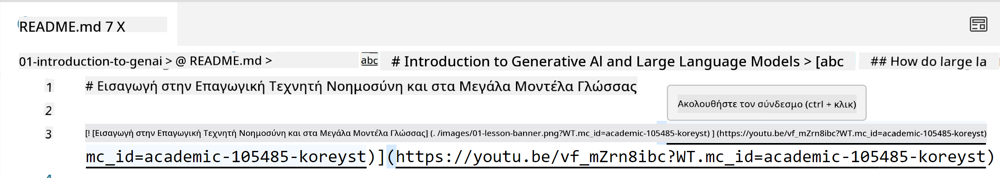
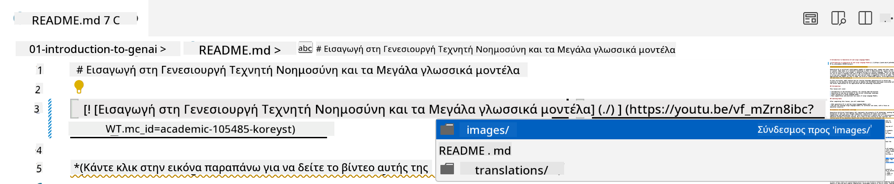
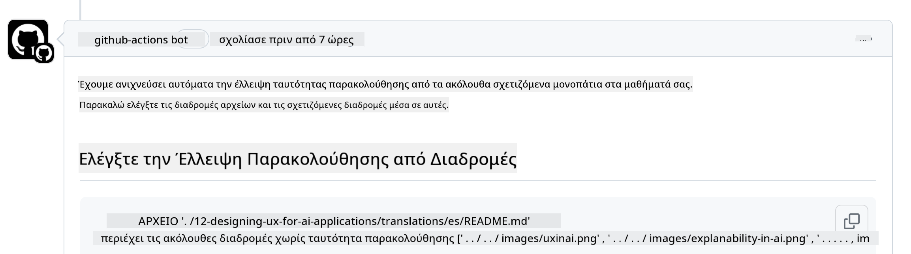
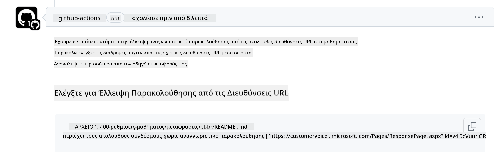
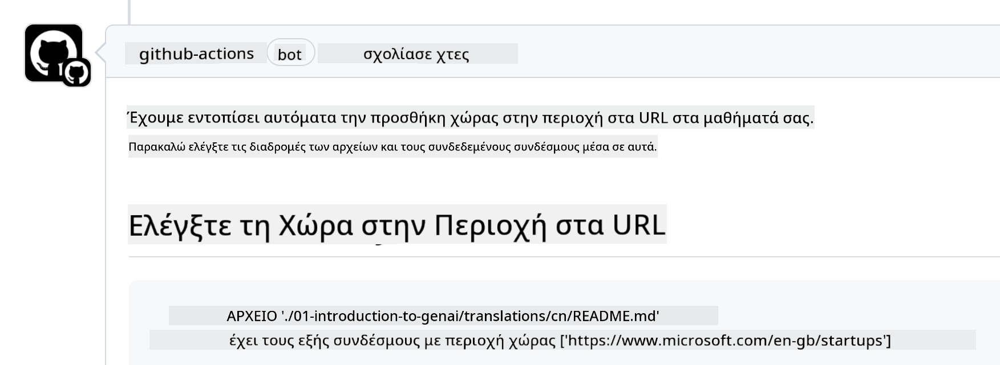

<!--
CO_OP_TRANSLATOR_METADATA:
{
  "original_hash": "57c41f2af71001a2cff9d8eb797cb843",
  "translation_date": "2025-06-25T07:10:41+00:00",
  "source_file": "CONTRIBUTING.md",
  "language_code": "el"
}
-->
# Συμμετοχή

Αυτό το έργο καλωσορίζει τις συνεισφορές και τις προτάσεις. Οι περισσότερες συνεισφορές απαιτούν να συμφωνήσετε με μια Συμφωνία Άδειας Χρήσης Συνεισφοράς (CLA) δηλώνοντας ότι έχετε το δικαίωμα να μας παραχωρήσετε τα δικαιώματα χρήσης της συνεισφοράς σας. Για λεπτομέρειες, επισκεφθείτε το <https://cla.microsoft.com>.

> Σημαντικό: όταν μεταφράζετε κείμενο σε αυτό το αποθετήριο, παρακαλώ βεβαιωθείτε ότι δεν χρησιμοποιείτε μηχανική μετάφραση. Θα επαληθεύσουμε τις μεταφράσεις μέσω της κοινότητας, οπότε παρακαλώ προσφερθείτε μόνο για μεταφράσεις σε γλώσσες στις οποίες είστε επαρκείς.

Όταν υποβάλλετε ένα αίτημα pull, ένα CLA-bot θα καθορίσει αυτόματα αν χρειάζεται να παρέχετε ένα CLA και θα διακοσμήσει το PR κατάλληλα (π.χ., ετικέτα, σχόλιο). Απλά ακολουθήστε τις οδηγίες που παρέχονται από το bot. Θα χρειαστεί να το κάνετε μόνο μία φορά σε όλα τα αποθετήρια που χρησιμοποιούν το CLA μας.

## Κώδικας Συμπεριφοράς

Αυτό το έργο έχει υιοθετήσει τον [Κώδικα Συμπεριφοράς Ανοιχτού Κώδικα της Microsoft](https://opensource.microsoft.com/codeofconduct/?WT.mc_id=academic-105485-koreyst).
Για περισσότερες πληροφορίες διαβάστε τις [Συχνές Ερωτήσεις για τον Κώδικα Συμπεριφοράς](https://opensource.microsoft.com/codeofconduct/faq/?WT.mc_id=academic-105485-koreyst) ή επικοινωνήστε με το [opencode@microsoft.com](mailto:opencode@microsoft.com) για τυχόν επιπλέον ερωτήσεις ή σχόλια.

## Ερώτηση ή Πρόβλημα;

Παρακαλώ μην ανοίγετε θέματα στο GitHub για γενικές ερωτήσεις υποστήριξης καθώς η λίστα του GitHub θα πρέπει να χρησιμοποιείται για αιτήματα χαρακτηριστικών και αναφορές σφαλμάτων. Με αυτόν τον τρόπο μπορούμε πιο εύκολα να παρακολουθήσουμε πραγματικά ζητήματα ή σφάλματα από τον κώδικα και να κρατήσουμε τη γενική συζήτηση ξεχωριστά από τον πραγματικό κώδικα.

## Λάθη, Ζητήματα, Σφάλματα και Συνεισφορές

Όποτε υποβάλλετε οποιεσδήποτε αλλαγές στο αποθετήριο Generative AI for Beginners, παρακαλώ ακολουθήστε αυτές τις συστάσεις.

* Πάντα κάντε fork το αποθετήριο στον δικό σας λογαριασμό πριν κάνετε τις τροποποιήσεις σας
* Μην συνδυάζετε πολλαπλές αλλαγές σε ένα αίτημα pull. Για παράδειγμα, υποβάλετε οποιοδήποτε διορθωτικό σφάλμα και ενημερώσεις τεκμηρίωσης χρησιμοποιώντας ξεχωριστά PRs
* Αν το αίτημα pull σας δείχνει συγκρούσεις συγχώνευσης, βεβαιωθείτε ότι ενημερώνετε το τοπικό main για να είναι καθρέφτης του τι υπάρχει στο κύριο αποθετήριο πριν κάνετε τις τροποποιήσεις σας
* Αν υποβάλλετε μια μετάφραση, παρακαλώ δημιουργήστε ένα PR για όλα τα αρχεία που μεταφράστηκαν καθώς δεν δεχόμαστε μερικές μεταφράσεις για το περιεχόμενο
* Αν υποβάλλετε ένα λάθος ή διόρθωση τεκμηρίωσης, μπορείτε να συνδυάσετε τροποποιήσεις σε ένα μόνο PR όπου είναι κατάλληλο

## Γενικές Κατευθύνσεις για Γραφή

- Βεβαιωθείτε ότι όλες οι διευθύνσεις URL σας είναι τυλιγμένες σε αγκύλες ακολουθούμενες από παρένθεση χωρίς επιπλέον κενά γύρω τους ή μέσα τους ``.
- Βεβαιωθείτε ότι οποιοσδήποτε σχετικός σύνδεσμος (δηλ. σύνδεσμοι σε άλλα αρχεία και φακέλους στο αποθετήριο) ξεκινά με `./` αναφερόμενος σε ένα αρχείο ή φάκελο που βρίσκεται στον τρέχοντα κατάλογο εργασίας ή `../` αναφερόμενος σε ένα αρχείο ή φάκελο που βρίσκεται σε έναν γονικό κατάλογο εργασίας.
- Βεβαιωθείτε ότι οποιοσδήποτε σχετικός σύνδεσμος (δηλ. σύνδεσμοι σε άλλα αρχεία και φακέλους στο αποθετήριο) έχει ένα αναγνωριστικό παρακολούθησης (δηλ. `?` ή `&` και στη συνέχεια `wt.mc_id=` ή `WT.mc_id=`) στο τέλος του.
- Βεβαιωθείτε ότι οποιαδήποτε διεύθυνση URL από τους ακόλουθους τομείς _github.com, microsoft.com, visualstudio.com, aka.ms, και azure.com_ έχει ένα αναγνωριστικό παρακολούθησης (δηλ. `?` ή `&` και στη συνέχεια `wt.mc_id=` ή `WT.mc_id=`) στο τέλος της.
- Βεβαιωθείτε ότι οι σύνδεσμοι σας δεν έχουν συγκεκριμένο τοπικότητα χώρας μέσα τους (δηλ. `/en-us/` ή `/en/`).
- Βεβαιωθείτε ότι όλες οι εικόνες είναι αποθηκευμένες στο φάκελο `./images`.
- Βεβαιωθείτε ότι οι εικόνες έχουν περιγραφικά ονόματα χρησιμοποιώντας αγγλικούς χαρακτήρες, αριθμούς και παύλες στο όνομα της εικόνας σας.

## Ροές Εργασίας GitHub

Όταν υποβάλλετε ένα αίτημα pull, τέσσερις διαφορετικές ροές εργασίας θα ενεργοποιηθούν για να επικυρώσουν τους προηγούμενους κανόνες.
Απλά ακολουθήστε τις οδηγίες που παρατίθενται εδώ για να περάσετε τους ελέγχους ροής εργασίας.

- [Έλεγχος Σπασμένων Σχετικών Διαδρομών](../..)
- [Έλεγχος Διαδρομών με Παρακολούθηση](../..)
- [Έλεγχος URLs με Παρακολούθηση](../..)
- [Έλεγχος URLs Χωρίς Τοπικότητα](../..)

### Έλεγχος Σπασμένων Σχετικών Διαδρομών

Αυτή η ροή εργασίας εξασφαλίζει ότι οποιαδήποτε σχετική διαδρομή στα αρχεία σας λειτουργεί.
Αυτό το αποθετήριο αναπτύσσεται σε σελίδες GitHub, οπότε πρέπει να είστε πολύ προσεκτικοί όταν πληκτρολογείτε τους συνδέσμους που συνδέουν τα πάντα για να μην κατευθύνετε κανέναν σε λάθος μέρος.

Για να βεβαιωθείτε ότι οι σύνδεσμοι σας λειτουργούν σωστά απλά χρησιμοποιήστε το VS code για να ελέγξετε αυτό.

Για παράδειγμα, όταν περνάτε το ποντίκι σας πάνω από οποιονδήποτε σύνδεσμο στα αρχεία σας θα σας ζητηθεί να ακολουθήσετε τον σύνδεσμο πατώντας **ctrl + click**

Αν κάνετε κλικ σε έναν σύνδεσμο και δεν λειτουργεί τοπικά, τότε σίγουρα θα ενεργοποιήσει τη ροή εργασίας και δεν θα λειτουργήσει στο GitHub.

Για να διορθώσετε αυτό το ζήτημα, προσπαθήστε να πληκτρολογήσετε τον σύνδεσμο με τη βοήθεια του VS code.

Όταν πληκτρολογείτε `./` ή `../` το VS code θα σας προτρέπει να επιλέξετε από τις διαθέσιμες επιλογές σύμφωνα με αυτό που πληκτρολογήσατε.

Ακολουθήστε τη διαδρομή κάνοντας κλικ στο επιθυμητό αρχείο ή φάκελο και θα είστε σίγουροι ότι η διαδρομή σας δεν είναι σπασμένη.

Μόλις προσθέσετε τη σωστή σχετική διαδρομή, αποθηκεύστε και σπρώξτε τις αλλαγές σας η ροή εργασίας θα ενεργοποιηθεί ξανά για να επαληθεύσει τις αλλαγές σας.
Αν περάσετε τον έλεγχο τότε είστε έτοιμοι.

### Έλεγχος Διαδρομών με Παρακολούθηση

Αυτή η ροή εργασίας εξασφαλίζει ότι οποιαδήποτε σχετική διαδρομή έχει παρακολούθηση μέσα της.
Αυτό το αποθετήριο αναπτύσσεται σε σελίδες GitHub, οπότε πρέπει να παρακολουθούμε την κίνηση μεταξύ των διαφορετικών αρχείων και φακέλων.

Για να βεβαιωθείτε ότι οι σχετικές διαδρομές σας έχουν παρακολούθηση μέσα τους απλά ελέγξτε για το ακόλουθο κείμενο `?wt.mc_id=` στο τέλος της διαδρομής.
Αν είναι προσκολλημένο στις σχετικές διαδρομές σας τότε θα περάσετε αυτόν τον έλεγχο.

Αν όχι, μπορεί να λάβετε το ακόλουθο σφάλμα.

Για να διορθώσετε αυτό το ζήτημα, προσπαθήστε να ανοίξετε τη διαδρομή αρχείου που η ροή εργασίας επισήμανε και προσθέστε το αναγνωριστικό παρακολούθησης στο τέλος των σχετικών διαδρομών.

Μόλις προσθέσετε το αναγνωριστικό παρακολούθησης, αποθηκεύστε και σπρώξτε τις αλλαγές σας η ροή εργασίας θα ενεργοποιηθεί ξανά για να επαληθεύσει τις αλλαγές σας.
Αν περάσετε τον έλεγχο τότε είστε έτοιμοι.

### Έλεγχος URLs με Παρακολούθηση

Αυτή η ροή εργασίας εξασφαλίζει ότι οποιαδήποτε διεύθυνση URL ιστού έχει παρακολούθηση μέσα της.
Αυτό το αποθετήριο είναι διαθέσιμο σε όλους, οπότε πρέπει να βεβαιωθείτε ότι παρακολουθείτε την πρόσβαση για να γνωρίζετε από πού προέρχεται η κίνηση.

Για να βεβαιωθείτε ότι οι διευθύνσεις URL σας έχουν παρακολούθηση μέσα τους απλά ελέγξτε για το ακόλουθο κείμενο `?wt.mc_id=` στο τέλος της διεύθυνσης URL.
Αν είναι προσκολλημένο στις διευθύνσεις URL σας τότε θα περάσετε αυτόν τον έλεγχο.

Αν όχι, μπορεί να λάβετε το ακόλουθο σφάλμα.

Για να διορθώσετε αυτό το ζήτημα, προσπαθήστε να ανοίξετε τη διαδρομή αρχείου που η ροή εργασίας επισήμανε και προσθέστε το αναγνωριστικό παρακολούθησης στο τέλος των διευθύνσεων URL.

Μόλις προσθέσετε το αναγνωριστικό παρακολούθησης, αποθηκεύστε και σπρώξτε τις αλλαγές σας η ροή εργασίας θα ενεργοποιηθεί ξανά για να επαληθεύσει τις αλλαγές σας.
Αν περάσετε τον έλεγχο τότε είστε έτοιμοι.

### Έλεγχος URLs Χωρίς Τοπικότητα

Αυτή η ροή εργασίας εξασφαλίζει ότι οποιαδήποτε διεύθυνση URL ιστού δεν έχει συγκεκριμένη τοπικότητα χώρας μέσα της.
Αυτό το αποθετήριο είναι διαθέσιμο σε όλους σε όλο τον κόσμο, οπότε πρέπει να βεβαιωθείτε ότι δεν περιλαμβάνετε την τοπικότητα της χώρας σας στις διευθύνσεις URL.

Για να βεβαιωθείτε ότι οι διευθύνσεις URL σας δεν έχουν τοπικότητα χώρας μέσα τους απλά ελέγξτε για το ακόλουθο κείμενο `/en-us/` ή `/en/` ή οποιαδήποτε άλλη γλωσσική τοπικότητα οπουδήποτε στη διεύθυνση URL.
Αν δεν υπάρχει στις διευθύνσεις URL σας τότε θα περάσετε αυτόν τον έλεγχο.

Αν όχι, μπορεί να λάβετε το ακόλουθο σφάλμα.

Για να διορθώσετε αυτό το ζήτημα, προσπαθήστε να ανοίξετε τη διαδρομή αρχείου που η ροή εργασίας επισήμανε και αφαιρέστε την τοπικότητα χώρας από τις διευθύνσεις URL.

Μόλις αφαιρέσετε την τοπικότητα χώρας, αποθηκεύστε και σπρώξτε τις αλλαγές σας η ροή εργασίας θα ενεργοποιηθεί ξανά για να επαληθεύσει τις αλλαγές σας.
Αν περάσετε τον έλεγχο τότε είστε έτοιμοι.

Συγχαρητήρια! Θα επικοινωνήσουμε μαζί σας το συντομότερο δυνατό με σχόλια σχετικά με τη συνεισφορά σας.

**Αποποίηση ευθύνης**:  
Αυτό το έγγραφο έχει μεταφραστεί χρησιμοποιώντας την υπηρεσία αυτόματης μετάφρασης AI [Co-op Translator](https://github.com/Azure/co-op-translator). Παρόλο που καταβάλλουμε κάθε προσπάθεια για ακρίβεια, παρακαλούμε να γνωρίζετε ότι οι αυτόματες μεταφράσεις ενδέχεται να περιέχουν λάθη ή ανακρίβειες. Το πρωτότυπο έγγραφο στη μητρική του γλώσσα πρέπει να θεωρείται η αυθεντική πηγή. Για κρίσιμες πληροφορίες, συνιστάται επαγγελματική ανθρώπινη μετάφραση. Δεν φέρουμε ευθύνη για τυχόν παρανοήσεις ή παρερμηνείες που προκύπτουν από τη χρήση αυτής της μετάφρασης.