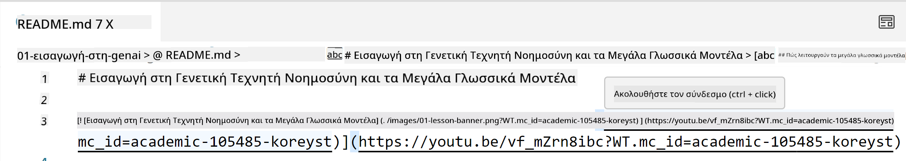
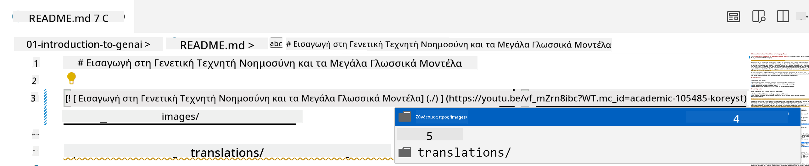
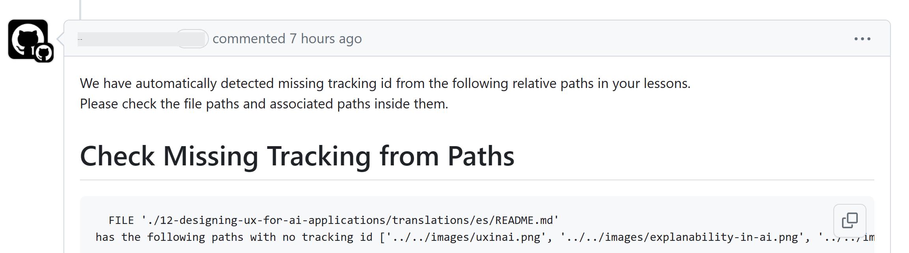
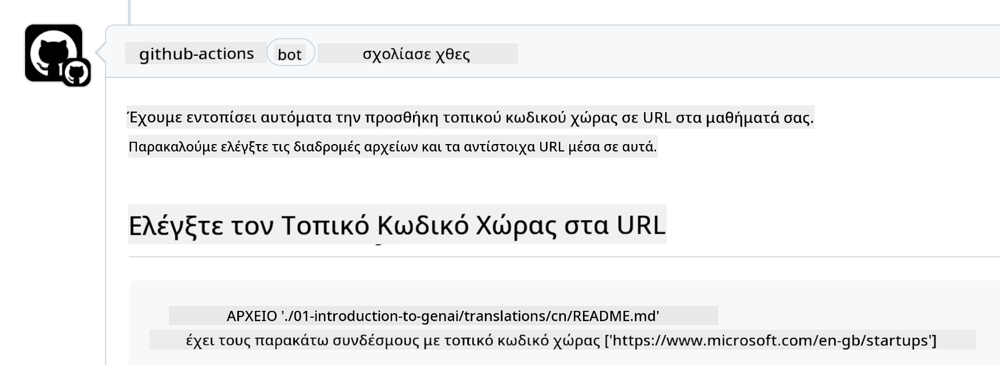

<!--
CO_OP_TRANSLATOR_METADATA:
{
  "original_hash": "57c41f2af71001a2cff9d8eb797cb843",
  "translation_date": "2025-07-09T06:06:58+00:00",
  "source_file": "CONTRIBUTING.md",
  "language_code": "el"
}
-->
# Συμβολή

Αυτό το έργο καλωσορίζει τις συνεισφορές και τις προτάσεις. Οι περισσότερες συνεισφορές απαιτούν να συμφωνήσετε με μια Συμφωνία Άδειας Συμβολής (CLA) που δηλώνει ότι έχετε το δικαίωμα, και πράγματι παραχωρείτε σε εμάς τα δικαιώματα να χρησιμοποιήσουμε τη συνεισφορά σας. Για λεπτομέρειες, επισκεφθείτε το <https://cla.microsoft.com>.

> Σημαντικό: όταν μεταφράζετε κείμενο σε αυτό το αποθετήριο, παρακαλούμε βεβαιωθείτε ότι δεν χρησιμοποιείτε μηχανική μετάφραση. Θα επαληθεύσουμε τις μεταφράσεις μέσω της κοινότητας, οπότε παρακαλούμε να αναλαμβάνετε μεταφράσεις μόνο σε γλώσσες που γνωρίζετε καλά.

Όταν υποβάλλετε ένα pull request, ένα CLA-bot θα καθορίσει αυτόματα αν χρειάζεται να παρέχετε CLA και θα διακοσμήσει το PR ανάλογα (π.χ., ετικέτα, σχόλιο). Απλώς ακολουθήστε τις οδηγίες που παρέχει το bot. Θα χρειαστεί να το κάνετε μόνο μία φορά σε όλα τα αποθετήρια που χρησιμοποιούν το CLA μας.

## Κώδικας Συμπεριφοράς

Αυτό το έργο έχει υιοθετήσει τον [Κώδικα Συμπεριφοράς Ανοιχτού Κώδικα της Microsoft](https://opensource.microsoft.com/codeofconduct/?WT.mc_id=academic-105485-koreyst).  
Για περισσότερες πληροφορίες διαβάστε τις [Συχνές Ερωτήσεις για τον Κώδικα Συμπεριφοράς](https://opensource.microsoft.com/codeofconduct/faq/?WT.mc_id=academic-105485-koreyst) ή επικοινωνήστε στο [opencode@microsoft.com](mailto:opencode@microsoft.com) για επιπλέον ερωτήσεις ή σχόλια.

## Ερώτηση ή Πρόβλημα;

Παρακαλούμε μην ανοίγετε θέματα στο GitHub για γενικές ερωτήσεις υποστήριξης, καθώς η λίστα του GitHub προορίζεται για αιτήματα χαρακτηριστικών και αναφορές σφαλμάτων. Με αυτόν τον τρόπο μπορούμε πιο εύκολα να παρακολουθούμε πραγματικά ζητήματα ή σφάλματα στον κώδικα και να κρατάμε τη γενική συζήτηση ξεχωριστά από τον ίδιο τον κώδικα.

## Ορθογραφικά λάθη, ζητήματα, σφάλματα και συνεισφορές

Κάθε φορά που υποβάλλετε αλλαγές στο αποθετήριο Generative AI for Beginners, παρακαλούμε ακολουθήστε τις παρακάτω συστάσεις.

* Πάντα να κάνετε fork το αποθετήριο στον δικό σας λογαριασμό πριν κάνετε τις τροποποιήσεις σας  
* Μην συνδυάζετε πολλαπλές αλλαγές σε ένα pull request. Για παράδειγμα, υποβάλετε επιδιορθώσεις σφαλμάτων και ενημερώσεις τεκμηρίωσης σε ξεχωριστά PR  
* Αν το pull request σας εμφανίζει συγκρούσεις συγχώνευσης, βεβαιωθείτε ότι έχετε ενημερώσει το τοπικό main ώστε να είναι καθρέφτης του main αποθετηρίου πριν κάνετε τις τροποποιήσεις  
* Αν υποβάλλετε μετάφραση, παρακαλούμε δημιουργήστε ένα PR για όλα τα μεταφρασμένα αρχεία, καθώς δεν δεχόμαστε μερικές μεταφράσεις του περιεχομένου  
* Αν υποβάλλετε διόρθωση ορθογραφικού λάθους ή τεκμηρίωσης, μπορείτε να συνδυάσετε τροποποιήσεις σε ένα PR όπου είναι κατάλληλο

## Γενικές Οδηγίες για τη συγγραφή

- Βεβαιωθείτε ότι όλες οι διευθύνσεις URL είναι περικλεισμένες σε αγκύλες ακολουθούμενες από παρενθέσεις χωρίς επιπλέον κενά γύρω ή μέσα τους ``.  
- Βεβαιωθείτε ότι οποιοσδήποτε σχετικός σύνδεσμος (δηλαδή σύνδεσμοι σε άλλα αρχεία και φακέλους στο αποθετήριο) ξεκινά με `./` που αναφέρεται σε αρχείο ή φάκελο στον τρέχοντα φάκελο εργασίας ή με `../` που αναφέρεται σε αρχείο ή φάκελο σε γονικό φάκελο εργασίας.  
- Βεβαιωθείτε ότι οποιοσδήποτε σχετικός σύνδεσμος έχει στο τέλος του αναγνωριστικό παρακολούθησης (δηλαδή `?` ή `&` και μετά `wt.mc_id=` ή `WT.mc_id=`).  
- Βεβαιωθείτε ότι οποιαδήποτε διεύθυνση URL από τους ακόλουθους τομείς _github.com, microsoft.com, visualstudio.com, aka.ms, και azure.com_ έχει στο τέλος της αναγνωριστικό παρακολούθησης (δηλαδή `?` ή `&` και μετά `wt.mc_id=` ή `WT.mc_id=`).  
- Βεβαιωθείτε ότι οι σύνδεσμοί σας δεν περιέχουν τοπική ρύθμιση χώρας (π.χ. `/en-us/` ή `/en/`).  
- Βεβαιωθείτε ότι όλες οι εικόνες αποθηκεύονται στον φάκελο `./images`.  
- Βεβαιωθείτε ότι οι εικόνες έχουν περιγραφικά ονόματα χρησιμοποιώντας αγγλικούς χαρακτήρες, αριθμούς και παύλες στο όνομα της εικόνας.

## GitHub Workflows

Όταν υποβάλλετε ένα pull request, θα ενεργοποιηθούν τέσσερα διαφορετικά workflows για να επαληθεύσουν τους παραπάνω κανόνες.  
Απλώς ακολουθήστε τις οδηγίες που αναφέρονται εδώ για να περάσετε τους ελέγχους των workflows.

- [Έλεγχος Σπασμένων Σχετικών Διαδρομών](../..)  
- [Έλεγχος Διαδρομών με Παρακολούθηση](../..)  
- [Έλεγχος URL με Παρακολούθηση](../..)  
- [Έλεγχος URL χωρίς Τοπική Ρύθμιση](../..)

### Έλεγχος Σπασμένων Σχετικών Διαδρομών

Αυτό το workflow διασφαλίζει ότι οποιαδήποτε σχετική διαδρομή στα αρχεία σας λειτουργεί σωστά.  
Αυτό το αποθετήριο αναπτύσσεται σε GitHub pages, οπότε πρέπει να είστε πολύ προσεκτικοί όταν πληκτρολογείτε τους συνδέσμους που συνδέουν τα πάντα, ώστε να μην κατευθύνουν κανέναν σε λάθος μέρος.

Για να βεβαιωθείτε ότι οι σύνδεσμοι σας λειτουργούν σωστά, απλώς χρησιμοποιήστε το VS code για να το ελέγξετε.

Για παράδειγμα, όταν τοποθετείτε τον κέρσορα πάνω από οποιονδήποτε σύνδεσμο στα αρχεία σας, θα σας προταθεί να ακολουθήσετε τον σύνδεσμο πατώντας **ctrl + κλικ**

Αν κάνετε κλικ σε έναν σύνδεσμο και δεν λειτουργεί τοπικά, τότε σίγουρα θα ενεργοποιήσει το workflow και δεν θα λειτουργήσει στο GitHub.

Για να διορθώσετε αυτό το πρόβλημα, προσπαθήστε να πληκτρολογήσετε τον σύνδεσμο με τη βοήθεια του VS code.

Όταν πληκτρολογείτε `./` ή `../`, το VS code θα σας προτείνει επιλογές σύμφωνα με ό,τι πληκτρολογήσατε.

Ακολουθήστε τη διαδρομή κάνοντας κλικ στο επιθυμητό αρχείο ή φάκελο και θα είστε σίγουροι ότι η διαδρομή σας δεν είναι σπασμένη.

Μόλις προσθέσετε τη σωστή σχετική διαδρομή, αποθηκεύστε και στείλτε τις αλλαγές σας και το workflow θα ενεργοποιηθεί ξανά για να επαληθεύσει τις αλλαγές σας.  
Αν περάσετε τον έλεγχο, είστε έτοιμοι.

### Έλεγχος Διαδρομών με Παρακολούθηση

Αυτό το workflow διασφαλίζει ότι οποιαδήποτε σχετική διαδρομή έχει παρακολούθηση.  
Αυτό το αποθετήριο αναπτύσσεται σε GitHub pages, οπότε πρέπει να παρακολουθούμε την κίνηση μεταξύ των διαφορετικών αρχείων και φακέλων.

Για να βεβαιωθείτε ότι οι σχετικές διαδρομές σας έχουν παρακολούθηση, απλώς ελέγξτε αν στο τέλος της διαδρομής υπάρχει το κείμενο `?wt.mc_id=`.  
Αν είναι προστιθέμενο στις σχετικές διαδρομές σας, τότε θα περάσετε τον έλεγχο.

Αν όχι, μπορεί να λάβετε το παρακάτω σφάλμα.

Για να διορθώσετε αυτό το πρόβλημα, ανοίξτε τη διαδρομή αρχείου που επισημάνθηκε από το workflow και προσθέστε το αναγνωριστικό παρακολούθησης στο τέλος των σχετικών διαδρομών.

Μόλις προσθέσετε το αναγνωριστικό παρακολούθησης, αποθηκεύστε και στείλτε τις αλλαγές σας και το workflow θα ενεργοποιηθεί ξανά για να επαληθεύσει τις αλλαγές σας.  
Αν περάσετε τον έλεγχο, είστε έτοιμοι.

### Έλεγχος URL με Παρακολούθηση

Αυτό το workflow διασφαλίζει ότι οποιαδήποτε διεύθυνση URL έχει παρακολούθηση.  
Αυτό το αποθετήριο είναι διαθέσιμο σε όλους, οπότε πρέπει να βεβαιωθείτε ότι παρακολουθείτε την πρόσβαση για να γνωρίζετε από πού προέρχεται η κίνηση.

Για να βεβαιωθείτε ότι οι διευθύνσεις URL σας έχουν παρακολούθηση, απλώς ελέγξτε αν στο τέλος της διεύθυνσης υπάρχει το κείμενο `?wt.mc_id=`.  
Αν είναι προστιθέμενο στις διευθύνσεις URL σας, τότε θα περάσετε τον έλεγχο.

Αν όχι, μπορεί να λάβετε το παρακάτω σφάλμα.

Για να διορθώσετε αυτό το πρόβλημα, ανοίξτε τη διαδρομή αρχείου που επισημάνθηκε από το workflow και προσθέστε το αναγνωριστικό παρακολούθησης στο τέλος των διευθύνσεων URL.

Μόλις προσθέσετε το αναγνωριστικό παρακολούθησης, αποθηκεύστε και στείλτε τις αλλαγές σας και το workflow θα ενεργοποιηθεί ξανά για να επαληθεύσει τις αλλαγές σας.  
Αν περάσετε τον έλεγχο, είστε έτοιμοι.

### Έλεγχος URL χωρίς Τοπική Ρύθμιση

Αυτό το workflow διασφαλίζει ότι καμία διεύθυνση URL δεν περιέχει τοπική ρύθμιση χώρας.  
Αυτό το αποθετήριο είναι διαθέσιμο σε όλους παγκοσμίως, οπότε πρέπει να βεβαιωθείτε ότι δεν περιλαμβάνετε την τοπική ρύθμιση της χώρας σας στις διευθύνσεις URL.

Για να βεβαιωθείτε ότι οι διευθύνσεις URL σας δεν έχουν τοπική ρύθμιση χώρας, απλώς ελέγξτε αν υπάρχει το κείμενο `/en-us/` ή `/en/` ή οποιαδήποτε άλλη γλωσσική ρύθμιση οπουδήποτε στη διεύθυνση URL.  
Αν δεν υπάρχει στις διευθύνσεις URL σας, τότε θα περάσετε τον έλεγχο.

Αν όχι, μπορεί να λάβετε το παρακάτω σφάλμα.

Για να διορθώσετε αυτό το πρόβλημα, ανοίξτε τη διαδρομή αρχείου που επισημάνθηκε από το workflow και αφαιρέστε την τοπική ρύθμιση χώρας από τις διευθύνσεις URL.

Μόλις αφαιρέσετε την τοπική ρύθμιση χώρας, αποθηκεύστε και στείλτε τις αλλαγές σας και το workflow θα ενεργοποιηθεί ξανά για να επαληθεύσει τις αλλαγές σας.  
Αν περάσετε τον έλεγχο, είστε έτοιμοι.

Συγχαρητήρια! Θα επικοινωνήσουμε μαζί σας το συντομότερο δυνατό με σχόλια για τη συνεισφορά σας.

**Αποποίηση ευθυνών**:  
Αυτό το έγγραφο έχει μεταφραστεί χρησιμοποιώντας την υπηρεσία αυτόματης μετάφρασης AI [Co-op Translator](https://github.com/Azure/co-op-translator). Παρόλο που επιδιώκουμε την ακρίβεια, παρακαλούμε να γνωρίζετε ότι οι αυτόματες μεταφράσεις ενδέχεται να περιέχουν λάθη ή ανακρίβειες. Το πρωτότυπο έγγραφο στη γλώσσα του θεωρείται η αυθεντική πηγή. Για κρίσιμες πληροφορίες, συνιστάται επαγγελματική ανθρώπινη μετάφραση. Δεν φέρουμε ευθύνη για τυχόν παρεξηγήσεις ή λανθασμένες ερμηνείες που προκύπτουν από τη χρήση αυτής της μετάφρασης.