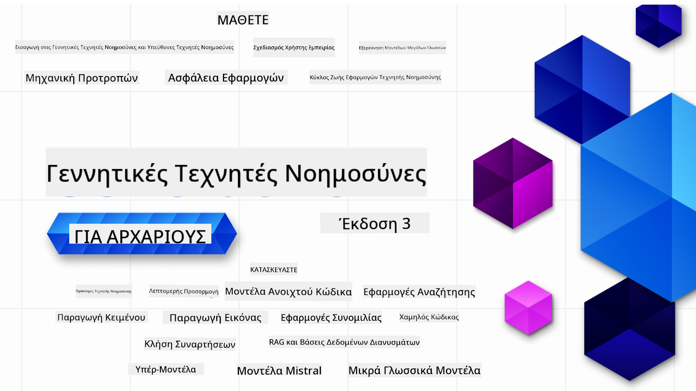

<!--
CO_OP_TRANSLATOR_METADATA:
{
  "original_hash": "c2ee25895ebbfa1a52868bb6eab686fc",
  "translation_date": "2025-05-19T11:43:42+00:00",
  "source_file": "README.md",
  "language_code": "el"
}
-->

### 21 Μαθήματα που διδάσκουν ό,τι χρειάζεστε για να ξεκινήσετε να δημιουργείτε εφαρμογές Δημιουργικής AI

### 🌐 Υποστήριξη Πολλών Γλωσσών

#### Υποστηρίζεται μέσω GitHub Action (Αυτοματοποιημένο & Πάντα Ενημερωμένο)
[Γαλλικά](../fr/README.md) | [Ισπανικά](../es/README.md) | [Γερμανικά](../de/README.md) | [Ρωσικά](../ru/README.md) | [Αραβικά](../ar/README.md) | [Περσικά (Φαρσί)](../fa/README.md) | [Ουρντού](../ur/README.md) | [Κινέζικα (Απλοποιημένα)](../zh/README.md) | [Κινέζικα (Παραδοσιακά, Μακάο)](../mo/README.md) | [Κινέζικα (Παραδοσιακά, Χονγκ Κονγκ)](../hk/README.md) | [Κινέζικα (Παραδοσιακά, Ταϊβάν)](../tw/README.md) | [Ιαπωνικά](../ja/README.md) | [Κορεατικά](../ko/README.md) | [Χίντι](../hi/README.md) | [Βεγγαλικά](../bn/README.md) | [Μαραθικά](../mr/README.md) | [Νεπαλικά](../ne/README.md) | [Παντζάμπι (Γκουρμουκί)](../pa/README.md) | [Πορτογαλικά (Πορτογαλία)](../pt/README.md) | [Πορτογαλικά (Βραζιλία)](../br/README.md) | [Ιταλικά](../it/README.md) | [Πολωνικά](../pl/README.md) | [Τουρκικά](../tr/README.md) | [Ελληνικά](./README.md) | [Ταϊλανδικά](../th/README.md) | [Σουηδικά](../sv/README.md) | [Δανικά](../da/README.md) | [Νορβηγικά](../no/README.md) | [Φινλανδικά](../fi/README.md) | [Ολλανδικά](../nl/README.md) | [Εβραϊκά](../he/README.md) | [Βιετναμέζικα](../vi/README.md) | [Ινδονησιακά](../id/README.md) | [Μαλαϊκά](../ms/README.md) | [Ταγκάλογκ (Φιλιππινέζικα)](../tl/README.md) | [Σουαχίλι](../sw/README.md) | [Ουγγρικά](../hu/README.md) | [Τσεχικά](../cs/README.md) | [Σλοβακικά](../sk/README.md) | [Ρουμανικά](../ro/README.md) | [Βουλγαρικά](../bg/README.md) | [Σερβικά (Κυριλλικά)](../sr/README.md) | [Κροατικά](../hr/README.md) | [Σλοβενικά](../sl/README.md)
# Γενετική Τεχνητή Νοημοσύνη για Αρχάριους (Έκδοση 3) - Ένα Μάθημα

Μάθετε τα βασικά για τη δημιουργία εφαρμογών Γενετικής Τεχνητής Νοημοσύνης με το ολοκληρωμένο μάθημα 21 μαθημάτων από τους Microsoft Cloud Advocates.

## 🌱 Ξεκινώντας

Αυτό το μάθημα περιλαμβάνει 21 μαθήματα. Κάθε μάθημα καλύπτει το δικό του θέμα, οπότε μπορείτε να ξεκινήσετε από όπου θέλετε!

Τα μαθήματα είναι κατηγοριοποιημένα ως μαθήματα "Μάθησης" που εξηγούν μια έννοια της Γενετικής Τεχνητής Νοημοσύνης ή ως μαθήματα "Κατασκευής" που εξηγούν μια έννοια και παρέχουν παραδείγματα κώδικα σε **Python** και **TypeScript** όταν είναι δυνατόν.

Για προγραμματιστές .NET, δείτε το [Γενετική Τεχνητή Νοημοσύνη για Αρχάριους (.NET Έκδοση)](https://github.com/microsoft/Generative-AI-for-beginners-dotnet?WT.mc_id=academic-105485-koreyst)!

Κάθε μάθημα περιλαμβάνει επίσης μια ενότητα "Συνεχίστε να μαθαίνετε" με επιπλέον εργαλεία μάθησης.

## Τι Χρειάζεστε
### Για να εκτελέσετε τον κώδικα αυτού του μαθήματος, μπορείτε να χρησιμοποιήσετε είτε:
- [Υπηρεσία Azure OpenAI](https://aka.ms/genai-beginners/azure-open-ai?WT.mc_id=academic-105485-koreyst) - **Μαθήματα:** "aoai-assignment"
- [Κατάλογος Μοντέλων GitHub Marketplace](https://aka.ms/genai-beginners/gh-models?WT.mc_id=academic-105485-koreyst) - **Μαθήματα:** "githubmodels"
- [OpenAI API](https://aka.ms/genai-beginners/open-ai?WT.mc_id=academic-105485-koreyst) - **Μαθήματα:** "oai-assignment"

- Βασικές γνώσεις Python ή TypeScript είναι χρήσιμες - \*Για απόλυτους αρχάριους, δείτε αυτά τα μαθήματα [Python](https://aka.ms/genai-beginners/python?WT.mc_id=academic-105485-koreyst) και [TypeScript](https://aka.ms/genai-beginners/typescript?WT.mc_id=academic-105485-koreyst)
- Ένας λογαριασμός GitHub για να [κλωνοποιήσετε αυτό το αποθετήριο](https://aka.ms/genai-beginners/github?WT.mc_id=academic-105485-koreyst) στον δικό σας λογαριασμό GitHub

Έχουμε δημιουργήσει ένα μάθημα **[Ρύθμιση Μαθήματος](./00-course-setup/README.md?WT.mc_id=academic-105485-koreyst)** για να σας βοηθήσουμε να ρυθμίσετε το περιβάλλον ανάπτυξής σας.

Μην ξεχάσετε να [προσθέσετε αστέρι (🌟) σε αυτό το αποθετήριο](https://docs.github.com/en/get-started/exploring-projects-on-github/saving-repositories-with-stars?WT.mc_id=academic-105485-koreyst) για να το βρείτε πιο εύκολα αργότερα.

## 🧠 Έτοιμοι για Ανάπτυξη;

Αν ψάχνετε για πιο προηγμένα δείγματα κώδικα, δείτε τη [συλλογή μας από Δείγματα Κώδικα Γενετικής Τεχνητής Νοημοσύνης](https://aka.ms/genai-beg-code?WT.mc_id=academic-105485-koreyst) σε **Python** και **TypeScript**.

## 🗣️ Γνωρίστε Άλλους Μαθητές, Αποκτήστε Υποστήριξη

Γίνετε μέλος του [επίσημου διακομιστή Discord Azure AI Foundry](https://aka.ms/genai-discord?WT.mc_id=academic-105485-koreyst) για να γνωρίσετε και να δικτυωθείτε με άλλους μαθητές που παρακολουθούν αυτό το μάθημα και να λάβετε υποστήριξη.

Κάντε ερωτήσεις ή μοιραστείτε σχόλια προϊόντων στο [Azure AI Foundry Developer Forum](https://aka.ms/azureaifoundry/forum) στο Github.

## 🚀 Δημιουργείτε μια Startup;

Εγγραφείτε στο [Microsoft for Startups Founders Hub](https://aka.ms/genai-foundershub?WT.mc_id=academic-105485-koreyst) για να λάβετε **δωρεάν πιστώσεις OpenAI** και έως **150.000$ σε πιστώσεις Azure για πρόσβαση σε μοντέλα OpenAI μέσω των Υπηρεσιών Azure OpenAI**.

## 🙏 Θέλετε να βοηθήσετε;

Έχετε προτάσεις ή βρήκατε ορθογραφικά ή λάθη κώδικα; [Ανοίξτε ένα ζήτημα](https://github.com/microsoft/generative-ai-for-beginners/issues?WT.mc_id=academic-105485-koreyst) ή [Δημιουργήστε ένα αίτημα έλξης](https://github.com/microsoft/generative-ai-for-beginners/pulls?WT.mc_id=academic-105485-koreyst)

## 📂 Κάθε μάθημα περιλαμβάνει:

- Μια σύντομη εισαγωγή βίντεο στο θέμα
- Ένα γραπτό μάθημα που βρίσκεται στο README
- Παραδείγματα κώδικα Python και TypeScript που υποστηρίζουν Azure OpenAI και OpenAI API
- Συνδέσμους σε επιπλέον πόρους για να συνεχίσετε τη μάθηση

## 🗃️ Μαθήματα

| #   | **Σύνδεσμος Μαθήματος**                                                                                                                      | **Περιγραφή**                                                                                   | **Βίντεο**                                                                  | **Επιπλέον Μάθηση**                                                             |
| --- | -------------------------------------------------------------------------------------------------------------------------------------------- | ----------------------------------------------------------------------------------------------- | --------------------------------------------------------------------------- | ------------------------------------------------------------------------------ |
| 00  | [Ρύθμιση Μαθήματος](./00-course-setup/README.md?WT.mc_id=academic-105485-koreyst)                                                            | **Μάθετε:** Πώς να Ρυθμίσετε το Περιβάλλον Ανάπτυξής σας                                        | Βίντεο Ερχόμενο Σύντομα                                                     | [Μάθετε Περισσότερα](https://aka.ms/genai-collection?WT.mc_id=academic-105485-koreyst) |
| 01  | [Εισαγωγή στη Γενετική Τεχνητή Νοημοσύνη και τα LLMs](./01-introduction-to-genai/README.md?WT.mc_id=academic-105485-koreyst)                | **Μάθετε:** Κατανόηση του τι είναι η Γενετική Τεχνητή Νοημοσύνη και πώς λειτουργούν τα LLMs.     | [Βίντεο](https://aka.ms/gen-ai-lesson-1-gh?WT.mc_id=academic-105485-koreyst) | [Μάθετε Περισσότερα](https://aka.ms/genai-collection?WT.mc_id=academic-105485-koreyst) |
| 02  | [Εξερεύνηση και σύγκριση διαφορετικών LLMs](./02-exploring-and-comparing-different-llms/README.md?WT.mc_id=academic-105485-koreyst)         | **Μάθετε:** Πώς να επιλέξετε το κατάλληλο μοντέλο για την περίπτωσή σας                          | [Βίντεο](https://aka.ms/gen-ai-lesson2-gh?WT.mc_id=academic-105485-koreyst)  | [Μάθετε Περισσότερα](https://aka.ms/genai-collection?WT.mc_id=academic-105485-koreyst) |
| 03  | [Χρήση Γενετικής Τεχνητής Νοημοσύνης Υπεύθυνα](./03-using-generative-ai-responsibly/README.md?WT.mc_id=academic-105485-koreyst)              | **Μάθετε:** Πώς να δημιουργήσετε Εφαρμογές Γενετικής Τεχνητής Νοημοσύνης με υπευθυνότητα          | [Βίντεο](https://aka.ms/gen-ai-lesson3-gh?WT.mc_id=academic-105485-koreyst)  | [Μάθετε Περισσότερα](https://aka.ms/genai-collection?WT.mc_id=academic-105485-koreyst) |
| 04  | [Κατανόηση των Θεμελιωδών Αρχών της Μηχανικής Προτροπών](./04-prompt-engineering-fundamentals/README.md?WT.mc_id=academic-105485-koreyst)    | **Μάθετε:** Βέλτιστες Πρακτικές στη Μηχανική Προτροπών μέσω πρακτικής                             | [Βίντεο](https://aka.ms/gen-ai-lesson4-gh?WT.mc_id=academic-105485-koreyst)  | [Μάθετε Περισσότερα](https://aka.ms/genai-collection?WT.mc_id=academic-105485-koreyst) |
| 05  | [Δημιουργία Προχωρημένων Προτροπών](./05-advanced-prompts/README.md?WT.mc_id=academic-105485-koreyst)                                                | **Μάθετε:** Πώς να εφαρμόσετε τεχνικές μηχανικής προτροπών που βελτιώνουν το αποτέλεσμα των προτροπών σας. | [Βίντεο](https://aka.ms/gen-ai-lesson5-gh?WT.mc_id=academic-105485-koreyst)  | [Μάθετε Περισσότερα](https://aka.ms/genai-collection?WT.mc_id=academic-105485-koreyst) |
| 06  | [Δημιουργία Εφαρμογών Γεννήτριας Κειμένου](./06-text-generation-apps/README.md?WT.mc_id=academic-105485-koreyst)                                | **Δημιουργήστε:** Μια εφαρμογή γεννήτριας κειμένου χρησιμοποιώντας το Azure OpenAI / OpenAI API                                | [Βίντεο](https://aka.ms/gen-ai-lesson6-gh?WT.mc_id=academic-105485-koreyst)  | [Μάθετε Περισσότερα](https://aka.ms/genai-collection?WT.mc_id=academic-105485-koreyst) |
| 07  | [Δημιουργία Εφαρμογών Συνομιλίας](./07-building-chat-applications/README.md?WT.mc_id=academic-105485-koreyst)                                     | **Δημιουργήστε:** Τεχνικές για αποδοτική δημιουργία και ενσωμάτωση εφαρμογών συνομιλίας.               | [Βίντεο](https://aka.ms/gen-ai-lessons7-gh?WT.mc_id=academic-105485-koreyst) | [Μάθετε Περισσότερα](https://aka.ms/genai-collection?WT.mc_id=academic-105485-koreyst) |
| 08  | [Δημιουργία Εφαρμογών Αναζήτησης με Βάσεις Δεδομένων Διάνυσμα](./08-building-search-applications/README.md?WT.mc_id=academic-105485-koreyst)                        | **Δημιουργήστε:** Μια εφαρμογή αναζήτησης που χρησιμοποιεί Ενσωματώσεις για αναζήτηση δεδομένων.                        | [Βίντεο](https://aka.ms/gen-ai-lesson8-gh?WT.mc_id=academic-105485-koreyst)  | [Μάθετε Περισσότερα](https://aka.ms/genai-collection?WT.mc_id=academic-105485-koreyst) |
| 09  | [Δημιουργία Εφαρμογών Γεννήτριας Εικόνων](./09-building-image-applications/README.md?WT.mc_id=academic-105485-koreyst)                        | **Δημιουργήστε:** Μια εφαρμογή γεννήτριας εικόνων                                                       | [Βίντεο](https://aka.ms/gen-ai-lesson9-gh?WT.mc_id=academic-105485-koreyst)  | [Μάθετε Περισσότερα](https://aka.ms/genai-collection?WT.mc_id=academic-105485-koreyst) |
| 10  | [Δημιουργία Εφαρμογών AI με Χαμηλό Κώδικα](./10-building-low-code-ai-applications/README.md?WT.mc_id=academic-105485-koreyst)                       | **Δημιουργήστε:** Μια εφαρμογή Γεννητικής AI χρησιμοποιώντας εργαλεία Χαμηλού Κώδικα                                     | [Βίντεο](https://aka.ms/gen-ai-lesson10-gh?WT.mc_id=academic-105485-koreyst) | [Μάθετε Περισσότερα](https://aka.ms/genai-collection?WT.mc_id=academic-105485-koreyst) |
| 11  | [Ενσωμάτωση Εξωτερικών Εφαρμογών με Κλήση Λειτουργίας](./11-integrating-with-function-calling/README.md?WT.mc_id=academic-105485-koreyst) | **Δημιουργήστε:** Τι είναι η κλήση λειτουργίας και οι περιπτώσεις χρήσης της για εφαρμογές                          | [Βίντεο](https://aka.ms/gen-ai-lesson11-gh?WT.mc_id=academic-105485-koreyst) | [Μάθετε Περισσότερα](https://aka.ms/genai-collection?WT.mc_id=academic-105485-koreyst) |
| 12  | [Σχεδιασμός UX για Εφαρμογές AI](./12-designing-ux-for-ai-applications/README.md?WT.mc_id=academic-105485-koreyst)                         | **Μάθετε:** Πώς να εφαρμόσετε αρχές σχεδιασμού UX κατά την ανάπτυξη Εφαρμογών Γεννητικής AI         | [Βίντεο](https://aka.ms/gen-ai-lesson12-gh?WT.mc_id=academic-105485-koreyst) | [Μάθετε Περισσότερα](https://aka.ms/genai-collection?WT.mc_id=academic-105485-koreyst) |
| 13  | [Ασφαλίζοντας τις Εφαρμογές Γεννητικής AI σας](./13-securing-ai-applications/README.md?WT.mc_id=academic-105485-koreyst)                         | **Μάθετε:** Τις απειλές και τους κινδύνους για συστήματα AI και τις μεθόδους για την ασφάλεια αυτών των συστημάτων.             | [Βίντεο](https://aka.ms/gen-ai-lesson13-gh?WT.mc_id=academic-105485-koreyst) | [Μάθετε Περισσότερα](https://aka.ms/genai-collection?WT.mc_id=academic-105485-koreyst) |
| 14  | [Ο Κύκλος Ζωής Εφαρμογής Γεννητικής AI](./14-the-generative-ai-application-lifecycle/README.md?WT.mc_id=academic-105485-koreyst)           | **Μάθετε:** Τα εργαλεία και τις μετρήσεις για τη διαχείριση του Κύκλου Ζωής LLM και LLMOps                         | [Βίντεο](https://aka.ms/gen-ai-lesson14-gh?WT.mc_id=academic-105485-koreyst) | [Μάθετε Περισσότερα](https://aka.ms/genai-collection?WT.mc_id=academic-105485-koreyst) |
| 15  | [Ανάκτηση Εμπλουτισμένης Γενιάς (RAG) και Βάσεις Δεδομένων Vector](./15-rag-and-vector-databases/README.md?WT.mc_id=academic-105485-koreyst) | **Δημιουργία:** Μια εφαρμογή χρησιμοποιώντας το πλαίσιο RAG για ανάκτηση ενσωματώσεων από Βάσεις Δεδομένων Vector | [Βίντεο](https://aka.ms/gen-ai-lesson15-gh?WT.mc_id=academic-105485-koreyst) | [Μάθετε Περισσότερα](https://aka.ms/genai-collection?WT.mc_id=academic-105485-koreyst) |
| 16  | [Μοντέλα Ανοιχτού Κώδικα και Hugging Face](./16-open-source-models/README.md?WT.mc_id=academic-105485-koreyst) | **Δημιουργία:** Μια εφαρμογή χρησιμοποιώντας μοντέλα ανοιχτού κώδικα διαθέσιμα στο Hugging Face | [Βίντεο](https://aka.ms/gen-ai-lesson16-gh?WT.mc_id=academic-105485-koreyst) | [Μάθετε Περισσότερα](https://aka.ms/genai-collection?WT.mc_id=academic-105485-koreyst) |
| 17  | [Πράκτορες AI](./17-ai-agents/README.md?WT.mc_id=academic-105485-koreyst) | **Δημιουργία:** Μια εφαρμογή χρησιμοποιώντας πλαίσιο AI Agent | [Βίντεο](https://aka.ms/gen-ai-lesson17-gh?WT.mc_id=academic-105485-koreyst) | [Μάθετε Περισσότερα](https://aka.ms/genai-collection?WT.mc_id=academic-105485-koreyst) |
| 18  | [Προσαρμογή LLMs](./18-fine-tuning/README.md?WT.mc_id=academic-105485-koreyst) | **Μάθετε:** Τι είναι, γιατί και πώς να προσαρμόσετε LLMs | [Βίντεο](https://aka.ms/gen-ai-lesson18-gh?WT.mc_id=academic-105485-koreyst) | [Μάθετε Περισσότερα](https://aka.ms/genai-collection?WT.mc_id=academic-105485-koreyst) |
| 19  | [Δημιουργία με SLMs](./19-slm/README.md?WT.mc_id=academic-105485-koreyst) | **Μάθετε:** Τα οφέλη της δημιουργίας με Μικρά Γλωσσικά Μοντέλα | Βίντεο Σύντομα | [Μάθετε Περισσότερα](https://aka.ms/genai-collection?WT.mc_id=academic-105485-koreyst) |
| 20  | [Δημιουργία με Μοντέλα Mistral](./20-mistral/README.md?WT.mc_id=academic-105485-koreyst) | **Μάθετε:** Τα χαρακτηριστικά και τις διαφορές των Μοντέλων Οικογένειας Mistral | Βίντεο Σύντομα | [Μάθετε Περισσότερα](https://aka.ms/genai-collection?WT.mc_id=academic-105485-koreyst) |
| 21  | [Δημιουργία με Μοντέλα Meta](./21-meta/README.md?WT.mc_id=academic-105485-koreyst) | **Μάθετε:** Τα χαρακτηριστικά και τις διαφορές των Μοντέλων Οικογένειας Meta | Βίντεο Σύντομα | [Μάθετε Περισσότερα](https://aka.ms/genai-collection?WT.mc_id=academic-105485-koreyst) |

### 🌟 Ειδικές ευχαριστίες

Ειδικές ευχαριστίες στον [**John Aziz**](https://www.linkedin.com/in/john0isaac/) για τη δημιουργία όλων των GitHub Actions και ροών εργασίας

[**Bernhard Merkle**](https://www.linkedin.com/in/bernhard-merkle-738b73/) για τη σημαντική συμβολή του σε κάθε μάθημα ώστε να βελτιωθεί η εμπειρία των μαθητών και του κώδικα.

## 🎒 Άλλα Μαθήματα

Η ομάδα μας παράγει και άλλα μαθήματα! Δείτε:

- [**ΝΕΟ** Πράκτορες AI για Αρχάριους](https://github.com/microsoft/ai-agents-for-beginners?WT.mc_id=academic-105485-koreyst)
- [**ΝΕΟ** Γενετική AI για Αρχάριους χρησιμοποιώντας .NET](https://github.com/microsoft/Generative-AI-for-beginners-dotnet?WT.mc_id=academic-105485-koreyst)
- [**ΝΕΟ** Γενετική AI για Αρχάριους χρησιμοποιώντας JavaScript](https://aka.ms/genai-js-course?WT.mc_id=academic-105485-koreyst)
- [Μηχανική Μάθηση για Αρχάριους](https://aka.ms/ml-beginners?WT.mc_id=academic-105485-koreyst)
- [Επιστήμη Δεδομένων για Αρχάριους](https://aka.ms/datascience-beginners?WT.mc_id=academic-105485-koreyst)
- [AI για Αρχάριους](https://aka.ms/ai-beginners?WT.mc_id=academic-105485-koreyst)
- [Κυβερνοασφάλεια για Αρχάριους](https://github.com/microsoft/Security-101??WT.mc_id=academic-96948-sayoung)
- [Ανάπτυξη Ιστού για Αρχάριους](https://aka.ms/webdev-beginners?WT.mc_id=academic-105485-koreyst)
- [IoT για Αρχάριους](https://aka.ms/iot-beginners?WT.mc_id=academic-105485-koreyst)
- [Ανάπτυξη XR για Αρχάριους](https://github.com/microsoft/xr-development-for-beginners?WT.mc_id=academic-105485-koreyst)
- [Κατακτώντας το GitHub Copilot για Συνεργατικό Προγραμματισμό με AI](https://aka.ms/GitHubCopilotAI?WT.mc_id=academic-105485-koreyst)
- [Κατακτώντας το GitHub Copilot για Προγραμματιστές C#/.NET](https://github.com/microsoft/mastering-github-copilot-for-dotnet-csharp-developers?WT.mc_id=academic-105485-koreyst)
- [Επιλέξτε τη Δική σας Περιπέτεια με το Copilot](https://github.com/microsoft/CopilotAdventures?WT.mc_id=academic-105485-koreyst)

**Αποποίηση ευθύνης**:  
Αυτό το έγγραφο έχει μεταφραστεί χρησιμοποιώντας την υπηρεσία αυτόματης μετάφρασης [Co-op Translator](https://github.com/Azure/co-op-translator). Παρόλο που προσπαθούμε για ακρίβεια, παρακαλούμε να γνωρίζετε ότι οι αυτόματες μεταφράσεις μπορεί να περιέχουν λάθη ή ανακρίβειες. Το πρωτότυπο έγγραφο στη μητρική του γλώσσα θα πρέπει να θεωρείται η αυθεντική πηγή. Για κρίσιμες πληροφορίες, συνιστάται επαγγελματική ανθρώπινη μετάφραση. Δεν φέρουμε ευθύνη για οποιεσδήποτε παρανοήσεις ή παρερμηνείες που προκύπτουν από τη χρήση αυτής της μετάφρασης.