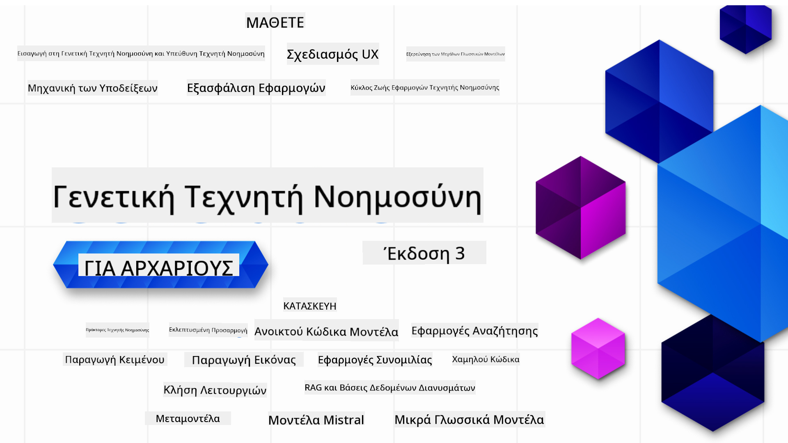

<!--
CO_OP_TRANSLATOR_METADATA:
{
  "original_hash": "6e3f4c8a4f323b8eab1cf11ded304b0f",
  "translation_date": "2025-06-25T07:57:12+00:00",
  "source_file": "README.md",
  "language_code": "el"
}
-->

### 21 Μαθήματα που διδάσκουν όλα όσα χρειάζεστε για να ξεκινήσετε την ανάπτυξη εφαρμογών Γενετικής AI

### 🌐 Υποστήριξη Πολλών Γλωσσών

#### Υποστηρίζεται μέσω GitHub Action (Αυτοματοποιημένο & Πάντα Ενημερωμένο)

# Γενετική Τεχνητή Νοημοσύνη για Αρχάριους (Έκδοση 3) - Ένα Μάθημα

Μάθετε τα βασικά της δημιουργίας εφαρμογών Γενετικής Τεχνητής Νοημοσύνης με το ολοκληρωμένο μας μάθημα 21 μαθημάτων από τους Microsoft Cloud Advocates.

## 🌱 Ξεκινώντας

Αυτό το μάθημα έχει 21 μαθήματα. Κάθε μάθημα καλύπτει το δικό του θέμα, οπότε ξεκινήστε από όπου θέλετε!

Τα μαθήματα χαρακτηρίζονται είτε ως μαθήματα "Μάθησης" που εξηγούν μια έννοια της Γενετικής Τεχνητής Νοημοσύνης είτε ως μαθήματα "Κατασκευής" που εξηγούν μια έννοια και παραδείγματα κώδικα τόσο σε **Python** όσο και σε **TypeScript** όπου είναι δυνατόν.

Για .NET Προγραμματιστές, δείτε το [Γενετική Τεχνητή Νοημοσύνη για Αρχάριους (.NET Έκδοση)](https://github.com/microsoft/Generative-AI-for-beginners-dotnet?WT.mc_id=academic-105485-koreyst)!

Κάθε μάθημα περιλαμβάνει επίσης μια ενότητα "Συνεχίστε να Μαθαίνετε" με επιπλέον εργαλεία μάθησης.

## Τι Χρειάζεστε
### Για να εκτελέσετε τον κώδικα αυτού του μαθήματος, μπορείτε να χρησιμοποιήσετε είτε:
 - [Υπηρεσία Azure OpenAI](https://aka.ms/genai-beginners/azure-open-ai?WT.mc_id=academic-105485-koreyst) - **Μαθήματα:** "aoai-assignment"
 - [Κατάλογος Μοντέλων GitHub Marketplace](https://aka.ms/genai-beginners/gh-models?WT.mc_id=academic-105485-koreyst) - **Μαθήματα:** "githubmodels"
 - [OpenAI API](https://aka.ms/genai-beginners/open-ai?WT.mc_id=academic-105485-koreyst) - **Μαθήματα:** "oai-assignment" 

- Βασικές γνώσεις Python ή TypeScript είναι χρήσιμες - \*Για απόλυτους αρχάριους, δείτε αυτά τα μαθήματα [Python](https://aka.ms/genai-beginners/python?WT.mc_id=academic-105485-koreyst) και [TypeScript](https://aka.ms/genai-beginners/typescript?WT.mc_id=academic-105485-koreyst)
- Ένας λογαριασμός GitHub για να [κλωνοποιήσετε αυτό το αποθετήριο](https://aka.ms/genai-beginners/github?WT.mc_id=academic-105485-koreyst) στο δικό σας λογαριασμό GitHub

Έχουμε δημιουργήσει ένα μάθημα **[Ρύθμιση Μαθήματος](./00-course-setup/README.md?WT.mc_id=academic-105485-koreyst)** για να σας βοηθήσουμε να ρυθμίσετε το περιβάλλον ανάπτυξής σας.

Μην ξεχάσετε να [βάλετε αστέρι (🌟) σε αυτό το αποθετήριο](https://docs.github.com/en/get-started/exploring-projects-on-github/saving-repositories-with-stars?WT.mc_id=academic-105485-koreyst) για να το βρείτε πιο εύκολα αργότερα.

## 🧠 Έτοιμοι για Ανάπτυξη;

Αν ψάχνετε για πιο προηγμένα παραδείγματα κώδικα, δείτε τη [συλλογή μας με Παραδείγματα Κώδικα Γενετικής Τεχνητής Νοημοσύνης](https://aka.ms/genai-beg-code?WT.mc_id=academic-105485-koreyst) τόσο σε **Python** όσο και σε **TypeScript**.

## 🗣️ Γνωρίστε Άλλους Μαθητές, Λάβετε Υποστήριξη

Εγγραφείτε στον [επίσημο διακομιστή Azure AI Foundry στο Discord](https://aka.ms/genai-discord?WT.mc_id=academic-105485-koreyst) για να γνωρίσετε και να δικτυωθείτε με άλλους μαθητές που παρακολουθούν αυτό το μάθημα και να λάβετε υποστήριξη.

Κάντε ερωτήσεις ή μοιραστείτε τα σχόλιά σας για το προϊόν στο [Φόρουμ Προγραμματιστών Azure AI Foundry](https://aka.ms/azureaifoundry/forum) στο Github.

## 🚀 Κατασκευάζετε μια Νεοφυή Επιχείρηση;

Εγγραφείτε στο [Microsoft for Startups Founders Hub](https://aka.ms/genai-foundershub?WT.mc_id=academic-105485-koreyst) για να λάβετε **δωρεάν πιστώσεις OpenAI** και έως **$150k σε πιστώσεις Azure για πρόσβαση σε μοντέλα OpenAI μέσω των Υπηρεσιών Azure OpenAI**.

## 🙏 Θέλετε να βοηθήσετε;

Έχετε προτάσεις ή βρήκατε ορθογραφικά ή λάθη στον κώδικα; [Υποβάλετε ένα θέμα](https://github.com/microsoft/generative-ai-for-beginners/issues?WT.mc_id=academic-105485-koreyst) ή [Δημιουργήστε ένα αίτημα έλξης](https://github.com/microsoft/generative-ai-for-beginners/pulls?WT.mc_id=academic-105485-koreyst)

## 📂 Κάθε μάθημα περιλαμβάνει:

- Μια σύντομη βιντεοπαρουσίαση του θέματος
- Ένα γραπτό μάθημα που βρίσκεται στο README
- Παραδείγματα κώδικα σε Python και TypeScript που υποστηρίζουν Azure OpenAI και OpenAI API
- Συνδέσμους σε επιπλέον πόρους για να συνεχίσετε τη μάθηση

## 🗃️ Μαθήματα

| #   | **Σύνδεσμος Μαθήματος**                                                                                                                              | **Περιγραφή**                                                                                 | **Βίντεο**                                                                   | **Επιπλέον Μάθηση**                                                             |
| --- | -------------------------------------------------------------------------------------------------------------------------------------------- | ----------------------------------------------------------------------------------------------- | --------------------------------------------------------------------------- | ------------------------------------------------------------------------------ |
| 00  | [Ρύθμιση Μαθήματος](./00-course-setup/README.md?WT.mc_id=academic-105485-koreyst)                                                                 | **Μάθετε:** Πώς να Ρυθμίσετε το Περιβάλλον Ανάπτυξής σας                                            | Βίντεο Έρχεται Σύντομα                                                                 | [Μάθετε Περισσότερα](https://aka.ms/genai-collection?WT.mc_id=academic-105485-koreyst) |
| 01  | [Εισαγωγή στη Γενετική Τεχνητή Νοημοσύνη και τα LLMs](./01-introduction-to-genai/README.md?WT.mc_id=academic-105485-koreyst)                              | **Μάθετε:** Κατανόηση του τι είναι η Γενετική Τεχνητή Νοημοσύνη και πώς λειτουργούν τα Μεγάλα Γλωσσικά Μοντέλα (LLMs).       | [Βίντεο](https://aka.ms/gen-ai-lesson-1-gh?WT.mc_id=academic-105485-koreyst) | [Μάθετε Περισσότερα](https://aka.ms/genai-collection?WT.mc_id=academic-105485-koreyst) |
| 02  | [Εξερεύνηση και σύγκριση διαφορετικών LLMs](./02-exploring-and-comparing-different-llms/README.md?WT.mc_id=academic-105485-koreyst)             | **Μάθετε:** Πώς να επιλέξετε το σωστό μοντέλο για την περίπτωσή σας                                      | [Βίντεο](https://aka.ms/gen-ai-lesson2-gh?WT.mc_id=academic-105485-koreyst)  | [Μάθετε Περισσότερα](https://aka.ms/genai-collection?WT.mc_id=academic-105485-koreyst) |
| 03  | [Χρήση της Γενετικής Τεχνητής Νοημοσύνης Υπεύθυνα](./03-using-generative-ai-responsibly/README.md?WT.mc_id=academic-105485-koreyst)                           | **Μάθετε:** Πώς να δημιουργείτε εφαρμογές Γενετικής Τεχνητής Νοημοσύνης υπεύθυνα                                  | [Βίντεο](https://aka.ms/gen-ai-lesson3-gh?WT.mc_id=academic-105485-koreyst)  | [Μάθετε Περισσότερα](https://aka.ms/genai-collection?WT.mc_id=academic-105485-koreyst) |
| 04  | [Κατανόηση των Θεμελιωδών Αρχών του Prompt Engineering](./04-prompt-engineering-fundamentals/README.md?WT.mc_id=academic-105485-koreyst)             | **Μάθετε:** Πρακτικές Καλύτερης Χρήσης του Prompt Engineering                                           | [Βίντεο](https://aka.ms/gen-ai-lesson4-gh?WT.mc_id=academic-105485-koreyst)  | [Μάθετε Περισσότερα](https://aka.ms/genai-collection?WT.mc_id=academic-105485-koreyst) |
| 05  | [Δημιουργία Προχωρημένων Προτροπών](./05-advanced-prompts/README.md?WT.mc_id=academic-105485-koreyst)                                                | **Μάθετε:** Πώς να εφαρμόσετε τεχνικές μηχανικής προτροπών που βελτιώνουν το αποτέλεσμα των προτροπών σας. | [Βίντεο](https://aka.ms/gen-ai-lesson5-gh?WT.mc_id=academic-105485-koreyst)  | [Μάθετε Περισσότερα](https://aka.ms/genai-collection?WT.mc_id=academic-105485-koreyst) |
| 06  | [Δημιουργία Εφαρμογών Γεννήτριας Κειμένου](./06-text-generation-apps/README.md?WT.mc_id=academic-105485-koreyst)                                | **Δημιουργία:** Μια εφαρμογή γεννήτριας κειμένου χρησιμοποιώντας Azure OpenAI / OpenAI API                                | [Βίντεο](https://aka.ms/gen-ai-lesson6-gh?WT.mc_id=academic-105485-koreyst)  | [Μάθετε Περισσότερα](https://aka.ms/genai-collection?WT.mc_id=academic-105485-koreyst) |
| 07  | [Δημιουργία Εφαρμογών Συνομιλίας](./07-building-chat-applications/README.md?WT.mc_id=academic-105485-koreyst)                                     | **Δημιουργία:** Τεχνικές για αποτελεσματική δημιουργία και ενσωμάτωση εφαρμογών συνομιλίας.               | [Βίντεο](https://aka.ms/gen-ai-lessons7-gh?WT.mc_id=academic-105485-koreyst) | [Μάθετε Περισσότερα](https://aka.ms/genai-collection?WT.mc_id=academic-105485-koreyst) |
| 08  | [Δημιουργία Εφαρμογών Αναζήτησης με Βάσεις Δεδομένων Vector](./08-building-search-applications/README.md?WT.mc_id=academic-105485-koreyst)                        | **Δημιουργία:** Μια εφαρμογή αναζήτησης που χρησιμοποιεί Ενσωματώσεις για αναζήτηση δεδομένων.                        | [Βίντεο](https://aka.ms/gen-ai-lesson8-gh?WT.mc_id=academic-105485-koreyst)  | [Μάθετε Περισσότερα](https://aka.ms/genai-collection?WT.mc_id=academic-105485-koreyst) |
| 09  | [Δημιουργία Εφαρμογών Γεννήτριας Εικόνων](./09-building-image-applications/README.md?WT.mc_id=academic-105485-koreyst)                        | **Δημιουργία:** Μια εφαρμογή γεννήτριας εικόνων                                                       | [Βίντεο](https://aka.ms/gen-ai-lesson9-gh?WT.mc_id=academic-105485-koreyst)  | [Μάθετε Περισσότερα](https://aka.ms/genai-collection?WT.mc_id=academic-105485-koreyst) |
| 10  | [Δημιουργία Εφαρμογών AI Χαμηλού Κώδικα](./10-building-low-code-ai-applications/README.md?WT.mc_id=academic-105485-koreyst)                       | **Δημιουργία:** Μια εφαρμογή Γεννητικής AI χρησιμοποιώντας εργαλεία Χαμηλού Κώδικα                                     | [Βίντεο](https://aka.ms/gen-ai-lesson10-gh?WT.mc_id=academic-105485-koreyst) | [Μάθετε Περισσότερα](https://aka.ms/genai-collection?WT.mc_id=academic-105485-koreyst) |
| 11  | [Ενσωμάτωση Εξωτερικών Εφαρμογών με Κλήση Συνάρτησης](./11-integrating-with-function-calling/README.md?WT.mc_id=academic-105485-koreyst) | **Δημιουργία:** Τι είναι η κλήση συνάρτησης και οι περιπτώσεις χρήσης της για εφαρμογές                          | [Βίντεο](https://aka.ms/gen-ai-lesson11-gh?WT.mc_id=academic-105485-koreyst) | [Μάθετε Περισσότερα](https://aka.ms/genai-collection?WT.mc_id=academic-105485-koreyst) |
| 12  | [Σχεδιασμός UX για Εφαρμογές AI](./12-designing-ux-for-ai-applications/README.md?WT.mc_id=academic-105485-koreyst)                         | **Μάθετε:** Πώς να εφαρμόσετε αρχές σχεδιασμού UX κατά την ανάπτυξη Εφαρμογών Γεννητικής AI         | [Βίντεο](https://aka.ms/gen-ai-lesson12-gh?WT.mc_id=academic-105485-koreyst) | [Μάθετε Περισσότερα](https://aka.ms/genai-collection?WT.mc_id=academic-105485-koreyst) |
| 13  | [Ασφάλεια των Εφαρμογών Γεννητικής AI](./13-securing-ai-applications/README.md?WT.mc_id=academic-105485-koreyst)                         | **Μάθετε:** Οι απειλές και οι κίνδυνοι για τα συστήματα AI και οι μέθοδοι για την ασφάλεια αυτών των συστημάτων.             | [Βίντεο](https://aka.ms/gen-ai-lesson13-gh?WT.mc_id=academic-105485-koreyst) | [Μάθετε Περισσότερα](https://aka.ms/genai-collection?WT.mc_id=academic-105485-koreyst) |
| 14  | [Κύκλος Ζωής Εφαρμογών Γεννητικής AI](./14-the-generative-ai-application-lifecycle/README.md?WT.mc_id=academic-105485-koreyst)           | **Μάθετε:** Τα εργαλεία και οι μετρήσεις για τη διαχείριση του Κύκλου Ζωής LLM και LLMOps                         | [Βίντεο](https://aka.ms/gen-ai-lesson14-gh?WT.mc_id=academic-105485-koreyst) | [Μάθετε Περισσότερα](https://aka.ms/genai-collection?WT.mc_id=academic-105485-koreyst) |
| 15  | [Ανάκτηση Ενισχυμένης Δημιουργίας (RAG) και Βάσεις Δεδομένων Διάνυσμα](./15-rag-and-vector-databases/README.md?WT.mc_id=academic-105485-koreyst)        | **Δημιουργία:** Μια εφαρμογή χρησιμοποιώντας ένα RAG Framework για ανάκτηση ενσωματώσεων από Βάσεις Δεδομένων Διάνυσμα  | [Βίντεο](https://aka.ms/gen-ai-lesson15-gh?WT.mc_id=academic-105485-koreyst) | [Μάθετε Περισσότερα](https://aka.ms/genai-collection?WT.mc_id=academic-105485-koreyst) |
| 16  | [Ανοιχτά Μοντέλα και Hugging Face](./16-open-source-models/README.md?WT.mc_id=academic-105485-koreyst)                                    | **Δημιουργία:** Μια εφαρμογή χρησιμοποιώντας ανοιχτά μοντέλα διαθέσιμα στο Hugging Face                    | [Βίντεο](https://aka.ms/gen-ai-lesson16-gh?WT.mc_id=academic-105485-koreyst) | [Μάθετε Περισσότερα](https://aka.ms/genai-collection?WT.mc_id=academic-105485-koreyst) |
| 17  | [Πράκτορες AI](./17-ai-agents/README.md?WT.mc_id=academic-105485-koreyst)                                                                       | **Δημιουργία:** Μια εφαρμογή χρησιμοποιώντας ένα Πλαίσιο Πράκτορα AI                                           | [Βίντεο](https://aka.ms/gen-ai-lesson17-gh?WT.mc_id=academic-105485-koreyst) | [Μάθετε Περισσότερα](https://aka.ms/genai-collection?WT.mc_id=academic-105485-koreyst) |
| 18  | [Προσαρμογή LLMs](./18-fine-tuning/README.md?WT.mc_id=academic-105485-koreyst)                                                              | **Μάθετε:** Το τι, γιατί και πώς της προσαρμογής LLMs                                            | [Βίντεο](https://aka.ms/gen-ai-lesson18-gh?WT.mc_id=academic-105485-koreyst) | [Μάθετε Περισσότερα](https://aka.ms/genai-collection?WT.mc_id=academic-105485-koreyst) |
| 19  | [Δημιουργία με SLMs](./19-slm/README.md?WT.mc_id=academic-105485-koreyst)                                                              | **Μάθετε:** Τα οφέλη της δημιουργίας με Μικρά Μοντέλα Γλώσσας                                            | Βίντεο Σύντομα | [Μάθετε Περισσότερα](https://aka.ms/genai-collection?WT.mc_id=academic-105485-koreyst) |
| 20  | [Δημιουργία με Μοντέλα Mistral](./20-mistral/README.md?WT.mc_id=academic-105485-koreyst)                                                              | **Μάθετε:** Τα χαρακτηριστικά και τις διαφορές των Μοντέλων της Οικογένειας Mistral                                           | Βίντεο Σύντομα | [Μάθετε Περισσότερα](https://aka.ms/genai-collection?WT.mc_id=academic-105485-koreyst) |
| 21  | [Δημιουργία με Μοντέλα Meta](./21-meta/README.md?WT.mc_id=academic-105485-koreyst)                                                              | **Μάθετε:** Τα χαρακτηριστικά και τις διαφορές των Μοντέλων της Οικογένειας Meta                                           | Βίντεο Σύντομα | [Μάθετε Περισσότερα](https://aka.ms/genai-collection?WT.mc_id=academic-105485-koreyst) |

### 🌟 Ιδιαίτερες ευχαριστίες

Ιδιαίτερες ευχαριστίες στον [**John Aziz**](https://www.linkedin.com/in/john0isaac/) για τη δημιουργία όλων των GitHub Actions και των ροών εργασίας

[**Bernhard Merkle**](https://www.linkedin.com/in/bernhard-merkle-738b73/) για τις σημαντικές συνεισφορές του σε κάθε μάθημα για τη βελτίωση της εμπειρίας του μαθητή και του κώδικα.

## 🎒 Άλλα Μαθήματα

Η ομάδα μας παράγει και άλλα μαθήματα! Δείτε:

- [**ΝΕΟ** Πρωτόκολλο Πλαισίου Μοντέλου για Αρχάριους](https://github.com/microsoft/mcp-for-beginners?WT.mc_id=academic-105485-koreyst)
- [Πράκτορες AI για Αρχάριους](https://github.com/microsoft/ai-agents-for-beginners?WT.mc_id=academic-105485-koreyst)
- [Δημιουργική AI για Αρχάριους χρησιμοποιώντας .NET](https://github.com/microsoft/Generative-AI-for-beginners-dotnet?WT.mc_id=academic-105485-koreyst)
- [Δημιουργική AI για Αρχάριους χρησιμοποιώντας JavaScript](https://aka.ms/genai-js-course?WT.mc_id=academic-105485-koreyst)
- [ML για Αρχάριους](https://aka.ms/ml-beginners?WT.mc_id=academic-105485-koreyst)
- [Επιστήμη Δεδομένων για Αρχάριους](https://aka.ms/datascience-beginners?WT.mc_id=academic-105485-koreyst)
- [AI για Αρχάριους](https://aka.ms/ai-beginners?WT.mc_id=academic-105485-koreyst)
- [Κυβερνοασφάλεια για Αρχάριους](https://github.com/microsoft/Security-101??WT.mc_id=academic-96948-sayoung)
- [Ανάπτυξη Ιστού για Αρχάριους](https://aka.ms/webdev-beginners?WT.mc_id=academic-105485-koreyst)
- [IoT για Αρχάριους](https://aka.ms/iot-beginners?WT.mc_id=academic-105485-koreyst)
- [Ανάπτυξη XR για Αρχάριους](https://github.com/microsoft/xr-development-for-beginners?WT.mc_id=academic-105485-koreyst)
- [Κατακτώντας το GitHub Copilot για Προγραμματισμό με Συνεργασία AI](https://aka.ms/GitHubCopilotAI?WT.mc_id=academic-105485-koreyst)
- [Κατακτώντας το GitHub Copilot για Προγραμματιστές C#/.NET](https://github.com/microsoft/mastering-github-copilot-for-dotnet-csharp-developers?WT.mc_id=academic-105485-koreyst)
- [Επιλέξτε τη Δική σας Περιπέτεια με το Copilot](https://github.com/microsoft/CopilotAdventures?WT.mc_id=academic-105485-koreyst)

**Αποποίηση ευθύνης**:  
Αυτό το έγγραφο έχει μεταφραστεί χρησιμοποιώντας την υπηρεσία μετάφρασης AI [Co-op Translator](https://github.com/Azure/co-op-translator). Ενώ επιδιώκουμε την ακρίβεια, παρακαλούμε να γνωρίζετε ότι οι αυτοματοποιημένες μεταφράσεις μπορεί να περιέχουν σφάλματα ή ανακρίβειες. Το πρωτότυπο έγγραφο στη γλώσσα του θα πρέπει να θεωρείται η έγκυρη πηγή. Για κρίσιμες πληροφορίες, συνιστάται επαγγελματική ανθρώπινη μετάφραση. Δεν φέρουμε ευθύνη για τυχόν παρεξηγήσεις ή ερμηνείες που προκύπτουν από τη χρήση αυτής της μετάφρασης.