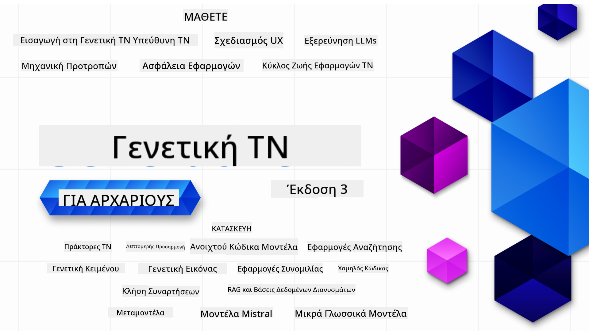

<!--
CO_OP_TRANSLATOR_METADATA:
{
  "original_hash": "3371380dfb4e3ac288036c36fff84eeb",
  "translation_date": "2025-08-25T11:41:28+00:00",
  "source_file": "README.md",
  "language_code": "el"
}
-->

### 21 μαθήματα που σου μαθαίνουν ό,τι χρειάζεσαι για να ξεκινήσεις να φτιάχνεις εφαρμογές Γενετικής Τεχνητής Νοημοσύνης

### 🌐 Υποστήριξη Πολλών Γλωσσών

#### Υποστηρίζεται μέσω GitHub Action (Αυτόματο & Πάντα Ενημερωμένο)

[French](../fr/README.md) | [Spanish](../es/README.md) | [German](../de/README.md) | [Russian](../ru/README.md) | [Arabic](../ar/README.md) | [Persian (Farsi)](../fa/README.md) | [Urdu](../ur/README.md) | [Chinese (Simplified)](../zh/README.md) | [Chinese (Traditional, Macau)](../mo/README.md) | [Chinese (Traditional, Hong Kong)](../hk/README.md) | [Chinese (Traditional, Taiwan)](../tw/README.md) | [Japanese](../ja/README.md) | [Korean](../ko/README.md) | [Hindi](../hi/README.md) | [Bengali](../bn/README.md) | [Marathi](../mr/README.md) | [Nepali](../ne/README.md) | [Punjabi (Gurmukhi)](../pa/README.md) | [Portuguese (Portugal)](../pt/README.md) | [Portuguese (Brazil)](../br/README.md) | [Italian](../it/README.md) | [Lithuanian](../lt/README.md) | [Polish](../pl/README.md) | [Turkish](../tr/README.md) | [Greek](./README.md) | [Thai](../th/README.md) | [Swedish](../sv/README.md) | [Danish](../da/README.md) | [Norwegian](../no/README.md) | [Finnish](../fi/README.md) | [Dutch](../nl/README.md) | [Hebrew](../he/README.md) | [Vietnamese](../vi/README.md) | [Indonesian](../id/README.md) | [Malay](../ms/README.md) | [Tagalog (Filipino)](../tl/README.md) | [Swahili](../sw/README.md) | [Hungarian](../hu/README.md) | [Czech](../cs/README.md) | [Slovak](../sk/README.md) | [Romanian](../ro/README.md) | [Bulgarian](../bg/README.md) | [Serbian (Cyrillic)](../sr/README.md) | [Croatian](../hr/README.md) | [Slovenian](../sl/README.md) | [Ukrainian](../uk/README.md) | [Burmese (Myanmar)](../my/README.md)

# Γενετική Τεχνητή Νοημοσύνη για Αρχάριους (Έκδοση 3) - Ένα Μάθημα

Μάθε τα βασικά για το πώς να φτιάχνεις εφαρμογές Γενετικής Τεχνητής Νοημοσύνης με το ολοκληρωμένο μάθημα 21 ενοτήτων από τους Microsoft Cloud Advocates.

## 🌱 Ξεκινώντας

Το μάθημα περιλαμβάνει 21 ενότητες. Κάθε ενότητα καλύπτει το δικό της θέμα, οπότε μπορείς να ξεκινήσεις από όπου θέλεις!

Οι ενότητες χαρακτηρίζονται είτε ως "Learn" που εξηγούν μια έννοια της Γενετικής ΤΝ, είτε ως "Build" που εξηγούν μια έννοια και παραδείγματα κώδικα σε **Python** και **TypeScript** όπου είναι δυνατόν.

Για .NET Developers δες το [Generative AI for Beginners (.NET Edition)](https://github.com/microsoft/Generative-AI-for-beginners-dotnet?WT.mc_id=academic-105485-koreyst)!

Κάθε ενότητα περιλαμβάνει επίσης μια ενότητα "Keep Learning" με επιπλέον εργαλεία μάθησης.

## Τι Χρειάζεσαι
### Για να τρέξεις τον κώδικα του μαθήματος, μπορείς να χρησιμοποιήσεις είτε: 
 - [Azure OpenAI Service](https://aka.ms/genai-beginners/azure-open-ai?WT.mc_id=academic-105485-koreyst) - **Ενότητες:** "aoai-assignment"
 - [GitHub Marketplace Model Catalog](https://aka.ms/genai-beginners/gh-models?WT.mc_id=academic-105485-koreyst) - **Ενότητες:** "githubmodels"
 - [OpenAI API](https://aka.ms/genai-beginners/open-ai?WT.mc_id=academic-105485-koreyst) - **Ενότητες:** "oai-assignment" 
   
- Βασικές γνώσεις Python ή TypeScript είναι χρήσιμες - \*Για εντελώς αρχάριους δες αυτά τα μαθήματα [Python](https://aka.ms/genai-beginners/python?WT.mc_id=academic-105485-koreyst) και [TypeScript](https://aka.ms/genai-beginners/typescript?WT.mc_id=academic-105485-koreyst)
- Έναν λογαριασμό GitHub για να [κάνεις fork όλο το αποθετήριο](https://aka.ms/genai-beginners/github?WT.mc_id=academic-105485-koreyst) στον δικό σου λογαριασμό

Έχουμε δημιουργήσει το μάθημα **[Course Setup](./00-course-setup/README.md?WT.mc_id=academic-105485-koreyst)** για να σε βοηθήσουμε να στήσεις το περιβάλλον ανάπτυξης.

Μην ξεχάσεις να [βάλεις αστέρι (🌟) στο αποθετήριο](https://docs.github.com/en/get-started/exploring-projects-on-github/saving-repositories-with-stars?WT.mc_id=academic-105485-koreyst) για να το βρίσκεις εύκολα αργότερα.

## 🧠 Έτοιμος για Ανάπτυξη;

Αν ψάχνεις πιο προχωρημένα παραδείγματα κώδικα, δες τη [συλλογή παραδειγμάτων Γενετικής ΤΝ](https://aka.ms/genai-beg-code?WT.mc_id=academic-105485-koreyst) σε **Python** και **TypeScript**.

## 🗣️ Γνώρισε άλλους μαθητές, βρες υποστήριξη

Μπες στον [επίσημο Azure AI Foundry Discord server](https://aka.ms/genai-discord?WT.mc_id=academic-105485-koreyst) για να γνωρίσεις και να δικτυωθείς με άλλους που παρακολουθούν το μάθημα και να βρεις βοήθεια.

Κάνε ερωτήσεις ή μοιράσου σχόλια για το προϊόν στο [Azure AI Foundry Developer Forum](https://aka.ms/azureaifoundry/forum) στο Github.

## 🚀 Θέλεις να φτιάξεις Startup;

Επισκέψου το [Microsoft for Startups](https://www.microsoft.com/startups) για να μάθεις πώς να ξεκινήσεις να χτίζεις με credits Azure σήμερα.

## 🙏 Θέλεις να βοηθήσεις;

Έχεις προτάσεις ή βρήκες ορθογραφικά ή λάθη στον κώδικα; [Άνοιξε ένα θέμα](https://github.com/microsoft/generative-ai-for-beginners/issues?WT.mc_id=academic-105485-koreyst) ή [Δημιούργησε pull request](https://github.com/microsoft/generative-ai-for-beginners/pulls?WT.mc_id=academic-105485-koreyst)

## 📂 Κάθε μάθημα περιλαμβάνει:

- Σύντομο βίντεο εισαγωγής στο θέμα
- Γραπτό μάθημα στο README
- Παραδείγματα κώδικα σε Python και TypeScript για Azure OpenAI και OpenAI API
- Συνδέσμους για επιπλέον πηγές για να συνεχίσεις τη μάθηση

## 🗃️ Μαθήματα

| #   | **Σύνδεσμος Μαθήματος**                                                                                                                              | **Περιγραφή**                                                                                 | **Βίντεο**                                                                   | **Επιπλέον Μάθηση**                                                             |
| --- | -------------------------------------------------------------------------------------------------------------------------------------------- | ----------------------------------------------------------------------------------------------- | --------------------------------------------------------------------------- | ------------------------------------------------------------------------------ |
| 00  | [Course Setup](./00-course-setup/README.md?WT.mc_id=academic-105485-koreyst)                                                                 | **Learn:** Πώς να στήσεις το περιβάλλον ανάπτυξης σου                                            | Βίντεο σύντομα                                                                 | [Μάθε Περισσότερα](https://aka.ms/genai-collection?WT.mc_id=academic-105485-koreyst) |
| 01  | [Εισαγωγή στη Γενετική ΤΝ και LLMs](./01-introduction-to-genai/README.md?WT.mc_id=academic-105485-koreyst)                              | **Learn:** Κατανόηση του τι είναι η Γενετική ΤΝ και πώς λειτουργούν τα Μεγάλα Γλωσσικά Μοντέλα (LLMs).       | [Βίντεο](https://aka.ms/gen-ai-lesson-1-gh?WT.mc_id=academic-105485-koreyst) | [Μάθε Περισσότερα](https://aka.ms/genai-collection?WT.mc_id=academic-105485-koreyst) |
| 02  | [Εξερεύνηση και σύγκριση διαφορετικών LLMs](./02-exploring-and-comparing-different-llms/README.md?WT.mc_id=academic-105485-koreyst)             | **Learn:** Πώς να επιλέξεις το κατάλληλο μοντέλο για τη χρήση σου                                      | [Βίντεο](https://aka.ms/gen-ai-lesson2-gh?WT.mc_id=academic-105485-koreyst)  | [Μάθε Περισσότερα](https://aka.ms/genai-collection?WT.mc_id=academic-105485-koreyst) |
| 03  | [Χρήση της Γενετικής ΤΝ με Υπευθυνότητα](./03-using-generative-ai-responsibly/README.md?WT.mc_id=academic-105485-koreyst)                           | **Learn:** Πώς να φτιάχνεις εφαρμογές Γενετικής ΤΝ με υπευθυνότητα                                  | [Βίντεο](https://aka.ms/gen-ai-lesson3-gh?WT.mc_id=academic-105485-koreyst)  | [Μάθε Περισσότερα](https://aka.ms/genai-collection?WT.mc_id=academic-105485-koreyst) |
| 04  | [Κατανόηση των Βασικών της Prompt Engineering](./04-prompt-engineering-fundamentals/README.md?WT.mc_id=academic-105485-koreyst)             | **Learn:** Πρακτικές συμβουλές για Prompt Engineering                                           | [Βίντεο](https://aka.ms/gen-ai-lesson4-gh?WT.mc_id=academic-105485-koreyst)  | [Μάθε Περισσότερα](https://aka.ms/genai-collection?WT.mc_id=academic-105485-koreyst) |
| 05  | [Δημιουργία Προχωρημένων Prompts](./05-advanced-prompts/README.md?WT.mc_id=academic-105485-koreyst)                                                | **Learn:** Πώς να εφαρμόζεις τεχνικές prompt engineering που βελτιώνουν τα αποτελέσματα των prompts σου. | [Βίντεο](https://aka.ms/gen-ai-lesson5-gh?WT.mc_id=academic-105485-koreyst)  | [Μάθε Περισσότερα](https://aka.ms/genai-collection?WT.mc_id=academic-105485-koreyst) |
| 06  | [Δημιουργία Εφαρμογών Παραγωγής Κειμένου](./06-text-generation-apps/README.md?WT.mc_id=academic-105485-koreyst)                                | **Δημιουργία:** Μια εφαρμογή παραγωγής κειμένου με χρήση Azure OpenAI / OpenAI API                                | [Video](https://aka.ms/gen-ai-lesson6-gh?WT.mc_id=academic-105485-koreyst)  | [Μάθετε Περισσότερα](https://aka.ms/genai-collection?WT.mc_id=academic-105485-koreyst) |
| 07  | [Δημιουργία Εφαρμογών Συνομιλίας](./07-building-chat-applications/README.md?WT.mc_id=academic-105485-koreyst)                                     | **Δημιουργία:** Τεχνικές για αποδοτική δημιουργία και ενσωμάτωση εφαρμογών συνομιλίας.               | [Video](https://aka.ms/gen-ai-lessons7-gh?WT.mc_id=academic-105485-koreyst) | [Μάθετε Περισσότερα](https://aka.ms/genai-collection?WT.mc_id=academic-105485-koreyst) |
| 08  | [Δημιουργία Εφαρμογών Αναζήτησης με Βάσεις Δεδομένων Διανυσμάτων](./08-building-search-applications/README.md?WT.mc_id=academic-105485-koreyst)                        | **Δημιουργία:** Μια εφαρμογή αναζήτησης που χρησιμοποιεί Embeddings για αναζήτηση δεδομένων.                        | [Video](https://aka.ms/gen-ai-lesson8-gh?WT.mc_id=academic-105485-koreyst)  | [Μάθετε Περισσότερα](https://aka.ms/genai-collection?WT.mc_id=academic-105485-koreyst) |
| 09  | [Δημιουργία Εφαρμογών Παραγωγής Εικόνων](./09-building-image-applications/README.md?WT.mc_id=academic-105485-koreyst)                        | **Δημιουργία:** Μια εφαρμογή παραγωγής εικόνων                                                       | [Video](https://aka.ms/gen-ai-lesson9-gh?WT.mc_id=academic-105485-koreyst)  | [Μάθετε Περισσότερα](https://aka.ms/genai-collection?WT.mc_id=academic-105485-koreyst) |
| 10  | [Δημιουργία Εφαρμογών AI με Low Code](./10-building-low-code-ai-applications/README.md?WT.mc_id=academic-105485-koreyst)                       | **Δημιουργία:** Μια εφαρμογή Generative AI με χρήση εργαλείων Low Code                                     | [Video](https://aka.ms/gen-ai-lesson10-gh?WT.mc_id=academic-105485-koreyst) | [Μάθετε Περισσότερα](https://aka.ms/genai-collection?WT.mc_id=academic-105485-koreyst) |
| 11  | [Ενσωμάτωση Εξωτερικών Εφαρμογών με Function Calling](./11-integrating-with-function-calling/README.md?WT.mc_id=academic-105485-koreyst) | **Δημιουργία:** Τι είναι το function calling και πώς χρησιμοποιείται σε εφαρμογές                          | [Video](https://aka.ms/gen-ai-lesson11-gh?WT.mc_id=academic-105485-koreyst) | [Μάθετε Περισσότερα](https://aka.ms/genai-collection?WT.mc_id=academic-105485-koreyst) |
| 12  | [Σχεδιασμός UX για Εφαρμογές AI](./12-designing-ux-for-ai-applications/README.md?WT.mc_id=academic-105485-koreyst)                         | **Μάθετε:** Πώς να εφαρμόζετε αρχές σχεδιασμού UX κατά την ανάπτυξη εφαρμογών Generative AI         | [Video](https://aka.ms/gen-ai-lesson12-gh?WT.mc_id=academic-105485-koreyst) | [Μάθετε Περισσότερα](https://aka.ms/genai-collection?WT.mc_id=academic-105485-koreyst) |
| 13  | [Ασφάλεια στις Εφαρμογές Generative AI](./13-securing-ai-applications/README.md?WT.mc_id=academic-105485-koreyst)                         | **Μάθετε:** Οι απειλές και οι κίνδυνοι για τα συστήματα AI και τρόποι προστασίας τους.             | [Video](https://aka.ms/gen-ai-lesson13-gh?WT.mc_id=academic-105485-koreyst) | [Μάθετε Περισσότερα](https://aka.ms/genai-collection?WT.mc_id=academic-105485-koreyst) |
| 14  | [Κύκλος Ζωής Εφαρμογών Generative AI](./14-the-generative-ai-application-lifecycle/README.md?WT.mc_id=academic-105485-koreyst)           | **Μάθετε:** Τα εργαλεία και τις μετρικές για τη διαχείριση του LLM Lifecycle και LLMOps                         | [Video](https://aka.ms/gen-ai-lesson14-gh?WT.mc_id=academic-105485-koreyst) | [Μάθετε Περισσότερα](https://aka.ms/genai-collection?WT.mc_id=academic-105485-koreyst) |
| 15  | [Retrieval Augmented Generation (RAG) και Βάσεις Δεδομένων Διανυσμάτων](./15-rag-and-vector-databases/README.md?WT.mc_id=academic-105485-koreyst)        | **Δημιουργία:** Μια εφαρμογή που χρησιμοποιεί RAG Framework για ανάκτηση embeddings από Vector Databases  | [Video](https://aka.ms/gen-ai-lesson15-gh?WT.mc_id=academic-105485-koreyst) | [Μάθετε Περισσότερα](https://aka.ms/genai-collection?WT.mc_id=academic-105485-koreyst) |
| 16  | [Open Source Μοντέλα και Hugging Face](./16-open-source-models/README.md?WT.mc_id=academic-105485-koreyst)                                    | **Δημιουργία:** Μια εφαρμογή που χρησιμοποιεί open source μοντέλα διαθέσιμα στο Hugging Face                    | [Video](https://aka.ms/gen-ai-lesson16-gh?WT.mc_id=academic-105485-koreyst) | [Μάθετε Περισσότερα](https://aka.ms/genai-collection?WT.mc_id=academic-105485-koreyst) |
| 17  | [AI Agents](./17-ai-agents/README.md?WT.mc_id=academic-105485-koreyst)                                                                       | **Δημιουργία:** Μια εφαρμογή που χρησιμοποιεί AI Agent Framework                                           | [Video](https://aka.ms/gen-ai-lesson17-gh?WT.mc_id=academic-105485-koreyst) | [Μάθετε Περισσότερα](https://aka.ms/genai-collection?WT.mc_id=academic-105485-koreyst) |
| 18  | [Fine-Tuning LLMs](./18-fine-tuning/README.md?WT.mc_id=academic-105485-koreyst)                                                              | **Μάθετε:** Τι είναι, γιατί και πώς γίνεται το fine-tuning των LLMs                                            | [Video](https://aka.ms/gen-ai-lesson18-gh?WT.mc_id=academic-105485-koreyst) | [Μάθετε Περισσότερα](https://aka.ms/genai-collection?WT.mc_id=academic-105485-koreyst) |
| 19  | [Δημιουργία με SLMs](./19-slm/README.md?WT.mc_id=academic-105485-koreyst)                                                              | **Μάθετε:** Τα οφέλη της δημιουργίας με Small Language Models                                            | Video Coming Soon | [Μάθετε Περισσότερα](https://aka.ms/genai-collection?WT.mc_id=academic-105485-koreyst) |
| 20  | [Δημιουργία με Μοντέλα Mistral](./20-mistral/README.md?WT.mc_id=academic-105485-koreyst)                                                              | **Μάθετε:** Τα χαρακτηριστικά και τις διαφορές των μοντέλων της οικογένειας Mistral                                           | Video Coming Soon | [Μάθετε Περισσότερα](https://aka.ms/genai-collection?WT.mc_id=academic-105485-koreyst) |
| 21  | [Δημιουργία με Μοντέλα Meta](./21-meta/README.md?WT.mc_id=academic-105485-koreyst)                                                              | **Μάθετε:** Τα χαρακτηριστικά και τις διαφορές των μοντέλων της οικογένειας Meta                                           | Video Coming Soon | [Μάθετε Περισσότερα](https://aka.ms/genai-collection?WT.mc_id=academic-105485-koreyst) |

### 🌟 Ιδιαίτερες ευχαριστίες

Ιδιαίτερες ευχαριστίες στον [**John Aziz**](https://www.linkedin.com/in/john0isaac/) για τη δημιουργία όλων των GitHub Actions και των workflows

[**Bernhard Merkle**](https://www.linkedin.com/in/bernhard-merkle-738b73/) για τις σημαντικές συνεισφορές του σε κάθε μάθημα ώστε να βελτιωθεί η εμπειρία του εκπαιδευόμενου και του κώδικα.

## 🎒 Άλλα Μαθήματα

Η ομάδα μας δημιουργεί και άλλα μαθήματα! Δείτε:

- [**ΝΕΟ** Model Context Protocol για Αρχάριους](https://github.com/microsoft/mcp-for-beginners?WT.mc_id=academic-105485-koreyst)
- [AI Agents για Αρχάριους](https://github.com/microsoft/ai-agents-for-beginners?WT.mc_id=academic-105485-koreyst)
- [Generative AI για Αρχάριους με χρήση .NET](https://github.com/microsoft/Generative-AI-for-beginners-dotnet?WT.mc_id=academic-105485-koreyst)
- [Generative AI για Αρχάριους με χρήση JavaScript](https://aka.ms/genai-js-course?WT.mc_id=academic-105485-koreyst)
- [Generative AI για Αρχάριους με χρήση Java](https://aka.ms/genaijava?WT.mc_id=academic-105485-koreyst)
- [ML για Αρχάριους](https://aka.ms/ml-beginners?WT.mc_id=academic-105485-koreyst)
- [Data Science για Αρχάριους](https://aka.ms/datascience-beginners?WT.mc_id=academic-105485-koreyst)
- [AI για Αρχάριους](https://aka.ms/ai-beginners?WT.mc_id=academic-105485-koreyst)
- [Cybersecurity για Αρχάριους](https://github.com/microsoft/Security-101??WT.mc_id=academic-96948-sayoung)
- [Web Dev για Αρχάριους](https://aka.ms/webdev-beginners?WT.mc_id=academic-105485-koreyst)
- [IoT για Αρχάριους](https://aka.ms/iot-beginners?WT.mc_id=academic-105485-koreyst)
- [XR Development για Αρχάριους](https://github.com/microsoft/xr-development-for-beginners?WT.mc_id=academic-105485-koreyst)
- [Mastering GitHub Copilot για AI Paired Programming](https://aka.ms/GitHubCopilotAI?WT.mc_id=academic-105485-koreyst)
- [Mastering GitHub Copilot για Προγραμματιστές C#/.NET](https://github.com/microsoft/mastering-github-copilot-for-dotnet-csharp-developers?WT.mc_id=academic-105485-koreyst)
- [Διάλεξε τη δική σου Copilot Περιπέτεια](https://github.com/microsoft/CopilotAdventures?WT.mc_id=academic-105485-koreyst)

---

**Αποποίηση Ευθύνης**:  
Αυτό το έγγραφο έχει μεταφραστεί χρησιμοποιώντας την υπηρεσία αυτόματης μετάφρασης AI [Co-op Translator](https://github.com/Azure/co-op-translator). Παρότι καταβάλλουμε προσπάθειες για ακρίβεια, παρακαλούμε να γνωρίζετε ότι οι αυτόματες μεταφράσεις ενδέχεται να περιέχουν σφάλματα ή ανακρίβειες. Το πρωτότυπο έγγραφο στη μητρική του γλώσσα πρέπει να θεωρείται η αυθεντική πηγή. Για κρίσιμες πληροφορίες, συνιστάται επαγγελματική ανθρώπινη μετάφραση. Δεν φέρουμε ευθύνη για τυχόν παρανοήσεις ή εσφαλμένες ερμηνείες που προκύπτουν από τη χρήση αυτής της μετάφρασης.