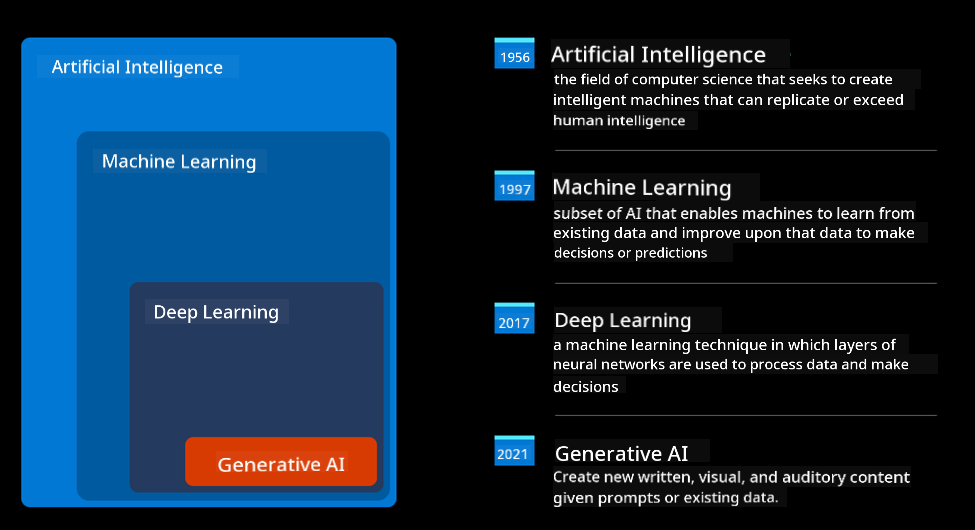
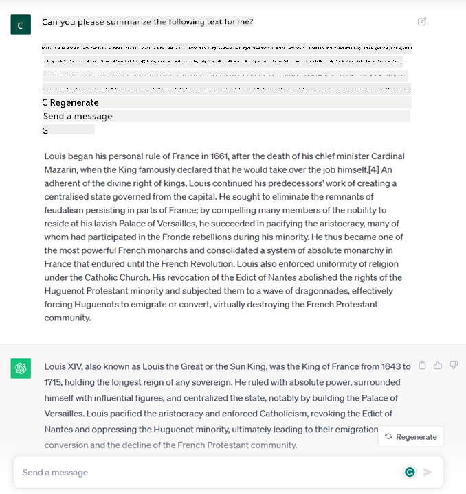
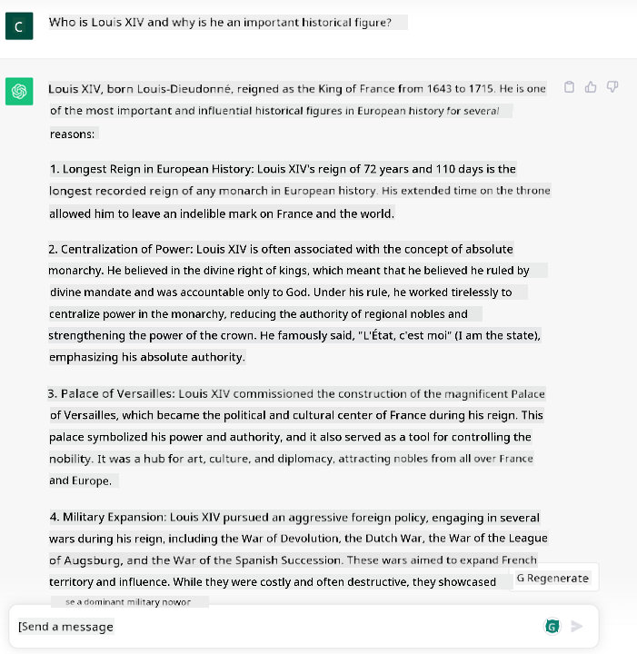
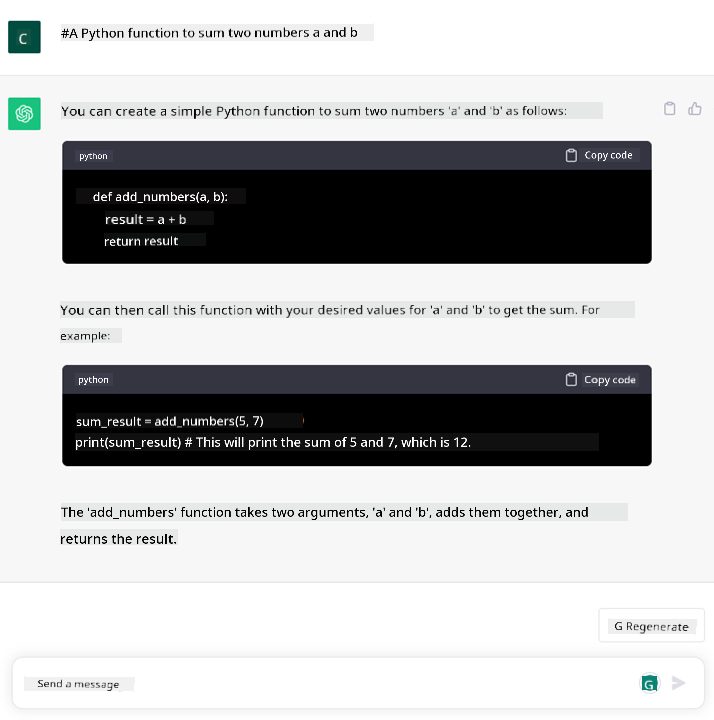

<!--
CO_OP_TRANSLATOR_METADATA:
{
  "original_hash": "f53ba0fa49164f9323043f1c6b11f2b1",
  "translation_date": "2025-07-09T07:39:58+00:00",
  "source_file": "01-introduction-to-genai/README.md",
  "language_code": "en"
}
-->
# Introduction to Generative AI and Large Language Models

_(Click the image above to watch the video for this lesson)_

Generative AI is artificial intelligence that can create text, images, and other types of content. What makes it such an amazing technology is that it democratizes AI—anyone can use it with just a simple text prompt, a sentence written in natural language. You don’t need to learn programming languages like Java or SQL to achieve something meaningful; all you have to do is express what you want in your own words, and the AI model will provide a suggestion. The potential applications and impact are enormous—you can write or understand reports, develop applications, and much more, all within seconds.

In this curriculum, we’ll explore how our startup uses generative AI to unlock new possibilities in education and how we tackle the inevitable challenges related to the social impact of this technology and its limitations.

## Introduction

This lesson will cover:

- Introduction to the business scenario: our startup’s idea and mission.
- Generative AI and how we arrived at the current technology landscape.
- How a large language model works internally.
- Key capabilities and practical use cases of Large Language Models.

## Learning Goals

By the end of this lesson, you will understand:

- What generative AI is and how Large Language Models operate.
- How to leverage large language models for various use cases, focusing on educational scenarios.

## Scenario: our educational startup

Generative Artificial Intelligence (AI) represents the cutting edge of AI technology, pushing the limits of what was once thought impossible. Generative AI models have many capabilities and applications, but for this curriculum, we’ll focus on how it’s transforming education through a fictional startup. We’ll call this startup _our startup_. Our startup operates in the education sector with the ambitious mission of

> _improving accessibility in learning worldwide, ensuring fair access to education, and providing personalized learning experiences tailored to each learner’s needs_.

Our startup team knows that achieving this goal won’t be possible without harnessing one of the most powerful tools of our time—Large Language Models (LLMs).

Generative AI is expected to revolutionize how we learn and teach, with students having virtual teachers available 24/7 who provide vast amounts of information and examples, and teachers able to use innovative tools to assess students and provide feedback.

To begin, let’s define some basic concepts and terminology we’ll use throughout this curriculum.

## How did we get Generative AI?

Despite the recent extraordinary _hype_ around generative AI models, this technology has been decades in the making, with initial research dating back to the 1960s. Today, AI has reached human-like cognitive abilities, such as conversation, demonstrated by tools like [OpenAI ChatGPT](https://openai.com/chatgpt) or [Bing Chat](https://www.microsoft.com/edge/features/bing-chat?WT.mc_id=academic-105485-koreyst), which also uses a GPT model for Bing’s web search conversations.

Looking back, the earliest AI prototypes were rule-based chatbots that relied on a knowledge base created by experts and encoded into a computer. These chatbots responded based on keywords found in the input text. However, it quickly became clear that this approach didn’t scale well.

### A statistical approach to AI: Machine Learning

A breakthrough came in the 1990s with the introduction of a statistical approach to text analysis. This led to the development of new algorithms—known as machine learning—that could learn patterns from data without explicit programming. This approach allows machines to simulate human language understanding: a statistical model is trained on pairs of text and labels, enabling it to classify new input text with a predefined label representing the message’s intent.

### Neural networks and modern virtual assistants

In recent years, advances in hardware capable of processing larger datasets and more complex computations have driven AI research forward, leading to the development of advanced machine learning algorithms called neural networks or deep learning.

Neural networks (especially Recurrent Neural Networks—RNNs) greatly improved natural language processing by representing the meaning of text more effectively, taking into account the context of words within sentences.

This technology powered the virtual assistants that emerged in the early 2000s, which were skilled at understanding human language, identifying needs, and performing actions to fulfill them—such as responding with predefined scripts or interacting with third-party services.

### Present day, Generative AI

This brings us to today’s Generative AI, which can be seen as a subset of deep learning.

After decades of AI research, a new model architecture called the _Transformer_ overcame the limitations of RNNs by handling much longer text sequences as input. Transformers use an attention mechanism that allows the model to assign different weights to parts of the input, ‘paying more attention’ to the most relevant information regardless of its position in the text.

Most recent generative AI models—also called Large Language Models (LLMs) because they work with text inputs and outputs—are based on this architecture. What’s remarkable about these models, trained on massive amounts of unlabeled data from diverse sources like books, articles, and websites, is their adaptability to a wide range of tasks and their ability to generate grammatically correct text with a touch of creativity. They not only greatly improve a machine’s ability to ‘understand’ input text but also enable it to generate original responses in human language.

## How do large language models work?

In the next chapter, we’ll explore different types of Generative AI models, but for now, let’s look at how large language models work, focusing on OpenAI GPT (Generative Pre-trained Transformer) models.

- **Tokenizer, text to numbers**: Large Language Models take text as input and produce text as output. However, since they are statistical models, they work better with numbers than raw text. That’s why every input is first processed by a tokenizer before being fed into the core model. A token is a piece of text—made up of a variable number of characters—so the tokenizer’s main job is to split the input into an array of tokens. Each token is then mapped to a token index, which is the integer encoding of that text chunk.

- **Predicting output tokens**: Given n tokens as input (with the maximum n varying by model), the model predicts one token as output. This token is then added to the input for the next step, in an expanding window pattern, allowing the model to generate one or more sentences as a response. This explains why, if you’ve used ChatGPT, you might have noticed it sometimes stops mid-sentence.

- **Selection process, probability distribution**: The model chooses the output token based on the probability of it following the current text sequence. It predicts a probability distribution over all possible next tokens, calculated from its training. However, the token with the highest probability isn’t always selected. A degree of randomness is introduced so the model behaves non-deterministically—you won’t get the exact same output every time for the same input. This randomness simulates creative thinking and can be adjusted using a parameter called temperature.

## How can our startup leverage Large Language Models?

Now that we understand how large language models work internally, let’s look at some practical examples of common tasks they perform well, with a focus on our business scenario.

We said the main capability of a Large Language Model is _generating text from scratch based on a natural language input_.

But what kind of input and output?

The input to a large language model is called a prompt, and the output is called a completion, referring to the model’s process of generating the next token to complete the input. We’ll dive deeper into what a prompt is and how to design it to get the best results. For now, just know that a prompt may include:

- An **instruction** specifying the type of output expected. This instruction may include examples or additional data.

  1. Summarizing an article, book, product reviews, and more, as well as extracting insights from unstructured data.
    
    
  
  2. Creative ideation and writing of an article, essay, assignment, or more.
      
     

- A **question**, posed as part of a conversation with an agent.
  
  

- A piece of **text to complete**, which implicitly requests writing assistance.
  
  

- A piece of **code** along with a request to explain or document it, or a comment asking to generate code for a specific task.
  
  

These examples are simple and not meant to fully demonstrate the capabilities of Large Language Models. They’re intended to show the potential of generative AI, especially in educational contexts but not limited to them.

Also, the output of a generative AI model isn’t perfect. Sometimes the model’s creativity can backfire, producing results that seem like a distortion of reality or even offensive. Generative AI isn’t truly intelligent—not in the broader sense that includes critical and creative reasoning or emotional intelligence. It’s non-deterministic and not fully reliable, as it can mix accurate information with fabrications like incorrect references, content, or statements, all presented confidently. In the upcoming lessons, we’ll address these limitations and explore ways to mitigate them.

## Assignment

Your assignment is to research more about [generative AI](https://en.wikipedia.org/wiki/Generative_artificial_intelligence?WT.mc_id=academic-105485-koreyst) and identify an area where you would introduce generative AI today that currently doesn’t have it. How would the impact differ from doing it the “old way”? Would you be able to do something previously impossible, or would you be faster? Write a 300-word summary describing your dream AI startup, including headers like "Problem," "How I would use AI," "Impact," and optionally a business plan.

If you complete this task, you might even be ready to apply to Microsoft’s incubator, [Microsoft for Startups Founders Hub](https://www.microsoft.com/startups?WT.mc_id=academic-105485-koreyst). We offer credits for Azure, OpenAI, mentoring, and much more—check it out!

## Knowledge check

What’s true about large language models?

1. You get the exact same response every time.  
2. They do everything perfectly, like adding numbers or producing working code.  
3. The response can vary even with the same prompt. They’re great for providing a first draft of text or code, but you need to refine the results.

A: 3. LLMs are non-deterministic, so responses vary, but you can control this variance with a temperature setting. You shouldn’t expect perfect results; they’re designed to do the heavy lifting and provide a good first attempt that you can improve over time.

## Great Work! Continue the Journey

After finishing this lesson, check out our [Generative AI Learning collection](https://aka.ms/genai-collection?WT.mc_id=academic-105485-koreyst) to keep advancing your knowledge of Generative AI!
Head over to Lesson 2 where we will look at how to [explore and compare different LLM types](../02-exploring-and-comparing-different-llms/README.md?WT.mc_id=academic-105485-koreyst)!

**Disclaimer**:  
This document has been translated using the AI translation service [Co-op Translator](https://github.com/Azure/co-op-translator). While we strive for accuracy, please be aware that automated translations may contain errors or inaccuracies. The original document in its native language should be considered the authoritative source. For critical information, professional human translation is recommended. We are not liable for any misunderstandings or misinterpretations arising from the use of this translation.