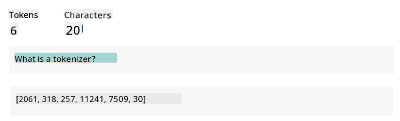
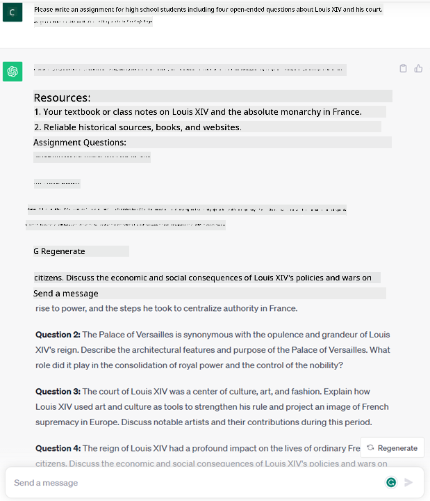

<!--
CO_OP_TRANSLATOR_METADATA:
{
  "original_hash": "bfb7901bdbece1ba3e9f35c400ca33e8",
  "translation_date": "2025-10-17T22:34:05+00:00",
  "source_file": "01-introduction-to-genai/README.md",
  "language_code": "en"
}
-->
# Introduction to Generative AI and Large Language Models

_(Click the image above to view the video of this lesson)_

Generative AI refers to artificial intelligence capable of creating text, images, and other types of content. What makes it an incredible technology is its ability to democratize AI—anyone can use it with just a text prompt, a sentence written in natural language. You don’t need to learn programming languages like Java or SQL to achieve meaningful results; you simply use your own language, state what you want, and the AI model provides suggestions. The applications and impact of this are immense, enabling tasks like writing or understanding reports, creating applications, and much more—all in seconds.

In this curriculum, we’ll explore how our startup utilizes generative AI to unlock new possibilities in the education sector and how we address the inevitable challenges related to its social implications and technological limitations.

## Introduction

This lesson will cover:

- Introduction to the business scenario: our startup idea and mission.
- Generative AI and the evolution of the current technology landscape.
- The inner workings of a large language model.
- Key capabilities and practical use cases of Large Language Models.

## Learning Goals

After completing this lesson, you will understand:

- What generative AI is and how Large Language Models function.
- How to leverage large language models for various use cases, with a focus on educational scenarios.

## Scenario: our educational startup

Generative Artificial Intelligence (AI) represents the pinnacle of AI technology, pushing the boundaries of what was once considered impossible. Generative AI models have numerous capabilities and applications, but for this curriculum, we'll focus on how they are transforming education through a fictional startup. We'll refer to this startup as _our startup_. Our startup operates in the education domain with the ambitious mission statement:

> _Improving accessibility in learning on a global scale, ensuring equitable access to education, and providing personalized learning experiences tailored to each learner’s needs._

Our startup team recognizes that achieving this goal is impossible without leveraging one of the most powerful tools of modern times—Large Language Models (LLMs).

Generative AI is expected to revolutionize the way we learn and teach today, offering students virtual teachers available 24/7 to provide vast amounts of information and examples, while enabling teachers to use innovative tools to assess students and provide feedback.

To begin, let’s define some basic concepts and terminology that will be used throughout the curriculum.

## How did we get Generative AI?

Despite the extraordinary _hype_ surrounding the recent announcement of generative AI models, this technology has been decades in the making, with initial research efforts dating back to the 1960s. Today, AI has reached a point where it exhibits human-like cognitive capabilities, such as conversation, as demonstrated by tools like [OpenAI ChatGPT](https://openai.com/chatgpt) or [Bing Chat](https://www.microsoft.com/edge/features/bing-chat?WT.mc_id=academic-105485-koreyst), which also uses a GPT model for web search-based conversations.

Looking back, the earliest prototypes of AI consisted of typewritten chatbots that relied on a knowledge base extracted from expert input and represented within a computer. Responses in the knowledge base were triggered by keywords found in the input text. However, it soon became evident that this approach, using typewritten chatbots, did not scale well.

### A statistical approach to AI: Machine Learning

A major turning point came in the 1990s with the application of statistical methods to text analysis. This led to the development of new algorithms—known as machine learning—that could learn patterns from data without explicit programming. This approach enabled machines to simulate human language understanding: a statistical model trained on text-label pairings could classify unknown input text with a predefined label representing the message’s intent.

### Neural networks and modern virtual assistants

In recent years, advancements in hardware capable of processing larger datasets and performing complex computations have spurred AI research, leading to the development of advanced machine learning algorithms known as neural networks or deep learning algorithms.

Neural networks (particularly Recurrent Neural Networks—RNNs) significantly improved natural language processing, allowing for a more meaningful representation of text by considering the context of words within sentences.

This technology powered the virtual assistants that emerged in the first decade of the 21st century, which excelled at interpreting human language, identifying needs, and performing actions to fulfill them—such as responding with predefined scripts or utilizing third-party services.

### Present day, Generative AI

This brings us to today’s Generative AI, which can be considered a subset of deep learning.

After decades of AI research, a new model architecture—called _Transformer_—overcame the limitations of RNNs by processing much longer text sequences as input. Transformers use an attention mechanism that allows the model to assign different weights to the inputs it receives, focusing more on the most relevant information regardless of its position in the text sequence.

Most recent generative AI models—also known as Large Language Models (LLMs), as they work with textual inputs and outputs—are based on this architecture. These models, trained on vast amounts of unlabeled data from diverse sources like books, articles, and websites, can be adapted to a wide range of tasks and generate grammatically correct text with a touch of creativity. Not only have they greatly enhanced machines’ ability to ‘understand’ input text, but they have also enabled the generation of original responses in human language.

## How do large language models work?

In the next chapter, we’ll explore different types of Generative AI models, but for now, let’s examine how large language models work, focusing on OpenAI GPT (Generative Pre-trained Transformer) models.

- **Tokenizer, text to numbers**: Large Language Models take text as input and produce text as output. However, as statistical models, they work better with numbers than text sequences. Therefore, every input to the model is processed by a tokenizer before being used by the core model. A token is a chunk of text consisting of a variable number of characters, and the tokenizer’s main task is to split the input into an array of tokens. Each token is then mapped to a token index, which is the integer encoding of the original text chunk.

- **Predicting output tokens**: Given n tokens as input (with max n varying by model), the model predicts one token as output. This token is then added to the input for the next iteration, creating an expanding window pattern that enhances the user experience by generating one (or multiple) sentences as a response. This explains why, if you’ve used ChatGPT, you might notice it sometimes stops mid-sentence.

- **Selection process, probability distribution**: The model selects the output token based on its probability of occurring after the current text sequence. This probability distribution is calculated based on the model’s training. However, the token with the highest probability isn’t always chosen. A degree of randomness is introduced to simulate creative thinking, making the model non-deterministic—producing varied outputs for the same input. This randomness can be adjusted using a parameter called temperature.

## How can our startup leverage Large Language Models?

Now that we understand how large language models work, let’s explore practical examples of their most common tasks, focusing on our business scenario. The primary capability of a Large Language Model is _generating text from scratch based on a natural language input_.

But what kind of textual input and output?
The input to a large language model is called a prompt, while the output is referred to as a completion, which describes the model’s process of generating the next token to complete the current input. We’ll delve deeper into prompts and how to design them effectively later. For now, let’s note that a prompt may include:

- An **instruction** specifying the type of output expected from the model. This instruction may include examples or additional data.

  1. Summarization of articles, books, product reviews, etc., along with extracting insights from unstructured data.
    
    
  
  2. Creative ideation and design of articles, essays, assignments, and more.
      
     

- A **question**, posed as part of a conversation with an agent.
  
  

- A chunk of **text to complete**, implicitly requesting writing assistance.
  
  

- A chunk of **code**, accompanied by a request for explanation and documentation, or a comment asking for code to perform a specific task.
  
  

The examples above are simple and not intended to fully demonstrate the capabilities of Large Language Models. They aim to showcase the potential of generative AI, particularly in educational contexts.

It’s important to note that the output of generative AI models is not perfect. Sometimes, the model’s creativity can lead to outputs that combine correct information with fabrications, resulting in misleading or offensive content. Generative AI is not intelligent in the broader sense—it lacks critical and creative reasoning, emotional intelligence, and determinism. It is not inherently trustworthy, as it may confidently present erroneous references, content, or statements. In the following lessons, we’ll address these limitations and explore ways to mitigate them.

## Assignment

Your assignment is to research more about [generative AI](https://en.wikipedia.org/wiki/Generative_artificial_intelligence?WT.mc_id=academic-105485-koreyst) and identify an area where generative AI could be applied today but isn’t yet. How would the impact differ from traditional methods? Could it enable something previously impossible, or make processes faster? Write a 300-word summary of your dream AI startup, including headers like "Problem," "How I would use AI," "Impact," and optionally a business plan.

If you complete this task, you might even be ready to apply to Microsoft's incubator, [Microsoft for Startups Founders Hub](https://www.microsoft.com/startups?WT.mc_id=academic-105485-koreyst), which offers credits for Azure, OpenAI, mentoring, and more. Check it out!

## Knowledge check

What's true about large language models?

1. You get the exact same response every time.
1. It does things perfectly, such as adding numbers or producing flawless code.
1. The response may vary despite using the same prompt. It’s great for providing a first draft of text or code, but you’ll need to refine the results.

A: 3, an LLM is non-deterministic, meaning the response varies. However, you can control its variance using a temperature setting. You shouldn’t expect it to perform tasks perfectly—it’s designed to handle the heavy lifting, often providing a solid starting point that requires further improvement.

## Great Work! Continue the Journey

After completing this lesson, check out our [Generative AI Learning collection](https://aka.ms/genai-collection?WT.mc_id=academic-105485-koreyst) to continue enhancing your Generative AI knowledge!
Head over to Lesson 2 where we will look at how to [explore and compare different LLM types](../02-exploring-and-comparing-different-llms/README.md?WT.mc_id=academic-105485-koreyst)!

---

**Disclaimer**:  
This document has been translated using the AI translation service [Co-op Translator](https://github.com/Azure/co-op-translator). While we aim for accuracy, please note that automated translations may include errors or inaccuracies. The original document in its native language should be regarded as the authoritative source. For critical information, professional human translation is advised. We are not responsible for any misunderstandings or misinterpretations resulting from the use of this translation.