<!--
CO_OP_TRANSLATOR_METADATA:
{
  "original_hash": "e2f686f2eb794941761252ac5e8e090b",
  "translation_date": "2025-06-25T10:12:05+00:00",
  "source_file": "02-exploring-and-comparing-different-llms/README.md",
  "language_code": "en"
}
-->
# Exploring and comparing different LLMs

[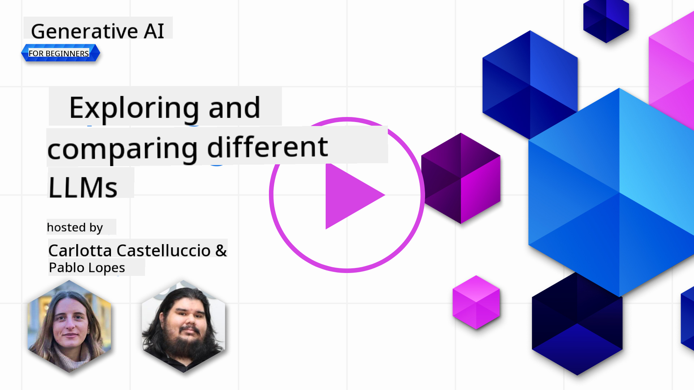](https://aka.ms/gen-ai-lesson2-gh?WT.mc_id=academic-105485-koreyst)

> _Click the image above to view video of this lesson_

In the previous lesson, we explored how Generative AI is transforming the tech world, the functioning of Large Language Models (LLMs), and how businesses, like our startup, can utilize them for growth. This chapter focuses on comparing different types of LLMs to weigh their advantages and disadvantages.

Our startup's next step is to examine the current LLM landscape to determine which models suit our needs.

## Introduction

This lesson will cover:

- Various types of LLMs currently available.
- Testing, refining, and comparing models for your use case in Azure.
- How to deploy an LLM.

## Learning Goals

After completing this lesson, you will be able to:

- Choose the appropriate model for your use case.
- Understand how to test, refine, and enhance your model's performance.
- Learn how businesses deploy models.

## Understand different types of LLMs

LLMs can be categorized based on architecture, training data, and use case. Understanding these differences will help our startup choose the right model and understand how to test, refine, and enhance performance.

There are numerous LLM models, and your choice depends on your intended use, data, budget, and more.

Depending on whether you want to use the models for text, audio, video, image generation, etc., you may choose different models.

- **Audio and speech recognition**. Whisper-type models are excellent for this purpose as they are versatile and designed for speech recognition. They are trained on diverse audio and can handle multilingual speech recognition. Learn more about [Whisper type models here](https://platform.openai.com/docs/models/whisper?WT.mc_id=academic-105485-koreyst).

- **Image generation**. DALL-E and Midjourney are two popular choices for image generation. DALL-E is available through Azure OpenAI. [Read more about DALL-E here](https://platform.openai.com/docs/models/dall-e?WT.mc_id=academic-105485-koreyst) and in Chapter 9 of this curriculum.

- **Text generation**. Many models are trained for text generation, offering a wide range from GPT-3.5 to GPT-4, with varying costs, GPT-4 being the priciest. It's beneficial to explore the [Azure OpenAI playground](https://oai.azure.com/portal/playground?WT.mc_id=academic-105485-koreyst) to assess which models meet your capability and cost requirements.

- **Multi-modality**. For handling multiple types of input and output data, consider models like [gpt-4 turbo with vision or gpt-4o](https://learn.microsoft.com/azure/ai-services/openai/concepts/models#gpt-4-and-gpt-4-turbo-models?WT.mc_id=academic-105485-koreyst) - the latest OpenAI models - capable of integrating natural language processing with visual understanding, allowing multi-modal interactions.

Choosing a model provides basic capabilities, which may not suffice. Often, you need to incorporate company-specific data into the LLM. There are several approaches to this, which we'll explore in upcoming sections.

### Foundation Models versus LLMs

The term Foundation Model was [introduced by Stanford researchers](https://arxiv.org/abs/2108.07258?WT.mc_id=academic-105485-koreyst) and defined as an AI model meeting certain criteria, such as:

- **Trained using unsupervised or self-supervised learning**, meaning they use unlabeled multi-modal data and don't require human annotation or labeling for training.
- **Very large models**, based on deep neural networks trained on billions of parameters.
- **Intended to serve as a ‘foundation’ for other models**, allowing them to be used as a starting point for further model development, often through fine-tuning.

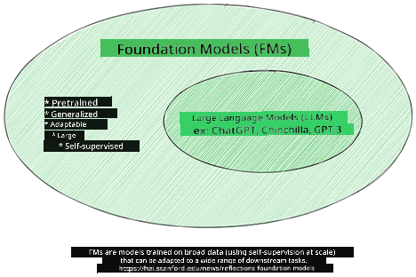

Image source: [Essential Guide to Foundation Models and Large Language Models | by Babar M Bhatti | Medium
](https://thebabar.medium.com/essential-guide-to-foundation-models-and-large-language-models-27dab58f7404)

To clarify this distinction, consider ChatGPT. The first version of ChatGPT was built on GPT-3.5 as the foundation model, meaning OpenAI used chat-specific data to create a tuned version of GPT-3.5 specialized for conversational scenarios, like chatbots.

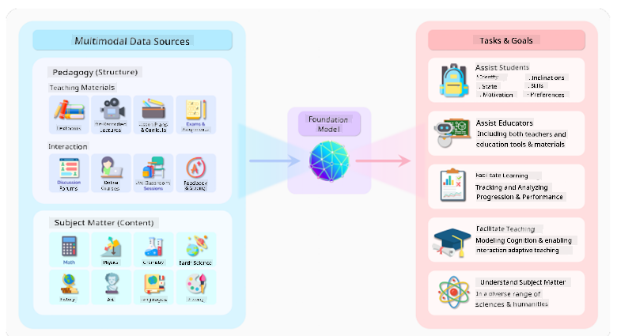

Image source: [2108.07258.pdf (arxiv.org)](https://arxiv.org/pdf/2108.07258.pdf?WT.mc_id=academic-105485-koreyst)

### Open Source versus Proprietary Models

Another way to categorize LLMs is by their nature: open source or proprietary.

Open-source models are publicly available and can be used by anyone. Often released by the creating company or research community, they can be inspected, modified, and customized for various LLM use cases. However, they may not be optimized for production use and might not perform as well as proprietary models. Funding can be limited, and they may not be maintained long-term or updated with the latest research. Examples of popular open-source models include [Alpaca](https://crfm.stanford.edu/2023/03/13/alpaca.html?WT.mc_id=academic-105485-koreyst), [Bloom](https://huggingface.co/bigscience/bloom) and [LLaMA](https://llama.meta.com).

Proprietary models are owned by companies and not publicly available. Often optimized for production use, they can't be inspected, modified, or customized for different use cases. They may require a subscription or payment and users must trust the model owner with data privacy and responsible AI use. Examples include [OpenAI models](https://platform.openai.com/docs/models/overview?WT.mc_id=academic-105485-koreyst), [Google Bard](https://sapling.ai/llm/bard?WT.mc_id=academic-105485-koreyst) or [Claude 2](https://www.anthropic.com/index/claude-2?WT.mc_id=academic-105485-koreyst).

### Embedding versus Image generation versus Text and Code generation

LLMs can also be categorized by the output they produce.

Embeddings are models that convert text into numerical form, called embedding, representing the input text numerically. Embeddings help machines understand word or sentence relationships and can be used by other models, like classification or clustering models that perform better on numerical data. Embedding models are often used for transfer learning, where a model is built for a surrogate task with abundant data, and model weights (embeddings) are reused for other tasks. An example is [OpenAI embeddings](https://platform.openai.com/docs/models/embeddings?WT.mc_id=academic-105485-koreyst).

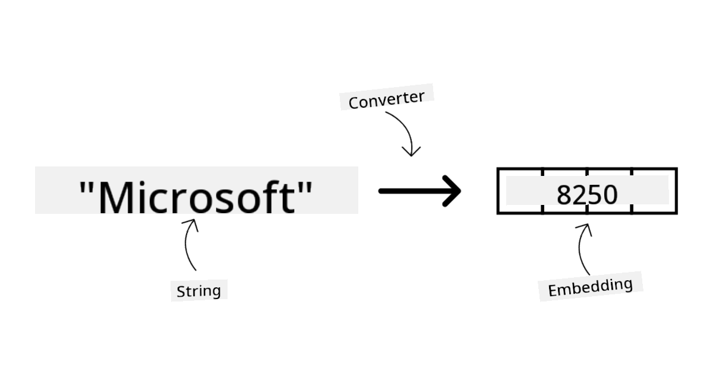

Image generation models create images, often used for editing, synthesis, and translation. Trained on large image datasets like [LAION-5B](https://laion.ai/blog/laion-5b/?WT.mc_id=academic-105485-koreyst), they can generate new images or edit existing ones with techniques like inpainting, super-resolution, and colorization. Examples include [DALL-E-3](https://openai.com/dall-e-3?WT.mc_id=academic-105485-koreyst) and [Stable Diffusion models](https://github.com/Stability-AI/StableDiffusion?WT.mc_id=academic-105485-koreyst).

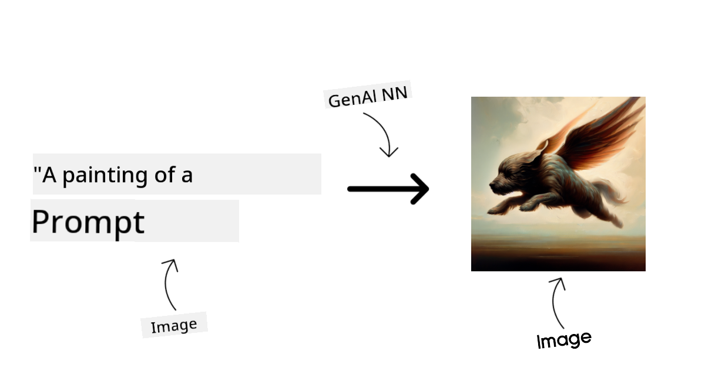

Text and code generation models create text or code, often used for summarization, translation, and question answering. Trained on large text datasets like [BookCorpus](https://www.cv-foundation.org/openaccess/content_iccv_2015/html/Zhu_Aligning_Books_and_ICCV_2015_paper.html?WT.mc_id=academic-105485-koreyst), they can generate new text or answer questions. Code generation models, like [CodeParrot](https://huggingface.co/codeparrot?WT.mc_id=academic-105485-koreyst), are trained on large code datasets like GitHub, and can generate new code or fix existing bugs.

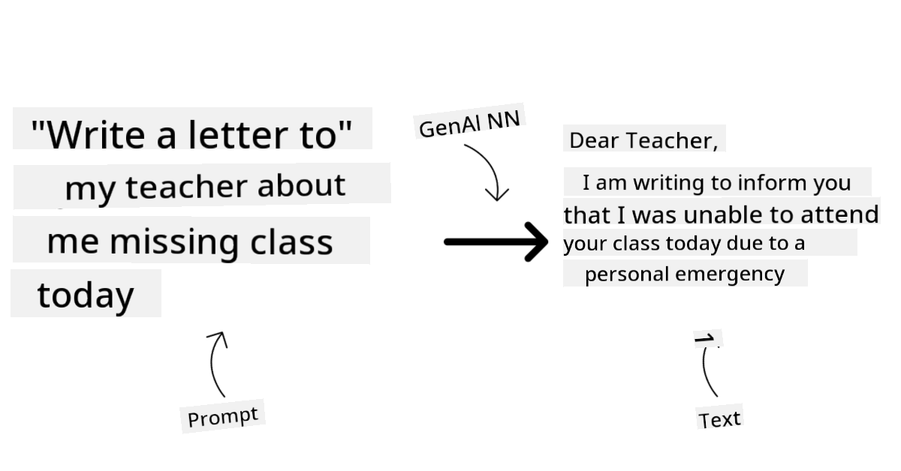

### Encoder-Decoder versus Decoder-only

To discuss LLM architectures, let's use an analogy.

Imagine your manager assigned you to create a quiz for students. You have two colleagues: one creates content and the other reviews it.

The content creator is like a Decoder-only model, able to look at the topic and your work to write a course. They excel at writing engaging content but struggle to understand the topic and learning objectives. Examples of Decoder models include GPT family models like GPT-3.

The reviewer is like an Encoder-only model, analyzing the course and answers to understand context but not generating content. An example of an Encoder-only model is BERT.

Imagine someone who could both create and review the quiz; this is an Encoder-Decoder model. Examples include BART and T5.

### Service versus Model

Let's differentiate between a service and a model. A service is a product offered by a Cloud Service Provider, combining models, data, and other components. A model is the core of a service, often a foundation model like an LLM.

Services are optimized for production and easier to use via a GUI. However, they may require a subscription or payment, offering the service owner's equipment and resources, optimizing expenses, and scaling easily. An example is [Azure OpenAI Service](https://learn.microsoft.com/azure/ai-services/openai/overview?WT.mc_id=academic-105485-koreyst), which offers a pay-as-you-go plan, charging users based on usage. Azure OpenAI Service also provides enterprise-grade security and a responsible AI framework atop the models' capabilities.

Models are just the Neural Network, with parameters, weights, and more, allowing companies to run locally, though they must purchase equipment, build a scalable structure, and buy a license or use an open-source model. A model like LLaMA is available for use, requiring computational power to run.

## How to test and iterate with different models to understand performance on Azure

After exploring the LLM landscape and identifying candidates for their scenarios, the next step is testing them on their data and workload. This iterative process involves experiments and measurements.
Most models mentioned earlier (OpenAI models, open-source models like Llama2, and Hugging Face transformers) are available in the [Model Catalog](https://learn.microsoft.com/azure/ai-studio/how-to/model-catalog-overview?WT.mc_id=academic-105485-koreyst) in [Azure AI Studio](https://ai.azure.com/?WT.mc_id=academic-105485-koreyst).

[Azure AI Studio](https://learn.microsoft.com/azure/ai-studio/what-is-ai-studio?WT.mc_id=academic-105485-koreyst) is a Cloud Platform for developers to build generative AI applications and manage the development lifecycle - from experimentation to evaluation - combining all Azure AI services into one hub with a user-friendly GUI. The Model Catalog in Azure AI Studio enables users to:

- Find the Foundation Model of interest in the catalog - proprietary or open source, filtering by task, license, or name. Models are organized into collections for improved searchability, like Azure OpenAI collection, Hugging Face collection, and more.

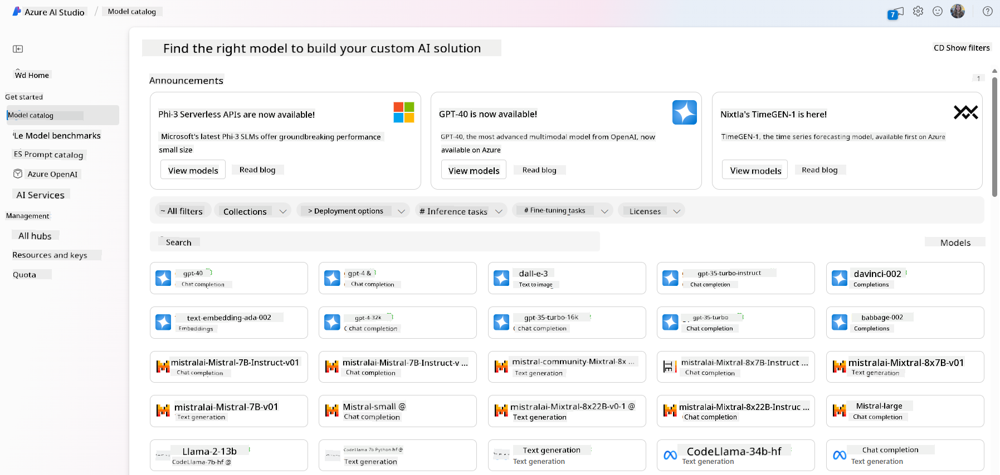

- Review the model card, including a detailed description of intended use and training data, code samples, and evaluation results from the internal evaluations library.

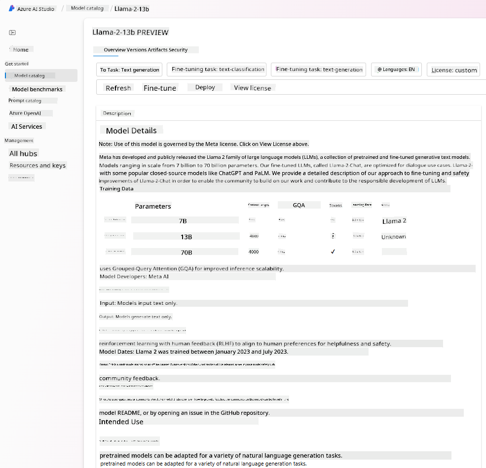
- Compare benchmarks across models and datasets available in the industry to assess which one meets the business scenario, through the [Model Benchmarks](https://learn.microsoft.com/azure/ai-studio/how-to/model-benchmarks?WT.mc_id=academic-105485-koreyst) pane.

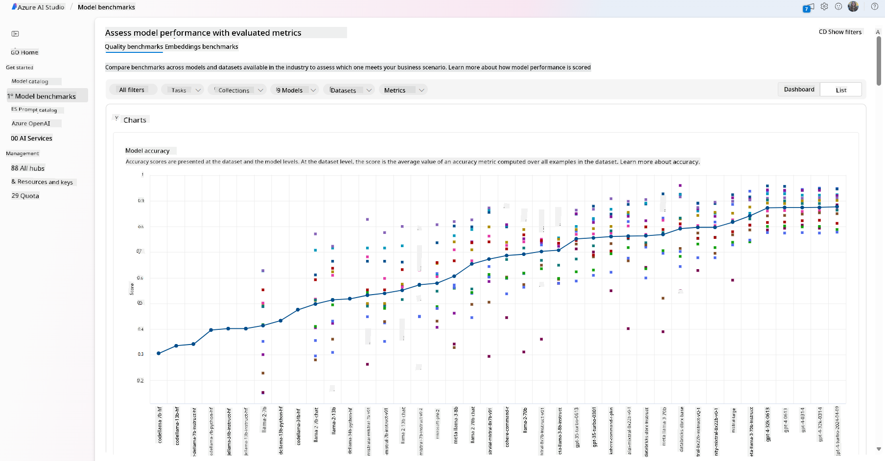

- Fine-tune the model on custom training data to improve model performance in a specific workload, leveraging the experimentation and tracking capabilities of Azure AI Studio.

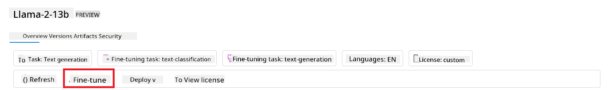

- Deploy the original pre-trained model or the fine-tuned version to a remote real-time inference - managed compute - or serverless API endpoint - [pay-as-you-go](https://learn.microsoft.com/azure/ai-studio/how-to/model-catalog-overview#model-deployment-managed-compute-and-serverless-api-pay-as-you-go?WT.mc_id=academic-105485-koreyst) - to enable applications to consume it.

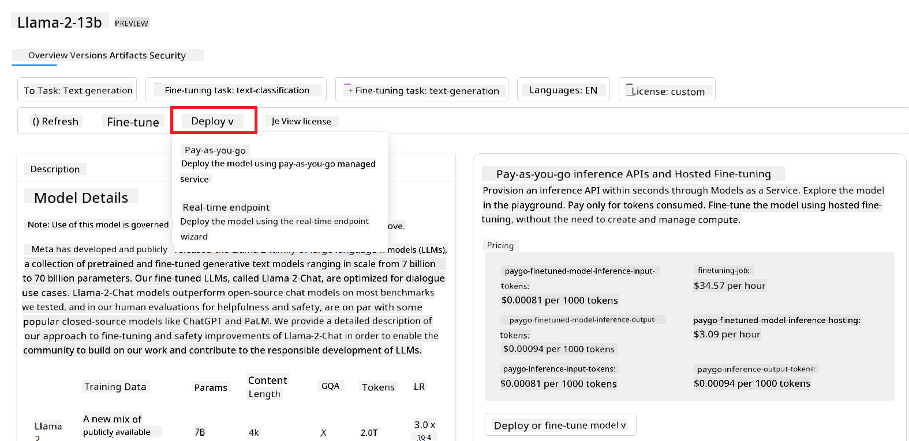

> [!NOTE]
> Not all models in the catalog are currently available for fine-tuning and/or pay-as-you-go deployment. Check the model card for details on the model's capabilities and limitations.

## Improving LLM results

We’ve explored with our startup team different kinds of LLMs and a Cloud Platform (Azure Machine Learning) enabling us to compare different models, evaluate them on test data, improve performance and deploy them on inference endpoints.

But when should they consider fine-tuning a model rather than using a pre-trained one? Are there other approaches to improve model performance on specific workloads?

There are several approaches a business can use to get the results they need from an LLM. You can select different types of models with different degrees of training when deploying an LLM in production, with different levels of complexity, cost, and quality. Here are some different approaches:

- **Prompt engineering with context**. The idea is to provide enough context when you prompt to ensure you get the responses you need.

- **Retrieval Augmented Generation, RAG**. Your data might exist in a database or web endpoint, for example, to ensure this data, or a subset of it, is included at the time of prompting, you can fetch the relevant data and make that part of the user's prompt.

- **Fine-tuned model**. Here, you trained the model further on your own data which led to the model being more exact and responsive to your needs but might be costly.

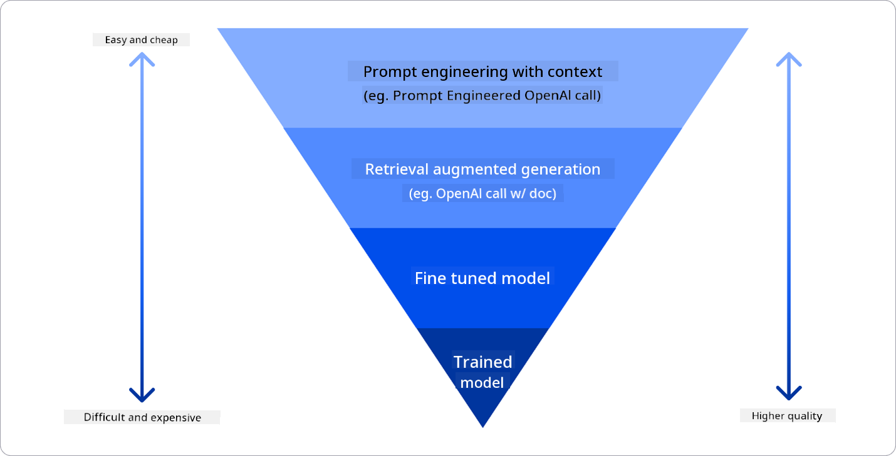

Img source: [Four Ways that Enterprises Deploy LLMs | Fiddler AI Blog](https://www.fiddler.ai/blog/four-ways-that-enterprises-deploy-llms?WT.mc_id=academic-105485-koreyst)

### Prompt Engineering with Context

Pre-trained LLMs work very well on generalized natural language tasks, even by calling them with a short prompt, like a sentence to complete or a question – the so-called “zero-shot” learning.

However, the more the user can frame their query, with a detailed request and examples – the Context – the more accurate and closest to the user’s expectations the answer will be. In this case, we talk about “one-shot” learning if the prompt includes only one example and “few-shot learning” if it includes multiple examples. Prompt engineering with context is the most cost-effective approach to start with.

### Retrieval Augmented Generation (RAG)

LLMs have the limitation that they can use only the data that has been used during their training to generate an answer. This means that they don’t know anything about the facts that happened after their training process, and they cannot access non-public information (like company data). This can be overcome through RAG, a technique that augments prompt with external data in the form of chunks of documents, considering prompt length limits. This is supported by Vector database tools (like [Azure Vector Search](https://learn.microsoft.com/azure/search/vector-search-overview?WT.mc_id=academic-105485-koreyst)) that retrieve the useful chunks from varied pre-defined data sources and add them to the prompt Context.

This technique is very helpful when a business doesn’t have enough data, enough time, or resources to fine-tune an LLM, but still wishes to improve performance on a specific workload and reduce risks of fabrications, i.e., mystification of reality or harmful content.

### Fine-tuned model

Fine-tuning is a process that leverages transfer learning to ‘adapt’ the model to a downstream task or to solve a specific problem. Differently from few-shot learning and RAG, it results in a new model being generated, with updated weights and biases. It requires a set of training examples consisting of a single input (the prompt) and its associated output (the completion). This would be the preferred approach if:

- **Using fine-tuned models**. A business would like to use fine-tuned less capable models (like embedding models) rather than high-performance models, resulting in a more cost-effective and fast solution.

- **Considering latency**. Latency is important for a specific use case, so it’s not possible to use very long prompts or the number of examples that should be learned from the model doesn’t fit with the prompt length limit.

- **Staying up to date**. A business has a lot of high-quality data and ground truth labels and the resources required to maintain this data up to date over time.

### Trained model

Training an LLM from scratch is without a doubt the most difficult and the most complex approach to adopt, requiring massive amounts of data, skilled resources, and appropriate computational power. This option should be considered only in a scenario where a business has a domain-specific use case and a large amount of domain-centric data.

## Knowledge check

What could be a good approach to improve LLM completion results?

1. Prompt engineering with context
2. RAG
3. Fine-tuned model

A: 3, if you have the time and resources and high-quality data, fine-tuning is the better option to stay up to date. However, if you're looking at improving things and you're lacking time it's worth considering RAG first.

## 🚀 Challenge

Read up more on how you can [use RAG](https://learn.microsoft.com/azure/search/retrieval-augmented-generation-overview?WT.mc_id=academic-105485-koreyst) for your business.

## Great Work, Continue Your Learning

After completing this lesson, check out our [Generative AI Learning collection](https://aka.ms/genai-collection?WT.mc_id=academic-105485-koreyst) to continue leveling up your Generative AI knowledge!

Head over to Lesson 3 where we will look at how to [build with Generative AI Responsibly](../03-using-generative-ai-responsibly/README.md?WT.mc_id=academic-105485-koreyst)!

Certainly! Here is the translation of the disclaimer text to English:

---

**Disclaimer**:  
This document has been translated using AI translation service [Co-op Translator](https://github.com/Azure/co-op-translator). While we strive for accuracy, please be aware that automated translations may contain errors or inaccuracies. The original document in its native language should be considered the authoritative source. For critical information, professional human translation is recommended. We are not liable for any misunderstandings or misinterpretations arising from the use of this translation.