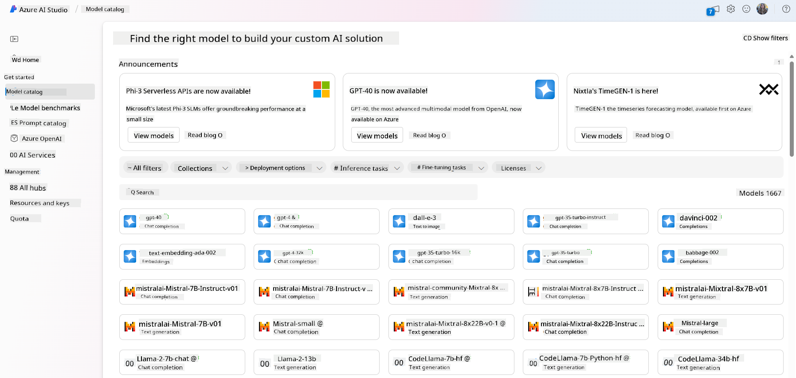

<!--
CO_OP_TRANSLATOR_METADATA:
{
  "original_hash": "6b7629b8ee4d7d874a27213e903d86a7",
  "translation_date": "2025-10-17T22:31:51+00:00",
  "source_file": "02-exploring-and-comparing-different-llms/README.md",
  "language_code": "en"
}
-->
# Exploring and comparing different LLMs

> _Click the image above to watch the video of this lesson_

In the previous lesson, we explored how Generative AI is transforming the technology landscape, how Large Language Models (LLMs) function, and how businesses—like our startup—can leverage them to address their use cases and grow. In this chapter, we will compare and contrast different types of LLMs to better understand their advantages and limitations.

The next step in our startup's journey is to explore the current LLM landscape and determine which models are most suitable for our specific use case.

## Introduction

This lesson will cover:

- The various types of LLMs available today.
- How to test, iterate, and compare different models for your use case in Azure.
- The process of deploying an LLM.

## Learning Goals

By the end of this lesson, you will be able to:

- Choose the right model for your use case.
- Understand how to test, iterate, and enhance the performance of your model.
- Learn how businesses deploy models.

## Understanding different types of LLMs

LLMs can be categorized based on their architecture, training data, and intended use case. Understanding these distinctions will help our startup choose the right model for our needs and learn how to test, iterate, and optimize its performance.

There are many types of LLMs, and the choice of model depends on factors such as the intended application, available data, budget, and more.

Depending on whether you need models for text, audio, video, image generation, or other purposes, you may opt for different types of models.

- **Audio and speech recognition**: Whisper-type models are excellent for general-purpose speech recognition. They are trained on diverse audio data and can handle multilingual speech recognition. Learn more about [Whisper-type models here](https://platform.openai.com/docs/models/whisper?WT.mc_id=academic-105485-koreyst).

- **Image generation**: For generating images, DALL-E and Midjourney are two popular options. DALL-E is available through Azure OpenAI. [Read more about DALL-E here](https://platform.openai.com/docs/models/dall-e?WT.mc_id=academic-105485-koreyst) and in Chapter 9 of this curriculum.

- **Text generation**: Many models specialize in text generation, with options ranging from GPT-3.5 to GPT-4. These models vary in cost, with GPT-4 being the most expensive. You can explore the [Azure OpenAI playground](https://oai.azure.com/portal/playground?WT.mc_id=academic-105485-koreyst) to evaluate which models best suit your needs in terms of functionality and cost.

- **Multi-modality**: If you need to process multiple types of input and output data, consider models like [GPT-4 Turbo with vision or GPT-4o](https://learn.microsoft.com/azure/ai-services/openai/concepts/models#gpt-4-and-gpt-4-turbo-models?WT.mc_id=academic-105485-koreyst)—the latest OpenAI models that combine natural language processing with visual understanding, enabling multi-modal interactions.

Choosing a model provides basic capabilities, but these may not be sufficient for your specific needs. Often, businesses have unique data that they need to integrate with the LLM. There are various approaches to achieve this, which will be discussed in the following sections.

### Foundation Models versus LLMs

The term "Foundation Model" was [introduced by Stanford researchers](https://arxiv.org/abs/2108.07258?WT.mc_id=academic-105485-koreyst) and refers to AI models that meet certain criteria, such as:

- **Training through unsupervised or self-supervised learning**: These models are trained on unlabeled multi-modal data and do not require human annotation or labeling during the training process.
- **Large-scale models**: They are built on deep neural networks with billions of parameters.
- **Serving as a foundation for other models**: These models can be fine-tuned to create specialized models for specific tasks.

Image source: [Essential Guide to Foundation Models and Large Language Models | by Babar M Bhatti | Medium](https://thebabar.medium.com/essential-guide-to-foundation-models-and-large-language-models-27dab58f7404)

To clarify this distinction further, consider ChatGPT as an example. The first version of ChatGPT was built using GPT-3.5 as the foundation model. OpenAI fine-tuned GPT-3.5 with chat-specific data to create a version optimized for conversational tasks, such as chatbots.

Image source: [2108.07258.pdf (arxiv.org)](https://arxiv.org/pdf/2108.07258.pdf?WT.mc_id=academic-105485-koreyst)

### Open Source versus Proprietary Models

LLMs can also be categorized as open-source or proprietary.

Open-source models are publicly available and can be used by anyone. They are often released by the organizations that developed them or by the research community. These models can be inspected, modified, and customized for various use cases. However, they may not be optimized for production use and might not perform as well as proprietary models. Additionally, funding for open-source models can be limited, and they may not be maintained long-term or updated with the latest advancements. Examples of popular open-source models include [Alpaca](https://crfm.stanford.edu/2023/03/13/alpaca.html?WT.mc_id=academic-105485-koreyst), [Bloom](https://huggingface.co/bigscience/bloom), and [LLaMA](https://llama.meta.com).

Proprietary models are owned by companies and are not publicly available. These models are often optimized for production use but cannot be inspected, modified, or customized for specific use cases. They are typically not free and may require a subscription or payment. Users must trust the model owner to ensure data privacy and responsible AI practices. Examples of popular proprietary models include [OpenAI models](https://platform.openai.com/docs/models/overview?WT.mc_id=academic-105485-koreyst), [Google Bard](https://sapling.ai/llm/bard?WT.mc_id=academic-105485-koreyst), and [Claude 2](https://www.anthropic.com/index/claude-2?WT.mc_id=academic-105485-koreyst).

### Embedding versus Image generation versus Text and Code generation

LLMs can also be categorized based on the type of output they produce.

Embedding models convert text into numerical representations, called embeddings, which help machines understand relationships between words or sentences. These embeddings can be used as inputs for other models, such as classification or clustering models, which perform better with numerical data. Embedding models are often used for transfer learning, where model weights (embeddings) are reused for downstream tasks. An example is [OpenAI embeddings](https://platform.openai.com/docs/models/embeddings?WT.mc_id=academic-105485-koreyst).

Image generation models create images and are used for tasks like image editing, synthesis, and translation. These models are trained on large image datasets, such as [LAION-5B](https://laion.ai/blog/laion-5b/?WT.mc_id=academic-105485-koreyst), and can generate new images or edit existing ones using techniques like inpainting, super-resolution, and colorization. Examples include [DALL-E-3](https://openai.com/dall-e-3?WT.mc_id=academic-105485-koreyst) and [Stable Diffusion models](https://github.com/Stability-AI/StableDiffusion?WT.mc_id=academic-105485-koreyst).

Text and code generation models produce text or code. They are used for tasks like text summarization, translation, and question answering. Text generation models are trained on large text datasets, such as [BookCorpus](https://www.cv-foundation.org/openaccess/content_iccv_2015/html/Zhu_Aligning_Books_and_ICCV_2015_paper.html?WT.mc_id=academic-105485-koreyst), and can generate new text or answer questions. Code generation models, like [CodeParrot](https://huggingface.co/codeparrot?WT.mc_id=academic-105485-koreyst), are trained on large code datasets, such as GitHub, and can generate new code or debug existing code.

### Encoder-Decoder versus Decoder-only

To understand different LLM architectures, let's use an analogy.

Imagine your manager asks you to create a quiz for students. You have two colleagues: one focuses on creating content, and the other on reviewing it.

The content creator is like a Decoder-only model. They can look at the topic and your initial notes to write a course based on them. They excel at generating engaging and informative content but may not fully grasp the topic or learning objectives. Examples of Decoder-only models include the GPT family, such as GPT-3.

The reviewer is like an Encoder-only model. They analyze the course and answers, understanding the relationships and context, but they are not skilled at generating content. An example of an Encoder-only model is BERT.

Now imagine someone who can both create and review the quiz. This is akin to an Encoder-Decoder model. Examples include BART and T5.

### Service versus Model

Let’s differentiate between a service and a model. A service is a product offered by a Cloud Service Provider, combining models, data, and other components. A model, on the other hand, is the core component of a service, often a foundation model like an LLM.

Services are optimized for production use and are typically easier to use, often featuring a graphical user interface. However, they are not always free and may require a subscription or payment. Services leverage the provider's infrastructure, making scaling and cost management easier. An example is [Azure OpenAI Service](https://learn.microsoft.com/azure/ai-services/openai/overview?WT.mc_id=academic-105485-koreyst), which offers a pay-as-you-go pricing model and provides enterprise-grade security and a responsible AI framework.

Models consist of the neural network, parameters, weights, and other components. Companies can run these models locally but need to invest in hardware, infrastructure, and possibly licenses. For example, the LLaMA model is available for use but requires significant computational resources.

## How to test and iterate with different models to understand performance on Azure

After exploring the current LLM landscape and identifying potential candidates for your use case, the next step is to test these models with your data and workload. This process involves iterative experimentation and performance evaluation.
Most of the models mentioned in previous paragraphs (OpenAI models, open-source models like Llama2, and Hugging Face transformers) are available in the [Model Catalog](https://learn.microsoft.com/azure/ai-studio/how-to/model-catalog-overview?WT.mc_id=academic-105485-koreyst) within [Azure AI Studio](https://ai.azure.com/?WT.mc_id=academic-105485-koreyst).

[Azure AI Studio](https://learn.microsoft.com/azure/ai-studio/what-is-ai-studio?WT.mc_id=academic-105485-koreyst) is a cloud platform designed for developers to create generative AI applications and manage the entire development lifecycle—from experimentation to evaluation—by integrating all Azure AI services into a single hub with a user-friendly interface. The Model Catalog in Azure AI Studio allows users to:

- Discover the Foundation Model of interest in the catalog—whether proprietary or open-source—by filtering based on task, license, or name. To enhance searchability, models are grouped into collections such as the Azure OpenAI collection, Hugging Face collection, and more.

- Review the model card, which includes a detailed description of intended use, training data, code samples, and evaluation results from the internal evaluations library.

- Compare benchmarks across models and datasets available in the industry to determine which one best fits the business scenario, using the [Model Benchmarks](https://learn.microsoft.com/azure/ai-studio/how-to/model-benchmarks?WT.mc_id=academic-105485-koreyst) section.

- Fine-tune the model using custom training data to enhance its performance for specific workloads, utilizing the experimentation and tracking features of Azure AI Studio.

- Deploy the original pre-trained model or the fine-tuned version for real-time inference on managed compute or serverless API endpoints—[pay-as-you-go](https://learn.microsoft.com/azure/ai-studio/how-to/model-catalog-overview#model-deployment-managed-compute-and-serverless-api-pay-as-you-go?WT.mc_id=academic-105485-koreyst)—to enable applications to utilize it.

> [!NOTE]
> Not all models in the catalog are currently available for fine-tuning and/or pay-as-you-go deployment. Check the model card for details on the model's capabilities and limitations.

## Improving LLM results

Our startup team has explored various types of LLMs and a cloud platform (Azure Machine Learning) that allows us to compare different models, evaluate them on test data, enhance performance, and deploy them to inference endpoints.

But when should they consider fine-tuning a model instead of using a pre-trained one? Are there other methods to improve model performance for specific workloads?

There are several strategies businesses can use to achieve the desired results from an LLM. Depending on the production deployment, you can choose different types of models with varying levels of training, complexity, cost, and quality. Here are some approaches:

- **Prompt engineering with context**: This involves providing sufficient context in your prompt to ensure you receive the desired responses.

- **Retrieval Augmented Generation (RAG)**: If your data is stored in a database or web endpoint, you can retrieve relevant data and include it in the user's prompt to ensure the model generates responses based on this data.

- **Fine-tuned model**: This approach involves further training the model on your own data, making it more precise and tailored to your needs, though it may be more expensive.

Img source: [Four Ways that Enterprises Deploy LLMs | Fiddler AI Blog](https://www.fiddler.ai/blog/four-ways-that-enterprises-deploy-llms?WT.mc_id=academic-105485-koreyst)

### Prompt Engineering with Context

Pre-trained LLMs perform well on general natural language tasks, even with a short prompt, such as a sentence to complete or a question—this is known as “zero-shot” learning.

However, the more detailed and specific the user’s query is, including examples—referred to as Context—the more accurate and aligned the response will be. This is called “one-shot” learning when the prompt includes one example, and “few-shot learning” when it includes multiple examples. Prompt engineering with context is the most cost-effective way to get started.

### Retrieval Augmented Generation (RAG)

LLMs are limited to using the data they were trained on to generate responses. This means they cannot provide information about events that occurred after their training or access private data (e.g., company-specific information). 

RAG addresses this limitation by augmenting prompts with external data in the form of document chunks, while considering prompt length limits. Tools like Vector databases (e.g., [Azure Vector Search](https://learn.microsoft.com/azure/search/vector-search-overview?WT.mc_id=academic-105485-koreyst)) retrieve relevant chunks from predefined data sources and add them to the prompt Context.

This approach is particularly useful for businesses that lack sufficient data, time, or resources to fine-tune an LLM but still want to improve performance for specific workloads and reduce the risk of inaccuracies or harmful content.

### Fine-tuned model

Fine-tuning is a process that uses transfer learning to adapt the model for a specific task or problem. Unlike few-shot learning and RAG, fine-tuning results in a new model with updated weights and biases. It requires a set of training examples consisting of an input (the prompt) and its corresponding output (the completion). 

This approach is ideal if:

- **Using fine-tuned models**: A business prefers using less capable fine-tuned models (e.g., embedding models) instead of high-performance models, leading to a more cost-effective and faster solution.

- **Considering latency**: If latency is critical for a specific use case, long prompts may not be feasible, or the number of examples needed exceeds the prompt length limit.

- **Staying up to date**: A business has access to high-quality data and ground truth labels, along with the resources to keep this data updated over time.

### Trained model

Training an LLM from scratch is the most challenging and complex approach, requiring vast amounts of data, skilled resources, and significant computational power. This option is best suited for businesses with domain-specific use cases and a large volume of domain-specific data.

## Knowledge check

What could be a good approach to improve LLM completion results?

1. Prompt engineering with context  
1. RAG  
1. Fine-tuned model  

A: 3, if you have the time, resources, and high-quality data, fine-tuning is the better option to stay up to date. However, if you're looking to improve results and lack time, RAG is worth considering first.

## 🚀 Challenge

Learn more about how you can [use RAG](https://learn.microsoft.com/azure/search/retrieval-augmented-generation-overview?WT.mc_id=academic-105485-koreyst) for your business.

## Great Work, Continue Your Learning

After completing this lesson, explore our [Generative AI Learning collection](https://aka.ms/genai-collection?WT.mc_id=academic-105485-koreyst) to further enhance your knowledge of Generative AI!

Proceed to Lesson 3, where we’ll discuss how to [build with Generative AI responsibly](../03-using-generative-ai-responsibly/README.md?WT.mc_id=academic-105485-koreyst)!

---

**Disclaimer**:  
This document has been translated using the AI translation service [Co-op Translator](https://github.com/Azure/co-op-translator). While we aim for accuracy, please note that automated translations may include errors or inaccuracies. The original document in its native language should be regarded as the authoritative source. For critical information, professional human translation is advised. We are not responsible for any misunderstandings or misinterpretations resulting from the use of this translation.