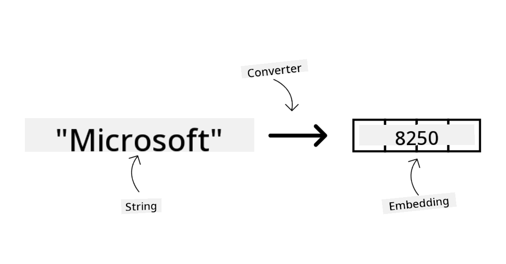
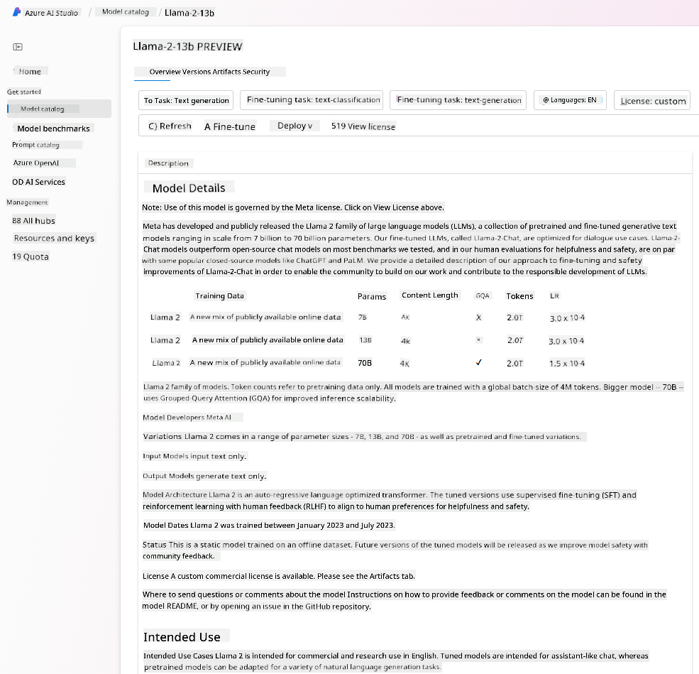

<!--
CO_OP_TRANSLATOR_METADATA:
{
  "original_hash": "e2f686f2eb794941761252ac5e8e090b",
  "translation_date": "2025-07-09T08:06:44+00:00",
  "source_file": "02-exploring-and-comparing-different-llms/README.md",
  "language_code": "en"
}
-->
# Exploring and comparing different LLMs

> _Click the image above to watch the video for this lesson_

In the previous lesson, we saw how Generative AI is transforming the technology landscape, how Large Language Models (LLMs) work, and how a business—like our startup—can apply them to their use cases and grow! In this chapter, we will compare and contrast different types of large language models (LLMs) to understand their strengths and weaknesses.

The next step in our startup’s journey is to explore the current LLM landscape and determine which models are best suited for our use case.

## Introduction

This lesson will cover:

- Different types of LLMs available today.
- How to test, iterate, and compare different models for your use case in Azure.
- How to deploy an LLM.

## Learning Goals

By the end of this lesson, you will be able to:

- Choose the right model for your use case.
- Understand how to test, iterate, and improve your model’s performance.
- Know how businesses deploy models.

## Understanding different types of LLMs

LLMs can be categorized in various ways based on their architecture, training data, and intended use. Understanding these differences will help our startup pick the right model for the scenario and know how to test, iterate, and enhance performance.

There are many types of LLMs, and your choice depends on your intended use, data, budget, and more.

Depending on whether you want to use the models for text, audio, video, image generation, etc., you might choose a different type of model.

- **Audio and speech recognition**. Whisper-type models are a great choice here as they are general-purpose and designed for speech recognition. They are trained on diverse audio and can perform multilingual speech recognition. Learn more about [Whisper type models here](https://platform.openai.com/docs/models/whisper?WT.mc_id=academic-105485-koreyst).

- **Image generation**. For image generation, DALL-E and Midjourney are two well-known options. DALL-E is available through Azure OpenAI. [Read more about DALL-E here](https://platform.openai.com/docs/models/dall-e?WT.mc_id=academic-105485-koreyst) and also in Chapter 9 of this curriculum.

- **Text generation**. Most models are trained for text generation, and you have a wide range of options from GPT-3.5 to GPT-4. They come at different price points, with GPT-4 being the most expensive. It’s worth exploring the [Azure OpenAI playground](https://oai.azure.com/portal/playground?WT.mc_id=academic-105485-koreyst) to evaluate which models best fit your needs in terms of capability and cost.

- **Multi-modality**. If you want to handle multiple types of input and output data, consider models like [gpt-4 turbo with vision or gpt-4o](https://learn.microsoft.com/azure/ai-services/openai/concepts/models#gpt-4-and-gpt-4-turbo-models?WT.mc_id=academic-105485-koreyst)—the latest OpenAI releases—which combine natural language processing with visual understanding, enabling interactions through multi-modal interfaces.

Choosing a model gives you basic capabilities, but that might not be enough. Often, you have company-specific data that you need to incorporate into the LLM. There are several ways to approach this, which we will cover in upcoming sections.

### Foundation Models versus LLMs

The term Foundation Model was [coined by Stanford researchers](https://arxiv.org/abs/2108.07258?WT.mc_id=academic-105485-koreyst) and defined as an AI model that meets certain criteria, such as:

- **They are trained using unsupervised or self-supervised learning**, meaning they learn from unlabeled multi-modal data and don’t require human annotation or labeling during training.
- **They are very large models**, based on deep neural networks trained on billions of parameters.
- **They are typically intended to serve as a ‘foundation’ for other models**, meaning they can be used as a starting point for building other models through fine-tuning.

Image source: [Essential Guide to Foundation Models and Large Language Models | by Babar M Bhatti | Medium](https://thebabar.medium.com/essential-guide-to-foundation-models-and-large-language-models-27dab58f7404)

To clarify this distinction, let’s take ChatGPT as an example. The first version of ChatGPT was built on a foundation model called GPT-3.5. OpenAI used chat-specific data to fine-tune GPT-3.5, creating a version specialized for conversational scenarios like chatbots.

Image source: [2108.07258.pdf (arxiv.org)](https://arxiv.org/pdf/2108.07258.pdf?WT.mc_id=academic-105485-koreyst)

### Open Source versus Proprietary Models

Another way to categorize LLMs is whether they are open source or proprietary.

Open-source models are publicly available and can be used by anyone. They are often released by the company that created them or by the research community. These models can be inspected, modified, and customized for various LLM use cases. However, they are not always optimized for production and may not perform as well as proprietary models. Funding for open-source models can be limited, so they may not be maintained long-term or updated with the latest research. Popular open-source models include [Alpaca](https://crfm.stanford.edu/2023/03/13/alpaca.html?WT.mc_id=academic-105485-koreyst), [Bloom](https://huggingface.co/bigscience/bloom), and [LLaMA](https://llama.meta.com).

Proprietary models are owned by companies and are not publicly available. These models are often optimized for production use but cannot be inspected, modified, or customized for different use cases. They are usually not free and may require a subscription or payment. Users also don’t control the data used to train the model, so they must trust the model owner to ensure data privacy and responsible AI use. Examples of popular proprietary models include [OpenAI models](https://platform.openai.com/docs/models/overview?WT.mc_id=academic-105485-koreyst), [Google Bard](https://sapling.ai/llm/bard?WT.mc_id=academic-105485-koreyst), and [Claude 2](https://www.anthropic.com/index/claude-2?WT.mc_id=academic-105485-koreyst).

### Embedding versus Image generation versus Text and Code generation

LLMs can also be categorized by the type of output they produce.

Embeddings are models that convert text into numerical vectors called embeddings, which represent the input text numerically. Embeddings help machines understand relationships between words or sentences and can be used as inputs for other models, such as classifiers or clustering algorithms that perform better with numerical data. Embedding models are often used for transfer learning, where a model is trained on a surrogate task with abundant data, and the learned embeddings are reused for other downstream tasks. An example is [OpenAI embeddings](https://platform.openai.com/docs/models/embeddings?WT.mc_id=academic-105485-koreyst).

Image generation models create images. They are used for image editing, synthesis, and translation. These models are trained on large image datasets like [LAION-5B](https://laion.ai/blog/laion-5b/?WT.mc_id=academic-105485-koreyst) and can generate new images or edit existing ones using techniques like inpainting, super-resolution, and colorization. Examples include [DALL-E-3](https://openai.com/dall-e-3?WT.mc_id=academic-105485-koreyst) and [Stable Diffusion models](https://github.com/Stability-AI/StableDiffusion?WT.mc_id=academic-105485-koreyst).

Text and code generation models produce text or code. They are used for tasks like summarization, translation, and question answering. Text generation models are trained on large text datasets such as [BookCorpus](https://www.cv-foundation.org/openaccess/content_iccv_2015/html/Zhu_Aligning_Books_and_ICCV_2015_paper.html?WT.mc_id=academic-105485-koreyst) and can generate new text or answer questions. Code generation models, like [CodeParrot](https://huggingface.co/codeparrot?WT.mc_id=academic-105485-koreyst), are trained on large code datasets like GitHub and can generate new code or fix bugs.

### Encoder-Decoder versus Decoder-only

To explain different LLM architectures, let’s use an analogy.

Imagine your manager asks you to create a quiz for students. You have two colleagues: one creates the content, and the other reviews it.

The content creator is like a Decoder-only model. They look at the topic and what you’ve already written, then write the course content. They excel at producing engaging and informative text but aren’t great at understanding the topic or learning objectives. Examples of Decoder models include the GPT family, such as GPT-3.

The reviewer is like an Encoder-only model. They examine the written course and answers, understand the relationships and context, but aren’t good at generating content. An example of an Encoder-only model is BERT.

Now imagine someone who can both create and review the quiz—that’s an Encoder-Decoder model. Examples include BART and T5.

### Service versus Model

Let’s discuss the difference between a service and a model. A service is a product offered by a Cloud Service Provider, often combining models, data, and other components. A model is the core part of a service, often a foundation model like an LLM.

Services are usually optimized for production and easier to use than models, often through a graphical interface. However, services are not always free and may require a subscription or payment, which covers the provider’s infrastructure, optimizes costs, and allows easy scaling. An example is [Azure OpenAI Service](https://learn.microsoft.com/azure/ai-services/openai/overview?WT.mc_id=academic-105485-koreyst), which offers pay-as-you-go pricing, charging users based on usage. Azure OpenAI Service also provides enterprise-grade security and a responsible AI framework on top of the models.

Models are just the neural networks with parameters and weights. Companies can run them locally but need to invest in hardware, build infrastructure to scale, and obtain licenses or use open-source models. For example, LLaMA is available for use but requires computational resources to run.

## How to test and iterate with different models to understand performance on Azure

After exploring the current LLM landscape and identifying promising candidates for their scenarios, the next step for our team is to test these models on their data and workload. This is an iterative process involving experiments and measurements.
Most of the models we mentioned in previous sections (OpenAI models, open source models like Llama2, and Hugging Face transformers) are available in the [Model Catalog](https://learn.microsoft.com/azure/ai-studio/how-to/model-catalog-overview?WT.mc_id=academic-105485-koreyst) in [Azure AI Studio](https://ai.azure.com/?WT.mc_id=academic-105485-koreyst).

[Azure AI Studio](https://learn.microsoft.com/azure/ai-studio/what-is-ai-studio?WT.mc_id=academic-105485-koreyst) is a cloud platform designed for developers to build generative AI applications and manage the entire development lifecycle—from experimentation to evaluation—by combining all Azure AI services into a single hub with a user-friendly GUI. The Model Catalog in Azure AI Studio allows users to:

- Find the Foundation Model of interest in the catalog—either proprietary or open source—by filtering by task, license, or name. To improve searchability, models are organized into collections, such as the Azure OpenAI collection, Hugging Face collection, and more.

- Review the model card, which includes a detailed description of intended use and training data, code samples, and evaluation results from the internal evaluations library.

- Compare benchmarks across models and datasets available in the industry to determine which one best fits the business scenario, through the [Model Benchmarks](https://learn.microsoft.com/azure/ai-studio/how-to/model-benchmarks?WT.mc_id=academic-105485-koreyst) pane.

- Fine-tune the model on custom training data to improve performance on a specific workload, leveraging the experimentation and tracking features of Azure AI Studio.

- Deploy either the original pre-trained model or the fine-tuned version to a remote real-time inference managed compute or serverless API endpoint—[pay-as-you-go](https://learn.microsoft.com/azure/ai-studio/how-to/model-catalog-overview#model-deployment-managed-compute-and-serverless-api-pay-as-you-go?WT.mc_id=academic-105485-koreyst)—to enable applications to consume it.

> [!NOTE]
> Not all models in the catalog are currently available for fine-tuning and/or pay-as-you-go deployment. Check the model card for details on the model's capabilities and limitations.

## Improving LLM results

Our startup team has explored various types of LLMs and a cloud platform (Azure Machine Learning) that allows us to compare different models, evaluate them on test data, improve performance, and deploy them on inference endpoints.

But when should you consider fine-tuning a model instead of using a pre-trained one? Are there other ways to improve model performance on specific tasks?

There are several strategies a business can use to get the results they need from an LLM. You can choose different types of models with varying levels of training when deploying an LLM in production, each with different complexity, cost, and quality. Here are some approaches:

- **Prompt engineering with context**. The idea is to provide enough context in your prompt to ensure you get the responses you want.

- **Retrieval Augmented Generation (RAG)**. Your data might be stored in a database or web endpoint, for example. To include this data—or a subset of it—at the time of prompting, you can fetch the relevant information and add it to the user's prompt.

- **Fine-tuned model**. Here, you further train the model on your own data, making it more precise and responsive to your needs, though this might be costly.

Img source: [Four Ways that Enterprises Deploy LLMs | Fiddler AI Blog](https://www.fiddler.ai/blog/four-ways-that-enterprises-deploy-llms?WT.mc_id=academic-105485-koreyst)

### Prompt Engineering with Context

Pre-trained LLMs perform very well on general natural language tasks, even when given a short prompt, like a sentence to complete or a question—this is known as “zero-shot” learning.

However, the more the user can frame their query with a detailed request and examples—the Context—the more accurate and aligned with the user’s expectations the answer will be. In this case, it’s called “one-shot” learning if the prompt includes only one example, and “few-shot learning” if it includes multiple examples. Prompt engineering with context is the most cost-effective way to get started.

### Retrieval Augmented Generation (RAG)

LLMs are limited to using only the data they were trained on to generate answers. This means they don’t know about events that happened after their training, nor can they access private information (like company data).

RAG overcomes this by augmenting the prompt with external data in the form of document chunks, while respecting prompt length limits. This is supported by vector database tools (like [Azure Vector Search](https://learn.microsoft.com/azure/search/vector-search-overview?WT.mc_id=academic-105485-koreyst)) that retrieve relevant chunks from various predefined data sources and add them to the prompt context.

This technique is especially useful when a business lacks enough data, time, or resources to fine-tune an LLM but still wants to improve performance on a specific task and reduce risks of hallucinations—i.e., fabrications or harmful content.

### Fine-tuned model

Fine-tuning uses transfer learning to adapt the model to a specific downstream task or problem. Unlike few-shot learning and RAG, it produces a new model with updated weights and biases. It requires a set of training examples consisting of an input (the prompt) and its corresponding output (the completion).

This approach is preferred if:

- **Using fine-tuned models**. A business wants to use fine-tuned, less powerful models (like embedding models) instead of high-performance ones, resulting in a more cost-effective and faster solution.

- **Considering latency**. Latency is critical for a use case, so very long prompts or many examples aren’t feasible due to prompt length limits.

- **Staying up to date**. A business has a lot of high-quality data and ground truth labels, plus the resources to keep this data current over time.

### Trained model

Training an LLM from scratch is by far the most difficult and complex approach, requiring massive amounts of data, skilled personnel, and significant computational power. This option should only be considered if a business has a domain-specific use case and a large volume of domain-centric data.

## Knowledge check

What could be a good approach to improve LLM completion results?

1. Prompt engineering with context  
2. RAG  
3. Fine-tuned model

A: 3. If you have the time, resources, and high-quality data, fine-tuning is the best option to stay up to date. However, if you want to improve results but lack time, it’s worth considering RAG first.

## 🚀 Challenge

Learn more about how you can [use RAG](https://learn.microsoft.com/azure/search/retrieval-augmented-generation-overview?WT.mc_id=academic-105485-koreyst) for your business.

## Great Work, Continue Your Learning

After completing this lesson, check out our [Generative AI Learning collection](https://aka.ms/genai-collection?WT.mc_id=academic-105485-koreyst) to keep advancing your Generative AI knowledge!

Head over to Lesson 3 where we will explore how to [build with Generative AI Responsibly](../03-using-generative-ai-responsibly/README.md?WT.mc_id=academic-105485-koreyst)!

**Disclaimer**:  
This document has been translated using the AI translation service [Co-op Translator](https://github.com/Azure/co-op-translator). While we strive for accuracy, please be aware that automated translations may contain errors or inaccuracies. The original document in its native language should be considered the authoritative source. For critical information, professional human translation is recommended. We are not liable for any misunderstandings or misinterpretations arising from the use of this translation.