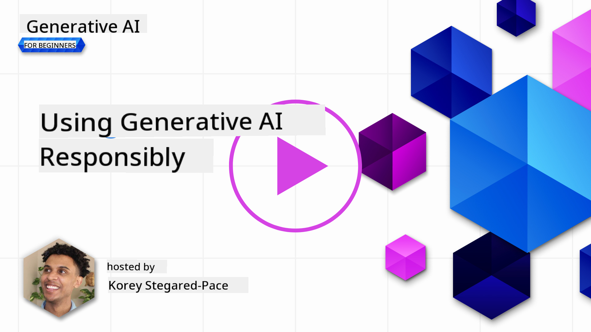
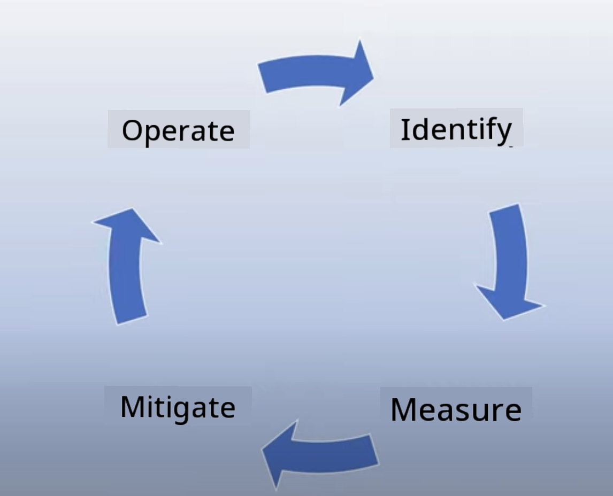
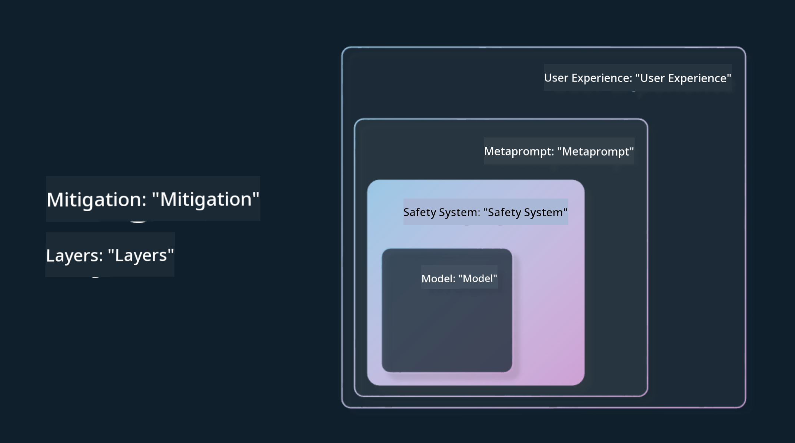

<!--
CO_OP_TRANSLATOR_METADATA:
{
  "original_hash": "7f8f4c11f8c1cb6e1794442dead414ea",
  "translation_date": "2025-07-09T08:45:44+00:00",
  "source_file": "03-using-generative-ai-responsibly/README.md",
  "language_code": "en"
}
-->
# Using Generative AI Responsibly

> _Click the image above to watch the video for this lesson_

It’s easy to get excited about AI, especially generative AI, but it’s important to think about how to use it responsibly. You need to consider how to ensure the output is fair, safe, and more. This chapter will give you the context you need, what to keep in mind, and how to take practical steps to improve your AI usage.

## Introduction

This lesson will cover:

- Why Responsible AI should be a priority when building Generative AI applications.
- The core principles of Responsible AI and how they apply to Generative AI.
- How to apply these Responsible AI principles through strategy and tools.

## Learning Goals

By the end of this lesson, you will understand:

- Why Responsible AI matters when building Generative AI applications.
- When and how to apply the core principles of Responsible AI in your projects.
- What tools and strategies you can use to put Responsible AI into practice.

## Responsible AI Principles

The excitement around Generative AI has never been greater. This enthusiasm has attracted many new developers, attention, and funding to the field. While this is great for anyone building products and companies with Generative AI, it’s crucial to move forward responsibly.

Throughout this course, we focus on building our startup and AI education product. We’ll use the principles of Responsible AI: Fairness, Inclusiveness, Reliability/Safety, Security & Privacy, Transparency, and Accountability. We’ll explore how these principles relate to our use of Generative AI in our products.

## Why Should You Prioritize Responsible AI

When building a product, taking a human-centered approach that keeps your users’ best interests in mind leads to the best outcomes.

Generative AI’s unique strength is its ability to create helpful answers, information, guidance, and content for users with minimal manual effort, often producing impressive results. However, without proper planning and strategies, it can also cause harm to your users, your product, and society.

Let’s look at some (but not all) of these potential risks:

### Hallucinations

Hallucinations refer to when an LLM generates content that is either completely nonsensical or factually incorrect based on other reliable sources.

For example, imagine we build a feature for our startup that lets students ask historical questions to a model. A student asks, `Who was the sole survivor of Titanic?`

The model responds with something like this:

> _(Source: [Flying bisons](https://flyingbisons.com?WT.mc_id=academic-105485-koreyst))_

This is a confident and detailed answer, but it’s wrong. Even a quick check would show there was more than one survivor of the Titanic disaster. For a student just starting research, this answer might seem convincing enough not to question and be accepted as fact. This can make the AI system seem unreliable and damage our startup’s reputation.

With each new version of LLMs, we’ve seen improvements in reducing hallucinations. Still, as developers and users, we need to stay aware of these limitations.

### Harmful Content

Earlier, we discussed when an LLM produces incorrect or nonsensical answers. Another risk is when a model generates harmful content.

Harmful content includes:

- Giving instructions or encouraging self-harm or harm to specific groups.
- Hateful or degrading language.
- Planning or guiding violent or attack-related actions.
- Instructions on finding illegal content or committing illegal acts.
- Displaying sexually explicit material.

For our startup, it’s essential to have the right tools and strategies to prevent students from seeing this kind of content.

### Lack of Fairness

Fairness means “ensuring an AI system is free from bias and discrimination and treats everyone fairly and equally.” In Generative AI, we want to avoid reinforcing exclusionary views of marginalized groups through the model’s output.

Such outputs not only harm the user experience but also cause broader societal damage. As developers, we should always consider a diverse and inclusive user base when building Generative AI solutions.

## How to Use Generative AI Responsibly

Now that we understand the importance of Responsible Generative AI, here are 4 steps to help build AI solutions responsibly:

### Measure Potential Harms

In software testing, we test expected user actions on an app. Similarly, testing a wide range of prompts users are likely to use helps identify potential harms.

Since our startup builds an education product, it’s useful to prepare a list of education-related prompts. These could cover specific subjects, historical facts, or student life topics.

### Mitigate Potential Harms

Next, we find ways to prevent or reduce potential harm from the model’s responses. We can approach this in 4 layers:

- **Model**. Choose the right model for your use case. Larger, more complex models like GPT-4 may pose higher risks of harmful content when used for smaller, specific tasks. Fine-tuning with your own training data can also reduce harmful outputs.

- **Safety System**. A safety system includes tools and settings on the platform hosting the model to help reduce harm. For example, Azure OpenAI’s content filtering system. These systems should also detect jailbreak attempts and unwanted activities like bot requests.

- **Metaprompt**. Metaprompts and grounding techniques help guide or limit the model’s behavior. This might involve system inputs that set boundaries or ensure outputs stay relevant to the system’s domain.

It can also include methods like Retrieval Augmented Generation (RAG), where the model only pulls information from trusted sources. There’s a later lesson on [building search applications](../08-building-search-applications/README.md?WT.mc_id=academic-105485-koreyst).

- **User Experience**. The final layer is where users interact with the model through your app’s interface. Here, you can design the UI/UX to restrict the types of inputs users can send and control the text or images shown. When launching your AI app, be transparent about what your Generative AI can and cannot do.

We have a full lesson on [Designing UX for AI Applications](../12-designing-ux-for-ai-applications/README.md?WT.mc_id=academic-105485-koreyst).

- **Evaluate model**. Working with LLMs can be tricky since we don’t always control the training data. Still, it’s important to evaluate the model’s performance and outputs regularly. Measure accuracy, similarity, groundedness, and relevance to build transparency and trust with users and stakeholders.

### Operate a Responsible Generative AI solution

The final step is building operational practices around your AI applications. This means collaborating with other parts of your startup, like Legal and Security, to ensure compliance with regulations. Before launch, create plans for delivery, incident handling, and rollback to minimize harm to users.

## Tools

Developing Responsible AI solutions may seem like a lot of work, but it’s well worth it. As Generative AI grows, more tools will emerge to help developers integrate responsibility efficiently. For example, [Azure AI Content Safety](https://learn.microsoft.com/azure/ai-services/content-safety/overview?WT.mc_id=academic-105485-koreyst) can detect harmful content and images through an API.

## Knowledge check

What are some key concerns to ensure responsible AI use?

1. That the answer is correct.  
1. Preventing harmful use, ensuring AI isn’t used for criminal purposes.  
1. Making sure AI is free from bias and discrimination.

A: 2 and 3 are correct. Responsible AI focuses on mitigating harmful effects, biases, and more.

## 🚀 Challenge

Explore [Azure AI Content Safety](https://learn.microsoft.com/azure/ai-services/content-safety/overview?WT.mc_id=academic-105485-koreyst) and see what you can apply to your own use.

## Great Work, Continue Your Learning

After finishing this lesson, check out our [Generative AI Learning collection](https://aka.ms/genai-collection?WT.mc_id=academic-105485-koreyst) to keep advancing your Generative AI skills!

Head over to Lesson 4 where we’ll dive into [Prompt Engineering Fundamentals](../04-prompt-engineering-fundamentals/README.md?WT.mc_id=academic-105485-koreyst)!

**Disclaimer**:  
This document has been translated using the AI translation service [Co-op Translator](https://github.com/Azure/co-op-translator). While we strive for accuracy, please be aware that automated translations may contain errors or inaccuracies. The original document in its native language should be considered the authoritative source. For critical information, professional human translation is recommended. We are not liable for any misunderstandings or misinterpretations arising from the use of this translation.