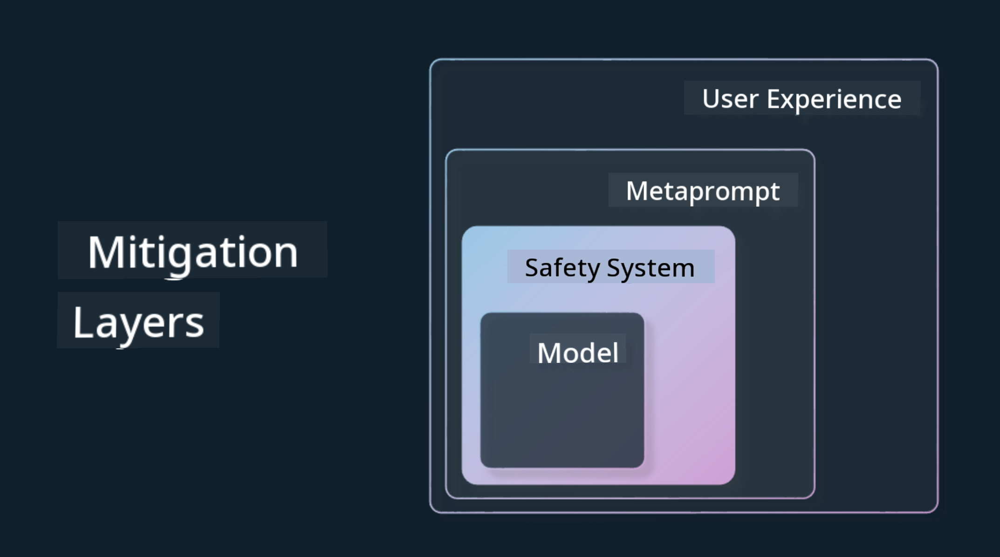

<!--
CO_OP_TRANSLATOR_METADATA:
{
  "original_hash": "4d57fad773cbeb69c5dd62e65c34200d",
  "translation_date": "2025-10-17T22:30:59+00:00",
  "source_file": "03-using-generative-ai-responsibly/README.md",
  "language_code": "en"
}
-->
# Using Generative AI Responsibly

> _Click the image above to view the video of this lesson_

Generative AI can be fascinating, but it’s important to consider how to use it responsibly. You need to think about ensuring the output is fair, non-harmful, and more. This chapter aims to provide the necessary context, key considerations, and actionable steps to improve your use of AI responsibly.

## Introduction

This lesson will cover:

- Why Responsible AI should be a priority when building Generative AI applications.
- Core principles of Responsible AI and their relevance to Generative AI.
- Strategies and tools to implement Responsible AI principles in practice.

## Learning Goals

After completing this lesson, you will understand:

- The significance of Responsible AI in developing Generative AI applications.
- When and how to apply the core principles of Responsible AI in Generative AI development.
- Available tools and strategies to implement Responsible AI effectively.

## Responsible AI Principles

The excitement surrounding Generative AI is at an all-time high. This enthusiasm has attracted many new developers, attention, and funding to the field. While this is great for those building products and companies with Generative AI, it’s crucial to proceed responsibly.

Throughout this course, we focus on building our startup and AI education product using the principles of Responsible AI: Fairness, Inclusiveness, Reliability/Safety, Security & Privacy, Transparency, and Accountability. We will explore how these principles apply to our use of Generative AI in our products.

## Why Should You Prioritize Responsible AI

When creating a product, adopting a human-centric approach that prioritizes your users’ best interests often yields the best results.

Generative AI is unique in its ability to produce helpful answers, information, guidance, and content for users with minimal manual effort, often leading to impressive outcomes. However, without proper planning and strategies, it can also result in harmful consequences for your users, your product, and society.

Let’s examine some of these potential harmful outcomes:

### Hallucinations

Hallucinations refer to instances where a large language model (LLM) generates content that is either nonsensical or factually incorrect based on other sources of information.

For example, imagine our startup develops a feature that allows students to ask historical questions to a model. A student asks, `Who was the sole survivor of Titanic?`

The model generates the following response:

> _(Source: [Flying bisons](https://flyingbisons.com?WT.mc_id=academic-105485-koreyst))_

This response is confident and detailed but incorrect. Even minimal research would reveal that there were multiple survivors of the Titanic disaster. For a student new to the topic, this answer might seem convincing enough to be accepted as fact. Such inaccuracies can make the AI system unreliable and harm the reputation of our startup.

Although each iteration of LLMs has shown improvements in reducing hallucinations, application developers and users must remain vigilant about these limitations.

### Harmful Content

In addition to incorrect or nonsensical responses, there’s a risk of models generating harmful content.

Harmful content includes:

- Instructions or encouragement for self-harm or harm to specific groups.
- Hateful or demeaning language.
- Guidance for planning attacks or violent acts.
- Instructions for accessing illegal content or committing illegal acts.
- Displaying sexually explicit material.

For our startup, it’s essential to implement tools and strategies to prevent students from encountering such content.

### Lack of Fairness

Fairness means ensuring that an AI system is free from bias and discrimination, treating everyone equally and fairly. In the realm of Generative AI, it’s crucial to prevent the reinforcement of exclusionary worldviews or biases against marginalized groups in the model’s output.

Such outputs not only harm the user experience but also contribute to broader societal issues. As developers, we must consider a diverse user base when creating solutions with Generative AI.

## How to Use Generative AI Responsibly

Now that we understand the importance of Responsible Generative AI, let’s explore four steps to build AI solutions responsibly:

### Measure Potential Harms

In software testing, we evaluate expected user actions within an application. Similarly, testing a diverse set of prompts that users are likely to use can help identify potential harm.

For our education-focused startup, it’s beneficial to prepare a list of prompts related to education, such as specific subjects, historical facts, and student life.

### Mitigate Potential Harms

Next, we need to find ways to prevent or minimize potential harm caused by the model and its responses. This can be approached through four layers:

- **Model**: Select the appropriate model for the specific use case. Larger, more complex models like GPT-4 may pose greater risks of harmful content when applied to narrow use cases. Fine-tuning with your training data can help reduce these risks.

- **Safety System**: Implement a safety system with tools and configurations on the platform hosting the model to mitigate harm. For example, the Azure OpenAI service includes a content filtering system. Safety systems should also detect jailbreak attacks and unwanted activities, such as bot requests.

- **Metaprompt**: Use metaprompts and grounding to guide or limit the model’s behavior and information. This can involve system inputs that define the model’s boundaries or techniques like Retrieval Augmented Generation (RAG) to ensure the model uses information from trusted sources. A later lesson in this course will cover [building search applications](../08-building-search-applications/README.md?WT.mc_id=academic-105485-koreyst).

- **User Experience**: Design the user interface and experience to restrict the types of inputs users can provide to the model and control the text or images displayed to users. Transparency about the capabilities and limitations of your Generative AI application is also essential.

We have a dedicated lesson on [Designing UX for AI Applications](../12-designing-ux-for-ai-applications/README.md?WT.mc_id=academic-105485-koreyst).

- **Evaluate Model**: Working with LLMs can be challenging due to limited control over the training data. Nevertheless, it’s crucial to evaluate the model’s performance and outputs, including accuracy, relevance, groundedness, and similarity. This evaluation fosters transparency and trust among stakeholders and users.

### Operate a Responsible Generative AI Solution

The final stage involves establishing operational practices for your AI applications. Collaborate with other teams in your startup, such as Legal and Security, to ensure compliance with regulatory policies. Before launching, develop plans for delivery, incident management, and rollback to minimize potential harm to users.

## Tools

Although developing Responsible AI solutions may seem challenging, it is a worthwhile endeavor. As Generative AI continues to evolve, more tools will emerge to help developers integrate responsibility into their workflows efficiently. For instance, [Azure AI Content Safety](https://learn.microsoft.com/azure/ai-services/content-safety/overview?WT.mc_id=academic-105485-koreyst) can detect harmful content and images through API requests.

## Knowledge Check

What are some things you need to consider to ensure responsible AI usage?

1. That the answer is correct.
2. Harmful usage, ensuring AI isn’t used for criminal purposes.
3. Ensuring the AI is free from bias and discrimination.

A: 2 and 3 are correct. Responsible AI helps you consider how to mitigate harmful effects, biases, and more.

## 🚀 Challenge

Learn more about [Azure AI Content Safety](https://learn.microsoft.com/azure/ai-services/content-safety/overview?WT.mc_id=academic-105485-koreyst) and explore how you can incorporate it into your work.

## Great Work, Continue Your Learning

After completing this lesson, check out our [Generative AI Learning collection](https://aka.ms/genai-collection?WT.mc_id=academic-105485-koreyst) to further enhance your knowledge of Generative AI!

Proceed to Lesson 4, where we’ll dive into [Prompt Engineering Fundamentals](../04-prompt-engineering-fundamentals/README.md?WT.mc_id=academic-105485-koreyst)!

---

**Disclaimer**:  
This document has been translated using the AI translation service [Co-op Translator](https://github.com/Azure/co-op-translator). While we aim for accuracy, please note that automated translations may include errors or inaccuracies. The original document in its native language should be regarded as the authoritative source. For critical information, professional human translation is advised. We are not responsible for any misunderstandings or misinterpretations resulting from the use of this translation.