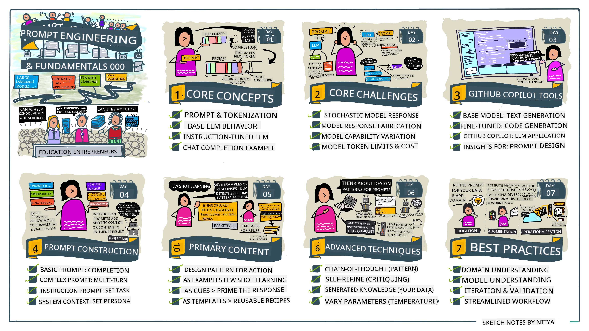

<!--
CO_OP_TRANSLATOR_METADATA:
{
  "original_hash": "8b3cb38518cf4fe7714d2f5e74dfa3eb",
  "translation_date": "2025-10-03T08:03:27+00:00",
  "source_file": "04-prompt-engineering-fundamentals/README.md",
  "language_code": "en"
}
-->
# Prompt Engineering Fundamentals

[](https://aka.ms/gen-ai-lesson4-gh?WT.mc_id=academic-105485-koreyst)

## Introduction
This module introduces key concepts and techniques for crafting effective prompts for generative AI models. The way you structure your prompt for an LLM is crucial. A well-designed prompt can significantly improve the quality of the response. But what do terms like _prompt_ and _prompt engineering_ actually mean? And how can you enhance the prompt _input_ you send to the LLM? These are the questions we'll explore in this chapter and the next.

_Generative AI_ can create new content (e.g., text, images, audio, code, etc.) in response to user requests. It accomplishes this using _Large Language Models_ like OpenAI's GPT ("Generative Pre-trained Transformer") series, which are trained to understand and generate natural language and code.

Users can interact with these models through familiar interfaces like chat, without requiring technical expertise or training. These models are _prompt-based_—users provide a text input (prompt) and receive an AI-generated response (completion). They can then engage in iterative, multi-turn conversations with the AI, refining their prompts until the response meets their expectations.

"Prompts" have become the primary _programming interface_ for generative AI applications, guiding the models on what to do and influencing the quality of the responses. "Prompt Engineering" is an emerging field focused on the _design and optimization_ of prompts to achieve consistent and high-quality responses at scale.

## Learning Goals

In this lesson, we will explore what Prompt Engineering is, why it is important, and how to craft more effective prompts for specific models and application objectives. We'll cover core concepts and best practices for prompt engineering and learn about an interactive Jupyter Notebooks "sandbox" environment where these concepts can be applied to real-world examples.

By the end of this lesson, you will be able to:

1. Explain what prompt engineering is and why it is important.
2. Describe the components of a prompt and their usage.
3. Apply best practices and techniques for prompt engineering.
4. Use learned techniques in real examples with an OpenAI endpoint.

## Key Terms

Prompt Engineering: The practice of designing and refining inputs to guide AI models toward producing desired outputs.  
Tokenization: The process of breaking text into smaller units, called tokens, that a model can understand and process.  
Instruction-Tuned LLMs: Large Language Models (LLMs) fine-tuned with specific instructions to improve response accuracy and relevance.

## Learning Sandbox

Prompt engineering is currently more of an art than a science. The best way to develop intuition for it is through _practice_ and a trial-and-error approach that combines domain expertise with recommended techniques and model-specific optimizations.

The Jupyter Notebook accompanying this lesson provides a _sandbox_ environment where you can experiment with what you learn—either as you progress through the lesson or as part of the code challenge at the end. To execute the exercises, you will need:

1. **An Azure OpenAI API key**—the service endpoint for a deployed LLM.  
2. **A Python Runtime**—to execute the Notebook.  
3. **Local Environment Variables**—_complete the [SETUP](./../00-course-setup/02-setup-local.md?WT.mc_id=academic-105485-koreyst) steps now to prepare_.  

The notebook includes _starter_ exercises, but you are encouraged to add your own _Markdown_ (descriptions) and _Code_ (prompt requests) sections to test additional examples or ideas—and build your intuition for prompt design.

## Illustrated Guide

Want a high-level overview of this lesson before diving in? Check out this illustrated guide, which highlights the main topics covered and key takeaways for each. The roadmap takes you from understanding core concepts and challenges to addressing them with relevant prompt engineering techniques and best practices. Note that the "Advanced Techniques" section in this guide refers to content covered in the _next_ chapter of this curriculum.



## Our Startup

Let’s discuss how _this topic_ aligns with our startup mission to [bring AI innovation to education](https://educationblog.microsoft.com/2023/06/collaborating-to-bring-ai-innovation-to-education?WT.mc_id=academic-105485-koreyst). We aim to develop AI-powered applications for _personalized learning_. Consider how different users of our application might "design" prompts:

- **Administrators** might ask the AI to _analyze curriculum data to identify gaps in coverage_. The AI could summarize findings or visualize them using code.  
- **Educators** might ask the AI to _generate a lesson plan for a specific audience and topic_. The AI could create a personalized plan in the desired format.  
- **Students** might ask the AI to _help them understand a challenging subject_. The AI could provide tailored lessons, hints, and examples suited to their level.  

This is just the beginning. Explore [Prompts For Education](https://github.com/microsoft/prompts-for-edu/tree/main?WT.mc_id=academic-105485-koreyst)—an open-source library of prompts curated by education experts—to discover more possibilities! _Try running some of these prompts in the sandbox or OpenAI Playground to see the results._

<!--
LESSON TEMPLATE:
This unit should cover core concept #1.
Reinforce the concept with examples and references.

CONCEPT #1:
Prompt Engineering.
Define it and explain why it is needed.
-->

## What is Prompt Engineering?

We began this lesson by defining **Prompt Engineering** as the process of _designing and optimizing_ text inputs (prompts) to achieve consistent and high-quality responses (completions) for specific application objectives and models. This can be thought of as a two-step process:

- _Designing_ the initial prompt for a specific model and objective.  
- _Refining_ the prompt iteratively to improve response quality.  

This process involves trial and error and requires user intuition and effort to achieve optimal results. But why is it important? To answer this, we need to understand three key concepts:

- _Tokenization_: How the model "interprets" the prompt.  
- _Base LLMs_: How the foundational model "processes" a prompt.  
- _Instruction-Tuned LLMs_: How the model can now understand "tasks."  

### Tokenization

An LLM interprets prompts as a _sequence of tokens_, and different models (or versions of a model) may tokenize the same prompt differently. Since LLMs are trained on tokens (not raw text), the way prompts are tokenized directly impacts the quality of the generated response.

To understand tokenization, try tools like the [OpenAI Tokenizer](https://platform.openai.com/tokenizer?WT.mc_id=academic-105485-koreyst). Paste your prompt into the tool and observe how it is converted into tokens, noting how whitespace and punctuation are handled. This example uses an older LLM (GPT-3), so results may differ with newer models.


### Concept: Foundation Models

After tokenization, the primary function of the ["Base LLM"](https://blog.gopenai.com/an-introduction-to-base-and-instruction-tuned-large-language-models-8de102c785a6?WT.mc_id=academic-105485-koreyst) (or foundational model) is to predict the next token in the sequence. LLMs, trained on massive text datasets, understand statistical relationships between tokens and can make predictions with confidence. However, they do not comprehend the _meaning_ of the words or tokens; they simply identify patterns to "complete" the sequence. Predictions continue until terminated by user intervention or predefined conditions.

Want to see how prompt-based completion works? Enter the above prompt into the Azure OpenAI Studio [_Chat Playground_](https://oai.azure.com/playground?WT.mc_id=academic-105485-koreyst) with default settings. The system treats prompts as requests for information, so you should see a completion that aligns with this context.

But what if the user wants a response tailored to specific criteria or objectives? This is where _instruction-tuned_ LLMs come into play.


### Concept: Instruction-Tuned LLMs

An [Instruction-Tuned LLM](https://blog.gopenai.com/an-introduction-to-base-and-instruction-tuned-large-language-models-8de102c785a6?WT.mc_id=academic-105485-koreyst) builds on the foundational model and fine-tunes it using examples or input/output pairs (e.g., multi-turn "messages") that include clear instructions. The AI then attempts to follow these instructions.

Techniques like Reinforcement Learning with Human Feedback (RLHF) train the model to _follow instructions_ and _learn from feedback_, enabling it to produce responses that are more relevant to practical applications and user objectives.

Let’s test this—revisit the earlier prompt, but now modify the _system message_ to include the following instruction:

> _Summarize content you are provided with for a second-grade student. Keep the result to one paragraph with 3-5 bullet points._

Notice how the response is now tailored to the desired goal and format? An educator could directly use this output in their class slides.


## Why do we need Prompt Engineering?

Now that we understand how prompts are processed by LLMs, let’s discuss _why_ prompt engineering is necessary. Current LLMs present several challenges that make achieving _reliable and consistent completions_ difficult without effort in prompt design and optimization. For example:

1. **Model responses are stochastic.** The _same prompt_ may yield different responses across models or model versions. Even the _same model_ can produce varying results at different times. _Prompt engineering techniques help minimize these variations by providing better guardrails._  

2. **Models can fabricate responses.** Models are trained on _large but finite_ datasets, meaning they lack knowledge of concepts outside their training scope. Consequently, they may generate completions that are inaccurate, imaginary, or contradictory to known facts. _Prompt engineering techniques help users identify and mitigate fabrications, e.g., by requesting citations or reasoning._  

3. **Model capabilities vary.** Newer models or generations may offer richer capabilities but also introduce unique quirks and trade-offs in cost and complexity. _Prompt engineering helps establish best practices and workflows that adapt to model-specific requirements in scalable, seamless ways._  

Let’s explore this in the OpenAI or Azure OpenAI Playground:

- Use the same prompt across different LLM deployments (e.g., OpenAI, Azure OpenAI, Hugging Face)—did you notice variations?  
- Use the same prompt repeatedly with the _same_ LLM deployment (e.g., Azure OpenAI Playground)—how did the variations differ?  

### Fabrications Example

In this course, we use the term **"fabrication"** to describe instances where LLMs generate factually incorrect information due to training limitations or other constraints. This phenomenon is sometimes referred to as _"hallucinations"_ in popular articles or research papers. However, we recommend using the term _"fabrication"_ to avoid anthropomorphizing the behavior and attributing human-like traits to machine-driven outcomes. This aligns with [Responsible AI guidelines](https://www.microsoft.com/ai/responsible-ai?WT.mc_id=academic-105485-koreyst), ensuring terminology is inclusive and avoids potentially offensive language.

Want to see fabrications in action? Create a prompt that instructs the AI to generate content for a fictional topic (ensuring it is not part of the training dataset). For example, I tried this prompt:

> **Prompt:** Generate a lesson plan on the Martian War of 2076.  
A web search revealed that there are fictional accounts (e.g., TV series or books) about Martian wars—but none set in 2076. Common sense also tells us that 2076 is _in the future_ and therefore cannot be tied to a real event.

So, what happens when we test this prompt across different LLM providers?

> **Response 1**: OpenAI Playground (GPT-35)


> **Response 2**: Azure OpenAI Playground (GPT-35)


> **Response 3**: Hugging Face Chat Playground (LLama-2)


As expected, each model (or model version) generates slightly different responses due to stochastic behavior and variations in model capabilities. For example, one model targets an 8th-grade audience, while another assumes a high school-level reader. However, all three models produced responses that could potentially convince an uninformed user that the event was real.

Prompt engineering techniques like _metaprompting_ and _temperature configuration_ can reduce model fabrications to some extent. New prompt engineering _architectures_ also integrate tools and techniques seamlessly into the prompt flow to mitigate or minimize these effects.

## Case Study: GitHub Copilot

Let’s conclude this section by exploring how prompt engineering is applied in real-world solutions through a case study: [GitHub Copilot](https://github.com/features/copilot?WT.mc_id=academic-105485-koreyst).

GitHub Copilot acts as your "AI Pair Programmer," converting text prompts into code completions and integrating directly into your development environment (e.g., Visual Studio Code) for a smooth user experience. As documented in the blog series below, the earliest version was based on the OpenAI Codex model. Engineers quickly recognized the need to fine-tune the model and develop better prompt engineering techniques to improve code quality. In July, they [introduced an enhanced AI model that surpasses Codex](https://github.blog/2023-07-28-smarter-more-efficient-coding-github-copilot-goes-beyond-codex-with-improved-ai-model/?WT.mc_id=academic-105485-koreyst) for even faster suggestions.

Follow the blog posts in sequence to trace their learning journey.

- **May 2023** | [GitHub Copilot is Getting Better at Understanding Your Code](https://github.blog/2023-05-17-how-github-copilot-is-getting-better-at-understanding-your-code/?WT.mc_id=academic-105485-koreyst)
- **May 2023** | [Inside GitHub: Working with the LLMs behind GitHub Copilot](https://github.blog/2023-05-17-inside-github-working-with-the-llms-behind-github-copilot/?WT.mc_id=academic-105485-koreyst)
- **June 2023** | [How to write better prompts for GitHub Copilot](https://github.blog/2023-06-20-how-to-write-better-prompts-for-github-copilot/?WT.mc_id=academic-105485-koreyst)
- **July 2023** | [GitHub Copilot goes beyond Codex with improved AI model](https://github.blog/2023-07-28-smarter-more-efficient-coding-github-copilot-goes-beyond-codex-with-improved-ai-model/?WT.mc_id=academic-105485-koreyst)
- **July 2023** | [A Developer's Guide to Prompt Engineering and LLMs](https://github.blog/2023-07-17-prompt-engineering-guide-generative-ai-llms/?WT.mc_id=academic-105485-koreyst)
- **September 2023** | [How to build an enterprise LLM app: Lessons from GitHub Copilot](https://github.blog/2023-09-06-how-to-build-an-enterprise-llm-application-lessons-from-github-copilot/?WT.mc_id=academic-105485-koreyst)

You can also explore their [Engineering blog](https://github.blog/category/engineering/?WT.mc_id=academic-105485-koreyst) for more posts like [this one](https://github.blog/2023-09-27-how-i-used-github-copilot-chat-to-build-a-reactjs-gallery-prototype/?WT.mc_id=academic-105485-koreyst), which demonstrates how these models and techniques are _applied_ to drive real-world applications.

---

## Prompt Construction

We’ve discussed why prompt engineering is important—now let’s dive into how prompts are _constructed_ so we can evaluate different techniques for designing more effective prompts.

### Basic Prompt

Let’s begin with the basic prompt: a text input sent to the model without additional context. For example, when we send the first few words of the U.S. national anthem to OpenAI’s [Completion API](https://platform.openai.com/docs/api-reference/completions?WT.mc_id=academic-105485-koreyst), it immediately _completes_ the response with the next few lines, showcasing its basic prediction behavior.

| Prompt (Input)     | Completion (Output)                                                                                                                        |
| :----------------- | :----------------------------------------------------------------------------------------------------------------------------------------- |
| Oh say can you see | It sounds like you're starting the lyrics to "The Star-Spangled Banner," the national anthem of the United States. The full lyrics are ... |

### Complex Prompt

Now let’s add context and instructions to the basic prompt. The [Chat Completion API](https://learn.microsoft.com/azure/ai-services/openai/how-to/chatgpt?WT.mc_id=academic-105485-koreyst) allows us to construct a complex prompt as a collection of _messages_ that include:

- Input/output pairs representing _user_ input and _assistant_ responses.
- A system message that sets the context for the assistant’s behavior or personality.

The request now takes the form below, where _tokenization_ effectively captures relevant information from the context and conversation. Changing the system context can significantly impact the quality of completions, just as much as the user inputs provided.

```python
response = openai.chat.completions.create(
    model="gpt-3.5-turbo",
    messages=[
        {"role": "system", "content": "You are a helpful assistant."},
        {"role": "user", "content": "Who won the world series in 2020?"},
        {"role": "assistant", "content": "The Los Angeles Dodgers won the World Series in 2020."},
        {"role": "user", "content": "Where was it played?"}
    ]
)
```


### Instruction Prompt

In the examples above, the user prompt was a simple text query interpreted as a request for information. With _instruction_ prompts, we can use the text to specify a task in greater detail, offering clearer guidance to the AI. Here’s an example:

| Prompt (Input)                                                                                                                                                                                                                         | Completion (Output)                                                                                                        | Instruction Type    |
| :------------------------------------------------------------------------------------------------------------------------------------------------------------------------------------------------------------------------------------- | :------------------------------------------------------------------------------------------------------------------------- | :------------------ |
| Write a description of the Civil War                                                                                                                                                                                                   | _returned a simple paragraph_                                                                                              | Simple              |
| Write a description of the Civil War. Provide key dates and events and describe their significance                                                                                                                                     | _returned a paragraph followed by a list of key event dates with descriptions_                                             | Complex             |
| Write a description of the Civil War in 1 paragraph. Provide 3 bullet points with key dates and their significance. Provide 3 more bullet points with key historical figures and their contributions. Return the output as a JSON file | _returns more extensive details in a text box, formatted as JSON that you can copy-paste to a file and validate as needed_ | Complex. Formatted. |

## Primary Content

In the examples above, the prompt was still relatively open-ended, allowing the LLM to decide which parts of its pre-trained dataset were relevant. With the _primary content_ design pattern, the input text is divided into two parts:

- An instruction (action)
- Relevant content (that influences the action)

Here’s an example where the instruction is to "summarize this in 2 sentences."

| Prompt (Input)                                                                                                                                                                                                                                                                                                                                                                                                                                                                                                                                                                                                                                                                                      | Completion (Output)                                                                                                                                                                                                                                                                             |
| :-------------------------------------------------------------------------------------------------------------------------------------------------------------------------------------------------------------------------------------------------------------------------------------------------------------------------------------------------------------------------------------------------------------------------------------------------------------------------------------------------------------------------------------------------------------------------------------------------------------------------------------------------------------------------------------------------- | :---------------------------------------------------------------------------------------------------------------------------------------------------------------------------------------------------------------------------------------------------------------------------------------------- |
| Jupiter is the fifth planet from the Sun and the largest in the Solar System. It is a gas giant with a mass one-thousandth that of the Sun, but two-and-a-half times that of all the other planets in the Solar System combined. Jupiter is one of the brightest objects visible to the naked eye in the night sky, and has been known to ancient civilizations since before recorded history. It is named after the Roman god Jupiter.[19] When viewed from Earth, Jupiter can be bright enough for its reflected light to cast visible shadows,[20] and is on average the third-brightest natural object in the night sky after the Moon and Venus. <br/> **Summarize this in 2 short sentences** | Jupiter, the fifth planet from the Sun, is the largest in the Solar System and is known for being one of the brightest objects in the night sky. Named after the Roman god Jupiter, it's a gas giant whose mass is two-and-a-half times that of all other planets in the Solar System combined. |

The primary content segment can be leveraged in various ways to create more effective instructions:

- **Examples**: Instead of explicitly telling the model what to do, provide examples of the desired output and let it infer the pattern.
- **Cues**: Follow the instruction with a "cue" that primes the completion, steering the model toward more relevant responses.
- **Templates**: These are reusable 'recipes' for prompts with placeholders (variables) that can be customized with data for specific use cases.

Let’s explore these techniques in action.

### Using Examples

This approach involves using the primary content to "feed the model" examples of the desired output for a given instruction, allowing it to infer the pattern for the desired response. Depending on the number of examples provided, this can be categorized as zero-shot prompting, one-shot prompting, few-shot prompting, etc.

The prompt now consists of three components:

- A task description
- A few examples of the desired output
- The start of a new example (which serves as an implicit task description)

| Learning Type | Prompt (Input)                                                                                                                                        | Completion (Output)         |
| :------------ | :---------------------------------------------------------------------------------------------------------------------------------------------------- | :-------------------------- |
| Zero-shot     | "The Sun is Shining". Translate to Spanish                                                                                                            | "El Sol está brillando".    |
| One-shot      | "The Sun is Shining" => ""El Sol está brillando". <br> "It's a Cold and Windy Day" =>                                                                 | "Es un día frío y ventoso". |
| Few-shot      | The player ran the bases => Baseball <br/> The player hit an ace => Tennis <br/> The player hit a six => Cricket <br/> The player made a slam-dunk => | Basketball                  |

Notice how explicit instruction ("Translate to Spanish") is required in zero-shot prompting, but it becomes inferred in the one-shot example. The few-shot example demonstrates how adding more examples enables the model to make more accurate inferences without additional instructions.

### Prompt Cues

Another technique for using primary content is to provide _cues_ rather than examples. In this case, you give the model a nudge in the right direction by _starting it off_ with a snippet that reflects the desired response format. The model then "takes the cue" and continues in the same vein.

| Number of Cues | Prompt (Input)                                                                                                                                                                                                                                                                                                                                                                                                                                               | Completion (Output)                                                                                                                                                                                                                                                                                       |
| :------------- | :----------------------------------------------------------------------------------------------------------------------------------------------------------------------------------------------------------------------------------------------------------------------------------------------------------------------------------------------------------------------------------------------------------------------------------------------------------- | :-------------------------------------------------------------------------------------------------------------------------------------------------------------------------------------------------------------------------------------------------------------------------------------------------------- |
| 0              | Jupiter is the fifth planet from the Sun and the largest in the Solar System. It is a gas giant with a mass one-thousandth that of the Sun, but two-and-a-half times that of all the other planets in the Solar System combined. Jupiter is one of the brightest objects visible to the naked eye in the night sky, and has been known to ancient civilizations since before recorded history. <br/>**Summarize This**                                       | Jupiter is the largest planet in our Solar System and the fifth one from the Sun. It is a gas giant with a mass 1/1000th of the Sun's, but it is heavier than all the other planets combined. Ancient civilizations have known about Jupiter for a long time, and it is easily visible in the night sky.. |
| 1              | Jupiter is the fifth planet from the Sun and the largest in the Solar System. It is a gas giant with a mass one-thousandth that of the Sun, but two-and-a-half times that of all the other planets in the Solar System combined. Jupiter is one of the brightest objects visible to the naked eye in the night sky, and has been known to ancient civilizations since before recorded history. <br/>**Summarize This** <br/> What we learned is that Jupiter | is the fifth planet from the Sun and the largest in the Solar System. It is a gas giant with a mass one-thousandth that of the Sun, but two-and-a-half times that of all the other planets combined. It is easily visible to the naked eye and has been known since ancient times.                        |
| 2              | Jupiter is the fifth planet from the Sun and the largest in the Solar System. It is a gas giant with a mass one-thousandth that of the Sun, but two-and-a-half times that of all the other planets in the Solar System combined. Jupiter is one of the brightest objects visible to the naked eye in the night sky, and has been known to ancient civilizations since before recorded history. <br/>**Summarize This** <br/> Top 3 Facts We Learned:         | 1. Jupiter is the fifth planet from the Sun and the largest in the Solar System. <br/> 2. It is a gas giant with a mass one-thousandth that of the Sun...<br/> 3. Jupiter has been visible to the naked eye since ancient times ...                                                                       |
|                |                                                                                                                                                                                                                                                                                                                                                                                                                                                              |                                                                                                                                                                                                                                                                                                           |

### Prompt Templates

A prompt template is a _pre-defined recipe for a prompt_ that can be stored and reused as needed, to drive more consistent user experiences at scale. In its simplest form, it is simply a collection of prompt examples like [this one from OpenAI](https://platform.openai.com/examples?WT.mc_id=academic-105485-koreyst) that provides both the interactive prompt components (user and system messages) and the API-driven request format - to support reuse.

In its more complex form like [this example from LangChain](https://python.langchain.com/docs/concepts/prompt_templates/?WT.mc_id=academic-105485-koreyst) it contains _placeholders_ that can be replaced with data from a variety of sources (user input, system context, external data sources etc.) to generate a prompt dynamically. This allows us to create a library of reusable prompts that can be used to drive consistent user experiences **programmatically** at scale.

Finally, the real value of templates lies in the ability to create and publish _prompt libraries_ for vertical application domains - where the prompt template is now _optimized_ to reflect application-specific context or examples that make the responses more relevant and accurate for the targeted user audience. The [Prompts For Edu](https://github.com/microsoft/prompts-for-edu?WT.mc_id=academic-105485-koreyst) repository is a great example of this approach, curating a library of prompts for the education domain with emphasis on key objectives like lesson planning, curriculum design, student tutoring etc.

## Supporting Content

If we think about prompt construction as having an instruction (task) and a target (primary content), then _secondary content_ is like additional context we provide to **influence the output in some way**. It could be tuning parameters, formatting instructions, topic taxonomies etc. that can help the model _tailor_ its response to suit the desired user objectives or expectations.

For example: Given a course catalog with extensive metadata (name, description, level, metadata tags, instructor etc.) on all the available courses in the curriculum:

- we can define an instruction to "summarize the course catalog for Fall 2023"
- we can use the primary content to provide a few examples of the desired output
- we can use the secondary content to identify the top 5 "tags" of interest.

Now, the model can provide a summary in the format shown by the few examples - but if a result has multiple tags, it can prioritize the 5 tags identified in secondary content.

---

<!--
LESSON TEMPLATE:
This unit should cover core concept #1.
Reinforce the concept with examples and references.

CONCEPT #3:
Prompt Engineering Techniques.
What are some basic techniques for prompt engineering?
Illustrate it with some exercises.
-->

## Prompting Best Practices

Now that we know how prompts can be _constructed_, we can start thinking about how to _design_ them to reflect best practices. We can think about this in two parts - having the right _mindset_ and applying the right _techniques_.

### Prompt Engineering Mindset

Prompt Engineering is a trial-and-error process so keep three broad guiding factors in mind:

1. **Domain Understanding Matters.** Response accuracy and relevance is a function of the _domain_ in which that application or user operates. Apply your intuition and domain expertise to **customize techniques** further. For instance, define _domain-specific personalities_ in your system prompts, or use _domain-specific templates_ in your user prompts. Provide secondary content that reflects domain-specific contexts, or use _domain-specific cues and examples_ to guide the model towards familiar usage patterns.

2. **Model Understanding Matters.** We know models are stochastic by nature. But model implementations can also vary in terms of the training dataset they use (pre-trained knowledge), the capabilities they provide (e.g., via API or SDK) and the type of content they are optimized for (e.g., code vs. images vs. text). Understand the strengths and limitations of the model you are using, and use that knowledge to _prioritize tasks_ or build _customized templates_ that are optimized for the model's capabilities.

3. **Iteration & Validation Matters.** Models are evolving rapidly, and so are the techniques for prompt engineering. As a domain expert, you may have other context or criteria _your_ specific application, that may not apply to the broader community. Use prompt engineering tools & techniques to "jump start" prompt construction, then iterate and validate the results using your own intuition and domain expertise. Record your insights and create a **knowledge base** (e.g., prompt libraries) that can be used as a new baseline by others, for faster iterations in the future.

## Best Practices

Now let's look at common best practices that are recommended by [OpenAI](https://help.openai.com/en/articles/6654000-best-practices-for-prompt-engineering-with-openai-api?WT.mc_id=academic-105485-koreyst) and [Azure OpenAI](https://learn.microsoft.com/azure/ai-services/openai/concepts/prompt-engineering#best-practices?WT.mc_id=academic-105485-koreyst) practitioners.

| What                              | Why                                                                                                                                                                                                                                               |
| :-------------------------------- | :------------------------------------------------------------------------------------------------------------------------------------------------------------------------------------------------------------------------------------------------ |
| Evaluate the latest models.       | New model generations are likely to have improved features and quality - but may also incur higher costs. Evaluate them for impact, then make migration decisions.                                                                                |
| Separate instructions & context   | Check if your model/provider defines _delimiters_ to distinguish instructions, primary and secondary content more clearly. This can help models assign weights more accurately to tokens.                                                         |
| Be specific and clear             | Give more details about the desired context, outcome, length, format, style etc. This will improve both the quality and consistency of responses. Capture recipes in reusable templates.                                                          |
| Be descriptive, use examples      | Models may respond better to a "show and tell" approach. Start with a `zero-shot` approach where you give it an instruction (but no examples) then try `few-shot` as a refinement, providing a few examples of the desired output. Use analogies. |
| Use cues to jumpstart completions | Nudge it towards a desired outcome by giving it some leading words or phrases that it can use as a starting point for the response.                                                                                                               |
| Double Down                       | Sometimes you may need to repeat yourself to the model. Give instructions before and after your primary content, use an instruction and a cue, etc. Iterate & validate to see what works.                                                         |
| Order Matters                     | The order in which you present information to the model may impact the output, even in the learning examples, thanks to recency bias. Try different options to see what works best.                                                               |
| Give the model an “out”           | Give the model a _fallback_ completion response it can provide if it cannot complete the task for any reason. This can reduce chances of models generating false or fabricated responses.                                                         |
|                                   |                                                                                                                                                                                                                                                   |

As with any best practice, remember that _your mileage may vary_ based on the model, the task and the domain. Use these as a starting point, and iterate to find what works best for you. Constantly re-evaluate your prompt engineering process as new models and tools become available, with a focus on process scalability and response quality.

<!--
LESSON TEMPLATE:
This unit should provide a code challenge if applicable

CHALLENGE:
Link to a Jupyter Notebook with only the code comments in the instructions (code sections are empty).

SOLUTION:
Link to a copy of that Notebook with the prompts filled in and run, showing what one example could be.
-->

## Assignment

Congratulations! You made it to the end of the lesson! It's time to put some of those concepts and techniques to the test with real examples!

For our assignment, we'll be using a Jupyter Notebook with exercises you can complete interactively. You can also extend the Notebook with your own Markdown and Code cells to explore ideas and techniques on your own.

### To get started, fork the repo, then

- (Recommended) Launch GitHub Codespaces
- (Alternatively) Clone the repo to your local device and use it with Docker Desktop
- (Alternatively) Open the Notebook with your preferred Notebook runtime environment.

### Next, configure your environment variables

- Copy the `.env.copy` file in repo root to `.env` and fill in the `AZURE_OPENAI_API_KEY`, `AZURE_OPENAI_ENDPOINT` and `AZURE_OPENAI_DEPLOYMENT` values. Come back to [Learning Sandbox section](../../../04-prompt-engineering-fundamentals/04-prompt-engineering-fundamentals) to learn how.

### Next, open the Jupyter Notebook

- Select the runtime kernel. If using options 1 or 2, simply select the default Python 3.10.x kernel provided by the dev container.

You're all set to run the exercises. Note that there are no _right and wrong_ answers here - just exploring options by trial-and-error and building intuition for what works for a given model and application domain.

_For this reason there are no Code Solution segments in this lesson. Instead, the Notebook will have Markdown cells titled "My Solution:" that shows one example output for reference._

 <!--
LESSON TEMPLATE:
Wrap the section with a summary and resources for self-guided learning.
-->

## Knowledge check

Which of the following is a good prompt following some reasonable best practices?

1. Show me an image of red car
2. Show me an image of red car of make Volvo and model XC90 parked by a cliff with the sun setting
3. Show me an image of red car of make Volvo and model XC90

A: 2, it's the best prompt as it provides details on "what" and goes into specifics (not just any car but a specific make and model) and it also describes the overall setting. 3 is next best as it also contains a lot of description.

## 🚀 Challenge

See if you can leverage the "cue" technique with the prompt: Complete the sentence "Show me an image of red car of make Volvo and ". What does it respond with, and how would you improve it?

## Great Work! Continue Your Learning

Want to learn more about different Prompt Engineering concepts? Go to the [continued learning page](https://aka.ms/genai-collection?WT.mc_id=academic-105485-koreyst) to find other great resources on this topic.

Head over to Lesson 5 where we will look at [advanced prompting techniques](../05-advanced-prompts/README.md?WT.mc_id=academic-105485-koreyst)!

---

**Disclaimer**:  
This document has been translated using the AI translation service [Co-op Translator](https://github.com/Azure/co-op-translator). While we aim for accuracy, please note that automated translations may contain errors or inaccuracies. The original document in its native language should be regarded as the authoritative source. For critical information, professional human translation is recommended. We are not responsible for any misunderstandings or misinterpretations resulting from the use of this translation.