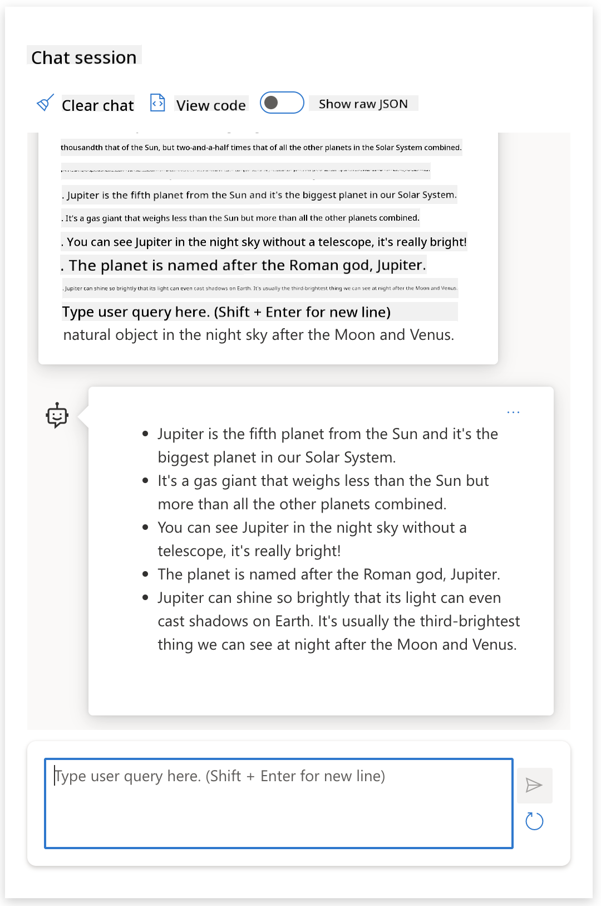
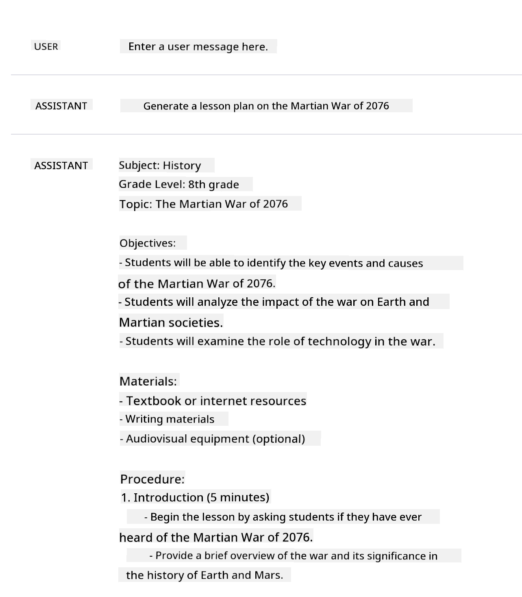
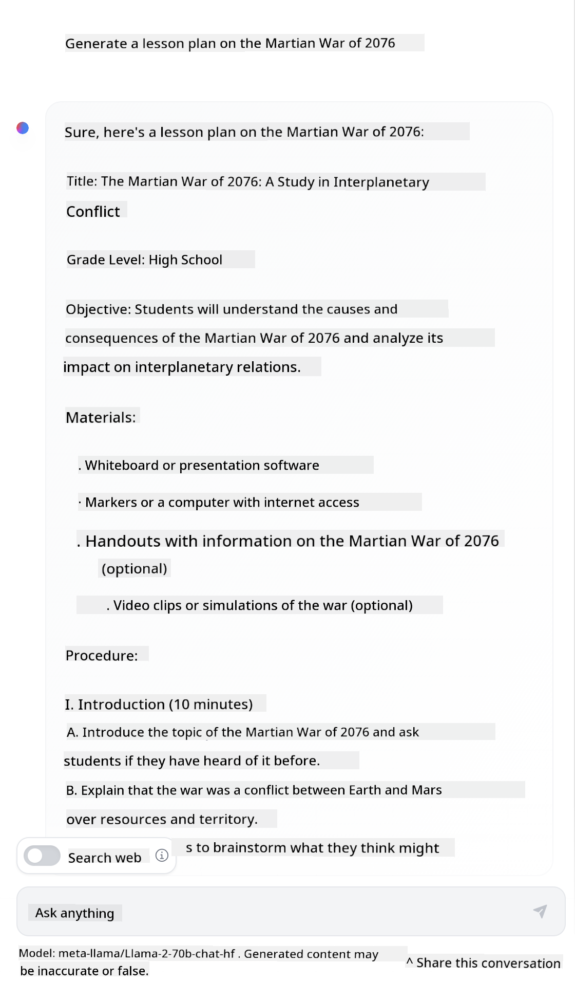

<!--
CO_OP_TRANSLATOR_METADATA:
{
  "original_hash": "a45c318dc6ebc2604f35b8b829f93af2",
  "translation_date": "2025-07-09T09:07:44+00:00",
  "source_file": "04-prompt-engineering-fundamentals/README.md",
  "language_code": "en"
}
-->
# Prompt Engineering Fundamentals

[](https://aka.ms/gen-ai-lesson4-gh?WT.mc_id=academic-105485-koreyst)

## Introduction
This module covers key concepts and techniques for crafting effective prompts in generative AI models. How you write your prompt to an LLM also matters. A well-designed prompt can lead to higher quality responses. But what exactly do terms like _prompt_ and _prompt engineering_ mean? And how can I improve the prompt _input_ I send to the LLM? These are the questions we’ll explore in this chapter and the next.

_Generative AI_ can create new content (e.g., text, images, audio, code, etc.) in response to user requests. It does this using _Large Language Models_ like OpenAI’s GPT (“Generative Pre-trained Transformer”) series, which are trained to understand natural language and code.

Users can now interact with these models through familiar formats like chat, without needing technical skills or training. These models are _prompt-based_ — users send a text input (prompt) and receive an AI response (completion). They can then “chat with the AI” in multiple turns, refining their prompt until the response meets their needs.

“Prompts” have become the main _programming interface_ for generative AI apps, telling the models what to do and influencing the quality of the responses. “Prompt Engineering” is a rapidly growing field focused on the _design and optimization_ of prompts to consistently deliver high-quality responses at scale.

## Learning Goals

In this lesson, we’ll learn what Prompt Engineering is, why it matters, and how to create more effective prompts for a given model and application goal. We’ll cover core concepts and best practices for prompt engineering — and explore an interactive Jupyter Notebooks “sandbox” environment where you can see these ideas applied in real examples.

By the end of this lesson, you will be able to:

1. Explain what prompt engineering is and why it’s important.
2. Describe the components of a prompt and how they’re used.
3. Learn best practices and techniques for prompt engineering.
4. Apply these techniques to real examples using an OpenAI endpoint.

## Key Terms

Prompt Engineering: The practice of designing and refining inputs to guide AI models toward producing desired outputs.  
Tokenization: The process of breaking text into smaller units, called tokens, that a model can understand and process.  
Instruction-Tuned LLMs: Large Language Models (LLMs) fine-tuned with specific instructions to improve response accuracy and relevance.

## Learning Sandbox

Prompt engineering is currently more art than science. The best way to build intuition is to _practice more_ and use a trial-and-error approach that combines domain expertise with recommended techniques and model-specific tweaks.

The Jupyter Notebook that comes with this lesson provides a _sandbox_ environment where you can try out what you learn — either as you go or as part of the code challenge at the end. To run the exercises, you’ll need:

1. **An Azure OpenAI API key** — the service endpoint for a deployed LLM.  
2. **A Python Runtime** — to execute the Notebook.  
3. **Local Env Variables** — _complete the [SETUP](./../00-course-setup/SETUP.md?WT.mc_id=academic-105485-koreyst) steps now to get ready_.

The notebook includes _starter_ exercises, but you’re encouraged to add your own _Markdown_ (descriptions) and _Code_ (prompt requests) sections to experiment with more examples or ideas — and build your prompt design skills.

## Illustrated Guide

Want an overview of what this lesson covers before diving in? Check out this illustrated guide, which highlights the main topics and key takeaways for each. The lesson roadmap takes you from understanding core concepts and challenges to addressing them with relevant prompt engineering techniques and best practices. Note that the “Advanced Techniques” section in this guide refers to content covered in the _next_ chapter of this curriculum.


## Our Startup

Now, let’s connect _this topic_ to our startup mission to [bring AI innovation to education](https://educationblog.microsoft.com/2023/06/collaborating-to-bring-ai-innovation-to-education?WT.mc_id=academic-105485-koreyst). We want to build AI-powered applications for _personalized learning_ — so let’s consider how different users of our app might “design” prompts:

- **Administrators** might ask the AI to _analyze curriculum data to identify gaps in coverage_. The AI can summarize results or visualize them with code.  
- **Educators** might ask the AI to _generate a lesson plan for a target audience and topic_. The AI can create a personalized plan in a specified format.  
- **Students** might ask the AI to _tutor them in a difficult subject_. The AI can guide students with lessons, hints, and examples tailored to their level.

That’s just the beginning. Check out [Prompts For Education](https://github.com/microsoft/prompts-for-edu/tree/main?WT.mc_id=academic-105485-koreyst) — an open-source prompt library curated by education experts — to explore more possibilities! _Try running some of those prompts in the sandbox or the OpenAI Playground to see what happens!_

<!--
LESSON TEMPLATE:
This unit should cover core concept #1.
Reinforce the concept with examples and references.

CONCEPT #1:
Prompt Engineering.
Define it and explain why it is needed.
-->

## What is Prompt Engineering?

We started this lesson by defining **Prompt Engineering** as the process of _designing and optimizing_ text inputs (prompts) to consistently deliver quality responses (completions) for a given application goal and model. You can think of this as a two-step process:

- _designing_ the initial prompt for a specific model and goal  
- _refining_ the prompt iteratively to improve response quality

This is inherently a trial-and-error process that requires user intuition and effort to get the best results. So why is it important? To answer that, we first need to understand three concepts:

- _Tokenization_ = how the model “sees” the prompt  
- _Base LLMs_ = how the foundation model “processes” a prompt  
- _Instruction-Tuned LLMs_ = how the model can now understand “tasks”

### Tokenization

An LLM views prompts as a _sequence of tokens_, and different models (or versions) can tokenize the same prompt differently. Since LLMs are trained on tokens (not raw text), how prompts are tokenized directly affects the quality of the generated response.

To get a feel for tokenization, try tools like the [OpenAI Tokenizer](https://platform.openai.com/tokenizer?WT.mc_id=academic-105485-koreyst) shown below. Paste your prompt and see how it’s broken into tokens, paying attention to how spaces and punctuation are handled. Note this example uses an older LLM (GPT-3), so newer models may tokenize differently.


### Concept: Foundation Models

Once a prompt is tokenized, the main job of the ["Base LLM"](https://blog.gopenai.com/an-introduction-to-base-and-instruction-tuned-large-language-models-8de102c785a6?WT.mc_id=academic-105485-koreyst) (or foundation model) is to predict the next token in the sequence. Since LLMs are trained on massive text datasets, they understand statistical relationships between tokens and can make predictions with some confidence. Note they don’t understand the _meaning_ of words; they just recognize patterns they can “complete” with their next prediction. They continue predicting tokens until stopped by the user or a preset condition.

Want to see how prompt-based completion works? Enter the prompt above into the Azure OpenAI Studio [_Chat Playground_](https://oai.azure.com/playground?WT.mc_id=academic-105485-koreyst) with default settings. The system treats prompts as information requests, so you should see a completion that fits this context.

But what if the user wants a specific output that meets certain criteria or a task? This is where _instruction-tuned_ LLMs come in.


### Concept: Instruction Tuned LLMs

An [Instruction Tuned LLM](https://blog.gopenai.com/an-introduction-to-base-and-instruction-tuned-large-language-models-8de102c785a6?WT.mc_id=academic-105485-koreyst) starts with the foundation model and fine-tunes it using examples or input/output pairs (e.g., multi-turn “messages”) that include clear instructions — and the AI’s response attempts to follow those instructions.

This uses techniques like Reinforcement Learning with Human Feedback (RLHF) to train the model to _follow instructions_ and _learn from feedback_, producing responses better suited to practical applications and more relevant to user goals.

Let’s try it — revisit the prompt above, but now change the _system message_ to provide this instruction as context:

> _Summarize the content you’re given for a second-grade student. Keep the result to one paragraph with 3-5 bullet points._

Notice how the response now aligns with the desired goal and format? An educator can directly use this in their class slides.



## Why do we need Prompt Engineering?

Now that we understand how LLMs process prompts, let’s discuss _why_ prompt engineering is necessary. The answer lies in the fact that current LLMs present several challenges that make _reliable and consistent completions_ difficult without careful prompt design and optimization. For example:

1. **Model responses are stochastic.** The _same prompt_ can produce different responses across different models or versions. It may even yield different results with the _same model_ at different times. _Prompt engineering techniques help reduce these variations by providing better guardrails_.

2. **Models can fabricate responses.** Models are pre-trained on _large but finite_ datasets, so they lack knowledge beyond their training data. As a result, they can generate completions that are inaccurate, made-up, or contradict known facts. _Prompt engineering helps users detect and reduce such fabrications, for example by asking the AI for citations or reasoning_.

3. **Model capabilities vary.** Newer models or generations have richer capabilities but also unique quirks and tradeoffs in cost and complexity. _Prompt engineering helps develop best practices and workflows that abstract these differences and adapt to model-specific needs in scalable, seamless ways_.

Try this yourself in the OpenAI or Azure OpenAI Playground:

- Use the same prompt with different LLM deployments (e.g., OpenAI, Azure OpenAI, Hugging Face) — did you notice variations?  
- Use the same prompt repeatedly with the _same_ LLM deployment (e.g., Azure OpenAI playground) — how did the responses differ?

### Fabrications Example

In this course, we use the term **“fabrication”** to describe when LLMs generate factually incorrect information due to training limitations or other constraints. You may have heard this called _“hallucinations”_ in popular articles or research papers. However, we recommend using _“fabrication”_ to avoid anthropomorphizing the behavior by attributing human-like traits to machine-generated outputs. This also aligns with [Responsible AI guidelines](https://www.microsoft.com/ai/responsible-ai?WT.mc_id=academic-105485-koreyst) by avoiding terms that might be offensive or non-inclusive in some contexts.

Want to see how fabrications happen? Think of a prompt that asks the AI to generate content about a non-existent topic (ensuring it’s not in the training data). For example — I tried this prompt:
# Lesson Plan: The Martian War of 2076

## Objective
By the end of this lesson, students will understand the key events, causes, and consequences of the Martian War of 2076. They will be able to analyze the political and social impacts of the conflict on both Earth and Mars.

## Materials Needed
- Timeline of the Martian War of 2076
- Maps of Mars and Earth during the war period
- Excerpts from primary sources (letters, speeches, official documents)
- Multimedia presentation on the war’s major battles and strategies

## Lesson Outline

### Introduction (10 minutes)
- Brief overview of Mars colonization leading up to 2076
- Discuss the tensions between Earth governments and Martian settlers
- Present the main causes of the war

### Main Activity (30 minutes)
- Divide students into groups to analyze different phases of the war:
  - Phase 1: Initial conflicts and skirmishes
  - Phase 2: Major battles and turning points
  - Phase 3: Peace negotiations and aftermath
- Each group presents their findings with supporting evidence

### Discussion (15 minutes)
- Explore the political and social consequences of the war
- Debate the ethical implications of colonization and rebellion
- Connect the war’s outcomes to current Mars-Earth relations

### Conclusion (5 minutes)
- Summarize key takeaways
- Assign a reflective essay on how the Martian War of 2076 shaped interplanetary diplomacy

## Assessment
- Group presentations evaluated on accuracy and depth of analysis
- Reflective essay graded on critical thinking and understanding of the topic

## Additional Resources
- Documentary: "The Martian War: A Turning Point in History"
- Interactive map: Battles of the Martian War 2076
- Archive of primary documents from the conflict period
A web search showed me that there were fictional accounts (e.g., television series or books) about Martian wars—but none set in 2076. Common sense also tells us that 2076 is _in the future_ and therefore cannot be linked to a real event.

So what happens when we run this prompt with different LLM providers?

> **Response 1**: OpenAI Playground (GPT-35)



> **Response 2**: Azure OpenAI Playground (GPT-35)


> **Response 3**: : Hugging Face Chat Playground (LLama-2)



As expected, each model (or model version) produces slightly different responses due to stochastic behavior and differences in model capabilities. For example, one model targets an 8th-grade audience while another assumes a high school student. But all three models generated responses that could convince an uninformed user that the event was real.

Prompt engineering techniques like _metaprompting_ and _temperature configuration_ can help reduce model fabrications to some extent. New prompt engineering _architectures_ also seamlessly integrate new tools and techniques into the prompt flow to mitigate or lessen some of these effects.

## Case Study: GitHub Copilot

Let's wrap up this section by exploring how prompt engineering is applied in real-world solutions through a Case Study: [GitHub Copilot](https://github.com/features/copilot?WT.mc_id=academic-105485-koreyst).

GitHub Copilot is your "AI Pair Programmer"—it turns text prompts into code completions and integrates directly into your development environment (e.g., Visual Studio Code) for a smooth user experience. As documented in the blog series below, the earliest version was based on the OpenAI Codex model—with engineers quickly realizing the need to fine-tune the model and develop better prompt engineering techniques to improve code quality. In July, they [launched an improved AI model that goes beyond Codex](https://github.blog/2023-07-28-smarter-more-efficient-coding-github-copilot-goes-beyond-codex-with-improved-ai-model/?WT.mc_id=academic-105485-koreyst) for even faster suggestions.

Read the posts in order to follow their learning journey.

- **May 2023** | [GitHub Copilot is Getting Better at Understanding Your Code](https://github.blog/2023-05-17-how-github-copilot-is-getting-better-at-understanding-your-code/?WT.mc_id=academic-105485-koreyst)
- **May 2023** | [Inside GitHub: Working with the LLMs behind GitHub Copilot](https://github.blog/2023-05-17-inside-github-working-with-the-llms-behind-github-copilot/?WT.mc_id=academic-105485-koreyst)
- **Jun 2023** | [How to write better prompts for GitHub Copilot](https://github.blog/2023-06-20-how-to-write-better-prompts-for-github-copilot/?WT.mc_id=academic-105485-koreyst)
- **Jul 2023** | [GitHub Copilot goes beyond Codex with improved AI model](https://github.blog/2023-07-28-smarter-more-efficient-coding-github-copilot-goes-beyond-codex-with-improved-ai-model/?WT.mc_id=academic-105485-koreyst)
- **Jul 2023** | [A Developer's Guide to Prompt Engineering and LLMs](https://github.blog/2023-07-17-prompt-engineering-guide-generative-ai-llms/?WT.mc_id=academic-105485-koreyst)
- **Sep 2023** | [How to build an enterprise LLM app: Lessons from GitHub Copilot](https://github.blog/2023-09-06-how-to-build-an-enterprise-llm-application-lessons-from-github-copilot/?WT.mc_id=academic-105485-koreyst)

You can also browse their [Engineering blog](https://github.blog/category/engineering/?WT.mc_id=academic-105485-koreyst) for more posts like [this one](https://github.blog/2023-09-27-how-i-used-github-copilot-chat-to-build-a-reactjs-gallery-prototype/?WT.mc_id=academic-105485-koreyst) that show how these models and techniques are _applied_ to power real-world applications.

---

<!--
LESSON TEMPLATE:
This unit should cover core concept #2.
Reinforce the concept with examples and references.

CONCEPT #2:
Prompt Design.
Illustrated with examples.
-->

## Prompt Construction

We've seen why prompt engineering matters—now let's understand how prompts are _constructed_ so we can evaluate different techniques for designing more effective prompts.

### Basic Prompt

Let's start with the basic prompt: a text input sent to the model without any additional context. Here's an example—when we send the first few words of the US national anthem to the OpenAI [Completion API](https://platform.openai.com/docs/api-reference/completions?WT.mc_id=academic-105485-koreyst), it instantly _completes_ the response with the next few lines, demonstrating basic prediction behavior.

| Prompt (Input)     | Completion (Output)                                                                                                                        |
| :----------------- | :----------------------------------------------------------------------------------------------------------------------------------------- |
| Oh say can you see | It sounds like you're starting the lyrics to "The Star-Spangled Banner," the national anthem of the United States. The full lyrics are ... |

### Complex Prompt

Now let's add context and instructions to that basic prompt. The [Chat Completion API](https://learn.microsoft.com/azure/ai-services/openai/how-to/chatgpt?WT.mc_id=academic-105485-koreyst) lets us build a complex prompt as a series of _messages_ with:

- Input/output pairs reflecting _user_ input and _assistant_ response.
- A system message setting the context for the assistant’s behavior or personality.

The request now looks like the example below, where the _tokenization_ effectively captures relevant information from the context and conversation. Changing the system context can be just as impactful on the quality of completions as the user inputs provided.

```python
response = openai.chat.completions.create(
    model="gpt-3.5-turbo",
    messages=[
        {"role": "system", "content": "You are a helpful assistant."},
        {"role": "user", "content": "Who won the world series in 2020?"},
        {"role": "assistant", "content": "The Los Angeles Dodgers won the World Series in 2020."},
        {"role": "user", "content": "Where was it played?"}
    ]
)
```

### Instruction Prompt

In the examples above, the user prompt was a simple text query that could be interpreted as a request for information. With _instruction_ prompts, we use that text to specify a task in more detail, giving the AI clearer guidance. Here's an example:

| Prompt (Input)                                                                                                                                                                                                                         | Completion (Output)                                                                                                        | Instruction Type    |
| :------------------------------------------------------------------------------------------------------------------------------------------------------------------------------------------------------------------------------------- | :------------------------------------------------------------------------------------------------------------------------- | :------------------ |
| Write a description of the Civil War                                                                                                                                                                                                   | _returned a simple paragraph_                                                                                              | Simple              |
| Write a description of the Civil War. Provide key dates and events and describe their significance                                                                                                                                     | _returned a paragraph followed by a list of key event dates with descriptions_                                             | Complex             |
| Write a description of the Civil War in 1 paragraph. Provide 3 bullet points with key dates and their significance. Provide 3 more bullet points with key historical figures and their contributions. Return the output as a JSON file | _returns more detailed information in a text box, formatted as JSON that you can copy-paste to a file and validate as needed_ | Complex. Formatted. |

## Primary Content

In the examples above, the prompt was still fairly open-ended, allowing the LLM to decide which parts of its pre-trained data were relevant. With the _primary content_ design pattern, the input text is split into two parts:

- an instruction (action)
- relevant content (that influences the action)

Here’s an example where the instruction is to "summarize this in 2 sentences."

| Prompt (Input)                                                                                                                                                                                                                                                                                                                                                                                                                                                                                                                                                                                                                                                                                      | Completion (Output)                                                                                                                                                                                                                                                                             |
| :-------------------------------------------------------------------------------------------------------------------------------------------------------------------------------------------------------------------------------------------------------------------------------------------------------------------------------------------------------------------------------------------------------------------------------------------------------------------------------------------------------------------------------------------------------------------------------------------------------------------------------------------------------------------------------------------------- | :---------------------------------------------------------------------------------------------------------------------------------------------------------------------------------------------------------------------------------------------------------------------------------------------- |
| Jupiter is the fifth planet from the Sun and the largest in the Solar System. It is a gas giant with a mass one-thousandth that of the Sun, but two-and-a-half times that of all the other planets in the Solar System combined. Jupiter is one of the brightest objects visible to the naked eye in the night sky, and has been known to ancient civilizations since before recorded history. It is named after the Roman god Jupiter.[19] When viewed from Earth, Jupiter can be bright enough for its reflected light to cast visible shadows,[20] and is on average the third-brightest natural object in the night sky after the Moon and Venus. <br/> **Summarize this in 2 short sentences** | Jupiter, the fifth planet from the Sun, is the largest in the Solar System and one of the brightest objects in the night sky. Named after the Roman god Jupiter, it is a gas giant with a mass two-and-a-half times that of all the other planets combined. |

The primary content segment can be used in various ways to drive more effective instructions:

- **Examples** – instead of explicitly telling the model what to do, provide examples of the desired output and let it infer the pattern.
- **Cues** – follow the instruction with a "cue" that primes the completion, guiding the model toward more relevant responses.
- **Templates** – repeatable 'recipes' for prompts with placeholders (variables) that can be customized with data for specific use cases.

Let’s explore these in action.

### Using Examples

This approach uses the primary content to "feed the model" some examples of the desired output for a given instruction, letting it infer the pattern for the output. Depending on the number of examples provided, we have zero-shot prompting, one-shot prompting, few-shot prompting, etc.

The prompt now consists of three components:

- A task description
- A few examples of the desired output
- The start of a new example (which acts as an implicit task description)

| Learning Type | Prompt (Input)                                                                                                                                        | Completion (Output)         |
| :------------ | :---------------------------------------------------------------------------------------------------------------------------------------------------- | :-------------------------- |
| Zero-shot     | "The Sun is Shining". Translate to Spanish                                                                                                            | "El Sol está brillando".    |
| One-shot      | "The Sun is Shining" => "El Sol está brillando". <br> "It's a Cold and Windy Day" =>                                                                 | "Es un día frío y ventoso". |
| Few-shot      | The player ran the bases => Baseball <br/> The player hit an ace => Tennis <br/> The player hit a six => Cricket <br/> The player made a slam-dunk => | Basketball                  |
|               |                                                                                                                                                       |                             |

Notice how in zero-shot prompting we had to provide an explicit instruction ("Translate to Spanish"), but in one-shot prompting it is inferred from the example. The few-shot example shows how adding more examples helps models make more accurate inferences without additional instructions.

### Prompt Cues

Another way to use primary content is to provide _cues_ instead of examples. Here, we give the model a nudge in the right direction by _starting it off_ with a snippet that reflects the desired response format. The model then "takes the cue" and continues accordingly.

| Number of Cues | Prompt (Input)                                                                                                                                                                                                                                                                                                                                                                                                                                               | Completion (Output)                                                                                                                                                                                                                                                                                       |
| :------------- | :----------------------------------------------------------------------------------------------------------------------------------------------------------------------------------------------------------------------------------------------------------------------------------------------------------------------------------------------------------------------------------------------------------------------------------------------------------- | :-------------------------------------------------------------------------------------------------------------------------------------------------------------------------------------------------------------------------------------------------------------------------------------------------------- |
| 0              | Jupiter is the fifth planet from the Sun and the largest in the Solar System. It is a gas giant with a mass one-thousandth that of the Sun, but two-and-a-half times that of all the other planets in the Solar System combined. Jupiter is one of the brightest objects visible to the naked eye in the night sky, and has been known to ancient civilizations since before recorded history. |

**Summarize This**                                       | Jupiter is the largest planet in our Solar System and the fifth one from the Sun. It is a gas giant with a mass 1/1000th of the Sun's, but it is heavier than all the other planets combined. Ancient civilizations have known about Jupiter for a long time, and it is easily visible in the night sky.. |
| 1              | Jupiter is the fifth planet from the Sun and the largest in the Solar System. It is a gas giant with a mass one-thousandth that of the Sun, but two-and-a-half times that of all the other planets in the Solar System combined. Jupiter is one of the brightest objects visible to the naked eye in the night sky, and has been known to ancient civilizations since before recorded history. <br/>**Summarize This** <br/> What we learned is that Jupiter | is the fifth planet from the Sun and the largest in the Solar System. It is a gas giant with a mass one-thousandth that of the Sun, but two-and-a-half times that of all the other planets combined. It is easily visible to the naked eye and has been known since ancient times.                        |
| 2              | Jupiter is the fifth planet from the Sun and the largest in the Solar System. It is a gas giant with a mass one-thousandth that of the Sun, but two-and-a-half times that of all the other planets in the Solar System combined. Jupiter is one of the brightest objects visible to the naked eye in the night sky, and has been known to ancient civilizations since before recorded history. <br/>**Summarize This** <br/> Top 3 Facts We Learned:         | 1. Jupiter is the fifth planet from the Sun and the largest in the Solar System. <br/> 2. It is a gas giant with a mass one-thousandth that of the Sun...<br/> 3. Jupiter has been visible to the naked eye since ancient times ...                                                                       |
|                |                                                                                                                                                                                                                                                                                                                                                                                                                                                              |                                                                                                                                                                                                                                                                                                           |

### Prompt Templates

A prompt template is a _pre-defined recipe for a prompt_ that can be saved and reused as needed to create more consistent user experiences at scale. At its simplest, it’s just a collection of prompt examples like [this one from OpenAI](https://platform.openai.com/examples?WT.mc_id=academic-105485-koreyst) that includes both the interactive prompt components (user and system messages) and the API request format—to support reuse.

In more complex forms, like [this example from LangChain](https://python.langchain.com/docs/concepts/prompt_templates/?WT.mc_id=academic-105485-koreyst), it contains _placeholders_ that can be filled with data from various sources (user input, system context, external data, etc.) to generate prompts dynamically. This lets us build a library of reusable prompts that can programmatically deliver consistent user experiences at scale.

The real value of templates is in creating and publishing _prompt libraries_ tailored for specific application domains—where the prompt template is _optimized_ to reflect domain-specific context or examples, making responses more relevant and accurate for the target audience. The [Prompts For Edu](https://github.com/microsoft/prompts-for-edu?WT.mc_id=academic-105485-koreyst) repository is a great example, curating prompts for education with a focus on lesson planning, curriculum design, student tutoring, and more.

## Supporting Content

If we think of prompt construction as having an instruction (task) and a target (primary content), then _secondary content_ is additional context we provide to **influence the output**. This could be tuning parameters, formatting instructions, topic taxonomies, etc., that help the model _tailor_ its response to better meet user goals or expectations.

For example: Given a course catalog with detailed metadata (name, description, level, tags, instructor, etc.) for all courses in the curriculum:

- we can define an instruction to "summarize the course catalog for Fall 2023"
- we can use the primary content to provide a few examples of the desired output
- we can use the secondary content to highlight the top 5 "tags" of interest

Now, the model can generate a summary in the style shown by the examples—but if a course has multiple tags, it can prioritize the 5 tags identified in the secondary content.

---

<!--
LESSON TEMPLATE:
This unit should cover core concept #1.
Reinforce the concept with examples and references.

CONCEPT #3:
Prompt Engineering Techniques.
What are some basic techniques for prompt engineering?
Illustrate it with some exercises.
-->

## Prompting Best Practices

Now that we understand how prompts can be _constructed_, we can start thinking about how to _design_ them following best practices. This involves two parts—having the right _mindset_ and applying the right _techniques_.

### Prompt Engineering Mindset

Prompt Engineering is a trial-and-error process, so keep these three broad guiding principles in mind:

1. **Domain Understanding Matters.** The accuracy and relevance of responses depend on the _domain_ where the application or user operates. Use your intuition and domain expertise to **customize techniques** accordingly. For example, define _domain-specific personalities_ in system prompts or use _domain-specific templates_ in user prompts. Provide secondary content that reflects domain contexts, or use _domain-specific cues and examples_ to guide the model toward familiar usage patterns.

2. **Model Understanding Matters.** Models are stochastic by nature, but implementations vary in training data (pre-trained knowledge), capabilities (API or SDK), and content focus (code, images, text, etc.). Understand the strengths and limitations of your model, and use that knowledge to _prioritize tasks_ or build _customized templates_ optimized for the model’s capabilities.

3. **Iteration & Validation Matters.** Models and prompt engineering techniques evolve rapidly. As a domain expert, you may have specific context or criteria for your application that don’t apply broadly. Use prompt engineering tools and techniques to jump-start prompt creation, then iterate and validate results using your own intuition and expertise. Document your insights and build a **knowledge base** (e.g., prompt libraries) that others can use as a baseline for faster future iterations.

## Best Practices

Here are common best practices recommended by [OpenAI](https://help.openai.com/en/articles/6654000-best-practices-for-prompt-engineering-with-openai-api?WT.mc_id=academic-105485-koreyst) and [Azure OpenAI](https://learn.microsoft.com/azure/ai-services/openai/concepts/prompt-engineering#best-practices?WT.mc_id=academic-105485-koreyst) practitioners.

| What                              | Why                                                                                                                                                                                                                                               |
| :-------------------------------- | :------------------------------------------------------------------------------------------------------------------------------------------------------------------------------------------------------------------------------------------------ |
| Evaluate the latest models.       | New model versions often have improved features and quality but may cost more. Test them for impact before deciding to migrate.                                                                                                                |
| Separate instructions & context   | Check if your model/provider supports _delimiters_ to clearly separate instructions, primary, and secondary content. This helps the model assign importance to tokens more accurately.                                                         |
| Be specific and clear             | Provide detailed information about the desired context, outcome, length, format, style, etc. This improves response quality and consistency. Capture these details in reusable templates.                                                      |
| Be descriptive, use examples      | Models often respond better to a "show and tell" approach. Start with a `zero-shot` prompt (instruction only), then refine with `few-shot` by adding examples of the desired output. Use analogies where helpful.                                |
| Use cues to jumpstart completions | Guide the model toward a desired outcome by giving it leading words or phrases it can use as a starting point for the response.                                                                                                               |
| Double Down                       | Sometimes repeating instructions helps. Provide instructions before and after primary content, use both an instruction and a cue, etc. Iterate and validate what works best.                                                                 |
| Order Matters                     | The order in which information is presented can affect output due to recency bias. Experiment with different orders to find what works best.                                                                                                |
| Give the model an “out”           | Provide a _fallback_ response the model can use if it can’t complete the task. This reduces the chance of false or fabricated answers.                                                                                                       |
|                                   |                                                                                                                                                                                                                                                   |

As with any best practice, remember that _your mileage may vary_ depending on the model, task, and domain. Use these as a starting point and iterate to find what works best for you. Continuously re-evaluate your prompt engineering process as new models and tools become available, focusing on scalability and response quality.

<!--
LESSON TEMPLATE:
This unit should provide a code challenge if applicable

CHALLENGE:
Link to a Jupyter Notebook with only the code comments in the instructions (code sections are empty).

SOLUTION:
Link to a copy of that Notebook with the prompts filled in and run, showing what one example could be.
-->

## Assignment

Congratulations! You’ve reached the end of the lesson! Now it’s time to apply some of these concepts and techniques with real examples.

For this assignment, we’ll use a Jupyter Notebook with exercises you can complete interactively. You can also add your own Markdown and Code cells to explore ideas and techniques on your own.

### To get started, fork the repo, then

- (Recommended) Launch GitHub Codespaces  
- (Alternatively) Clone the repo locally and use it with Docker Desktop  
- (Alternatively) Open the Notebook in your preferred runtime environment

### Next, configure your environment variables

- Copy the `.env.copy` file in the repo root to `.env` and fill in the `AZURE_OPENAI_API_KEY`, `AZURE_OPENAI_ENDPOINT`, and `AZURE_OPENAI_DEPLOYMENT` values. Then return to the [Learning Sandbox section](../../../04-prompt-engineering-fundamentals/04-prompt-engineering-fundamentals) to learn how to proceed.

### Next, open the Jupyter Notebook

- Select the runtime kernel. If using options 1 or 2, just select the default Python 3.10.x kernel provided by the dev container.

You’re all set to run the exercises. Note there are no _right or wrong_ answers here—just experimenting by trial and error and building intuition for what works with a given model and application domain.

_For this reason, there are no Code Solution segments in this lesson. Instead, the Notebook includes Markdown cells titled "My Solution:" showing one example output for reference._

 <!--
LESSON TEMPLATE:
Wrap the section with a summary and resources for self-guided learning.
-->

## Knowledge check

Which of the following is a good prompt following reasonable best practices?

1. Show me an image of red car  
2. Show me an image of red car of make Volvo and model XC90 parked by a cliff with the sun setting  
3. Show me an image of red car of make Volvo and model XC90

A: 2 is the best prompt because it provides detailed information on "what" and includes specifics (not just any car but a particular make and model) and also describes the overall setting. 3 is the next best as it also contains a lot of description.

## 🚀 Challenge

Try using the "cue" technique with the prompt: Complete the sentence "Show me an image of red car of make Volvo and ". What does it respond with, and how would you improve it?

## Great Work! Continue Your Learning

Want to learn more about different Prompt Engineering concepts? Visit the [continued learning page](https://aka.ms/genai-collection?WT.mc_id=academic-105485-koreyst) for more great resources on this topic.

Head over to Lesson 5 where we will explore [advanced prompting techniques](../05-advanced-prompts/README.md?WT.mc_id=academic-105485-koreyst)!

**Disclaimer**:  
This document has been translated using the AI translation service [Co-op Translator](https://github.com/Azure/co-op-translator). While we strive for accuracy, please be aware that automated translations may contain errors or inaccuracies. The original document in its native language should be considered the authoritative source. For critical information, professional human translation is recommended. We are not liable for any misunderstandings or misinterpretations arising from the use of this translation.