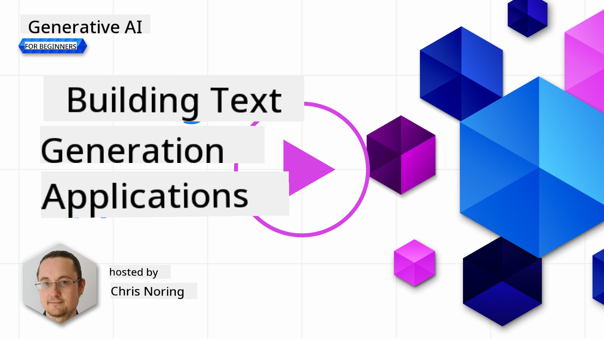

<!--
CO_OP_TRANSLATOR_METADATA:
{
  "original_hash": "ce8224073b86b728ed52b19bed7932fd",
  "translation_date": "2025-07-09T11:42:31+00:00",
  "source_file": "06-text-generation-apps/README.md",
  "language_code": "en"
}
-->
# Building Text Generation Applications

[](https://aka.ms/gen-ai-lesson6-gh?WT.mc_id=academic-105485-koreyst)

> _(Click the image above to watch the video for this lesson)_

So far in this curriculum, you’ve encountered core concepts like prompts and even an entire field called "prompt engineering." Many tools you interact with, such as ChatGPT, Office 365, Microsoft Power Platform, and more, use prompts to help you accomplish tasks.

To add this kind of experience to an app, you need to understand concepts like prompts and completions, and choose a library to work with. That’s exactly what you’ll learn in this chapter.

## Introduction

In this chapter, you will:

- Learn about the openai library and its core concepts.
- Build a text generation app using openai.
- Understand how to use concepts like prompt, temperature, and tokens to create a text generation app.

## Learning goals

By the end of this lesson, you will be able to:

- Explain what a text generation app is.
- Build a text generation app using openai.
- Configure your app to use more or fewer tokens and adjust the temperature for varied outputs.

## What is a text generation app?

Typically, when you build an app, it has some kind of interface like the following:

- Command-based. Console apps are typical examples where you type a command and it performs a task. For example, `git` is a command-based app.
- User interface (UI). Some apps have graphical user interfaces (GUIs) where you click buttons, enter text, select options, and more.

### Console and UI apps are limited

Compare this to a command-based app where you type a command:

- **It’s limited.** You can’t just type any command, only the ones the app supports.
- **Language specific.** Some apps support multiple languages, but by default, the app is built for a specific language, even if you can add more language support.

### Benefits of text generation apps

So how is a text generation app different?

In a text generation app, you have more flexibility—you’re not limited to a fixed set of commands or a specific input language. Instead, you can use natural language to interact with the app. Another advantage is that you’re interacting with a data source trained on a vast amount of information, whereas a traditional app might be limited to what’s in a database.

### What can I build with a text generation app?

There are many possibilities. For example:

- **A chatbot.** A chatbot that answers questions about topics like your company and its products could be a great fit.
- **Helper.** LLMs excel at tasks like summarizing text, extracting insights, generating text such as resumes, and more.
- **Code assistant.** Depending on the language model you use, you can build a code assistant to help you write code. For example, you can use products like GitHub Copilot or ChatGPT to assist with coding.

## How can I get started?

You need to find a way to integrate with an LLM, which usually involves one of two approaches:

- Use an API. Here, you construct web requests with your prompt and receive generated text in response.
- Use a library. Libraries encapsulate API calls and make them easier to use.

## Libraries/SDKs

There are several well-known libraries for working with LLMs, such as:

- **openai**, which makes it easy to connect to your model and send prompts.

There are also libraries that operate at a higher level, like:

- **Langchain.** Langchain is well known and supports Python.
- **Semantic Kernel.** Semantic Kernel is a Microsoft library supporting C#, Python, and Java.

## First app using openai

Let’s see how to build our first app, what libraries we need, how much setup is required, and so on.

### Install openai

There are many libraries available for interacting with OpenAI or Azure OpenAI. You can use various programming languages like C#, Python, JavaScript, Java, and more. We’ve chosen to use the `openai` Python library, so we’ll use `pip` to install it.

```bash
pip install openai
```

### Create a resource

You need to complete the following steps:

- Create an account on Azure [https://azure.microsoft.com/free/](https://azure.microsoft.com/free/?WT.mc_id=academic-105485-koreyst).
- Get access to Azure OpenAI. Visit [https://learn.microsoft.com/azure/ai-services/openai/overview#how-do-i-get-access-to-azure-openai](https://learn.microsoft.com/azure/ai-services/openai/overview#how-do-i-get-access-to-azure-openai?WT.mc_id=academic-105485-koreyst) and request access.

  > [!NOTE]
  > At the time of writing, you need to apply for access to Azure OpenAI.

- Install Python <https://www.python.org/>
- Create an Azure OpenAI Service resource. See this guide on how to [create a resource](https://learn.microsoft.com/azure/ai-services/openai/how-to/create-resource?pivots=web-portal?WT.mc_id=academic-105485-koreyst).

### Locate API key and endpoint

Now, you need to tell your `openai` library which API key to use. To find your API key, go to the "Keys and Endpoint" section of your Azure OpenAI resource and copy the "Key 1" value.


Once you have this information copied, let’s configure the libraries to use it.

> [!NOTE]
> It’s a good idea to keep your API key separate from your code. You can do this by using environment variables.
>
> - Set the environment variable `OPENAI_API_KEY` to your API key.
>   `export OPENAI_API_KEY='sk-...'`

### Setup configuration for Azure

If you’re using Azure OpenAI, here’s how to set up the configuration:

```python
openai.api_type = 'azure'
openai.api_key = os.environ["OPENAI_API_KEY"]
openai.api_version = '2023-05-15'
openai.api_base = os.getenv("API_BASE")
```

Above, we’re setting the following:

- `api_type` to `azure`. This tells the library to use Azure OpenAI instead of OpenAI.
- `api_key`, which is your API key found in the Azure Portal.
- `api_version`, the version of the API you want to use. At the time of writing, the latest version is `2023-05-15`.
- `api_base`, the API endpoint. You can find this in the Azure Portal next to your API key.

> [!NOTE]
> `os.getenv` is a function that reads environment variables. You can use it to read environment variables like `OPENAI_API_KEY` and `API_BASE`. Set these environment variables in your terminal or by using a library like `dotenv`.

## Generate text

To generate text, use the `Completion` class. Here’s an example:

```python
prompt = "Complete the following: Once upon a time there was a"

completion = openai.Completion.create(model="davinci-002", prompt=prompt)
print(completion.choices[0].text)
```

In the code above, we create a completion object, specify the model we want to use, and provide the prompt. Then we print the generated text.

### Chat completions

So far, you’ve seen how to use `Completion` to generate text. But there’s another class called `ChatCompletion` that’s better suited for chatbots. Here’s an example of how to use it:

```python
import openai

openai.api_key = "sk-..."

completion = openai.ChatCompletion.create(model="gpt-3.5-turbo", messages=[{"role": "user", "content": "Hello world"}])
print(completion.choices[0].message.content)
```

We’ll cover more about this functionality in an upcoming chapter.

## Exercise - your first text generation app

Now that you know how to set up and configure openai, it’s time to build your first text generation app. Follow these steps:

1. Create a virtual environment and install openai:

   ```bash
   python -m venv venv
   source venv/bin/activate
   pip install openai
   ```

   > [!NOTE]
   > If you’re using Windows, type `venv\Scripts\activate` instead of `source venv/bin/activate`.

   > [!NOTE]
   > Find your Azure OpenAI key by going to [https://portal.azure.com/](https://portal.azure.com/?WT.mc_id=academic-105485-koreyst), search for `Open AI`, select the `Open AI resource`, then go to `Keys and Endpoint` and copy the `Key 1` value.

1. Create an _app.py_ file and add the following code:

   ```python
   import openai

   openai.api_key = "<replace this value with your open ai key or Azure OpenAI key>"

   openai.api_type = 'azure'
   openai.api_version = '2023-05-15'
   openai.api_base = "<endpoint found in Azure Portal where your API key is>"
   deployment_name = "<deployment name>"

   # add your completion code
   prompt = "Complete the following: Once upon a time there was a"
   messages = [{"role": "user", "content": prompt}]

   # make completion
   completion = openai.chat.completions.create(model=deployment_name, messages=messages)

   # print response
   print(completion.choices[0].message.content)
   ```

   > [!NOTE]
   > If you’re using Azure OpenAI, set `api_type` to `azure` and set `api_key` to your Azure OpenAI key.

   You should see output similar to the following:

   ```output
    very unhappy _____.

   Once upon a time there was a very unhappy mermaid.
   ```

## Different types of prompts, for different purposes

Now you’ve seen how to generate text using a prompt. You even have a working program that you can modify to generate different types of text.

Prompts can be used for many tasks. For example:

- **Generate a type of text.** For instance, you can generate a poem, quiz questions, etc.
- **Look up information.** You can use prompts to find information, like “What does CORS mean in web development?”
- **Generate code.** You can use prompts to generate code, such as creating a regular expression to validate emails or even generating an entire program like a web app.

## A more practical use case: a recipe generator

Imagine you have some ingredients at home and want to cook something. For that, you need a recipe. You could use a search engine or an LLM to find recipes.

You might write a prompt like this:

> "Show me 5 recipes for a dish with the following ingredients: chicken, potatoes, and carrots. For each recipe, list all the ingredients used."

Given this prompt, you might get a response like:

```output
1. Roasted Chicken and Vegetables:
Ingredients:
- 4 chicken thighs
- 2 potatoes, cut into cubes
- 2 carrots, cut into cubes
- 2 tablespoons olive oil
- 2 cloves garlic, minced
- 1 teaspoon dried thyme
- 1 teaspoon dried oregano
- Salt and pepper, to taste

2. Chicken and Potato Stew:
Ingredients:
- 2 tablespoons olive oil
- 1 onion, diced
- 2 cloves garlic, minced
- 2 chicken breasts, cut into cubes
- 2 potatoes, cut into cubes
- 2 carrots, cut into cubes
- 1 teaspoon dried oregano
- 1 teaspoon dried thyme
- 1 cup chicken broth
- Salt and pepper, to taste

3. Chicken and Potato Bake:
Ingredients:
- 2 tablespoons olive oil
- 2 chicken breasts, cut into cubes
- 2 potatoes, cut into cubes
- 2 carrots, cut into cubes
- 1 onion, diced
- 2 cloves garlic, minced
- 1 teaspoon dried oregano
- 1 teaspoon dried thyme
- 1 cup chicken broth
- Salt and pepper, to taste

4. Chicken and Potato Soup:
Ingredients:
- 2 tablespoons olive oil
- 1 onion, diced
- 2 cloves garlic, minced
- 2 chicken breasts, cut into cubes
- 2 potatoes, cut into cubes
- 2 carrots, cut into cubes
- 1 teaspoon dried oregano
- 1 teaspoon dried thyme
- 4 cups chicken broth
- Salt and pepper, to taste

5. Chicken and Potato Hash:
Ingredients:
- 2 tablespoons olive oil
- 2 chicken breasts, cut into cubes
- 2 potatoes, cut into cubes
- 2 carrots, cut into cubes
- 1 onion, diced
- 2 cloves garlic, minced
- 1 teaspoon dried oregano
```

This result is great—I know what to cook. At this point, useful improvements could be:

- Filtering out ingredients I don’t like or am allergic to.
- Producing a shopping list in case I don’t have all the ingredients at home.

For these cases, let’s add an additional prompt:

> "Please remove recipes with garlic as I’m allergic and replace it with something else. Also, please produce a shopping list for the recipes, considering I already have chicken, potatoes, and carrots at home."

Now you get a new result, namely:

```output
1. Roasted Chicken and Vegetables:
Ingredients:
- 4 chicken thighs
- 2 potatoes, cut into cubes
- 2 carrots, cut into cubes
- 2 tablespoons olive oil
- 1 teaspoon dried thyme
- 1 teaspoon dried oregano
- Salt and pepper, to taste

2. Chicken and Potato Stew:
Ingredients:
- 2 tablespoons olive oil
- 1 onion, diced
- 2 chicken breasts, cut into cubes
- 2 potatoes, cut into cubes
- 2 carrots, cut into cubes
- 1 teaspoon dried oregano
- 1 teaspoon dried thyme
- 1 cup chicken broth
- Salt and pepper, to taste

3. Chicken and Potato Bake:
Ingredients:
- 2 tablespoons olive oil
- 2 chicken breasts, cut into cubes
- 2 potatoes, cut into cubes
- 2 carrots, cut into cubes
- 1 onion, diced
- 1 teaspoon dried oregano
- 1 teaspoon dried thyme
- 1 cup chicken broth
- Salt and pepper, to taste

4. Chicken and Potato Soup:
Ingredients:
- 2 tablespoons olive oil
- 1 onion, diced
- 2 chicken breasts, cut into cubes
- 2 potatoes, cut into cubes
- 2 carrots, cut into cubes
- 1 teaspoon dried oregano
- 1 teaspoon dried thyme
- 4 cups chicken broth
- Salt and pepper, to taste

5. Chicken and Potato Hash:
Ingredients:
- 2 tablespoons olive oil
- 2 chicken breasts, cut into cubes
- 2 potatoes, cut into cubes
- 2 carrots, cut into cubes
- 1 onion, diced
- 1 teaspoon dried oregano

Shopping List:
- Olive oil
- Onion
- Thyme
- Oregano
- Salt
- Pepper
```

That’s your five recipes without garlic, plus a shopping list considering what you already have at home.

## Exercise - build a recipe generator

Now that we’ve explored a scenario, let’s write code to match it. Follow these steps:

1. Use the existing _app.py_ file as a starting point.
1. Find the `prompt` variable and replace its code with the following:

   ```python
   prompt = "Show me 5 recipes for a dish with the following ingredients: chicken, potatoes, and carrots. Per recipe, list all the ingredients used"
   ```

   If you run the code now, you should see output similar to:

   ```output
   -Chicken Stew with Potatoes and Carrots: 3 tablespoons oil, 1 onion, chopped, 2 cloves garlic, minced, 1 carrot, peeled and chopped, 1 potato, peeled and chopped, 1 bay leaf, 1 thyme sprig, 1/2 teaspoon salt, 1/4 teaspoon black pepper, 1 1/2 cups chicken broth, 1/2 cup dry white wine, 2 tablespoons chopped fresh parsley, 2 tablespoons unsalted butter, 1 1/2 pounds boneless, skinless chicken thighs, cut into 1-inch pieces
   -Oven-Roasted Chicken with Potatoes and Carrots: 3 tablespoons extra-virgin olive oil, 1 tablespoon Dijon mustard, 1 tablespoon chopped fresh rosemary, 1 tablespoon chopped fresh thyme, 4 cloves garlic, minced, 1 1/2 pounds small red potatoes, quartered, 1 1/2 pounds carrots, quartered lengthwise, 1/2 teaspoon salt, 1/4 teaspoon black pepper, 1 (4-pound) whole chicken
   -Chicken, Potato, and Carrot Casserole: cooking spray, 1 large onion, chopped, 2 cloves garlic, minced, 1 carrot, peeled and shredded, 1 potato, peeled and shredded, 1/2 teaspoon dried thyme leaves, 1/4 teaspoon salt, 1/4 teaspoon black pepper, 2 cups fat-free, low-sodium chicken broth, 1 cup frozen peas, 1/4 cup all-purpose flour, 1 cup 2% reduced-fat milk, 1/4 cup grated Parmesan cheese

   -One Pot Chicken and Potato Dinner: 2 tablespoons olive oil, 1 pound boneless, skinless chicken thighs, cut into 1-inch pieces, 1 large onion, chopped, 3 cloves garlic, minced, 1 carrot, peeled and chopped, 1 potato, peeled and chopped, 1 bay leaf, 1 thyme sprig, 1/2 teaspoon salt, 1/4 teaspoon black pepper, 2 cups chicken broth, 1/2 cup dry white wine

   -Chicken, Potato, and Carrot Curry: 1 tablespoon vegetable oil, 1 large onion, chopped, 2 cloves garlic, minced, 1 carrot, peeled and chopped, 1 potato, peeled and chopped, 1 teaspoon ground coriander, 1 teaspoon ground cumin, 1/2 teaspoon ground turmeric, 1/2 teaspoon ground ginger, 1/4 teaspoon cayenne pepper, 2 cups chicken broth, 1/2 cup dry white wine, 1 (15-ounce) can chickpeas, drained and rinsed, 1/2 cup raisins, 1/2 cup chopped fresh cilantro
   ```

   > NOTE: Your LLM is nondeterministic, so you might get different results each time you run the program.

Great! Now let’s see how to improve it. To make the code more flexible, we want to allow changing the ingredients and the number of recipes.

1. Modify the code as follows:

   ```python
   no_recipes = input("No of recipes (for example, 5): ")

   ingredients = input("List of ingredients (for example, chicken, potatoes, and carrots): ")

   # interpolate the number of recipes into the prompt an ingredients
   prompt = f"Show me {no_recipes} recipes for a dish with the following ingredients: {ingredients}. Per recipe, list all the ingredients used"
   ```

A test run of the code might look like this:

```output
   No of recipes (for example, 5): 3
   List of ingredients (for example, chicken, potatoes, and carrots): milk,strawberries

   -Strawberry milk shake: milk, strawberries, sugar, vanilla extract, ice cubes
   -Strawberry shortcake: milk, flour, baking powder, sugar, salt, unsalted butter, strawberries, whipped cream
   -Strawberry milk: milk, strawberries, sugar, vanilla extract
   ```

### Improve by adding filter and shopping list

We now have a working app that can generate recipes and is flexible because it takes user input for both the number of recipes and the ingredients.

To improve it further, we want to add:

- **Filter out ingredients.** We want to exclude ingredients we don’t like or are allergic to. To do this, we can edit our existing prompt and add a filter condition at the end like this:

  ```python
  filter = input("Filter (for example, vegetarian, vegan, or gluten-free): ")

  prompt = f"Show me {no_recipes} recipes for a dish with the following ingredients: {ingredients}. Per recipe, list all the ingredients used, no {filter}"
  ```

Above, we add `{filter}` to the end of the prompt and capture the filter value from the user.

An example input when running the program might look like this:

```output
  No of recipes (for example, 5): 3
  List of ingredients (for example, chicken, potatoes, and carrots): onion,milk
  Filter (for example, vegetarian, vegan, or gluten-free): no milk

  1. French Onion Soup

  Ingredients:

  -1 large onion, sliced
  -3 cups beef broth
  -1 cup milk
  -6 slices french bread
  -1/4 cup shredded Parmesan cheese
  -1 tablespoon butter
  -1 teaspoon dried thyme
  -1/4 teaspoon salt
  -1/4 teaspoon black pepper

  Instructions:

  1. In a large pot, sauté onions in butter until golden brown.
  2. Add beef broth, milk, thyme, salt, and pepper. Bring to a boil.
  3. Reduce heat and simmer for 10 minutes.
  4. Place french bread slices on soup bowls.
  5. Ladle soup over bread.
  6. Sprinkle with Parmesan cheese.

  2. Onion and Potato Soup

  Ingredients:

  -1 large onion, chopped
  -2 cups potatoes, diced
  -3 cups vegetable broth
  -1 cup milk
  -1/4 teaspoon black pepper

  Instructions:

  1. In a large pot, sauté onions in butter until golden brown.
  2. Add potatoes, vegetable broth, milk, and pepper. Bring to a boil.
  3. Reduce heat and simmer for 10 minutes.
  4. Serve hot.

  3. Creamy Onion Soup

  Ingredients:

  -1 large onion, chopped
  -3 cups vegetable broth
  -1 cup milk
  -1/4 teaspoon black pepper
  -1/4 cup all-purpose flour
  -1/2 cup shredded Parmesan cheese

  Instructions:

  1. In a large pot, sauté onions in butter until golden brown.
  2. Add vegetable broth, milk, and pepper. Bring to a boil.
  3. Reduce heat and simmer for 10 minutes.
  4. In a small bowl, whisk together flour and Parmesan cheese until smooth.
  5. Add to soup and simmer for an additional 5 minutes, or until soup has thickened.
  ```

As you can see, any recipes containing milk have been filtered out. But if you’re lactose intolerant, you might also want to filter out recipes with cheese, so it’s important to be specific.

- **Produce a shopping list.** We want to generate a shopping list considering what we already have at home.

  For this, we could try to do everything in one prompt or split it into two prompts. Let’s try the latter. We’ll add an additional prompt, but to make this work, we need to pass the result of the first prompt as context to the second.

  Find the part of the code that prints the result from the first prompt and add the following below it:

  ```python
  old_prompt_result = completion.choices[0].message.content
  prompt = "Produce a shopping list for the generated recipes and please don't include ingredients that I already have."

  new_prompt = f"{old_prompt_result} {prompt}"
  messages = [{"role": "user", "content": new_prompt}]
  completion = openai.Completion.create(engine=deployment_name, messages=messages, max_tokens=1200)

  # print response
  print("Shopping list:")
  print(completion.choices[0].message.content)
  ```

Note the following:

1. We’re creating a new prompt by appending the result from the first prompt to the new prompt:

   ```python
     new_prompt = f"{old_prompt_result} {prompt}"
     ```
  1. We make a new request, but also considering the number of tokens we asked for in the first prompt, so this time we say `max_tokens` is 1200.

     ```python
     completion = openai.Completion.create(engine=deployment_name, prompt=new_prompt, max_tokens=1200)
     ```

     Running this code, we get the following output:

     ```output
     No of recipes (for example, 5): 2
     List of ingredients (for example, chicken, potatoes, and carrots): apple,flour
     Filter (for example, vegetarian, vegan, or gluten-free): sugar


     -Apple and flour pancakes: 1 cup flour, 1/2 tsp baking powder, 1/2 tsp baking soda, 1/4 tsp salt, 1 tbsp sugar, 1 egg, 1 cup buttermilk or sour milk, 1/4 cup melted butter, 1 Granny Smith apple, peeled and grated
     -Apple fritters: 1-1/2 cups flour, 1 tsp baking powder, 1/4 tsp salt, 1/4 tsp baking soda, 1/4 tsp nutmeg, 1/4 tsp cinnamon, 1/4 tsp allspice, 1/4 cup sugar, 1/4 cup vegetable shortening, 1/4 cup milk, 1 egg, 2 cups shredded, peeled apples
     Shopping list:
     -Flour, baking powder, baking soda, salt, sugar, egg, buttermilk, butter, apple, nutmeg, cinnamon, allspice
     ```

## Improve your setup

What we have so far is working code, but there are some adjustments we should make to improve it further. Some things to consider are:

- **Separate secrets from code**, like the API key. Secrets shouldn’t be hardcoded and should be stored securely. To keep secrets separate from code, we can use environment variables and libraries like `python-dotenv` to load them from a file. Here’s how that looks in code:

  1. Create a `.env` file with the following content:

     ```bash
     OPENAI_API_KEY=sk-...
     ```

     
> Note, for Azure, you need to set the following environment variables:

     ```bash
     OPENAI_API_TYPE=azure
     OPENAI_API_VERSION=2023-05-15
     OPENAI_API_BASE=<replace>
     ```

     In your code, you would load the environment variables like this:

     ```python
     from dotenv import load_dotenv

     load_dotenv()

     openai.api_key = os.environ["OPENAI_API_KEY"]
     ```

- **A word on token length**. We should think about how many tokens we need to generate the text we want. Tokens cost money, so whenever possible, try to be efficient with token usage. For example, can we phrase the prompt to use fewer tokens?

  To adjust the tokens used, you can set the `max_tokens` parameter. For example, if you want to use 100 tokens, you would do:

  ```python
  completion = client.chat.completions.create(model=deployment, messages=messages, max_tokens=100)
  ```

- **Experimenting with temperature**. Temperature hasn’t been mentioned yet but it’s an important setting that affects how your program behaves. The higher the temperature, the more random the output will be. Conversely, the lower the temperature, the more predictable the output. Think about whether you want more variation in your output or not.

  To change the temperature, use the `temperature` parameter. For example, to set a temperature of 0.5, you would do:

  ```python
  completion = client.chat.completions.create(model=deployment, messages=messages, temperature=0.5)
  ```

  > Note, the closer to 1.0, the more varied the output.

## Assignment

For this assignment, you can choose what to build.

Here are some ideas:

- Tweak the recipe generator app to improve it further. Experiment with temperature values and prompts to see what you can create.
- Build a "study buddy". This app should be able to answer questions about a topic, for example Python. You could have prompts like "What is a certain topic in Python?" or "Show me code for a certain topic," etc.
- History bot: bring history to life by instructing the bot to play a certain historical figure and ask it questions about their life and times.

## Solution

### Study buddy

Below is a starter prompt. See how you can use it and customize it to your liking.

```text
- "You're an expert on the Python language

    Suggest a beginner lesson for Python in the following format:

    Format:
    - concepts:
    - brief explanation of the lesson:
    - exercise in code with solutions"
```

### History bot

Here are some prompts you could use:

```text
- "You are Abe Lincoln, tell me about yourself in 3 sentences, and respond using grammar and words like Abe would have used"
- "You are Abe Lincoln, respond using grammar and words like Abe would have used:

   Tell me about your greatest accomplishments, in 300 words"
```

## Knowledge check

What does the temperature setting do?

1. It controls how random the output is.  
1. It controls how long the response is.  
1. It controls how many tokens are used.

## 🚀 Challenge

While working on the assignment, try varying the temperature by setting it to 0, 0.5, and 1. Remember that 0 produces the least variation and 1 the most. Which value works best for your app?

## Great Work! Continue Your Learning

After finishing this lesson, check out our [Generative AI Learning collection](https://aka.ms/genai-collection?WT.mc_id=academic-105485-koreyst) to keep advancing your Generative AI skills!

Head over to Lesson 7 where we’ll explore how to [build chat applications](../07-building-chat-applications/README.md?WT.mc_id=academic-105485-koreyst)!

**Disclaimer**:  
This document has been translated using the AI translation service [Co-op Translator](https://github.com/Azure/co-op-translator). While we strive for accuracy, please be aware that automated translations may contain errors or inaccuracies. The original document in its native language should be considered the authoritative source. For critical information, professional human translation is recommended. We are not liable for any misunderstandings or misinterpretations arising from the use of this translation.