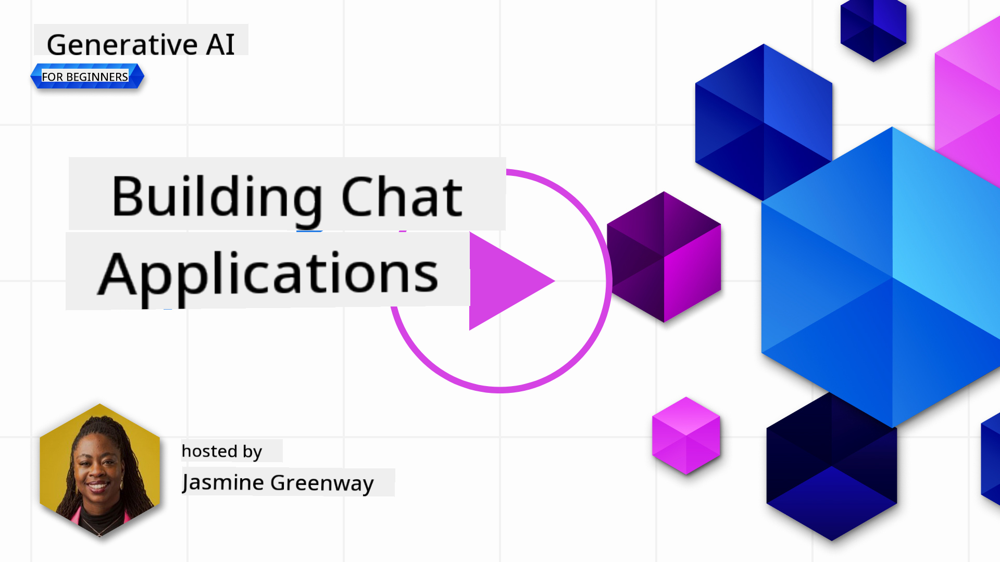
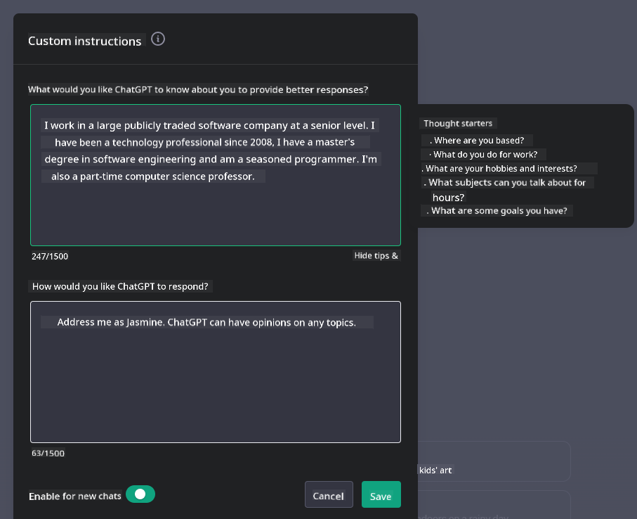

<!--
CO_OP_TRANSLATOR_METADATA:
{
  "original_hash": "ea4bbe640847aafbbba14dae4625e9af",
  "translation_date": "2025-07-09T12:13:33+00:00",
  "source_file": "07-building-chat-applications/README.md",
  "language_code": "en"
}
-->
# Building Generative AI-Powered Chat Applications

[](https://aka.ms/gen-ai-lessons7-gh?WT.mc_id=academic-105485-koreyst)

> _(Click the image above to watch the video for this lesson)_

Now that we've explored how to build text-generation apps, let's turn our attention to chat applications.

Chat applications have become a part of our everyday lives, offering much more than casual conversation. They play key roles in customer service, technical support, and even advanced advisory systems. Chances are, you’ve recently received help from a chat application. As we incorporate more advanced technologies like generative AI into these platforms, their complexity and the challenges involved grow.

Some important questions to consider are:

- **Building the app**. How can we efficiently develop and seamlessly integrate these AI-powered applications for specific use cases?
- **Monitoring**. After deployment, how do we monitor and ensure these applications maintain the highest quality, both in functionality and in alignment with the [six principles of responsible AI](https://www.microsoft.com/ai/responsible-ai?WT.mc_id=academic-105485-koreyst)?

As we advance into an era defined by automation and smooth human-machine interactions, understanding how generative AI reshapes the scope, depth, and flexibility of chat applications is crucial. This lesson will explore the architectural elements that support these complex systems, dive into methods for fine-tuning them for domain-specific tasks, and review the metrics and considerations essential for responsible AI deployment.

## Introduction

This lesson covers:

- Techniques for efficiently building and integrating chat applications.
- How to customize and fine-tune applications.
- Strategies and considerations for effectively monitoring chat applications.

## Learning Goals

By the end of this lesson, you will be able to:

- Describe key considerations for building and integrating chat applications into existing systems.
- Customize chat applications for specific use cases.
- Identify important metrics and considerations to effectively monitor and maintain the quality of AI-powered chat applications.
- Ensure chat applications use AI responsibly.

## Integrating Generative AI into Chat Applications

Enhancing chat applications with generative AI is not just about making them smarter; it’s about optimizing their architecture, performance, and user interface to deliver a high-quality user experience. This involves examining architectural foundations, API integrations, and UI design. This section provides a comprehensive roadmap to help you navigate these complex areas, whether you’re integrating into existing systems or building standalone platforms.

By the end of this section, you’ll have the knowledge needed to efficiently build and integrate chat applications.

### Chatbot or Chat Application?

Before we start building chat applications, let’s compare ‘chatbots’ and ‘AI-powered chat applications,’ as they serve different roles and functions. A chatbot’s main goal is to automate specific conversational tasks, like answering FAQs or tracking a package. It usually operates based on rule-based logic or complex AI algorithms. In contrast, an AI-powered chat application is a much broader environment designed to support various forms of digital communication, including text, voice, and video chats among human users. Its defining feature is the integration of a generative AI model that simulates nuanced, human-like conversations, generating responses based on diverse inputs and contextual cues. A generative AI-powered chat application can engage in open-domain discussions, adapt to changing conversational contexts, and even create creative or complex dialogue.

The table below highlights the key differences and similarities to clarify their distinct roles in digital communication.

| Chatbot                               | Generative AI-Powered Chat Application |
| ------------------------------------- | -------------------------------------- |
| Task-focused and rule-based           | Context-aware                          |
| Often integrated into larger systems  | May host one or multiple chatbots      |
| Limited to programmed functions       | Incorporates generative AI models      |
| Specialized & structured interactions | Capable of open-domain discussions     |

### Leveraging Pre-Built Functionalities with SDKs and APIs

When building a chat application, a smart first step is to evaluate what’s already available. Using SDKs and APIs to build chat applications is a beneficial approach for several reasons. By integrating well-documented SDKs and APIs, you position your application for long-term success, addressing scalability and maintenance challenges.

- **Speeds up development and reduces overhead**: Using pre-built features instead of building everything from scratch lets you focus on other important parts of your app, like business logic.
- **Better performance**: When building features yourself, you’ll eventually ask, “How does this scale? Can it handle a sudden surge of users?” Well-maintained SDKs and APIs often include built-in solutions for these issues.
- **Easier maintenance**: Updates and improvements are simpler to manage since most APIs and SDKs only require updating a library when a new version is released.
- **Access to cutting-edge technology**: Using models that have been fine-tuned and trained on large datasets gives your app advanced natural language capabilities.

Accessing SDK or API functionality usually requires permission to use the services, often through a unique key or authentication token. We’ll use the OpenAI Python Library to demonstrate this. You can also try it yourself in the following [OpenAI notebook](python/oai-assignment.ipynb) or [Azure OpenAI Services notebook](python/aoai-assignment.ipynb) for this lesson.

```python
import os
from openai import OpenAI

API_KEY = os.getenv("OPENAI_API_KEY","")

client = OpenAI(
    api_key=API_KEY
    )

chat_completion = client.chat.completions.create(model="gpt-3.5-turbo", messages=[{"role": "user", "content": "Suggest two titles for an instructional lesson on chat applications for generative AI."}])
```

The example above uses the GPT-3.5 Turbo model to complete the prompt, but note that the API key must be set beforehand. You’ll get an error if the key isn’t set.

## User Experience (UX)

General UX principles apply to chat applications, but here are some additional considerations that become especially important due to the machine learning components involved.

- **Handling ambiguity**: Generative AI models sometimes produce ambiguous answers. A feature that lets users ask for clarification can be helpful when this happens.
- **Context retention**: Advanced generative AI models can remember context within a conversation, which can greatly enhance the user experience. Allowing users to control and manage context improves usability but also raises privacy concerns. Consider how long this information is stored—introducing a retention policy can balance the need for context with privacy.
- **Personalization**: AI models that learn and adapt can offer a personalized experience. Customizing the user experience through features like user profiles not only makes users feel understood but also helps them find specific answers more efficiently, creating a more satisfying interaction.

One example of personalization is the "Custom instructions" feature in OpenAI’s ChatGPT. It lets you provide information about yourself that can serve as important context for your prompts. Here’s an example of a custom instruction.



This “profile” instructs ChatGPT to create a lesson plan on linked lists. Notice how ChatGPT considers that the user might want a more in-depth lesson plan based on her experience.


### Microsoft's System Message Framework for Large Language Models

[Microsoft provides guidance](https://learn.microsoft.com/azure/ai-services/openai/concepts/system-message#define-the-models-output-format?WT.mc_id=academic-105485-koreyst) on writing effective system messages for generating responses from LLMs, broken down into four areas:

1. Defining who the model is for, along with its capabilities and limitations.
2. Defining the model’s output format.
3. Providing specific examples that demonstrate the model’s intended behavior.
4. Adding additional behavioral guardrails.

### Accessibility

Whether users have visual, auditory, motor, or cognitive impairments, a well-designed chat application should be accessible to all. The following list outlines features aimed at improving accessibility for various impairments.

- **Visual Impairment**: High contrast themes, resizable text, screen reader compatibility.
- **Auditory Impairment**: Text-to-speech and speech-to-text functions, visual cues for audio notifications.
- **Motor Impairment**: Keyboard navigation support, voice commands.
- **Cognitive Impairment**: Simplified language options.

## Customization and Fine-Tuning for Domain-Specific Language Models

Imagine a chat application that understands your company’s jargon and anticipates the specific questions your users commonly ask. There are a couple of approaches worth considering:

- **Leveraging DSL models**. DSL stands for domain-specific language. You can use a DSL model trained on a particular domain to understand its concepts and scenarios.
- **Applying fine-tuning**. Fine-tuning involves further training your model with specific data.

## Customization: Using a DSL

Using domain-specific language models (DSL models) can boost user engagement by providing specialized, contextually relevant interactions. These models are trained or fine-tuned to understand and generate text related to a particular field, industry, or subject. Options for using a DSL model range from training one from scratch to using pre-existing models via SDKs and APIs. Another option is fine-tuning, which adapts an existing pre-trained model for a specific domain.

## Customization: Applying Fine-Tuning

Fine-tuning is often considered when a pre-trained model doesn’t perform well enough in a specialized domain or task.

For example, medical queries are complex and require a lot of context. When a medical professional diagnoses a patient, they consider many factors like lifestyle or pre-existing conditions, and may rely on recent medical journals to support their diagnosis. In such nuanced cases, a general-purpose AI chat application can’t be a reliable source.

### Scenario: a medical application

Imagine a chat application designed to assist medical practitioners by providing quick access to treatment guidelines, drug interactions, or recent research findings.

A general-purpose model might handle basic medical questions or general advice, but it may struggle with:

- **Highly specific or complex cases**. For example, a neurologist might ask, “What are the current best practices for managing drug-resistant epilepsy in pediatric patients?”
- **Lack of recent advancements**. A general-purpose model might not provide answers that include the latest developments in neurology and pharmacology.

In these cases, fine-tuning the model with a specialized medical dataset can greatly improve its ability to handle complex medical inquiries accurately and reliably. This requires access to a large, relevant dataset that reflects the domain-specific challenges and questions to be addressed.

## Considerations for a High-Quality AI-Driven Chat Experience

This section outlines criteria for “high-quality” chat applications, including capturing actionable metrics and following a framework that responsibly leverages AI technology.

### Key Metrics

To maintain high-quality performance, it’s essential to track key metrics and considerations. These measurements ensure not only the application’s functionality but also assess the AI model’s quality and the user experience. Below is a list covering basic, AI, and user experience metrics to keep in mind.

| Metric                        | Definition                                                                                                             | Considerations for Chat Developer                                         |
| ----------------------------- | ---------------------------------------------------------------------------------------------------------------------- | ------------------------------------------------------------------------- |
| **Uptime**                    | Measures the time the application is operational and accessible to users.                                              | How will you minimize downtime?                                           |
| **Response Time**             | The time it takes for the application to respond to a user’s query.                                                    | How can you optimize query processing to improve response time?           |
| **Precision**                 | The ratio of true positive predictions to the total number of positive predictions.                                     | How will you validate your model’s precision?                             |
| **Recall (Sensitivity)**      | The ratio of true positive predictions to the actual number of positives.                                               | How will you measure and improve recall?                                  |
| **F1 Score**                  | The harmonic mean of precision and recall, balancing the trade-off between both.                                       | What is your target F1 Score? How will you balance precision and recall?  |
| **Perplexity**                | Measures how well the model’s predicted probability distribution matches the actual data distribution.                  | How will you minimize perplexity?                                         |
| **User Satisfaction Metrics** | Measures users’ perception of the application, often collected through surveys.                                        | How often will you gather user feedback? How will you adapt based on it?  |
| **Error Rate**                | The frequency at which the model makes mistakes in understanding or output.                                            | What strategies do you have to reduce error rates?                        |
| **Retraining Cycles**         | How often the model is updated to incorporate new data and insights.                                                   | How often will you retrain the model? What triggers a retraining cycle?   |
| **Anomaly Detection**         | Tools and techniques for identifying unusual patterns that don’t follow expected behavior.                        | How will you respond to anomalies?                                        |

### Implementing Responsible AI Practices in Chat Applications

Microsoft’s approach to Responsible AI highlights six principles that should guide AI development and use. Below are the principles, their definitions, and what chat developers should consider and why these points matter.

| Principles             | Microsoft’s Definition                                | Considerations for Chat Developer                                      | Why It’s Important                                                                     |
| ---------------------- | ----------------------------------------------------- | ---------------------------------------------------------------------- | -------------------------------------------------------------------------------------- |
| Fairness               | AI systems should treat everyone fairly.              | Make sure the chat app does not discriminate based on user data.       | Builds trust and inclusivity among users; helps avoid legal issues.                    |
| Reliability and Safety | AI systems should work reliably and safely.            | Use testing and fail-safes to reduce errors and risks.                 | Ensures user satisfaction and prevents possible harm.                                 |
| Privacy and Security   | AI systems should be secure and respect privacy.       | Apply strong encryption and data protection measures.                  | Protects sensitive user data and ensures compliance with privacy regulations.          |
| Inclusiveness          | AI systems should empower and engage everyone.         | Design UI/UX that is accessible and easy to use for diverse users.     | Makes the app usable by a broader audience.                                           |
| Transparency           | AI systems should be understandable.                   | Provide clear documentation and explanations for AI responses.        | Users are more likely to trust the system if they understand how decisions are made.   |
| Accountability         | People should be responsible for AI systems.           | Set up clear processes for auditing and improving AI decisions.        | Supports continuous improvement and corrective actions when mistakes occur.            |

## Assignment

See [assignment](../../../07-building-chat-applications/python) for a series of exercises, from running your first chat prompts to classifying and summarizing text and more. Note that assignments are available in multiple programming languages!

## Great Work! Continue the Journey

After finishing this lesson, explore our [Generative AI Learning collection](https://aka.ms/genai-collection?WT.mc_id=academic-105485-koreyst) to keep advancing your Generative AI skills!

Head over to Lesson 8 to learn how to start [building search applications](../08-building-search-applications/README.md?WT.mc_id=academic-105485-koreyst)!

**Disclaimer**:  
This document has been translated using the AI translation service [Co-op Translator](https://github.com/Azure/co-op-translator). While we strive for accuracy, please be aware that automated translations may contain errors or inaccuracies. The original document in its native language should be considered the authoritative source. For critical information, professional human translation is recommended. We are not liable for any misunderstandings or misinterpretations arising from the use of this translation.