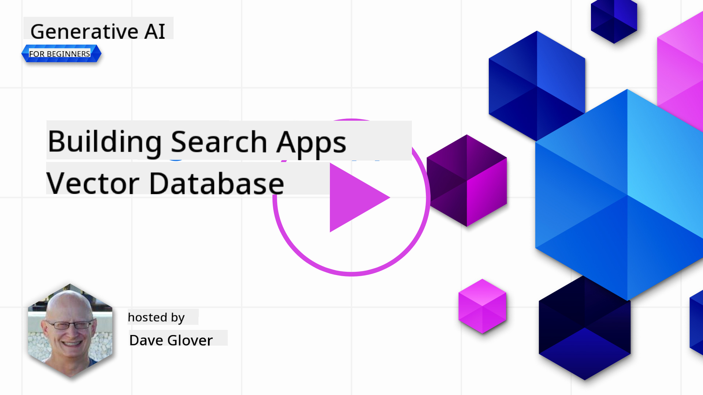

<!--
CO_OP_TRANSLATOR_METADATA:
{
  "original_hash": "d46aad0917a1a342d613e2c13d457da5",
  "translation_date": "2025-05-19T18:17:48+00:00",
  "source_file": "08-building-search-applications/README.md",
  "language_code": "en"
}
-->
# Building a Search Applications

[](https://aka.ms/gen-ai-lesson8-gh?WT.mc_id=academic-105485-koreyst)

> > _Click the image above to view video of this lesson_

LLMs aren't just for chatbots and text generation. You can also build search applications using Embeddings. Embeddings are numerical representations of data, also known as vectors, and can be used for semantic search.

In this lesson, you will build a search application for our education startup. Our startup is a non-profit organization providing free education to students in developing countries. We have a large collection of YouTube videos that students can use to learn about AI. We want to build a search application that allows students to find a YouTube video by typing a question.

For example, a student might type 'What are Jupyter Notebooks?' or 'What is Azure ML', and the search application will return a list of relevant YouTube videos. Even better, it will provide a link to the exact place in the video where the answer is found.

## Introduction

In this lesson, we will cover:

- Semantic vs Keyword search.
- What are Text Embeddings.
- Creating a Text Embeddings Index.
- Searching a Text Embeddings Index.

## Learning Goals

After completing this lesson, you will be able to:

- Distinguish between semantic and keyword search.
- Explain what Text Embeddings are.
- Create an application using Embeddings to search for data.

## Why build a search application?

Building a search application will help you understand how to use Embeddings for data search. You will also learn to create a search application that students can use to find information quickly.

The lesson includes an Embedding Index of YouTube transcripts from the Microsoft [AI Show](https://www.youtube.com/playlist?list=PLlrxD0HtieHi0mwteKBOfEeOYf0LJU4O1) YouTube channel, which teaches AI and machine learning. The Embedding Index contains Embeddings for each transcript up until Oct 2023. You will use the Embedding Index to build a search application for our startup. The application returns a link to the exact place in the video where the answer is found, helping students find the information they need quickly.

The following is an example of a semantic query for the question 'can you use rstudio with azure ml?'. Check out the YouTube URL; it contains a timestamp that directs you to the part of the video where the answer is located.


## What is semantic search?

You might be wondering, what is semantic search? Semantic search is a technique that uses the meaning of words in a query to return relevant results.

Here's an example of semantic search. If you're looking to buy a car, you might search for 'my dream car'. Semantic search understands you're not `dreaming` about a car, but you're looking to buy your `ideal` car. It grasps your intention and returns relevant results. The alternative is `keyword search`, which would literally search for dreams about cars, often returning irrelevant results.

## What are Text Embeddings?

[Text embeddings](https://en.wikipedia.org/wiki/Word_embedding?WT.mc_id=academic-105485-koreyst) are a text representation technique used in [natural language processing](https://en.wikipedia.org/wiki/Natural_language_processing?WT.mc_id=academic-105485-koreyst). Text embeddings are semantic numerical representations of text, making data easy for a machine to understand. There are many models for building text embeddings; in this lesson, we'll focus on generating embeddings using the OpenAI Embedding Model.

Here's an example: imagine the following text is in a transcript from one of the AI Show YouTube episodes:

```text
Today we are going to learn about Azure Machine Learning.
```

We'd pass the text to the OpenAI Embedding API, which would return the following embedding of 1536 numbers, aka a vector. Each number represents a different aspect of the text. For brevity, here are the first 10 numbers in the vector.

```python
[-0.006655829958617687, 0.0026128944009542465, 0.008792596869170666, -0.02446001023054123, -0.008540431968867779, 0.022071078419685364, -0.010703742504119873, 0.003311325330287218, -0.011632772162556648, -0.02187200076878071, ...]
```

## How is the Embedding index created?

The Embedding index for this lesson was created with a series of Python scripts. You'll find the scripts and instructions in the [README](./scripts/README.md?WT.mc_id=academic-105485-koreyst) in the 'scripts' folder for this lesson. You don't need to run these scripts to complete this lesson, as the Embedding Index is provided.

The scripts perform the following operations:

1. The transcript for each YouTube video in the [AI Show](https://www.youtube.com/playlist?list=PLlrxD0HtieHi0mwteKBOfEeOYf0LJU4O1) playlist is downloaded.
2. Using [OpenAI Functions](https://learn.microsoft.com/azure/ai-services/openai/how-to/function-calling?WT.mc_id=academic-105485-koreyst), an attempt is made to extract the speaker name from the first 3 minutes of the YouTube transcript. The speaker name for each video is stored in the Embedding Index named `embedding_index_3m.json`.
3. The transcript text is chunked into **3-minute text segments**. Each segment includes about 20 words overlapping from the next segment to ensure the Embedding for the segment isn't cut off and to provide better search context.
4. Each text segment is passed to the OpenAI Chat API to summarize the text into 60 words. The summary is also stored in the Embedding Index `embedding_index_3m.json`.
5. Finally, the segment text is passed to the OpenAI Embedding API. The Embedding API returns a vector of 1536 numbers representing the segment's semantic meaning. The segment and the OpenAI Embedding vector are stored in an Embedding Index `embedding_index_3m.json`.

### Vector Databases

For lesson simplicity, the Embedding Index is stored in a JSON file named `embedding_index_3m.json` and loaded into a Pandas DataFrame. However, in production, the Embedding Index would be stored in a vector database such as [Azure Cognitive Search](https://learn.microsoft.com/training/modules/improve-search-results-vector-search?WT.mc_id=academic-105485-koreyst), [Redis](https://cookbook.openai.com/examples/vector_databases/redis/readme?WT.mc_id=academic-105485-koreyst), [Pinecone](https://cookbook.openai.com/examples/vector_databases/pinecone/readme?WT.mc_id=academic-105485-koreyst), [Weaviate](https://cookbook.openai.com/examples/vector_databases/weaviate/readme?WT.mc_id=academic-105485-koreyst), to name a few.

## Understanding cosine similarity

We've learned about text embeddings; the next step is to learn how to use them to search for data and find the most similar embeddings to a given query using cosine similarity.

### What is cosine similarity?

Cosine similarity measures similarity between two vectors, also known as `nearest neighbor search`. To perform a cosine similarity search, you need to _vectorize_ the _query_ text using the OpenAI Embedding API. Then calculate the _cosine similarity_ between the query vector and each vector in the Embedding Index. Remember, the Embedding Index has a vector for each YouTube transcript text segment. Finally, sort the results by cosine similarity, and the text segments with the highest cosine similarity are the most similar to the query.

Mathematically, cosine similarity measures the cosine of the angle between two vectors projected in a multidimensional space. This measurement is beneficial because if two documents are far apart by Euclidean distance due to size, they could still have a smaller angle between them and therefore higher cosine similarity. For more on cosine similarity equations, see [Cosine similarity](https://en.wikipedia.org/wiki/Cosine_similarity?WT.mc_id=academic-105485-koreyst).

## Building your first search application

Next, we're going to learn how to build a search application using Embeddings. The search application will allow students to search for a video by typing a question. The search application will return a list of videos relevant to the question. It will also provide a link to the exact place in the video where the answer is located.

This solution was built and tested on Windows 11, macOS, and Ubuntu 22.04 using Python 3.10 or later. You can download Python from [python.org](https://www.python.org/downloads/?WT.mc_id=academic-105485-koreyst).

## Assignment - building a search application, to enable students

We introduced our startup at the beginning of this lesson. Now it's time to enable students to build a search application for their assessments.

In this assignment, you will create the Azure OpenAI Services that will be used to build the search application. You will create the following Azure OpenAI Services. You'll need an Azure subscription to complete this assignment.

### Start the Azure Cloud Shell

1. Sign in to the [Azure portal](https://portal.azure.com/?WT.mc_id=academic-105485-koreyst).
2. Select the Cloud Shell icon in the upper-right corner of the Azure portal.
3. Select **Bash** for the environment type.

#### Create a resource group

> For these instructions, we're using the resource group named "semantic-video-search" in East US.
> You can change the name of the resource group, but when changing the location for the resources,
> check the [model availability table](https://aka.ms/oai/models?WT.mc_id=academic-105485-koreyst).

```shell
az group create --name semantic-video-search --location eastus
```

#### Create an Azure OpenAI Service resource

From the Azure Cloud Shell, run the following command to create an Azure OpenAI Service resource.

```shell
az cognitiveservices account create --name semantic-video-openai --resource-group semantic-video-search \
    --location eastus --kind OpenAI --sku s0
```

#### Get the endpoint and keys for usage in this application

From the Azure Cloud Shell, run the following commands to get the endpoint and keys for the Azure OpenAI Service resource.

```shell
az cognitiveservices account show --name semantic-video-openai \
   --resource-group  semantic-video-search | jq -r .properties.endpoint
az cognitiveservices account keys list --name semantic-video-openai \
   --resource-group semantic-video-search | jq -r .key1
```

#### Deploy the OpenAI Embedding model

From the Azure Cloud Shell, run the following command to deploy the OpenAI Embedding model.

```shell
az cognitiveservices account deployment create \
    --name semantic-video-openai \
    --resource-group  semantic-video-search \
    --deployment-name text-embedding-ada-002 \
    --model-name text-embedding-ada-002 \
    --model-version "2"  \
    --model-format OpenAI \
    --sku-capacity 100 --sku-name "Standard"
```

## Solution

Open the [solution notebook](../../../08-building-search-applications/python/aoai-solution.ipynb) in GitHub Codespaces and follow the instructions in the Jupyter Notebook.

When you run the notebook, you'll be prompted to enter a query. The input box will look like this:


## Great Work! Continue Your Learning

After completing this lesson, check out our [Generative AI Learning collection](https://aka.ms/genai-collection?WT.mc_id=academic-105485-koreyst) to continue leveling up your Generative AI knowledge!

Head over to Lesson 9 where we will look at how to [build image generation applications](../09-building-image-applications/README.md?WT.mc_id=academic-105485-koreyst)!

**Disclaimer**:  
This document has been translated using the AI translation service [Co-op Translator](https://github.com/Azure/co-op-translator). While we strive for accuracy, please be aware that automated translations may contain errors or inaccuracies. The original document in its native language should be considered the authoritative source. For critical information, professional human translation is recommended. We are not liable for any misunderstandings or misinterpretations arising from the use of this translation.