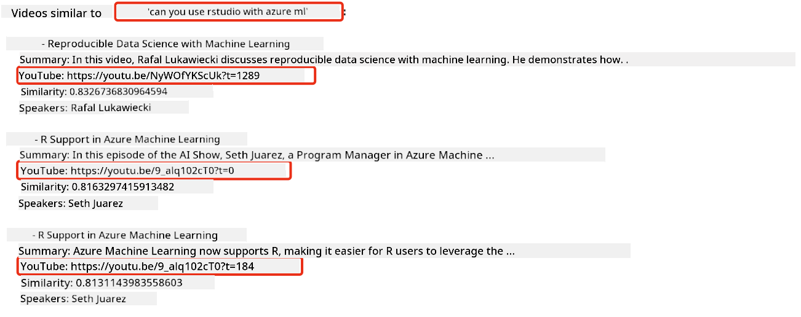

<!--
CO_OP_TRANSLATOR_METADATA:
{
  "original_hash": "d46aad0917a1a342d613e2c13d457da5",
  "translation_date": "2025-07-09T12:45:17+00:00",
  "source_file": "08-building-search-applications/README.md",
  "language_code": "en"
}
-->
# Building a Search Application

[](https://aka.ms/gen-ai-lesson8-gh?WT.mc_id=academic-105485-koreyst)

> > _Click the image above to watch the video for this lesson_

LLMs are more than just chatbots and text generators. You can also create search applications using Embeddings. Embeddings are numerical representations of data, also called vectors, which can be used for semantic search.

In this lesson, you will build a search application for our education startup. Our startup is a non-profit organization that offers free education to students in developing countries. We have a large collection of YouTube videos that students can use to learn about AI. The goal is to build a search application that lets students find a YouTube video by typing a question.

For example, a student might type "What are Jupyter Notebooks?" or "What is Azure ML?" and the search app will return a list of relevant YouTube videos. Even better, the app will provide a link to the exact point in the video where the answer can be found.

## Introduction

In this lesson, we will cover:

- Semantic search vs. keyword search.
- What Text Embeddings are.
- How to create a Text Embeddings Index.
- How to search a Text Embeddings Index.

## Learning Goals

By the end of this lesson, you will be able to:

- Differentiate between semantic and keyword search.
- Explain what Text Embeddings are.
- Build an application that uses Embeddings to search data.

## Why build a search application?

Building a search application will help you understand how to use Embeddings for data search. You’ll also learn how to create a tool that students can use to quickly find information.

This lesson includes an Embedding Index of YouTube transcripts from the Microsoft [AI Show](https://www.youtube.com/playlist?list=PLlrxD0HtieHi0mwteKBOfEeOYf0LJU4O1) YouTube channel. The AI Show teaches AI and machine learning concepts. The Embedding Index contains embeddings for all transcripts up to October 2023. You will use this index to build a search app for our startup. The app will return a link to the exact spot in the video where the answer is located, making it easy for students to find what they need quickly.

Here’s an example of a semantic query for the question "can you use rstudio with azure ml?". Notice the YouTube URL includes a timestamp that takes you directly to the part of the video with the answer.



## What is semantic search?

You might be wondering, what exactly is semantic search? Semantic search is a technique that uses the meaning of the words in a query to return relevant results.

For example, if you were looking to buy a car and searched for "my dream car," semantic search understands that you’re not literally dreaming about a car, but looking for your ideal car. It interprets your intent and returns relevant results. In contrast, keyword search would look for the exact words "dream" and "car," often returning irrelevant results.

## What are Text Embeddings?

[Text embeddings](https://en.wikipedia.org/wiki/Word_embedding?WT.mc_id=academic-105485-koreyst) are a way to represent text in [natural language processing](https://en.wikipedia.org/wiki/Natural_language_processing?WT.mc_id=academic-105485-koreyst). They are semantic numerical representations of text, making it easier for machines to understand. There are many models for creating text embeddings; in this lesson, we focus on generating embeddings using the OpenAI Embedding Model.

For example, imagine the following text is from a transcript of an AI Show episode:

```text
Today we are going to learn about Azure Machine Learning.
```

We send this text to the OpenAI Embedding API, which returns an embedding vector of 1536 numbers. Each number captures a different aspect of the text. For brevity, here are the first 10 numbers in the vector:

```python
[-0.006655829958617687, 0.0026128944009542465, 0.008792596869170666, -0.02446001023054123, -0.008540431968867779, 0.022071078419685364, -0.010703742504119873, 0.003311325330287218, -0.011632772162556648, -0.02187200076878071, ...]
```

## How is the Embedding index created?

The Embedding index for this lesson was created using a series of Python scripts. You can find these scripts and instructions in the [README](./scripts/README.md?WT.mc_id=academic-105485-koreyst) inside the 'scripts' folder for this lesson. You don’t need to run these scripts yourself, as the Embedding Index is already provided.

The scripts perform the following steps:

1. Download the transcript for each YouTube video in the [AI Show](https://www.youtube.com/playlist?list=PLlrxD0HtieHi0mwteKBOfEeOYf0LJU4O1) playlist.
2. Using [OpenAI Functions](https://learn.microsoft.com/azure/ai-services/openai/how-to/function-calling?WT.mc_id=academic-105485-koreyst), attempt to extract the speaker’s name from the first 3 minutes of each transcript. The speaker name for each video is stored in the Embedding Index file `embedding_index_3m.json`.
3. Split the transcript into **3-minute text segments**. Each segment overlaps about 20 words with the next segment to avoid cutting off embeddings and to provide better search context.
4. Pass each text segment to the OpenAI Chat API to generate a 60-word summary. This summary is also stored in `embedding_index_3m.json`.
5. Send each segment to the OpenAI Embedding API, which returns a 1536-number vector representing the segment’s semantic meaning. The segment and its embedding vector are stored in `embedding_index_3m.json`.

### Vector Databases

For simplicity, the Embedding Index is stored as a JSON file named `embedding_index_3m.json` and loaded into a Pandas DataFrame. However, in production, the Embedding Index would be stored in a vector database such as [Azure Cognitive Search](https://learn.microsoft.com/training/modules/improve-search-results-vector-search?WT.mc_id=academic-105485-koreyst), [Redis](https://cookbook.openai.com/examples/vector_databases/redis/readme?WT.mc_id=academic-105485-koreyst), [Pinecone](https://cookbook.openai.com/examples/vector_databases/pinecone/readme?WT.mc_id=academic-105485-koreyst), or [Weaviate](https://cookbook.openai.com/examples/vector_databases/weaviate/readme?WT.mc_id=academic-105485-koreyst), among others.

## Understanding cosine similarity

Now that we’ve covered text embeddings, the next step is to learn how to use them to search data, specifically by finding the most similar embeddings to a query using cosine similarity.

### What is cosine similarity?

Cosine similarity measures how similar two vectors are. This is also called `nearest neighbor search`. To perform a cosine similarity search, you first _vectorize_ the _query_ text using the OpenAI Embedding API. Then, calculate the _cosine similarity_ between the query vector and each vector in the Embedding Index. Remember, the Embedding Index contains a vector for each YouTube transcript segment. Finally, sort the results by cosine similarity—the segments with the highest scores are the most similar to the query.

Mathematically, cosine similarity measures the cosine of the angle between two vectors in multidimensional space. This is useful because even if two documents are far apart in Euclidean distance due to size differences, they can still have a small angle between them, resulting in a high cosine similarity. For more details on the math, see [Cosine similarity](https://en.wikipedia.org/wiki/Cosine_similarity?WT.mc_id=academic-105485-koreyst).

## Building your first search application

Next, we’ll build a search application using Embeddings. This app will let students search for videos by typing a question. It will return a list of relevant videos and provide a link to the exact spot in the video where the answer is found.

This solution was built and tested on Windows 11, macOS, and Ubuntu 22.04 using Python 3.10 or later. You can download Python from [python.org](https://www.python.org/downloads/?WT.mc_id=academic-105485-koreyst).

## Assignment - building a search application to help students

We introduced our startup at the beginning of this lesson. Now it’s time for students to build a search application as part of their assessment.

In this assignment, you will create the Azure OpenAI Services needed to build the search app. You will set up the following Azure OpenAI Services. An Azure subscription is required to complete this assignment.

### Start the Azure Cloud Shell

1. Sign in to the [Azure portal](https://portal.azure.com/?WT.mc_id=academic-105485-koreyst).
2. Click the Cloud Shell icon in the upper-right corner.
3. Choose **Bash** as the environment.

#### Create a resource group

> For these instructions, we use the resource group named "semantic-video-search" in East US.
> You can change the resource group name, but if you change the resource location,
> check the [model availability table](https://aka.ms/oai/models?WT.mc_id=academic-105485-koreyst).

```shell
az group create --name semantic-video-search --location eastus
```

#### Create an Azure OpenAI Service resource

In the Azure Cloud Shell, run the following command to create an Azure OpenAI Service resource.

```shell
az cognitiveservices account create --name semantic-video-openai --resource-group semantic-video-search \
    --location eastus --kind OpenAI --sku s0
```

#### Get the endpoint and keys for use in this application

In the Azure Cloud Shell, run these commands to retrieve the endpoint and keys for your Azure OpenAI Service resource.

```shell
az cognitiveservices account show --name semantic-video-openai \
   --resource-group  semantic-video-search | jq -r .properties.endpoint
az cognitiveservices account keys list --name semantic-video-openai \
   --resource-group semantic-video-search | jq -r .key1
```

#### Deploy the OpenAI Embedding model

In the Azure Cloud Shell, run the following command to deploy the OpenAI Embedding model.

```shell
az cognitiveservices account deployment create \
    --name semantic-video-openai \
    --resource-group  semantic-video-search \
    --deployment-name text-embedding-ada-002 \
    --model-name text-embedding-ada-002 \
    --model-version "2"  \
    --model-format OpenAI \
    --sku-capacity 100 --sku-name "Standard"
```

## Solution

Open the [solution notebook](python/aoai-solution.ipynb) in GitHub Codespaces and follow the instructions in the Jupyter Notebook.

When you run the notebook, you’ll be prompted to enter a query. The input box will look like this:


## Great job! Keep learning

After finishing this lesson, check out our [Generative AI Learning collection](https://aka.ms/genai-collection?WT.mc_id=academic-105485-koreyst) to continue advancing your knowledge of Generative AI!

Next, head to Lesson 9 where we’ll explore how to [build image generation applications](../09-building-image-applications/README.md?WT.mc_id=academic-105485-koreyst)!

**Disclaimer**:  
This document has been translated using the AI translation service [Co-op Translator](https://github.com/Azure/co-op-translator). While we strive for accuracy, please be aware that automated translations may contain errors or inaccuracies. The original document in its native language should be considered the authoritative source. For critical information, professional human translation is recommended. We are not liable for any misunderstandings or misinterpretations arising from the use of this translation.