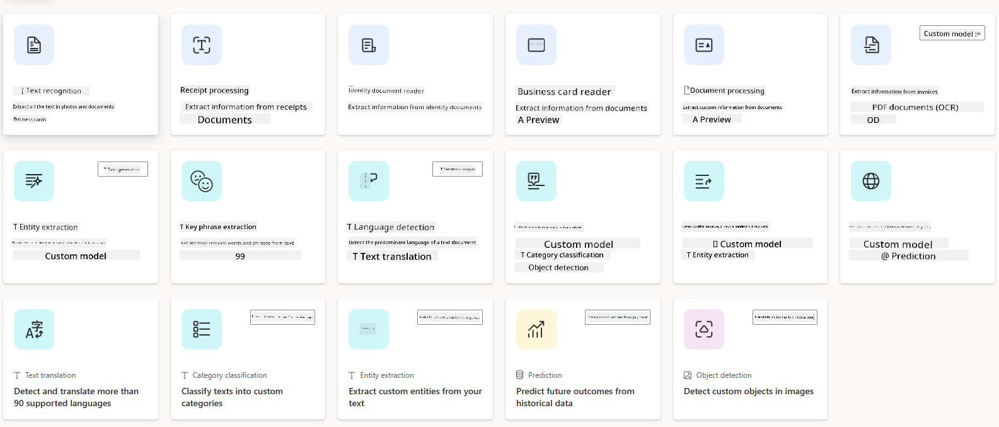

<!--
CO_OP_TRANSLATOR_METADATA:
{
  "original_hash": "f5ff3b6204a695a117d6f452403c95f7",
  "translation_date": "2025-05-19T19:28:53+00:00",
  "source_file": "10-building-low-code-ai-applications/README.md",
  "language_code": "en"
}
-->
text. - **Sentiment Analysis**: This model analyzes the sentiment of text. - **Text Recognition**: This model recognizes printed and handwritten text in images. - **Entity Extraction**: This model extracts entities from text.

Custom AI Models, on the other hand, allow you to build your own AI Models tailored to your specific business needs. You can train these models using your data to perform tasks that are unique to your organization. With Custom AI Models, you have the flexibility to create models that can automate processes and predict outcomes based on the data you provide.

### Using AI Builder in Power Platform

AI Builder provides a simple and intuitive interface that allows you to create, train, and deploy AI Models in Power Platform without requiring any data science expertise. You can use AI Builder to create both Prebuilt and Custom AI Models and integrate them into your apps and flows.

To use AI Builder in Power Platform, follow these steps:

1. Navigate to the Power Apps or Power Automate home screen.

2. On the left navigation bar, select **AI Builder**.

3. Choose whether you want to use a Prebuilt AI Model or create a Custom AI Model.

4. Follow the on-screen instructions to create, train, and deploy your AI Model.

5. Once your AI Model is ready, you can integrate it into your apps and flows to automate processes and predict outcomes.

## Conclusion

In this lesson, we've explored how to build low-code AI applications using Power Platform. We've learned how to use Copilot to create apps and flows and how AI Builder can help us automate processes and predict outcomes using AI Models. By leveraging the capabilities of Power Platform, we can empower both traditional developers and non-developers to build AI-powered solutions quickly and efficiently.

As you continue to explore the Power Platform, consider how you can use its features to solve real-world problems and create innovative solutions for your organization or business. Whether you're building apps, automating workflows, or analyzing data, the Power Platform provides the tools and technologies you need to succeed in the world of low-code AI development.
a text. - **Sentiment Analysis**: This model identifies positive, negative, neutral, or mixed feelings in text. - **Business Card Reader**: This model extracts information from business cards. - **Text Recognition**: This model extracts text from images. - **Object Detection**: This model identifies and extracts objects from images. - **Document Processing**: This model extracts information from forms. - **Invoice Processing**: This model extracts information from invoices. With Custom AI Models, you can integrate your own model into AI Builder, enabling it to operate like any AI Builder custom model, allowing you to train the model using your own data. You can utilize these models to automate processes and predict outcomes in both Power Apps and Power Automate. There are limitations when using your own model. Learn more about these [limitations](https://learn.microsoft.com/ai-builder/byo-model#limitations?WT.mc_id=academic-105485-koreyst).  ## Assignment #2 - Build an Invoice Processing Flow for Our Startup The finance team has been having trouble processing invoices. They've been using a spreadsheet to keep track of invoices, but managing it has become challenging as the number of invoices has grown. They have requested you to create a workflow that will assist them in processing invoices using AI. The workflow should allow them to extract information from invoices and store the data in a Dataverse table. Additionally, the workflow should enable them to send an email to the finance team with the extracted information. Now that you understand what AI Builder is and why it should be used, let's explore how you can use the Invoice Processing AI Model in AI Builder, which we discussed earlier, to create a workflow that will aid the finance team in processing invoices. To create a workflow that will assist the finance team in processing invoices using the Invoice Processing AI Model in AI Builder, follow these steps: 1. Navigate to the [Power Automate](https://make.powerautomate.com?WT.mc_id=academic-105485-koreyst) home screen. 2. Use the text area on the home screen to describe the workflow you want to create. For example, **_Process an invoice when it arrives in my mailbox_**. Click on the **Send** button to submit the prompt to the AI Copilot.  3. The AI Copilot will suggest actions you need to perform the task you wish to automate. You can click on the **Next** button to proceed to the following steps. 4. In the next step, Power Automate will prompt you to set up the necessary connections for the flow. Once completed, click on the **Create flow** button to establish the flow. 5. The AI Copilot will generate a flow, which you can then customize to suit your needs. 6. Update the trigger of the flow and set the **Folder** to the location where invoices will be stored. For instance, you can set the folder to **Inbox**. Click on **Show advanced options** and set **Only with Attachments** to **Yes**. This will ensure the flow only runs when an email with an attachment is received in the folder. 7. Remove the following actions from the flow: **HTML to text**, **Compose**, **Compose 2**, **Compose 3**, and **Compose 4** as they will not be utilized. 8. Remove the **Condition** action from the flow since it will not be used. It should resemble the following screenshot:  9. Click on the **Add an action** button and search for **Dataverse**. Select the **Add a new row** action. 10. In the **Extract Information from invoices** action, update the **Invoice File** to point to the **Attachment Content** from the email. This will ensure the flow extracts information from the invoice attachment. 11. Select the **Table** you created earlier. For instance, you can select the **Invoice Information** table. Use dynamic content from the previous action to populate the following fields: - ID - Amount - Date - Name - Status - Set the **Status** to **Pending**. - Supplier Email - Use the **From** dynamic content from the **When a new email arrives** trigger.  12. Once the flow is complete, click on the **Save** button to save the flow. You can then test the flow by sending an email with an invoice to the folder specified in the trigger. > **Your homework**: The flow you just created is a good starting point; now you need to consider how you can develop an automation that will allow our finance team to send an email to the supplier to update them on the current status of their invoice. Your hint: the flow must run when the status of the invoice changes.

## Use a Text Generation AI Model in Power Automate

The Create Text with GPT AI Model in AI Builder allows you to generate text based on a prompt and is powered by the Microsoft Azure OpenAI Service. This feature enables you to incorporate GPT (Generative Pre-Trained Transformer) technology into your apps and flows to create a variety of automated flows and insightful applications.

GPT models undergo extensive training on large volumes of data, enabling them to produce text that closely resembles human language when provided with a prompt. When integrated with workflow automation, AI models like GPT can be leveraged to streamline and automate a wide range of tasks.

For example, you can create flows to automatically generate text for various use cases, such as drafts of emails, product descriptions, and more. You can also use the model to generate text for various apps, such as chatbots and customer service apps that enable customer service agents to respond effectively and efficiently to customer inquiries.

To learn how to use this AI Model in Power Automate, go through the [Add intelligence with AI Builder and GPT](https://learn.microsoft.com/training/modules/ai-builder-text-generation/?WT.mc_id=academic-109639-somelezediko) module.

## Great Work! Continue Your Learning

After completing this lesson, check out our [Generative AI Learning collection](https://aka.ms/genai-collection?WT.mc_id=academic-105485-koreyst) to continue enhancing your Generative AI knowledge!

Proceed to Lesson 11, where we will explore how to [integrate Generative AI with Function Calling](../11-integrating-with-function-calling/README.md?WT.mc_id=academic-105485-koreyst)!

**Disclaimer**:  
This document has been translated using the AI translation service [Co-op Translator](https://github.com/Azure/co-op-translator). While we strive for accuracy, please be aware that automated translations may contain errors or inaccuracies. The original document in its native language should be considered the authoritative source. For critical information, professional human translation is recommended. We are not liable for any misunderstandings or misinterpretations arising from the use of this translation.