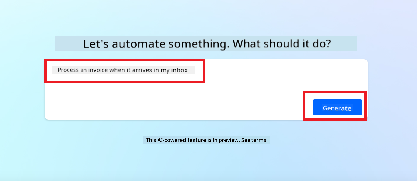
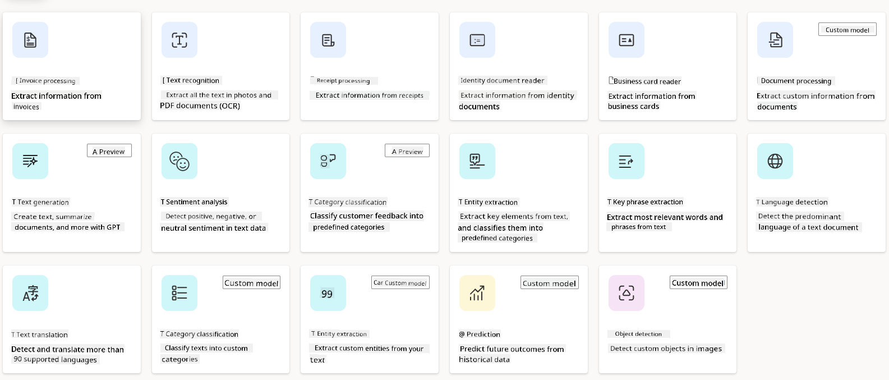
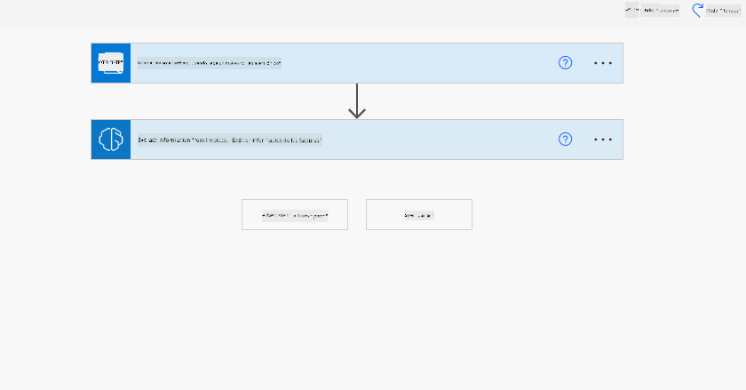
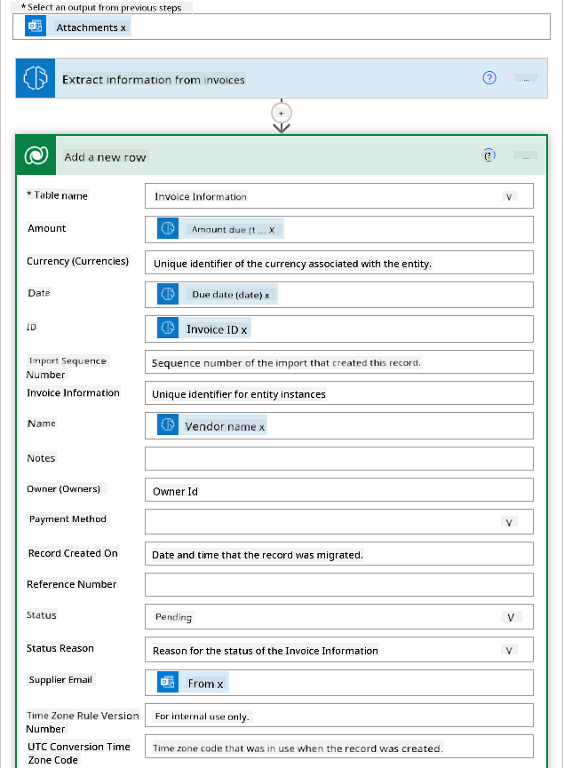
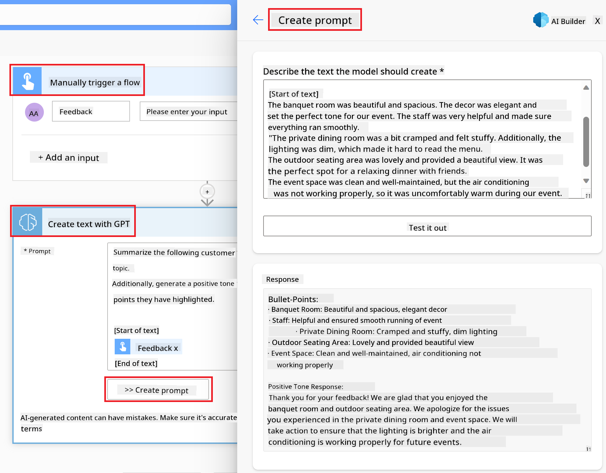

<!--
CO_OP_TRANSLATOR_METADATA:
{
  "original_hash": "f5ff3b6204a695a117d6f452403c95f7",
  "translation_date": "2025-06-25T17:43:00+00:00",
  "source_file": "10-building-low-code-ai-applications/README.md",
  "language_code": "en"
}
-->
a given text.

- **Sentiment Analysis**: This model analyzes text to determine its sentiment.

- **Text Recognition**: This model recognizes text from images.

Custom AI Models, on the other hand, allow you to build, train, and publish AI Models that are tailored to your specific business needs. You can use these models to automate processes and predict outcomes based on your own data. AI Builder provides a simple interface that enables you to build custom AI Models with little to no code. You can use AI Builder to create models for tasks such as object detection, form processing, and prediction.

## Using AI Builder to Automate Invoice Processing

Our finance team has been struggling to keep up with the invoice processing as the number of invoices has increased. They have asked you to build an automation that will help them extract all the invoice information and store it in the table you created earlier. The automation should also enable the finance team to view the invoices that have been paid and those that have not been paid.

To build the automation using AI Builder, follow the steps below:

1. Navigate to the [Power Automate](https://flow.microsoft.com?WT.mc_id=academic-105485-koreyst) home screen.

1. On the left navigation bar, select **Create** and then click on **Automated cloud flow**.

1. On the **Create an automated flow** screen, use the text area to describe the automation you want to build. For example, **_I want to automate the extraction of invoice information and store it in a table_**. Click on the **Send** button to send the prompt to the AI Copilot.

1. The AI Copilot will suggest the actions you need to perform the task you want to automate. You can then customize the actions to meet your needs using the AI Copilot assistant feature through conversational steps.

1. Once you are done with the automation, click on the **Create flow** button to create the flow.

1. The AI Copilot will generate the flow based on your description. You can then customize the flow to meet your needs.

1. To share the automation with the finance team, click on the **Share** button and then click on the **Share** button again. You can then share the automation with the finance team by entering their email addresses.

## Summary

In this lesson, we explored how to use low-code development platforms to build applications and solutions with little to no code. We learned about Power Platform and how it enables organizations to build their own solutions through an intuitive low-code or no-code environment. We also learned about Copilot and AI Builder, which enhance the low-code development experience in Power Platform by integrating generative AI.

We built a Student Assignment Tracker App using Copilot in Power Apps, and an automation for invoice processing using AI Builder in Power Automate. We also explored how to use Dataverse as a low-code data platform for storing app data.

By the end of this lesson, you should have a good understanding of how to use Copilot and AI Builder to build solutions in Power Platform. You should also be able to apply best practices when using the Create Text with GPT AI Model.
a text. - **Sentiment Analysis**: This model identifies positive, negative, neutral, or mixed feelings in text. - **Business Card Reader**: This model extracts details from business cards. - **Text Recognition**: This model extracts text from images. - **Object Detection**: This model identifies and extracts objects from images. - **Document processing**: This model extracts information from forms. - **Invoice Processing**: This model extracts details from invoices. With Custom AI Models, you can integrate your own model into AI Builder, allowing it to function like any custom AI Builder model, and enabling you to train the model using your own data. These models can be used to automate processes and predict outcomes in both Power Apps and Power Automate. There are limitations when using your own model. Learn more about these [limitations](https://learn.microsoft.com/ai-builder/byo-model#limitations?WT.mc_id=academic-105485-koreyst). 

## Assignment #2 - Build an Invoice Processing Flow for Our Startup

The finance team has been facing challenges in processing invoices. They've been using a spreadsheet to track invoices, but managing it has become difficult as the number of invoices has grown. They have requested you to create a workflow that will help them process invoices using AI. The workflow should allow them to extract information from invoices and store it in a Dataverse table. It should also enable them to send an email to the finance team with the extracted information.

Now that you understand what AI Builder is and why you should use it, let's explore how you can utilize the Invoice Processing AI Model in AI Builder, which we discussed earlier, to create a workflow that will assist the finance team in processing invoices.

To build a workflow that will aid the finance team in processing invoices using the Invoice Processing AI Model in AI Builder, follow these steps:

1. Navigate to the [Power Automate](https://make.powerautomate.com?WT.mc_id=academic-105485-koreyst) home screen.
2. Use the text area on the home screen to describe the workflow you want to build. For example, **_Process an invoice when it arrives in my mailbox_**. Click on the **Send** button to send the prompt to the AI Copilot. 
3. The AI Copilot will suggest the actions needed to perform the task you want to automate. You can click on the **Next** button to proceed to the next steps.
4. In the next step, Power Automate will prompt you to set up the connections required for the flow. Once completed, click on the **Create flow** button to create the flow.
5. The AI Copilot will generate a flow, and you can then customize it to suit your needs.
6. Update the trigger of the flow and set the **Folder** to the folder where the invoices will be stored. For example, you can set the folder to **Inbox**. Click on **Show advanced options** and set the **Only with Attachments** to **Yes**. This ensures the flow only runs when an email with an attachment is received in the folder.
7. Remove the following actions from the flow: **HTML to text**, **Compose**, **Compose 2**, **Compose 3**, and **Compose 4** as they are not needed.
8. Remove the **Condition** action from the flow as it is not required. It should look like the following screenshot: 
9. Click on the **Add an action** button and search for **Dataverse**. Select the **Add a new row** action.
10. On the **Extract Information from invoices** action, update the **Invoice File** to point to the **Attachment Content** from the email. This ensures that the flow extracts information from the invoice attachment.
11. Select the **Table** you created earlier. For example, you can select the **Invoice Information** table. Choose the dynamic content from the previous action to populate the following fields: - ID - Amount - Date - Name - Status - Set the **Status** to **Pending**. - Supplier Email - Use the **From** dynamic content from the **When a new email arrives** trigger. 
12. Once you've finished with the flow, click on the **Save** button to save it. You can then test the flow by sending an email with an invoice to the folder specified in the trigger.

> **Your homework**: The flow you just created is a good starting point. Now, think about how you can develop an automation that will allow our finance team to send an email to the supplier to update them with the current status of their invoice. Your hint: the flow must run when the status of the invoice changes.

## Use a Text Generation AI Model in Power Automate

The Create Text with GPT AI Model in AI Builder allows you to generate text based on a prompt and is powered by the Microsoft Azure OpenAI Service. This capability lets you integrate GPT (Generative Pre-Trained Transformer) technology into your apps and flows to create various automated flows and insightful applications.

GPT models are extensively trained on vast amounts of data, enabling them to produce text that closely resembles human language when given a prompt. When combined with workflow automation, AI models like GPT can be used to streamline and automate a wide range of tasks.

For instance, you can create flows to automatically generate text for various use cases, such as email drafts, product descriptions, and more. You can also use the model to generate text for different apps, like chatbots and customer service apps, enabling customer service agents to respond effectively and efficiently to customer inquiries.

To learn how to use this AI Model in Power Automate, check out the [Add intelligence with AI Builder and GPT](https://learn.microsoft.com/training/modules/ai-builder-text-generation/?WT.mc_id=academic-109639-somelezediko) module.

## Great Work! Continue Your Learning

After completing this lesson, explore our [Generative AI Learning collection](https://aka.ms/genai-collection?WT.mc_id=academic-105485-koreyst) to further enhance your knowledge of Generative AI!

Proceed to Lesson 11 where we will discuss how to [integrate Generative AI with Function Calling](../11-integrating-with-function-calling/README.md?WT.mc_id=academic-105485-koreyst)!

Certainly! Here is the translated text:

**Disclaimer**:  
This document has been translated using AI translation service [Co-op Translator](https://github.com/Azure/co-op-translator). While we strive for accuracy, please be aware that automated translations may contain errors or inaccuracies. The original document in its native language should be considered the authoritative source. For critical information, professional human translation is recommended. We are not liable for any misunderstandings or misinterpretations arising from the use of this translation.