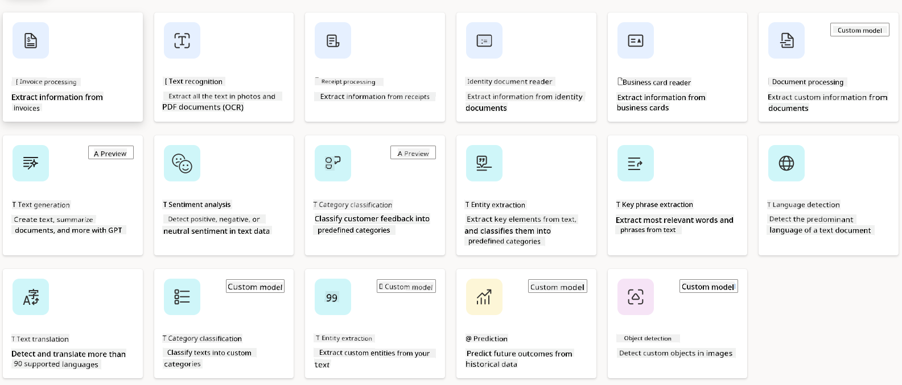

<!--
CO_OP_TRANSLATOR_METADATA:
{
  "original_hash": "f5ff3b6204a695a117d6f452403c95f7",
  "translation_date": "2025-07-09T13:37:40+00:00",
  "source_file": "10-building-low-code-ai-applications/README.md",
  "language_code": "en"
}
-->
# Building Low Code AI Applications

> _(Click the image above to watch the video for this lesson)_

## Introduction

Now that we’ve learned how to build image-generating applications, let’s talk about low code. Generative AI can be applied in many areas, including low code, but what exactly is low code and how can we integrate AI into it?

Building apps and solutions has become easier for both traditional developers and non-developers thanks to Low Code Development Platforms. These platforms let you create apps and solutions with little to no coding by providing a visual development environment where you can drag and drop components. This allows you to build apps and solutions faster and with fewer resources. In this lesson, we’ll explore how to use Low Code and how to enhance low code development with AI using Power Platform.

Power Platform gives organizations the chance to empower their teams to build their own solutions through an intuitive low-code or no-code environment. This environment simplifies the process of building solutions. With Power Platform, solutions can be created in days or weeks instead of months or years. Power Platform includes five key products: Power Apps, Power Automate, Power BI, Power Pages, and Copilot Studio.

This lesson covers:

- Introduction to Generative AI in Power Platform  
- Introduction to Copilot and how to use it  
- Using Generative AI to build apps and flows in Power Platform  
- Understanding the AI Models in Power Platform with AI Builder  

## Learning Goals

By the end of this lesson, you will be able to:

- Understand how Copilot works in Power Platform.  
- Build a Student Assignment Tracker App for our education startup.  
- Build an Invoice Processing Flow that uses AI to extract information from invoices.  
- Apply best practices when using the Create Text with GPT AI Model.  

The tools and technologies you will use in this lesson are:

- **Power Apps**, for the Student Assignment Tracker app, which provides a low-code development environment for building apps to track, manage, and interact with data.  
- **Dataverse**, for storing the data for the Student Assignment Tracker app, providing a low-code data platform for storing the app’s data.  
- **Power Automate**, for the Invoice Processing flow, offering a low-code environment to build workflows that automate the invoice processing.  
- **AI Builder**, for the Invoice Processing AI Model, where you’ll use prebuilt AI Models to process invoices for our startup.  

## Generative AI in Power Platform

Enhancing low-code development and applications with generative AI is a key focus for Power Platform. The goal is to enable everyone to build AI-powered apps, sites, dashboards, and automate processes with AI, _without needing any data science expertise_. This is achieved by integrating generative AI into the low-code development experience in Power Platform through Copilot and AI Builder.

### How does this work?

Copilot is an AI assistant that helps you build Power Platform solutions by describing your requirements through a series of conversational steps using natural language. For example, you can tell your AI assistant which fields your app will use, and it will create both the app and the underlying data model. Or you can specify how to set up a flow in Power Automate.

You can also use Copilot-driven features within your app screens to help users discover insights through conversational interactions.

AI Builder is a low-code AI capability in Power Platform that lets you use AI Models to automate processes and predict outcomes. With AI Builder, you can add AI to your apps and flows that connect to your data in Dataverse or various cloud data sources like SharePoint, OneDrive, or Azure.

Copilot is available across all Power Platform products: Power Apps, Power Automate, Power BI, Power Pages, and Power Virtual Agents. AI Builder is available in Power Apps and Power Automate. In this lesson, we’ll focus on using Copilot and AI Builder in Power Apps and Power Automate to build a solution for our education startup.

### Copilot in Power Apps

Power Apps, part of Power Platform, provides a low-code environment for building apps to track, manage, and interact with data. It’s a suite of app development services with a scalable data platform and the ability to connect to cloud services and on-premises data. Power Apps lets you build apps that run on browsers, tablets, and phones, and can be shared with colleagues. It simplifies app development with an easy interface so that any business user or professional developer can create custom apps. The app development experience is further enhanced with Generative AI through Copilot.

The Copilot AI assistant in Power Apps lets you describe the kind of app you need and what information you want it to track, collect, or display. Copilot then generates a responsive Canvas app based on your description. You can customize the app to fit your needs. The AI Copilot also creates and suggests a Dataverse Table with the fields needed to store your data and some sample data. We’ll cover what Dataverse is and how to use it in Power Apps later in this lesson. You can customize the table using the AI Copilot assistant through conversational steps. This feature is available right from the Power Apps home screen.

### Copilot in Power Automate

Power Automate, part of Power Platform, lets users create automated workflows between applications and services. It helps automate repetitive business tasks like communication, data collection, and approval processes. Its simple interface allows users of all skill levels—from beginners to experienced developers—to automate work tasks. The workflow development experience is also enhanced with Generative AI through Copilot.

The Copilot AI assistant in Power Automate lets you describe the kind of flow you need and the actions you want it to perform. Copilot then generates a flow based on your description. You can customize the flow to suit your needs. The AI Copilot also suggests the actions required to automate your task. We’ll cover what flows are and how to use them in Power Automate later in this lesson. You can customize the actions using the AI Copilot assistant through conversational steps. This feature is available from the Power Automate home screen.

## Assignment: Manage student assignments and invoices for our startup, using Copilot

Our startup offers online courses to students. It has grown quickly and is now struggling to keep up with the demand. The startup has hired you as a Power Platform developer to build a low code solution to help manage student assignments and invoices. The solution should help track and manage student assignments through an app and automate invoice processing through a workflow. You’ve been asked to use Generative AI to develop this solution.

When starting with Copilot, you can use the [Power Platform Copilot Prompt Library](https://github.com/pnp/powerplatform-prompts?WT.mc_id=academic-109639-somelezediko) to get ideas for prompts. This library contains prompts you can use to build apps and flows with Copilot. It’s also a good resource to learn how to describe your requirements to Copilot.

### Build a Student Assignment Tracker App for Our Startup

The educators at our startup have had trouble keeping track of student assignments. They’ve been using a spreadsheet, but it’s become hard to manage as the number of students has grown. They’ve asked you to build an app to help track and manage student assignments. The app should allow them to add new assignments, view assignments, update assignments, and delete assignments. It should also let educators and students see which assignments have been graded and which haven’t.

You will build the app using Copilot in Power Apps by following these steps:

1. Go to the [Power Apps](https://make.powerapps.com?WT.mc_id=academic-105485-koreyst) home screen.

2. Use the text box on the home screen to describe the app you want to build. For example, **_I want to build an app to track and manage student assignments_**. Click the **Send** button to send the prompt to AI Copilot.

3. AI Copilot will suggest a Dataverse Table with the fields needed to store your data and some sample data. You can customize the table to fit your needs using the AI Copilot assistant through conversational steps.

   > **Important**: Dataverse is the underlying data platform for Power Platform. It’s a low-code data platform for storing app data. It’s a fully managed service that securely stores data in the Microsoft Cloud and is provisioned within your Power Platform environment. It includes built-in data governance features like data classification, data lineage, fine-grained access control, and more. Learn more about Dataverse [here](https://docs.microsoft.com/powerapps/maker/data-platform/data-platform-intro?WT.mc_id=academic-109639-somelezediko).

   

4. Educators want to email students who have submitted assignments to keep them updated on progress. You can use Copilot to add a new field to the table to store student emails. For example, use the prompt: **_I want to add a column to store student email_**. Click **Send** to send the prompt to AI Copilot.

5. AI Copilot will create the new field, which you can then customize as needed.

6. When you’re done with the table, click **Create app** to generate the app.

7. AI Copilot will create a responsive Canvas app based on your description. You can customize the app to fit your needs.

8. To allow educators to send emails to students, use Copilot to add a new screen to the app. For example, use the prompt: **_I want to add a screen to send emails to students_**. Click **Send** to send the prompt to AI Copilot.

9. AI Copilot will generate the new screen, which you can customize as needed.

10. When you’re finished with the app, click **Save** to save it.

11. To share the app with educators, click **Share**, then click **Share** again. Enter their email addresses to share the app.

> **Your homework**: The app you built is a great start but can be improved. Currently, educators can only send emails to students manually by typing their email addresses. Can you use Copilot to build an automation that automatically sends emails to students when they submit assignments? Hint: with the right prompt, you can use Copilot in Power Automate to build this.

### Build an Invoices Information Table for Our Startup

The finance team at our startup has had trouble keeping track of invoices. They’ve been using a spreadsheet, but it’s become difficult to manage as the number of invoices has grown. They’ve asked you to build a table to store, track, and manage invoice information. This table will be used to build an automation that extracts all invoice information and stores it in the table. The table should also let the finance team see which invoices have been paid and which haven’t.

Power Platform includes an underlying data platform called Dataverse that lets you store data for your apps and solutions. Dataverse provides a low-code data platform for storing app data. It’s a fully managed service that securely stores data in the Microsoft Cloud and is provisioned within your Power Platform environment. It includes built-in data governance features like data classification, data lineage, fine-grained access control, and more. Learn more about Dataverse [here](https://docs.microsoft.com/powerapps/maker/data-platform/data-platform-intro?WT.mc_id=academic-109639-somelezediko).

Why use Dataverse for our startup? The standard and custom tables in Dataverse provide a secure, cloud-based storage option for your data. Tables let you store different types of data, similar to using multiple worksheets in a single Excel workbook. You can use tables to store data specific to your organization or business needs. Some benefits our startup will get from using Dataverse include but are not limited to:
- **Easy to manage**: Both metadata and data are stored in the cloud, so you don’t have to worry about how they are stored or managed. You can focus on building your apps and solutions.

- **Secure**: Dataverse offers a secure, cloud-based storage option for your data. You can control who has access to your table data and how they access it using role-based security.

- **Rich metadata**: Data types and relationships are directly used within Power Apps.

- **Logic and validation**: You can apply business rules, calculated fields, and validation rules to enforce business logic and ensure data accuracy.

Now that you understand what Dataverse is and why you should use it, let’s see how you can use Copilot to create a table in Dataverse that meets the needs of our finance team.

> **Note**: You will use this table in the next section to build an automation that extracts all invoice information and stores it in the table.

To create a table in Dataverse using Copilot, follow these steps:

1. Go to the [Power Apps](https://make.powerapps.com?WT.mc_id=academic-105485-koreyst) home screen.

2. In the left navigation bar, select **Tables**, then click **Describe the new Table**.

3. On the **Describe the new Table** screen, use the text box to describe the table you want to create. For example, **_I want to create a table to store invoice information_**. Click **Send** to submit the prompt to AI Copilot.

4. AI Copilot will suggest a Dataverse table with the fields needed to store the data you want to track, along with some sample data. You can customize the table further using the AI Copilot assistant through conversational steps.

5. The finance team wants to email suppliers to update them on the current status of their invoices. You can use Copilot to add a new field to the table to store the supplier’s email. For example, use the prompt: **_I want to add a column to store supplier email_**. Click **Send** to submit the prompt to AI Copilot.

6. AI Copilot will generate the new field, which you can then customize as needed.

7. When you’re finished setting up the table, click **Create** to create it.

## AI Models in Power Platform with AI Builder

AI Builder is a low-code AI capability in Power Platform that lets you use AI Models to automate processes and predict outcomes. With AI Builder, you can bring AI into your apps and flows that connect to your data in Dataverse or various cloud data sources like SharePoint, OneDrive, or Azure.

## Prebuilt AI Models vs Custom AI Models

AI Builder offers two types of AI Models: Prebuilt AI Models and Custom AI Models. Prebuilt AI Models are ready-to-use models trained by Microsoft and available in Power Platform. They help you add intelligence to your apps and flows without needing to collect data or build, train, and publish your own models. You can use these models to automate processes and predict outcomes.

Some Prebuilt AI Models available in Power Platform include:

- **Key Phrase Extraction**: Extracts key phrases from text.
- **Language Detection**: Detects the language of a text.
- **Sentiment Analysis**: Identifies positive, negative, neutral, or mixed sentiment in text.
- **Business Card Reader**: Extracts information from business cards.
- **Text Recognition**: Extracts text from images.
- **Object Detection**: Detects and extracts objects from images.
- **Document Processing**: Extracts information from forms.
- **Invoice Processing**: Extracts information from invoices.

With Custom AI Models, you can bring your own model into AI Builder so it functions like any AI Builder custom model, allowing you to train it with your own data. These models can automate processes and predict outcomes in both Power Apps and Power Automate. There are some limitations when using your own model. Learn more about these [limitations](https://learn.microsoft.com/ai-builder/byo-model#limitations?WT.mc_id=academic-105485-koreyst).

## Assignment #2 - Build an Invoice Processing Flow for Our Startup

The finance team has been struggling to process invoices. They’ve been using a spreadsheet to track invoices, but it’s become hard to manage as the number of invoices has grown. They’ve asked you to build a workflow that helps them process invoices using AI. The workflow should extract information from invoices and store it in a Dataverse table. It should also send an email to the finance team with the extracted information.

Now that you know what AI Builder is and why you should use it, let’s see how to use the Invoice Processing AI Model in AI Builder, which we covered earlier, to build a workflow that helps the finance team process invoices.

To build a workflow that helps the finance team process invoices using the Invoice Processing AI Model in AI Builder, follow these steps:

1. Go to the [Power Automate](https://make.powerautomate.com?WT.mc_id=academic-105485-koreyst) home screen.

2. Use the text box on the home screen to describe the workflow you want to build. For example, **_Process an invoice when it arrives in my mailbox_**. Click **Send** to submit the prompt to AI Copilot.

   

3. AI Copilot will suggest the actions needed to automate your task. Click **Next** to proceed through the steps.

4. On the next screen, Power Automate will ask you to set up the connections required for the flow. When finished, click **Create flow** to create it.

5. AI Copilot will generate a flow, which you can customize to fit your needs.

6. Update the flow’s trigger and set the **Folder** to where invoices will be stored. For example, set it to **Inbox**. Click **Show advanced options** and set **Only with Attachments** to **Yes**. This ensures the flow only runs when an email with an attachment arrives in the folder.

7. Remove these actions from the flow: **HTML to text**, **Compose**, **Compose 2**, **Compose 3**, and **Compose 4**, since you won’t be using them.

8. Remove the **Condition** action from the flow as well. The flow should look like this:

   

9. Click **Add an action**, search for **Dataverse**, and select **Add a new row**.

10. In the **Extract Information from invoices** action, update the **Invoice File** to point to the **Attachment Content** from the email. This ensures the flow extracts information from the invoice attachment.

11. Select the **Table** you created earlier, for example, the **Invoice Information** table. Use dynamic content from the previous action to fill these fields:

    - ID  
    - Amount  
    - Date  
    - Name  
    - Status – Set **Status** to **Pending**.  
    - Supplier Email – Use the **From** dynamic content from the **When a new email arrives** trigger.

    

12. When you’re done, click **Save** to save the flow. You can test it by sending an email with an invoice to the folder you specified in the trigger.

> **Your homework**: The flow you just built is a great start. Now think about how you can build an automation that lets the finance team email suppliers to update them on the current status of their invoices. Hint: the flow should run when the invoice status changes.

## Use a Text Generation AI Model in Power Automate

The Create Text with GPT AI Model in AI Builder lets you generate text based on a prompt and is powered by Microsoft Azure OpenAI Service. This capability allows you to integrate GPT (Generative Pre-Trained Transformer) technology into your apps and flows to build various automated workflows and insightful applications.

GPT models are trained on vast amounts of data, enabling them to produce text that closely resembles human language when given a prompt. When combined with workflow automation, AI models like GPT can streamline and automate many tasks.

For example, you can build flows that automatically generate text for use cases such as email drafts, product descriptions, and more. You can also use the model to generate text for apps like chatbots and customer service tools that help agents respond effectively and efficiently to customer inquiries.

To learn how to use this AI Model in Power Automate, check out the [Add intelligence with AI Builder and GPT](https://learn.microsoft.com/training/modules/ai-builder-text-generation/?WT.mc_id=academic-109639-somelezediko) module.

## Great Work! Continue Your Learning

After finishing this lesson, explore our [Generative AI Learning collection](https://aka.ms/genai-collection?WT.mc_id=academic-105485-koreyst) to keep advancing your Generative AI skills!

Next, head to Lesson 11 where we’ll explore how to [integrate Generative AI with Function Calling](../11-integrating-with-function-calling/README.md?WT.mc_id=academic-105485-koreyst)!

**Disclaimer**:  
This document has been translated using the AI translation service [Co-op Translator](https://github.com/Azure/co-op-translator). While we strive for accuracy, please be aware that automated translations may contain errors or inaccuracies. The original document in its native language should be considered the authoritative source. For critical information, professional human translation is recommended. We are not liable for any misunderstandings or misinterpretations arising from the use of this translation.