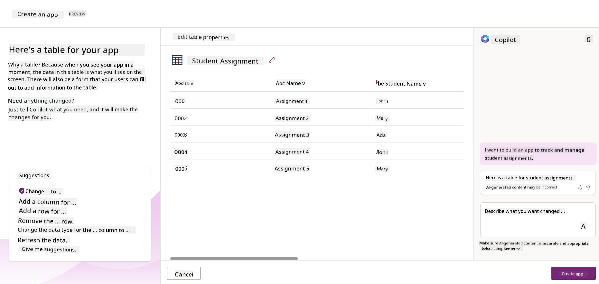
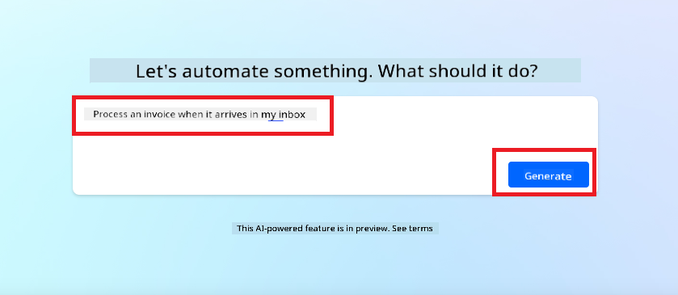
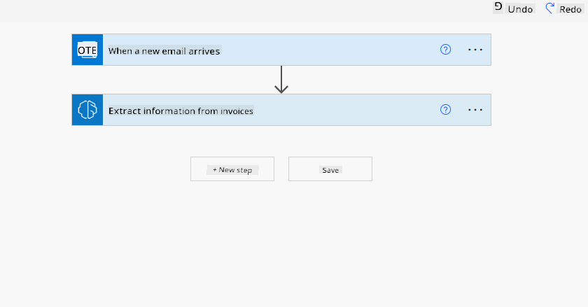
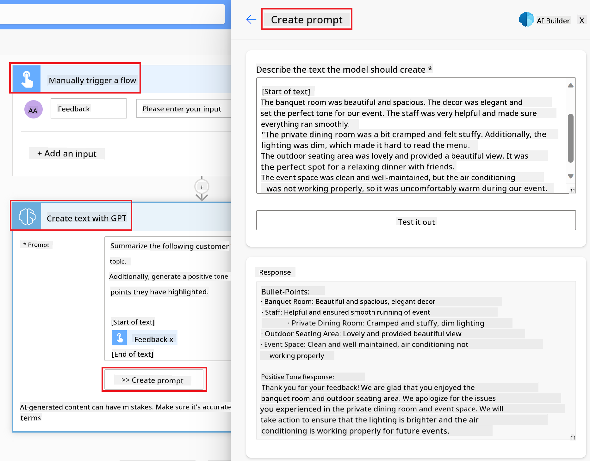

<!--
CO_OP_TRANSLATOR_METADATA:
{
  "original_hash": "846ac8e3b7dcfb697d3309fec05f0fea",
  "translation_date": "2025-10-17T22:32:18+00:00",
  "source_file": "10-building-low-code-ai-applications/README.md",
  "language_code": "en"
}
-->
# Building Low Code AI Applications

> _(Click the image above to view the video of this lesson)_

## Introduction

Now that we’ve learned how to create image-generating applications, let’s explore the concept of low code. Generative AI can be applied in various domains, including low code development, but what exactly is low code, and how can AI enhance it?

Low Code Development Platforms have made it easier for both traditional developers and non-developers to create apps and solutions. These platforms allow you to build applications with minimal or no coding by providing a visual development environment where you can drag and drop components. This approach enables faster development and requires fewer resources. In this lesson, we’ll delve into the use of low code and how AI can enhance low code development using Power Platform.

The Power Platform empowers organizations to enable their teams to create their own solutions through an intuitive low-code or no-code environment. This simplifies the process of building solutions, allowing them to be developed in days or weeks instead of months or years. The Power Platform consists of five key products: Power Apps, Power Automate, Power BI, Power Pages, and Copilot Studio.

This lesson covers:

- Introduction to Generative AI in Power Platform
- Introduction to Copilot and how to use it
- Using Generative AI to build apps and workflows in Power Platform
- Understanding the AI Models in Power Platform with AI Builder

## Learning Goals

By the end of this lesson, you will be able to:

- Understand how Copilot works in Power Platform.

- Build a Student Assignment Tracker App for our education startup.

- Create an Invoice Processing Flow that uses AI to extract information from invoices.

- Apply best practices when using the Create Text with GPT AI Model.

The tools and technologies you will use in this lesson are:

- **Power Apps**, for the Student Assignment Tracker app, which provides a low-code development environment for building apps to track, manage, and interact with data.

- **Dataverse**, for storing the data for the Student Assignment Tracker app, offering a low-code data platform for managing the app’s data.

- **Power Automate**, for the Invoice Processing flow, providing a low-code development environment for creating workflows to automate the invoice processing.

- **AI Builder**, for the Invoice Processing AI Model, which uses prebuilt AI Models to process invoices for our startup.

## Generative AI in Power Platform

Integrating generative AI into low-code development and applications is a key focus of the Power Platform. The aim is to empower everyone to create AI-driven apps, websites, dashboards, and automated processes without requiring expertise in data science. This is achieved by embedding generative AI into the low-code development experience in Power Platform through tools like Copilot and AI Builder.

### How does this work?

Copilot is an AI assistant that helps you build Power Platform solutions by describing your requirements in a conversational manner using natural language. For instance, you can instruct the AI assistant to specify the fields your app will use, and it will create both the app and the underlying data model. Similarly, you can describe how to set up a workflow in Power Automate.

Copilot-driven functionalities can also be integrated into your app screens, enabling users to gain insights through conversational interactions.

AI Builder is a low-code AI feature in Power Platform that allows you to use AI Models to automate processes and predict outcomes. With AI Builder, you can incorporate AI into your apps and workflows that connect to your data in Dataverse or other cloud data sources like SharePoint, OneDrive, or Azure.

Copilot is available across all Power Platform products: Power Apps, Power Automate, Power BI, Power Pages, and Power Virtual Agents. AI Builder is available in Power Apps and Power Automate. In this lesson, we’ll focus on using Copilot and AI Builder in Power Apps and Power Automate to develop a solution for our education startup.

### Copilot in Power Apps

Power Apps, part of the Power Platform, provides a low-code development environment for creating apps to manage, track, and interact with data. It offers a suite of app development services, a scalable data platform, and the ability to connect to cloud services and on-premises data. Power Apps enables the creation of apps that work on browsers, tablets, and phones, which can be shared with colleagues. Its user-friendly interface makes app development accessible to both business users and professional developers. Generative AI further enhances the app development experience through Copilot.

The Copilot AI assistant feature in Power Apps allows you to describe the type of app you need and the information you want it to track, collect, or display. Based on your description, Copilot generates a responsive Canvas app. You can then customize the app to suit your needs. Additionally, Copilot suggests a Dataverse Table with the necessary fields to store your data, along with sample data. Later in this lesson, we’ll explore Dataverse and how to use it in Power Apps. You can also customize the table using the AI Copilot assistant feature through conversational steps. This feature is accessible directly from the Power Apps home screen.

### Copilot in Power Automate

Power Automate, another component of the Power Platform, enables users to create automated workflows between applications and services. It helps automate repetitive business processes such as communication, data collection, and decision approvals. Its simple interface makes it accessible to users of all technical skill levels, from beginners to experienced developers. Generative AI enhances the workflow development experience through Copilot.

The Copilot AI assistant feature in Power Automate allows you to describe the type of workflow you need and the actions you want it to perform. Based on your description, Copilot generates a workflow that you can customize to meet your requirements. Copilot also suggests actions to perform the tasks you want to automate. Later in this lesson, we’ll explore workflows and how to use them in Power Automate. You can customize these actions using the AI Copilot assistant feature through conversational steps. This feature is accessible directly from the Power Automate home screen.

## Assignment: Manage student assignments and invoices for our startup, using Copilot

Our startup offers online courses to students. Due to rapid growth, the startup is struggling to keep up with the demand for its courses. You’ve been hired as a Power Platform developer to create a low-code solution to help manage student assignments and invoices. The solution should allow tracking and managing student assignments through an app and automate the invoice processing through a workflow. You are tasked with using Generative AI to develop this solution.

To get started with Copilot, you can use the [Power Platform Copilot Prompt Library](https://github.com/pnp/powerplatform-prompts?WT.mc_id=academic-109639-somelezediko), which contains a collection of prompts to help you build apps and workflows with Copilot. These prompts can also guide you in describing your requirements to Copilot.

### Build a Student Assignment Tracker App for Our Startup

The educators at our startup are finding it challenging to keep track of student assignments. They’ve been using a spreadsheet, but as the number of students has grown, managing assignments has become increasingly difficult. They’ve requested an app to help them track and manage student assignments. The app should allow them to add, view, update, and delete assignments. It should also enable educators and students to see which assignments have been graded and which have not.

You’ll create the app using Copilot in Power Apps by following these steps:

1. Go to the [Power Apps](https://make.powerapps.com?WT.mc_id=academic-105485-koreyst) home screen.

1. Use the text area on the home screen to describe the app you want to build. For example, **_I want to build an app to track and manage student assignments_**. Click the **Send** button to submit the prompt to the AI Copilot.

1. The AI Copilot will suggest a Dataverse Table with the fields needed to store the data you want to track, along with sample data. You can customize the table using the AI Copilot assistant feature through conversational steps.

   > **Important**: Dataverse is the underlying data platform for Power Platform. It is a low-code data platform for storing app data. It is a fully managed service that securely stores data in the Microsoft Cloud and is provisioned within your Power Platform environment. It includes built-in data governance features such as data classification, data lineage, fine-grained access control, and more. Learn more about Dataverse [here](https://docs.microsoft.com/powerapps/maker/data-platform/data-platform-intro?WT.mc_id=academic-109639-somelezediko).

   

1. Educators want to send emails to students who have submitted their assignments to keep them updated on their progress. You can use Copilot to add a new field to the table to store student email addresses. For example, use the following prompt: **_I want to add a column to store student email_**. Click the **Send** button to submit the prompt to the AI Copilot.

1. The AI Copilot will generate a new field, which you can customize to meet your needs.

1. Once the table is complete, click the **Create app** button to generate the app.

1. The AI Copilot will create a responsive Canvas app based on your description. You can customize the app as needed.

1. To enable educators to send emails to students, use Copilot to add a new screen to the app. For example, use the following prompt: **_I want to add a screen to send emails to students_**. Click the **Send** button to submit the prompt to the AI Copilot.

1. The AI Copilot will generate a new screen, which you can customize to meet your needs.

1. Once the app is complete, click the **Save** button to save your work.

1. To share the app with educators, click the **Share** button, then click **Share** again. Enter the educators’ email addresses to share the app.

> **Your homework**: The app you’ve built is a great start but can be improved. Currently, educators can only send emails to students manually by typing their email addresses. Can you use Copilot to create an automation that allows educators to send emails to students automatically when they submit their assignments? Hint: With the right prompt, you can use Copilot in Power Automate to build this.

### Build an Invoices Information Table for Our Startup

The finance team at our startup is struggling to keep track of invoices. They’ve been using a spreadsheet, but as the number of invoices has grown, managing them has become increasingly difficult. They’ve requested a table to store, track, and manage invoice information. This table should support automation to extract invoice details and store them in the table. It should also allow the finance team to view which invoices have been paid and which have not.

The Power Platform includes an underlying data platform called Dataverse, which enables you to store data for your apps and solutions. Dataverse provides a low-code data platform for managing app data. It is a fully managed service that securely stores data in the Microsoft Cloud and is provisioned within your Power Platform environment. It includes built-in data governance features such as data classification, data lineage, fine-grained access control, and more. Learn more [about Dataverse here](https://docs.microsoft.com/powerapps/maker/data-platform/data-platform-intro?WT.mc_id=academic-109639-somelezediko).
Why should we use Dataverse for our startup? The standard and custom tables within Dataverse provide a secure and cloud-based storage option for your data. Tables allow you to store different types of data, similar to using multiple worksheets in a single Excel workbook. You can use tables to store data specific to your organization or business needs. Some of the benefits our startup will gain from using Dataverse include but are not limited to:

- **Easy to manage**: Both metadata and data are stored in the cloud, so you don’t need to worry about the technical details of storage or management. You can focus on building your apps and solutions.

- **Secure**: Dataverse offers a secure and cloud-based storage option for your data. You can control who has access to the data in your tables and how they access it using role-based security.

- **Rich metadata**: Data types and relationships are directly integrated within Power Apps.

- **Logic and validation**: You can use business rules, calculated fields, and validation rules to enforce business logic and ensure data accuracy.

Now that you understand what Dataverse is and why you should use it, let’s explore how you can use Copilot to create a table in Dataverse to meet the requirements of our finance team.

> **Note**: You will use this table in the next section to build an automation that extracts all invoice information and stores it in the table.

To create a table in Dataverse using Copilot, follow these steps:

1. Navigate to the [Power Apps](https://make.powerapps.com?WT.mc_id=academic-105485-koreyst) home screen.

2. On the left navigation bar, select **Tables** and then click on **Describe the new Table**.

3. On the **Describe the new Table** screen, use the text area to describe the table you want to create. For example, **_I want to create a table to store invoice information_**. Click the **Send** button to send the prompt to the AI Copilot.

4. The AI Copilot will suggest a Dataverse table with the fields you need to store the data you want to track, along with some sample data. You can then customize the table to meet your needs using the AI Copilot assistant feature through conversational steps.

5. The finance team wants to send an email to the supplier to update them on the current status of their invoice. You can use Copilot to add a new field to the table to store the supplier’s email. For example, you can use the following prompt to add a new field to the table: **_I want to add a column to store supplier email_**. Click the **Send** button to send the prompt to the AI Copilot.

6. The AI Copilot will generate a new field, and you can then customize the field to meet your needs.

7. Once you are done with the table, click the **Create** button to create the table.

## AI Models in Power Platform with AI Builder

AI Builder is a low-code AI capability available in Power Platform that allows you to use AI models to automate processes and predict outcomes. With AI Builder, you can integrate AI into your apps and workflows that connect to your data in Dataverse or other cloud data sources, such as SharePoint, OneDrive, or Azure.

## Prebuilt AI Models vs Custom AI Models

AI Builder offers two types of AI models: Prebuilt AI Models and Custom AI Models. Prebuilt AI Models are ready-to-use AI models trained by Microsoft and available in Power Platform. These models allow you to add intelligence to your apps and workflows without needing to collect data, build, train, and publish your own models. You can use these models to automate processes and predict outcomes.

Some of the Prebuilt AI Models available in Power Platform include:

- **Key Phrase Extraction**: Extracts key phrases from text.
- **Language Detection**: Identifies the language of a text.
- **Sentiment Analysis**: Determines whether the sentiment in a text is positive, negative, neutral, or mixed.
- **Business Card Reader**: Extracts information from business cards.
- **Text Recognition**: Extracts text from images.
- **Object Detection**: Identifies and extracts objects from images.
- **Document Processing**: Extracts information from forms.
- **Invoice Processing**: Extracts information from invoices.

With Custom AI Models, you can bring your own model into AI Builder so it functions like any AI Builder custom model. This allows you to train the model using your own data. You can use these models to automate processes and predict outcomes in both Power Apps and Power Automate. Note that there are limitations when using your own model. Read more about these [limitations](https://learn.microsoft.com/ai-builder/byo-model#limitations?WT.mc_id=academic-105485-koreyst).

## Assignment #2 - Build an Invoice Processing Flow for Our Startup

The finance team has been struggling to process invoices. They have been using a spreadsheet to track invoices, but this has become difficult to manage as the number of invoices has grown. They have asked you to create a workflow that will help them process invoices using AI. The workflow should allow them to extract information from invoices and store it in a Dataverse table. It should also enable them to send an email to the finance team with the extracted information.

Now that you understand what AI Builder is and why you should use it, let’s explore how to use the Invoice Processing AI Model in AI Builder, which we discussed earlier, to create a workflow that will help the finance team process invoices.

To build a workflow that helps the finance team process invoices using the Invoice Processing AI Model in AI Builder, follow these steps:

1. Navigate to the [Power Automate](https://make.powerautomate.com?WT.mc_id=academic-105485-koreyst) home screen.

2. Use the text area on the home screen to describe the workflow you want to build. For example, **_Process an invoice when it arrives in my mailbox_**. Click the **Send** button to send the prompt to the AI Copilot.

   

3. The AI Copilot will suggest the actions needed to perform the task you want to automate. Click the **Next** button to proceed to the next steps.

4. In the next step, Power Automate will prompt you to set up the connections required for the flow. Once completed, click the **Create flow** button to create the flow.

5. The AI Copilot will generate a flow, which you can then customize to meet your needs.

6. Update the trigger of the flow and set the **Folder** to the folder where the invoices will be stored. For example, you can set the folder to **Inbox**. Click **Show advanced options** and set **Only with Attachments** to **Yes**. This ensures the flow only runs when an email with an attachment is received in the folder.

7. Remove the following actions from the flow: **HTML to text**, **Compose**, **Compose 2**, **Compose 3**, and **Compose 4**, as they won’t be used.

8. Remove the **Condition** action from the flow, as it won’t be used. The flow should look like the following screenshot:

   

9. Click the **Add an action** button and search for **Dataverse**. Select the **Add a new row** action.

10. In the **Extract Information from invoices** action, update the **Invoice File** to point to the **Attachment Content** from the email. This ensures the flow extracts information from the invoice attachment.

11. Select the **Table** you created earlier. For example, select the **Invoice Information** table. Use the dynamic content from the previous action to populate the following fields:

    - ID
    - Amount
    - Date
    - Name
    - Status - Set the **Status** to **Pending**.
    - Supplier Email - Use the **From** dynamic content from the **When a new email arrives** trigger.

    

12. Once you are done with the flow, click the **Save** button to save the flow. You can then test the flow by sending an email with an invoice to the folder you specified in the trigger.

> **Your homework**: The flow you just built is a good start. Now, think about how you can create an automation that will allow our finance team to send an email to the supplier to update them on the current status of their invoice. Hint: The flow must run when the status of the invoice changes.

## Use a Text Generation AI Model in Power Automate

The Create Text with GPT AI Model in AI Builder allows you to generate text based on a prompt and is powered by the Microsoft Azure OpenAI Service. With this feature, you can integrate GPT (Generative Pre-Trained Transformer) technology into your apps and workflows to create various automated flows and insightful applications.

GPT models are trained on vast amounts of data, enabling them to produce text that closely resembles human language when given a prompt. When combined with workflow automation, AI models like GPT can be used to streamline and automate a wide range of tasks.

For example, you can create flows to automatically generate text for various use cases, such as email drafts, product descriptions, and more. You can also use the model to generate text for applications like chatbots and customer service apps, helping customer service agents respond effectively and efficiently to customer inquiries.

To learn how to use this AI Model in Power Automate, explore the [Add intelligence with AI Builder and GPT](https://learn.microsoft.com/training/modules/ai-builder-text-generation/?WT.mc_id=academic-109639-somelezediko) module.

## Great Work! Continue Your Learning

After completing this lesson, check out our [Generative AI Learning collection](https://aka.ms/genai-collection?WT.mc_id=academic-105485-koreyst) to continue enhancing your Generative AI knowledge!

Head over to Lesson 11, where we will explore how to [integrate Generative AI with Function Calling](../11-integrating-with-function-calling/README.md?WT.mc_id=academic-105485-koreyst)!

---

**Disclaimer**:  
This document has been translated using the AI translation service [Co-op Translator](https://github.com/Azure/co-op-translator). While we aim for accuracy, please note that automated translations may include errors or inaccuracies. The original document in its native language should be regarded as the authoritative source. For critical information, professional human translation is advised. We are not responsible for any misunderstandings or misinterpretations resulting from the use of this translation.