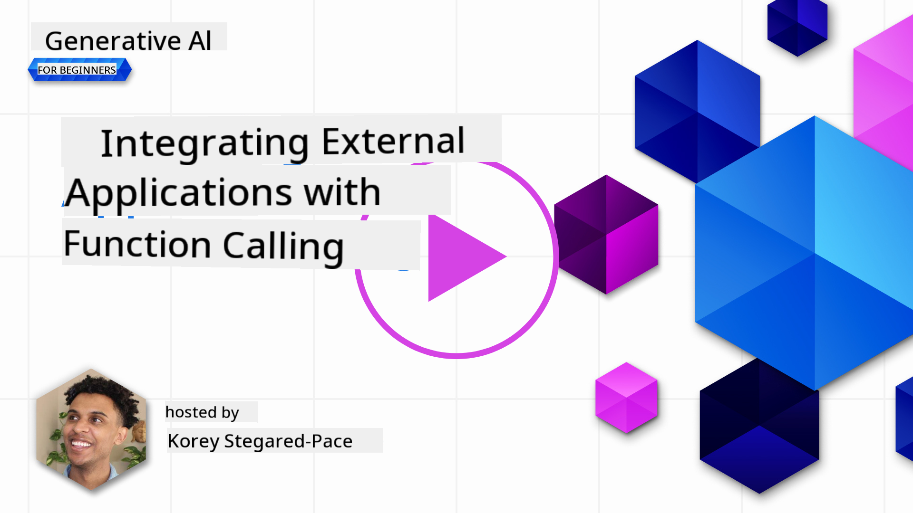
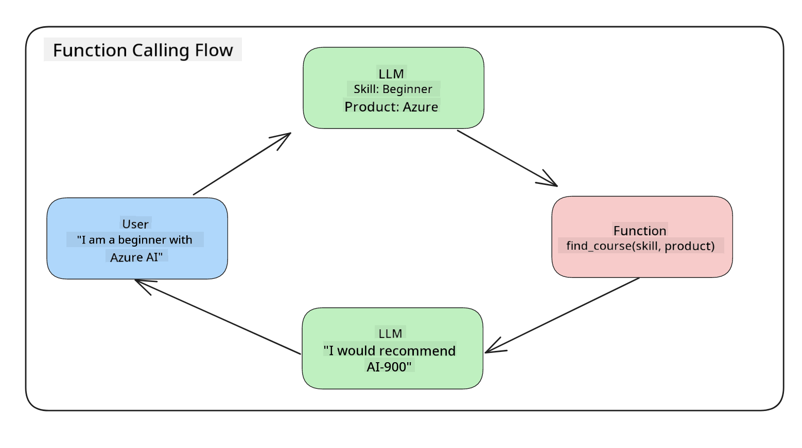
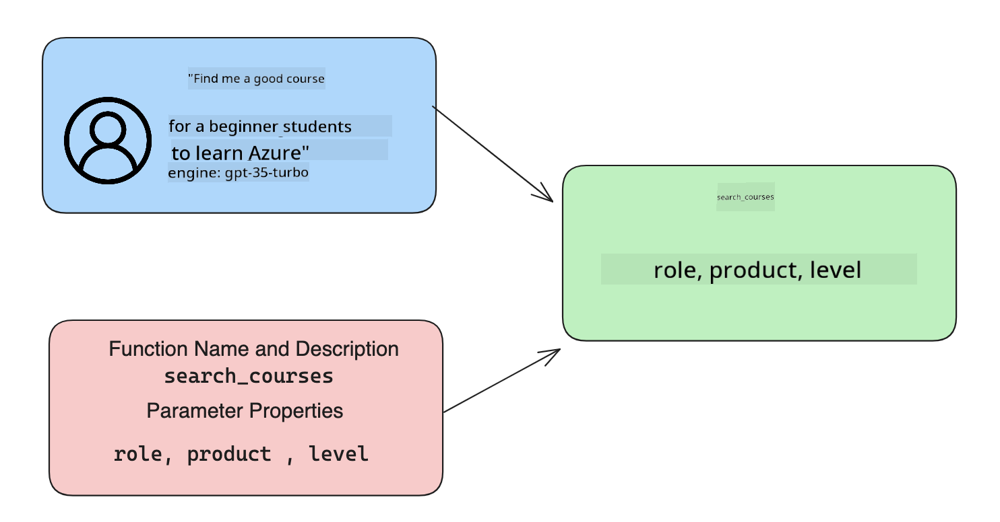

<!--
CO_OP_TRANSLATOR_METADATA:
{
  "original_hash": "77a48a201447be19aa7560706d6f93a0",
  "translation_date": "2025-07-09T14:21:05+00:00",
  "source_file": "11-integrating-with-function-calling/README.md",
  "language_code": "en"
}
-->
# Integrating with function calling

[](https://aka.ms/gen-ai-lesson11-gh?WT.mc_id=academic-105485-koreyst)

You've learned quite a bit in the previous lessons. However, there’s still room for improvement. Some areas we can focus on include how to get a more consistent response format to make it easier to work with the response downstream. Also, we might want to add data from other sources to further enrich our application.

These are the challenges this chapter aims to address.

## Introduction

This lesson will cover:

- What function calling is and its use cases.
- How to create a function call using Azure OpenAI.
- How to integrate a function call into an application.

## Learning Goals

By the end of this lesson, you will be able to:

- Explain why function calling is useful.
- Set up Function Calling using the Azure OpenAI Service.
- Design effective function calls tailored to your application's needs.

## Scenario: Improving our chatbot with functions

For this lesson, we want to build a feature for our education startup that lets users use a chatbot to find technical courses. We will recommend courses that match their skill level, current role, and technology interests.

To complete this scenario, we will use a combination of:

- `Azure OpenAI` to create a chat experience for the user.
- `Microsoft Learn Catalog API` to help users find courses based on their requests.
- `Function Calling` to take the user's query and send it to a function that makes the API request.

To get started, let’s first understand why we would want to use function calling:

## Why Function Calling

Before function calling, responses from an LLM were unstructured and inconsistent. Developers had to write complex validation code to handle every variation of a response. Users couldn’t get answers to questions like "What is the current weather in Stockholm?" because models were limited to the data they were trained on.

Function Calling is a feature of the Azure OpenAI Service designed to overcome these limitations:

- **Consistent response format**. By controlling the response format, we can more easily integrate the response downstream into other systems.
- **External data**. It allows using data from other parts of an application within a chat context.

## Illustrating the problem through a scenario

> We recommend using the [included notebook](python/aoai-assignment.ipynb) if you want to run the scenario below. You can also just read along as we illustrate a problem that functions can help solve.

Let’s look at an example that highlights the response format problem:

Suppose we want to create a database of student data so we can suggest the right courses. Below are two student descriptions that are very similar in the data they contain.

1. Create a connection to our Azure OpenAI resource:

   ```python
   import os
   import json
   from openai import AzureOpenAI
   from dotenv import load_dotenv
   load_dotenv()

   client = AzureOpenAI(
   api_key=os.environ['AZURE_OPENAI_API_KEY'],  # this is also the default, it can be omitted
   api_version = "2023-07-01-preview"
   )

   deployment=os.environ['AZURE_OPENAI_DEPLOYMENT']
   ```

   Below is some Python code configuring our connection to Azure OpenAI where we set `api_type`, `api_base`, `api_version`, and `api_key`.

1. Create two student descriptions using variables `student_1_description` and `student_2_description`.

   ```python
   student_1_description="Emily Johnson is a sophomore majoring in computer science at Duke University. She has a 3.7 GPA. Emily is an active member of the university's Chess Club and Debate Team. She hopes to pursue a career in software engineering after graduating."

   student_2_description = "Michael Lee is a sophomore majoring in computer science at Stanford University. He has a 3.8 GPA. Michael is known for his programming skills and is an active member of the university's Robotics Club. He hopes to pursue a career in artificial intelligence after finishing his studies."
   ```

   We want to send these student descriptions to an LLM to parse the data. This data can later be used in our application, sent to an API, or stored in a database.

1. Let’s create two identical prompts instructing the LLM on what information we want:

   ```python
   prompt1 = f'''
   Please extract the following information from the given text and return it as a JSON object:

   name
   major
   school
   grades
   club

   This is the body of text to extract the information from:
   {student_1_description}
   '''

   prompt2 = f'''
   Please extract the following information from the given text and return it as a JSON object:

   name
   major
   school
   grades
   club

   This is the body of text to extract the information from:
   {student_2_description}
   '''
   ```

   These prompts tell the LLM to extract information and return the response in JSON format.

1. After setting up the prompts and the connection to Azure OpenAI, we send the prompts to the LLM using `openai.ChatCompletion`. We store the prompt in the `messages` variable and assign the role `user` to mimic a user message sent to a chatbot.

   ```python
   # response from prompt one
   openai_response1 = client.chat.completions.create(
   model=deployment,
   messages = [{'role': 'user', 'content': prompt1}]
   )
   openai_response1.choices[0].message.content

   # response from prompt two
   openai_response2 = client.chat.completions.create(
   model=deployment,
   messages = [{'role': 'user', 'content': prompt2}]
   )
   openai_response2.choices[0].message.content
   ```

Now we can send both requests to the LLM and check the responses by accessing `openai_response1['choices'][0]['message']['content']`.

1. Finally, we convert the response to JSON format by calling `json.loads`:

   ```python
   # Loading the response as a JSON object
   json_response1 = json.loads(openai_response1.choices[0].message.content)
   json_response1
   ```

   Response 1:

   ```json
   {
     "name": "Emily Johnson",
     "major": "computer science",
     "school": "Duke University",
     "grades": "3.7",
     "club": "Chess Club"
   }
   ```

   Response 2:

   ```json
   {
     "name": "Michael Lee",
     "major": "computer science",
     "school": "Stanford University",
     "grades": "3.8 GPA",
     "club": "Robotics Club"
   }
   ```

   Even though the prompts are the same and the descriptions are similar, the `Grades` property is formatted differently — sometimes as `3.7` and other times as `3.7 GPA`.

   This happens because the LLM takes unstructured data from the prompt and returns unstructured data. We need a structured format so we know what to expect when storing or using this data.

So how do we solve the formatting problem? By using function calling, we can ensure we receive structured data back. When using function calling, the LLM doesn’t actually call or run any functions. Instead, we create a structure for the LLM to follow in its responses. We then use those structured responses to decide which function to run in our applications.



We can then take the output from the function and send it back to the LLM. The LLM will respond in natural language to answer the user’s query.

## Use Cases for using function calls

Function calls can improve your app in many ways, such as:

- **Calling External Tools**. Chatbots are great at answering user questions. With function calling, chatbots can use user messages to perform tasks. For example, a student might ask the chatbot to "Send an email to my instructor saying I need more help with this subject." This could trigger a function call like `send_email(to: string, body: string)`.

- **Create API or Database Queries**. Users can ask questions in natural language that get converted into formatted queries or API requests. For example, a teacher might ask "Who are the students that completed the last assignment?" which could call a function like `get_completed(student_name: string, assignment: int, current_status: string)`.

- **Creating Structured Data**. Users can input a block of text or CSV and use the LLM to extract key information. For example, a student could convert a Wikipedia article about peace agreements into AI flashcards using a function like `get_important_facts(agreement_name: string, date_signed: string, parties_involved: list)`.

## Creating Your First Function Call

Creating a function call involves three main steps:

1. **Calling** the Chat Completions API with a list of your functions and a user message.
2. **Reading** the model’s response to decide what action to take, such as executing a function or API call.
3. **Making** another call to the Chat Completions API with the function’s response to generate a reply to the user.



### Step 1 - creating messages

The first step is to create a user message. This can be dynamically assigned by taking the value of a text input or you can assign a value here. If this is your first time working with the Chat Completions API, you need to define the `role` and the `content` of the message.

The `role` can be `system` (setting rules), `assistant` (the model), or `user` (the end-user). For function calling, we assign `user` and provide an example question.

```python
messages= [ {"role": "user", "content": "Find me a good course for a beginner student to learn Azure."} ]
```

Assigning different roles clarifies to the LLM whether the message is from the system or the user, helping it build a conversation history.

### Step 2 - creating functions

Next, we define a function and its parameters. Here, we use one function called `search_courses`, but you can create multiple functions.

> **Important** : Functions are included in the system message to the LLM and count against your available tokens.

Below, we create the functions as an array. Each item is a function with properties `name`, `description`, and `parameters`:

```python
functions = [
   {
      "name":"search_courses",
      "description":"Retrieves courses from the search index based on the parameters provided",
      "parameters":{
         "type":"object",
         "properties":{
            "role":{
               "type":"string",
               "description":"The role of the learner (i.e. developer, data scientist, student, etc.)"
            },
            "product":{
               "type":"string",
               "description":"The product that the lesson is covering (i.e. Azure, Power BI, etc.)"
            },
            "level":{
               "type":"string",
               "description":"The level of experience the learner has prior to taking the course (i.e. beginner, intermediate, advanced)"
            }
         },
         "required":[
            "role"
         ]
      }
   }
]
```

Here’s a detailed description of each function property:

- `name` - The function’s name to be called.
- `description` - A clear and specific explanation of what the function does.
- `parameters` - A list of values and their formats that you want the model to produce in its response. The parameters array contains items with these properties:
  1.  `type` - The data type of the properties.
  1.  `properties` - The specific values the model will use in its response:
      1. `name` - The key name the model will use in its formatted response, e.g., `product`.
      1. `type` - The data type of this property, e.g., `string`.
      1. `description` - A description of the property.

There’s also an optional `required` property that specifies which parameters must be included for the function call to be valid.

### Step 3 - Making the function call

After defining the function, we include it in the call to the Chat Completion API by adding `functions` to the request, e.g., `functions=functions`.

You can also set `function_call` to `auto`, which lets the LLM decide which function to call based on the user message instead of specifying it yourself.

Here’s some code calling `ChatCompletion.create`, showing how we set `functions=functions` and `function_call="auto"`, giving the LLM the choice of when to call the functions:

```python
response = client.chat.completions.create(model=deployment,
                                        messages=messages,
                                        functions=functions,
                                        function_call="auto")

print(response.choices[0].message)
```

The response now looks like this:

```json
{
  "role": "assistant",
  "function_call": {
    "name": "search_courses",
    "arguments": "{\n  \"role\": \"student\",\n  \"product\": \"Azure\",\n  \"level\": \"beginner\"\n}"
  }
}
```

Here, we see that the function `search_courses` was called and with what arguments, listed in the `arguments` property of the JSON response.

The LLM extracted the data to fit the function’s arguments from the value provided in the `messages` parameter of the chat completion call. Below is a reminder of the `messages` value:

```python
messages= [ {"role": "user", "content": "Find me a good course for a beginner student to learn Azure."} ]
```

As you can see, `student`, `Azure`, and `beginner` were extracted from `messages` and used as input to the function. Using functions this way is a great method to extract information from a prompt, provide structure to the LLM, and enable reusable functionality.

Next, let’s see how to use this in our app.

## Integrating Function Calls into an Application

After testing the formatted response from the LLM, we can integrate it into an application.

### Managing the flow

To integrate this into our application, follow these steps:

1. First, make the call to the OpenAI service and store the message in a variable called `response_message`.

   ```python
   response_message = response.choices[0].message
   ```

1. Now define the function that will call the Microsoft Learn API to get a list of courses:

   ```python
   import requests

   def search_courses(role, product, level):
     url = "https://learn.microsoft.com/api/catalog/"
     params = {
        "role": role,
        "product": product,
        "level": level
     }
     response = requests.get(url, params=params)
     modules = response.json()["modules"]
     results = []
     for module in modules[:5]:
        title = module["title"]
        url = module["url"]
        results.append({"title": title, "url": url})
     return str(results)
   ```

   Notice how we create an actual Python function that maps to the function names defined in the `functions` variable. We’re also making real external API calls to fetch the data we need. In this case, we query the Microsoft Learn API to search for training modules.

So, we created the `functions` variable and a corresponding Python function. How do we tell the LLM to map these together so our Python function is called?

1. To check if we need to call a Python function, look into the LLM response to see if `function_call` is present and call the specified function. Here’s how to perform this check:

   ```python
   # Check if the model wants to call a function
   if response_message.function_call.name:
    print("Recommended Function call:")
    print(response_message.function_call.name)
    print()

    # Call the function.
    function_name = response_message.function_call.name

    available_functions = {
            "search_courses": search_courses,
    }
    function_to_call = available_functions[function_name]

    function_args = json.loads(response_message.function_call.arguments)
    function_response = function_to_call(**function_args)

    print("Output of function call:")
    print(function_response)
    print(type(function_response))


    # Add the assistant response and function response to the messages
    messages.append( # adding assistant response to messages
        {
            "role": response_message.role,
            "function_call": {
                "name": function_name,
                "arguments": response_message.function_call.arguments,
            },
            "content": None
        }
    )
    messages.append( # adding function response to messages
        {
            "role": "function",
            "name": function_name,
            "content":function_response,
        }
    )
   ```

   These three lines extract the function name, the arguments, and make the call:

   ```python
   function_to_call = available_functions[function_name]

   function_args = json.loads(response_message.function_call.arguments)
   function_response = function_to_call(**function_args)
   ```

   Below is the output from running our code:

   **Output**

   ```Recommended Function call:
   {
     "name": "search_courses",
     "arguments": "{\n  \"role\": \"student\",\n  \"product\": \"Azure\",\n  \"level\": \"beginner\"\n}"
   }

   Output of function call:
   [{'title': 'Describe concepts of cryptography', 'url': 'https://learn.microsoft.com/training/modules/describe-concepts-of-cryptography/?
   WT.mc_id=api_CatalogApi'}, {'title': 'Introduction to audio classification with TensorFlow', 'url': 'https://learn.microsoft.com/en-
   us/training/modules/intro-audio-classification-tensorflow/?WT.mc_id=api_CatalogApi'}, {'title': 'Design a Performant Data Model in Azure SQL
   Database with Azure Data Studio', 'url': 'https://learn.microsoft.com/training/modules/design-a-data-model-with-ads/?
   WT.mc_id=api_CatalogApi'}, {'title': 'Getting started with the Microsoft Cloud Adoption Framework for Azure', 'url':
   'https://learn.microsoft.com/training/modules/cloud-adoption-framework-getting-started/?WT.mc_id=api_CatalogApi'}, {'title': 'Set up the
   Rust development environment', 'url': 'https://learn.microsoft.com/training/modules/rust-set-up-environment/?WT.mc_id=api_CatalogApi'}]
   <class 'str'>
   ```

1. Now send the updated message, `messages`, back to the LLM so we can receive a natural language response instead of a JSON-formatted API response.

   ```python
   print("Messages in next request:")
   print(messages)
   print()

   second_response = client.chat.completions.create(
      messages=messages,
      model=deployment,
      function_call="auto",
      functions=functions,
      temperature=0
         )  # get a new response from GPT where it can see the function response


   print(second_response.choices[0].message)
   ```

   **Output**

   ```python
   {
     "role": "assistant",
     "content": "I found some good courses for beginner students to learn Azure:\n\n1. [Describe concepts of cryptography] (https://learn.microsoft.com/training/modules/describe-concepts-of-cryptography/?WT.mc_id=api_CatalogApi)\n2. [Introduction to audio classification with TensorFlow](https://learn.microsoft.com/training/modules/intro-audio-classification-tensorflow/?WT.mc_id=api_CatalogApi)\n3. [Design a Performant Data Model in Azure SQL Database with Azure Data Studio](https://learn.microsoft.com/training/modules/design-a-data-model-with-ads/?WT.mc_id=api_CatalogApi)\n4. [Getting started with the Microsoft Cloud Adoption Framework for Azure](https://learn.microsoft.com/training/modules/cloud-adoption-framework-getting-started/?WT.mc_id=api_CatalogApi)\n5. [Set up the Rust development environment](https://learn.microsoft.com/training/modules/rust-set-up-environment/?WT.mc_id=api_CatalogApi)\n\nYou can click on the links to access the courses."
   }

   ```

## Assignment

To continue learning about Azure OpenAI Function Calling, you can build:

- More parameters for the function to help learners find more courses.
- Another function call that collects additional information from the learner, like their native language.
- Error handling for cases when the function call and/or API call doesn’t return any suitable courses.
## Great Work! Continue the Journey

After completing this lesson, check out our [Generative AI Learning collection](https://aka.ms/genai-collection?WT.mc_id=academic-105485-koreyst) to keep advancing your Generative AI skills!

Head over to Lesson 12, where we will explore how to [design UX for AI applications](../12-designing-ux-for-ai-applications/README.md?WT.mc_id=academic-105485-koreyst)!

**Disclaimer**:  
This document has been translated using the AI translation service [Co-op Translator](https://github.com/Azure/co-op-translator). While we strive for accuracy, please be aware that automated translations may contain errors or inaccuracies. The original document in its native language should be considered the authoritative source. For critical information, professional human translation is recommended. We are not liable for any misunderstandings or misinterpretations arising from the use of this translation.