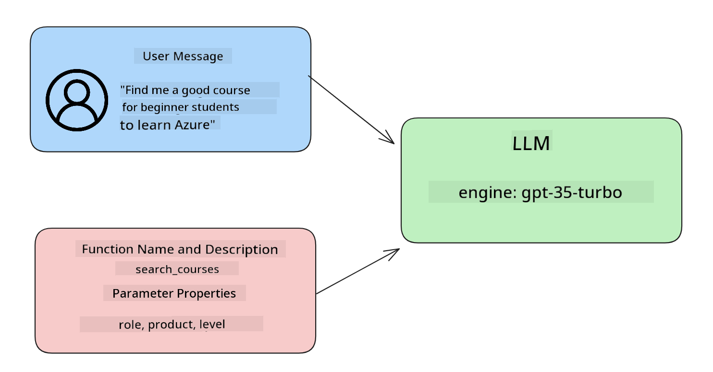

<!--
CO_OP_TRANSLATOR_METADATA:
{
  "original_hash": "f6f84f9ef2d066cd25850cab93580a50",
  "translation_date": "2025-10-17T22:30:14+00:00",
  "source_file": "11-integrating-with-function-calling/README.md",
  "language_code": "en"
}
-->
# Integrating with function calling

[](https://youtu.be/DgUdCLX8qYQ?si=f1ouQU5HQx6F8Gl2)

You’ve learned quite a bit in the previous lessons. However, there’s always room for improvement. Some areas we can focus on include achieving a more consistent response format to simplify downstream processing and incorporating data from external sources to enrich our application.

This chapter aims to address these challenges.

## Introduction

This lesson will cover:

- Explaining what function calling is and its use cases.
- Creating a function call using Azure OpenAI.
- Integrating a function call into an application.

## Learning Goals

By the end of this lesson, you will be able to:

- Explain the purpose of using function calling.
- Set up Function Call using the Azure OpenAI Service.
- Design effective function calls for your application's use case.

## Scenario: Improving our chatbot with functions

In this lesson, we aim to build a feature for our education startup that enables users to use a chatbot to find technical courses. The chatbot will recommend courses tailored to their skill level, current role, and area of interest.

To achieve this, we will use a combination of:

- `Azure OpenAI` to create a chat experience for the user.
- `Microsoft Learn Catalog API` to help users find courses based on their requests.
- `Function Calling` to process the user's query and send it to a function to make the API request.

Let’s start by understanding why we would want to use function calling in the first place:

## Why Function Calling

Before function calling, responses from a Large Language Model (LLM) were often unstructured and inconsistent. Developers had to write complex validation code to handle the variations in responses. Additionally, users couldn’t get answers to queries like "What is the current weather in Stockholm?" because models were limited to the data available at the time of training.

Function Calling is a feature of the Azure OpenAI Service designed to address these limitations:

- **Consistent response format**. By controlling the response format, it becomes easier to integrate the response into other systems downstream.
- **External data**. Enables the use of data from other sources within an application in a chat context.

## Illustrating the problem through a scenario

> We recommend using the [included notebook](./python/aoai-assignment.ipynb?WT.mc_id=academic-105485-koreyst) if you want to run the scenario below. Alternatively, you can follow along as we illustrate a problem that functions can help solve.

Let’s examine an example that highlights the issue of inconsistent response formats:

Suppose we want to create a database of student data to recommend suitable courses to them. Below are two descriptions of students that contain similar data.

1. Create a connection to our Azure OpenAI resource:

   ```python
   import os
   import json
   from openai import AzureOpenAI
   from dotenv import load_dotenv
   load_dotenv()

   client = AzureOpenAI(
   api_key=os.environ['AZURE_OPENAI_API_KEY'],  # this is also the default, it can be omitted
   api_version = "2023-07-01-preview"
   )

   deployment=os.environ['AZURE_OPENAI_DEPLOYMENT']
   ```

   The Python code below configures our connection to Azure OpenAI by setting `api_type`, `api_base`, `api_version`, and `api_key`.

1. Create two student descriptions using the variables `student_1_description` and `student_2_description`.

   ```python
   student_1_description="Emily Johnson is a sophomore majoring in computer science at Duke University. She has a 3.7 GPA. Emily is an active member of the university's Chess Club and Debate Team. She hopes to pursue a career in software engineering after graduating."

   student_2_description = "Michael Lee is a sophomore majoring in computer science at Stanford University. He has a 3.8 GPA. Michael is known for his programming skills and is an active member of the university's Robotics Club. He hopes to pursue a career in artificial intelligence after finishing his studies."
   ```

   We will send these student descriptions to an LLM to parse the data. This data can later be used in our application, sent to an API, or stored in a database.

1. Create two identical prompts instructing the LLM on the information we want to extract:

   ```python
   prompt1 = f'''
   Please extract the following information from the given text and return it as a JSON object:

   name
   major
   school
   grades
   club

   This is the body of text to extract the information from:
   {student_1_description}
   '''

   prompt2 = f'''
   Please extract the following information from the given text and return it as a JSON object:

   name
   major
   school
   grades
   club

   This is the body of text to extract the information from:
   {student_2_description}
   '''
   ```

   These prompts guide the LLM to extract information and return the response in JSON format.

1. After setting up the prompts and connecting to Azure OpenAI, send the prompts to the LLM using `openai.ChatCompletion`. Store the prompt in the `messages` variable and assign the role as `user` to simulate a user message in a chatbot.

   ```python
   # response from prompt one
   openai_response1 = client.chat.completions.create(
   model=deployment,
   messages = [{'role': 'user', 'content': prompt1}]
   )
   openai_response1.choices[0].message.content

   # response from prompt two
   openai_response2 = client.chat.completions.create(
   model=deployment,
   messages = [{'role': 'user', 'content': prompt2}]
   )
   openai_response2.choices[0].message.content
   ```

Now, send both requests to the LLM and examine the responses by accessing them like this: `openai_response1['choices'][0]['message']['content']`.

1. Finally, convert the response to JSON format using `json.loads`:

   ```python
   # Loading the response as a JSON object
   json_response1 = json.loads(openai_response1.choices[0].message.content)
   json_response1
   ```

   Response 1:

   ```json
   {
     "name": "Emily Johnson",
     "major": "computer science",
     "school": "Duke University",
     "grades": "3.7",
     "club": "Chess Club"
   }
   ```

   Response 2:

   ```json
   {
     "name": "Michael Lee",
     "major": "computer science",
     "school": "Stanford University",
     "grades": "3.8 GPA",
     "club": "Robotics Club"
   }
   ```

   Despite identical prompts and similar descriptions, the `Grades` property values are formatted differently, such as `3.7` or `3.7 GPA`.

   This inconsistency arises because the LLM processes unstructured data from the prompt and returns unstructured data. To store or use this data effectively, we need a structured format.

How can we solve the formatting problem? By using function calling, we can ensure structured data is returned. When using function calling, the LLM doesn’t actually execute any functions. Instead, we define a structure for the LLM to follow in its responses. We then use these structured responses to determine which function to execute in our applications.


The output from the function can then be sent back to the LLM, which will use it to generate a natural language response to the user’s query.

## Use Cases for using function calls

Function calls can enhance your app in various ways, such as:

- **Calling External Tools**. Chatbots can use user messages to perform specific tasks. For example, a student might ask the chatbot to "Send an email to my instructor saying I need more assistance with this subject." This could trigger a function call like `send_email(to: string, body: string)`.

- **Creating API or Database Queries**. Users can request information using natural language, which is then converted into a formatted query or API request. For instance, a teacher might ask, "Who are the students that completed the last assignment?" This could call a function like `get_completed(student_name: string, assignment: int, current_status: string)`.

- **Creating Structured Data**. Users can extract key information from a block of text or CSV using the LLM. For example, a student could convert a Wikipedia article about peace agreements into AI-generated flashcards using a function like `get_important_facts(agreement_name: string, date_signed: string, parties_involved: list)`.

## Creating Your First Function Call

Creating a function call involves three main steps:

1. **Calling** the Chat Completions API with a list of your functions and a user message.
2. **Reading** the model’s response to perform an action, such as executing a function or API call.
3. **Making** another call to the Chat Completions API with the function’s response to generate a user-friendly reply.



### Step 1 - Creating messages

The first step is to create a user message. This can be dynamically assigned using a text input or manually assigned. If you’re new to the Chat Completions API, you need to define the `role` and `content` of the message.

The `role` can be `system` (for creating rules), `assistant` (the model), or `user` (the end-user). For function calling, we’ll assign the role as `user` and provide an example question.

```python
messages= [ {"role": "user", "content": "Find me a good course for a beginner student to learn Azure."} ]
```

By assigning different roles, the LLM can distinguish between system instructions and user input, helping to build a coherent conversation history.

### Step 2 - Creating functions

Next, define a function and its parameters. We’ll use a single function called `search_courses` for this example, but you can create multiple functions.

> **Important**: Functions are included in the system message to the LLM and count toward the available tokens.

Below, we define the functions as an array of items. Each item represents a function with properties `name`, `description`, and `parameters`:

```python
functions = [
   {
      "name":"search_courses",
      "description":"Retrieves courses from the search index based on the parameters provided",
      "parameters":{
         "type":"object",
         "properties":{
            "role":{
               "type":"string",
               "description":"The role of the learner (i.e. developer, data scientist, student, etc.)"
            },
            "product":{
               "type":"string",
               "description":"The product that the lesson is covering (i.e. Azure, Power BI, etc.)"
            },
            "level":{
               "type":"string",
               "description":"The level of experience the learner has prior to taking the course (i.e. beginner, intermediate, advanced)"
            }
         },
         "required":[
            "role"
         ]
      }
   }
]
```

Let’s break down each function instance:

- `name` - The name of the function to be called.
- `description` - A clear and specific explanation of the function’s purpose.
- `parameters` - A list of values and formats for the model to use in its response. The parameters array contains items with the following properties:
  1. `type` - The data type of the property.
  1. `properties` - A list of specific values the model will use in its response.
      1. `name` - The key name of the property, e.g., `product`.
      1. `type` - The data type of the property, e.g., `string`.
      1. `description` - A description of the specific property.

An optional property, `required`, specifies which properties are necessary for the function call.

### Step 3 - Making the function call

After defining a function, include it in the call to the Chat Completion API by adding `functions` to the request. In this case, `functions=functions`.

You can also set `function_call` to `auto`, allowing the LLM to decide which function to call based on the user message.

Here’s an example of calling `ChatCompletion.create`. Note how `functions=functions` and `function_call="auto"` are set, giving the LLM the ability to choose which function to call:

```python
response = client.chat.completions.create(model=deployment,
                                        messages=messages,
                                        functions=functions,
                                        function_call="auto")

print(response.choices[0].message)
```

The response now looks like this:

```json
{
  "role": "assistant",
  "function_call": {
    "name": "search_courses",
    "arguments": "{\n  \"role\": \"student\",\n  \"product\": \"Azure\",\n  \"level\": \"beginner\"\n}"
  }
}
```

Here, the function `search_courses` is called with the arguments listed in the `arguments` property of the JSON response.

The LLM extracted the data to fit the function’s arguments from the value provided to the `messages` parameter in the chat completion call. Below is a reminder of the `messages` value:

```python
messages= [ {"role": "user", "content": "Find me a good course for a beginner student to learn Azure."} ]
```

As you can see, `student`, `Azure`, and `beginner` were extracted from `messages` and used as input for the function. Using functions in this way is an excellent method for extracting information from a prompt, providing structure to the LLM, and enabling reusable functionality.

Next, let’s explore how to integrate this into an application.

## Integrating Function Calls into an Application

After testing the formatted response from the LLM, we can integrate it into an application.

### Managing the flow

To integrate this into our application, follow these steps:

1. First, make the call to the OpenAI services and store the message in a variable called `response_message`.

   ```python
   response_message = response.choices[0].message
   ```

1. Define the function that will call the Microsoft Learn API to retrieve a list of courses:

   ```python
   import requests

   def search_courses(role, product, level):
     url = "https://learn.microsoft.com/api/catalog/"
     params = {
        "role": role,
        "product": product,
        "level": level
     }
     response = requests.get(url, params=params)
     modules = response.json()["modules"]
     results = []
     for module in modules[:5]:
        title = module["title"]
        url = module["url"]
        results.append({"title": title, "url": url})
     return str(results)
   ```

   Note how we create an actual Python function that corresponds to the function names defined in the `functions` variable. This function makes real external API calls to fetch the required data, in this case, from the Microsoft Learn API.

Now that we’ve created the `functions` variable and a corresponding Python function, how do we ensure the LLM maps these two together so our Python function is executed?

1. To determine whether a Python function needs to be called, check the LLM response for the presence of `function_call` and execute the specified function. Here’s how to perform this check:

   ```python
   # Check if the model wants to call a function
   if response_message.function_call.name:
    print("Recommended Function call:")
    print(response_message.function_call.name)
    print()

    # Call the function.
    function_name = response_message.function_call.name

    available_functions = {
            "search_courses": search_courses,
    }
    function_to_call = available_functions[function_name]

    function_args = json.loads(response_message.function_call.arguments)
    function_response = function_to_call(**function_args)

    print("Output of function call:")
    print(function_response)
    print(type(function_response))


    # Add the assistant response and function response to the messages
    messages.append( # adding assistant response to messages
        {
            "role": response_message.role,
            "function_call": {
                "name": function_name,
                "arguments": response_message.function_call.arguments,
            },
            "content": None
        }
    )
    messages.append( # adding function response to messages
        {
            "role": "function",
            "name": function_name,
            "content":function_response,
        }
    )
   ```

   These three lines ensure we extract the function name, the arguments, and make the call:

   ```python
   function_to_call = available_functions[function_name]

   function_args = json.loads(response_message.function_call.arguments)
   function_response = function_to_call(**function_args)
   ```

   Below is the output from running our code:

   **Output**

   ```Recommended Function call:
   {
     "name": "search_courses",
     "arguments": "{\n  \"role\": \"student\",\n  \"product\": \"Azure\",\n  \"level\": \"beginner\"\n}"
   }

   Output of function call:
   [{'title': 'Describe concepts of cryptography', 'url': 'https://learn.microsoft.com/training/modules/describe-concepts-of-cryptography/?
   WT.mc_id=api_CatalogApi'}, {'title': 'Introduction to audio classification with TensorFlow', 'url': 'https://learn.microsoft.com/en-
   us/training/modules/intro-audio-classification-tensorflow/?WT.mc_id=api_CatalogApi'}, {'title': 'Design a Performant Data Model in Azure SQL
   Database with Azure Data Studio', 'url': 'https://learn.microsoft.com/training/modules/design-a-data-model-with-ads/?
   WT.mc_id=api_CatalogApi'}, {'title': 'Getting started with the Microsoft Cloud Adoption Framework for Azure', 'url':
   'https://learn.microsoft.com/training/modules/cloud-adoption-framework-getting-started/?WT.mc_id=api_CatalogApi'}, {'title': 'Set up the
   Rust development environment', 'url': 'https://learn.microsoft.com/training/modules/rust-set-up-environment/?WT.mc_id=api_CatalogApi'}]
   <class 'str'>
   ```

1. Finally, send the updated message, `messages`, to the LLM to receive a natural language response instead of an API JSON-formatted response.

   ```python
   print("Messages in next request:")
   print(messages)
   print()

   second_response = client.chat.completions.create(
      messages=messages,
      model=deployment,
      function_call="auto",
      functions=functions,
      temperature=0
         )  # get a new response from GPT where it can see the function response


   print(second_response.choices[0].message)
   ```

   **Output**

   ```python
   {
     "role": "assistant",
     "content": "I found some good courses for beginner students to learn Azure:\n\n1. [Describe concepts of cryptography] (https://learn.microsoft.com/training/modules/describe-concepts-of-cryptography/?WT.mc_id=api_CatalogApi)\n2. [Introduction to audio classification with TensorFlow](https://learn.microsoft.com/training/modules/intro-audio-classification-tensorflow/?WT.mc_id=api_CatalogApi)\n3. [Design a Performant Data Model in Azure SQL Database with Azure Data Studio](https://learn.microsoft.com/training/modules/design-a-data-model-with-ads/?WT.mc_id=api_CatalogApi)\n4. [Getting started with the Microsoft Cloud Adoption Framework for Azure](https://learn.microsoft.com/training/modules/cloud-adoption-framework-getting-started/?WT.mc_id=api_CatalogApi)\n5. [Set up the Rust development environment](https://learn.microsoft.com/training/modules/rust-set-up-environment/?WT.mc_id=api_CatalogApi)\n\nYou can click on the links to access the courses."
   }

   ```

## Assignment

To continue learning about Azure OpenAI Function Calling, you can:

- Add more parameters to the function to help learners find additional courses.
- Create another function call that gathers more information from the learner, such as their native language.
- Create error handling when the function call and/or API call does not return any suitable courses

Hint: Follow the [Learn API reference documentation](https://learn.microsoft.com/training/support/catalog-api-developer-reference?WT.mc_id=academic-105485-koreyst) page to see how and where this data is available.

## Great Work! Continue the Journey

After completing this lesson, check out our [Generative AI Learning collection](https://aka.ms/genai-collection?WT.mc_id=academic-105485-koreyst) to continue leveling up your Generative AI knowledge!

Head over to Lesson 12, where we will look at how to [design UX for AI applications](../12-designing-ux-for-ai-applications/README.md?WT.mc_id=academic-105485-koreyst)!

---

**Disclaimer**:  
This document has been translated using the AI translation service [Co-op Translator](https://github.com/Azure/co-op-translator). While we aim for accuracy, please note that automated translations may include errors or inaccuracies. The original document in its native language should be regarded as the authoritative source. For critical information, professional human translation is advised. We are not responsible for any misunderstandings or misinterpretations resulting from the use of this translation.