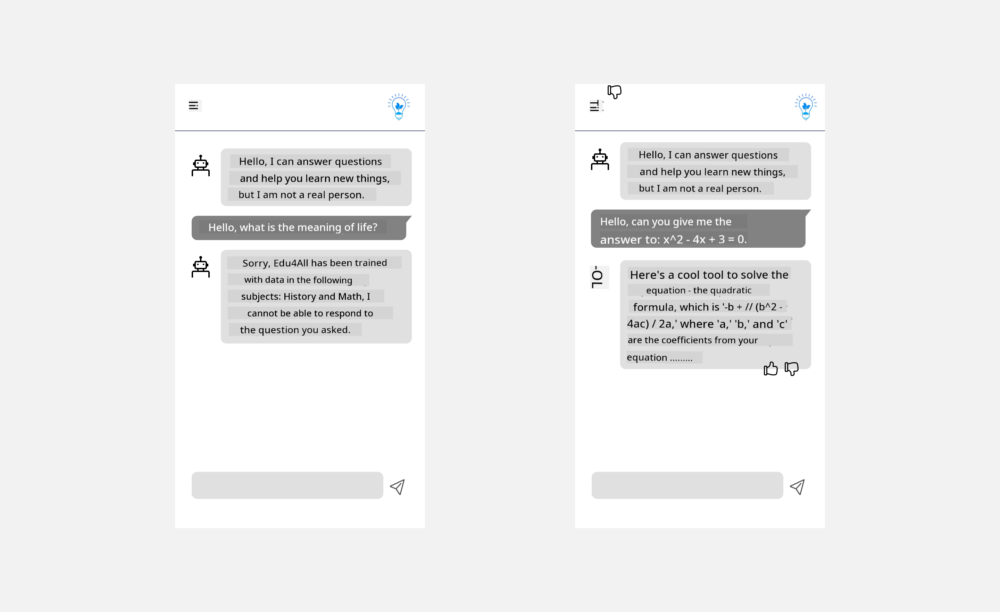

<!--
CO_OP_TRANSLATOR_METADATA:
{
  "original_hash": "ec385b41ee50579025d50cc03bfb3a25",
  "translation_date": "2025-05-19T21:40:27+00:00",
  "source_file": "12-designing-ux-for-ai-applications/README.md",
  "language_code": "en"
}
-->
# Designing UX for AI Applications

> _(Click the image above to view video of this lesson)_

User experience is a crucial aspect of app development. Users need to use your app efficiently to complete tasks. Efficiency is important, but apps should also be designed to be _accessible_ for everyone. This chapter focuses on this area so you can design an app that people can and want to use.

## Introduction

User experience refers to how a user interacts with and uses a specific product or service, whether it's a system, tool, or design. When developing AI applications, developers focus not only on making the user experience effective but also ethical. In this lesson, we cover how to build Artificial Intelligence (AI) applications that address user needs.

The lesson will cover the following areas:

- Introduction to User Experience and Understanding User Needs
- Designing AI Applications for Trust and Transparency
- Designing AI Applications for Collaboration and Feedback

## Learning goals

After completing this lesson, you'll be able to:

- Understand how to build AI applications that meet user needs.
- Design AI applications that promote trust and collaboration.

### Prerequisite

Take some time to read more about [user experience and design thinking.](https://learn.microsoft.com/training/modules/ux-design?WT.mc_id=academic-105485-koreyst)

## Introduction to User Experience and Understanding User Needs

In our fictional education startup, we have two primary users: teachers and students. Each has unique needs. A user-centered design prioritizes the user, ensuring products are relevant and beneficial for those they are intended for.

The application should be **useful, reliable, accessible, and pleasant** to provide a good user experience.

### Usability

Being useful means the application has functionality that matches its intended purpose, like automating the grading process or generating flashcards for revision. An application that automates grading should accurately and efficiently assign scores based on predefined criteria. Similarly, an application that generates revision flashcards should create relevant and diverse questions based on its data.

### Reliability

Being reliable means the application can consistently perform its tasks without errors. However, AI, like humans, is not perfect and may be prone to errors. Applications may encounter errors or unexpected situations requiring human intervention or correction. How do you handle errors? In the last section of this lesson, we will cover how AI systems and applications are designed for collaboration and feedback.

### Accessibility

Being accessible means extending the user experience to users with various abilities, including those with disabilities, ensuring no one is left out. By following accessibility guidelines and principles, AI solutions become more inclusive, usable, and beneficial for all users.

### Pleasant

Being pleasant means the application is enjoyable to use. An appealing user experience can positively impact the user, encouraging them to return to the application and increasing business revenue.

Not every challenge can be solved with AI. AI enhances user experience, whether by automating manual tasks or personalizing user experiences.

## Designing AI Applications for Trust and Transparency

Building trust is critical when designing AI applications. Trust ensures a user is confident that the application will complete tasks, deliver consistent results, and meet user needs. A risk in this area is mistrust and overtrust. Mistrust occurs when a user has little or no trust in an AI system, leading to rejection of the application. Overtrust occurs when a user overestimates an AI system's capabilities, leading to excessive trust. For example, an automated grading system might lead a teacher to skip reviewing some papers, resulting in unfair or inaccurate grades or missed feedback opportunities.

Two ways to ensure trust is central to design are explainability and control.

### Explainability

When AI informs decisions, such as imparting knowledge to future generations, it is crucial for teachers and parents to understand how AI decisions are made. This is explainability—understanding how AI applications make decisions. Designing for explainability includes adding details of examples of what an AI application can do. For example, instead of "Get started with AI teacher," the system can use: "Summarize your notes for easier revision using AI."

Another example is how AI uses user and personal data. For example, a student persona may have limitations based on their persona. The AI may not reveal answers but may guide the user to think through solving a problem.

A key part of explainability is simplifying explanations. Students and teachers may not be AI experts, so explanations of what the application can or cannot do should be simplified and easy to understand.

### Control

Generative AI creates collaboration between AI and the user, allowing users to modify prompts for different results. Once an output is generated, users should be able to modify results, giving them a sense of control. For example, when using Bing, you can tailor your prompt based on format, tone, and length. You can also modify the output as shown below:

Another feature in Bing allows users to control the data AI uses, like opting in and out. For a school application, a student might want to use their notes and teachers' resources for revision.

> When designing AI applications, intentionality is key to ensuring users do not overtrust, setting unrealistic expectations of capabilities. One way to do this is by creating friction between prompts and results, reminding users that this is AI and not a fellow human being.

## Designing AI Applications for Collaboration and Feedback

As mentioned earlier, generative AI creates collaboration between the user and AI. Most engagements involve user inputting a prompt and AI generating an output. What if the output is incorrect? How does the application handle errors? Does AI blame the user or explain the error?

AI applications should be built to receive and give feedback. This helps AI systems improve and builds trust with users. A feedback loop should be included in the design, such as a simple thumbs up or down on the output.

Another way to handle this is by clearly communicating system capabilities and limitations. When a user makes an error requesting something beyond AI capabilities, there should be a way to handle this, as shown below.

System errors are common when users need assistance outside AI's scope or the application limits questions/subjects for summaries. For example, an AI application trained on limited subjects like History and Math may not handle Geography questions. To mitigate this, the AI system can respond: "Sorry, our product is trained with data in the following subjects....., I cannot respond to your question."

AI applications are not perfect, so they are bound to make mistakes. When designing applications, create room for feedback and error handling in a simple, easily explainable way.

## Assignment

Consider implementing the following steps in any AI apps you've built:

- **Pleasant:** Consider how to make your app more pleasant. Are you adding explanations everywhere? Are you encouraging exploration? How are you wording error messages?

- **Usability:** Build a web app navigable by both mouse and keyboard.

- **Trust and transparency:** Don't completely trust AI and its output; consider adding human verification. Implement other ways to achieve trust and transparency.

- **Control:** Give users control over the data they provide. Implement a way for users to opt-in and opt-out of data collection.

## Continue Your Learning!

After completing this lesson, check out our [Generative AI Learning collection](https://aka.ms/genai-collection?WT.mc_id=academic-105485-koreyst) to continue leveling up your Generative AI knowledge!

Head over to Lesson 13, where we will look at how to [secure AI applications](../13-securing-ai-applications/README.md?WT.mc_id=academic-105485-koreyst)!

Sure, please provide the text you would like translated to English.