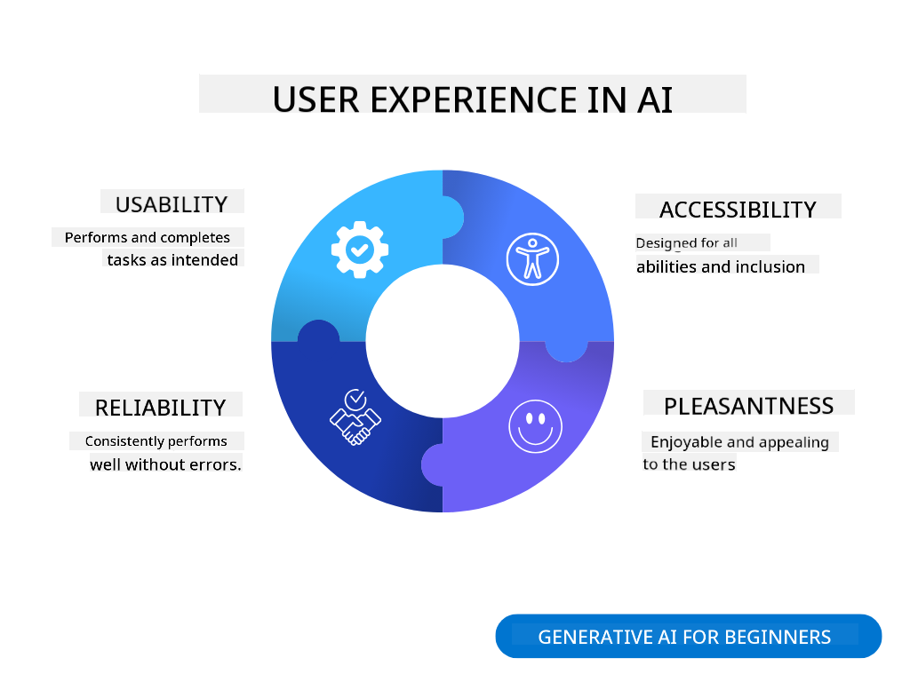
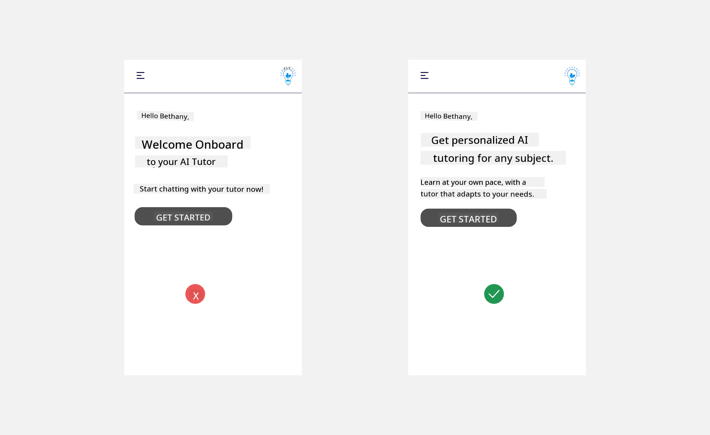
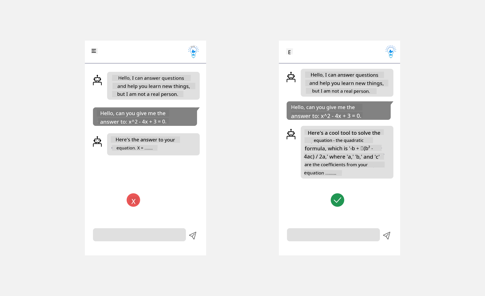
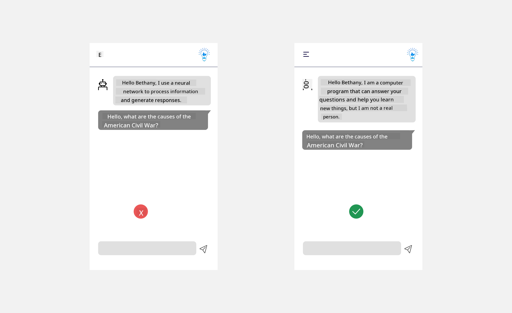
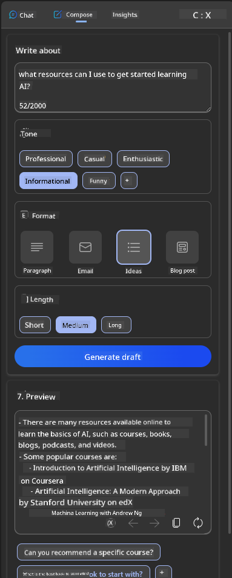
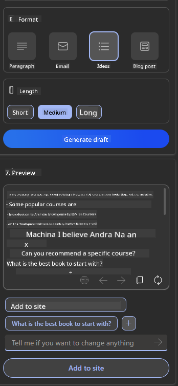
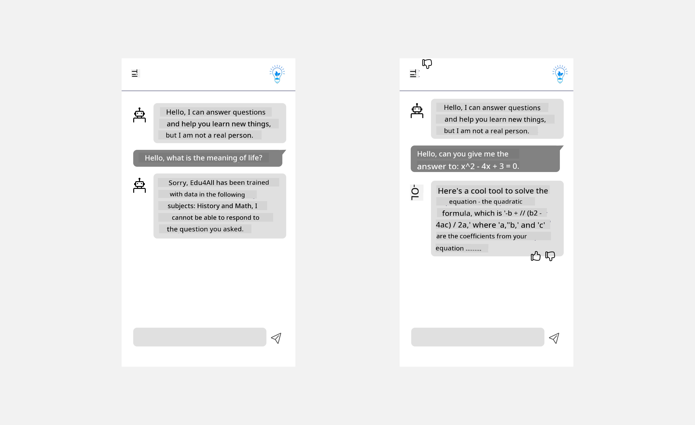

<!--
CO_OP_TRANSLATOR_METADATA:
{
  "original_hash": "ec385b41ee50579025d50cc03bfb3a25",
  "translation_date": "2025-06-25T20:07:51+00:00",
  "source_file": "12-designing-ux-for-ai-applications/README.md",
  "language_code": "en"
}
-->
# Designing UX for AI Applications

> _(Click the image above to view video of this lesson)_

User experience is a crucial aspect of app development. Users need to use your app efficiently to complete tasks. Efficiency is important, but it's also necessary to design apps that are usable by everyone, making them _accessible_. This chapter focuses on this area to help you design an app that people can and want to use.

## Introduction

User experience involves how a user interacts with and uses a specific product or service, whether it's a system, tool, or design. When developing AI applications, developers focus not only on making the user experience effective but also ethical. In this lesson, we explore how to build AI applications that meet user needs.

The lesson will cover:

- Introduction to User Experience and Understanding User Needs
- Designing AI Applications for Trust and Transparency
- Designing AI Applications for Collaboration and Feedback

## Learning goals

After completing this lesson, you'll be able to:

- Understand how to build AI applications that meet user needs.
- Design AI applications that promote trust and collaboration.

### Prerequisite

Take some time to read more about [user experience and design thinking.](https://learn.microsoft.com/training/modules/ux-design?WT.mc_id=academic-105485-koreyst)

## Introduction to User Experience and Understanding User Needs

In our fictitious education startup, we have two main users: teachers and students. Each has unique needs. A user-centered design prioritizes the user, ensuring the products are relevant and beneficial for those they are intended for.

The application should be **useful, reliable, accessible, and pleasant** to provide a good user experience.

### Usability

Being useful means the application has functionality that matches its intended purpose, such as automating the grading process or generating flashcards for revision. An application that automates grading should accurately and efficiently assign scores based on predefined criteria. Similarly, an application that generates revision flashcards should create relevant and diverse questions based on its data.

### Reliability

Being reliable means the application can perform its tasks consistently and without errors. However, like humans, AI is not perfect and may be prone to errors. Applications may encounter errors or unexpected situations requiring human intervention or correction. How do you handle errors? In the last section of this lesson, we will discuss how AI systems and applications are designed for collaboration and feedback.

### Accessibility

Being accessible means extending the user experience to users with various abilities, including those with disabilities, ensuring no one is left out. By following accessibility guidelines and principles, AI solutions become more inclusive, usable, and beneficial for all users.

### Pleasant

Being pleasant means the application is enjoyable to use. An appealing user experience can positively impact the user, encouraging them to return to the application and increasing business revenue.

Not every challenge can be solved with AI. AI augments your user experience, whether by automating manual tasks or personalizing user experiences.

## Designing AI Applications for Trust and Transparency

Building trust is critical when designing AI applications. Trust ensures a user is confident that the application will get the work done, deliver results consistently, and provide what the user needs. A risk in this area is mistrust and overtrust. Mistrust occurs when a user has little or no trust in an AI system, leading to the user rejecting your application. Overtrust occurs when a user overestimates the capability of an AI system, leading to users trusting the AI system too much. For example, an automated grading system in the case of overtrust might lead the teacher not to proofread some papers to ensure the grading system works well. This could result in unfair or inaccurate grades for students or missed opportunities for feedback and improvement.

Two ways to ensure trust is central to design are explainability and control.

### Explainability

When AI helps inform decisions, such as imparting knowledge to future generations, it's critical for teachers and parents to understand how AI decisions are made. This is explainability—understanding how AI applications make decisions. Designing for explainability includes adding examples of what an AI application can do. For example, instead of "Get started with AI teacher," the system can use: "Summarize your notes for easier revision using AI."

Another example is how AI uses user and personal data. For example, a user with the persona of a student may have limitations based on their persona. The AI may not be able to reveal answers to questions but may help guide the user to think through how they can solve a problem.

A key part of explainability is simplifying explanations. Students and teachers may not be AI experts, so explanations of what the application can or cannot do should be simplified and easy to understand.

### Control

Generative AI creates a collaboration between AI and the user, where a user can modify prompts for different results. Additionally, once an output is generated, users should be able to modify the results, giving them a sense of control. For example, when using Bing, you can tailor your prompt based on format, tone, and length. Additionally, you can add changes to your output and modify it as shown below:

Another feature in Bing that allows a user to have control over the application is the ability to opt in and opt out of the data AI uses. For a school application, a student might want to use their notes as well as the teacher's resources as revision material.

> When designing AI applications, intentionality is key in ensuring users do not overtrust, setting unrealistic expectations of its capabilities. One way to do this is by creating friction between the prompts and the results. Reminding the user that this is AI and not a fellow human being.

## Designing AI Applications for Collaboration and Feedback

As mentioned earlier, generative AI creates a collaboration between the user and AI. Most engagements involve a user inputting a prompt and the AI generating an output. What if the output is incorrect? How does the application handle errors if they occur? Does the AI blame the user or take time to explain the error?

AI applications should be built to receive and give feedback. This not only helps the AI system improve but also builds trust with users. A feedback loop should be included in the design; an example can be a simple thumbs up or down on the output.

Another way to handle this is to clearly communicate the capabilities and limitations of the system. When a user makes an error requesting something beyond the AI's capabilities, there should also be a way to handle this, as shown below.

System errors are common with applications where the user might need assistance with information outside the AI's scope, or the application may have a limit on how many questions/subjects a user can generate summaries for. For example, an AI application trained with data on limited subjects, such as History and Math, may not be able to handle questions about Geography. To mitigate this, the AI system can respond like: "Sorry, our product has been trained with data in the following subjects....., I cannot respond to the question you asked."

AI applications are not perfect, and they are bound to make mistakes. When designing your applications, you should ensure you create room for feedback from users and error handling in a way that is simple and easily explainable.

## Assignment

Take any AI apps you've built so far, and consider implementing the following steps in your app:

- **Pleasant:** Consider how you can make your app more pleasant. Are you adding explanations everywhere? Are you encouraging the user to explore? How are you wording your error messages?

- **Usability:** Build a web app. Make sure your app is navigable by both mouse and keyboard.

- **Trust and transparency:** Don't trust the AI completely and its output; consider how you would add a human to the process to verify the output. Also, consider and implement other ways to achieve trust and transparency.

- **Control:** Give the user control of the data they provide to the application. Implement a way for a user to opt-in and opt-out of data collection in the AI application.

## Continue Your Learning!

After completing this lesson, check out our [Generative AI Learning collection](https://aka.ms/genai-collection?WT.mc_id=academic-105485-koreyst) to continue leveling up your Generative AI knowledge!

Head over to Lesson 13, where we will look at how to [securing AI applications](../13-securing-ai-applications/README.md?WT.mc_id=academic-105485-koreyst)!

**Disclaimer**:  
This document has been translated using AI translation service [Co-op Translator](https://github.com/Azure/co-op-translator). While we strive for accuracy, please be aware that automated translations may contain errors or inaccuracies. The original document in its native language should be considered the authoritative source. For critical information, professional human translation is recommended. We are not liable for any misunderstandings or misinterpretations arising from the use of this translation.