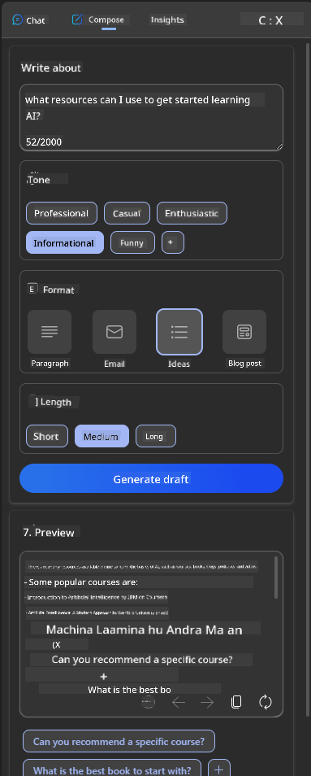

<!--
CO_OP_TRANSLATOR_METADATA:
{
  "original_hash": "ec385b41ee50579025d50cc03bfb3a25",
  "translation_date": "2025-07-09T14:47:47+00:00",
  "source_file": "12-designing-ux-for-ai-applications/README.md",
  "language_code": "en"
}
-->
# Designing UX for AI Applications

> _(Click the image above to watch the video for this lesson)_

User experience is a crucial part of building apps. Users need to be able to use your app efficiently to complete tasks. Efficiency is important, but you also need to design apps that everyone can use, making them _accessible_. This chapter focuses on that area so you can design an app that people both can and want to use.

## Introduction

User experience refers to how a user interacts with and uses a specific product or service, whether it’s a system, tool, or design. When developing AI applications, developers focus not only on making the user experience effective but also ethical. In this lesson, we explore how to build Artificial Intelligence (AI) applications that truly meet user needs.

This lesson covers the following topics:

- Introduction to User Experience and Understanding User Needs  
- Designing AI Applications for Trust and Transparency  
- Designing AI Applications for Collaboration and Feedback  

## Learning goals

By the end of this lesson, you will be able to:

- Understand how to build AI applications that address user needs.  
- Design AI applications that foster trust and collaboration.  

### Prerequisite

Take some time to learn more about [user experience and design thinking.](https://learn.microsoft.com/training/modules/ux-design?WT.mc_id=academic-105485-koreyst)

## Introduction to User Experience and Understanding User Needs

In our fictional education startup, we have two main users: teachers and students. Each user group has unique needs. A user-centered design puts the user first, ensuring the products are relevant and valuable to those they are intended for.

The application should be **useful, reliable, accessible, and enjoyable** to provide a great user experience.

### Usability

Being useful means the app offers features that match its intended purpose, like automating grading or generating flashcards for revision. An app that automates grading should accurately and efficiently score students’ work based on set criteria. Similarly, an app that creates revision flashcards should generate relevant and varied questions based on its data.

### Reliability

Being reliable means the app consistently performs its tasks without errors. However, AI, like humans, isn’t perfect and can make mistakes. Applications may encounter errors or unexpected situations that require human intervention or correction. How do you handle errors? In the last section of this lesson, we’ll discuss how AI systems and applications are designed for collaboration and feedback.

### Accessibility

Being accessible means making the user experience available to users with different abilities, including those with disabilities, so no one is excluded. By following accessibility guidelines and principles, AI solutions become more inclusive, usable, and beneficial for everyone.

### Pleasant

Being pleasant means the app is enjoyable to use. A positive user experience encourages users to return to the app and can boost business revenue.

Not every problem can be solved with AI. AI is there to enhance your user experience, whether by automating manual tasks or personalizing interactions.

## Designing AI Applications for Trust and Transparency

Building trust is essential when designing AI applications. Trust means users feel confident the app will get the job done, deliver consistent results, and provide what they need. Risks here include mistrust and overtrust. Mistrust happens when users have little or no confidence in an AI system, leading them to reject your app. Overtrust happens when users overestimate what an AI system can do, trusting it too much. For example, with an automated grading system, overtrust might cause a teacher to skip reviewing some papers, which could lead to unfair or inaccurate grades or missed chances for feedback.

Two key ways to put trust at the heart of design are explainability and control.

### Explainability

When AI helps make decisions, such as educating future generations, it’s vital for teachers and parents to understand how those decisions are made. Explainability means understanding how AI applications reach their conclusions. Designing for explainability involves providing examples of what the AI can do. For instance, instead of saying "Get started with AI teacher," the system might say: "Summarize your notes for easier revision using AI."

Another example is how AI uses user and personal data. For example, a student persona might have certain limitations. The AI might not reveal answers directly but could guide the user to think through how to solve a problem.

A final important part of explainability is simplifying explanations. Students and teachers may not be AI experts, so explanations about what the app can or cannot do should be clear and easy to understand.

### Control

Generative AI fosters collaboration between AI and the user, where users can modify prompts to get different results. Once an output is generated, users should be able to adjust it, giving them a sense of control. For example, when using Bing, you can tailor your prompt by format, tone, and length. You can also edit and refine the output as shown below:

Another feature in Bing that gives users control is the ability to opt in or out of the data AI uses. For a school app, a student might want to use their notes as well as the teacher’s resources for revision.

> When designing AI applications, intentionality is key to preventing users from overtrusting and having unrealistic expectations of what AI can do. One way to do this is by creating friction between prompts and results, reminding users that this is AI, not a human.

## Designing AI Applications for Collaboration and Feedback

As mentioned earlier, generative AI creates a partnership between the user and AI. Most interactions involve a user entering a prompt and the AI generating a response. But what if the output is wrong? How does the app handle errors? Does the AI blame the user or take time to explain the mistake?

AI applications should be designed to both receive and provide feedback. This helps improve the AI system and builds trust with users. A feedback loop should be part of the design—for example, a simple thumbs up or down on the output.

Another approach is to clearly communicate the system’s capabilities and limitations. When a user requests something beyond what the AI can do, there should be a way to handle this, as shown below.

System errors are common in apps where users might need help with information outside the AI’s scope, or where the app limits how many questions or subjects a user can generate summaries for. For example, an AI app trained only on History and Math might not handle Geography questions. To address this, the AI can respond with something like: "Sorry, our product has been trained on the following subjects..., so I’m unable to answer your question."

AI applications aren’t perfect and will make mistakes. When designing your apps, make sure to include ways for users to provide feedback and handle errors simply and clearly.

## Assignment

Take any AI apps you’ve built so far and consider implementing the following steps:

- **Pleasant:** Think about how to make your app more enjoyable. Are you adding explanations where needed? Are you encouraging users to explore? How do you phrase your error messages?

- **Usability:** If you’re building a web app, ensure it’s navigable by both mouse and keyboard.

- **Trust and transparency:** Don’t fully trust the AI or its output. Consider how to include a human in the process to verify results. Also, explore other ways to build trust and transparency.

- **Control:** Give users control over the data they provide. Implement options for users to opt in or out of data collection in the AI app.

## Continue Your Learning!

After finishing this lesson, check out our [Generative AI Learning collection](https://aka.ms/genai-collection?WT.mc_id=academic-105485-koreyst) to keep advancing your knowledge of Generative AI!

Next, head to Lesson 13, where we’ll explore how to [secure AI applications](../13-securing-ai-applications/README.md?WT.mc_id=academic-105485-koreyst)!

**Disclaimer**:  
This document has been translated using the AI translation service [Co-op Translator](https://github.com/Azure/co-op-translator). While we strive for accuracy, please be aware that automated translations may contain errors or inaccuracies. The original document in its native language should be considered the authoritative source. For critical information, professional human translation is recommended. We are not liable for any misunderstandings or misinterpretations arising from the use of this translation.