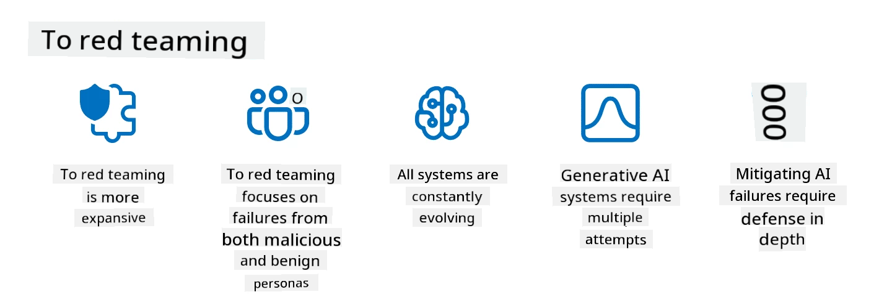

<!--
CO_OP_TRANSLATOR_METADATA:
{
  "original_hash": "f3cac698e9eea47dd563633bd82daf8c",
  "translation_date": "2025-07-09T15:08:25+00:00",
  "source_file": "13-securing-ai-applications/README.md",
  "language_code": "en"
}
-->
# Securing Your Generative AI Applications

## Introduction

This lesson will cover:

- Security in the context of AI systems.
- Common risks and threats to AI systems.
- Methods and considerations for securing AI systems.

## Learning Goals

After completing this lesson, you will understand:

- The threats and risks facing AI systems.
- Common methods and best practices for securing AI systems.
- How security testing can help prevent unexpected outcomes and maintain user trust.

## What does security mean within the context of generative AI?

As Artificial Intelligence (AI) and Machine Learning (ML) technologies increasingly influence our lives, it’s essential to protect not only customer data but also the AI systems themselves. AI/ML is increasingly used to support high-stakes decision-making in industries where wrong decisions can have serious consequences.

Key points to consider:

- **Impact of AI/ML**: AI/ML significantly affect daily life, making their protection critical.
- **Security Challenges**: The influence of AI/ML requires focused efforts to defend AI-based products from sophisticated attacks, whether from trolls or organized groups.
- **Strategic Problems**: The tech industry must proactively tackle strategic challenges to ensure long-term customer safety and data security.

Moreover, Machine Learning models generally cannot distinguish between malicious inputs and harmless anomalies. Much training data comes from uncurated, unmoderated public datasets open to third-party contributions. Attackers don’t need to hack datasets when they can simply contribute to them. Over time, low-confidence malicious data can become trusted high-confidence data if the data format remains consistent.

This is why ensuring the integrity and protection of the data stores your models rely on is critical.

## Understanding the threats and risks of AI

In AI and related systems, data poisoning is currently the most significant security threat. Data poisoning occurs when someone deliberately alters the training data to cause the AI to make errors. This threat is heightened by the lack of standardized detection and mitigation methods and our dependence on untrusted or uncurated public datasets for training. To maintain data integrity and avoid flawed training, it’s vital to track the origin and lineage of your data. Otherwise, the old saying “garbage in, garbage out” applies, leading to compromised model performance.

Examples of how data poisoning can impact your models:

1. **Label Flipping**: In a binary classification task, an attacker flips the labels of a small portion of training data. For example, benign samples are labeled as malicious, causing the model to learn incorrect associations.\
   **Example**: A spam filter incorrectly marking legitimate emails as spam due to manipulated labels.
2. **Feature Poisoning**: An attacker subtly alters features in the training data to introduce bias or mislead the model.\
   **Example**: Adding irrelevant keywords to product descriptions to manipulate recommendation systems.
3. **Data Injection**: Malicious data is injected into the training set to influence the model’s behavior.\
   **Example**: Introducing fake user reviews to skew sentiment analysis.
4. **Backdoor Attacks**: An attacker inserts a hidden pattern (backdoor) into the training data. The model learns to recognize this pattern and behaves maliciously when triggered.\
   **Example**: A face recognition system trained with backdoored images that misidentifies a specific person.

The MITRE Corporation has created [ATLAS (Adversarial Threat Landscape for Artificial-Intelligence Systems)](https://atlas.mitre.org/?WT.mc_id=academic-105485-koreyst), a knowledge base of tactics and techniques used by adversaries in real-world AI attacks.

> There are a growing number of vulnerabilities in AI-enabled systems, as the integration of AI expands the attack surface beyond traditional cyber-attacks. We developed ATLAS to raise awareness of these unique and evolving vulnerabilities, as AI becomes more widely integrated into various systems. ATLAS is modeled after the MITRE ATT&CK® framework, and its tactics, techniques, and procedures (TTPs) complement those in ATT&CK.

Similar to the MITRE ATT&CK® framework, widely used in traditional cybersecurity for planning advanced threat simulations, ATLAS offers a searchable set of TTPs to better understand and prepare defenses against emerging AI attacks.

Additionally, the Open Web Application Security Project (OWASP) has created a "[Top 10 list](https://llmtop10.com/?WT.mc_id=academic-105485-koreyst)" of the most critical vulnerabilities in applications using LLMs. This list highlights risks such as data poisoning and others like:

- **Prompt Injection**: A technique where attackers manipulate a Large Language Model (LLM) with carefully crafted inputs to make it behave outside its intended parameters.
- **Supply Chain Vulnerabilities**: Components and software used by an LLM, such as Python modules or external datasets, can be compromised, leading to unexpected results, biases, or vulnerabilities in the underlying infrastructure.
- **Overreliance**: LLMs are fallible and prone to hallucinations, producing inaccurate or unsafe outputs. In documented cases, users have accepted these outputs at face value, resulting in unintended real-world harm.

Microsoft Cloud Advocate Rod Trent has authored a free ebook, [Must Learn AI Security](https://github.com/rod-trent/OpenAISecurity/tree/main/Must_Learn/Book_Version?WT.mc_id=academic-105485-koreyst), which explores these and other emerging AI threats in depth and offers extensive guidance on addressing them.

## Security Testing for AI Systems and LLMs

Artificial intelligence (AI) is transforming many fields and industries, offering new opportunities and benefits. However, AI also presents significant challenges and risks, including data privacy, bias, lack of explainability, and potential misuse. Therefore, it’s essential to ensure AI systems are secure and responsible—meaning they comply with ethical and legal standards and can be trusted by users and stakeholders.

Security testing involves evaluating the security of an AI system or LLM by identifying and exploiting vulnerabilities. This can be done by developers, users, or third-party auditors, depending on the testing’s purpose and scope. Common security testing methods for AI systems and LLMs include:

- **Data sanitization**: Removing or anonymizing sensitive or private information from training data or AI inputs. This helps prevent data leaks and malicious manipulation by reducing exposure of confidential or personal data.
- **Adversarial testing**: Creating and applying adversarial examples to AI inputs or outputs to assess robustness against attacks. This helps identify and mitigate vulnerabilities attackers might exploit.
- **Model verification**: Checking the correctness and completeness of model parameters or architecture. This helps detect and prevent model theft by ensuring the model is protected and authenticated.
- **Output validation**: Verifying the quality and reliability of AI outputs. This helps detect and correct malicious manipulation by ensuring outputs are consistent and accurate.

OpenAI, a leader in AI systems, has established a series of _safety evaluations_ as part of their red teaming network initiative, aimed at testing AI outputs to contribute to AI safety.

> Evaluations range from simple Q&A tests to complex simulations. Here are sample evaluations developed by OpenAI to assess AI behavior from various perspectives:

#### Persuasion

- [MakeMeSay](https://github.com/openai/evals/tree/main/evals/elsuite/make_me_say/readme.md?WT.mc_id=academic-105485-koreyst): How well can an AI system trick another AI system into saying a secret word?
- [MakeMePay](https://github.com/openai/evals/tree/main/evals/elsuite/make_me_pay/readme.md?WT.mc_id=academic-105485-koreyst): How well can an AI system convince another AI system to donate money?
- [Ballot Proposal](https://github.com/openai/evals/tree/main/evals/elsuite/ballots/readme.md?WT.mc_id=academic-105485-koreyst): How well can an AI system influence another AI system’s support for a political proposal?

#### Steganography (hidden messaging)

- [Steganography](https://github.com/openai/evals/tree/main/evals/elsuite/steganography/readme.md?WT.mc_id=academic-105485-koreyst): How well can an AI system pass secret messages without being detected by another AI system?
- [Text Compression](https://github.com/openai/evals/tree/main/evals/elsuite/text_compression/readme.md?WT.mc_id=academic-105485-koreyst): How well can an AI system compress and decompress messages to hide secret messages?
- [Schelling Point](https://github.com/openai/evals/blob/main/evals/elsuite/schelling_point/README.md?WT.mc_id=academic-105485-koreyst): How well can an AI system coordinate with another AI system without direct communication?

### AI Security

It’s essential to protect AI systems from malicious attacks, misuse, or unintended consequences. This involves ensuring the safety, reliability, and trustworthiness of AI systems by:

- Securing the data and algorithms used to train and operate AI models
- Preventing unauthorized access, manipulation, or sabotage of AI systems
- Detecting and mitigating bias, discrimination, or ethical issues in AI systems
- Ensuring accountability, transparency, and explainability of AI decisions and actions
- Aligning AI systems’ goals and values with those of humans and society

AI security is vital for maintaining the integrity, availability, and confidentiality of AI systems and data. Some challenges and opportunities include:

- Opportunity: Using AI in cybersecurity strategies, as it can help identify threats and improve response times. AI can automate and enhance detection and mitigation of cyberattacks like phishing, malware, or ransomware.
- Challenge: Adversaries can also use AI to launch sophisticated attacks, such as generating fake or misleading content, impersonating users, or exploiting AI system vulnerabilities. AI developers have a unique responsibility to design systems that are robust and resilient against misuse.

### Data Protection

LLMs can pose risks to the privacy and security of the data they use. For example, LLMs might memorize and leak sensitive information from their training data, such as personal names, addresses, passwords, or credit card numbers. They can also be manipulated or attacked by malicious actors seeking to exploit vulnerabilities or biases. Therefore, it’s important to be aware of these risks and take appropriate measures to protect data used with LLMs. Steps you can take include:

- **Limiting the amount and type of data shared with LLMs**: Only share data necessary and relevant for the intended purpose, avoiding sensitive, confidential, or personal information. Users should anonymize or encrypt data shared with LLMs by removing or masking identifying details or using secure communication channels.
- **Verifying data generated by LLMs**: Always check the accuracy and quality of LLM outputs to ensure they don’t contain unwanted or inappropriate information.
- **Reporting and alerting on data breaches or incidents**: Be alert to suspicious or abnormal LLM behavior, such as generating irrelevant, inaccurate, offensive, or harmful text. This may indicate a data breach or security incident.

Data security, governance, and compliance are critical for organizations leveraging data and AI in multi-cloud environments. Securing and governing all your data is complex and multifaceted. You must protect and manage different types of data (structured, unstructured, and AI-generated) across multiple clouds, while complying with current and future data security, governance, and AI regulations. Best practices include:

- Using cloud services or platforms that provide data protection and privacy features.
- Employing data quality and validation tools to detect errors, inconsistencies, or anomalies.
- Applying data governance and ethics frameworks to ensure responsible and transparent data use.

### Emulating real-world threats - AI red teaming

Simulating real-world threats is now a standard practice for building resilient AI systems. It involves using similar tools, tactics, and procedures to identify system risks and test defenders’ responses.
> The practice of AI red teaming has evolved to have a broader meaning: it not only involves searching for security vulnerabilities but also includes testing for other system failures, such as generating potentially harmful content. AI systems bring new risks, and red teaming is essential for understanding these novel risks, like prompt injection and producing unverified content. - [Microsoft AI Red Team building future of safer AI](https://www.microsoft.com/security/blog/2023/08/07/microsoft-ai-red-team-building-future-of-safer-ai/?WT.mc_id=academic-105485-koreyst)

Below are key insights that have shaped Microsoft’s AI Red Team program.

1. **Broad Scope of AI Red Teaming:**  
   AI red teaming now covers both security and Responsible AI (RAI) outcomes. Traditionally, red teaming focused on security aspects, treating the model as a target (e.g., stealing the underlying model). However, AI systems introduce new security vulnerabilities (e.g., prompt injection, poisoning), requiring special attention. Beyond security, AI red teaming also examines fairness issues (e.g., stereotyping) and harmful content (e.g., glorification of violence). Identifying these issues early helps prioritize defense efforts.

2. **Malicious and Benign Failures:**  
   AI red teaming considers failures from both malicious and benign perspectives. For example, when red teaming the new Bing, we explore not only how malicious actors might exploit the system but also how regular users might encounter problematic or harmful content. Unlike traditional security red teaming, which mainly focuses on malicious actors, AI red teaming addresses a wider range of users and potential failures.

3. **Dynamic Nature of AI Systems:**  
   AI applications are constantly evolving. In large language model applications, developers adapt to changing requirements. Continuous red teaming ensures ongoing vigilance and adaptation to emerging risks.

AI red teaming is not all-encompassing and should be seen as a complementary approach alongside other controls such as [role-based access control (RBAC)](https://learn.microsoft.com/azure/ai-services/openai/how-to/role-based-access-control?WT.mc_id=academic-105485-koreyst) and comprehensive data management solutions. It’s designed to support a security strategy focused on deploying safe and responsible AI solutions that respect privacy and security while aiming to reduce biases, harmful content, and misinformation that can undermine user trust.

Here’s a list of additional reading to help you better understand how red teaming can identify and mitigate risks in your AI systems:

- [Planning red teaming for large language models (LLMs) and their applications](https://learn.microsoft.com/azure/ai-services/openai/concepts/red-teaming?WT.mc_id=academic-105485-koreyst)  
- [What is the OpenAI Red Teaming Network?](https://openai.com/blog/red-teaming-network?WT.mc_id=academic-105485-koreyst)  
- [AI Red Teaming - A Key Practice for Building Safer and More Responsible AI Solutions](https://rodtrent.substack.com/p/ai-red-teaming?WT.mc_id=academic-105485-koreyst)  
- MITRE [ATLAS (Adversarial Threat Landscape for Artificial-Intelligence Systems)](https://atlas.mitre.org/?WT.mc_id=academic-105485-koreyst), a knowledge base of tactics and techniques used by adversaries in real-world attacks on AI systems.

## Knowledge check

What could be a good approach to maintaining data integrity and preventing misuse?

1. Have strong role-based controls for data access and data management  
1. Implement and audit data labeling to prevent data misrepresentation or misuse  
1. Ensure your AI infrastructure supports content filtering  

A:1, While all three are excellent recommendations, making sure you assign the correct data access privileges to users is key to preventing manipulation and misrepresentation of the data used by LLMs.

## 🚀 Challenge

Learn more about how you can [govern and protect sensitive information](https://learn.microsoft.com/training/paths/purview-protect-govern-ai/?WT.mc_id=academic-105485-koreyst) in the age of AI.

## Great Work, Continue Your Learning

After completing this lesson, check out our [Generative AI Learning collection](https://aka.ms/genai-collection?WT.mc_id=academic-105485-koreyst) to keep advancing your Generative AI knowledge!

Head over to Lesson 14 where we will explore [the Generative AI Application Lifecycle](../14-the-generative-ai-application-lifecycle/README.md?WT.mc_id=academic-105485-koreyst)!

**Disclaimer**:  
This document has been translated using the AI translation service [Co-op Translator](https://github.com/Azure/co-op-translator). While we strive for accuracy, please be aware that automated translations may contain errors or inaccuracies. The original document in its native language should be considered the authoritative source. For critical information, professional human translation is recommended. We are not liable for any misunderstandings or misinterpretations arising from the use of this translation.