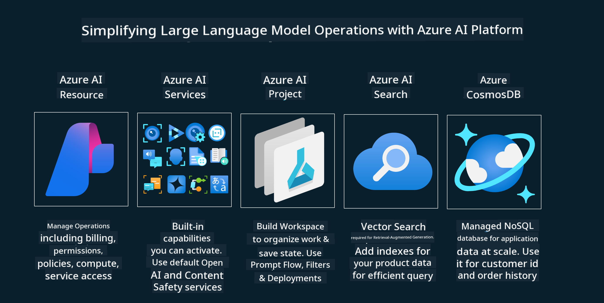
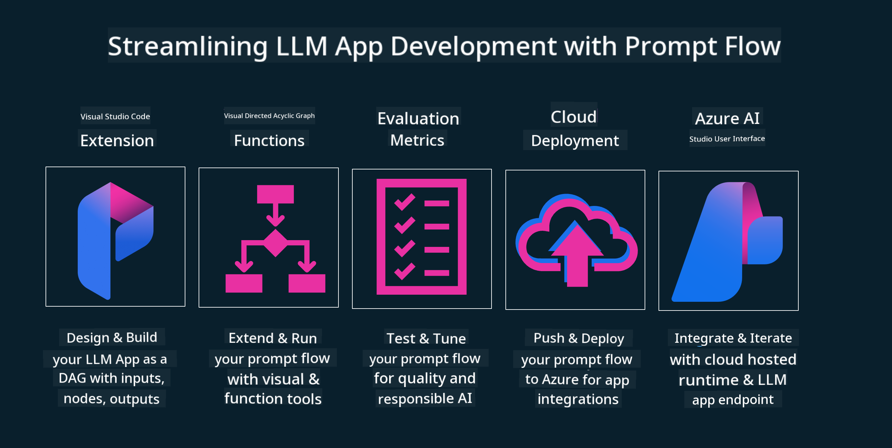

<!--
CO_OP_TRANSLATOR_METADATA:
{
  "original_hash": "27a5347a5022d5ef0a72ab029b03526a",
  "translation_date": "2025-05-19T23:17:37+00:00",
  "source_file": "14-the-generative-ai-application-lifecycle/README.md",
  "language_code": "en"
}
-->

# The Generative AI Application Lifecycle

An important question for all AI applications is the relevance of AI features. As AI is a rapidly evolving field, to ensure that your application remains relevant, reliable, and robust, you need to monitor, evaluate, and improve it continuously. This is where the generative AI lifecycle comes in.

The generative AI lifecycle is a framework that guides you through the stages of developing, deploying, and maintaining a generative AI application. It helps you define your goals, measure your performance, identify your challenges, and implement your solutions. It also helps you align your application with the ethical and legal standards of your domain and your stakeholders. By following the generative AI lifecycle, you can ensure that your application is always delivering value and satisfying your users.

## Introduction

In this chapter, you will:

- Understand the Paradigm Shift from MLOps to LLMOps
- The LLM Lifecycle
- Lifecycle Tooling
- Lifecycle Metrification and Evaluation

## Understand the Paradigm Shift from MLOps to LLMOps

LLMs are a new tool in the Artificial Intelligence arsenal. They are incredibly powerful in analysis and generation tasks for applications; however, this power has some consequences in how we streamline AI and Classic Machine Learning tasks.

With this, we need a new paradigm to adapt this tool dynamically, with the correct incentives. We can categorize older AI apps as "ML Apps" and newer AI Apps as "GenAI Apps" or just "AI Apps," reflecting the mainstream technology and techniques used at the time. This shifts our narrative in multiple ways. Look at the following comparison.

Notice that in LLMOps, we are more focused on the App Developers, using integrations as a key point, using "Models-as-a-Service" and considering the following points for metrics.

- Quality: Response quality
- Harm: Responsible AI
- Honesty: Response groundedness (Does it make sense? Is it correct?)
- Cost: Solution Budget
- Latency: Avg. time for token response

## The LLM Lifecycle

First, to understand the lifecycle and the modifications, let's note the next infographic.

As you may note, this is different from the usual Lifecycles from MLOps. LLMs have many new requirements, such as Prompting, different techniques to improve quality (Fine-Tuning, RAG, Meta-Prompts), different assessment and responsibility with responsible AI, and lastly, new evaluation metrics (Quality, Harm, Honesty, Cost, and Latency).

For instance, take a look at how we ideate. Using prompt engineering to experiment with various LLMs to explore possibilities to test if their hypothesis could be correct.

Note that this is not linear, but integrated loops, iterative and with an overarching cycle.

How could we explore those steps? Let's step into detail on how we could build a lifecycle.

This may look a bit complicated, let's focus on the three big steps first.

1. Ideating/Exploring: Exploration, here we can explore according to our business needs. Prototyping, creating a [PromptFlow](https://microsoft.github.io/promptflow/index.html?WT.mc_id=academic-105485-koreyst), and testing if it is efficient enough for our hypothesis.
2. Building/Augmenting: Implementation, now, we start to evaluate for bigger datasets, implement techniques like Fine-tuning and RAG to check the robustness of our solution. If it does not, re-implementing it, adding new steps in our flow, or restructuring the data might help. After testing our flow and our scale, if it works and we check our metrics, it is ready for the next step.
3. Operationalizing: Integration, now adding Monitoring and Alerts Systems to our system, deployment, and application integration to our Application.

Then, we have the overarching cycle of Management, focusing on security, compliance, and governance.

Congratulations, now you have your AI App ready to go and operational. For a hands-on experience, take a look at the [Contoso Chat Demo.](https://nitya.github.io/contoso-chat/?WT.mc_id=academic-105485-koreys)

Now, what tools could we use?

## Lifecycle Tooling

For Tooling, Microsoft provides the [Azure AI Platform](https://azure.microsoft.com/solutions/ai/?WT.mc_id=academic-105485-koreys) and [PromptFlow](https://microsoft.github.io/promptflow/index.html?WT.mc_id=academic-105485-koreyst) to facilitate and make your cycle easy to implement and ready to go.

The [Azure AI Platform](https://azure.microsoft.com/solutions/ai/?WT.mc_id=academic-105485-koreys) allows you to use [AI Studio](https://ai.azure.com/?WT.mc_id=academic-105485-koreys). AI Studio is a web portal that allows you to explore models, samples, and tools. Managing your resources, UI development flows, and SDK/CLI options for Code-First development.

Azure AI allows you to use multiple resources to manage your operations, services, projects, vector search, and database needs.

Construct, from Proof-of-Concept (POC) to large-scale applications with PromptFlow:

- Design and build apps from VS Code, with visual and functional tools
- Test and fine-tune your apps for quality AI, with ease
- Use Azure AI Studio to integrate and iterate with the cloud, push, and deploy for quick integration

## Great! Continue your Learning!

Amazing, now learn more about how we structure an application to use the concepts with the [Contoso Chat App](https://nitya.github.io/contoso-chat/?WT.mc_id=academic-105485-koreyst) to check how Cloud Advocacy adds those concepts in demonstrations. For more content, check our [Ignite breakout session!
](https://www.youtube.com/watch?v=DdOylyrTOWg)

Now, check Lesson 15 to understand how [Retrieval Augmented Generation and Vector Databases](../15-rag-and-vector-databases/README.md?WT.mc_id=academic-105485-koreyst) impact Generative AI and make more engaging applications!

**Disclaimer**:  
This document has been translated using AI translation service [Co-op Translator](https://github.com/Azure/co-op-translator). While we strive for accuracy, please be aware that automated translations may contain errors or inaccuracies. The original document in its native language should be considered the authoritative source. For critical information, professional human translation is recommended. We are not liable for any misunderstandings or misinterpretations arising from the use of this translation.