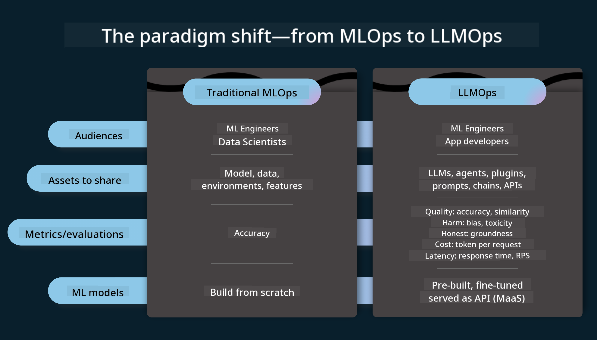

<!--
CO_OP_TRANSLATOR_METADATA:
{
  "original_hash": "27a5347a5022d5ef0a72ab029b03526a",
  "translation_date": "2025-07-09T15:46:09+00:00",
  "source_file": "14-the-generative-ai-application-lifecycle/README.md",
  "language_code": "en"
}
-->

# The Generative AI Application Lifecycle

A key question for all AI applications is how relevant their AI features remain, since AI is a rapidly evolving field. To keep your application relevant, reliable, and robust, you need to continuously monitor, evaluate, and improve it. This is where the generative AI lifecycle comes into play.

The generative AI lifecycle is a framework that guides you through the stages of developing, deploying, and maintaining a generative AI application. It helps you define your goals, measure performance, identify challenges, and implement solutions. It also ensures your application aligns with the ethical and legal standards of your domain and stakeholders. By following this lifecycle, you can make sure your application consistently delivers value and meets user expectations.

## Introduction

In this chapter, you will:

- Understand the Paradigm Shift from MLOps to LLMOps  
- Learn about the LLM Lifecycle  
- Explore Lifecycle Tooling  
- Dive into Lifecycle Metrics and Evaluation  

## Understand the Paradigm Shift from MLOps to LLMOps

LLMs are a new tool in the AI toolkit, offering powerful capabilities for analysis and generation tasks in applications. However, this power changes how we approach AI and traditional machine learning workflows.

Because of this, we need a new paradigm to adapt this tool dynamically and with the right incentives. We can categorize older AI applications as "ML Apps" and newer ones as "GenAI Apps" or simply "AI Apps," reflecting the mainstream technologies and techniques used at the time. This shift changes our perspective in several ways—see the comparison below.

Notice that in LLMOps, the focus shifts more toward App Developers, emphasizing integrations, using "Models-as-a-Service," and considering the following metrics:

- Quality: Response quality  
- Harm: Responsible AI  
- Honesty: Response groundedness (Does it make sense? Is it correct?)  
- Cost: Solution budget  
- Latency: Average time per token response  

## The LLM Lifecycle

To understand the lifecycle and its differences, take a look at the infographic below.

As you can see, this differs from traditional MLOps lifecycles. LLMs introduce new requirements such as prompting, various techniques to improve quality (Fine-Tuning, RAG, Meta-Prompts), new responsibilities around responsible AI, and new evaluation metrics (Quality, Harm, Honesty, Cost, and Latency).

For example, consider how we ideate: using prompt engineering to experiment with different LLMs to explore possibilities and test if our hypotheses hold.

Keep in mind this process isn’t linear but consists of integrated, iterative loops within an overarching cycle.

How can we explore these steps? Let’s dive into the details of building a lifecycle.

This might look complex, so let’s focus on the three main steps first:

1. Ideating/Exploring: Exploration based on business needs. Prototyping, creating a [PromptFlow](https://microsoft.github.io/promptflow/index.html?WT.mc_id=academic-105485-koreyst), and testing if it’s efficient enough for our hypothesis.  
2. Building/Augmenting: Implementation. Here, we evaluate larger datasets and apply techniques like Fine-tuning and RAG to check the robustness of our solution. If it doesn’t meet expectations, re-implementing, adding new steps, or restructuring data might help. After testing and scaling, if metrics look good, it’s ready for the next step.  
3. Operationalizing: Integration. Adding monitoring and alert systems, deployment, and integrating the application into your environment.  

Overarching all these is the management cycle, focusing on security, compliance, and governance.

Congratulations, your AI app is now ready and operational! For a hands-on experience, check out the [Contoso Chat Demo.](https://nitya.github.io/contoso-chat/?WT.mc_id=academic-105485-koreys)

What tools can we use?

## Lifecycle Tooling

For tooling, Microsoft offers the [Azure AI Platform](https://azure.microsoft.com/solutions/ai/?WT.mc_id=academic-105485-koreys) and [PromptFlow](https://microsoft.github.io/promptflow/index.html?WT.mc_id=academic-105485-koreyst), which make implementing and managing your lifecycle straightforward.

The [Azure AI Platform](https://azure.microsoft.com/solutions/ai/?WT.mc_id=academic-105485-koreys) includes [AI Studio](https://ai.azure.com/?WT.mc_id=academic-105485-koreys), a web portal where you can explore models, samples, and tools. It lets you manage resources, develop UI flows, and use SDK/CLI options for code-first development.

Azure AI provides multiple resources to manage your operations, services, projects, vector search, and database needs.

Build from Proof-of-Concept (POC) to large-scale applications with PromptFlow:

- Design and build apps from VS Code using visual and functional tools  
- Test and fine-tune your apps for high-quality AI with ease  
- Use Azure AI Studio to integrate and iterate in the cloud, then push and deploy for quick integration  

## Great! Continue your Learning!

Awesome! Now learn more about structuring an application using these concepts with the [Contoso Chat App](https://nitya.github.io/contoso-chat/?WT.mc_id=academic-105485-koreyst), which shows how Cloud Advocacy incorporates these ideas in demos. For more content, check out our [Ignite breakout session!](https://www.youtube.com/watch?v=DdOylyrTOWg)

Next, move on to Lesson 15 to understand how [Retrieval Augmented Generation and Vector Databases](../15-rag-and-vector-databases/README.md?WT.mc_id=academic-105485-koreyst) impact Generative AI and help create more engaging applications!

**Disclaimer**:  
This document has been translated using the AI translation service [Co-op Translator](https://github.com/Azure/co-op-translator). While we strive for accuracy, please be aware that automated translations may contain errors or inaccuracies. The original document in its native language should be considered the authoritative source. For critical information, professional human translation is recommended. We are not liable for any misunderstandings or misinterpretations arising from the use of this translation.