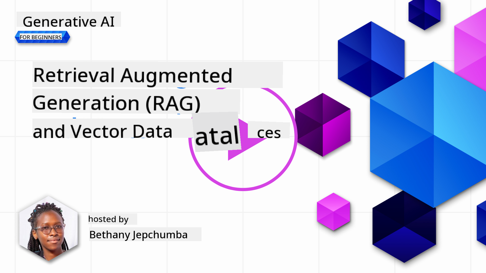

<!--
CO_OP_TRANSLATOR_METADATA:
{
  "original_hash": "e2861bbca91c0567ef32bc77fe054f9e",
  "translation_date": "2025-07-09T16:00:58+00:00",
  "source_file": "15-rag-and-vector-databases/README.md",
  "language_code": "en"
}
-->
# Retrieval Augmented Generation (RAG) and Vector Databases

[](https://aka.ms/gen-ai-lesson15-gh?WT.mc_id=academic-105485-koreyst)

In the search applications lesson, we briefly explored how to integrate your own data into Large Language Models (LLMs). In this lesson, we’ll dive deeper into grounding your data within your LLM application, the process mechanics, and methods for storing data, including both embeddings and text.

> **Video Coming Soon**

## Introduction

In this lesson, we will cover:

- An introduction to RAG, what it is, and why it’s used in AI (artificial intelligence).

- Understanding vector databases and how to create one for our application.

- A practical example of integrating RAG into an application.

## Learning Goals

By the end of this lesson, you will be able to:

- Explain the importance of RAG in data retrieval and processing.

- Set up a RAG application and ground your data to an LLM.

- Effectively integrate RAG and Vector Databases in LLM applications.

## Our Scenario: Enhancing our LLMs with Our Own Data

For this lesson, we want to add our own notes into the education startup, enabling the chatbot to access more information on various subjects. Using these notes, learners will be able to study more effectively and better understand different topics, making exam revision easier. To build our scenario, we will use:

- `Azure OpenAI:` the LLM powering our chatbot

- `AI for beginners' lesson on Neural Networks:` the data we will ground our LLM on

- `Azure AI Search` and `Azure Cosmos DB:` vector database to store our data and create a search index

Users will be able to create practice quizzes from their notes, revision flashcards, and summaries for concise overviews. To get started, let’s explore what RAG is and how it works:

## Retrieval Augmented Generation (RAG)

An LLM-powered chatbot processes user prompts to generate responses. It’s designed to be interactive and engage users on a wide range of topics. However, its responses are limited to the context provided and its foundational training data. For example, GPT-4’s knowledge cutoff is September 2021, so it lacks information on events after that date. Additionally, the data used to train LLMs excludes confidential information like personal notes or a company’s product manual.

### How RAGs (Retrieval Augmented Generation) Work


Suppose you want to deploy a chatbot that creates quizzes from your notes—you’ll need a connection to the knowledge base. This is where RAG comes in. RAGs operate as follows:

- **Knowledge base:** Before retrieval, documents must be ingested and preprocessed, typically by breaking large documents into smaller chunks, converting them into text embeddings, and storing them in a database.

- **User Query:** the user asks a question.

- **Retrieval:** When a user asks a question, the embedding model retrieves relevant information from the knowledge base to provide additional context that will be included in the prompt.

- **Augmented Generation:** the LLM enhances its response based on the retrieved data. This allows the response to be based not only on pre-trained data but also on relevant information from the added context. The retrieved data is used to augment the LLM’s responses, which then returns an answer to the user’s question.


The architecture for RAGs is implemented using transformers consisting of two parts: an encoder and a decoder. For example, when a user asks a question, the input text is ‘encoded’ into vectors capturing the meaning of words, and the vectors are ‘decoded’ into our document index to generate new text based on the user query. The LLM uses both an encoder-decoder model to generate the output.

Two approaches to implementing RAG according to the paper [Retrieval-Augmented Generation for Knowledge Intensive NLP Tasks](https://arxiv.org/pdf/2005.11401.pdf?WT.mc_id=academic-105485-koreyst) are:

- **_RAG-Sequence_**: uses retrieved documents to predict the best possible answer to a user query.

- **RAG-Token**: uses documents to generate the next token, then retrieves them to answer the user’s query.

### Why Use RAGs?

- **Information richness:** ensures text responses are up-to-date and current, improving performance on domain-specific tasks by accessing the internal knowledge base.

- Reduces fabrication by using **verifiable data** from the knowledge base to provide context for user queries.

- It is **cost-effective** as it is more economical than fine-tuning an LLM.

## Creating a Knowledge Base

Our application is based on our personal data, specifically the Neural Network lesson from the AI For Beginners curriculum.

### Vector Databases

A vector database, unlike traditional databases, is specialized for storing, managing, and searching embedded vectors. It stores numerical representations of documents. Breaking data down into numerical embeddings makes it easier for our AI system to understand and process.

We store embeddings in vector databases because LLMs have a limit on the number of tokens they accept as input. Since you can’t pass entire embeddings to an LLM, we break them into chunks. When a user asks a question, the embeddings most relevant to the question are returned along with the prompt. Chunking also reduces costs by limiting the number of tokens passed through the LLM.

Popular vector databases include Azure Cosmos DB, Clarifyai, Pinecone, Chromadb, ScaNN, Qdrant, and DeepLake. You can create an Azure Cosmos DB model using Azure CLI with the following command:

```bash
az login
az group create -n <resource-group-name> -l <location>
az cosmosdb create -n <cosmos-db-name> -r <resource-group-name>
az cosmosdb list-keys -n <cosmos-db-name> -g <resource-group-name>
```

### From Text to Embeddings

Before storing our data, we need to convert it into vector embeddings. If you’re working with large documents or long texts, you can chunk them based on expected queries. Chunking can be done at the sentence or paragraph level. Since chunking derives meaning from surrounding words, you can add additional context to a chunk, such as the document title or some text before or after the chunk. You can chunk the data as follows:

```python
def split_text(text, max_length, min_length):
    words = text.split()
    chunks = []
    current_chunk = []

    for word in words:
        current_chunk.append(word)
        if len(' '.join(current_chunk)) < max_length and len(' '.join(current_chunk)) > min_length:
            chunks.append(' '.join(current_chunk))
            current_chunk = []

    # If the last chunk didn't reach the minimum length, add it anyway
    if current_chunk:
        chunks.append(' '.join(current_chunk))

    return chunks
```

Once chunked, we embed the text using different embedding models. Some options include word2vec, OpenAI’s ada-002, Azure Computer Vision, and more. The choice of model depends on the languages you’re using, the type of content (text/images/audio), the input size it can encode, and the length of the embedding output.

An example of embedded text using OpenAI’s `text-embedding-ada-002` model is:


## Retrieval and Vector Search

When a user asks a question, the retriever converts it into a vector using the query encoder, then searches our document search index for relevant vectors related to the input. Afterward, it converts both the input vector and document vectors back into text and passes them through the LLM.

### Retrieval

Retrieval happens when the system quickly finds documents from the index that meet the search criteria. The retriever’s goal is to fetch documents that provide context and ground the LLM in your data.

There are several ways to search within our database:

- **Keyword search:** used for text searches.

- **Semantic search:** uses the semantic meaning of words.

- **Vector search:** converts documents from text to vector representations using embedding models. Retrieval is done by querying documents whose vector representations are closest to the user’s question.

- **Hybrid:** a combination of keyword and vector search.

A challenge arises when there’s no similar response to the query in the database. The system will return the best available information, but you can use tactics like setting a maximum distance for relevance or using hybrid search that combines keywords and vector search. In this lesson, we’ll use hybrid search, combining vector and keyword search. We’ll store our data in a dataframe with columns containing the chunks and embeddings.

### Vector Similarity

The retriever searches the knowledge database for embeddings that are close together—the closest neighbors—as they represent similar texts. When a user asks a query, it’s first embedded, then matched with similar embeddings. The most common measure of similarity between vectors is cosine similarity, which is based on the angle between two vectors.

Other similarity measures include Euclidean distance, which is the straight-line distance between vector endpoints, and dot product, which measures the sum of the products of corresponding elements of two vectors.

### Search Index

Before performing retrieval, we need to build a search index for our knowledge base. An index stores embeddings and can quickly retrieve the most similar chunks, even in a large database. We can create our index locally using:

```python
from sklearn.neighbors import NearestNeighbors

embeddings = flattened_df['embeddings'].to_list()

# Create the search index
nbrs = NearestNeighbors(n_neighbors=5, algorithm='ball_tree').fit(embeddings)

# To query the index, you can use the kneighbors method
distances, indices = nbrs.kneighbors(embeddings)
```

### Re-ranking

After querying the database, you may need to sort results by relevance. A reranking LLM uses machine learning to improve search result relevance by ordering them from most to least relevant. Using Azure AI Search, reranking is done automatically with a semantic reranker. Here’s an example of how reranking works using nearest neighbors:

```python
# Find the most similar documents
distances, indices = nbrs.kneighbors([query_vector])

index = []
# Print the most similar documents
for i in range(3):
    index = indices[0][i]
    for index in indices[0]:
        print(flattened_df['chunks'].iloc[index])
        print(flattened_df['path'].iloc[index])
        print(flattened_df['distances'].iloc[index])
    else:
        print(f"Index {index} not found in DataFrame")
```

## Bringing It All Together

The final step is integrating our LLM to generate responses grounded in our data. We can implement it as follows:

```python
user_input = "what is a perceptron?"

def chatbot(user_input):
    # Convert the question to a query vector
    query_vector = create_embeddings(user_input)

    # Find the most similar documents
    distances, indices = nbrs.kneighbors([query_vector])

    # add documents to query  to provide context
    history = []
    for index in indices[0]:
        history.append(flattened_df['chunks'].iloc[index])

    # combine the history and the user input
    history.append(user_input)

    # create a message object
    messages=[
        {"role": "system", "content": "You are an AI assistant that helps with AI questions."},
        {"role": "user", "content": history[-1]}
    ]

    # use chat completion to generate a response
    response = openai.chat.completions.create(
        model="gpt-4",
        temperature=0.7,
        max_tokens=800,
        messages=messages
    )

    return response.choices[0].message

chatbot(user_input)
```

## Evaluating Our Application

### Evaluation Metrics

- Quality of responses: ensuring they sound natural, fluent, and human-like.

- Groundedness of data: evaluating whether the response is based on the supplied documents.

- Relevance: assessing if the response matches and relates to the question asked.

- Fluency: checking if the response is grammatically coherent.

## Use Cases for RAG and Vector Databases

There are many use cases where function calls can enhance your app, such as:

- Question and Answering: grounding your company data in a chat that employees can use to ask questions.

- Recommendation Systems: creating systems that match the most similar items, e.g., movies, restaurants, and more.

- Chatbot services: storing chat history and personalizing conversations based on user data.

- Image search based on vector embeddings, useful for image recognition and anomaly detection.

## Summary

We’ve covered the fundamentals of RAG, from adding data to the application, to user queries and outputs. To simplify RAG creation, you can use frameworks like Semantic Kernel, LangChain, or Autogen.

## Assignment

To continue learning about Retrieval Augmented Generation (RAG), you can:

- Build a front-end for the application using your preferred framework.

- Use a framework like LangChain or Semantic Kernel to recreate your application.

Congratulations on completing the lesson 👏.

## Learning Does Not Stop Here, Continue the Journey

After finishing this lesson, check out our [Generative AI Learning collection](https://aka.ms/genai-collection?WT.mc_id=academic-105485-koreyst) to keep advancing your Generative AI skills!

**Disclaimer**:  
This document has been translated using the AI translation service [Co-op Translator](https://github.com/Azure/co-op-translator). While we strive for accuracy, please be aware that automated translations may contain errors or inaccuracies. The original document in its native language should be considered the authoritative source. For critical information, professional human translation is recommended. We are not liable for any misunderstandings or misinterpretations arising from the use of this translation.