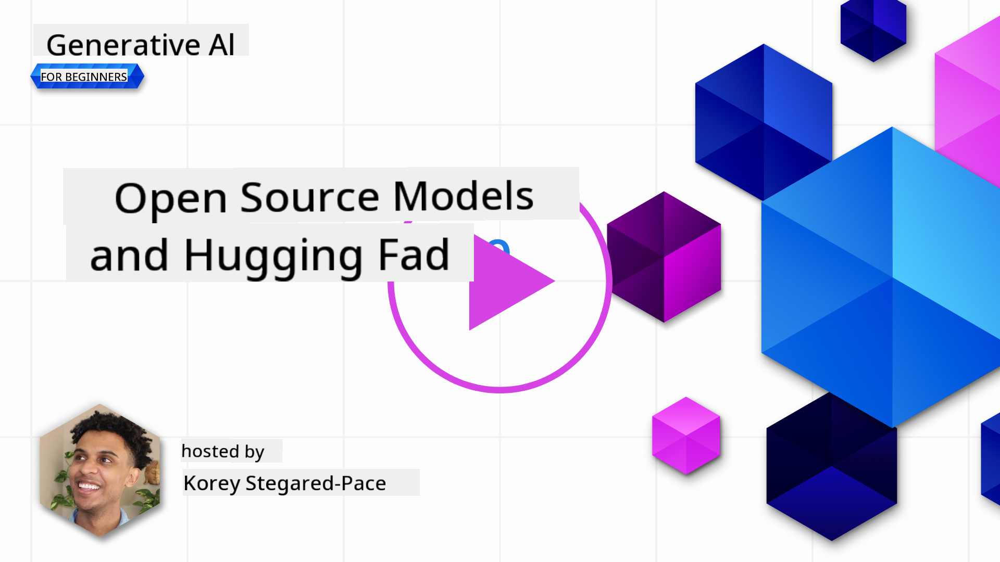
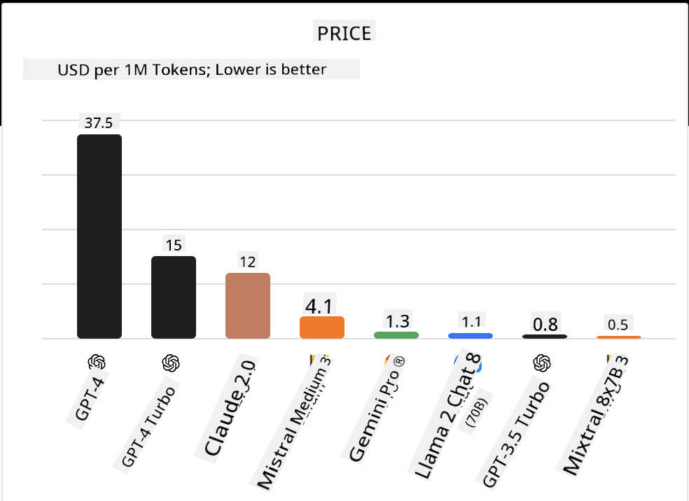
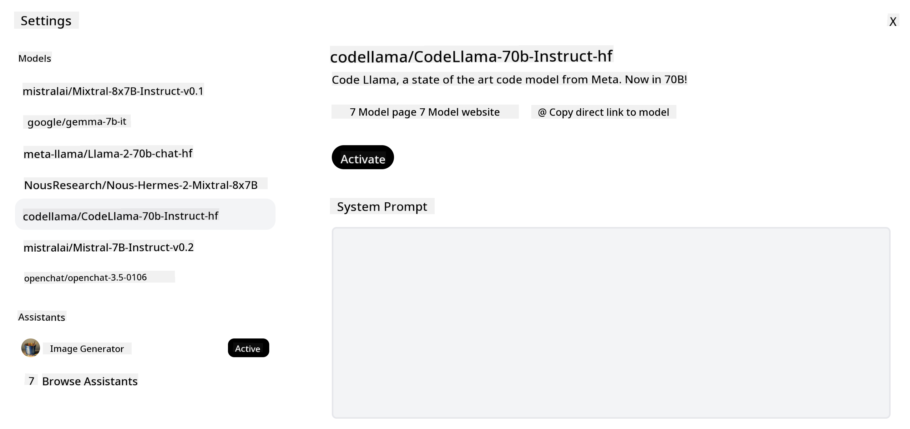
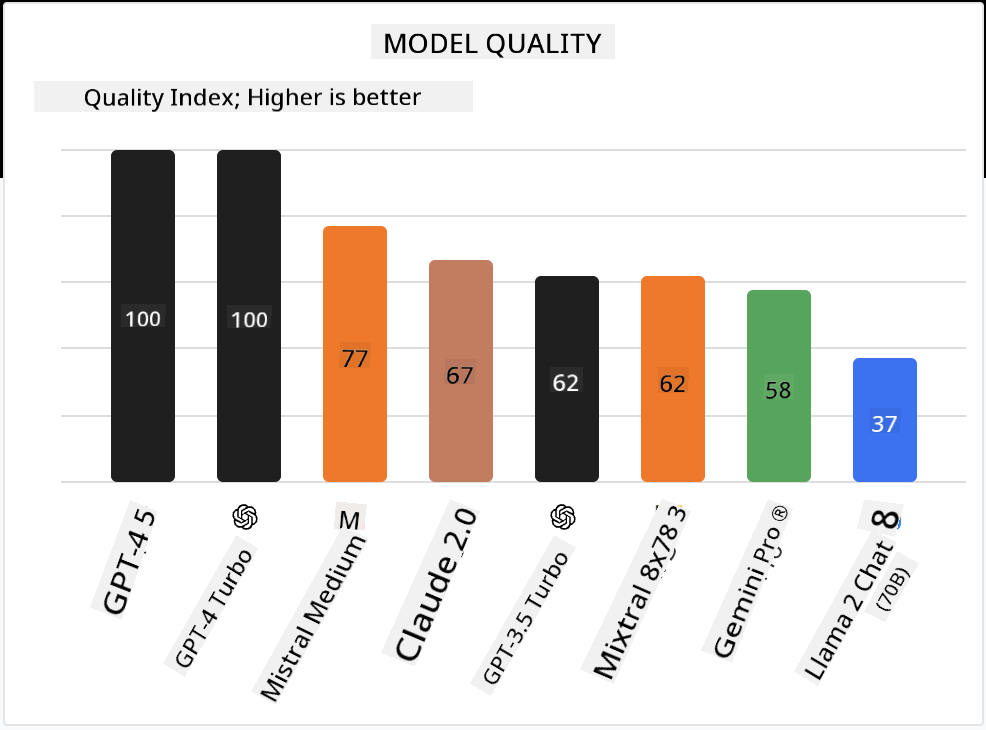

<!--
CO_OP_TRANSLATOR_METADATA:
{
  "original_hash": "0bba96e53ab841d99db731892a51fab8",
  "translation_date": "2025-07-09T17:02:33+00:00",
  "source_file": "16-open-source-models/README.md",
  "language_code": "en"
}
-->

## Introduction

The world of open-source LLMs is exciting and constantly evolving. This lesson aims to provide a deep dive into open source models. If you want to learn how proprietary models compare to open source ones, check out the ["Exploring and Comparing Different LLMs" lesson](../02-exploring-and-comparing-different-llms/README.md?WT.mc_id=academic-105485-koreyst). This lesson will also touch on fine-tuning, but for a more detailed explanation, see the ["Fine-Tuning LLMs" lesson](../18-fine-tuning/README.md?WT.mc_id=academic-105485-koreyst).

## Learning goals

- Understand open source Models
- Learn the benefits of working with open source Models
- Explore the open models available on Hugging Face and Azure AI Studio

## What are Open Source Models?

Open source software has been key to technological growth across many fields. The Open Source Initiative (OSI) has defined [10 criteria for software](https://web.archive.org/web/20241126001143/https://opensource.org/osd?WT.mc_id=academic-105485-koreyst) to be considered open source. The source code must be publicly shared under an OSI-approved license.

While developing LLMs shares similarities with software development, the process isn’t exactly the same. This has sparked much debate in the community about what open source means in the context of LLMs. For a model to fit the traditional open source definition, the following should be publicly available:

- The datasets used for training the model.
- Full model weights from training.
- The evaluation code.
- The fine-tuning code.
- Full model weights and training metrics.

Currently, only a few models meet these criteria. One example is the [OLMo model created by Allen Institute for Artificial Intelligence (AllenAI)](https://huggingface.co/allenai/OLMo-7B?WT.mc_id=academic-105485-koreyst).

For this lesson, we’ll refer to these as "open models" since they may not fully meet the above criteria at the time of writing.

## Benefits of Open Models

**Highly Customizable** – Because open models come with detailed training information, researchers and developers can modify the model’s internals. This allows for creating highly specialized models fine-tuned for specific tasks or fields, such as code generation, mathematical operations, or biology.

**Cost** – The cost per token for using and deploying these models is generally lower than proprietary models. When building Generative AI applications, it’s important to consider performance versus price for your specific use case.

  
Source: Artificial Analysis

**Flexibility** – Open models give you the freedom to use different models or combine them. For example, [HuggingChat Assistants](https://huggingface.co/chat?WT.mc_id=academic-105485-koreyst) lets users select the model directly in the interface:

## Exploring Different Open Models

### Llama 2

[LLama2](https://huggingface.co/meta-llama?WT.mc_id=academic-105485-koreyst), developed by Meta, is an open model optimized for chat-based applications. This is thanks to its fine-tuning method, which included a large amount of dialogue and human feedback. This approach helps the model generate responses that better align with human expectations, improving the user experience.

Some fine-tuned versions of Llama include [Japanese Llama](https://huggingface.co/elyza/ELYZA-japanese-Llama-2-7b?WT.mc_id=academic-105485-koreyst), specialized in Japanese, and [Llama Pro](https://huggingface.co/TencentARC/LLaMA-Pro-8B?WT.mc_id=academic-105485-koreyst), an enhanced version of the base model.

### Mistral

[Mistral](https://huggingface.co/mistralai?WT.mc_id=academic-105485-koreyst) is an open model focused on high performance and efficiency. It uses a Mixture-of-Experts approach, combining a group of specialized expert models into one system. Depending on the input, specific models are selected, making computation more efficient by only processing inputs they specialize in.

Fine-tuned versions of Mistral include [BioMistral](https://huggingface.co/BioMistral/BioMistral-7B?text=Mon+nom+est+Thomas+et+mon+principal?WT.mc_id=academic-105485-koreyst), focused on the medical domain, and [OpenMath Mistral](https://huggingface.co/nvidia/OpenMath-Mistral-7B-v0.1-hf?WT.mc_id=academic-105485-koreyst), which handles mathematical computations.

### Falcon

[Falcon](https://huggingface.co/tiiuae?WT.mc_id=academic-105485-koreyst) is an LLM developed by the Technology Innovation Institute (**TII**). Falcon-40B was trained with 40 billion parameters and has been shown to outperform GPT-3 while requiring less compute. This is due to its use of the FlashAttention algorithm and multiquery attention, which reduce memory needs during inference. Thanks to faster inference, Falcon-40B is well-suited for chat applications.

Fine-tuned versions of Falcon include [OpenAssistant](https://huggingface.co/OpenAssistant/falcon-40b-sft-top1-560?WT.mc_id=academic-105485-koreyst), an assistant built on open models, and [GPT4ALL](https://huggingface.co/nomic-ai/gpt4all-falcon?WT.mc_id=academic-105485-koreyst), which offers better performance than the base model.

## How to Choose

There’s no one-size-fits-all answer for choosing an open model. A good starting point is using Azure AI Studio’s filter-by-task feature to see what tasks a model has been trained for. Hugging Face also maintains an LLM Leaderboard showing top-performing models based on various metrics.

For comparing LLMs across different types, [Artificial Analysis](https://artificialanalysis.ai/?WT.mc_id=academic-105485-koreyst) is another excellent resource:

  
Source: Artificial Analysis

If you’re working on a specific use case, searching for fine-tuned models focused on that area can be effective. Trying out multiple open models to see how they perform based on your and your users’ needs is also a good approach.

## Next Steps

The best part about open models is that you can start working with them quickly. Check out the [Azure AI Studio Model Catalog](https://ai.azure.com?WT.mc_id=academic-105485-koreyst), which features a dedicated Hugging Face collection with the models we discussed here.

## Learning does not stop here, continue the Journey

After finishing this lesson, explore our [Generative AI Learning collection](https://aka.ms/genai-collection?WT.mc_id=academic-105485-koreyst) to keep advancing your Generative AI skills!

**Disclaimer**:  
This document has been translated using the AI translation service [Co-op Translator](https://github.com/Azure/co-op-translator). While we strive for accuracy, please be aware that automated translations may contain errors or inaccuracies. The original document in its native language should be considered the authoritative source. For critical information, professional human translation is recommended. We are not liable for any misunderstandings or misinterpretations arising from the use of this translation.