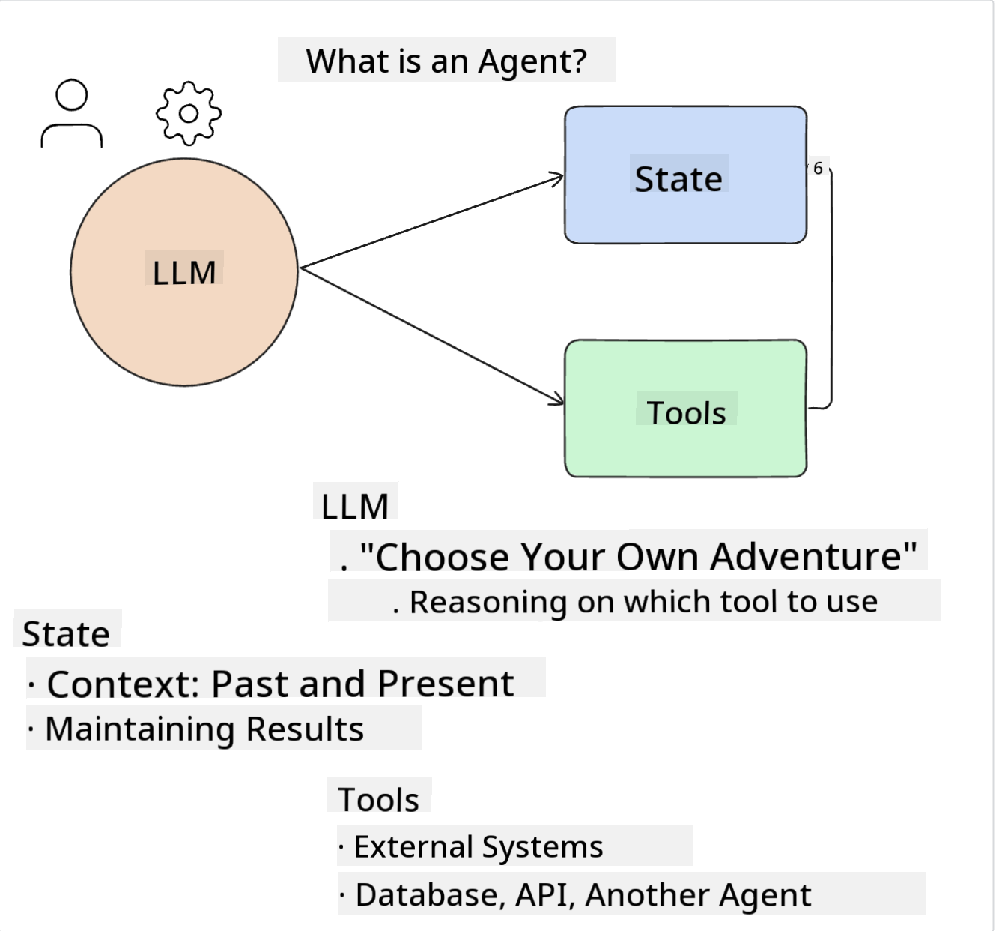
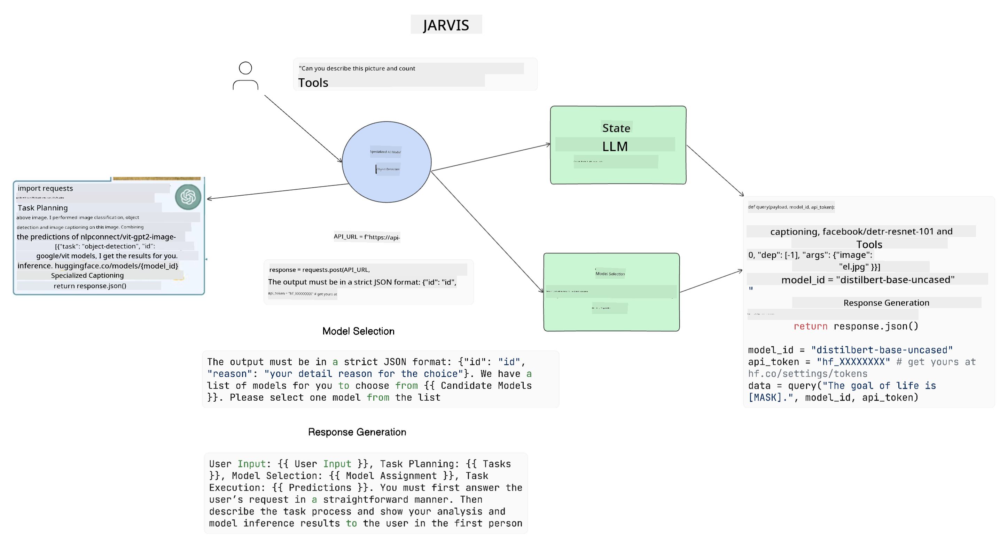

<!--
CO_OP_TRANSLATOR_METADATA:
{
  "original_hash": "8e8d1f6a63da606af7176a87ff8e92b6",
  "translation_date": "2025-10-17T22:35:14+00:00",
  "source_file": "17-ai-agents/README.md",
  "language_code": "en"
}
-->
[](https://youtu.be/yAXVW-lUINc?si=bOtW9nL6jc3XJgOM)

## Introduction

AI Agents are an exciting advancement in Generative AI, transforming Large Language Models (LLMs) from simple assistants into agents capable of taking actions. AI Agent frameworks allow developers to build applications that provide LLMs with access to tools and state management. These frameworks also improve transparency, enabling users and developers to observe the actions planned by LLMs, which enhances the overall user experience.

This lesson will cover the following topics:

- Understanding AI Agents - What are AI Agents?
- Exploring four different AI Agent frameworks - What makes each unique?
- Applying AI Agents to various use cases - When should AI Agents be used?

## Learning goals

By the end of this lesson, you will be able to:

- Explain what AI Agents are and how they can be utilized.
- Understand the differences between some popular AI Agent frameworks and their unique features.
- Comprehend how AI Agents operate to build applications using them.

## What Are AI Agents?

AI Agents are an exciting area within Generative AI. However, this excitement can sometimes lead to confusion about the terminology and its applications. To simplify and encompass most tools referred to as AI Agents, we will use the following definition:

AI Agents enable Large Language Models (LLMs) to perform tasks by providing them access to **state** and **tools**.



Let’s define these terms:

**Large Language Models** - These are the models discussed throughout this course, such as GPT-3.5, GPT-4, Llama-2, etc.

**State** - This refers to the context in which the LLM operates. The LLM uses the context of its previous actions and the current situation to guide its decision-making for subsequent actions. AI Agent frameworks make it easier for developers to maintain this context.

**Tools** - To accomplish the tasks requested by the user and planned by the LLM, the LLM needs access to tools. Examples of tools include databases, APIs, external applications, or even other LLMs.

These definitions should provide a solid foundation as we delve into their implementation. Let’s explore a few different AI Agent frameworks:

## LangChain Agents

[LangChain Agents](https://python.langchain.com/docs/how_to/#agents?WT.mc_id=academic-105485-koreyst) are an implementation of the definitions provided above.

To manage the **state**, LangChain uses a built-in function called `AgentExecutor`. This function accepts the defined `agent` and the `tools` available to it.

The `AgentExecutor` also stores the chat history to provide context for the conversation.


LangChain offers a [catalog of tools](https://integrations.langchain.com/tools?WT.mc_id=academic-105485-koreyst) that can be integrated into your application, allowing the LLM to access them. These tools are created by the community and the LangChain team.

You can define these tools and pass them to the `AgentExecutor`.

Visibility is another crucial aspect of AI Agents. It’s important for application developers to understand which tool the LLM is using and why. To address this, the LangChain team has developed LangSmith.

## AutoGen

The next AI Agent framework we’ll discuss is [AutoGen](https://microsoft.github.io/autogen/?WT.mc_id=academic-105485-koreyst). AutoGen primarily focuses on conversations. Its agents are both **conversable** and **customizable**.

**Conversable** - LLMs can initiate and continue conversations with other LLMs to complete tasks. This is achieved by creating `AssistantAgents` and providing them with specific system messages.

```python

autogen.AssistantAgent( name="Coder", llm_config=llm_config, ) pm = autogen.AssistantAgent( name="Product_manager", system_message="Creative in software product ideas.", llm_config=llm_config, )

```

**Customizable** - Agents can be defined not only as LLMs but also as users or tools. Developers can create a `UserProxyAgent`, which interacts with the user to gather feedback for completing a task. This feedback can either continue or halt the task execution.

```python
user_proxy = UserProxyAgent(name="user_proxy")
```

### State and Tools

To manage and modify the state, an assistant agent generates Python code to complete the task.

Here’s an example of the process:


#### LLM Defined with a System Message

```python
system_message="For weather related tasks, only use the functions you have been provided with. Reply TERMINATE when the task is done."
```

This system message directs the specific LLM to identify the functions relevant to its task. With AutoGen, you can define multiple AssistantAgents, each with different system messages.

#### Chat is Initiated by User

```python
user_proxy.initiate_chat( chatbot, message="I am planning a trip to NYC next week, can you help me pick out what to wear? ", )

```

The user_proxy (Human) initiates the process by sending a message, prompting the agent to explore the functions it should execute.

#### Function is Executed

```bash
chatbot (to user_proxy):

***** Suggested tool Call: get_weather ***** Arguments: {"location":"New York City, NY","time_periond:"7","temperature_unit":"Celsius"} ******************************************************** --------------------------------------------------------------------------------

>>>>>>>> EXECUTING FUNCTION get_weather... user_proxy (to chatbot): ***** Response from calling function "get_weather" ***** 112.22727272727272 EUR ****************************************************************

```

After processing the initial chat, the agent suggests a tool to call. In this example, the function is `get_weather`. Depending on your configuration, this function can be executed automatically by the agent or based on user input.

You can explore [AutoGen code samples](https://microsoft.github.io/autogen/docs/Examples/?WT.mc_id=academic-105485-koreyst) to learn more about building with AutoGen.

## Taskweaver

The next agent framework we’ll examine is [Taskweaver](https://microsoft.github.io/TaskWeaver/?WT.mc_id=academic-105485-koreyst). Taskweaver is considered a "code-first" agent because, instead of working solely with `strings`, it can handle DataFrames in Python. This is particularly useful for tasks involving data analysis and generation, such as creating graphs, charts, or random numbers.

### State and Tools

Taskweaver manages the state of the conversation using a `Planner`. The `Planner` is an LLM that takes user requests and maps out the tasks required to fulfill them.

To complete these tasks, the `Planner` accesses a collection of tools called `Plugins`. These can be Python classes or general code interpreters. The plugins are stored as embeddings, enabling the LLM to better identify the appropriate plugin.


Here’s an example of a plugin for anomaly detection:

```python
class AnomalyDetectionPlugin(Plugin): def __call__(self, df: pd.DataFrame, time_col_name: str, value_col_name: str):
```

The code is verified before execution. Another feature for managing context in Taskweaver is `experience`. This allows the conversation context to be stored long-term in a YAML file. It can be configured to help the LLM improve over time by learning from previous conversations.

## JARVIS

The final agent framework we’ll explore is [JARVIS](https://github.com/microsoft/JARVIS?tab=readme-ov-file?WT.mc_id=academic-105485-koreyst). JARVIS stands out because it uses an LLM to manage the `state` of the conversation, while the `tools` are other AI models. These specialized AI models perform specific tasks, such as object detection, transcription, or image captioning.



The LLM, as a general-purpose model, receives the user’s request, identifies the specific task, and determines the necessary arguments/data to complete it.

```python
[{"task": "object-detection", "id": 0, "dep": [-1], "args": {"image": "e1.jpg" }}]
```

The LLM then formats the request in a way that the specialized AI model can understand, such as JSON. Once the AI model completes the task and returns its prediction, the LLM processes the response.

If multiple models are needed to complete the task, the LLM integrates the responses from these models before delivering the final output to the user.

The example below demonstrates how this process works when a user requests a description and count of objects in an image:

## Assignment

To further your understanding of AI Agents, try building with AutoGen:

- Develop an application that simulates a business meeting involving different departments of an education startup.
- Create system messages to help LLMs understand various personas and priorities, enabling the user to pitch a new product idea.
- The LLM should then generate follow-up questions from each department to refine and enhance the pitch and product idea.

## Learning does not stop here, continue the Journey

After completing this lesson, explore our [Generative AI Learning collection](https://aka.ms/genai-collection?WT.mc_id=academic-105485-koreyst) to continue advancing your knowledge of Generative AI!

---

**Disclaimer**:  
This document has been translated using the AI translation service [Co-op Translator](https://github.com/Azure/co-op-translator). While we aim for accuracy, please note that automated translations may include errors or inaccuracies. The original document in its native language should be regarded as the authoritative source. For critical information, professional human translation is advised. We are not responsible for any misunderstandings or misinterpretations resulting from the use of this translation.