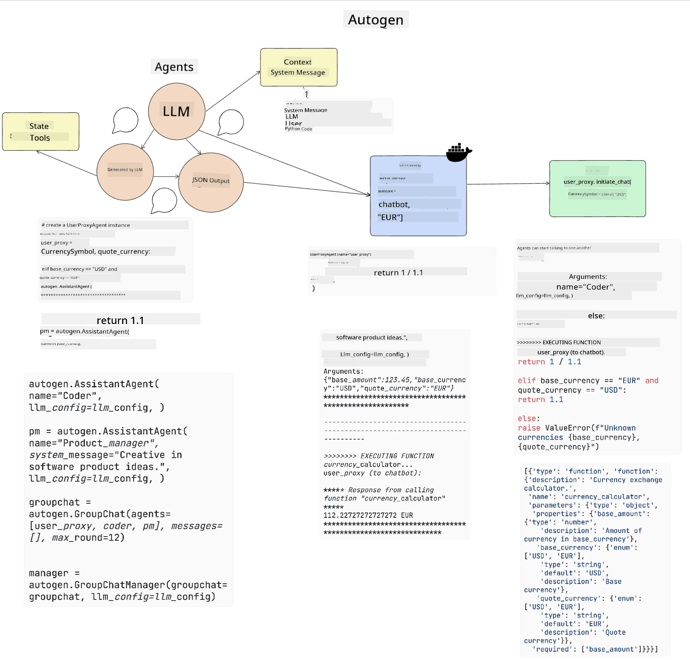
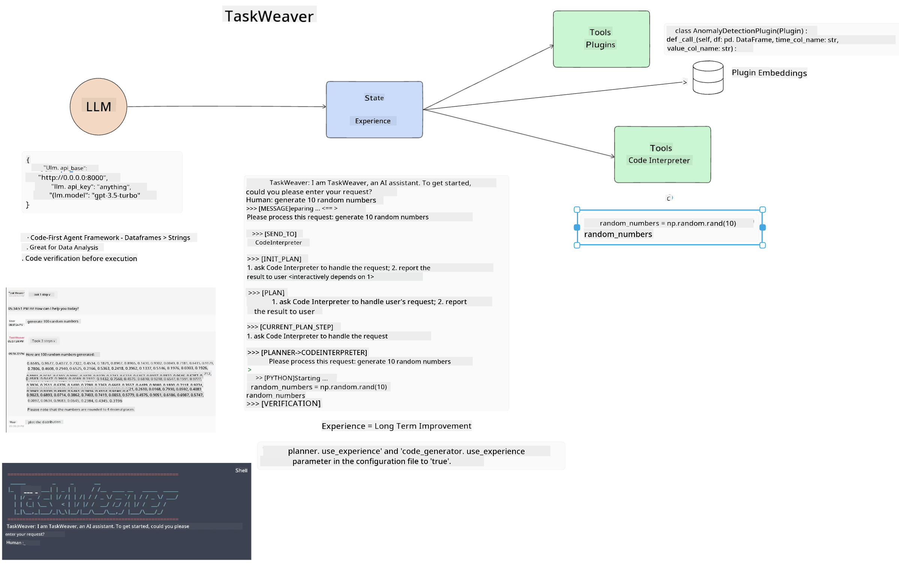

<!--
CO_OP_TRANSLATOR_METADATA:
{
  "original_hash": "11f03c81f190d9cbafd0f977dcbede6c",
  "translation_date": "2025-07-09T17:17:13+00:00",
  "source_file": "17-ai-agents/README.md",
  "language_code": "en"
}
-->
[](https://aka.ms/gen-ai-lesson17-gh?WT.mc_id=academic-105485-koreyst)

## Introduction

AI Agents represent an exciting advancement in Generative AI, allowing Large Language Models (LLMs) to evolve from assistants into agents that can take actions. AI Agent frameworks enable developers to build applications that provide LLMs with access to tools and state management. These frameworks also improve transparency, letting users and developers track the actions planned by LLMs, which enhances experience management.

This lesson will cover the following topics:

- Understanding what an AI Agent is – What exactly is an AI Agent?
- Exploring four different AI Agent Frameworks – What makes each unique?
- Applying these AI Agents to various use cases – When should we use AI Agents?

## Learning goals

By the end of this lesson, you will be able to:

- Explain what AI Agents are and how they can be used.
- Understand the differences between some popular AI Agent Frameworks and how they vary.
- Understand how AI Agents work to build applications using them.

## What Are AI Agents?

AI Agents are a very exciting area in Generative AI. With this excitement, there can sometimes be confusion around the terms and their applications. To keep things simple and inclusive of most tools that refer to AI Agents, we will use this definition:

AI Agents allow Large Language Models (LLMs) to perform tasks by giving them access to a **state** and **tools**.


Let’s define these terms:

**Large Language Models** – These are the models referenced throughout this course, such as GPT-3.5, GPT-4, Llama-2, and others.

**State** – This refers to the context in which the LLM is operating. The LLM uses the context of its past actions and the current situation to guide its decisions for future actions. AI Agent Frameworks help developers manage this context more easily.

**Tools** – To complete the task requested by the user and planned by the LLM, the LLM needs access to tools. Examples of tools include databases, APIs, external applications, or even other LLMs!

These definitions should give you a solid foundation as we explore how these concepts are implemented. Let’s look at a few different AI Agent frameworks:

## LangChain Agents

[LangChain Agents](https://python.langchain.com/docs/how_to/#agents?WT.mc_id=academic-105485-koreyst) implement the definitions we just covered.

To manage the **state**, it uses a built-in function called the `AgentExecutor`. This accepts the defined `agent` and the available `tools`.

The `AgentExecutor` also stores the chat history to provide context for the conversation.


LangChain offers a [catalog of tools](https://integrations.langchain.com/tools?WT.mc_id=academic-105485-koreyst) that can be imported into your application for the LLM to access. These tools are created by the community and the LangChain team.

You can define these tools and pass them to the `AgentExecutor`.

Visibility is another key aspect when working with AI Agents. It’s important for developers to understand which tool the LLM is using and why. To support this, the LangChain team developed LangSmith.

## AutoGen

The next AI Agent framework we’ll discuss is [AutoGen](https://microsoft.github.io/autogen/?WT.mc_id=academic-105485-koreyst). AutoGen focuses primarily on conversations. Agents are both **conversable** and **customizable**.

**Conversable** – LLMs can start and continue conversations with other LLMs to complete a task. This is done by creating `AssistantAgents` and assigning them specific system messages.

```python

autogen.AssistantAgent( name="Coder", llm_config=llm_config, ) pm = autogen.AssistantAgent( name="Product_manager", system_message="Creative in software product ideas.", llm_config=llm_config, )

```

**Customizable** – Agents can be defined not only as LLMs but also as users or tools. As a developer, you can define a `UserProxyAgent` responsible for interacting with the user to gather feedback during task completion. This feedback can either continue or stop the task execution.

```python
user_proxy = UserProxyAgent(name="user_proxy")
```

### State and Tools

To manage and update state, an assistant Agent generates Python code to complete the task.

Here’s an example of the process:



#### LLM Defined with a System Message

```python
system_message="For weather related tasks, only use the functions you have been provided with. Reply TERMINATE when the task is done."
```

This system message directs the specific LLM on which functions are relevant for its task. Remember, with AutoGen you can have multiple defined AssistantAgents, each with different system messages.

#### Chat is Initiated by User

```python
user_proxy.initiate_chat( chatbot, message="I am planning a trip to NYC next week, can you help me pick out what to wear? ", )

```

This message from the user_proxy (Human) starts the Agent’s process to explore which functions it should execute.

#### Function is Executed

```bash
chatbot (to user_proxy):

***** Suggested tool Call: get_weather ***** Arguments: {"location":"New York City, NY","time_periond:"7","temperature_unit":"Celsius"} ******************************************************** --------------------------------------------------------------------------------

>>>>>>>> EXECUTING FUNCTION get_weather... user_proxy (to chatbot): ***** Response from calling function "get_weather" ***** 112.22727272727272 EUR ****************************************************************

```

After processing the initial chat, the Agent suggests a tool to call. In this case, it’s a function called `get_weather`. Depending on your setup, this function can be executed automatically and read by the Agent or executed based on user input.

You can find a list of [AutoGen code samples](https://microsoft.github.io/autogen/docs/Examples/?WT.mc_id=academic-105485-koreyst) to explore how to get started building.

## Taskweaver

The next agent framework we’ll explore is [Taskweaver](https://microsoft.github.io/TaskWeaver/?WT.mc_id=academic-105485-koreyst). It’s known as a "code-first" agent because instead of working strictly with `strings`, it can work with DataFrames in Python. This is especially useful for data analysis and generation tasks, such as creating graphs and charts or generating random numbers.

### State and Tools

To manage conversation state, TaskWeaver uses the concept of a `Planner`. The `Planner` is an LLM that takes user requests and maps out the tasks needed to fulfill them.

To complete these tasks, the `Planner` has access to a collection of tools called `Plugins`. These can be Python classes or a general code interpreter. These plugins are stored as embeddings so the LLM can better search for the right plugin.



Here’s an example of a plugin for anomaly detection:

```python
class AnomalyDetectionPlugin(Plugin): def __call__(self, df: pd.DataFrame, time_col_name: str, value_col_name: str):
```

The code is verified before execution. Another feature for managing context in Taskweaver is `experience`. Experience allows conversation context to be saved long-term in a YAML file. This can be configured so the LLM improves over time on certain tasks by learning from prior conversations.

## JARVIS

The last agent framework we’ll explore is [JARVIS](https://github.com/microsoft/JARVIS?tab=readme-ov-file?WT.mc_id=academic-105485-koreyst). What makes JARVIS unique is that it uses an LLM to manage the `state` of the conversation, while the `tools` are other AI models. Each AI model is specialized for specific tasks like object detection, transcription, or image captioning.


The LLM, as a general-purpose model, receives the user’s request and identifies the specific task and any arguments or data needed to complete it.

```python
[{"task": "object-detection", "id": 0, "dep": [-1], "args": {"image": "e1.jpg" }}]
```

The LLM then formats the request in a way the specialized AI model can understand, such as JSON. Once the AI model returns its prediction, the LLM receives the response.

If multiple models are needed to complete the task, the LLM interprets the responses from each before combining them to generate the final response to the user.

The example below shows how this works when a user requests a description and count of objects in an image:

## Assignment

To continue your learning about AI Agents, you can build with AutoGen:

- An application that simulates a business meeting with different departments of an education startup.
- Create system messages that guide LLMs to understand different personas and priorities, enabling the user to pitch a new product idea.
- The LLM should then generate follow-up questions from each department to refine and improve the pitch and product idea.

## Learning does not stop here, continue the Journey

After completing this lesson, check out our [Generative AI Learning collection](https://aka.ms/genai-collection?WT.mc_id=academic-105485-koreyst) to keep advancing your Generative AI knowledge!

**Disclaimer**:  
This document has been translated using the AI translation service [Co-op Translator](https://github.com/Azure/co-op-translator). While we strive for accuracy, please be aware that automated translations may contain errors or inaccuracies. The original document in its native language should be considered the authoritative source. For critical information, professional human translation is recommended. We are not liable for any misunderstandings or misinterpretations arising from the use of this translation.