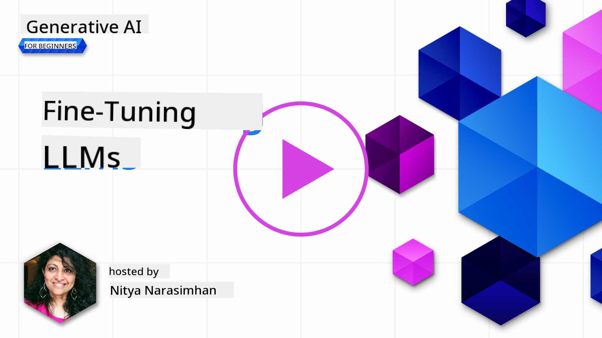
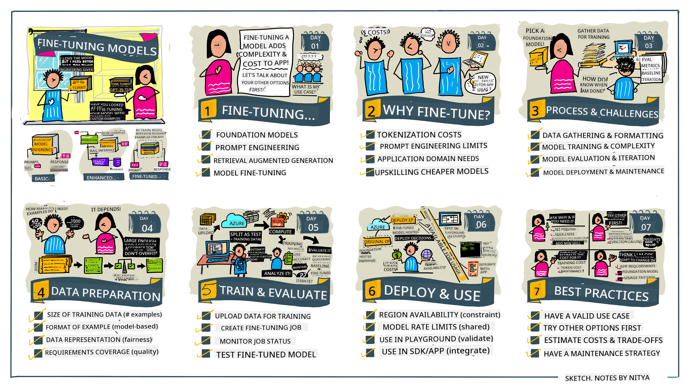

<!--
CO_OP_TRANSLATOR_METADATA:
{
  "original_hash": "68664f7e754a892ae1d8d5e2b7bd2081",
  "translation_date": "2025-07-09T17:33:54+00:00",
  "source_file": "18-fine-tuning/README.md",
  "language_code": "en"
}
-->

# Fine-Tuning Your LLM

Using large language models to build generative AI applications brings new challenges. A key issue is ensuring the quality of responses (accuracy and relevance) generated by the model for a given user request. In previous lessons, we covered techniques like prompt engineering and retrieval-augmented generation that try to solve this by _modifying the prompt input_ to the existing model.

In today’s lesson, we’ll explore a third technique, **fine-tuning**, which addresses the challenge by _retraining the model itself_ with additional data. Let’s dive into the details.

## Learning Objectives

This lesson introduces the concept of fine-tuning for pre-trained language models, explores the benefits and challenges of this approach, and offers guidance on when and how to use fine-tuning to improve the performance of your generative AI models.

By the end of this lesson, you should be able to answer:

- What is fine-tuning for language models?
- When and why is fine-tuning useful?
- How can I fine-tune a pre-trained model?
- What are the limitations of fine-tuning?

Ready? Let’s get started.

## Illustrated Guide

Want an overview of what we’ll cover before diving in? Check out this illustrated guide that outlines the learning journey for this lesson—from understanding the core concepts and motivation for fine-tuning to the process and best practices for carrying out fine-tuning. This is a fascinating topic, so don’t forget to visit the [Resources](./RESOURCES.md?WT.mc_id=academic-105485-koreyst) page for additional links to support your self-guided learning!

## What is fine-tuning for language models?

By definition, large language models are _pre-trained_ on vast amounts of text from diverse sources, including the internet. As we’ve learned in previous lessons, techniques like _prompt engineering_ and _retrieval-augmented generation_ help improve the quality of the model’s responses to user prompts.

A common prompt-engineering method involves giving the model more guidance on what’s expected in the response, either by providing _instructions_ (explicit guidance) or _a few examples_ (implicit guidance). This is called _few-shot learning_, but it has two limitations:

- Model token limits restrict how many examples you can provide, limiting effectiveness.
- Token costs can make adding examples to every prompt expensive, reducing flexibility.

Fine-tuning is a common machine learning practice where a pre-trained model is retrained with new data to improve its performance on a specific task. For language models, we can fine-tune the pre-trained model _with a curated set of examples for a particular task or domain_ to create a **custom model** that’s more accurate and relevant for that use case. A bonus of fine-tuning is that it can reduce the number of examples needed for few-shot learning—lowering token usage and related costs.

## When and why should we fine-tune models?

Here, fine-tuning refers to **supervised** fine-tuning, where retraining is done by **adding new data** that wasn’t part of the original training set. This differs from unsupervised fine-tuning, where the model is retrained on the original data but with different hyperparameters.

The key point is that fine-tuning is an advanced technique requiring expertise to achieve good results. If done incorrectly, it may not improve performance and could even harm the model’s effectiveness for your target domain.

Before learning “how” to fine-tune, you need to understand “why” you should do it and “when” to start. Ask yourself:

- **Use Case**: What is your _use case_ for fine-tuning? What part of the current pre-trained model do you want to improve?
- **Alternatives**: Have you tried _other techniques_ to reach your goals? Use them as a baseline.
  - Prompt engineering: Try few-shot prompting with relevant examples. Evaluate response quality.
  - Retrieval Augmented Generation: Try augmenting prompts with search results from your data. Evaluate response quality.
- **Costs**: Have you identified the costs of fine-tuning?
  - Tunability – is the pre-trained model available for fine-tuning?
  - Effort – preparing training data, evaluating, and refining the model.
  - Compute – running fine-tuning jobs and deploying the fine-tuned model.
  - Data – access to enough quality examples to make fine-tuning effective.
- **Benefits**: Have you confirmed the benefits of fine-tuning?
  - Quality – does the fine-tuned model outperform the baseline?
  - Cost – does it reduce token usage by simplifying prompts?
  - Extensibility – can you adapt the base model for new domains?

Answering these questions will help you decide if fine-tuning is right for your use case. Ideally, the benefits should outweigh the costs. Once you decide to proceed, it’s time to consider _how_ to fine-tune the pre-trained model.

Want more insights on this decision? Watch [To fine-tune or not to fine-tune](https://www.youtube.com/watch?v=0Jo-z-MFxJs)

## How can we fine-tune a pre-trained model?

To fine-tune a pre-trained model, you need:

- a pre-trained model to fine-tune
- a dataset for fine-tuning
- a training environment to run the fine-tuning job
- a hosting environment to deploy the fine-tuned model

## Fine-Tuning In Action

The following resources provide step-by-step tutorials with real examples using selected models and curated datasets. To follow these tutorials, you’ll need an account with the provider and access to the relevant models and datasets.

| Provider     | Tutorial                                                                                                                                                                       | Description                                                                                                                                                                                                                                                                                                                                                                                                                        |
| ------------ | ------------------------------------------------------------------------------------------------------------------------------------------------------------------------------ | ---------------------------------------------------------------------------------------------------------------------------------------------------------------------------------------------------------------------------------------------------------------------------------------------------------------------------------------------------------------------------------------------------------------------------------- |
| OpenAI       | [How to fine-tune chat models](https://github.com/openai/openai-cookbook/blob/main/examples/How_to_finetune_chat_models.ipynb?WT.mc_id=academic-105485-koreyst)                | Learn how to fine-tune a `gpt-35-turbo` model for a specific domain (“recipe assistant”) by preparing training data, running the fine-tuning job, and using the fine-tuned model for inference.                                                                                                                                                                                                                                      |
| Azure OpenAI | [GPT 3.5 Turbo fine-tuning tutorial](https://learn.microsoft.com/azure/ai-services/openai/tutorials/fine-tune?tabs=python-new%2Ccommand-line?WT.mc_id=academic-105485-koreyst) | Learn how to fine-tune a `gpt-35-turbo-0613` model **on Azure** by creating and uploading training data, running the fine-tuning job, then deploying and using the new model.                                                                                                                                                                                                                                                      |
| Hugging Face | [Fine-tuning LLMs with Hugging Face](https://www.philschmid.de/fine-tune-llms-in-2024-with-trl?WT.mc_id=academic-105485-koreyst)                                               | This blog post guides you through fine-tuning an _open LLM_ (e.g., `CodeLlama 7B`) using the [transformers](https://huggingface.co/docs/transformers/index?WT.mc_id=academic-105485-koreyst) library and [Transformer Reinforcement Learning (TRL)](https://huggingface.co/docs/trl/index?WT.mc_id=academic-105485-koreyst) with open [datasets](https://huggingface.co/docs/datasets/index?WT.mc_id=academic-105485-koreyst) on Hugging Face. |
|              |                                                                                                                                                                                |                                                                                                                                                                                                                                                                                                                                                                                                                                    |
| 🤗 AutoTrain | [Fine-tuning LLMs with AutoTrain](https://github.com/huggingface/autotrain-advanced/?WT.mc_id=academic-105485-koreyst)                                                         | AutoTrain (or AutoTrain Advanced) is a Python library by Hugging Face that supports fine-tuning for many tasks, including LLM fine-tuning. AutoTrain is a no-code solution that can run in your cloud, on Hugging Face Spaces, or locally. It supports a web-based GUI, CLI, and training via YAML config files.                                                                                                                        |
|              |                                                                                                                                                                                |                                                                                                                                                                                                                                                                                                                                                                                                                                    |

## Assignment

Choose one of the tutorials above and work through it. _We may replicate versions of these tutorials in Jupyter Notebooks in this repo for reference only. Please use the original sources directly to get the latest versions._

## Great Work! Continue Your Learning.

After finishing this lesson, check out our [Generative AI Learning collection](https://aka.ms/genai-collection?WT.mc_id=academic-105485-koreyst) to keep advancing your Generative AI skills!

Congratulations! You’ve completed the final lesson in the v2 series of this course! Keep learning and building. **Check out the [RESOURCES](RESOURCES.md?WT.mc_id=academic-105485-koreyst) page for more suggestions on this topic.**

Our v1 series has also been updated with more assignments and concepts. Take a moment to refresh your knowledge—and please [share your questions and feedback](https://github.com/microsoft/generative-ai-for-beginners/issues?WT.mc_id=academic-105485-koreyst) to help us improve these lessons for the community.

**Disclaimer**:  
This document has been translated using the AI translation service [Co-op Translator](https://github.com/Azure/co-op-translator). While we strive for accuracy, please be aware that automated translations may contain errors or inaccuracies. The original document in its native language should be considered the authoritative source. For critical information, professional human translation is recommended. We are not liable for any misunderstandings or misinterpretations arising from the use of this translation.